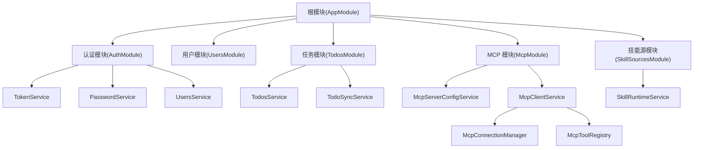
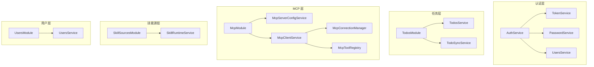
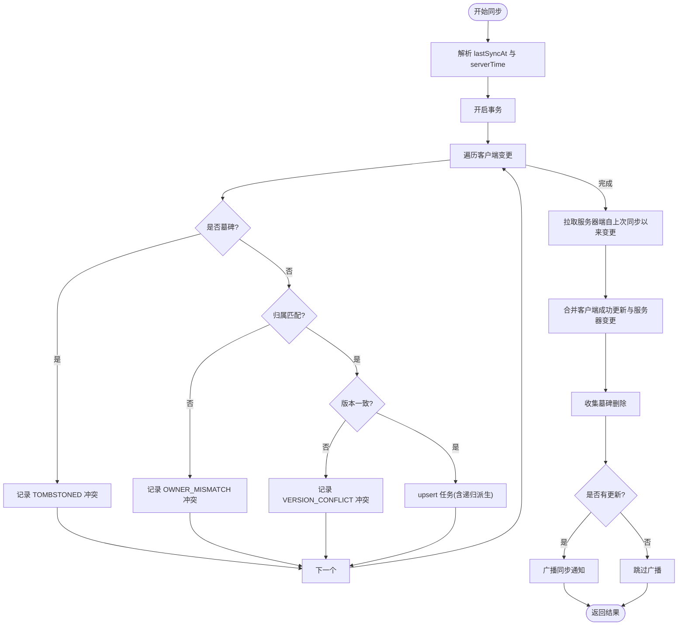
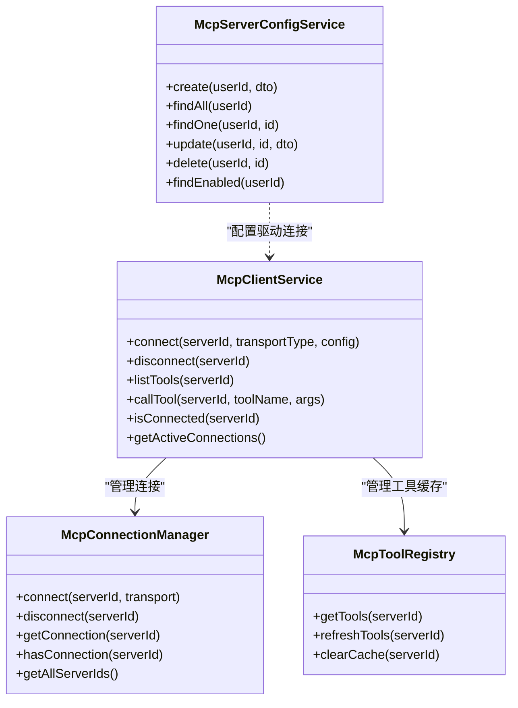
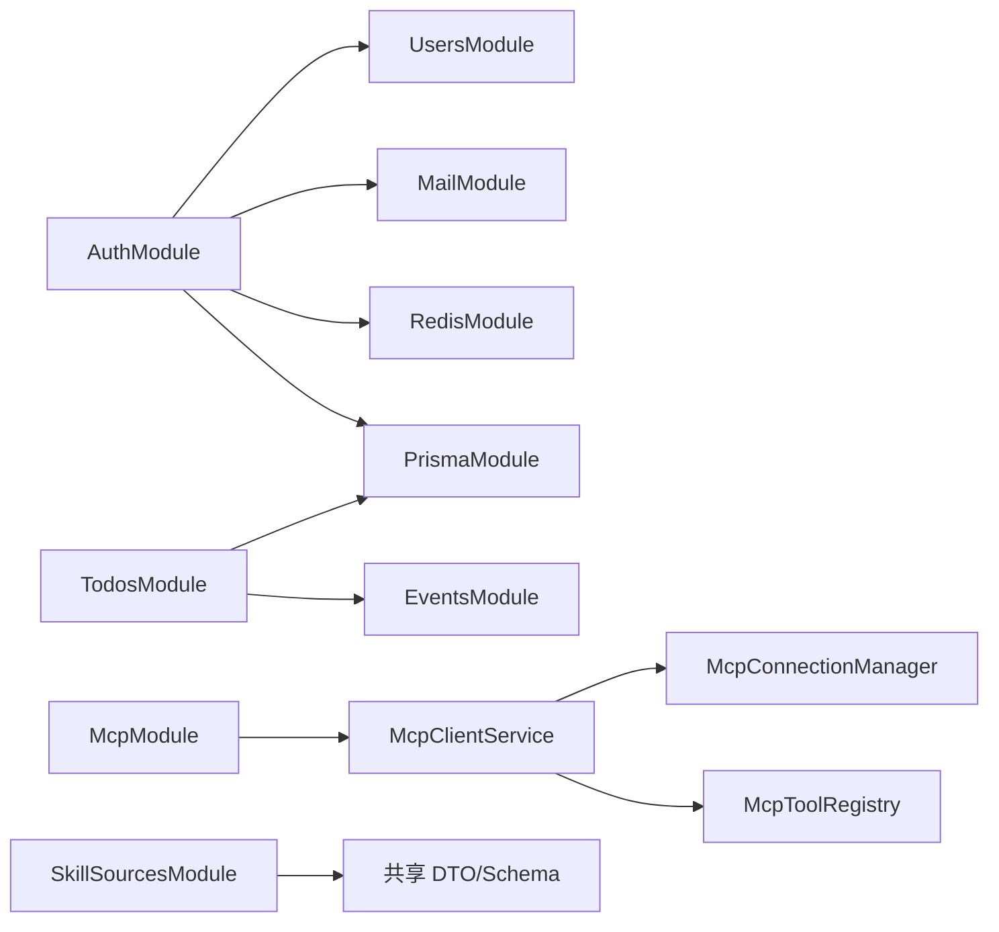

# 核心业务模块

<cite>
**本文引用的文件**
- [apps/backend/src/app.module.ts](file://apps/backend/src/app.module.ts)
- [apps/backend/src/auth/auth.module.ts](file://apps/backend/src/auth/auth.module.ts)
- [apps/backend/src/auth/auth.service.ts](file://apps/backend/src/auth/auth.service.ts)
- [apps/backend/src/auth/token.service.ts](file://apps/backend/src/auth/token.service.ts)
- [apps/backend/src/auth/password.service.ts](file://apps/backend/src/auth/password.service.ts)
- [apps/backend/src/todos/todos.module.ts](file://apps/backend/src/todos/todos.module.ts)
- [apps/backend/src/todos/todos.service.ts](file://apps/backend/src/todos/todos.service.ts)
- [apps/backend/src/todos/todos-sync.service.ts](file://apps/backend/src/todos/todos-sync.service.ts)
- [apps/backend/src/mcp/mcp.module.ts](file://apps/backend/src/mcp/mcp.module.ts)
- [apps/backend/src/mcp/mcp-server-config.service.ts](file://apps/backend/src/mcp/mcp-server-config.service.ts)
- [apps/backend/src/mcp/mcp-client.service.ts](file://apps/backend/src/mcp/mcp-client.service.ts)
- [apps/backend/src/mcp/core/mcp-connection.manager.ts](file://apps/backend/src/mcp/core/mcp-connection.manager.ts)
- [apps/backend/src/mcp/core/mcp-tool.registry.ts](file://apps/backend/src/mcp/core/mcp-tool.registry.ts)
- [apps/backend/src/skill-sources/skill-sources.module.ts](file://apps/backend/src/skill-sources/skill-sources.module.ts)
- [apps/backend/src/skill-sources/skill-runtime.service.ts](file://apps/backend/src/skill-sources/skill-runtime.service.ts)
- [apps/backend/src/users/users.module.ts](file://apps/backend/src/users/users.module.ts)
- [apps/backend/src/users/users.service.ts](file://apps/backend/src/users/users.service.ts)
</cite>

## 目录

1. [简介](#简介)
2. [项目结构](#项目结构)
3. [核心组件](#核心组件)
4. [架构总览](#架构总览)
5. [详细组件分析](#详细组件分析)
6. [依赖分析](#依赖分析)
7. [性能考虑](#性能考虑)
8. [故障排查指南](#故障排查指南)
9. [结论](#结论)
10. [附录](#附录)

## 简介

本文件聚焦 Lumina Todo 后端的核心业务模块，系统性梳理以下模块的职责边界、接口设计、依赖关系与数据流转，并提供扩展与自定义开发的最佳实践：

- 认证模块(AuthModule)：JWT 认证流程、密码管理机制、令牌刷新与失效策略
- 任务模块(TodosModule)：任务 CRUD、增量同步与冲突合并、回收站管理
- MCP 模块(McpModule)：服务器配置、工具发现、连接管理
- 用户模块(UsersModule)：用户信息管理、权限控制
- 技能源模块(SkillSourcesModule)：外部技能代理运行时执行

## 项目结构

后端采用 NestJS 模块化组织，根模块负责全局导入与守卫装配，各子模块按领域拆分，形成清晰的边界与依赖方向。



**图表来源**

- [apps/backend/src/app.module.ts:28-146](file://apps/backend/src/app.module.ts#L28-L146)
- [apps/backend/src/auth/auth.module.ts:19-39](file://apps/backend/src/auth/auth.module.ts#L19-L39)
- [apps/backend/src/todos/todos.module.ts:8-14](file://apps/backend/src/todos/todos.module.ts#L8-L14)
- [apps/backend/src/mcp/mcp.module.ts:13-24](file://apps/backend/src/mcp/mcp.module.ts#L13-L24)
- [apps/backend/src/skill-sources/skill-sources.module.ts:6-10](file://apps/backend/src/skill-sources/skill-sources.module.ts#L6-L10)

**章节来源**

- [apps/backend/src/app.module.ts:28-146](file://apps/backend/src/app.module.ts#L28-L146)

## 核心组件

- 认证模块(AuthModule)：整合 JWT、Redis 黑名单、邮件与用户服务，提供登录、注册、刷新、登出、密码重置等能力
- 任务模块(TodosModule)：提供任务查询、回收站管理、永久删除、清空回收站；通过增量同步服务实现多端一致性
- MCP 模块(McpModule)：集中管理 MCP 服务器配置、连接生命周期、工具清单缓存与调用
- 用户模块(UsersModule)：用户信息读写、头像更新、邮箱唯一性约束
- 技能源模块(SkillSourcesModule)：基于模板化的 HTTP 技能运行时执行，支持参数与密钥注入、超时与重定向校验

**章节来源**

- [apps/backend/src/auth/auth.module.ts:19-39](file://apps/backend/src/auth/auth.module.ts#L19-L39)
- [apps/backend/src/todos/todos.module.ts:8-14](file://apps/backend/src/todos/todos.module.ts#L8-L14)
- [apps/backend/src/mcp/mcp.module.ts:13-24](file://apps/backend/src/mcp/mcp.module.ts#L13-L24)
- [apps/backend/src/users/users.module.ts:7-12](file://apps/backend/src/users/users.module.ts#L7-L12)
- [apps/backend/src/skill-sources/skill-sources.module.ts:6-10](file://apps/backend/src/skill-sources/skill-sources.module.ts#L6-L10)

## 架构总览

下图展示核心模块间的交互关系与数据流：



**图表来源**

- [apps/backend/src/auth/auth.service.ts:14-21](file://apps/backend/src/auth/auth.service.ts#L14-L21)
- [apps/backend/src/todos/todos.service.ts:29-33](file://apps/backend/src/todos/todos.service.ts#L29-L33)
- [apps/backend/src/todos/todos-sync.service.ts:43-47](file://apps/backend/src/todos/todos-sync.service.ts#L43-L47)
- [apps/backend/src/mcp/mcp-client.service.ts:21-28](file://apps/backend/src/mcp/mcp-client.service.ts#L21-L28)
- [apps/backend/src/mcp/core/mcp-connection.manager.ts:15](file://apps/backend/src/mcp/core/mcp-connection.manager.ts#L15)
- [apps/backend/src/mcp/core/mcp-tool.registry.ts:8](file://apps/backend/src/mcp/core/mcp-tool.registry.ts#L8)
- [apps/backend/src/skill-sources/skill-runtime.service.ts:14](file://apps/backend/src/skill-sources/skill-runtime.service.ts#L14)
- [apps/backend/src/users/users.service.ts:14](file://apps/backend/src/users/users.service.ts#L14)

## 详细组件分析

### 认证模块(AuthModule)：JWT 认证、密码管理与令牌刷新

- 职责边界
  - 统一认证入口：登录、注册、刷新、登出
  - 密码安全：哈希、比较、重置令牌生成与校验
  - 令牌策略：短期访问令牌、长期刷新令牌、Redis 黑名单与失效标记
- 关键接口与流程
  - 登录/注册：由 AuthService 调用 UsersService 与 TokenService
  - 刷新：TokenService 校验类型与签发时间，结合 Redis 失效标记
  - 密码重置：PasswordService 生成带过期时间的令牌，写入用户记录并通过邮件发送
  - 登出：将刷新令牌加入黑名单
- 数据结构与复杂度
  - 令牌黑名单使用 Redis set 存储，键带 TTL，查询复杂度 O(1)
  - 会话失效通过 Redis 记录用户最近失效时间，O(1) 检测
- 错误处理
  - 所有异常统一转为未授权异常，避免泄露内部错误
  - 令牌过期/无效、用户不存在、刷新令牌非法均返回明确错误码

```mermaid
sequenceDiagram
participant C as "客户端"
participant A as "AuthService"
participant U as "UsersService"
participant T as "TokenService"
participant R as "Redis(黑/失效)"
C->>A : "登录(email, password)"
A->>U : "findInternalByEmail"
U-->>A : "用户(含密码)"
A->>A : "compare(password, hash)"
A->>T : "buildAuthResponse(user)"
T->>T : "generateAccessToken/RefreshToken"
T-->>A : "AuthResponse"
A-->>C : "返回令牌"
C->>A : "刷新(refreshToken)"
A->>T : "isBlacklisted(refreshToken)?"
T->>R-->>T : "结果"
T-->>A : "未在黑名单"
A->>T : "verifyToken(refreshToken)"
T-->>A : "payload(sub, type=refresh)"
A->>U : "findOne(sub)"
U-->>A : "用户存在"
A->>T : "buildAuthResponse(user)"
T-->>A : "AuthResponse"
A-->>C : "返回新令牌"
```

**图表来源**

- [apps/backend/src/auth/auth.service.ts:41-93](file://apps/backend/src/auth/auth.service.ts#L41-L93)
- [apps/backend/src/auth/token.service.ts:175-185](file://apps/backend/src/auth/token.service.ts#L175-L185)
- [apps/backend/src/auth/password.service.ts:66-89](file://apps/backend/src/auth/password.service.ts#L66-L89)

**章节来源**

- [apps/backend/src/auth/auth.module.ts:19-39](file://apps/backend/src/auth/auth.module.ts#L19-L39)
- [apps/backend/src/auth/auth.service.ts:14-126](file://apps/backend/src/auth/auth.service.ts#L14-L126)
- [apps/backend/src/auth/token.service.ts:16-186](file://apps/backend/src/auth/token.service.ts#L16-L186)
- [apps/backend/src/auth/password.service.ts:10-99](file://apps/backend/src/auth/password.service.ts#L10-L99)

### 任务模块(TodosModule)：CRUD、同步与回收站

- 职责边界
  - 任务 CRUD：查询、恢复、永久删除、清空回收站
  - 增量同步：冲突检测、版本合并、递归任务派生、广播同步通知
  - 回收站：软删除与墓碑记录，支持恢复与批量清理
- 关键流程
  - 查询：按置顶、排序、创建时间排序返回
  - 恢复：将 deletedAt 清空并版本号递增
  - 永久删除：写入墓碑记录后删除实体，并广播同步通知
  - 同步：事务内处理客户端推送变更，检测墓碑、归属与版本冲突；拉取服务器端自上次同步以来的变更；合并结果并返回冲突与删除集合
- 数据结构与复杂度
  - 使用 Prisma 原子事务保证一致性，时间复杂度取决于变更项数量 O(n)
  - 墓碑表用于记录删除时间，便于增量同步过滤
- 错误处理
  - 归属不匹配、版本冲突、墓碑冲突等返回明确冲突原因
  - 广播仅在有成功更新时触发，避免无意义通知



**图表来源**

- [apps/backend/src/todos/todos-sync.service.ts:52-224](file://apps/backend/src/todos/todos-sync.service.ts#L52-L224)

**章节来源**

- [apps/backend/src/todos/todos.module.ts:8-14](file://apps/backend/src/todos/todos.module.ts#L8-L14)
- [apps/backend/src/todos/todos.service.ts:28-146](file://apps/backend/src/todos/todos.service.ts#L28-L146)
- [apps/backend/src/todos/todos-sync.service.ts:42-225](file://apps/backend/src/todos/todos-sync.service.ts#L42-L225)

### MCP 模块(McpModule)：服务器配置、工具发现与连接管理

- 职责边界
  - 服务器配置：CRUD、启用筛选、所有权校验
  - 连接管理：建立/断开连接、生命周期维护、错误日志
  - 工具注册：缓存工具清单、预热与失效
  - 客户端门面：统一连接、工具列举、工具调用
- 关键流程
  - 连接：根据传输类型创建传输对象，建立客户端连接，预热工具缓存
  - 工具调用：校验连接与工具存在性，发起调用并返回结果
  - 断开：清理工具缓存并关闭连接
- 数据结构与复杂度
  - 连接映射：Map<serverId, ActiveConnection>，O(1) 查找
  - 工具缓存：Map<serverId, tools[]>，命中直接返回，未命中重新拉取
- 错误处理
  - 连接失败、工具不存在、未连接等场景抛出可识别错误



**图表来源**

- [apps/backend/src/mcp/mcp-server-config.service.ts:18-109](file://apps/backend/src/mcp/mcp-server-config.service.ts#L18-L109)
- [apps/backend/src/mcp/mcp-client.service.ts:33-122](file://apps/backend/src/mcp/mcp-client.service.ts#L33-L122)
- [apps/backend/src/mcp/core/mcp-connection.manager.ts:23-99](file://apps/backend/src/mcp/core/mcp-connection.manager.ts#L23-L99)
- [apps/backend/src/mcp/core/mcp-tool.registry.ts:12-46](file://apps/backend/src/mcp/core/mcp-tool.registry.ts#L12-L46)

**章节来源**

- [apps/backend/src/mcp/mcp.module.ts:13-24](file://apps/backend/src/mcp/mcp.module.ts#L13-L24)
- [apps/backend/src/mcp/mcp-server-config.service.ts:10-155](file://apps/backend/src/mcp/mcp-server-config.service.ts#L10-L155)
- [apps/backend/src/mcp/mcp-client.service.ts:18-123](file://apps/backend/src/mcp/mcp-client.service.ts#L18-L123)
- [apps/backend/src/mcp/core/mcp-connection.manager.ts:13-100](file://apps/backend/src/mcp/core/mcp-connection.manager.ts#L13-L100)
- [apps/backend/src/mcp/core/mcp-tool.registry.ts:6-47](file://apps/backend/src/mcp/core/mcp-tool.registry.ts#L6-L47)

### 用户模块(UsersModule)：用户信息管理与权限

- 职责边界
  - 用户读写：全量查询、按 ID/邮箱查询、更新、创建
  - 头像更新：便捷接口
  - 权限控制：控制器层依赖 AuthModule 提供的守卫与装饰器
- 关键流程
  - 注册：检查邮箱唯一性，哈希密码后创建用户
  - 更新：通用更新接口，返回格式化后的用户
- 错误处理
  - 邮箱重复、用户不存在等场景返回明确错误码

**章节来源**

- [apps/backend/src/users/users.module.ts:7-12](file://apps/backend/src/users/users.module.ts#L7-L12)
- [apps/backend/src/users/users.service.ts:14-117](file://apps/backend/src/users/users.service.ts#L14-L117)

### 技能源模块(SkillSourcesModule)：外部技能代理运行时

- 职责边界
  - 技能运行时执行：基于模板化请求（URL、Headers、Query、Body）与上下文变量（runtime、arguments、secrets、skillName）拼装最终请求
  - 安全校验：校验模板输出为对象、限制超时、处理重定向、区分 4xx/5xx 错误
- 关键流程
  - 参数材料化：将模板值替换为实际上下文
  - 请求构造：设置 URL 查询参数、Headers、Body
  - 执行与响应：根据 responseType 返回文本或 JSON
- 错误处理
  - 模板输出非对象、HTTP 失败、网络异常均转换为明确错误

**章节来源**

- [apps/backend/src/skill-sources/skill-sources.module.ts:6-10](file://apps/backend/src/skill-sources/skill-sources.module.ts#L6-L10)
- [apps/backend/src/skill-sources/skill-runtime.service.ts:13-96](file://apps/backend/src/skill-sources/skill-runtime.service.ts#L13-L96)

## 依赖分析

- 模块耦合
  - AuthModule 对 UsersModule、MailModule、RedisModule、PrismaModule 存在依赖，体现认证对用户、邮件、缓存与数据库的综合依赖
  - TodosModule 对 PrismaModule 与 EventsModule 依赖，体现持久化与事件广播
  - McpModule 内部组件高内聚，通过门面服务对外暴露
  - SkillSourcesModule 与共享包存在 schema 依赖
- 外部依赖
  - JWT、Passport、Bcrypt、Redis、Prisma、MCP SDK、Pino 日志、BullMQ 队列
- 循环依赖
  - UsersModule 与 AuthModule 通过 forwardRef 解决循环引用



**图表来源**

- [apps/backend/src/app.module.ts:134-145](file://apps/backend/src/app.module.ts#L134-L145)
- [apps/backend/src/auth/auth.module.ts:21-34](file://apps/backend/src/auth/auth.module.ts#L21-L34)
- [apps/backend/src/todos/todos.module.ts:9](file://apps/backend/src/todos/todos.module.ts#L9)
- [apps/backend/src/mcp/mcp.module.ts:15-22](file://apps/backend/src/mcp/mcp.module.ts#L15-L22)
- [apps/backend/src/skill-sources/skill-sources.module.ts:7](file://apps/backend/src/skill-sources/skill-sources.module.ts#L7)

**章节来源**

- [apps/backend/src/app.module.ts:134-145](file://apps/backend/src/app.module.ts#L134-L145)
- [apps/backend/src/auth/auth.module.ts:21-34](file://apps/backend/src/auth/auth.module.ts#L21-L34)

## 性能考虑

- 认证与缓存
  - 令牌黑名单与会话失效标记使用 Redis，建议合理设置 TTL 与内存上限，避免热点 key
  - 访问令牌短 TTL，减少泄露风险；刷新令牌长 TTL，结合黑名单与失效标记实现即时撤销
- 任务同步
  - 同步流程使用事务，建议控制单次同步变更规模，避免长事务锁竞争
  - 墓碑与版本字段用于增量同步，减少全量扫描
- MCP 连接
  - 工具缓存命中率直接影响调用延迟，建议在连接建立后预热缓存
  - 连接池与超时配置需结合下游服务性能调整
- 技能运行时
  - 默认超时与重定向校验可避免慢请求与重定向风暴
  - 建议对高频技能设置本地缓存或队列异步执行

## 故障排查指南

- 认证
  - 刷新失败：检查刷新令牌是否在黑名单、是否为正确类型、用户会话是否被失效
  - 登录失败：确认用户存在且密码正确，检查密码哈希与比较逻辑
- 任务同步
  - 版本冲突：客户端与服务器版本不一致导致，需引导客户端重拉取或合并策略
  - 墓碑冲突：目标已被删除，需客户端处理删除状态
  - 通知未触发：确认有成功更新项，且广播逻辑正常
- MCP
  - 连接失败：检查传输配置、进程/网络状态、stderr 日志
  - 工具不存在：确认已连接且工具缓存有效
- 技能运行时
  - 模板输出非对象：检查模板变量与上下文
  - HTTP 失败：查看响应状态与错误文本，区分客户端错误与服务端错误

**章节来源**

- [apps/backend/src/auth/auth.service.ts:59-101](file://apps/backend/src/auth/auth.service.ts#L59-L101)
- [apps/backend/src/todos/todos-sync.service.ts:116-126](file://apps/backend/src/todos/todos-sync.service.ts#L116-L126)
- [apps/backend/src/mcp/mcp-client.service.ts:74-108](file://apps/backend/src/mcp/mcp-client.service.ts#L74-L108)
- [apps/backend/src/skill-sources/skill-runtime.service.ts:33-95](file://apps/backend/src/skill-sources/skill-runtime.service.ts#L33-L95)

## 结论

本文件从模块职责、接口设计、依赖关系与数据流四个维度，系统梳理了认证、任务、MCP、用户与技能源五大核心模块。通过事务、缓存与事件广播等手段保障一致性与可观测性；通过清晰的门面与工具缓存提升可扩展性。建议在生产环境中重点关注令牌与会话安全、同步冲突治理、MCP 连接稳定性与技能运行时的超时与重定向控制。

## 附录

- 扩展与自定义最佳实践
  - 认证：新增令牌类型时，完善 TokenService 的签名/验证逻辑与黑名单策略；密码策略可引入强度规则与历史密码限制
  - 任务：在同步策略上增加“冲突解决策略”开关（如优先本地/服务器），并在 UI 层提供选择
  - MCP：为不同传输类型增加健康检查与重连策略；为工具调用增加幂等与去重
  - 用户：在用户更新时增加审计日志；头像存储建议使用 CDN 与缩略图策略
  - 技能源：为运行时增加重试与熔断；对敏感参数使用加密存储与最小权限原则
