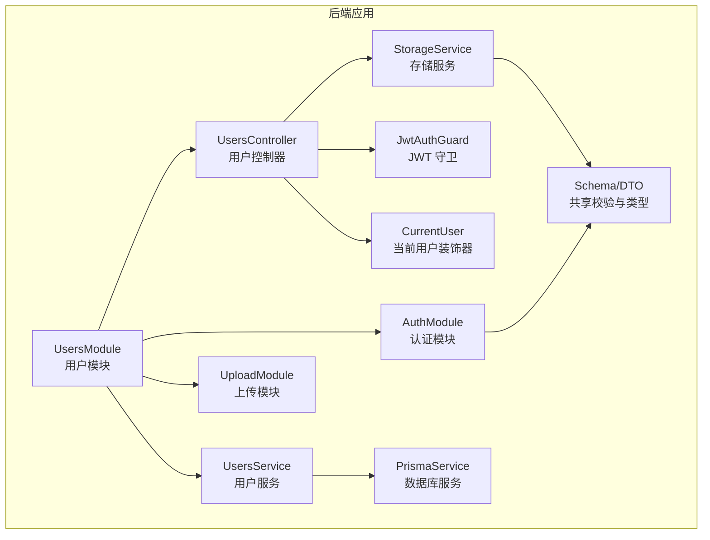
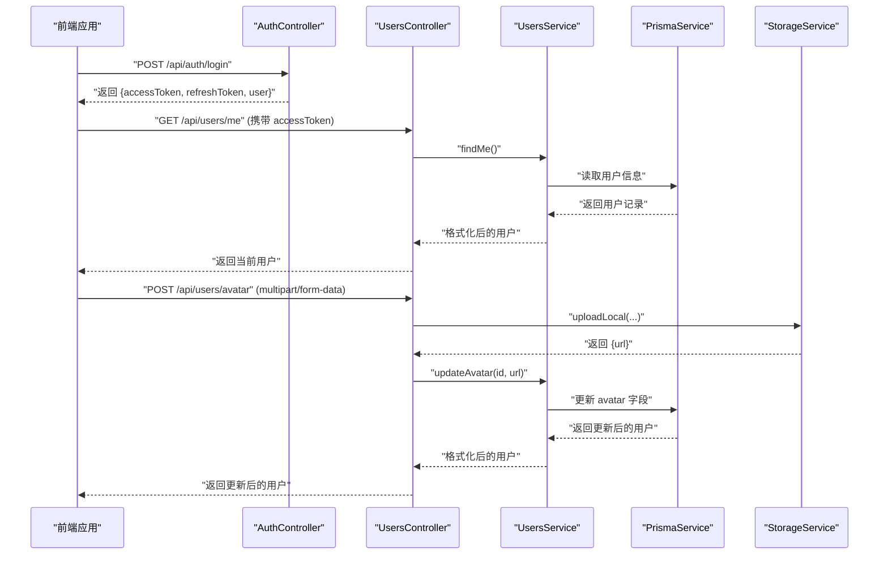
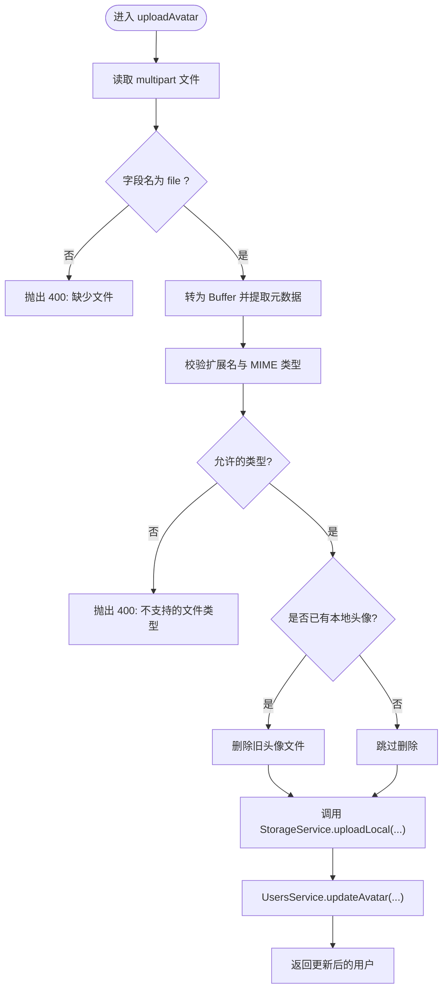
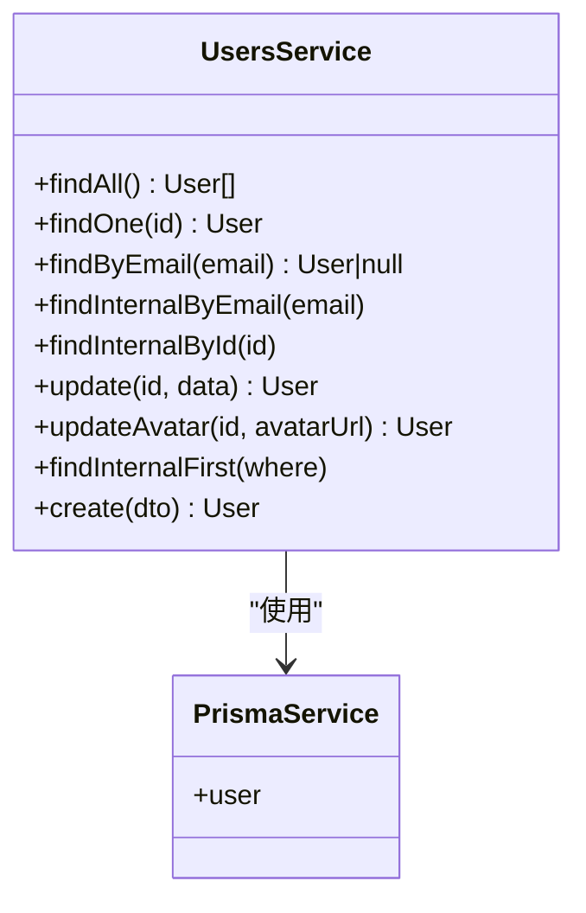
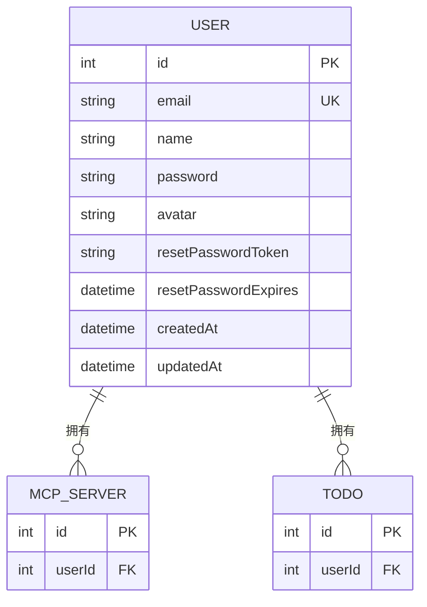
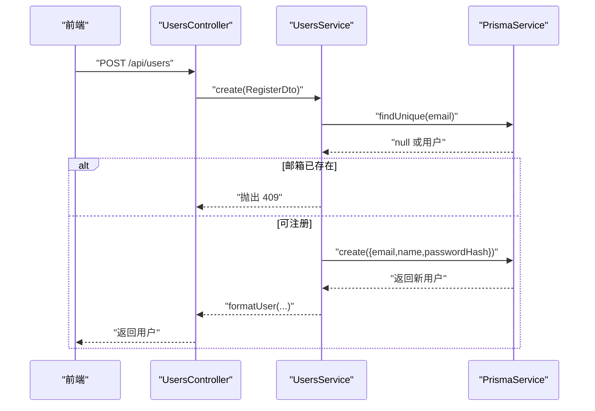
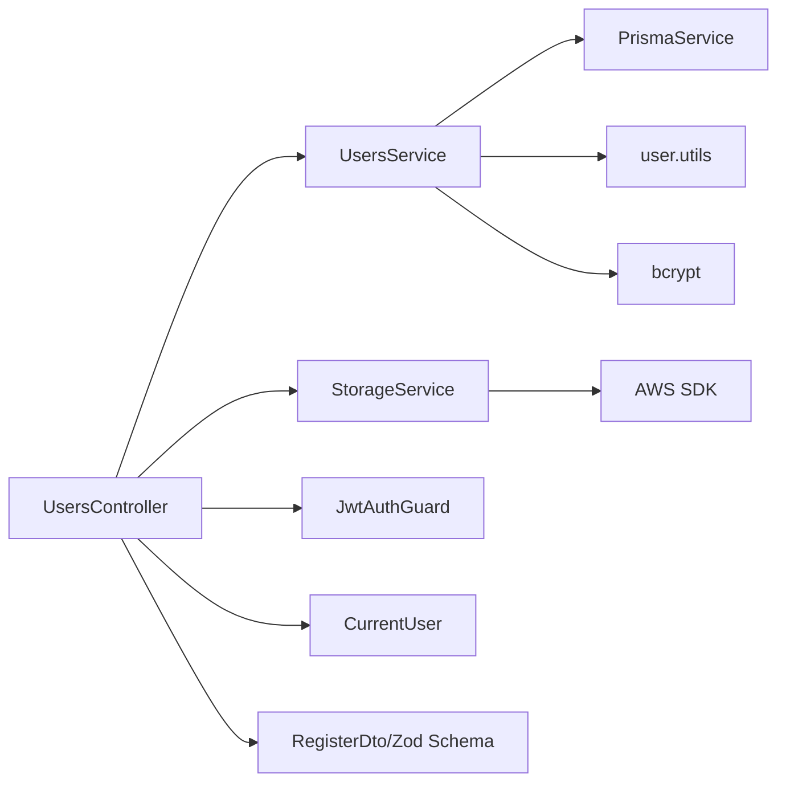

# 用户管理模块

<cite>
**本文引用的文件**
- [apps/backend/src/users/users.controller.ts](file://apps/backend/src/users/users.controller.ts)
- [apps/backend/src/users/users.service.ts](file://apps/backend/src/users/users.service.ts)
- [apps/backend/src/users/users.module.ts](file://apps/backend/src/users/users.module.ts)
- [apps/backend/prisma/schema/user.prisma](file://apps/backend/prisma/schema/user.prisma)
- [apps/backend/src/auth/auth.dto.ts](file://apps/backend/src/auth/auth.dto.ts)
- [apps/backend/src/auth/jwt-auth.guard.ts](file://apps/backend/src/auth/jwt-auth.guard.ts)
- [apps/backend/src/auth/current-user.decorator.ts](file://apps/backend/src/auth/current-user.decorator.ts)
- [apps/backend/src/upload/storage.service.ts](file://apps/backend/src/upload/storage.service.ts)
- [apps/backend/src/upload/upload.constants.ts](file://apps/backend/src/upload/upload.constants.ts)
- [packages/shared/src/schemas/auth.schema.ts](file://packages/shared/src/schemas/auth.schema.ts)
- [packages/shared/src/utils/user.utils.ts](file://packages/shared/src/utils/user.utils.ts)
- [apps/backend/tests/users/users.service.spec.ts](file://apps/backend/tests/users/users.service.spec.ts)
- [apps/backend/src/app.module.ts](file://apps/backend/src/app.module.ts)
- [apps/frontend/src/features/auth/stores/auth.ts](file://apps/frontend/src/features/auth/stores/auth.ts)
</cite>

## 目录

1. [简介](#简介)
2. [项目结构](#项目结构)
3. [核心组件](#核心组件)
4. [架构总览](#架构总览)
5. [详细组件分析](#详细组件分析)
6. [依赖关系分析](#依赖关系分析)
7. [性能考量](#性能考量)
8. [故障排除指南](#故障排除指南)
9. [结论](#结论)
10. [附录](#附录)

## 简介

本文件系统性阐述 Lumina Todo 后端“用户管理模块”的完整实现，覆盖用户控制器接口、业务服务逻辑、数据模型与验证、头像上传与存储、权限控制、以及前后端协作流程。文档同时提供用户注册、个人信息更新、头像上传处理、用户状态管理、权限继承机制等关键流程的可视化说明，并给出数据保护、隐私合规、用户迁移与扩展自定义用户属性的最佳实践。

## 项目结构

用户管理模块位于后端应用的 users 子目录，采用典型的 NestJS 分层架构：控制器负责 HTTP 接口与参数解析；服务封装业务逻辑；Prisma 负责数据持久化；共享包提供跨模块的数据结构与校验规则；上传模块提供本地与云端存储能力；认证模块提供 JWT 保护与当前用户注入。

图表来源

- [apps/backend/src/users/users.module.ts:1-14](file://apps/backend/src/users/users.module.ts#L1-L14)
- [apps/backend/src/users/users.controller.ts:1-135](file://apps/backend/src/users/users.controller.ts#L1-L135)
- [apps/backend/src/users/users.service.ts:1-118](file://apps/backend/src/users/users.service.ts#L1-L118)
- [apps/backend/src/auth/jwt-auth.guard.ts:1-10](file://apps/backend/src/auth/jwt-auth.guard.ts#L1-L10)
- [apps/backend/src/auth/current-user.decorator.ts:1-19](file://apps/backend/src/auth/current-user.decorator.ts#L1-L19)
- [apps/backend/src/upload/storage.service.ts:1-216](file://apps/backend/src/upload/storage.service.ts#L1-L216)
- [packages/shared/src/schemas/auth.schema.ts:1-121](file://packages/shared/src/schemas/auth.schema.ts#L1-L121)

章节来源

- [apps/backend/src/users/users.module.ts:1-14](file://apps/backend/src/users/users.module.ts#L1-L14)
- [apps/backend/src/app.module.ts:1-160](file://apps/backend/src/app.module.ts#L1-L160)

## 核心组件

- 用户控制器（UsersController）：提供“获取所有用户”“获取当前用户”“上传头像”“按 ID 查询用户”“创建用户（注册）”等接口，均受 JWT 守卫保护。
- 用户服务（UsersService）：封装用户查询、创建、头像更新等业务逻辑，使用 Prisma 进行数据库操作，并通过共享工具进行日期格式化。
- 数据模型（Prisma User）：定义用户字段（邮箱唯一、名称、密码、头像、重置密码令牌与过期时间、时间戳），并与数据库表映射。
- 认证与权限（JwtAuthGuard、CurrentUser）：通过 JWT 守卫保护路由，通过装饰器注入当前用户上下文。
- 上传与存储（StorageService、upload.constants）：支持本地文件系统与 S3/兼容对象存储，提供上传、删除、签名 URL 等能力，并对头像上传进行 MIME/扩展名白名单校验。
- 共享校验与类型（auth.schema、user.utils）：统一的注册、更新、用户信息等 Zod Schema，以及用户数据格式化工具。

章节来源

- [apps/backend/src/users/users.controller.ts:1-135](file://apps/backend/src/users/users.controller.ts#L1-L135)
- [apps/backend/src/users/users.service.ts:1-118](file://apps/backend/src/users/users.service.ts#L1-L118)
- [apps/backend/prisma/schema/user.prisma:1-16](file://apps/backend/prisma/schema/user.prisma#L1-L16)
- [apps/backend/src/auth/jwt-auth.guard.ts:1-10](file://apps/backend/src/auth/jwt-auth.guard.ts#L1-L10)
- [apps/backend/src/auth/current-user.decorator.ts:1-19](file://apps/backend/src/auth/current-user.decorator.ts#L1-L19)
- [apps/backend/src/upload/storage.service.ts:1-216](file://apps/backend/src/upload/storage.service.ts#L1-L216)
- [apps/backend/src/upload/upload.constants.ts:1-66](file://apps/backend/src/upload/upload.constants.ts#L1-L66)
- [packages/shared/src/schemas/auth.schema.ts:1-121](file://packages/shared/src/schemas/auth.schema.ts#L1-L121)
- [packages/shared/src/utils/user.utils.ts:1-36](file://packages/shared/src/utils/user.utils.ts#L1-L36)

## 架构总览

用户管理模块围绕“控制器-服务-数据层”三层协作，结合认证守卫与上传模块，形成完整的用户生命周期管理闭环。

图表来源

- [apps/backend/src/users/users.controller.ts:48-111](file://apps/backend/src/users/users.controller.ts#L48-L111)
- [apps/backend/src/users/users.service.ts:69-82](file://apps/backend/src/users/users.service.ts#L69-L82)
- [apps/backend/src/upload/storage.service.ts:74-111](file://apps/backend/src/upload/storage.service.ts#L74-L111)
- [apps/backend/src/auth/auth.dto.ts:15-20](file://apps/backend/src/auth/auth.dto.ts#L15-L20)

## 详细组件分析

### 用户控制器（UsersController）

- 接口职责
  - 获取所有用户：受 JWT 保护，返回用户列表。
  - 获取当前用户：受 JWT 保护，返回当前登录用户。
  - 上传头像：受 JWT 保护，接收 multipart/form-data，校验文件类型与扩展名，调用存储服务上传并更新用户头像。
  - 按 ID 查询用户：受 JWT 保护，返回指定用户。
  - 创建用户（注册）：受 JWT 保护，使用 RegisterDto 校验输入并创建用户。
- 关键流程
  - 头像上传：校验文件存在性与类型，若用户已有本地头像则先删除旧头像，再上传新头像并更新数据库。
  - 参数绑定：使用 CurrentUser 装饰器注入当前用户，避免重复查询。
- 异常处理
  - 文件缺失或类型不被允许时抛出 400。
  - 目录创建失败或写入失败时抛出 503。

图表来源

- [apps/backend/src/users/users.controller.ts:72-111](file://apps/backend/src/users/users.controller.ts#L72-L111)
- [apps/backend/src/upload/upload.constants.ts:1-66](file://apps/backend/src/upload/upload.constants.ts#L1-L66)
- [apps/backend/src/upload/storage.service.ts:74-111](file://apps/backend/src/upload/storage.service.ts#L74-L111)
- [apps/backend/src/users/users.service.ts:79-82](file://apps/backend/src/users/users.service.ts#L79-L82)

章节来源

- [apps/backend/src/users/users.controller.ts:37-134](file://apps/backend/src/users/users.controller.ts#L37-L134)

### 用户服务（UsersService）

- 查询与读取
  - findAll/findOne：查询用户列表与单个用户，使用 formatUsers/formatUser 将 Date 类型转换为 ISO 字符串。
  - findByEmail/findInternalByEmail/findInternalById：按邮箱或内部场景查询用户。
- 更新与创建
  - update：通用更新方法，返回格式化后的用户。
  - updateAvatar：便捷更新头像 URL。
  - create：注册流程，检查邮箱唯一性，对密码进行哈希处理后创建用户。
- 错误处理
  - 无效 ID 或用户不存在时抛出 404。
  - 邮箱冲突时抛出 409。

图表来源

- [apps/backend/src/users/users.service.ts:1-118](file://apps/backend/src/users/users.service.ts#L1-L118)

章节来源

- [apps/backend/src/users/users.service.ts:19-116](file://apps/backend/src/users/users.service.ts#L19-L116)
- [packages/shared/src/utils/user.utils.ts:19-35](file://packages/shared/src/utils/user.utils.ts#L19-L35)

### 数据模型与验证

- 用户模型（Prisma）
  - 字段：id、email（唯一）、name、password、avatar、重置密码相关字段、时间戳。
  - 关系：与 McpServer、Todo 模型关联。
- 共享 Schema（Zod）
  - RegisterSchema：邮箱、姓名、密码的长度与必填约束。
  - UpdateUserSchema：可选更新 name 与 avatar URL。
  - UserSchema：对外暴露的用户结构（ISO 时间字符串）。
- DTO 映射
  - RegisterDto 继承自 createZodDto(RegisterSchema)，用于控制器输入校验。

图表来源

- [apps/backend/prisma/schema/user.prisma:1-16](file://apps/backend/prisma/schema/user.prisma#L1-L16)

章节来源

- [apps/backend/prisma/schema/user.prisma:1-16](file://apps/backend/prisma/schema/user.prisma#L1-L16)
- [packages/shared/src/schemas/auth.schema.ts:33-41](file://packages/shared/src/schemas/auth.schema.ts#L33-L41)
- [packages/shared/src/schemas/auth.schema.ts:46-54](file://packages/shared/src/schemas/auth.schema.ts#L46-L54)
- [packages/shared/src/schemas/auth.schema.ts:59-66](file://packages/shared/src/schemas/auth.schema.ts#L59-L66)
- [apps/backend/src/auth/auth.dto.ts:20-20](file://apps/backend/src/auth/auth.dto.ts#L20-L20)

### 权限控制与当前用户

- JwtAuthGuard：基于 Passport 的 JWT 守卫，保护需要认证的路由。
- CurrentUser 装饰器：从请求上下文中提取当前用户，支持按字段名选择性返回。
- 控制器中所有用户相关接口均标注 @UseGuards(JwtAuthGuard) 与 @ApiBearerAuth()。

章节来源

- [apps/backend/src/auth/jwt-auth.guard.ts:1-10](file://apps/backend/src/auth/jwt-auth.guard.ts#L1-L10)
- [apps/backend/src/auth/current-user.decorator.ts:1-19](file://apps/backend/src/auth/current-user.decorator.ts#L1-L19)
- [apps/backend/src/users/users.controller.ts:37-134](file://apps/backend/src/users/users.controller.ts#L37-L134)

### 头像上传与存储机制

- 上传入口：UsersController.uploadAvatar。
- 类型校验：upload.constants 中定义允许的 MIME 类型与扩展名集合。
- 存储策略：
  - 本地存储：StorageService.uploadLocal 将文件写入 public/avatars 目录，返回 /api/public/... URL。
  - 云端存储：StorageService.upload 使用 S3 客户端上传，支持自定义 endpoint（OSS/MinIO）。
- 旧头像清理：若用户已有本地头像，先删除旧文件以节省空间。
- 返回值：更新后的用户对象（URL 已指向新头像）。

章节来源

- [apps/backend/src/users/users.controller.ts:72-111](file://apps/backend/src/users/users.controller.ts#L72-L111)
- [apps/backend/src/upload/upload.constants.ts:1-66](file://apps/backend/src/upload/upload.constants.ts#L1-L66)
- [apps/backend/src/upload/storage.service.ts:74-111](file://apps/backend/src/upload/storage.service.ts#L74-L111)
- [apps/backend/src/upload/storage.service.ts:151-167](file://apps/backend/src/upload/storage.service.ts#L151-L167)

### 用户注册流程

- 输入：RegisterDto（邮箱、姓名、密码）。
- 流程：
  - 校验邮箱唯一性。
  - 对密码进行哈希处理。
  - 创建用户并返回格式化后的用户对象。
- 前端协作：前端 Store 在注册成功后持久化 token 与用户信息，并触发数据合并与匿名 AI 迁移。

图表来源

- [apps/backend/src/users/users.controller.ts:127-133](file://apps/backend/src/users/users.controller.ts#L127-L133)
- [apps/backend/src/users/users.service.ts:96-116](file://apps/backend/src/users/users.service.ts#L96-L116)
- [apps/frontend/src/features/auth/stores/auth.ts:184-212](file://apps/frontend/src/features/auth/stores/auth.ts#L184-L212)

章节来源

- [apps/backend/src/users/users.controller.ts:127-133](file://apps/backend/src/users/users.controller.ts#L127-L133)
- [apps/backend/src/users/users.service.ts:96-116](file://apps/backend/src/users/users.service.ts#L96-L116)
- [apps/frontend/src/features/auth/stores/auth.ts:184-212](file://apps/frontend/src/features/auth/stores/auth.ts#L184-L212)

### 个人信息更新与用户状态管理

- 个人信息更新：共享 Schema 中的 UpdateUserSchema 支持可选更新 name 与 avatar URL。
- 用户状态：UsersService 提供通用 update 方法，配合 Prisma 的 UserUpdateInput 实现字段级更新。
- 格式化输出：formatUser/formatUsers 将数据库时间字段转换为 ISO 字符串，保证前端一致显示。

章节来源

- [packages/shared/src/schemas/auth.schema.ts:46-54](file://packages/shared/src/schemas/auth.schema.ts#L46-L54)
- [packages/shared/src/utils/user.utils.ts:19-35](file://packages/shared/src/utils/user.utils.ts#L19-L35)
- [apps/backend/src/users/users.service.ts:69-75](file://apps/backend/src/users/users.service.ts#L69-L75)

### 权限继承机制

- 当前实现：用户控制器的所有接口均受 JwtAuthGuard 保护，确保只有认证用户可访问。
- 权限边界：控制器层通过守卫与装饰器限定访问范围；服务层不直接处理鉴权，专注于业务逻辑。
- 扩展建议：可在服务层引入角色/资源级授权策略（例如基于用户 ID 的资源访问控制），并通过守卫或拦截器注入。

章节来源

- [apps/backend/src/users/users.controller.ts:37-134](file://apps/backend/src/users/users.controller.ts#L37-L134)
- [apps/backend/src/auth/jwt-auth.guard.ts:1-10](file://apps/backend/src/auth/jwt-auth.guard.ts#L1-L10)

### 账户安全策略

- 密码安全：注册时对密码进行哈希处理，避免明文存储。
- 输入校验：使用 Zod Schema 对邮箱、密码、姓名等字段进行长度与格式校验。
- 上传安全：对上传文件的 MIME 类型与扩展名进行白名单校验，拒绝未知类型。
- 存储安全：S3 上传可配置 endpoint（OSS/MinIO），支持私有访问并通过签名 URL 临时授权。

章节来源

- [apps/backend/src/users/users.service.ts:105-105](file://apps/backend/src/users/users.service.ts#L105-L105)
- [packages/shared/src/schemas/auth.schema.ts:33-41](file://packages/shared/src/schemas/auth.schema.ts#L33-L41)
- [apps/backend/src/upload/upload.constants.ts:1-66](file://apps/backend/src/upload/upload.constants.ts#L1-L66)
- [apps/backend/src/upload/storage.service.ts:116-139](file://apps/backend/src/upload/storage.service.ts#L116-L139)

### 用户数据保护与隐私合规

- 数据最小化：对外暴露的用户对象仅包含必要字段（id、email、name、avatar、时间戳）。
- 数据格式化：统一使用 ISO 字符串表示时间，避免时区歧义。
- 传输安全：JWT 令牌通过 HTTPS 传输，建议生产环境强制 HTTPS。
- 存储安全：本地存储需确保 public 目录权限正确；云端存储建议使用私有访问并配合签名 URL。

章节来源

- [packages/shared/src/utils/user.utils.ts:19-27](file://packages/shared/src/utils/user.utils.ts#L19-L27)
- [apps/backend/src/upload/storage.service.ts:74-111](file://apps/backend/src/upload/storage.service.ts#L74-L111)

### 用户迁移方案

- 前端迁移：注册/登录成功后，前端 Store 会触发数据合并与匿名 AI 迁移，确保用户数据在新账号下可用。
- 建议流程：在用户切换账号或合并历史数据时，优先在前端完成本地数据合并，再由后端服务执行最终落库与清理。

章节来源

- [apps/frontend/src/features/auth/stores/auth.ts:167-170](file://apps/frontend/src/features/auth/stores/auth.ts#L167-L170)
- [apps/frontend/src/features/auth/stores/auth.ts:199-203](file://apps/frontend/src/features/auth/stores/auth.ts#L199-L203)
- [apps/frontend/src/features/auth/stores/auth.ts:170-170](file://apps/frontend/src/features/auth/stores/auth.ts#L170-L170)

### 扩展自定义用户属性

- 数据层扩展：在 Prisma 模型中新增字段（如偏好设置、主题色等），并迁移数据库。
- 类型与校验：在共享 Schema 中添加对应字段与校验规则，保持前后端一致性。
- 控制器与服务：在控制器中新增接口，在服务中实现读写逻辑，并通过 formatUser/formatUsers 输出。
- 注意事项：新增字段需考虑默认值、向后兼容与迁移脚本。

章节来源

- [apps/backend/prisma/schema/user.prisma:1-16](file://apps/backend/prisma/schema/user.prisma#L1-L16)
- [packages/shared/src/schemas/auth.schema.ts:59-66](file://packages/shared/src/schemas/auth.schema.ts#L59-L66)
- [packages/shared/src/utils/user.utils.ts:19-35](file://packages/shared/src/utils/user.utils.ts#L19-L35)

## 依赖关系分析

- 模块耦合
  - UsersModule 导入 AuthModule 与 UploadModule，体现用户管理与认证、上传的紧密协作。
  - UsersController 依赖 UsersService、StorageService、JwtAuthGuard、CurrentUser。
  - UsersService 依赖 PrismaService 与共享工具。
- 外部依赖
  - bcrypt：密码哈希。
  - AWS SDK：S3/兼容对象存储上传与签名 URL。
  - Zod：输入校验。
  - Prisma：数据库 ORM。

图表来源

- [apps/backend/src/users/users.controller.ts:1-32](file://apps/backend/src/users/users.controller.ts#L1-L32)
- [apps/backend/src/users/users.service.ts:1-14](file://apps/backend/src/users/users.service.ts#L1-L14)
- [apps/backend/src/upload/storage.service.ts:1-43](file://apps/backend/src/upload/storage.service.ts#L1-L43)
- [packages/shared/src/schemas/auth.schema.ts:1-121](file://packages/shared/src/schemas/auth.schema.ts#L1-L121)
- [packages/shared/src/utils/user.utils.ts:1-36](file://packages/shared/src/utils/user.utils.ts#L1-L36)

章节来源

- [apps/backend/src/users/users.module.ts:1-14](file://apps/backend/src/users/users.module.ts#L1-L14)
- [apps/backend/src/app.module.ts:1-160](file://apps/backend/src/app.module.ts#L1-L160)

## 性能考量

- 上传性能
  - 本地上传：写入磁盘，适合小规模部署；注意磁盘 IO 与目录权限。
  - 云端上传：S3/兼容对象存储，适合高并发与弹性扩展。
- 缓存与序列化
  - 前端 Store 使用持久化插件，减少重复登录成本。
  - 用户对象统一格式化为 ISO 字符串，避免前端重复处理。
- 安全与稳定性
  - 速率限制与异常过滤器降低暴力破解风险。
  - 上传失败与目录创建失败的错误分类处理，便于快速定位问题。

## 故障排除指南

- 上传失败
  - 检查文件类型与扩展名是否在白名单内。
  - 若使用本地存储，确认 public/avatars 目录存在且具备写权限。
  - 若使用 S3，检查凭证配置与网络连通性。
- 注册失败
  - 邮箱已被占用会触发冲突异常；请更换邮箱。
  - 密码长度不符合要求会触发校验异常。
- 获取当前用户失败
  - 确认请求头携带有效的访问令牌。
  - 若令牌过期，使用刷新令牌接口重新获取。

章节来源

- [apps/backend/src/users/users.controller.ts:72-111](file://apps/backend/src/users/users.controller.ts#L72-L111)
- [apps/backend/src/users/users.service.ts:96-116](file://apps/backend/src/users/users.service.ts#L96-L116)
- [apps/backend/src/upload/storage.service.ts:74-111](file://apps/backend/src/upload/storage.service.ts#L74-L111)
- [apps/backend/tests/users/users.service.spec.ts:92-102](file://apps/backend/tests/users/users.service.spec.ts#L92-L102)

## 结论

用户管理模块通过清晰的分层设计与严格的输入校验，实现了从注册、认证到头像上传与用户信息管理的完整闭环。结合 JWT 守卫、共享 Schema 与存储服务，系统在安全性、可维护性与扩展性方面具备良好基础。建议在生产环境中强化 HTTPS、密钥轮换与审计日志，并持续完善权限模型与数据迁移策略。

## 附录

- 前端认证状态管理：包含登录、注册、刷新令牌、登出、头像上传等流程，支持持久化与错误处理。
- 测试覆盖：UsersService 的核心行为（查询、创建、格式化）具备单元测试保障。

章节来源

- [apps/frontend/src/features/auth/stores/auth.ts:148-233](file://apps/frontend/src/features/auth/stores/auth.ts#L148-L233)
- [apps/backend/tests/users/users.service.spec.ts:23-103](file://apps/backend/tests/users/users.service.spec.ts#L23-L103)
