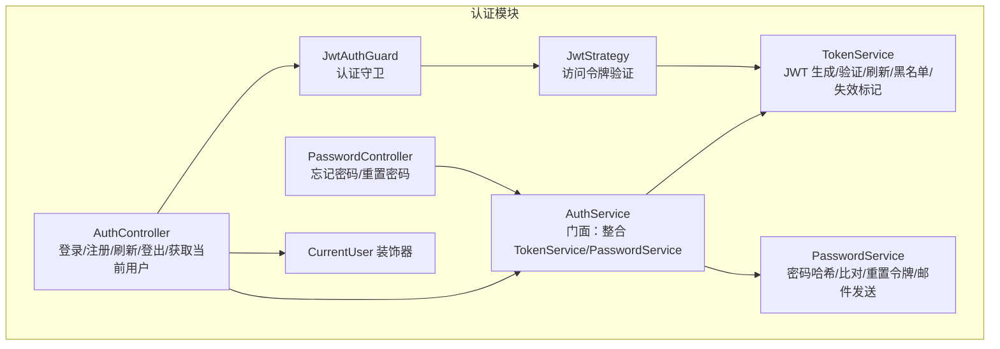
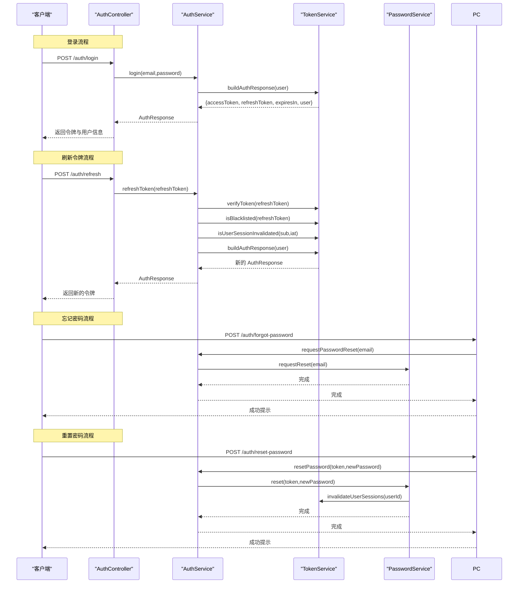
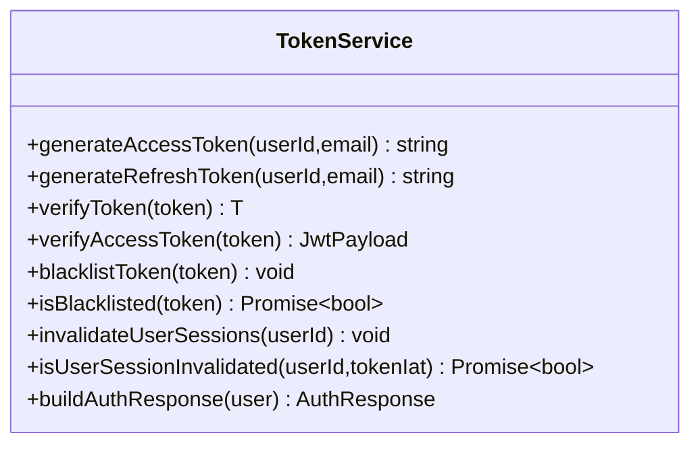
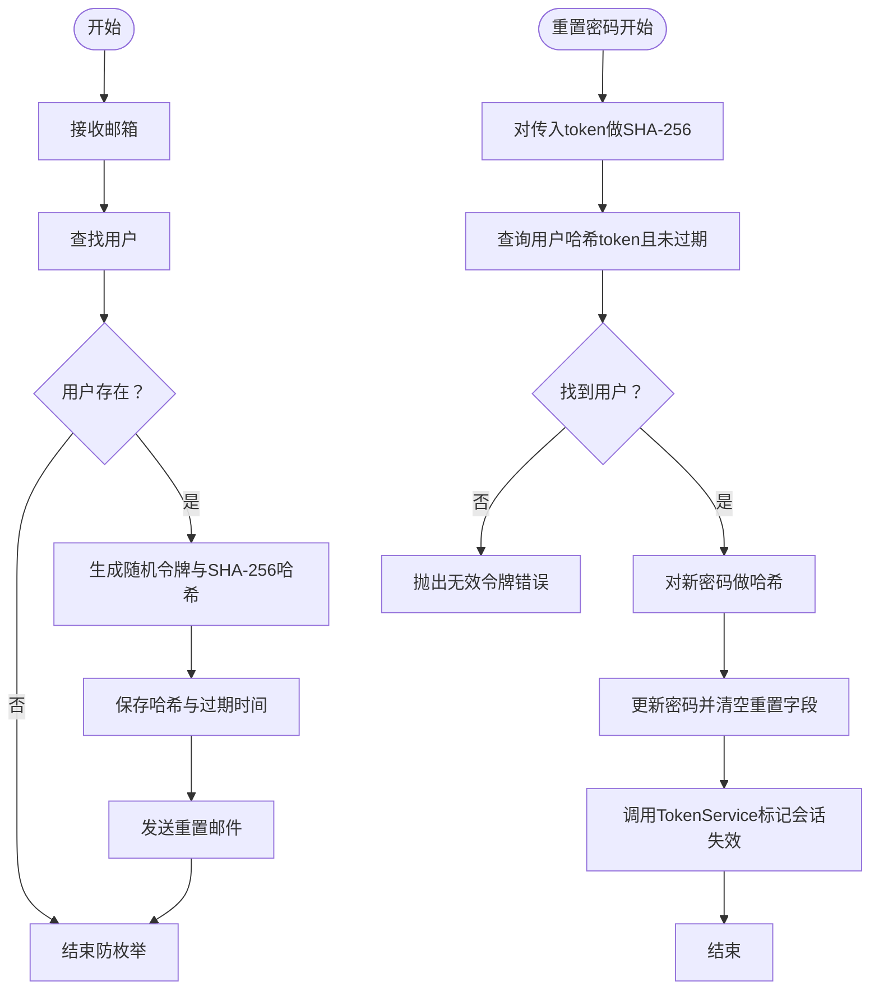
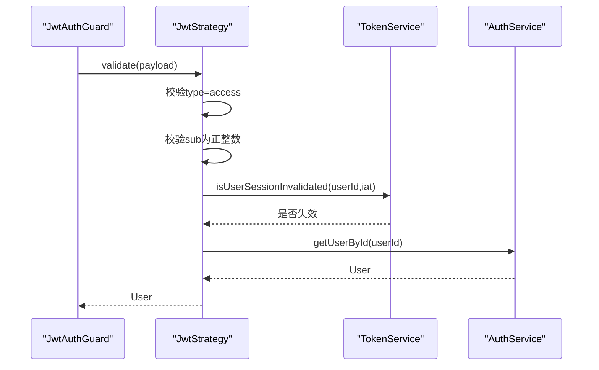
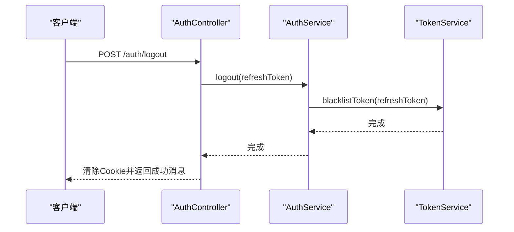
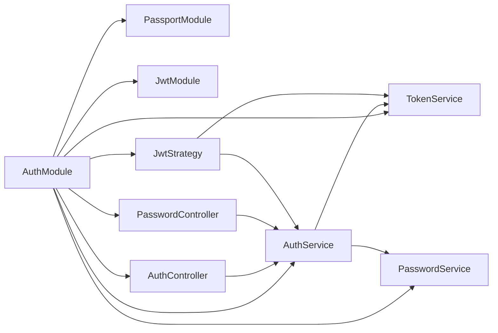

# 认证模块

<cite>
**本文引用的文件**
- [apps/backend/src/auth/auth.controller.ts](file://apps/backend/src/auth/auth.controller.ts)
- [apps/backend/src/auth/password.controller.ts](file://apps/backend/src/auth/password.controller.ts)
- [apps/backend/src/auth/auth.service.ts](file://apps/backend/src/auth/auth.service.ts)
- [apps/backend/src/auth/token.service.ts](file://apps/backend/src/auth/token.service.ts)
- [apps/backend/src/auth/password.service.ts](file://apps/backend/src/auth/password.service.ts)
- [apps/backend/src/auth/jwt.strategy.ts](file://apps/backend/src/auth/jwt.strategy.ts)
- [apps/backend/src/auth/jwt-auth.guard.ts](file://apps/backend/src/auth/jwt-auth.guard.ts)
- [apps/backend/src/auth/current-user.decorator.ts](file://apps/backend/src/auth/current-user.decorator.ts)
- [apps/backend/src/auth/auth.module.ts](file://apps/backend/src/auth/auth.module.ts)
- [apps/backend/src/auth/auth.dto.ts](file://apps/backend/src/auth/auth.dto.ts)
- [apps/backend/src/common/throttling/throttling.constants.ts](file://apps/backend/src/common/throttling/throttling.constants.ts)
</cite>

## 目录

1. [简介](#简介)
2. [项目结构](#项目结构)
3. [核心组件](#核心组件)
4. [架构总览](#架构总览)
5. [详细组件分析](#详细组件分析)
6. [依赖关系分析](#依赖关系分析)
7. [性能考量](#性能考量)
8. [故障排查指南](#故障排查指南)
9. [结论](#结论)
10. [附录](#附录)

## 简介

本文件系统性梳理 Lumina Todo 后端认证模块的实现，覆盖以下关键点：

- JWT 认证流程：TokenService 的令牌生成与验证、刷新与失效控制
- 密码策略：PasswordService 的哈希与比对、重置令牌生成与校验
- 认证策略：JwtStrategy 的访问令牌验证与会话失效检查
- 控制器接口：AuthController 的登录、注册、刷新、登出、获取当前用户；PasswordController 的忘记密码与重置密码
- 安全守卫与装饰器：JwtAuthGuard 的使用、CurrentUser 装饰器的实现原理
- 安全最佳实践、常见问题排查与扩展自定义认证策略的方法

## 项目结构

认证模块采用按职责分层组织，核心文件如下：

- 控制器：处理 HTTP 接口，负责参数校验与限流
- 服务：封装业务逻辑，协调 TokenService 与 PasswordService
- 策略与守卫：基于 NestJS Passport/JWT 实现访问令牌验证
- DTO：使用 Zod 校验输入参数
- 模块：集中注册 JwtModule、PassportModule 及依赖注入

图表来源

- [apps/backend/src/auth/auth.controller.ts:15-80](file://apps/backend/src/auth/auth.controller.ts#L15-L80)
- [apps/backend/src/auth/password.controller.ts:11-37](file://apps/backend/src/auth/password.controller.ts#L11-L37)
- [apps/backend/src/auth/auth.service.ts:12-126](file://apps/backend/src/auth/auth.service.ts#L12-L126)
- [apps/backend/src/auth/token.service.ts:15-186](file://apps/backend/src/auth/token.service.ts#L15-L186)
- [apps/backend/src/auth/password.service.ts:9-99](file://apps/backend/src/auth/password.service.ts#L9-L99)
- [apps/backend/src/auth/jwt.strategy.ts:19-67](file://apps/backend/src/auth/jwt.strategy.ts#L19-L67)
- [apps/backend/src/auth/jwt-auth.guard.ts:8-9](file://apps/backend/src/auth/jwt-auth.guard.ts#L8-L9)
- [apps/backend/src/auth/current-user.decorator.ts:8-18](file://apps/backend/src/auth/current-user.decorator.ts#L8-L18)

章节来源

- [apps/backend/src/auth/auth.module.ts:16-40](file://apps/backend/src/auth/auth.module.ts#L16-L40)

## 核心组件

- TokenService：负责访问令牌与刷新令牌的生成、验证、黑名单、用户会话失效标记；提供构建完整认证响应的能力
- PasswordService：负责密码哈希与比对、重置令牌生成与校验、向用户邮箱发送重置链接
- JwtStrategy：验证访问令牌的有效性，并结合会话失效标记进行二次校验
- JwtAuthGuard：基于 JwtStrategy 的认证守卫，用于保护受保护路由
- CurrentUser 装饰器：从请求上下文中提取当前用户对象或其字段
- AuthController/PasswordController：对外暴露登录、注册、刷新、登出、获取当前用户、忘记密码、重置密码等接口
- AuthService：作为门面对外提供统一认证能力，协调 TokenService 与 PasswordService

章节来源

- [apps/backend/src/auth/token.service.ts:15-186](file://apps/backend/src/auth/token.service.ts#L15-L186)
- [apps/backend/src/auth/password.service.ts:9-99](file://apps/backend/src/auth/password.service.ts#L9-L99)
- [apps/backend/src/auth/jwt.strategy.ts:19-67](file://apps/backend/src/auth/jwt.strategy.ts#L19-L67)
- [apps/backend/src/auth/jwt-auth.guard.ts:8-9](file://apps/backend/src/auth/jwt-auth.guard.ts#L8-L9)
- [apps/backend/src/auth/current-user.decorator.ts:8-18](file://apps/backend/src/auth/current-user.decorator.ts#L8-L18)
- [apps/backend/src/auth/auth.controller.ts:15-80](file://apps/backend/src/auth/auth.controller.ts#L15-L80)
- [apps/backend/src/auth/password.controller.ts:11-37](file://apps/backend/src/auth/password.controller.ts#L11-L37)
- [apps/backend/src/auth/auth.service.ts:12-126](file://apps/backend/src/auth/auth.service.ts#L12-L126)

## 架构总览

认证模块围绕“访问令牌 + 刷新令牌”的双令牌模型设计，配合 Redis 黑名单与会话失效标记实现细粒度的安全控制。

图表来源

- [apps/backend/src/auth/auth.controller.ts:23-48](file://apps/backend/src/auth/auth.controller.ts#L23-L48)
- [apps/backend/src/auth/password.controller.ts:19-36](file://apps/backend/src/auth/password.controller.ts#L19-L36)
- [apps/backend/src/auth/auth.service.ts:41-112](file://apps/backend/src/auth/auth.service.ts#L41-L112)
- [apps/backend/src/auth/token.service.ts:78-185](file://apps/backend/src/auth/token.service.ts#L78-L185)
- [apps/backend/src/auth/password.service.ts:39-89](file://apps/backend/src/auth/password.service.ts#L39-L89)

## 详细组件分析

### TokenService：令牌生成与验证机制

- 访问令牌与刷新令牌
  - 访问令牌短期有效，用于日常受保护资源访问
  - 刷新令牌长期有效，仅用于换取新的访问令牌
- 生成与验证
  - 使用不同密钥分别签名访问与刷新令牌，提升安全性
  - 支持统一验证：优先尝试刷新密钥，再尝试访问密钥，若均失败则判定过期
- 黑名单与会话失效
  - 登出时将刷新令牌加入 Redis 黑名单，避免被继续用于刷新
  - 通过“会话失效标记”记录用户强制失效时间，刷新时比较令牌签发时间与失效标记
- 构建认证响应
  - 统一返回包含 accessToken、refreshToken、expiresIn 与 user 的结构

图表来源

- [apps/backend/src/auth/token.service.ts:15-186](file://apps/backend/src/auth/token.service.ts#L15-L186)

章节来源

- [apps/backend/src/auth/token.service.ts:15-186](file://apps/backend/src/auth/token.service.ts#L15-L186)

### PasswordService：密码加密与重置策略

- 密码加密与比对
  - 使用 bcrypt 对密码进行加盐哈希存储
  - 登录时使用 bcrypt 比对明文与哈希
- 重置令牌
  - 生成随机令牌并以 SHA-256 哈希存入数据库
  - 设置过期时间，默认一小时
  - 发送包含 token 参数的重置链接至用户邮箱
- 重置密码
  - 校验哈希后的 token 是否存在且未过期
  - 成功后更新用户密码并清除重置相关字段
  - 调用 TokenService 标记用户会话失效，使旧令牌全部作废

图表来源

- [apps/backend/src/auth/password.service.ts:39-89](file://apps/backend/src/auth/password.service.ts#L39-L89)

章节来源

- [apps/backend/src/auth/password.service.ts:9-99](file://apps/backend/src/auth/password.service.ts#L9-L99)

### JwtStrategy：认证策略实现

- 验证流程
  - 从 Authorization 头部解析 Bearer 令牌
  - 使用访问密钥验证令牌有效性
  - 校验 payload.type 必须为 access
  - 校验 sub（用户 ID）必须为正整数
  - 结合 TokenService 的会话失效标记判断是否仍有效
  - 最终从 AuthService 获取用户信息并返回给守卫
- 异常处理
  - 任何不满足条件的情况均抛出未授权异常

图表来源

- [apps/backend/src/auth/jwt.strategy.ts:41-66](file://apps/backend/src/auth/jwt.strategy.ts#L41-L66)

章节来源

- [apps/backend/src/auth/jwt.strategy.ts:19-67](file://apps/backend/src/auth/jwt.strategy.ts#L19-L67)

### JwtAuthGuard：认证守卫

- 基于 Passport 的 jwt 策略，用于保护需要认证的路由
- 在控制器方法上添加 @UseGuards(JwtAuthGuard)，即可启用访问令牌验证

章节来源

- [apps/backend/src/auth/jwt-auth.guard.ts:8-9](file://apps/backend/src/auth/jwt-auth.guard.ts#L8-L9)

### CurrentUser 装饰器：实现原理

- 从请求上下文提取 user 对象，支持两种形态：request.user 与 request.raw.user
- 支持选择性返回 user 的某个字段，便于在控制器中直接获取特定属性

章节来源

- [apps/backend/src/auth/current-user.decorator.ts:8-18](file://apps/backend/src/auth/current-user.decorator.ts#L8-L18)

### AuthController：登录注册与令牌刷新

- 登录
  - 接收邮箱与密码，调用 AuthService.validateUser 后交由 TokenService 生成令牌
- 注册
  - 创建用户后直接生成令牌返回
- 刷新
  - 校验刷新令牌是否在黑名单、类型正确、未被用户会话失效标记覆盖
  - 成功后重新生成新的令牌对
- 获取当前用户
  - 依赖 JwtAuthGuard 与 JwtStrategy，直接返回当前用户
- 登出
  - 调用 AuthService.logout 将刷新令牌加入黑名单
  - 清除浏览器中的 accessToken 与 refreshToken Cookie

图表来源

- [apps/backend/src/auth/auth.controller.ts:64-79](file://apps/backend/src/auth/auth.controller.ts#L64-L79)
- [apps/backend/src/auth/auth.service.ts:95-101](file://apps/backend/src/auth/auth.service.ts#L95-L101)
- [apps/backend/src/auth/token.service.ts:130-149](file://apps/backend/src/auth/token.service.ts#L130-L149)

章节来源

- [apps/backend/src/auth/auth.controller.ts:15-80](file://apps/backend/src/auth/auth.controller.ts#L15-L80)
- [apps/backend/src/auth/auth.service.ts:41-101](file://apps/backend/src/auth/auth.service.ts#L41-L101)

### PasswordController：忘记密码与重置密码

- 忘记密码
  - 校验邮箱，若用户存在则生成重置令牌并发送邮件
- 重置密码
  - 校验 token 与过期时间，成功后更新密码并标记会话失效

章节来源

- [apps/backend/src/auth/password.controller.ts:11-37](file://apps/backend/src/auth/password.controller.ts#L11-L37)
- [apps/backend/src/auth/auth.service.ts:106-112](file://apps/backend/src/auth/auth.service.ts#L106-L112)

### DTO 与限流配置

- DTO
  - 使用 createZodDto 包装共享的 Zod Schema，自动支持 Swagger 文档生成
- 限流
  - 登录、注册、刷新、忘记密码、重置密码均有独立限流策略，防止暴力破解与滥用

章节来源

- [apps/backend/src/auth/auth.dto.ts:1-41](file://apps/backend/src/auth/auth.dto.ts#L1-L41)
- [apps/backend/src/common/throttling/throttling.constants.ts:89-113](file://apps/backend/src/common/throttling/throttling.constants.ts#L89-L113)

## 依赖关系分析

- 模块装配
  - AuthModule 注册 PassportModule（默认策略为 jwt）、JwtModule（异步工厂读取配置）
  - 导出 JwtModule、PassportModule 以便其他模块复用
- 组件耦合
  - AuthService 作为门面，聚合 TokenService 与 PasswordService
  - JwtStrategy 依赖 TokenService 与 AuthService 完成最终用户加载
  - 控制器仅依赖 AuthService，保持薄控制器

图表来源

- [apps/backend/src/auth/auth.module.ts:19-39](file://apps/backend/src/auth/auth.module.ts#L19-L39)

章节来源

- [apps/backend/src/auth/auth.module.ts:16-40](file://apps/backend/src/auth/auth.module.ts#L16-L40)

## 性能考量

- 令牌有效期
  - 访问令牌短期有效，降低泄露风险与缓存压力
  - 刷新令牌长期有效，但通过黑名单与会话失效标记实现即时撤销
- Redis 缓存
  - 黑名单与会话失效标记使用 Redis，具备高并发与 TTL 自动清理能力
- 限流策略
  - 对登录、注册、刷新、忘记密码、重置密码设置独立限流，缓解暴力破解与滥用
- 哈希成本
  - bcrypt 默认成本较高，建议在生产环境监控 CPU 使用率，必要时调整成本因子

## 故障排查指南

- 令牌过期或无效
  - 现象：返回令牌过期或无效
  - 排查：确认使用的是访问令牌而非刷新令牌；检查 JWT_SECRET 配置；确认客户端是否正确携带 Authorization 头
- 刷新失败
  - 现象：刷新接口返回无效刷新令牌
  - 排查：确认刷新令牌未在黑名单；确认 payload.type 为 refresh；确认用户会话未被标记失效
- 登出后仍可访问
  - 现象：登出后仍可使用旧令牌访问
  - 排查：确认刷新令牌已加入黑名单；确认客户端已清除 Cookie；检查 Redis 连接与 TTL
- 重置链接无效
  - 现象：重置链接提示无效令牌
  - 排查：确认 token 已做 SHA-256 哈希存储；确认未过期；确认前端传递的 token 与后端一致
- 密码重置后仍无法登录
  - 现象：重置后无法登录
  - 排查：确认用户密码已更新；确认会话失效标记已写入；检查 TokenService.invalidateUserSessions 是否执行

章节来源

- [apps/backend/src/auth/token.service.ts:103-125](file://apps/backend/src/auth/token.service.ts#L103-L125)
- [apps/backend/src/auth/token.service.ts:166-170](file://apps/backend/src/auth/token.service.ts#L166-L170)
- [apps/backend/src/auth/password.service.ts:66-89](file://apps/backend/src/auth/password.service.ts#L66-L89)
- [apps/backend/src/auth/auth.service.ts:59-93](file://apps/backend/src/auth/auth.service.ts#L59-L93)

## 结论

本认证模块通过“访问令牌 + 刷新令牌 + 黑名单 + 会话失效标记”的组合，实现了高可用、可撤销、易扩展的认证体系。配合限流与强哈希策略，能够有效抵御常见攻击。JwtAuthGuard 与 CurrentUser 装饰器提供了简洁的使用方式，便于在控制器中快速应用认证与获取当前用户。

## 附录

- 安全最佳实践
  - 严格区分访问与刷新令牌密钥，生产环境务必配置 JWT_REFRESH_SECRET
  - 登出时务必将刷新令牌加入黑名单，并清除客户端 Cookie
  - 使用 HTTPS 传输，避免令牌在传输过程中被窃取
  - 对敏感操作（如修改密码、删除账户）增加二次验证
  - 定期轮换密钥，配合灰度发布与回滚预案
- 扩展自定义认证策略
  - 可新增策略类继承 PassportStrategy，实现多因素认证（如短信验证码）
  - 在 AuthModule 中注册新策略，并在 JwtAuthGuard 中切换 defaultStrategy 或新增自定义守卫
  - 通过 AuthService 抽象门面，将新策略集成到现有流程中
