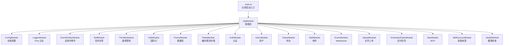
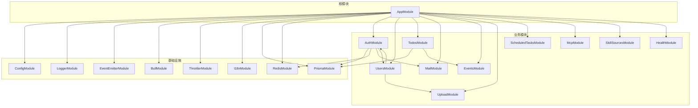
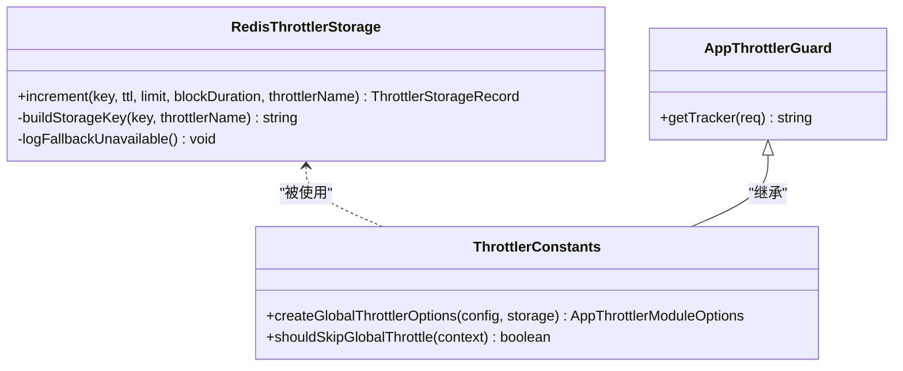
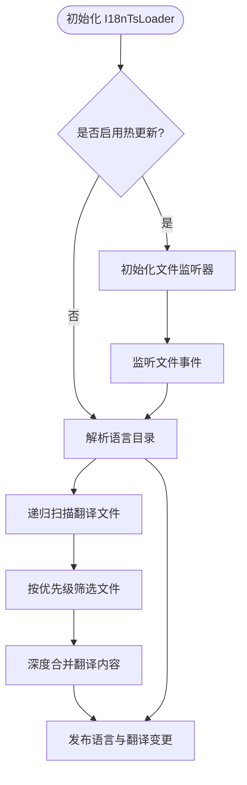
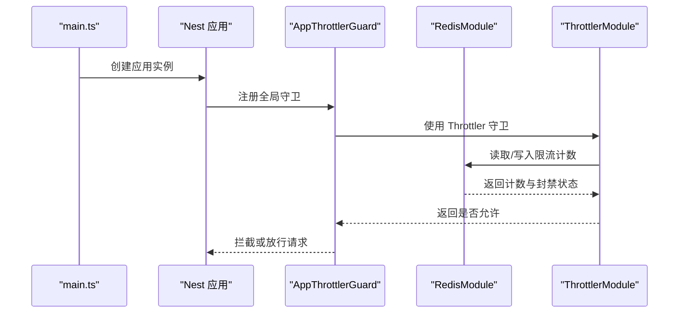

# 根模块配置

<cite>
**本文引用的文件**
- [apps/backend/src/app.module.ts](file://apps/backend/src/app.module.ts)
- [apps/backend/src/main.ts](file://apps/backend/src/main.ts)
- [apps/backend/src/common/throttling/index.ts](file://apps/backend/src/common/throttling/index.ts)
- [apps/backend/src/common/throttling/throttling.constants.ts](file://apps/backend/src/common/throttling/throttling.constants.ts)
- [apps/backend/src/common/throttling/throttling.guard.ts](file://apps/backend/src/common/throttling/throttling.guard.ts)
- [apps/backend/src/common/throttling/redis-throttler.storage.ts](file://apps/backend/src/common/throttling/redis-throttler.storage.ts)
- [apps/backend/src/i18n/i18n-ts.loader.ts](file://apps/backend/src/i18n/i18n-ts.loader.ts)
- [apps/backend/src/redis/redis.module.ts](file://apps/backend/src/redis/redis.module.ts)
- [apps/backend/src/prisma/prisma.module.ts](file://apps/backend/src/prisma/prisma.module.ts)
- [apps/backend/src/common/filters/all-exceptions.filter.ts](file://apps/backend/src/common/filters/all-exceptions.filter.ts)
- [apps/backend/src/common/interceptors/transform.interceptor.ts](file://apps/backend/src/common/interceptors/transform.interceptor.ts)
- [apps/backend/src/common/interceptors/sanitize.interceptor.ts](file://apps/backend/src/common/interceptors/sanitize.interceptor.ts)
- [apps/backend/src/auth/auth.module.ts](file://apps/backend/src/auth/auth.module.ts)
- [apps/backend/src/users/users.module.ts](file://apps/backend/src/users/users.module.ts)
- [apps/backend/src/todos/todos.module.ts](file://apps/backend/src/todos/todos.module.ts)
</cite>

## 目录
1. [简介](#简介)
2. [项目结构](#项目结构)
3. [核心组件](#核心组件)
4. [架构总览](#架构总览)
5. [详细组件分析](#详细组件分析)
6. [依赖分析](#依赖分析)
7. [性能考量](#性能考量)
8. [故障排查指南](#故障排查指南)
9. [结论](#结论)
10. [附录](#附录)

## 简介
本文件围绕 Lumina Todo 后端根模块 AppModule 的设计与实现展开，系统性阐述其作为应用启动与基础设施中枢的角色。重点覆盖以下方面：
- 全局配置模块(ConfigModule)、日志模块(LoggerModule)、事件发射器(EventEmitterModule)、队列模块(BullModule)、速率限制模块(ThrottlerModule)、国际化模块(I18nModule)等核心基础设施模块的配置要点与职责边界。
- 模块导入顺序对依赖注入与生命周期的影响。
- 全局守卫与中间件的安全与治理策略。
- 根模块如何协调各子模块的生命周期与模块间通信。
- 扩展与自定义配置的最佳实践。

## 项目结构
根模块位于后端应用的 src 目录，负责装配全局基础设施与业务子模块；应用通过 main.ts 启动并注册安全中间件、静态资源、全局管道与拦截器等。

图表来源
- [apps/backend/src/app.module.ts:28-146](file://apps/backend/src/app.module.ts#L28-L146)
- [apps/backend/src/main.ts:34-205](file://apps/backend/src/main.ts#L34-L205)

章节来源
- [apps/backend/src/app.module.ts:28-146](file://apps/backend/src/app.module.ts#L28-L146)
- [apps/backend/src/main.ts:34-205](file://apps/backend/src/main.ts#L34-L205)

## 核心组件
- 全局配置模块(ConfigModule)
  - 作用：集中加载 .env 环境变量，向其他模块提供配置读取能力。
  - 关键点：设置为全局模块，支持多环境文件路径。
- 日志模块(LoggerModule)
  - 作用：基于 Pino 的高性能 HTTP 日志记录，按环境切换输出格式，并自定义日志级别与消息格式。
- 事件发射器(EventEmitterModule)
  - 作用：启用通配符事件、自定义分隔符、最大监听器数量与内存泄漏告警，支撑应用内事件驱动。
- 队列模块(BullModule)
  - 作用：基于 Redis 的后台任务队列，配置连接、默认作业选项（完成清理、失败保留、重试与指数退避）。
- 速率限制模块(ThrottlerModule)
  - 作用：全局限流，结合 Redis 存储实现跨实例一致的计数与封禁逻辑，支持多窗口策略与跳过规则。
- 国际化模块(I18nModule)
  - 作用：动态加载 i18n 翻译文件，支持语言解析器与热更新。
- 数据库与缓存
  - PrismaModule：全局提供数据库服务。
  - RedisModule：全局缓存与限流存储，支持连接重试与 TTL 配置。
- 全局守卫与中间件
  - 全局速率限制守卫：基于 ThrottlerGuard 并按代理链获取真实 IP。
  - 安全中间件：Helmet、CSRF 校验、压缩、静态资源、权限策略头等。

章节来源
- [apps/backend/src/app.module.ts:31-133](file://apps/backend/src/app.module.ts#L31-L133)
- [apps/backend/src/common/throttling/throttling.constants.ts:173-197](file://apps/backend/src/common/throttling/throttling.constants.ts#L173-L197)
- [apps/backend/src/common/throttling/redis-throttler.storage.ts:106-172](file://apps/backend/src/common/throttling/redis-throttler.storage.ts#L106-L172)
- [apps/backend/src/i18n/i18n-ts.loader.ts:86-184](file://apps/backend/src/i18n/i18n-ts.loader.ts#L86-L184)
- [apps/backend/src/redis/redis.module.ts:26-82](file://apps/backend/src/redis/redis.module.ts#L26-L82)
- [apps/backend/src/prisma/prisma.module.ts:4-9](file://apps/backend/src/prisma/prisma.module.ts#L4-L9)

## 架构总览
AppModule 作为应用的“装配中心”，将基础设施模块与业务模块按依赖关系组织，形成清晰的分层与职责划分。下图展示根模块与关键子模块之间的依赖关系：

图表来源
- [apps/backend/src/app.module.ts:134-145](file://apps/backend/src/app.module.ts#L134-L145)
- [apps/backend/src/auth/auth.module.ts:19-39](file://apps/backend/src/auth/auth.module.ts#L19-L39)
- [apps/backend/src/users/users.module.ts:7-12](file://apps/backend/src/users/users.module.ts#L7-L12)
- [apps/backend/src/todos/todos.module.ts:8-13](file://apps/backend/src/todos/todos.module.ts#L8-L13)

## 详细组件分析

### 速率限制模块与全局守卫
- 设计理念
  - 采用多窗口（短/中/长）限流策略，结合 Redis 原子脚本实现跨实例一致的计数与封禁。
  - 全局守卫通过自定义 Tracker 优先使用代理链最后一跳 IP，提升准确性。
- 关键实现要点
  - Redis 原子脚本：在单 Key 上维护 hits、block、sequence 等集合，保证并发安全与低延迟。
  - 降级策略：当无法获取原生 Redis 客户端时回退到内存存储并记录告警。
  - 跳过规则：对 OPTIONS 预检与健康检查路径跳过全局限流。
- 扩展建议
  - 为不同业务场景（如登录、注册、文件上传）定义独立策略，或通过装饰器细化限流粒度。
  - 结合白名单与灰名单机制，对可信来源放宽限制。

图表来源
- [apps/backend/src/common/throttling/redis-throttler.storage.ts:106-172](file://apps/backend/src/common/throttling/redis-throttler.storage.ts#L106-L172)
- [apps/backend/src/common/throttling/throttling.guard.ts:28-33](file://apps/backend/src/common/throttling/throttling.guard.ts#L28-L33)
- [apps/backend/src/common/throttling/throttling.constants.ts:173-197](file://apps/backend/src/common/throttling/throttling.constants.ts#L173-L197)

章节来源
- [apps/backend/src/common/throttling/redis-throttler.storage.ts:106-172](file://apps/backend/src/common/throttling/redis-throttler.storage.ts#L106-L172)
- [apps/backend/src/common/throttling/throttling.guard.ts:28-33](file://apps/backend/src/common/throttling/throttling.guard.ts#L28-L33)
- [apps/backend/src/common/throttling/throttling.constants.ts:173-197](file://apps/backend/src/common/throttling/throttling.constants.ts#L173-L197)

### 国际化模块与翻译加载器
- 设计理念
  - 动态加载 i18n 翻译文件，支持目录递归扫描与文件优先级选择（优先非声明文件）。
  - 支持热更新：监听文件变化并触发翻译刷新。
- 关键实现要点
  - 递归扫描与去重：按基础名合并同名文件，优先选择 JS/TS 实现。
  - 深度合并：同一键名下多文件内容按层级合并。
  - 错误兜底：加载失败时记录错误并返回空对象，避免中断服务。

图表来源
- [apps/backend/src/i18n/i18n-ts.loader.ts:86-184](file://apps/backend/src/i18n/i18n-ts.loader.ts#L86-L184)

章节来源
- [apps/backend/src/i18n/i18n-ts.loader.ts:86-184](file://apps/backend/src/i18n/i18n-ts.loader.ts#L86-L184)

### 日志模块与请求日志定制
- 设计理念
  - 基于 Pino 的高性能日志，生产环境输出 JSON，开发环境使用 pino-pretty。
  - 自定义日志级别（按状态码）、成功/错误消息格式与序列化器，排除健康检查端点。
- 关键实现要点
  - 环境感知：根据 NODE_ENV 切换日志级别与传输器。
  - 自定义属性与序列化：仅记录必要字段，降低开销。
  - 成功与错误消息格式化：便于可观测性与审计。

章节来源
- [apps/backend/src/app.module.ts:36-89](file://apps/backend/src/app.module.ts#L36-L89)

### 缓存与限流存储（Redis）
- 设计理念
  - 通过全局 RedisModule 提供统一缓存与限流存储，支持连接重试、TTL 与键前缀。
- 关键实现要点
  - 连接工厂：异步创建 RedisStore，具备重试策略与错误日志。
  - 导出服务：供 ThrottlerModule 与业务模块共享使用。

章节来源
- [apps/backend/src/redis/redis.module.ts:26-82](file://apps/backend/src/redis/redis.module.ts#L26-L82)

### 数据库模块（Prisma）
- 设计理念
  - 全局提供 PrismaService，简化数据库访问与事务管理。
- 关键实现要点
  - 单例导出：避免重复实例化，统一连接池。

章节来源
- [apps/backend/src/prisma/prisma.module.ts:4-9](file://apps/backend/src/prisma/prisma.module.ts#L4-L9)

### 全局异常过滤器与响应拦截器
- 设计理念
  - 统一异常处理与响应格式，支持国际化错误消息与结构化错误对象。
  - 对输入进行 XSS 清理，保障安全性。
- 关键实现要点
  - 异常过滤器：识别 Zod 验证错误并映射字段，结合 I18nContext 进行翻译。
  - 响应拦截器：将成功响应统一封装为 { success, data, timestamp }。
  - XSS 清理拦截器：递归清理请求体、查询参数与路径参数中的 HTML。

章节来源
- [apps/backend/src/common/filters/all-exceptions.filter.ts:16-136](file://apps/backend/src/common/filters/all-exceptions.filter.ts#L16-L136)
- [apps/backend/src/common/interceptors/transform.interceptor.ts:18-29](file://apps/backend/src/common/interceptors/transform.interceptor.ts#L18-L29)
- [apps/backend/src/common/interceptors/sanitize.interceptor.ts:9-63](file://apps/backend/src/common/interceptors/sanitize.interceptor.ts#L9-L63)

### 子模块依赖与循环引用
- 认证模块(AuthModule)依赖 Prisma、Redis、Mail 与 Users 模块；Users 模块反向依赖 AuthModule，使用 forwardRef 解决循环依赖。
- 待办模块(TodosModule)依赖 Prisma 与 Events 模块。

章节来源
- [apps/backend/src/auth/auth.module.ts:19-39](file://apps/backend/src/auth/auth.module.ts#L19-L39)
- [apps/backend/src/users/users.module.ts:7-12](file://apps/backend/src/users/users.module.ts#L7-L12)
- [apps/backend/src/todos/todos.module.ts:8-13](file://apps/backend/src/todos/todos.module.ts#L8-L13)

## 依赖分析
- 模块导入顺序
  - 基础设施模块（Config、Logger、Event、Bull、Throttler、I18n、Prisma、Redis）应先于业务模块导入，确保后续模块可正确注入依赖。
  - 业务模块内部遵循“下游依赖上游”的原则，如 Auth 依赖 Prisma/Redis/Mail/Users。
- 依赖注入与生命周期
  - 全局守卫与中间件在应用启动阶段即生效，确保从请求进入开始即受控。
  - Redis 与 Prisma 作为全局模块，提供单例服务，贯穿应用生命周期。
- 模块间通信
  - 通过事件发射器进行解耦通信；通过队列模块异步处理耗时任务；通过国际化模块统一文案。

图表来源
- [apps/backend/src/main.ts:34-205](file://apps/backend/src/main.ts#L34-L205)
- [apps/backend/src/common/throttling/throttling.guard.ts:28-33](file://apps/backend/src/common/throttling/throttling.guard.ts#L28-L33)
- [apps/backend/src/redis/redis.module.ts:26-82](file://apps/backend/src/redis/redis.module.ts#L26-L82)

章节来源
- [apps/backend/src/main.ts:34-205](file://apps/backend/src/main.ts#L34-L205)
- [apps/backend/src/common/throttling/throttling.guard.ts:28-33](file://apps/backend/src/common/throttling/throttling.guard.ts#L28-L33)
- [apps/backend/src/redis/redis.module.ts:26-82](file://apps/backend/src/redis/redis.module.ts#L26-L82)

## 性能考量
- 日志性能
  - 生产环境使用 JSON 输出，减少格式化开销；仅记录必要字段，避免冗余序列化。
- 限流性能
  - Redis 原子脚本一次性完成计数与封禁判断，降低网络往返与竞争条件风险。
- 缓存与队列
  - Redis 连接池与懒加载策略平衡资源占用与延迟；队列默认移除完成任务，控制内存占用。
- 中间件与拦截器
  - 压缩与静态资源在 Fastify 层处理，减少应用层负担；XSS 清理仅对必要对象执行，避免全量扫描。

## 故障排查指南
- 限流不生效或频繁封禁
  - 检查 Redis 连接与可用性，确认原生客户端是否可用；查看日志中关于回退到内存存储的告警。
  - 核对跳过规则（OPTIONS 与健康检查路径）与代理链 IP 获取逻辑。
- 国际化文案未更新
  - 确认热更新开关与监听器状态；检查翻译文件是否符合命名规范且未被缓存。
- 请求被 CSRF 拦截
  - 确认客户端是否携带 X-Requested-With 头；检查静态资源与健康检查路径是否被正确排除。
- 异常未按预期翻译
  - 检查 I18nContext 是否正确注入；确认错误键是否存在对应翻译。

章节来源
- [apps/backend/src/common/throttling/redis-throttler.storage.ts:106-172](file://apps/backend/src/common/throttling/redis-throttler.storage.ts#L106-L172)
- [apps/backend/src/i18n/i18n-ts.loader.ts:86-184](file://apps/backend/src/i18n/i18n-ts.loader.ts#L86-L184)
- [apps/backend/src/common/filters/all-exceptions.filter.ts:16-136](file://apps/backend/src/common/filters/all-exceptions.filter.ts#L16-L136)
- [apps/backend/src/main.ts:125-167](file://apps/backend/src/main.ts#L125-L167)

## 结论
AppModule 通过精心设计的基础设施模块组合，构建了高可用、可观测、可扩展的后端骨架。其关键价值在于：
- 明确的模块边界与导入顺序，确保依赖注入稳定可靠。
- 全局守卫与中间件形成统一的安全与治理防线。
- 事件、队列、国际化等模块协同工作，支撑复杂业务场景。
- 通过 Redis 原子脚本与热更新等机制，兼顾性能与可维护性。

## 附录
- 扩展与自定义配置最佳实践
  - 限流策略：为不同端点与业务场景定义差异化策略，必要时引入装饰器级限流。
  - 国际化：保持翻译键的层次化与可维护性，定期清理无用键。
  - 日志：按环境调整级别与传输器，避免敏感信息泄露。
  - 缓存：合理设置 TTL 与键前缀，避免命名冲突。
  - 队列：根据任务特性调整重试次数与退避策略，监控失败队列。
  - 安全：持续评估中间件策略，配合 WAF 与 CDN 提升整体防护能力。