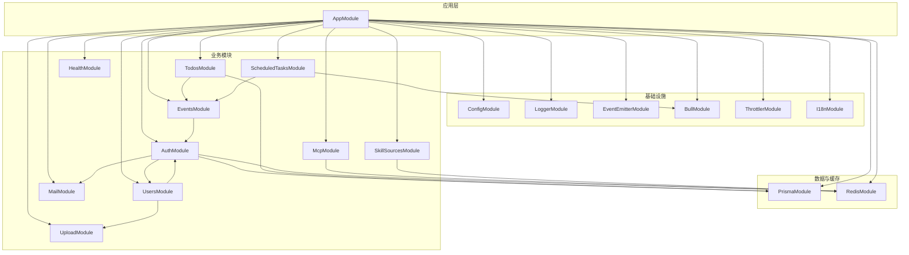
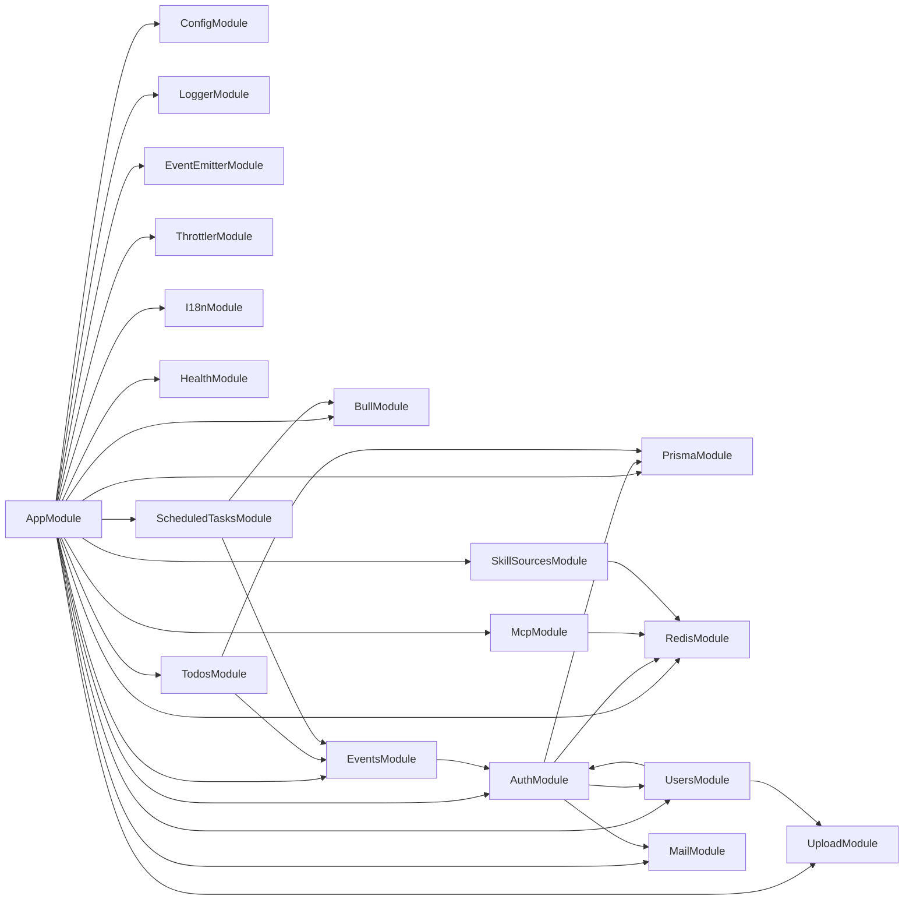

# 模块设计

<cite>
**本文引用的文件**
- [apps/backend/src/app.module.ts](file://apps/backend/src/app.module.ts)
- [apps/backend/src/main.ts](file://apps/backend/src/main.ts)
- [apps/backend/src/auth/auth.module.ts](file://apps/backend/src/auth/auth.module.ts)
- [apps/backend/src/todos/todos.module.ts](file://apps/backend/src/todos/todos.module.ts)
- [apps/backend/src/mcp/mcp.module.ts](file://apps/backend/src/mcp/mcp.module.ts)
- [apps/backend/src/users/users.module.ts](file://apps/backend/src/users/users.module.ts)
- [apps/backend/src/events/events.module.ts](file://apps/backend/src/events/events.module.ts)
- [apps/backend/src/upload/upload.module.ts](file://apps/backend/src/upload/upload.module.ts)
- [apps/backend/src/health/health.module.ts](file://apps/backend/src/health/health.module.ts)
- [apps/backend/src/skill-sources/skill-sources.module.ts](file://apps/backend/src/skill-sources/skill-sources.module.ts)
- [apps/backend/src/scheduled-tasks/scheduled-tasks.module.ts](file://apps/backend/src/scheduled-tasks/scheduled-tasks.module.ts)
- [apps/backend/src/prisma/prisma.module.ts](file://apps/backend/src/prisma/prisma.module.ts)
- [apps/backend/src/redis/redis.module.ts](file://apps/backend/src/redis/redis.module.ts)
- [apps/backend/src/mail/mail.module.ts](file://apps/backend/src/mail/mail.module.ts)
- [apps/backend/src/common/index.ts](file://apps/backend/src/common/index.ts)
</cite>

## 目录

1. [引言](#引言)
2. [项目结构](#项目结构)
3. [核心组件](#核心组件)
4. [架构总览](#架构总览)
5. [详细组件分析](#详细组件分析)
6. [依赖分析](#依赖分析)
7. [性能考虑](#性能考虑)
8. [故障排除指南](#故障排除指南)
9. [结论](#结论)
10. [附录](#附录)

## 引言

本文件面向 Lumina Todo 后端模块设计，系统性阐述基于 NestJS 的模块化架构设计理念与实现方式。重点覆盖根模块 AppModule 的组织结构、模块导入顺序、模块间依赖关系与生命周期管理；逐项解析认证模块(AuthModule)、任务模块(TodosModule)、MCP模块(McpModule)、用户模块(UsersModule)、事件模块(EventsModule)、上传模块(UploadModule)、健康检查模块(HealthModule)、定时任务模块(ScheduledTasksModule)、技能源模块(SkillSourcesModule)、数据库模块(PrismaModule)、缓存模块(RedisModule)、邮件模块(MailModule)等核心模块的职责边界、依赖注入与模块间通信方式，并给出模块扩展与自定义模块开发的最佳实践。

## 项目结构

后端采用多模块单体架构，根模块 AppModule 通过 imports 统一装配各子模块，形成清晰的领域边界与依赖层次。应用入口 main.ts 负责初始化 HTTP 适配器、注册安全与静态资源中间件、全局管道与拦截器、Swagger 文档以及优雅退出钩子。

```mermaid
graph TB
A["根模块 AppModule<br/>apps/backend/src/app.module.ts"] --> B["配置模块 ConfigModule"]
A --> C["日志模块 LoggerModule"]
A --> D["事件模块 EventEmitterModule"]
A --> E["队列模块 BullModule"]
A --> F["速率限制 ThrottlerModule"]
A --> G["国际化 I18nModule"]
A --> H["数据库 PrismaModule"]
A --> I["缓存 RedisModule"]
A --> J["健康检查 HealthModule"]
A --> K["认证 AuthModule"]
A --> L["用户 UsersModule"]
A --> M["邮件 MailModule"]
A --> N["事件 EventsModule"]
A --> O["上传 UploadModule"]
A --> P["技能源 SkillSourcesModule"]
A --> Q["任务 TodosModule"]
A --> R["定时任务 ScheduledTasksModule"]
A --> S["MCP McpModule"]
```

图表来源

- [apps/backend/src/app.module.ts:28-146](file://apps/backend/src/app.module.ts#L28-L146)

章节来源

- [apps/backend/src/app.module.ts:28-146](file://apps/backend/src/app.module.ts#L28-L146)
- [apps/backend/src/main.ts:34-211](file://apps/backend/src/main.ts#L34-L211)

## 核心组件

- 根模块 AppModule：集中声明全局配置、日志、事件、队列、速率限制、国际化、数据库、缓存、健康检查、认证、用户、邮件、事件、上传、技能源、任务、定时任务、MCP 等模块，并提供全局速率限制守卫。
- 应用入口 main.ts：创建 NestFastifyApplication，启用 CORS、Helmet、压缩、静态资源、CSRF 校验钩子、Zod 验证管道、全局异常过滤器与响应拦截器，生成并发布 Swagger 文档，设置全局前缀与优雅退出。
- 全局通用模块导出：common/index.ts 汇总了过滤器、拦截器、限流与类型定义，便于在各模块中复用。

章节来源

- [apps/backend/src/app.module.ts:147-154](file://apps/backend/src/app.module.ts#L147-L154)
- [apps/backend/src/main.ts:34-211](file://apps/backend/src/main.ts#L34-L211)
- [apps/backend/src/common/index.ts:1-15](file://apps/backend/src/common/index.ts#L1-L15)

## 架构总览

下图展示根模块对各子模块的装配关系与关键依赖方向：

图表来源

- [apps/backend/src/app.module.ts:28-146](file://apps/backend/src/app.module.ts#L28-L146)
- [apps/backend/src/auth/auth.module.ts:19-39](file://apps/backend/src/auth/auth.module.ts#L19-L39)
- [apps/backend/src/users/users.module.ts:7-12](file://apps/backend/src/users/users.module.ts#L7-L12)
- [apps/backend/src/events/events.module.ts:9-13](file://apps/backend/src/events/events.module.ts#L9-L13)
- [apps/backend/src/todos/todos.module.ts:8-14](file://apps/backend/src/todos/todos.module.ts#L8-L14)
- [apps/backend/src/mcp/mcp.module.ts:13-24](file://apps/backend/src/mcp/mcp.module.ts#L13-L24)
- [apps/backend/src/scheduled-tasks/scheduled-tasks.module.ts:15-24](file://apps/backend/src/scheduled-tasks/scheduled-tasks.module.ts#L15-L24)
- [apps/backend/src/skill-sources/skill-sources.module.ts:6-10](file://apps/backend/src/skill-sources/skill-sources.module.ts#L6-L10)
- [apps/backend/src/health/health.module.ts:8-13](file://apps/backend/src/health/health.module.ts#L8-L13)

## 详细组件分析

### 根模块 AppModule 设计

- 全局配置：ConfigModule.forRoot，支持多环境变量文件，标记为全局模块。
- 日志：LoggerModule 以工厂函数按环境动态配置输出格式与级别。
- 事件：EventEmitterModule 开启通配符与内存泄漏告警。
- 队列：BullModule 注册 Redis 连接与默认作业选项（完成即删、失败保留、重试与指数退避）。
- 速率限制：ThrottlerModule 注入 Redis 存储，使用工厂函数生成全局限流策略。
- 国际化：I18nModule 加载 i18n 字典，支持请求头与 Accept-Language 解析。
- 数据与缓存：PrismaModule、RedisModule 作为全局模块提供服务。
- 业务模块：健康检查、认证、用户、邮件、事件、上传、技能源、任务、定时任务、MCP 按需导入。
- 全局守卫：APP_GUARD 绑定自定义限流守卫。

章节来源

- [apps/backend/src/app.module.ts:28-154](file://apps/backend/src/app.module.ts#L28-L154)

### 认证模块 AuthModule

- 职责：提供登录、令牌签发与校验、密码服务、JWT 策略、与用户模块协作。
- 依赖：PrismaModule（持久层）、MailModule（邮件通知）、RedisModule（黑名单/会话）、UsersModule（用户资料）、Passport/JWT 模块。
- 导出：AuthService、TokenService、PasswordService、JwtModule、PassportModule，供其他模块复用。

章节来源

- [apps/backend/src/auth/auth.module.ts:19-39](file://apps/backend/src/auth/auth.module.ts#L19-L39)

### 任务模块 TodosModule

- 职责：待办事项 CRUD、同步与提醒逻辑。
- 依赖：PrismaModule（数据库）、EventsModule（实时推送）。
- 导出：TodosService、TodoSyncService，供其他模块复用。

章节来源

- [apps/backend/src/todos/todos.module.ts:8-14](file://apps/backend/src/todos/todos.module.ts#L8-L14)

### MCP 模块 McpModule

- 职责：封装 MCP 服务器配置、传输工厂、连接管理、工具注册与客户端调用。
- 依赖：无直接数据库依赖，但可与 Redis 协作缓存元数据或会话。
- 导出：McpServerConfigService、McpClientService，供上层模块调用。

章节来源

- [apps/backend/src/mcp/mcp.module.ts:13-24](file://apps/backend/src/mcp/mcp.module.ts#L13-L24)

### 用户模块 UsersModule

- 职责：用户信息维护、头像上传与管理。
- 依赖：forwardRef(() => AuthModule)（循环依赖声明）、UploadModule。
- 导出：UsersService。

章节来源

- [apps/backend/src/users/users.module.ts:7-12](file://apps/backend/src/users/users.module.ts#L7-L12)

### 事件模块 EventsModule

- 职责：WebSocket 网关，提供实时事件推送（结合认证守卫）。
- 依赖：AuthModule（鉴权）。
- 导出：EventsGateway。

章节来源

- [apps/backend/src/events/events.module.ts:9-13](file://apps/backend/src/events/events.module.ts#L9-L13)

### 上传模块 UploadModule

- 职责：文件上传、本地/云存储抽象、文件解析。
- 依赖：无直接数据库依赖，可与 Redis/Mail 协作。
- 导出：StorageService、FileParsingService。

章节来源

- [apps/backend/src/upload/upload.module.ts:10-15](file://apps/backend/src/upload/upload.module.ts#L10-L15)

### 健康检查模块 HealthModule

- 职责：基于 Terminus 的健康检查端点，包含 Prisma 与 Redis 健康指示器。
- 依赖：PrismaModule、TerminusModule。
- 导出：HealthController。

章节来源

- [apps/backend/src/health/health.module.ts:8-13](file://apps/backend/src/health/health.module.ts#L8-L13)

### 定时任务模块 ScheduledTasksModule

- 职责：基于 BullMQ 的重复任务调度，清理过期数据、健康检查、待办提醒、每日统计。
- 生命周期：OnModuleInit 清理旧重复任务并注册新任务。
- 依赖：BullModule（队列）、EventsModule（事件通知）。
- 导出：BullModule（队列实例）。

章节来源

- [apps/backend/src/scheduled-tasks/scheduled-tasks.module.ts:25-91](file://apps/backend/src/scheduled-tasks/scheduled-tasks.module.ts#L25-L91)

### 技能源模块 SkillSourcesModule

- 职责：技能源代理与运行时控制（HTTP/STDIO 等），与 MCP 工具链协同。
- 依赖：无直接数据库依赖，可与 Redis 协作缓存配置。
- 导出：SkillRuntimeService。

章节来源

- [apps/backend/src/skill-sources/skill-sources.module.ts:6-10](file://apps/backend/src/skill-sources/skill-sources.module.ts#L6-L10)

### 数据库模块 PrismaModule

- 职责：全局提供 PrismaService，贯穿各业务模块。
- 依赖：无。
- 导出：PrismaService。

章节来源

- [apps/backend/src/prisma/prisma.module.ts:4-9](file://apps/backend/src/prisma/prisma.module.ts#L4-L9)

### 缓存模块 RedisModule

- 职责：全局 Redis 缓存配置、连接重试策略、TTL 与键前缀、限流存储。
- 依赖：ConfigModule。
- 导出：CacheModule、RedisService。

章节来源

- [apps/backend/src/redis/redis.module.ts:26-83](file://apps/backend/src/redis/redis.module.ts#L26-L83)

### 邮件模块 MailModule

- 职责：基于 nodemailer 的 SMTP 配置与邮件发送服务。
- 依赖：ConfigModule。
- 导出：MailService。

章节来源

- [apps/backend/src/mail/mail.module.ts:11-36](file://apps/backend/src/mail/mail.module.ts#L11-L36)

### 模块间通信与依赖注入

- 依赖注入：各模块通过 @Module 的 providers 导出服务，其他模块通过 imports 使用并注入。
- 循环依赖：UsersModule 对 AuthModule 使用 forwardRef，避免导入顺序导致的编译错误。
- 事件通信：EventEmitterModule 提供应用内事件总线，EventsModule 与 ScheduledTasksModule 等通过事件进行解耦通信。
- 队列通信：BullModule 作为跨进程/跨节点的任务通道，ScheduledTasksModule 通过队列触发周期性任务。

章节来源

- [apps/backend/src/users/users.module.ts:7-12](file://apps/backend/src/users/users.module.ts#L7-L12)
- [apps/backend/src/app.module.ts:90-123](file://apps/backend/src/app.module.ts#L90-L123)
- [apps/backend/src/scheduled-tasks/scheduled-tasks.module.ts:15-24](file://apps/backend/src/scheduled-tasks/scheduled-tasks.module.ts#L15-L24)

### 生命周期管理

- AppModule：作为根模块，负责全局模块的装配与守卫注册。
- ScheduledTasksModule：OnModuleInit 阶段清理并注册重复任务，保证配置变更生效。
- main.ts：应用启动阶段注册安全中间件、静态资源、全局管道与拦截器、Swagger 文档与优雅退出钩子。

章节来源

- [apps/backend/src/scheduled-tasks/scheduled-tasks.module.ts:25-91](file://apps/backend/src/scheduled-tasks/scheduled-tasks.module.ts#L25-L91)
- [apps/backend/src/main.ts:34-211](file://apps/backend/src/main.ts#L34-L211)

### 模块扩展与自定义模块开发最佳实践

- 保持单一职责：每个模块聚焦一个领域边界，避免“上帝模块”。
- 明确导出：仅导出必要的服务/控制器/网关，避免过度暴露。
- 使用 forwardRef：处理循环依赖时优先使用 forwardRef，提升可维护性。
- 全局模块最小化：仅在确有需要时使用 @Global，避免污染全局命名空间。
- 依赖注入与作用域：合理选择服务作用域（默认单例），避免滥用请求/原型作用域。
- 事件与队列：复杂流程拆分为事件/队列，降低耦合度。
- 配置与环境：通过 ConfigModule 统一读取，避免硬编码。
- 安全与合规：在 main.ts 中启用 Helmet、CSRF 校验、XSS 清理与压缩，确保生产安全基线。

## 依赖分析

模块导入顺序与依赖方向如下所示：

图表来源

- [apps/backend/src/app.module.ts:28-146](file://apps/backend/src/app.module.ts#L28-L146)
- [apps/backend/src/auth/auth.module.ts:19-39](file://apps/backend/src/auth/auth.module.ts#L19-L39)
- [apps/backend/src/users/users.module.ts:7-12](file://apps/backend/src/users/users.module.ts#L7-L12)
- [apps/backend/src/events/events.module.ts:9-13](file://apps/backend/src/events/events.module.ts#L9-L13)
- [apps/backend/src/todos/todos.module.ts:8-14](file://apps/backend/src/todos/todos.module.ts#L8-L14)
- [apps/backend/src/mcp/mcp.module.ts:13-24](file://apps/backend/src/mcp/mcp.module.ts#L13-L24)
- [apps/backend/src/scheduled-tasks/scheduled-tasks.module.ts:15-24](file://apps/backend/src/scheduled-tasks/scheduled-tasks.module.ts#L15-L24)
- [apps/backend/src/skill-sources/skill-sources.module.ts:6-10](file://apps/backend/src/skill-sources/skill-sources.module.ts#L6-L10)
- [apps/backend/src/health/health.module.ts:8-13](file://apps/backend/src/health/health.module.ts#L8-L13)

## 性能考虑

- 队列与任务：BullMQ 的重复任务与指数退避策略减少抖动，完成即删降低堆积风险；注意监控队列长度与作业耗时。
- 缓存：RedisModule 提供 TTL 与键前缀，建议对热点数据设置合理 TTL 并避免键名冲突。
- 日志：生产环境使用 JSON 输出，避免额外格式化开销；开发环境使用 pino-pretty 提升可观测性。
- 安全中间件：Helmet、CSRF 校验与压缩在 main.ts 中统一启用，减少重复实现。
- 速率限制：ThrottlerModule 结合 Redis 存储，避免单实例限流失效；注意阈值与窗口设置。

## 故障排除指南

- 启动失败：检查 main.ts 中的 CORS、静态资源目录、CSRF 校验钩子与全局管道是否正确配置。
- 认证问题：确认 JWT 密钥、过期时间与 Passport/JWT 配置；核对 AuthModule 导入顺序与 Redis 连接。
- 任务未执行：检查 ScheduledTasksModule 的 OnModuleInit 是否执行、重复任务是否被清理或注册成功。
- 健康检查异常：确认 HealthModule 的 Prisma 与 Redis 健康指示器配置与连接参数。
- 上传失败：核对 UploadModule 的存储服务与文件大小/数量限制，检查静态资源映射路径。

章节来源

- [apps/backend/src/main.ts:34-211](file://apps/backend/src/main.ts#L34-L211)
- [apps/backend/src/scheduled-tasks/scheduled-tasks.module.ts:25-91](file://apps/backend/src/scheduled-tasks/scheduled-tasks.module.ts#L25-L91)
- [apps/backend/src/health/health.module.ts:8-13](file://apps/backend/src/health/health.module.ts#L8-L13)

## 结论

本设计以 AppModule 为核心，围绕 Prisma、Redis、BullMQ、Passport/JWT、EventEmitter 等基础设施构建模块化体系，通过 forwardRef、事件与队列实现松耦合，借助 main.ts 的全局中间件与管道保障安全与一致性。各模块职责清晰、依赖明确，具备良好的扩展性与可维护性。建议在新增模块时遵循单一职责、最小导出、显式依赖与全局模块最小化原则，并充分利用事件与队列解耦复杂流程。

## 附录

- 模块导入顺序建议（从上到下为依赖方向）：Config → Logger → EventEmitter → BullMQ → Throttler → I18n → Prisma → Redis → Health → Auth → Users → Mail → Events → Upload → SkillSources → Todos → ScheduledTasks → Mcp
- 关键配置项参考：JWT*SECRET、JWT_ACCESS_EXPIRES_IN、REDIS*\_、MAIL\_\_、UPLOAD_MAX_SIZE、UPLOAD_MAX_FILES、CORS_ORIGIN、LOG_LEVEL、NODE_ENV
