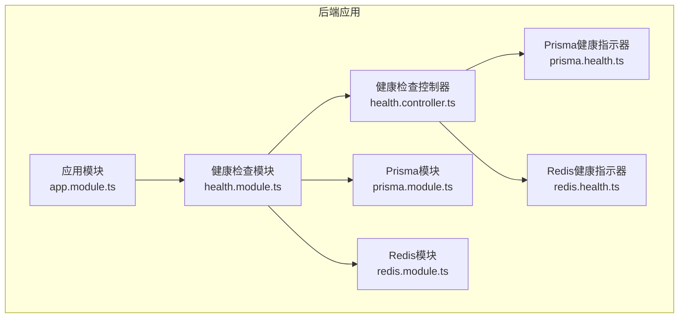
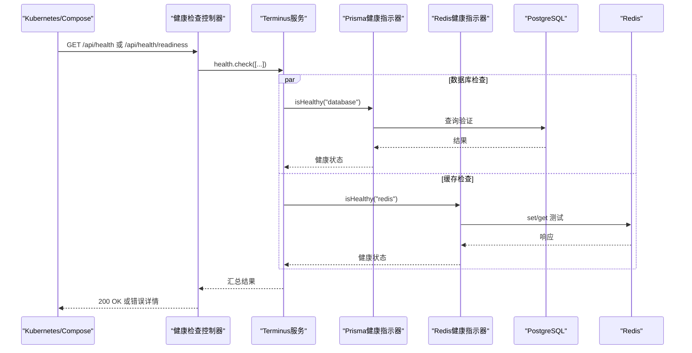
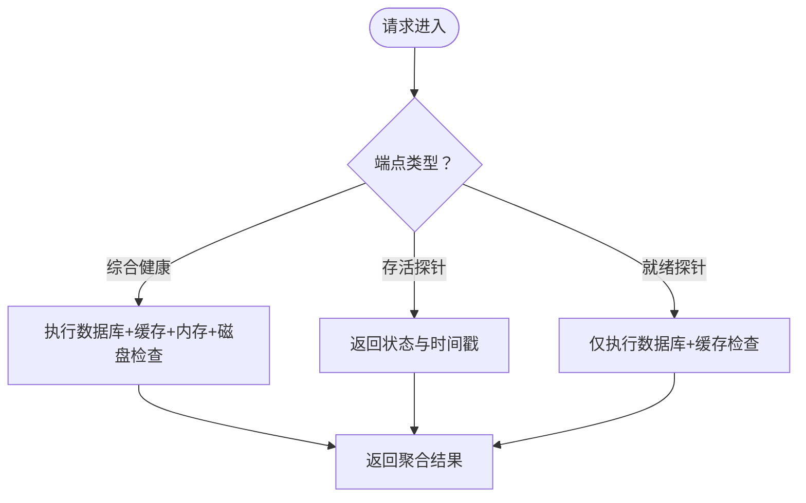
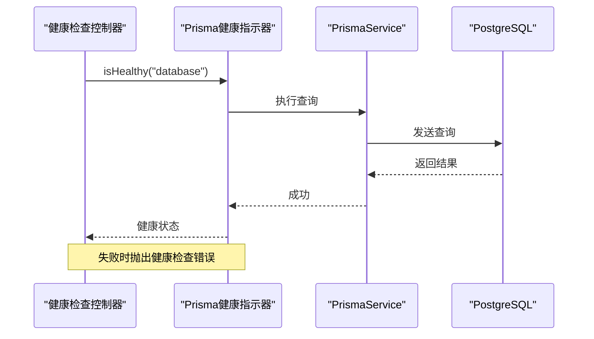
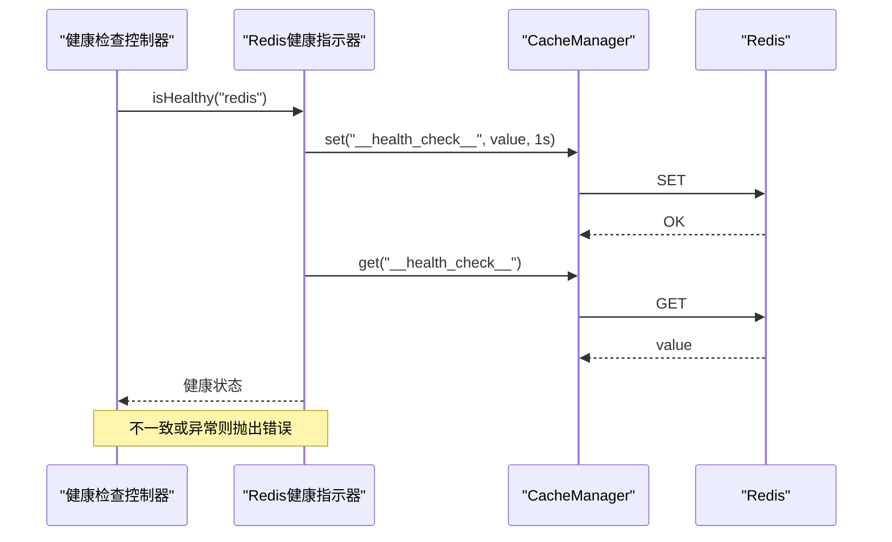
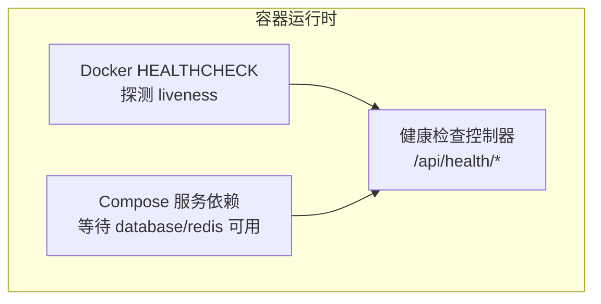
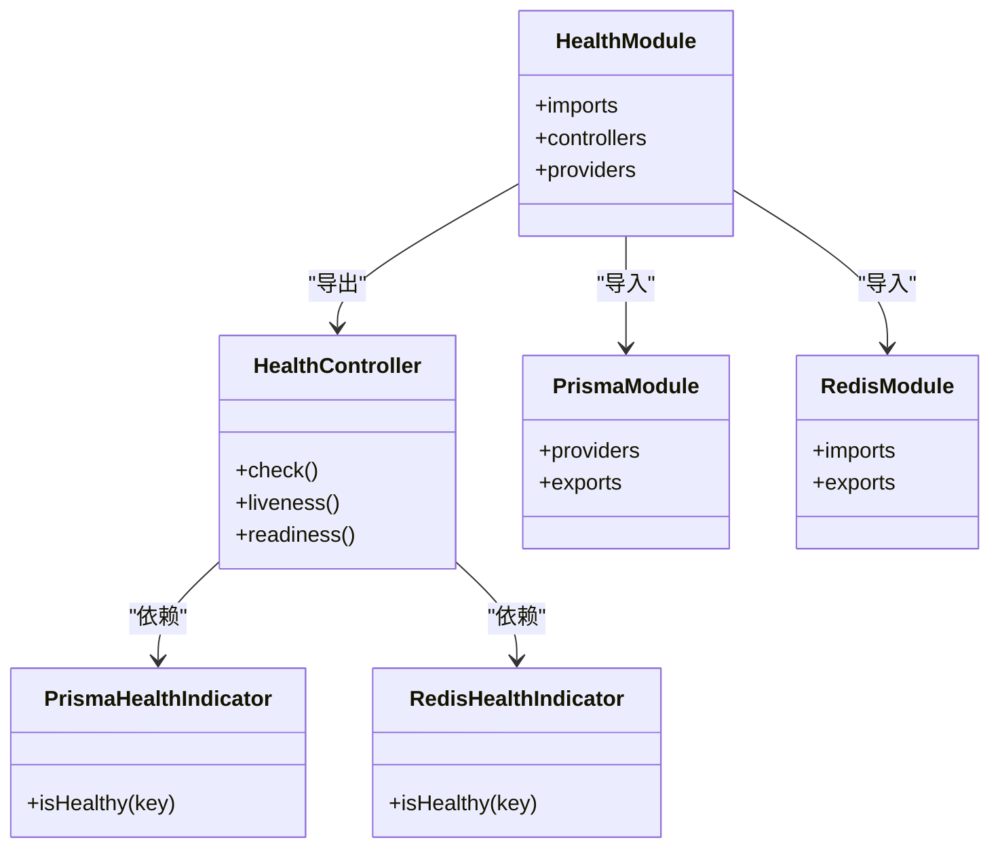

# 健康检查

<cite>
**本文引用的文件**
- [apps/backend/src/health/health.controller.ts](file://apps/backend/src/health/health.controller.ts)
- [apps/backend/src/health/prisma.health.ts](file://apps/backend/src/health/prisma.health.ts)
- [apps/backend/src/redis/redis.health.ts](file://apps/backend/src/redis/redis.health.ts)
- [apps/backend/src/health/health.module.ts](file://apps/backend/src/health/health.module.ts)
- [apps/backend/src/prisma/prisma.module.ts](file://apps/backend/src/prisma/prisma.module.ts)
- [apps/backend/src/redis/redis.module.ts](file://apps/backend/src/redis/redis.module.ts)
- [apps/backend/src/app.module.ts](file://apps/backend/src/app.module.ts)
- [apps/backend/Dockerfile](file://apps/backend/Dockerfile)
- [docker-compose.yml](file://docker-compose.yml)
- [docker-compose.dev.yml](file://docker-compose.dev.yml)
- [apps/backend/src/common/throttling/throttling.constants.ts](file://apps/backend/src/common/throttling/throttling.constants.ts)
</cite>

## 目录

1. [简介](#简介)
2. [项目结构](#项目结构)
3. [核心组件](#核心组件)
4. [架构总览](#架构总览)
5. [详细组件分析](#详细组件分析)
6. [依赖分析](#依赖分析)
7. [性能考量](#性能考量)
8. [故障排查指南](#故障排查指南)
9. [结论](#结论)
10. [附录](#附录)

## 简介

本文件面向Lumina Todo后端的健康检查系统，围绕以下目标展开：

- 深入解析健康检查控制器的实现与职责边界，明确综合健康检查、存活探针与就绪探针的功能差异与适用场景。
- 详解Prisma数据库健康检查与Redis服务健康检查的具体实现机制与错误传播方式。
- 阐述内存使用监控（堆与RSS）与磁盘存储监控的阈值配置与检查逻辑。
- 解释Kubernetes集成中的健康检查端点使用，包括liveness与readiness探针的配置要点与最佳实践。
- 提供健康检查结果解读、常见故障诊断方法与自动恢复建议。

## 项目结构

健康检查相关代码集中在后端应用的health与redis子模块，并通过NestJS的Terminus模块统一对外提供健康检查能力。整体结构如下：

图表来源

- [apps/backend/src/health/health.controller.ts:1-80](file://apps/backend/src/health/health.controller.ts#L1-L80)
- [apps/backend/src/health/health.module.ts:1-14](file://apps/backend/src/health/health.module.ts#L1-L14)
- [apps/backend/src/health/prisma.health.ts:1-32](file://apps/backend/src/health/prisma.health.ts#L1-L32)
- [apps/backend/src/redis/redis.health.ts:1-43](file://apps/backend/src/redis/redis.health.ts#L1-L43)
- [apps/backend/src/prisma/prisma.module.ts:1-10](file://apps/backend/src/prisma/prisma.module.ts#L1-L10)
- [apps/backend/src/redis/redis.module.ts:1-84](file://apps/backend/src/redis/redis.module.ts#L1-L84)
- [apps/backend/src/app.module.ts:1-160](file://apps/backend/src/app.module.ts#L1-L160)

章节来源

- [apps/backend/src/health/health.controller.ts:1-80](file://apps/backend/src/health/health.controller.ts#L1-L80)
- [apps/backend/src/health/health.module.ts:1-14](file://apps/backend/src/health/health.module.ts#L1-L14)
- [apps/backend/src/app.module.ts:1-160](file://apps/backend/src/app.module.ts#L1-L160)

## 核心组件

- 健康检查控制器：提供综合健康检查、存活探针与就绪探针三个端点，统一由Terminus驱动，组合数据库、缓存、内存与磁盘四项指标。
- Prisma健康指示器：通过一次轻量查询验证数据库连通性，异常时抛出健康检查错误。
- Redis健康指示器：通过写入/读取测试键验证缓存连通性与一致性，异常时抛出健康检查错误。
- 健康检查模块：装配Terminus、Prisma模块与自定义指示器，导出控制器。
- 应用模块：注册健康检查模块，使能全局速率限制豁免策略以保护健康检查端点。

章节来源

- [apps/backend/src/health/health.controller.ts:1-80](file://apps/backend/src/health/health.controller.ts#L1-L80)
- [apps/backend/src/health/prisma.health.ts:1-32](file://apps/backend/src/health/prisma.health.ts#L1-L32)
- [apps/backend/src/redis/redis.health.ts:1-43](file://apps/backend/src/redis/redis.health.ts#L1-L43)
- [apps/backend/src/health/health.module.ts:1-14](file://apps/backend/src/health/health.module.ts#L1-L14)
- [apps/backend/src/app.module.ts:1-160](file://apps/backend/src/app.module.ts#L1-L160)

## 架构总览

健康检查端到端流程如下：

图表来源

- [apps/backend/src/health/health.controller.ts:34-78](file://apps/backend/src/health/health.controller.ts#L34-L78)
- [apps/backend/src/health/prisma.health.ts:19-30](file://apps/backend/src/health/prisma.health.ts#L19-L30)
- [apps/backend/src/redis/redis.health.ts:20-41](file://apps/backend/src/redis/redis.health.ts#L20-L41)

## 详细组件分析

### 健康检查控制器

- 综合健康检查（GET /api/health）
  - 检查项：
    - 数据库：调用Prisma健康指示器
    - 缓存：调用Redis健康指示器
    - 内存堆：阈值200MB
    - 内存RSS：阈值300MB
    - 磁盘：阈值90%已用（根分区）
  - 该端点适合全量巡检，便于运维快速定位问题域。
- 存活探针（GET /api/health/liveness）
  - 返回简单文本，用于Kubernetes liveness probe判定容器是否“存活”，不依赖数据库或缓存。
- 就绪探针（GET /api/health/readiness）
  - 仅检查数据库与缓存，作为Kubernetes readiness probe，确保流量只进入真正可用的服务实例。

图表来源

- [apps/backend/src/health/health.controller.ts:34-78](file://apps/backend/src/health/health.controller.ts#L34-L78)

章节来源

- [apps/backend/src/health/health.controller.ts:30-79](file://apps/backend/src/health/health.controller.ts#L30-L79)

### Prisma数据库健康检查

- 实现机制
  - 通过Prisma Service执行一次轻量查询，验证数据库连通性与基本可用性。
  - 成功则返回健康状态；失败捕获异常并抛出健康检查错误，包含错误信息。
- 关键点
  - 使用原生查询避免复杂SQL开销，降低对数据库的压力。
  - 错误会被Terminus捕获并转化为标准健康检查响应。

图表来源

- [apps/backend/src/health/prisma.health.ts:19-30](file://apps/backend/src/health/prisma.health.ts#L19-L30)

章节来源

- [apps/backend/src/health/prisma.health.ts:1-32](file://apps/backend/src/health/prisma.health.ts#L1-L32)

### Redis服务健康检查

- 实现机制
  - 通过Cache Manager写入/读取一个测试键，验证缓存连通性与一致性。
  - 成功返回健康状态；失败记录错误信息并抛出健康检查错误。
- 关键点
  - 测试键带极短TTL，避免污染缓存空间。
  - 读写一致性校验确保缓存既可写也可读。

图表来源

- [apps/backend/src/redis/redis.health.ts:20-41](file://apps/backend/src/redis/redis.health.ts#L20-L41)

章节来源

- [apps/backend/src/redis/redis.health.ts:1-43](file://apps/backend/src/redis/redis.health.ts#L1-L43)

### 内存与磁盘监控

- 内存监控
  - 堆内存阈值：200MB
  - RSS阈值：300MB
  - 两项检查分别评估V8堆与进程实际占用，避免仅看堆导致的资源“假阳性”。
- 磁盘监控
  - 根分区阈值：90%已用
  - 检查路径固定为根目录，适配容器内单一挂载场景。

章节来源

- [apps/backend/src/health/health.controller.ts:43-52](file://apps/backend/src/health/health.controller.ts#L43-L52)

### Kubernetes与Docker集成

- Docker健康检查
  - 后端容器使用HEALTHCHECK，探测本地存活端点，启动缓冲60秒，间隔15秒，超时5秒，重试5次。
- Compose健康检查
  - 后端服务依赖数据库与缓存均健康后再启动，健康检查同样探测存活端点。
- 端点配置
  - liveness：/api/health/liveness
  - readiness：/api/health/readiness
  - 综合健康：/api/health（不建议用于readiness）

图表来源

- [apps/backend/Dockerfile:97-99](file://apps/backend/Dockerfile#L97-L99)
- [docker-compose.yml:128-137](file://docker-compose.yml#L128-L137)
- [apps/backend/src/health/health.controller.ts:60-78](file://apps/backend/src/health/health.controller.ts#L60-L78)

章节来源

- [apps/backend/Dockerfile:97-99](file://apps/backend/Dockerfile#L97-L99)
- [docker-compose.yml:84-88](file://docker-compose.yml#L84-L88)
- [docker-compose.yml:128-137](file://docker-compose.yml#L128-L137)
- [apps/backend/src/health/health.controller.ts:60-78](file://apps/backend/src/health/health.controller.ts#L60-L78)

## 依赖分析

- 控制器依赖Terminus提供的HealthCheckService、MemoryHealthIndicator与DiskHealthIndicator，以及自定义的Prisma与Redis健康指示器。
- 健康指示器依赖对应服务：Prisma健康指示器依赖PrismaService；Redis健康指示器依赖CacheManager。
- 模块装配：HealthModule导入TerminusModule与PrismaModule，并提供控制器与两个健康指示器。
- 应用层注册HealthModule，使能健康检查端点。

图表来源

- [apps/backend/src/health/health.controller.ts:22-28](file://apps/backend/src/health/health.controller.ts#L22-L28)
- [apps/backend/src/health/health.module.ts:8-12](file://apps/backend/src/health/health.module.ts#L8-L12)
- [apps/backend/src/prisma/prisma.module.ts:4-8](file://apps/backend/src/prisma/prisma.module.ts#L4-L8)
- [apps/backend/src/redis/redis.module.ts:26-82](file://apps/backend/src/redis/redis.module.ts#L26-L82)

章节来源

- [apps/backend/src/health/health.controller.ts:1-80](file://apps/backend/src/health/health.controller.ts#L1-L80)
- [apps/backend/src/health/health.module.ts:1-14](file://apps/backend/src/health/health.module.ts#L1-L14)
- [apps/backend/src/prisma/prisma.module.ts:1-10](file://apps/backend/src/prisma/prisma.module.ts#L1-L10)
- [apps/backend/src/redis/redis.module.ts:1-84](file://apps/backend/src/redis/redis.module.ts#L1-L84)

## 性能考量

- 综合健康检查包含多项IO操作，建议仅在巡检或定时任务中使用，避免频繁调用造成额外负载。
- 存活探针应尽量轻量，仅做进程级可达性检查，不依赖数据库或缓存。
- 就绪探针聚焦关键依赖，确保流量只进入真正可用的实例。
- Redis健康检查采用短TTL测试键，避免长期占用缓存空间；Prisma健康检查使用轻量查询，降低数据库压力。

## 故障排查指南

- 健康检查端点被限流
  - 健康检查端点已配置全局豁免策略，确保不受速率限制影响。
- 数据库不可达
  - 检查数据库连接字符串与网络连通性；确认数据库服务已就绪。
- 缓存不可用
  - 检查Redis连接参数、密码与网络；确认Redis服务已就绪。
- 内存/磁盘阈值告警
  - 通过监控系统观察堆与RSS使用趋势；清理不必要的对象与临时文件，释放磁盘空间。
- Docker/Compose健康检查失败
  - 查看容器日志与健康检查状态；确认端口映射与健康检查命令正确。

章节来源

- [apps/backend/src/common/throttling/throttling.constants.ts:169-171](file://apps/backend/src/common/throttling/throttling.constants.ts#L169-L171)
- [docker-compose.yml:44-48](file://docker-compose.yml#L44-L48)
- [docker-compose.yml:63-67](file://docker-compose.yml#L63-L67)
- [docker-compose.yml:128-137](file://docker-compose.yml#L128-L137)
- [apps/backend/Dockerfile:97-99](file://apps/backend/Dockerfile#L97-L99)

## 结论

Lumina Todo的健康检查体系以NestJS Terminus为核心，结合自定义的Prisma与Redis健康指示器，实现了对数据库、缓存、内存与磁盘的多维监控。通过区分存活探针与就绪探针，配合Docker与Compose的健康检查配置，能够有效保障服务的稳定性与可观测性。建议在生产环境中合理设置阈值与探测频率，并结合监控告警完善自动化运维流程。

## 附录

- 端点一览
  - 综合健康检查：GET /api/health
  - 存活探针：GET /api/health/liveness
  - 就绪探针：GET /api/health/readiness
- 阈值参考
  - 内存堆：200MB
  - 内存RSS：300MB
  - 磁盘使用率：90%
- Docker与Compose健康检查
  - 探测命令：wget --spider http://127.0.0.1:3000/api/health/liveness
  - 间隔与超时：15s/5s
  - 启动缓冲：60s
  - 重试次数：5次
