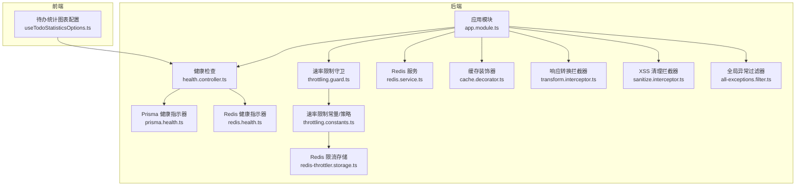
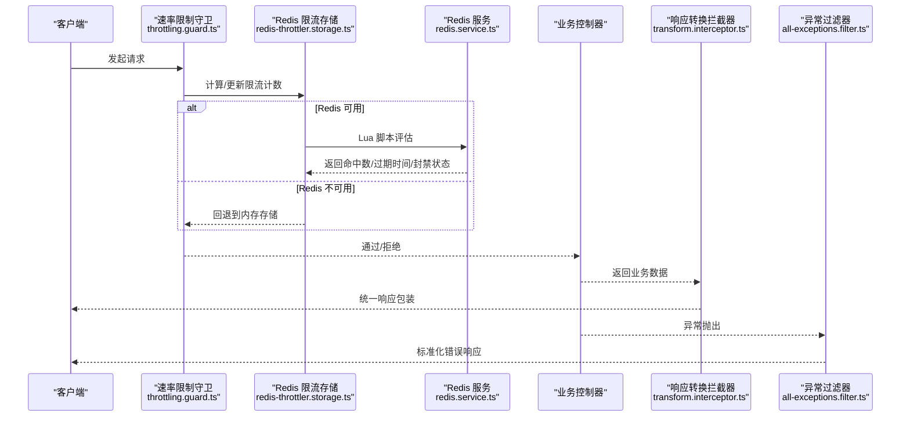
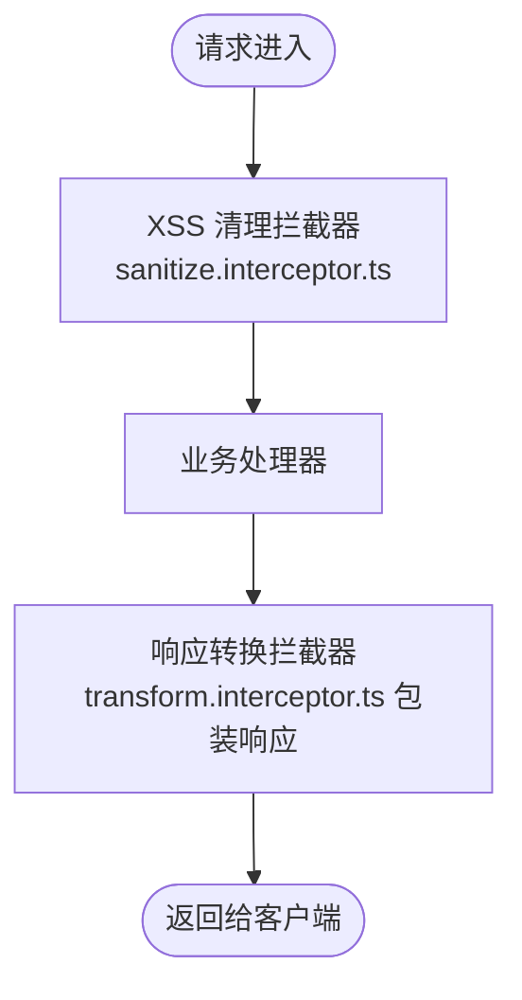
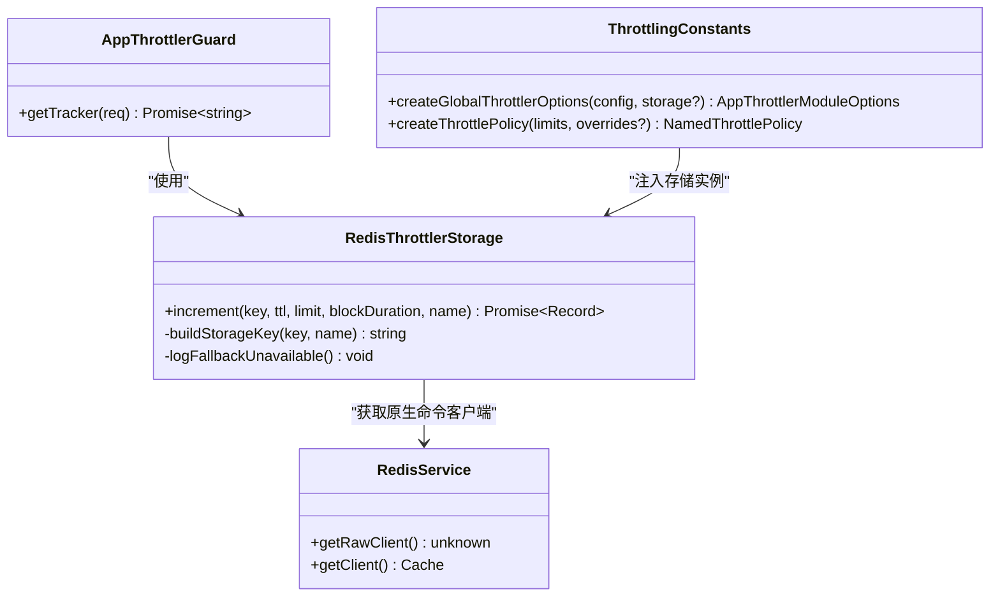
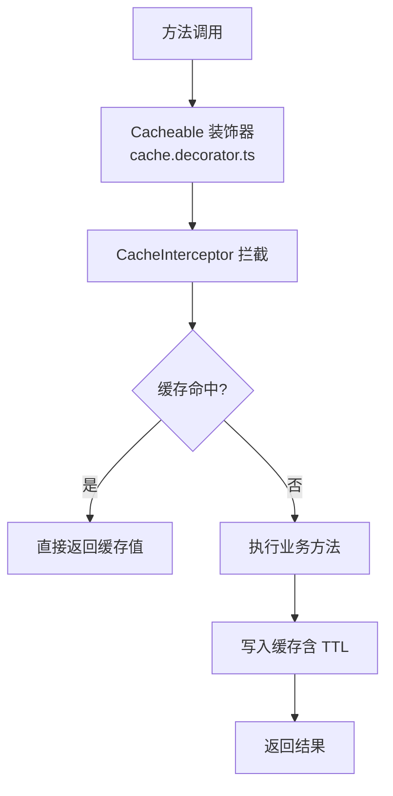
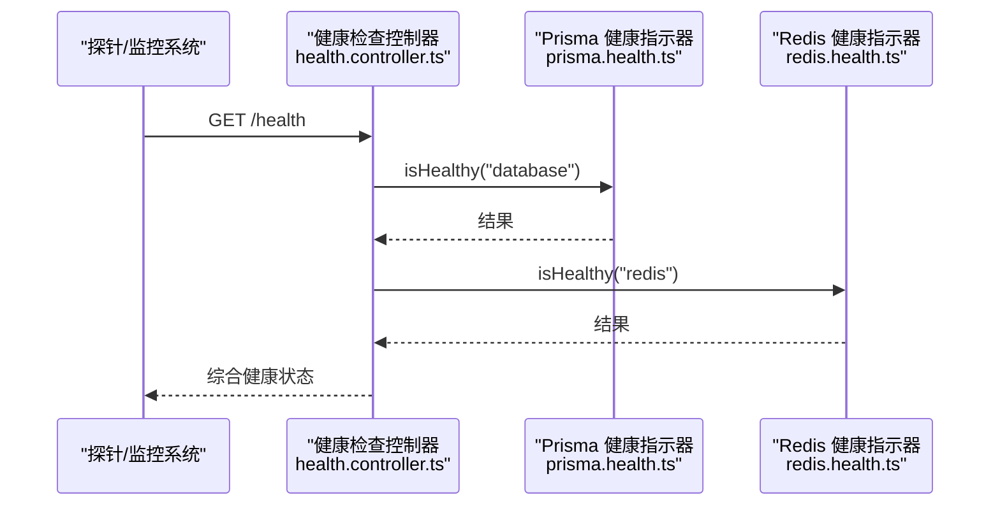
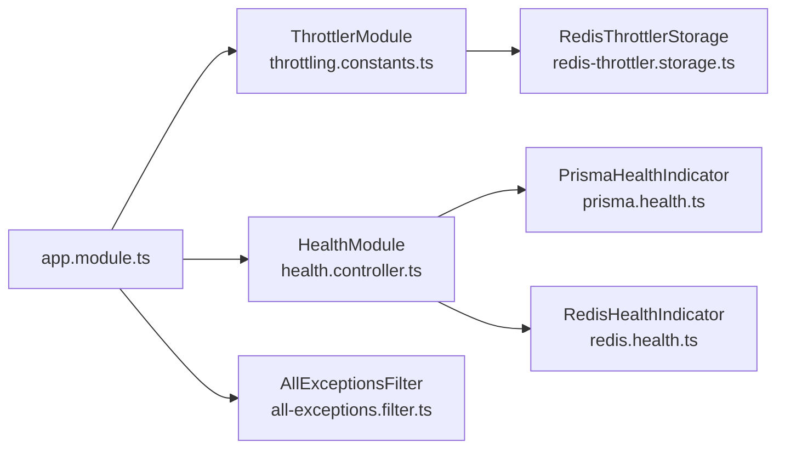

# 性能监控

<cite>
**本文引用的文件**
- [apps/backend/src/common/interceptors/transform.interceptor.ts](file://apps/backend/src/common/interceptors/transform.interceptor.ts)
- [apps/backend/src/common/interceptors/sanitize.interceptor.ts](file://apps/backend/src/common/interceptors/sanitize.interceptor.ts)
- [apps/backend/src/common/throttling/throttling.guard.ts](file://apps/backend/src/common/throttling/throttling.guard.ts)
- [apps/backend/src/common/throttling/throttling.constants.ts](file://apps/backend/src/common/throttling/throttling.constants.ts)
- [apps/backend/src/common/throttling/redis-throttler.storage.ts](file://apps/backend/src/common/throttling/redis-throttler.storage.ts)
- [apps/backend/src/redis/redis.service.ts](file://apps/backend/src/redis/redis.service.ts)
- [apps/backend/src/redis/cache.decorator.ts](file://apps/backend/src/redis/cache.decorator.ts)
- [apps/backend/src/redis/redis.health.ts](file://apps/backend/src/redis/redis.health.ts)
- [apps/backend/src/health/health.controller.ts](file://apps/backend/src/health/health.controller.ts)
- [apps/backend/src/health/prisma.health.ts](file://apps/backend/src/health/prisma.health.ts)
- [apps/backend/src/common/filters/all-exceptions.filter.ts](file://apps/backend/src/common/filters/all-exceptions.filter.ts)
- [apps/backend/src/app.module.ts](file://apps/backend/src/app.module.ts)
- [apps/frontend/src/features/todo/composables/useTodoStatisticsOptions.ts](file://apps/frontend/src/features/todo/composables/useTodoStatisticsOptions.ts)
</cite>

## 目录

1. [简介](#简介)
2. [项目结构](#项目结构)
3. [核心组件](#核心组件)
4. [架构总览](#架构总览)
5. [详细组件分析](#详细组件分析)
6. [依赖关系分析](#依赖关系分析)
7. [性能考量](#性能考量)
8. [故障排查指南](#故障排查指南)
9. [结论](#结论)
10. [附录](#附录)

## 简介

本文件面向 Lumina Todo 的性能监控体系，聚焦以下目标：

- 请求拦截器在性能监控中的作用：请求耗时统计、响应大小监控与数据转换性能分析
- 速率限制机制：内存存储与 Redis 存储的配置选择与降级策略
- 缓存监控、数据库查询性能与 API 响应时间的监控策略
- 性能指标采集、可视化展示与告警配置建议
- 性能优化建议、瓶颈识别方法与监控仪表板使用指南

## 项目结构

后端采用 NestJS 架构，前端基于 Vue3 + Vite。性能监控涉及的关键位置包括：

- 全局响应转换拦截器与 XSS 清理拦截器
- 速率限制守卫与 Redis 存储
- Redis 缓存服务与缓存装饰器
- 健康检查控制器与 Prisma/Redis 健康指示器
- 全局异常过滤器与日志模块
- 前端统计数据可视化

**图示来源**

- [apps/backend/src/app.module.ts:118-123](file://apps/backend/src/app.module.ts#L118-L123)
- [apps/backend/src/health/health.controller.ts:30-79](file://apps/backend/src/health/health.controller.ts#L30-L79)
- [apps/backend/src/health/prisma.health.ts:1-31](file://apps/backend/src/health/prisma.health.ts#L1-L31)
- [apps/backend/src/redis/redis.health.ts:1-42](file://apps/backend/src/redis/redis.health.ts#L1-L42)
- [apps/backend/src/common/throttling/throttling.guard.ts:28-33](file://apps/backend/src/common/throttling/throttling.guard.ts#L28-L33)
- [apps/backend/src/common/throttling/throttling.constants.ts:173-197](file://apps/backend/src/common/throttling/throttling.constants.ts#L173-L197)
- [apps/backend/src/common/throttling/redis-throttler.storage.ts:106-156](file://apps/backend/src/common/throttling/redis-throttler.storage.ts#L106-L156)
- [apps/backend/src/redis/redis.service.ts:61-224](file://apps/backend/src/redis/redis.service.ts#L61-L224)
- [apps/backend/src/redis/cache.decorator.ts:42-58](file://apps/backend/src/redis/cache.decorator.ts#L42-L58)
- [apps/backend/src/common/interceptors/transform.interceptor.ts:18-29](file://apps/backend/src/common/interceptors/transform.interceptor.ts#L18-L29)
- [apps/backend/src/common/interceptors/sanitize.interceptor.ts:9-63](file://apps/backend/src/common/interceptors/sanitize.interceptor.ts#L9-L63)
- [apps/backend/src/common/filters/all-exceptions.filter.ts:16-137](file://apps/backend/src/common/filters/all-exceptions.filter.ts#L16-L137)
- [apps/frontend/src/features/todo/composables/useTodoStatisticsOptions.ts:270-354](file://apps/frontend/src/features/todo/composables/useTodoStatisticsOptions.ts#L270-L354)

**章节来源**

- [apps/backend/src/app.module.ts:118-123](file://apps/backend/src/app.module.ts#L118-L123)
- [apps/backend/src/health/health.controller.ts:30-79](file://apps/backend/src/health/health.controller.ts#L30-L79)

## 核心组件

- 全局响应转换拦截器：统一包装响应体，便于后续指标采集与前端解析
- XSS 清理拦截器：在进入业务逻辑前清理潜在危险输入，降低后续处理开销与安全风险
- 速率限制守卫与限流策略：基于滑动窗口/固定窗口的多粒度限流，支持 Redis 分布式与内存降级
- Redis 缓存服务与装饰器：提供统一缓存接口、命名空间与 TTL 管理，支持缓存穿透保护
- 健康检查控制器与健康指示器：数据库、Redis、内存与磁盘的健康探测，作为可用性与性能基线
- 全局异常过滤器：标准化错误响应，记录错误日志，辅助定位性能问题
- 前端统计图表：以折线图展示焦点时长等指标，便于用户侧观察性能趋势

**章节来源**

- [apps/backend/src/common/interceptors/transform.interceptor.ts:18-29](file://apps/backend/src/common/interceptors/transform.interceptor.ts#L18-L29)
- [apps/backend/src/common/interceptors/sanitize.interceptor.ts:9-63](file://apps/backend/src/common/interceptors/sanitize.interceptor.ts#L9-L63)
- [apps/backend/src/common/throttling/throttling.guard.ts:28-33](file://apps/backend/src/common/throttling/throttling.guard.ts#L28-L33)
- [apps/backend/src/common/throttling/throttling.constants.ts:173-197](file://apps/backend/src/common/throttling/throttling.constants.ts#L173-L197)
- [apps/backend/src/common/throttling/redis-throttler.storage.ts:106-156](file://apps/backend/src/common/throttling/redis-throttler.storage.ts#L106-L156)
- [apps/backend/src/redis/redis.service.ts:61-224](file://apps/backend/src/redis/redis.service.ts#L61-L224)
- [apps/backend/src/redis/cache.decorator.ts:42-58](file://apps/backend/src/redis/cache.decorator.ts#L42-L58)
- [apps/backend/src/health/health.controller.ts:30-79](file://apps/backend/src/health/health.controller.ts#L30-L79)
- [apps/backend/src/health/prisma.health.ts:1-31](file://apps/backend/src/health/prisma.health.ts#L1-L31)
- [apps/backend/src/redis/redis.health.ts:1-42](file://apps/backend/src/redis/redis.health.ts#L1-L42)
- [apps/backend/src/common/filters/all-exceptions.filter.ts:16-137](file://apps/backend/src/common/filters/all-exceptions.filter.ts#L16-L137)
- [apps/frontend/src/features/todo/composables/useTodoStatisticsOptions.ts:270-354](file://apps/frontend/src/features/todo/composables/useTodoStatisticsOptions.ts#L270-L354)

## 架构总览

下图展示了性能监控相关组件的交互关系与数据流向。

**图示来源**

- [apps/backend/src/common/throttling/throttling.guard.ts:28-33](file://apps/backend/src/common/throttling/throttling.guard.ts#L28-L33)
- [apps/backend/src/common/throttling/redis-throttler.storage.ts:106-156](file://apps/backend/src/common/throttling/redis-throttler.storage.ts#L106-L156)
- [apps/backend/src/redis/redis.service.ts:205-211](file://apps/backend/src/redis/redis.service.ts#L205-L211)
- [apps/backend/src/common/interceptors/transform.interceptor.ts:18-29](file://apps/backend/src/common/interceptors/transform.interceptor.ts#L18-L29)
- [apps/backend/src/common/filters/all-exceptions.filter.ts:16-137](file://apps/backend/src/common/filters/all-exceptions.filter.ts#L16-L137)

## 详细组件分析

### 请求拦截器与性能监控

- 响应转换拦截器：对所有成功响应进行统一包装，包含 success、data、timestamp 字段，便于前端与监控系统统一解析与统计。
- XSS 清理拦截器：在进入业务层之前清理请求体/查询参数/路径参数中的 HTML 危险内容，减少后续渲染与序列化成本，同时提升安全性。

**图示来源**

- [apps/backend/src/common/interceptors/sanitize.interceptor.ts:9-63](file://apps/backend/src/common/interceptors/sanitize.interceptor.ts#L9-L63)
- [apps/backend/src/common/interceptors/transform.interceptor.ts:18-29](file://apps/backend/src/common/interceptors/transform.interceptor.ts#L18-L29)

**章节来源**

- [apps/backend/src/common/interceptors/transform.interceptor.ts:18-29](file://apps/backend/src/common/interceptors/transform.interceptor.ts#L18-L29)
- [apps/backend/src/common/interceptors/sanitize.interceptor.ts:9-63](file://apps/backend/src/common/interceptors/sanitize.interceptor.ts#L9-L63)

### 速率限制机制与存储选择

- 速率限制守卫：从请求中提取真实 IP（优先直连 IP，其次 X-Forwarded-For 最后一个有效地址），作为限流键。
- 限流策略：支持 short/medium/long 三档窗口，每档可配置 TTL 与 limit；可通过环境变量覆盖默认值；支持跳过特定端点（如健康检查）。
- Redis 限流存储：使用 Lua 脚本原子性维护 hits 集合与 block 标记，实现滑动窗口语义；当 Redis 不可用时回退到内存存储，保证系统可用性。
- 内存存储降级：当无法获取 Redis 原生客户端时，记录警告并切换至 ThrottlerStorageService 的内存实现，避免服务中断。

**图示来源**

- [apps/backend/src/common/throttling/throttling.guard.ts:28-33](file://apps/backend/src/common/throttling/throttling.guard.ts#L28-L33)
- [apps/backend/src/common/throttling/redis-throttler.storage.ts:106-156](file://apps/backend/src/common/throttling/redis-throttler.storage.ts#L106-L156)
- [apps/backend/src/redis/redis.service.ts:205-211](file://apps/backend/src/redis/redis.service.ts#L205-L211)
- [apps/backend/src/common/throttling/throttling.constants.ts:173-197](file://apps/backend/src/common/throttling/throttling.constants.ts#L173-L197)

**章节来源**

- [apps/backend/src/common/throttling/throttling.guard.ts:28-33](file://apps/backend/src/common/throttling/throttling.guard.ts#L28-L33)
- [apps/backend/src/common/throttling/throttling.constants.ts:173-197](file://apps/backend/src/common/throttling/throttling.constants.ts#L173-L197)
- [apps/backend/src/common/throttling/redis-throttler.storage.ts:106-156](file://apps/backend/src/common/throttling/redis-throttler.storage.ts#L106-L156)
- [apps/backend/src/redis/redis.service.ts:205-211](file://apps/backend/src/redis/redis.service.ts#L205-L211)

### 缓存监控与缓存装饰器

- 缓存装饰器：通过 CacheInterceptor、CacheKey、CacheTTL 等元数据组合，为方法调用结果提供自动缓存能力，并支持自定义键与 TTL。
- Redis 服务：提供 get/set/del/delMany/reset/getOrSet/refresh 等常用操作，内置错误日志与命名空间缓存封装，便于按前缀隔离与管理。
- 缓存穿透保护：getOrSet 在缓存缺失时先执行工厂函数获取数据，再写入缓存，避免并发击穿。

**图示来源**

- [apps/backend/src/redis/cache.decorator.ts:42-58](file://apps/backend/src/redis/cache.decorator.ts#L42-L58)
- [apps/backend/src/redis/redis.service.ts:159-174](file://apps/backend/src/redis/redis.service.ts#L159-L174)

**章节来源**

- [apps/backend/src/redis/cache.decorator.ts:42-58](file://apps/backend/src/redis/cache.decorator.ts#L42-L58)
- [apps/backend/src/redis/redis.service.ts:61-224](file://apps/backend/src/redis/redis.service.ts#L61-L224)

### 健康检查与数据库/Redis 性能监控

- 健康检查控制器：提供综合健康检查、存活探针与就绪探针，分别检查数据库、Redis、内存堆与 RSS、磁盘使用率。
- Prisma 健康指示器：通过简单查询验证数据库连接可用性。
- Redis 健康指示器：通过 set/get 测试键值读写，确保缓存链路可用。

**图示来源**

- [apps/backend/src/health/health.controller.ts:30-79](file://apps/backend/src/health/health.controller.ts#L30-L79)
- [apps/backend/src/health/prisma.health.ts:1-31](file://apps/backend/src/health/prisma.health.ts#L1-L31)
- [apps/backend/src/redis/redis.health.ts:1-42](file://apps/backend/src/redis/redis.health.ts#L1-L42)

**章节来源**

- [apps/backend/src/health/health.controller.ts:30-79](file://apps/backend/src/health/health.controller.ts#L30-L79)
- [apps/backend/src/health/prisma.health.ts:1-31](file://apps/backend/src/health/prisma.health.ts#L1-L31)
- [apps/backend/src/redis/redis.health.ts:1-42](file://apps/backend/src/redis/redis.health.ts#L1-L42)

### API 响应时间监控策略

- 日志模块：通过 Pino 的自定义日志级别与消息格式，将请求方法、URL、状态码与耗时纳入日志输出，便于后续聚合与分析。
- 响应转换拦截器：统一响应结构，便于前端与监控系统对响应时间进行统计与可视化。
- 健康检查端点：排除在自动日志记录之外，避免噪声；但可通过独立探针持续观测。

**章节来源**

- [apps/backend/src/app.module.ts:58-87](file://apps/backend/src/app.module.ts#L58-L87)
- [apps/backend/src/common/interceptors/transform.interceptor.ts:18-29](file://apps/backend/src/common/interceptors/transform.interceptor.ts#L18-L29)

### 性能指标采集、可视化与告警配置

- 指标采集：结合日志中的请求耗时、健康检查状态、Redis/数据库可用性与缓存命中率等，形成基础性能指标。
- 可视化展示：前端使用折线图展示焦点时长等指标，帮助用户直观感知性能变化。
- 告警配置：建议基于健康检查失败、Redis/数据库不可用、响应时间超阈值、错误率上升等触发告警。

**章节来源**

- [apps/frontend/src/features/todo/composables/useTodoStatisticsOptions.ts:270-354](file://apps/frontend/src/features/todo/composables/useTodoStatisticsOptions.ts#L270-L354)

## 依赖关系分析

- 速率限制模块依赖 Redis 模块与配置服务，运行时通过 Redis 原生命令客户端执行 Lua 脚本，实现高性能限流。
- 健康检查模块依赖 Prisma 与 Redis 健康指示器，统一对外暴露健康状态。
- 全局异常过滤器统一处理错误响应，记录错误日志，辅助定位性能问题。

**图示来源**

- [apps/backend/src/app.module.ts:118-123](file://apps/backend/src/app.module.ts#L118-L123)
- [apps/backend/src/common/throttling/throttling.constants.ts:173-197](file://apps/backend/src/common/throttling/throttling.constants.ts#L173-L197)
- [apps/backend/src/common/throttling/redis-throttler.storage.ts:106-156](file://apps/backend/src/common/throttling/redis-throttler.storage.ts#L106-L156)
- [apps/backend/src/health/health.controller.ts:30-79](file://apps/backend/src/health/health.controller.ts#L30-L79)
- [apps/backend/src/health/prisma.health.ts:1-31](file://apps/backend/src/health/prisma.health.ts#L1-L31)
- [apps/backend/src/redis/redis.health.ts:1-42](file://apps/backend/src/redis/redis.health.ts#L1-L42)
- [apps/backend/src/common/filters/all-exceptions.filter.ts:16-137](file://apps/backend/src/common/filters/all-exceptions.filter.ts#L16-L137)

**章节来源**

- [apps/backend/src/app.module.ts:118-123](file://apps/backend/src/app.module.ts#L118-L123)
- [apps/backend/src/health/health.controller.ts:30-79](file://apps/backend/src/health/health.controller.ts#L30-L79)

## 性能考量

- 请求耗时统计
  - 利用日志模块的自定义消息格式与日志级别，记录请求方法、URL、状态码与耗时，便于后续聚合分析。
  - 响应转换拦截器统一响应结构，便于前端与监控系统对响应时间进行统计与可视化。
- 响应大小监控
  - 建议在网关或反向代理层记录响应字节数，或在业务层计算序列化后大小，结合日志输出进行统计。
- 数据转换性能分析
  - 响应转换拦截器与 XSS 清理拦截器均为轻量处理，建议通过基准测试对比启用前后 CPU 与内存占用。
- 速率限制
  - Redis Lua 脚本原子性评估命中数与封禁状态，具备较低延迟；当 Redis 不可用时自动降级至内存存储，保障系统可用性。
- 缓存监控
  - 使用缓存装饰器与 Redis 服务的 getOrSet/refresh 等方法，结合命中率与 TTL 分布进行优化。
- 数据库查询性能
  - 通过健康检查与 Prisma 健康指示器验证连接可用性；建议配合慢查询日志与索引优化。
- API 响应时间
  - 健康检查端点与业务端点分离，避免健康检查对业务性能造成干扰。

[本节为通用指导，不直接分析具体文件]

## 故障排查指南

- 速率限制异常
  - 若 Redis 不可用，系统会回退到内存存储并记录警告日志；检查 Redis 连接配置与网络连通性。
- 缓存异常
  - Redis 服务在读写失败时记录错误日志；检查 Redis 健康状态与键空间使用情况。
- 健康检查失败
  - 数据库或 Redis 健康检查失败时，健康检查控制器会抛出健康检查错误；优先排查数据库连接与 Redis 读写。
- 异常响应
  - 全局异常过滤器统一返回标准化错误响应并记录错误日志；根据日志中的方法、URL、状态码与堆栈定位问题。

**章节来源**

- [apps/backend/src/common/throttling/redis-throttler.storage.ts:122-155](file://apps/backend/src/common/throttling/redis-throttler.storage.ts#L122-L155)
- [apps/backend/src/redis/redis.service.ts:100-121](file://apps/backend/src/redis/redis.service.ts#L100-L121)
- [apps/backend/src/health/health.controller.ts:30-79](file://apps/backend/src/health/health.controller.ts#L30-L79)
- [apps/backend/src/common/filters/all-exceptions.filter.ts:37-45](file://apps/backend/src/common/filters/all-exceptions.filter.ts#L37-L45)

## 结论

Lumina Todo 的性能监控体系围绕“可观测性 + 限流 + 缓存 + 健康检查”构建。通过全局拦截器与过滤器统一输出结构化响应与日志，结合 Redis 限流与缓存装饰器，以及数据库与 Redis 健康检查，形成完整的性能监控闭环。建议在生产环境中启用健康检查告警、缓存命中率监控与响应时间阈值告警，并定期进行基准测试与容量规划。

[本节为总结性内容，不直接分析具体文件]

## 附录

- 监控仪表板使用建议
  - 展示健康检查状态、Redis/数据库可用性、缓存命中率、响应时间分布与错误率趋势。
  - 对关键端点设置 SLA 目标与告警阈值，结合日志与追踪系统定位问题根因。
- 性能优化建议
  - 优化热点数据的缓存策略与 TTL，减少数据库压力。
  - 对高频接口启用速率限制并合理配置窗口与阈值，避免突发流量冲击。
  - 定期审查慢查询与高延迟接口，结合缓存与索引优化提升响应速度。

[本节为通用指导，不直接分析具体文件]
