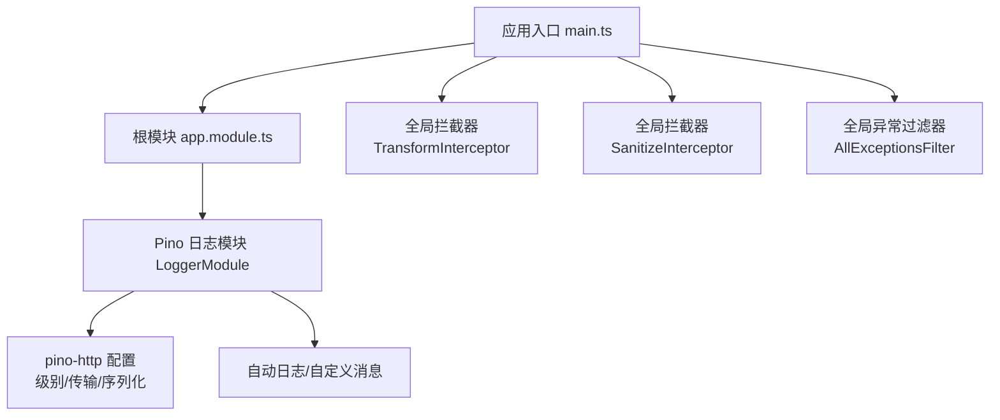
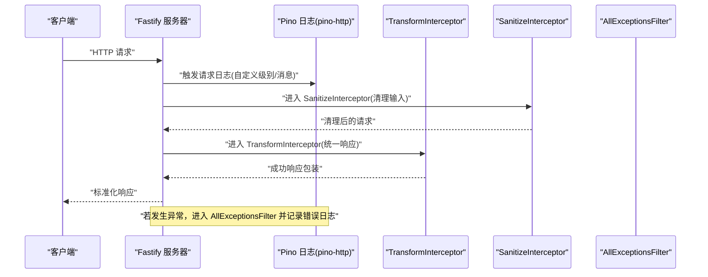
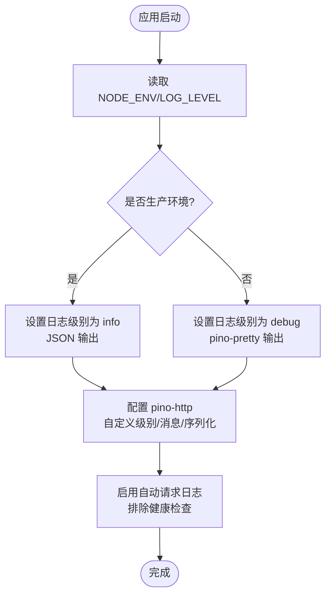
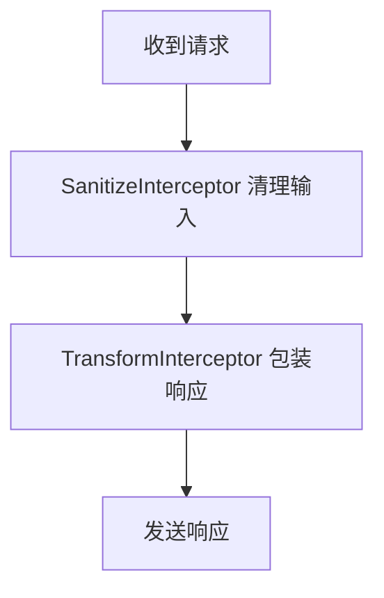
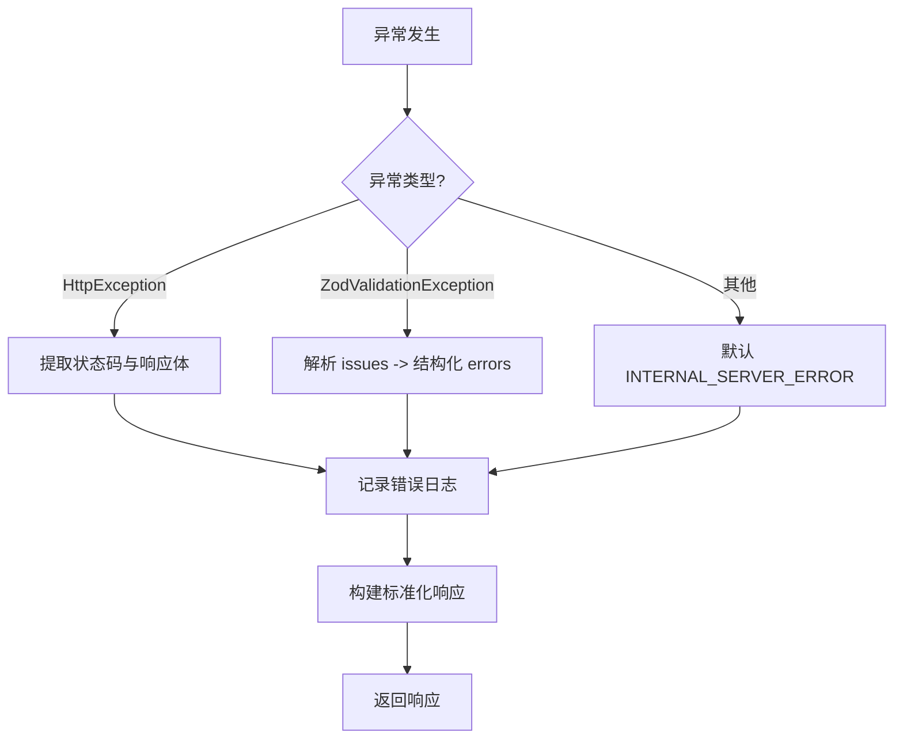
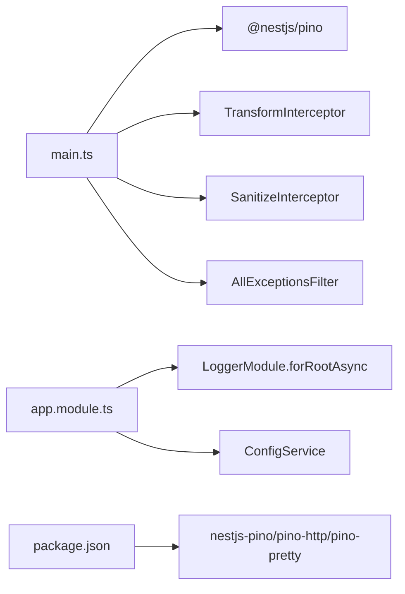

# 日志系统

<cite>
**本文引用的文件**
- [apps/backend/src/app.module.ts](file://apps/backend/src/app.module.ts)
- [apps/backend/src/main.ts](file://apps/backend/src/main.ts)
- [apps/backend/src/common/interceptors/transform.interceptor.ts](file://apps/backend/src/common/interceptors/transform.interceptor.ts)
- [apps/backend/src/common/interceptors/sanitize.interceptor.ts](file://apps/backend/src/common/interceptors/sanitize.interceptor.ts)
- [apps/backend/src/common/filters/all-exceptions.filter.ts](file://apps/backend/src/common/filters/all-exceptions.filter.ts)
- [apps/backend/package.json](file://apps/backend/package.json)
- [ecosystem.config.js](file://ecosystem.config.js)
- [apps/backend/tests/common/filters/all-exceptions.filter.spec.ts](file://apps/backend/tests/common/filters/all-exceptions.filter.spec.ts)
- [apps/backend/tests/setup.ts](file://apps/backend/tests/setup.ts)
</cite>

## 目录
1. [简介](#简介)
2. [项目结构](#项目结构)
3. [核心组件](#核心组件)
4. [架构总览](#架构总览)
5. [详细组件分析](#详细组件分析)
6. [依赖关系分析](#依赖关系分析)
7. [性能考虑](#性能考虑)
8. [故障排查指南](#故障排查指南)
9. [结论](#结论)
10. [附录](#附录)

## 简介
本文件面向 Lumina Todo 后端的日志系统，聚焦于 Pino 日志库的配置与使用、全局拦截器在日志记录中的作用、异常过滤器的实现机制、以及日志聚合与性能优化策略。文档同时提供日志分析工具使用指南、常见日志模式识别与调试技巧，帮助开发者快速定位问题并提升可观测性。

## 项目结构
后端采用 NestJS + Fastify 架构，日志系统由以下关键部分组成：
- 应用入口负责注册全局日志器、全局拦截器与异常过滤器，并通过 Pino 输出结构化日志。
- 根模块通过 LoggerModule.forRootAsync 注入 Pino 配置，支持按环境切换输出格式与日志级别。
- 全局拦截器对请求/响应、输入清理进行统一处理，增强日志可读性与安全性。
- 全局异常过滤器统一捕获异常，记录结构化错误日志并返回标准化错误响应。

图表来源
- [apps/backend/src/main.ts:34-211](file://apps/backend/src/main.ts#L34-L211)
- [apps/backend/src/app.module.ts:28-160](file://apps/backend/src/app.module.ts#L28-L160)

章节来源
- [apps/backend/src/main.ts:34-211](file://apps/backend/src/main.ts#L34-L211)
- [apps/backend/src/app.module.ts:28-160](file://apps/backend/src/app.module.ts#L28-L160)

## 核心组件
- Pino 日志模块与配置：通过 LoggerModule.forRootAsync 注入，支持按 NODE_ENV 切换日志级别与输出格式；自定义请求日志级别、消息格式与序列化；排除健康检查端点自动日志。
- 全局响应转换拦截器：统一将成功响应包装为 { success, data, timestamp } 结构，便于日志与监控。
- 全局 XSS 清理拦截器：递归清理请求体、查询参数与路径参数中的 HTML/XSS 内容，降低注入风险并改善日志质量。
- 全局异常过滤器：捕获所有未处理异常，记录结构化错误日志，处理 Zod 验证错误与业务异常映射，返回统一错误响应。

章节来源
- [apps/backend/src/app.module.ts:36-89](file://apps/backend/src/app.module.ts#L36-L89)
- [apps/backend/src/common/interceptors/transform.interceptor.ts:18-29](file://apps/backend/src/common/interceptors/transform.interceptor.ts#L18-L29)
- [apps/backend/src/common/interceptors/sanitize.interceptor.ts:10-63](file://apps/backend/src/common/interceptors/sanitize.interceptor.ts#L10-L63)
- [apps/backend/src/common/filters/all-exceptions.filter.ts:16-137](file://apps/backend/src/common/filters/all-exceptions.filter.ts#L16-L137)

## 架构总览
下图展示日志系统在请求生命周期中的交互流程，包括 Pino 请求日志、拦截器处理与异常过滤器的协同工作。

图表来源
- [apps/backend/src/main.ts:172-179](file://apps/backend/src/main.ts#L172-L179)
- [apps/backend/src/app.module.ts:56-86](file://apps/backend/src/app.module.ts#L56-L86)
- [apps/backend/src/common/interceptors/transform.interceptor.ts:18-29](file://apps/backend/src/common/interceptors/transform.interceptor.ts#L18-L29)
- [apps/backend/src/common/interceptors/sanitize.interceptor.ts:10-63](file://apps/backend/src/common/interceptors/sanitize.interceptor.ts#L10-L63)
- [apps/backend/src/common/filters/all-exceptions.filter.ts:27-45](file://apps/backend/src/common/filters/all-exceptions.filter.ts#L27-L45)

## 详细组件分析

### Pino 日志配置与使用
- 环境与级别：通过 ConfigService 读取 LOG_LEVEL，默认生产环境为 info，开发环境为 debug；NODE_ENV 控制输出格式（生产使用 JSON，开发使用 pino-pretty）。
- 自定义属性与消息：通过 customProps 注入上下文；customLogLevel 根据状态码与错误动态选择日志级别；customSuccessMessage/customErrorMessage 定义成功/错误日志消息模板。
- 序列化与自动日志：仅序列化必要字段（如 method、url、params、statusCode），减少日志体积；autoLogging 的 ignore 可按需排除特定端点。
- 传输层：开发环境启用 pino-pretty 以提升可读性；生产环境保持 JSON 输出以便机器解析。

图表来源
- [apps/backend/src/app.module.ts:36-89](file://apps/backend/src/app.module.ts#L36-L89)

章节来源
- [apps/backend/src/app.module.ts:36-89](file://apps/backend/src/app.module.ts#L36-L89)

### 全局拦截器在日志记录中的作用
- 响应转换拦截器：将成功响应统一包装为 { success: true, data, timestamp }，使日志与监控更一致，便于区分业务成功与失败。
- XSS 清理拦截器：递归清理请求体、查询参数与路径参数中的 HTML/XSS 内容，降低注入风险，同时减少日志中敏感或恶意内容的出现。

图表来源
- [apps/backend/src/common/interceptors/transform.interceptor.ts:18-29](file://apps/backend/src/common/interceptors/transform.interceptor.ts#L18-L29)
- [apps/backend/src/common/interceptors/sanitize.interceptor.ts:10-63](file://apps/backend/src/common/interceptors/sanitize.interceptor.ts#L10-L63)

章节来源
- [apps/backend/src/common/interceptors/transform.interceptor.ts:18-29](file://apps/backend/src/common/interceptors/transform.interceptor.ts#L18-L29)
- [apps/backend/src/common/interceptors/sanitize.interceptor.ts:10-63](file://apps/backend/src/common/interceptors/sanitize.interceptor.ts#L10-L63)

### 异常过滤器实现机制
- 错误捕获：@Catch() 捕获所有未处理异常，区分 HttpException、Zod 验证异常与未知错误。
- 日志记录：记录请求方法、URL、状态码与错误消息，必要时包含堆栈信息。
- 标准化响应：返回 { success: false, data: null, message, errors?, statusCode, timestamp }，其中 errors 为结构化字段级错误映射。
- 国际化与字段映射：对业务异常（如 auth.EMAIL_EXISTS）进行字段映射；对 Zod 验证错误提取路径与参数，结合 i18n 进行翻译。

图表来源
- [apps/backend/src/common/filters/all-exceptions.filter.ts:27-137](file://apps/backend/src/common/filters/all-exceptions.filter.ts#L27-L137)

章节来源
- [apps/backend/src/common/filters/all-exceptions.filter.ts:16-137](file://apps/backend/src/common/filters/all-exceptions.filter.ts#L16-L137)

### 日志聚合与输出配置
- PM2 配置：通过 ecosystem.config.js 控制进程实例、日志合并与输出文件；Docker 环境下将错误与标准输出重定向至 /dev/stderr 与 /dev/stdout，便于容器编排平台收集。
- 日志位置：非 Docker 环境下输出到 logs/backend-out.log 与 logs/backend-error.log；Docker 环境下直接输出到标准流。

章节来源
- [ecosystem.config.js:1-32](file://ecosystem.config.js#L1-L32)

## 依赖关系分析
- 应用入口 main.ts 依赖 Logger（nestjs-pino）、全局拦截器与异常过滤器。
- 根模块 app.module.ts 依赖 LoggerModule 与 ConfigService，提供 Pino 配置工厂。
- 依赖包 package.json 中包含 nestjs-pino、pino-http、pino-pretty 等日志相关依赖。

图表来源
- [apps/backend/src/main.ts:29-42](file://apps/backend/src/main.ts#L29-L42)
- [apps/backend/src/app.module.ts:7-38](file://apps/backend/src/app.module.ts#L7-L38)
- [apps/backend/package.json:72-80](file://apps/backend/package.json#L72-L80)

章节来源
- [apps/backend/src/main.ts:29-42](file://apps/backend/src/main.ts#L29-L42)
- [apps/backend/src/app.module.ts:7-38](file://apps/backend/src/app.module.ts#L7-L38)
- [apps/backend/package.json:72-80](file://apps/backend/package.json#L72-L80)

## 性能考虑
- 日志级别与传输：生产环境使用 JSON 输出与 info 级别，减少开销；开发环境使用 pino-pretty 提升可读性但增加 CPU 开销。
- 序列化裁剪：仅序列化必要字段，避免携带冗余上下文导致日志体积膨胀。
- 自动日志策略：排除健康检查端点，降低高频请求带来的日志噪声。
- 响应包装与清理：统一响应结构与输入清理，有助于减少后续处理分支与潜在安全成本。
- 运行时优化：PM2 在 Docker 环境下单实例部署，避免 Socket.IO 会话抖动带来的额外日志与连接成本。

章节来源
- [apps/backend/src/app.module.ts:42-86](file://apps/backend/src/app.module.ts#L42-L86)
- [ecosystem.config.js:14-31](file://ecosystem.config.js#L14-L31)

## 故障排查指南
- 启动阶段日志
  - 应用入口会使用 Pino 作为全局日志器，并在启动完成后打印版本、服务地址、Swagger 文档与健康检查地址等关键信息。
  - 若启动失败，控制台会输出错误堆栈，建议优先查看该输出定位问题。

- 异常日志与响应
  - AllExceptionsFilter 会在捕获异常时记录结构化错误日志（包含方法、URL、状态码与消息），并返回统一错误响应。
  - 测试用例覆盖了多种异常场景（业务异常映射、Zod 验证错误、未知错误），可参考其断言逻辑理解期望行为。

- 测试日志抑制
  - 测试环境通过 tests/setup.ts 抑制部分日志输出，避免干扰测试结果；若排查测试中的日志问题，可临时调整抑制规则。

- 常见问题定位步骤
  - 确认 NODE_ENV 与 LOG_LEVEL 是否正确；生产环境建议 info，开发环境 debug。
  - 检查 pino-pretty 是否被意外启用（开发环境正常，生产环境应为 JSON）。
  - 关注异常过滤器对 Zod 错误的结构化映射，确认 i18n 键是否存在且可翻译。
  - 在 Docker 环境下，关注 PM2 标准流输出而非本地日志文件。

章节来源
- [apps/backend/src/main.ts:200-205](file://apps/backend/src/main.ts#L200-L205)
- [apps/backend/src/common/filters/all-exceptions.filter.ts:27-137](file://apps/backend/src/common/filters/all-exceptions.filter.ts#L27-L137)
- [apps/backend/tests/common/filters/all-exceptions.filter.spec.ts:1-126](file://apps/backend/tests/common/filters/all-exceptions.filter.spec.ts#L1-L126)
- [apps/backend/tests/setup.ts:1-39](file://apps/backend/tests/setup.ts#L1-L39)

## 结论
Lumina Todo 的日志系统以 Pino 为核心，结合全局拦截器与异常过滤器，在保证日志结构化与可读性的前提下，实现了统一的错误处理与响应包装。通过按环境切换输出格式与日志级别、裁剪序列化字段与排除高频端点，系统在开发体验与生产可观测性之间取得平衡。配合 PM2 的容器化日志输出策略，能够满足多环境下的日志聚合与运维需求。

## 附录
- 日志分析工具使用建议
  - 开发环境：使用 pino-pretty 输出，便于实时观察；结合浏览器或终端高亮功能筛选关键字。
  - 生产环境：使用 JSON 输出，接入日志收集平台（如 ELK/Fluent Bit/Loki）进行聚合与检索。
  - 关键字段：method、url、statusCode、context、level、msg、stack 等，可用于构建仪表盘与告警规则。
- 常见日志模式识别
  - 请求日志：以 context=HTTP 为特征，包含 method/url/params/statusCode 等字段。
  - 错误日志：包含 status 与异常消息，可按状态码分布统计错误趋势。
  - 响应日志：统一 success=true 的响应包装，便于区分业务成功与失败。
- 调试技巧
  - 临时提高 LOG_LEVEL 观察更详细日志；在开发环境启用 pino-pretty。
  - 对可疑输入使用 XSS 清理拦截器验证清理效果，避免日志中出现敏感内容。
  - 使用测试用例断言异常过滤器行为，确保错误映射与国际化键正确。