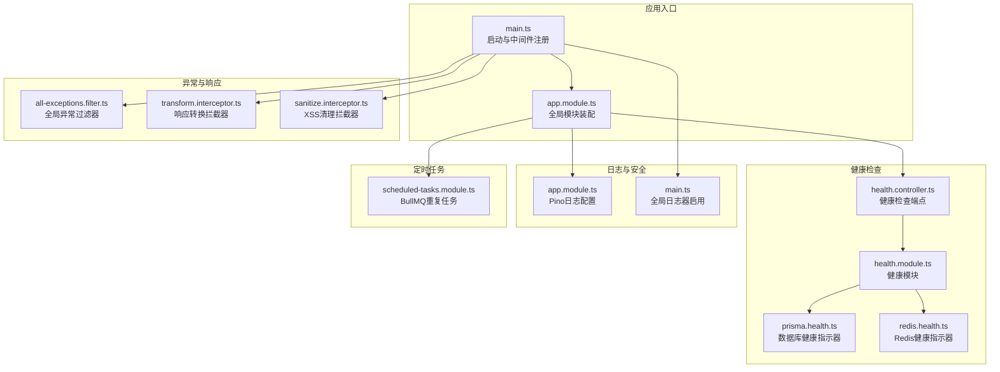
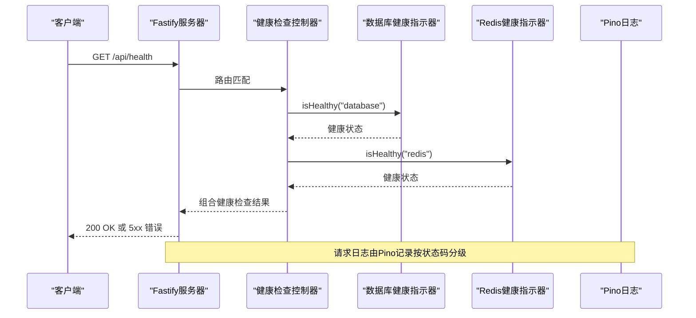
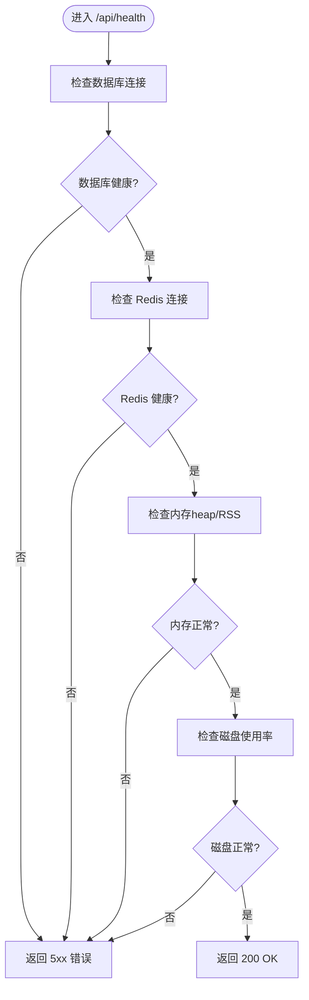
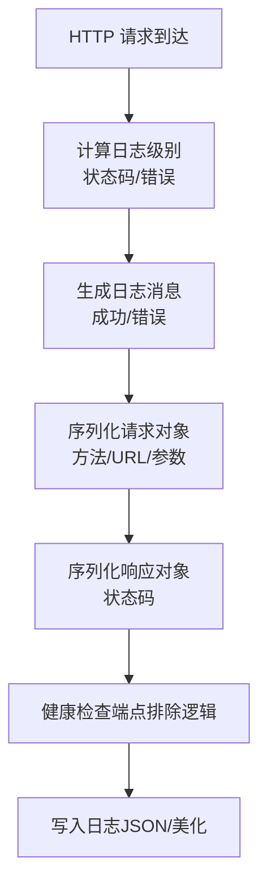
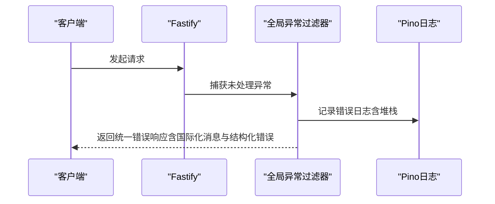
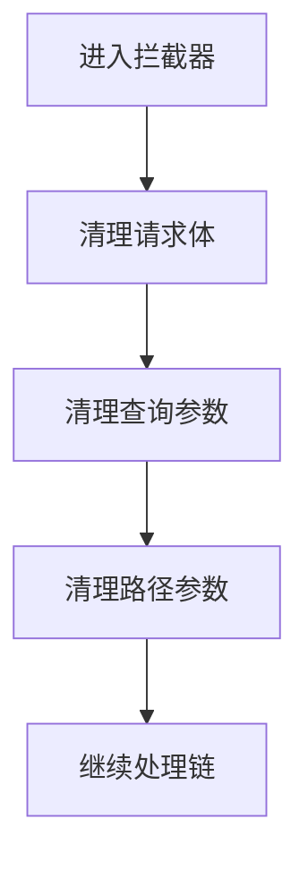
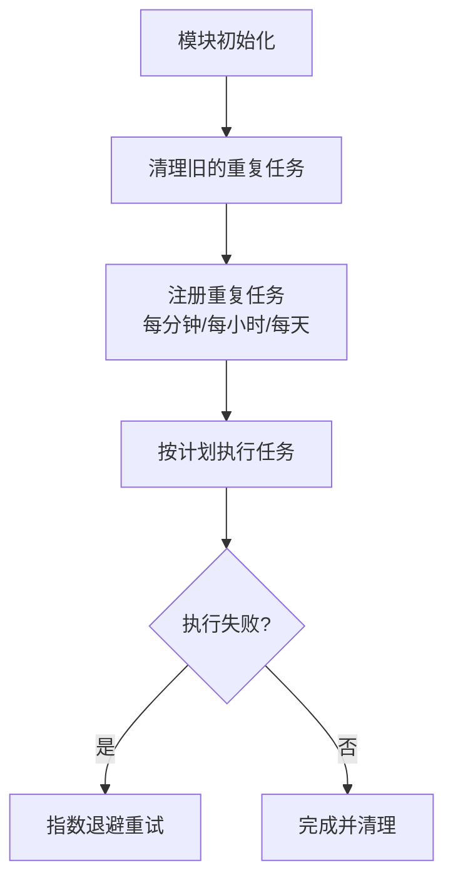
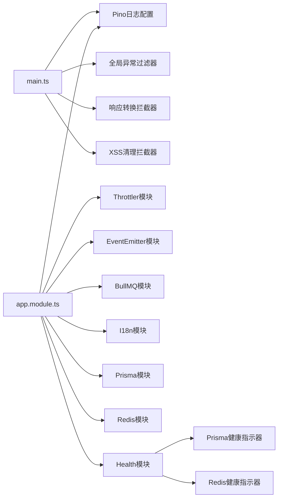

# 监控系统

<cite>
**本文引用的文件**
- [apps/backend/src/main.ts](file://apps/backend/src/main.ts)
- [apps/backend/src/app.module.ts](file://apps/backend/src/app.module.ts)
- [apps/backend/src/health/health.controller.ts](file://apps/backend/src/health/health.controller.ts)
- [apps/backend/src/health/health.module.ts](file://apps/backend/src/health/health.module.ts)
- [apps/backend/src/health/prisma.health.ts](file://apps/backend/src/health/prisma.health.ts)
- [apps/backend/src/redis/redis.health.ts](file://apps/backend/src/redis/redis.health.ts)
- [apps/backend/src/redis/redis.module.ts](file://apps/backend/src/redis/redis.module.ts)
- [apps/backend/src/common/filters/all-exceptions.filter.ts](file://apps/backend/src/common/filters/all-exceptions.filter.ts)
- [apps/backend/src/common/interceptors/transform.interceptor.ts](file://apps/backend/src/common/interceptors/transform.interceptor.ts)
- [apps/backend/src/common/interceptors/sanitize.interceptor.ts](file://apps/backend/src/common/interceptors/sanitize.interceptor.ts)
- [apps/backend/src/scheduled-tasks/scheduled-tasks.module.ts](file://apps/backend/src/scheduled-tasks/scheduled-tasks.module.ts)
- [apps/backend/package.json](file://apps/backend/package.json)
</cite>

## 目录

1. [简介](#简介)
2. [项目结构](#项目结构)
3. [核心组件](#核心组件)
4. [架构总览](#架构总览)
5. [详细组件分析](#详细组件分析)
6. [依赖关系分析](#依赖关系分析)
7. [性能考虑](#性能考虑)
8. [故障排查指南](#故障排查指南)
9. [结论](#结论)
10. [附录](#附录)

## 简介

本文件面向Lumina Todo监控系统，聚焦以下方面：

- 健康检查机制：数据库连接、Redis服务可用性、系统资源（内存、磁盘）监控
- 日志记录系统：Pino日志库配置、日志级别、结构化日志格式
- 异常处理机制：全局过滤器、错误追踪与响应标准化
- 性能监控与告警：定时任务队列、重复任务与失败重试策略
- 监控仪表板与日志分析：结合现有日志与队列能力给出实践建议
- 故障诊断流程：基于现有组件的定位与处置步骤

## 项目结构

后端采用NestJS + Fastify架构，核心监控相关模块分布如下：

- 健康检查：health.controller、health.module、prisma.health、redis.health
- 日志系统：app.module中通过nestjs-pino配置pino-http，main.ts中启用全局日志器
- 异常与响应：all-exceptions.filter、transform.interceptor、sanitize.interceptor
- 定时任务与告警：scheduled-tasks.module（BullMQ重复任务）

**图表来源**

- [apps/backend/src/main.ts:34-211](file://apps/backend/src/main.ts#L34-L211)
- [apps/backend/src/app.module.ts:28-160](file://apps/backend/src/app.module.ts#L28-L160)
- [apps/backend/src/health/health.controller.ts:19-80](file://apps/backend/src/health/health.controller.ts#L19-L80)
- [apps/backend/src/health/health.module.ts:8-14](file://apps/backend/src/health/health.module.ts#L8-L14)
- [apps/backend/src/health/prisma.health.ts:10-32](file://apps/backend/src/health/prisma.health.ts#L10-L32)
- [apps/backend/src/redis/redis.health.ts:11-43](file://apps/backend/src/redis/redis.health.ts#L11-L43)
- [apps/backend/src/common/filters/all-exceptions.filter.ts:17-137](file://apps/backend/src/common/filters/all-exceptions.filter.ts#L17-L137)
- [apps/backend/src/common/interceptors/transform.interceptor.ts:19-30](file://apps/backend/src/common/interceptors/transform.interceptor.ts#L19-L30)
- [apps/backend/src/common/interceptors/sanitize.interceptor.ts:10-64](file://apps/backend/src/common/interceptors/sanitize.interceptor.ts#L10-L64)
- [apps/backend/src/scheduled-tasks/scheduled-tasks.module.ts:25-92](file://apps/backend/src/scheduled-tasks/scheduled-tasks.module.ts#L25-L92)

**章节来源**

- [apps/backend/src/main.ts:34-211](file://apps/backend/src/main.ts#L34-L211)
- [apps/backend/src/app.module.ts:28-160](file://apps/backend/src/app.module.ts#L28-L160)

## 核心组件

- 健康检查控制器：提供综合健康检查、存活探针与就绪探针，组合数据库、Redis、内存与磁盘检查
- 数据库健康指示器：通过简单查询验证连接可用性，并在失败时抛出健康检查错误
- Redis健康指示器：通过写入/读取测试键验证连接与读写一致性
- 日志系统：Pino作为全局日志器，按环境输出JSON或美化格式；自定义请求日志级别与消息格式
- 全局异常过滤器：统一错误响应、结构化错误对象、国际化消息与日志记录
- 响应转换拦截器：统一成功响应包装
- XSS清理拦截器：对请求体/查询/路径参数进行HTML/XSS清理
- 定时任务模块：基于BullMQ的repeat功能，定期执行健康检查、提醒、清理与统计任务

**章节来源**

- [apps/backend/src/health/health.controller.ts:34-80](file://apps/backend/src/health/health.controller.ts#L34-L80)
- [apps/backend/src/health/prisma.health.ts:19-31](file://apps/backend/src/health/prisma.health.ts#L19-L31)
- [apps/backend/src/redis/redis.health.ts:20-42](file://apps/backend/src/redis/redis.health.ts#L20-L42)
- [apps/backend/src/app.module.ts:35-89](file://apps/backend/src/app.module.ts#L35-L89)
- [apps/backend/src/common/filters/all-exceptions.filter.ts:27-137](file://apps/backend/src/common/filters/all-exceptions.filter.ts#L27-L137)
- [apps/backend/src/common/interceptors/transform.interceptor.ts:20-29](file://apps/backend/src/common/interceptors/transform.interceptor.ts#L20-L29)
- [apps/backend/src/common/interceptors/sanitize.interceptor.ts:17-63](file://apps/backend/src/common/interceptors/sanitize.interceptor.ts#L17-L63)
- [apps/backend/src/scheduled-tasks/scheduled-tasks.module.ts:39-90](file://apps/backend/src/scheduled-tasks/scheduled-tasks.module.ts#L39-L90)

## 架构总览

下图展示健康检查、日志、异常处理与定时任务的关键交互：

**图表来源**

- [apps/backend/src/health/health.controller.ts:34-54](file://apps/backend/src/health/health.controller.ts#L34-L54)
- [apps/backend/src/health/prisma.health.ts:19-31](file://apps/backend/src/health/prisma.health.ts#L19-L31)
- [apps/backend/src/redis/redis.health.ts:20-42](file://apps/backend/src/redis/redis.health.ts#L20-L42)
- [apps/backend/src/app.module.ts:58-71](file://apps/backend/src/app.module.ts#L58-L71)

## 详细组件分析

### 健康检查机制

- 综合健康检查端点：检查数据库、Redis、内存堆与RSS、磁盘使用率
- 存活探针与就绪探针：分别用于容器存活与就绪判断
- 数据库健康：通过执行轻量查询验证连接
- Redis健康：通过写入/读取测试键验证连通与一致性

**图表来源**

- [apps/backend/src/health/health.controller.ts:34-54](file://apps/backend/src/health/health.controller.ts#L34-L54)
- [apps/backend/src/health/prisma.health.ts:19-31](file://apps/backend/src/health/prisma.health.ts#L19-L31)
- [apps/backend/src/redis/redis.health.ts:20-42](file://apps/backend/src/redis/redis.health.ts#L20-L42)

**章节来源**

- [apps/backend/src/health/health.controller.ts:34-80](file://apps/backend/src/health/health.controller.ts#L34-L80)
- [apps/backend/src/health/prisma.health.ts:19-31](file://apps/backend/src/health/prisma.health.ts#L19-L31)
- [apps/backend/src/redis/redis.health.ts:20-42](file://apps/backend/src/redis/redis.health.ts#L20-L42)

### 日志记录系统（Pino）

- 全局启用：在应用启动时注入并启用Pino日志器
- 环境差异化：生产环境使用默认JSON，开发环境使用pino-pretty美化输出
- 日志级别：按HTTP状态码动态调整（5xx/error、4xx/warn、其他/info）
- 结构化格式：自定义请求/响应序列化器，排除健康检查端点自动日志
- 自定义消息：统一成功与错误消息格式，便于日志分析

**图表来源**

- [apps/backend/src/app.module.ts:35-89](file://apps/backend/src/app.module.ts#L35-L89)
- [apps/backend/src/main.ts:40-44](file://apps/backend/src/main.ts#L40-L44)

**章节来源**

- [apps/backend/src/app.module.ts:35-89](file://apps/backend/src/app.module.ts#L35-L89)
- [apps/backend/src/main.ts:40-44](file://apps/backend/src/main.ts#L40-L44)

### 异常处理机制与全局过滤器

- 统一响应：所有异常最终以统一的success/data/message/errors/statusCode/timestamp格式返回
- 国际化：基于i18n上下文对错误消息与字段名进行本地化
- 结构化错误：将Zod验证错误映射为字段级错误对象
- 日志记录：异常发生时记录请求方法、URL、状态码与堆栈信息
- 安全防护：对非安全方法请求校验X-Requested-With头，缺失时拒绝并记录告警

**图表来源**

- [apps/backend/src/common/filters/all-exceptions.filter.ts:27-137](file://apps/backend/src/common/filters/all-exceptions.filter.ts#L27-L137)
- [apps/backend/src/main.ts:152-167](file://apps/backend/src/main.ts#L152-L167)

**章节来源**

- [apps/backend/src/common/filters/all-exceptions.filter.ts:27-137](file://apps/backend/src/common/filters/all-exceptions.filter.ts#L27-L137)
- [apps/backend/src/main.ts:152-167](file://apps/backend/src/main.ts#L152-L167)

### 响应转换与XSS清理拦截器

- 响应转换：将成功响应统一包装为包含success、data、timestamp的标准结构
- XSS清理：对请求体、查询参数、路径参数进行递归HTML清理，禁止任何标签

**图表来源**

- [apps/backend/src/common/interceptors/transform.interceptor.ts:20-29](file://apps/backend/src/common/interceptors/transform.interceptor.ts#L20-L29)
- [apps/backend/src/common/interceptors/sanitize.interceptor.ts:17-63](file://apps/backend/src/common/interceptors/sanitize.interceptor.ts#L17-L63)

**章节来源**

- [apps/backend/src/common/interceptors/transform.interceptor.ts:20-29](file://apps/backend/src/common/interceptors/transform.interceptor.ts#L20-L29)
- [apps/backend/src/common/interceptors/sanitize.interceptor.ts:17-63](file://apps/backend/src/common/interceptors/sanitize.interceptor.ts#L17-L63)

### 性能监控指标与定时任务（APM与告警基础）

- 定时任务：使用BullMQ repeat功能，每分钟执行健康检查与提醒、每小时清理过期数据、每天执行统计
- 失败重试：默认指数退避策略与最大重试次数，失败任务保留以便排查
- 告警基础：结合定时任务与日志系统，可基于队列积压、失败任务数与错误日志进行告警

**图表来源**

- [apps/backend/src/scheduled-tasks/scheduled-tasks.module.ts:28-90](file://apps/backend/src/scheduled-tasks/scheduled-tasks.module.ts#L28-L90)

**章节来源**

- [apps/backend/src/scheduled-tasks/scheduled-tasks.module.ts:28-90](file://apps/backend/src/scheduled-tasks/scheduled-tasks.module.ts#L28-L90)

## 依赖关系分析

- 健康检查依赖Terminus与Prisma/Redis模块提供的健康指示器
- 日志系统依赖nestjs-pino与pino-http，按环境动态配置
- 全局过滤器与拦截器在main.ts中注册，影响所有请求
- 定时任务依赖BullMQ与Redis（通过RedisModule配置）

**图表来源**

- [apps/backend/src/main.ts:172-179](file://apps/backend/src/main.ts#L172-L179)
- [apps/backend/src/app.module.ts:28-160](file://apps/backend/src/app.module.ts#L28-L160)
- [apps/backend/src/health/health.module.ts:8-14](file://apps/backend/src/health/health.module.ts#L8-L14)

**章节来源**

- [apps/backend/src/main.ts:172-179](file://apps/backend/src/main.ts#L172-L179)
- [apps/backend/src/app.module.ts:28-160](file://apps/backend/src/app.module.ts#L28-L160)

## 性能考虑

- 日志级别动态化：按HTTP状态码自动提升到error/warn级别，有助于快速识别问题
- 请求日志序列化：仅记录必要字段，减少日志体积
- 压缩与安全中间件：开启gzip压缩与Helmet安全头，降低带宽与风险
- Redis连接策略：启用ready检查与重试策略，避免瞬时故障导致服务不可用
- 定时任务退避：指数退避与失败保留，平衡可靠性与资源占用

[本节为通用性能建议，不直接分析具体文件]

## 故障排查指南

- 健康检查失败
  - 检查数据库连接与权限，确认Prisma健康指示器返回true
  - 检查Redis连接参数与网络连通性，确认Redis健康指示器返回true
  - 查看系统内存与磁盘使用率是否超过阈值
- 异常与错误响应
  - 查看全局异常过滤器记录的日志，定位错误堆栈与请求上下文
  - 关注结构化错误对象，确认字段级错误映射
- CSRF/XSS防护
  - 若出现403拒绝，检查请求是否缺少X-Requested-With头
  - 确认XSS清理拦截器未误删合法内容
- 定时任务问题
  - 检查BullMQ队列与Redis连接
  - 关注失败任务与重试日志，定位执行异常

**章节来源**

- [apps/backend/src/health/health.controller.ts:34-80](file://apps/backend/src/health/health.controller.ts#L34-L80)
- [apps/backend/src/common/filters/all-exceptions.filter.ts:40-45](file://apps/backend/src/common/filters/all-exceptions.filter.ts#L40-L45)
- [apps/backend/src/main.ts:152-167](file://apps/backend/src/main.ts#L152-L167)
- [apps/backend/src/scheduled-tasks/scheduled-tasks.module.ts:39-90](file://apps/backend/src/scheduled-tasks/scheduled-tasks.module.ts#L39-L90)

## 结论

Lumina Todo监控系统通过健康检查、Pino日志、全局异常过滤器与拦截器、以及BullMQ定时任务，构建了完整的可观测性基础。建议在此基础上扩展：

- 引入APM（如Jaeger/Zipkin）与指标导出（Prometheus），完善端到端追踪与指标面板
- 基于日志与队列失败数建立告警规则，接入通知渠道
- 对关键路径增加更细粒度的埋点与采样，支撑容量规划与性能优化

[本节为总结性内容，不直接分析具体文件]

## 附录

- 环境变量与配置要点
  - LOG_LEVEL：日志级别（开发/生产）
  - REDIS\_\*：Redis连接与键前缀、TTL
  - UPLOAD_MAX_SIZE/UPLOAD_MAX_FILES：上传大小与文件数限制
  - CORS_ORIGIN：跨域来源列表
- 依赖包要点
  - nestjs-pino、pino-http：结构化日志
  - @nestjs/terminus：健康检查
  - @nestjs/throttler + cache-manager-ioredis-yet：速率限制与Redis存储
  - @nestjs/bullmq：定时任务与队列

**章节来源**

- [apps/backend/src/app.module.ts:35-89](file://apps/backend/src/app.module.ts#L35-L89)
- [apps/backend/src/redis/redis.module.ts:32-77](file://apps/backend/src/redis/redis.module.ts#L32-L77)
- [apps/backend/src/main.ts:116-123](file://apps/backend/src/main.ts#L116-L123)
- [apps/backend/package.json:31-87](file://apps/backend/package.json#L31-L87)
