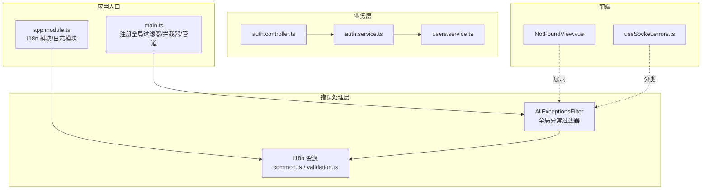
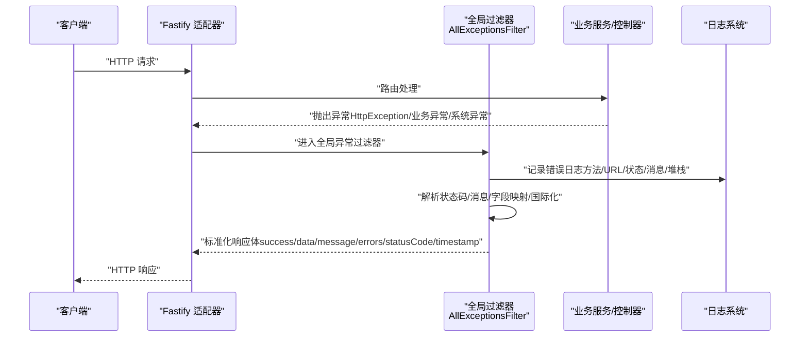
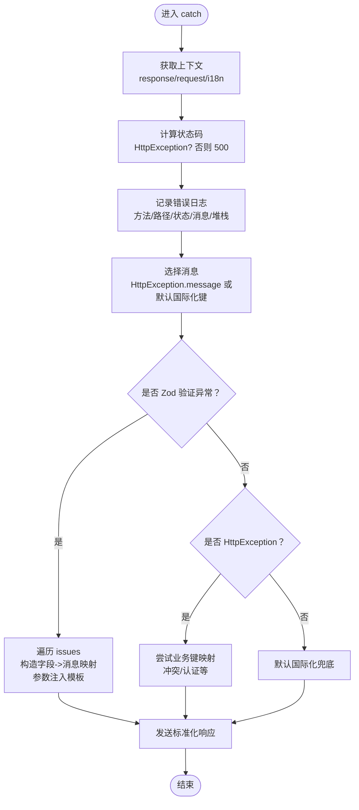
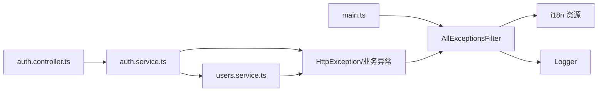

# 错误处理

<cite>
**本文引用的文件**
- [apps/backend/src/common/filters/all-exceptions.filter.ts](file://apps/backend/src/common/filters/all-exceptions.filter.ts)
- [apps/backend/src/main.ts](file://apps/backend/src/main.ts)
- [apps/backend/src/app.module.ts](file://apps/backend/src/app.module.ts)
- [apps/backend/src/i18n/en-US/common.ts](file://apps/backend/src/i18n/en-US/common.ts)
- [apps/backend/src/i18n/zh-CN/common.ts](file://apps/backend/src/i18n/zh-CN/common.ts)
- [apps/backend/src/i18n/en-US/validation.ts](file://apps/backend/src/i18n/en-US/validation.ts)
- [apps/backend/src/i18n/zh-CN/validation.ts](file://apps/backend/src/i18n/zh-CN/validation.ts)
- [apps/backend/src/auth/auth.service.ts](file://apps/backend/src/auth/auth.service.ts)
- [apps/backend/src/users/users.service.ts](file://apps/backend/src/users/users.service.ts)
- [apps/backend/src/auth/auth.controller.ts](file://apps/backend/src/auth/auth.controller.ts)
- [apps/backend/tests/common/filters/all-exceptions.filter.spec.ts](file://apps/backend/tests/common/filters/all-exceptions.filter.spec.ts)
- [apps/frontend/src/views/error/NotFoundView.vue](file://apps/frontend/src/views/error/NotFoundView.vue)
- [apps/frontend/src/composables/useSocket.errors.ts](file://apps/frontend/src/composables/useSocket.errors.ts)
</cite>

## 目录
1. [简介](#简介)
2. [项目结构](#项目结构)
3. [核心组件](#核心组件)
4. [架构总览](#架构总览)
5. [详细组件分析](#详细组件分析)
6. [依赖关系分析](#依赖关系分析)
7. [性能考量](#性能考量)
8. [故障排除指南](#故障排除指南)
9. [结论](#结论)
10. [附录](#附录)

## 简介
本文件面向 Lumina Todo 后端错误处理体系，聚焦全局异常过滤器 AllExceptionsFilter 的实现机制与运行流程，系统性阐述：
- 未捕获异常的捕获、错误分类与标准化响应格式
- HTTP 异常、业务异常与系统异常的差异与处理策略
- 错误日志记录、错误追踪与错误报告机制
- 客户端错误与服务器错误的区分、错误码与国际化消息
- 错误处理最佳实践、调试技巧与故障排除流程

## 项目结构
后端采用 NestJS + Fastify 架构，错误处理的关键位置如下：
- 全局异常过滤器注册于应用入口，统一拦截未捕获异常
- 国际化模块提供多语言错误消息与字段名映射
- 业务模块通过抛出标准 HTTP 异常或业务异常，交由过滤器统一处理
- 前端视图与组合式函数对错误进行展示与分类处理

**图表来源**
- [apps/backend/src/main.ts:172-179](file://apps/backend/src/main.ts#L172-L179)
- [apps/backend/src/app.module.ts:124-133](file://apps/backend/src/app.module.ts#L124-L133)
- [apps/backend/src/common/filters/all-exceptions.filter.ts:16-137](file://apps/backend/src/common/filters/all-exceptions.filter.ts#L16-L137)
- [apps/backend/src/i18n/en-US/common.ts:1-16](file://apps/backend/src/i18n/en-US/common.ts#L1-16)
- [apps/backend/src/i18n/en-US/validation.ts:1-12](file://apps/backend/src/i18n/en-US/validation.ts#L1-L12)
- [apps/backend/src/auth/auth.controller.ts:1-81](file://apps/backend/src/auth/auth.controller.ts#L1-L81)
- [apps/backend/src/auth/auth.service.ts:1-127](file://apps/backend/src/auth/auth.service.ts#L1-L127)
- [apps/backend/src/users/users.service.ts:1-118](file://apps/backend/src/users/users.service.ts#L1-L118)
- [apps/frontend/src/views/error/NotFoundView.vue:1-21](file://apps/frontend/src/views/error/NotFoundView.vue#L1-L21)
- [apps/frontend/src/composables/useSocket.errors.ts:1-32](file://apps/frontend/src/composables/useSocket.errors.ts#L1-L32)

**章节来源**
- [apps/backend/src/main.ts:172-179](file://apps/backend/src/main.ts#L172-L179)
- [apps/backend/src/app.module.ts:124-133](file://apps/backend/src/app.module.ts#L124-L133)

## 核心组件
- 全局异常过滤器 AllExceptionsFilter
  - 捕获所有未处理异常，计算状态码，记录日志，执行国际化消息与字段映射，并输出统一响应体
  - 对 Zod 验证错误进行结构化解析，生成字段级错误映射
  - 对业务异常（如冲突）进行字段映射与消息翻译
- 应用入口 main.ts
  - 注册全局过滤器、全局响应拦截器、XSS 清理拦截器与 Zod 验证管道
  - 配置 CORS、安全头、静态资源、Swagger 文档与优雅停机
- 国际化模块 app.module.ts + i18n 资源
  - I18nModule 配置加载器与解析器，fallback 语言为 en-US
  - common.ts 提供通用错误与字段名映射；validation.ts 提供验证规则模板
- 业务模块
  - 认证与用户服务通过抛出标准异常，交由过滤器统一处理
  - 控制器不直接处理异常，保持职责单一

**章节来源**
- [apps/backend/src/common/filters/all-exceptions.filter.ts:16-137](file://apps/backend/src/common/filters/all-exceptions.filter.ts#L16-L137)
- [apps/backend/src/main.ts:172-179](file://apps/backend/src/main.ts#L172-L179)
- [apps/backend/src/app.module.ts:124-133](file://apps/backend/src/app.module.ts#L124-L133)
- [apps/backend/src/i18n/en-US/common.ts:1-16](file://apps/backend/src/i18n/en-US/common.ts#L1-L16)
- [apps/backend/src/i18n/zh-CN/common.ts:1-16](file://apps/backend/src/i18n/zh-CN/common.ts#L1-L16)
- [apps/backend/src/i18n/en-US/validation.ts:1-12](file://apps/backend/src/i18n/en-US/validation.ts#L1-L12)
- [apps/backend/src/i18n/zh-CN/validation.ts:1-12](file://apps/backend/src/i18n/zh-CN/validation.ts#L1-L12)
- [apps/backend/src/auth/auth.service.ts:44-46](file://apps/backend/src/auth/auth.service.ts#L44-L46)
- [apps/backend/src/users/users.service.ts:102](file://apps/backend/src/users/users.service.ts#L102)

## 架构总览
全局异常过滤器在应用启动阶段注册为全局组件，拦截所有未捕获异常，结合 I18n 上下文与 Zod 错误结构，输出统一的响应体。

**图表来源**
- [apps/backend/src/main.ts:172-179](file://apps/backend/src/main.ts#L172-L179)
- [apps/backend/src/common/filters/all-exceptions.filter.ts:27-137](file://apps/backend/src/common/filters/all-exceptions.filter.ts#L27-L137)

## 详细组件分析

### 全局异常过滤器 AllExceptionsFilter
- 捕获机制
  - 使用装饰器捕获所有异常，优先判断是否为 HttpException，否则默认 500
- 错误分类与处理
  - Zod 验证错误：提取 issues，按字段路径生成结构化错误对象，使用 i18n 模板渲染消息
  - 业务异常：识别常见业务键（如认证相关），将消息映射到对应字段，提升前端可读性
  - 其他异常：使用国际化键兜底，保证消息可读
- 国际化与字段映射
  - 通过 I18nContext.t 进行消息翻译；字段名通过 common.fields.* 映射
  - Zod 参数（如最小长度、最大长度）注入模板变量，实现动态文案
- 标准化响应
  - 输出字段：success=false、data=null、message、errors（结构化）、statusCode、timestamp
- 日志记录
  - 记录请求方法、路径（去除查询参数）、状态码、消息与堆栈，便于追踪

**图表来源**
- [apps/backend/src/common/filters/all-exceptions.filter.ts:27-137](file://apps/backend/src/common/filters/all-exceptions.filter.ts#L27-L137)

**章节来源**
- [apps/backend/src/common/filters/all-exceptions.filter.ts:16-137](file://apps/backend/src/common/filters/all-exceptions.filter.ts#L16-L137)
- [apps/backend/tests/common/filters/all-exceptions.filter.spec.ts:1-126](file://apps/backend/tests/common/filters/all-exceptions.filter.spec.ts#L1-L126)

### HTTP 异常处理、业务异常处理与系统异常处理
- HTTP 异常（如 BadRequest、Unauthorized、Conflict 等）
  - 由业务模块显式抛出，过滤器直接读取响应体中的 message 与 errors 字段
  - 若响应体包含字段映射键，过滤器将其映射到具体字段，便于前端定位
- 业务异常（如用户不存在、邮箱已存在、无效凭据等）
  - 通过服务层抛出特定异常，过滤器识别业务键并进行字段映射与翻译
  - 示例：注册时邮箱冲突映射到 email 字段；登录凭据无效映射到 password 字段
- 系统异常（未捕获的运行时错误）
  - 统一转为 500 Internal Server Error，使用国际化兜底消息
  - 通过日志记录堆栈，便于后续排查

**章节来源**
- [apps/backend/src/auth/auth.service.ts:44-46](file://apps/backend/src/auth/auth.service.ts#L44-L46)
- [apps/backend/src/users/users.service.ts:102](file://apps/backend/src/users/users.service.ts#L102)
- [apps/backend/src/common/filters/all-exceptions.filter.ts:87-117](file://apps/backend/src/common/filters/all-exceptions.filter.ts#L87-L117)

### 错误日志记录、错误追踪与错误报告机制
- 日志记录
  - 过滤器记录请求方法、路径（去参）、状态码、消息与堆栈
  - 应用入口使用 Pino 日志模块，自定义日志级别与序列化器，区分成功/警告/错误
- 错误追踪
  - 响应体包含 timestamp，便于时间线追踪
  - 前端可通过错误响应体与日志进行关联
- 错误报告
  - 建议在生产环境将日志输出至集中式日志系统（如 ELK/Cloud Logging）
  - 可基于过滤器日志与业务埋点构建错误报告看板

**章节来源**
- [apps/backend/src/common/filters/all-exceptions.filter.ts:37-45](file://apps/backend/src/common/filters/all-exceptions.filter.ts#L37-L45)
- [apps/backend/src/app.module.ts:35-89](file://apps/backend/src/app.module.ts#L35-L89)

### 客户端错误与服务器错误的区分、错误码定义与国际化
- 错误区分
  - 客户端错误（4xx）：通常由 HttpException 或业务异常触发，message 由业务键或明确文案组成
  - 服务器错误（5xx）：系统异常默认 500，message 为国际化兜底
- 错误码与响应体
  - 统一响应体包含 statusCode，便于前端按状态码分类处理
  - errors 字段提供结构化字段级错误，支持前端精准提示
- 国际化
  - common.ts 提供通用错误与字段名映射
  - validation.ts 提供验证规则模板，支持参数注入（如最小/最大长度）
  - I18nModule 通过请求头或 Accept-Language 解析语言

**章节来源**
- [apps/backend/src/i18n/en-US/common.ts:1-16](file://apps/backend/src/i18n/en-US/common.ts#L1-L16)
- [apps/backend/src/i18n/zh-CN/common.ts:1-16](file://apps/backend/src/i18n/zh-CN/common.ts#L1-L16)
- [apps/backend/src/i18n/en-US/validation.ts:1-12](file://apps/backend/src/i18n/en-US/validation.ts#L1-L12)
- [apps/backend/src/i18n/zh-CN/validation.ts:1-12](file://apps/backend/src/i18n/zh-CN/validation.ts#L1-L12)
- [apps/backend/src/app.module.ts:124-133](file://apps/backend/src/app.module.ts#L124-L133)

### 前端错误处理与调试
- 404 页面
  - NotFoundView.vue 使用 i18n 渲染标题与描述，引导返回首页
- WebSocket 错误分类
  - useSocket.errors.ts 提供关键字匹配，区分认证错误与瞬态错误，辅助前端做重连与提示
- 建议
  - 前端统一拦截 4xx/5xx 并展示对应文案
  - 对认证错误进行跳转或弹窗处理
  - 对瞬态错误进行指数退避重试

**章节来源**
- [apps/frontend/src/views/error/NotFoundView.vue:1-21](file://apps/frontend/src/views/error/NotFoundView.vue#L1-L21)
- [apps/frontend/src/composables/useSocket.errors.ts:1-32](file://apps/frontend/src/composables/useSocket.errors.ts#L1-L32)

## 依赖关系分析
- 全局过滤器依赖
  - NestJS 异常处理基础设施（ExceptionFilter、HttpException、HttpStatus、Logger）
  - I18nContext 与 i18n 资源，用于消息与字段名翻译
  - Fastify 上下文（request/response）用于日志与响应
- 业务模块依赖
  - 通过抛出标准异常，交由过滤器统一处理，降低控制器与服务的重复代码
- 应用入口依赖
  - 注册全局过滤器、拦截器与管道，确保一致性

**图表来源**
- [apps/backend/src/main.ts:172-179](file://apps/backend/src/main.ts#L172-L179)
- [apps/backend/src/common/filters/all-exceptions.filter.ts:16-137](file://apps/backend/src/common/filters/all-exceptions.filter.ts#L16-L137)
- [apps/backend/src/auth/auth.controller.ts:1-81](file://apps/backend/src/auth/auth.controller.ts#L1-L81)
- [apps/backend/src/auth/auth.service.ts:1-127](file://apps/backend/src/auth/auth.service.ts#L1-L127)
- [apps/backend/src/users/users.service.ts:1-118](file://apps/backend/src/users/users.service.ts#L1-L118)

**章节来源**
- [apps/backend/src/main.ts:172-179](file://apps/backend/src/main.ts#L172-L179)
- [apps/backend/src/common/filters/all-exceptions.filter.ts:16-137](file://apps/backend/src/common/filters/all-exceptions.filter.ts#L16-L137)

## 性能考量
- 过滤器仅在异常发生时执行，正常路径无额外开销
- I18n 查询与字段映射为轻量操作，建议缓存常用键值
- 日志输出在生产环境建议使用 JSON 格式，减少格式化成本
- 对高频错误（如 429/401）可结合限流与前端重试策略，避免雪崩

## 故障排除指南
- 如出现 500 错误
  - 检查过滤器日志中的堆栈，定位具体异常来源
  - 确认业务模块是否正确抛出业务异常而非直接抛出 Error
- 如出现 400 验证错误
  - 检查 Zod 验证器配置与 i18n 消息模板是否完整
  - 确认前端传入字段与后端 schema 是否一致
- 如出现 401/403
  - 检查认证流程与令牌有效性，确认业务异常是否被正确抛出
- 如出现 409 冲突
  - 确认业务键映射是否正确，errors 字段是否指向目标字段
- 前端错误展示
  - 对 404 使用 NotFoundView.vue
  - 对 WebSocket 错误使用 useSocket.errors.ts 进行分类处理

**章节来源**
- [apps/backend/src/common/filters/all-exceptions.filter.ts:37-45](file://apps/backend/src/common/filters/all-exceptions.filter.ts#L37-L45)
- [apps/backend/src/auth/auth.service.ts:86-92](file://apps/backend/src/auth/auth.service.ts#L86-L92)
- [apps/backend/src/users/users.service.ts:102](file://apps/backend/src/users/users.service.ts#L102)
- [apps/frontend/src/views/error/NotFoundView.vue:1-21](file://apps/frontend/src/views/error/NotFoundView.vue#L1-L21)
- [apps/frontend/src/composables/useSocket.errors.ts:1-32](file://apps/frontend/src/composables/useSocket.errors.ts#L1-L32)

## 结论
Lumina Todo 的错误处理体系通过全局异常过滤器实现了“统一捕获、分类处理、标准化输出、国际化支持”的闭环。配合 I18n 模块与结构化错误映射，既提升了用户体验，也简化了前后端协作与问题排查。建议在生产环境中完善日志采集与告警机制，并持续优化验证规则与错误键设计，以进一步提升系统的稳定性与可维护性。

## 附录
- 关键实现路径参考
  - 全局过滤器：[apps/backend/src/common/filters/all-exceptions.filter.ts](file://apps/backend/src/common/filters/all-exceptions.filter.ts)
  - 应用入口注册：[apps/backend/src/main.ts](file://apps/backend/src/main.ts)
  - 国际化模块与资源：[apps/backend/src/app.module.ts](file://apps/backend/src/app.module.ts)，[apps/backend/src/i18n/en-US/common.ts](file://apps/backend/src/i18n/en-US/common.ts)，[apps/backend/src/i18n/zh-CN/common.ts](file://apps/backend/src/i18n/zh-CN/common.ts)，[apps/backend/src/i18n/en-US/validation.ts](file://apps/backend/src/i18n/en-US/validation.ts)，[apps/backend/src/i18n/zh-CN/validation.ts](file://apps/backend/src/i18n/zh-CN/validation.ts)
  - 业务异常示例：[apps/backend/src/auth/auth.service.ts](file://apps/backend/src/auth/auth.service.ts)，[apps/backend/src/users/users.service.ts](file://apps/backend/src/users/users.service.ts)
  - 前端错误视图与组合式函数：[apps/frontend/src/views/error/NotFoundView.vue](file://apps/frontend/src/views/error/NotFoundView.vue)，[apps/frontend/src/composables/useSocket.errors.ts](file://apps/frontend/src/composables/useSocket.errors.ts)