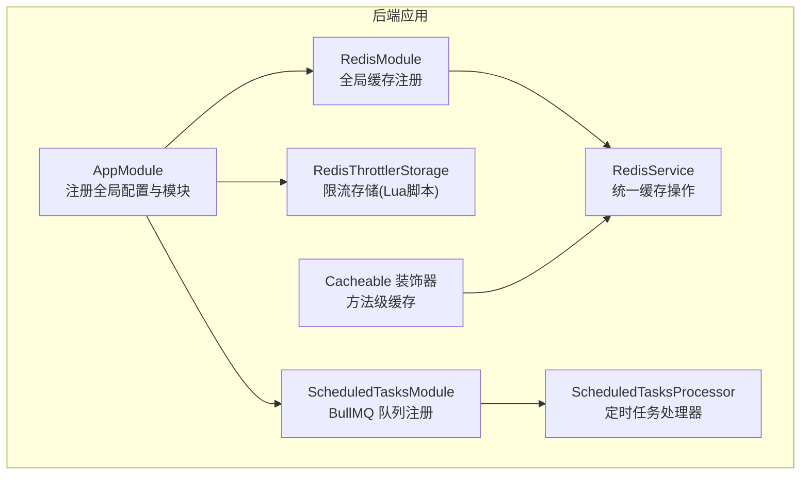
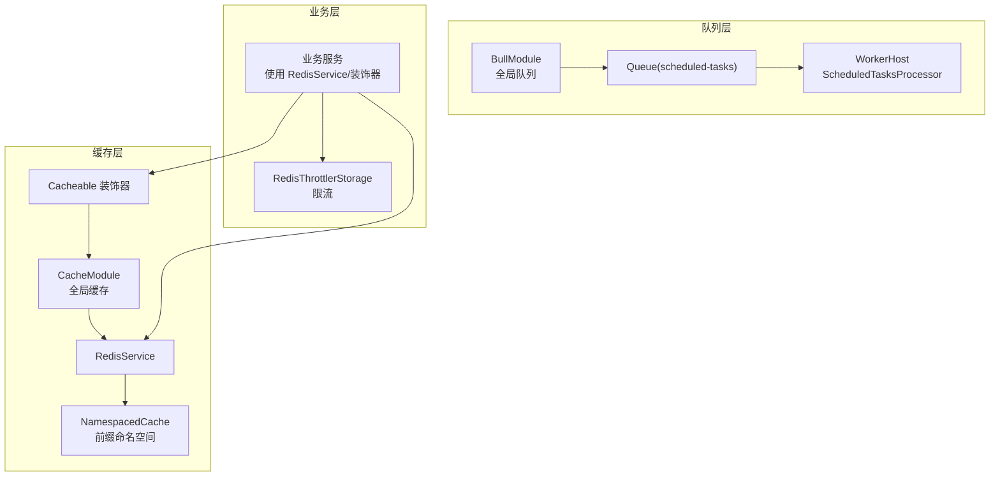
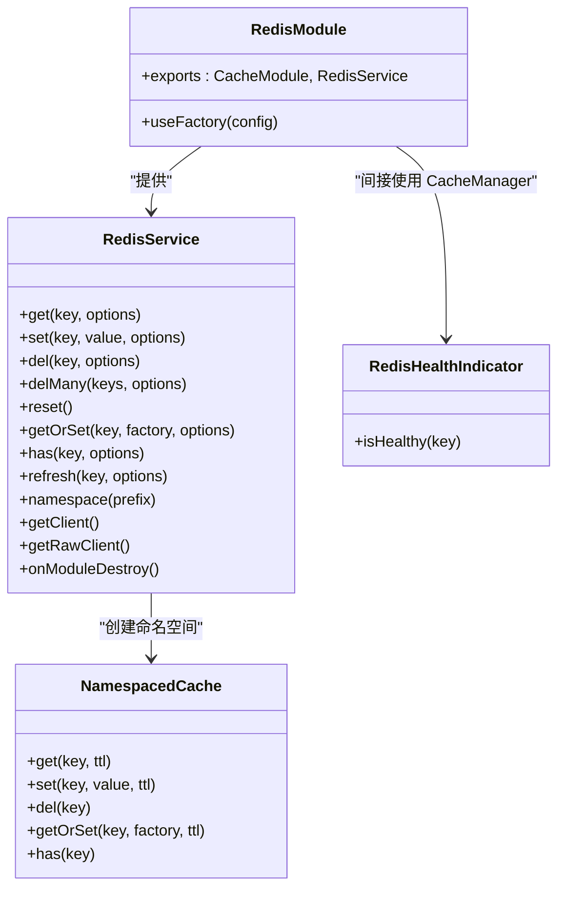
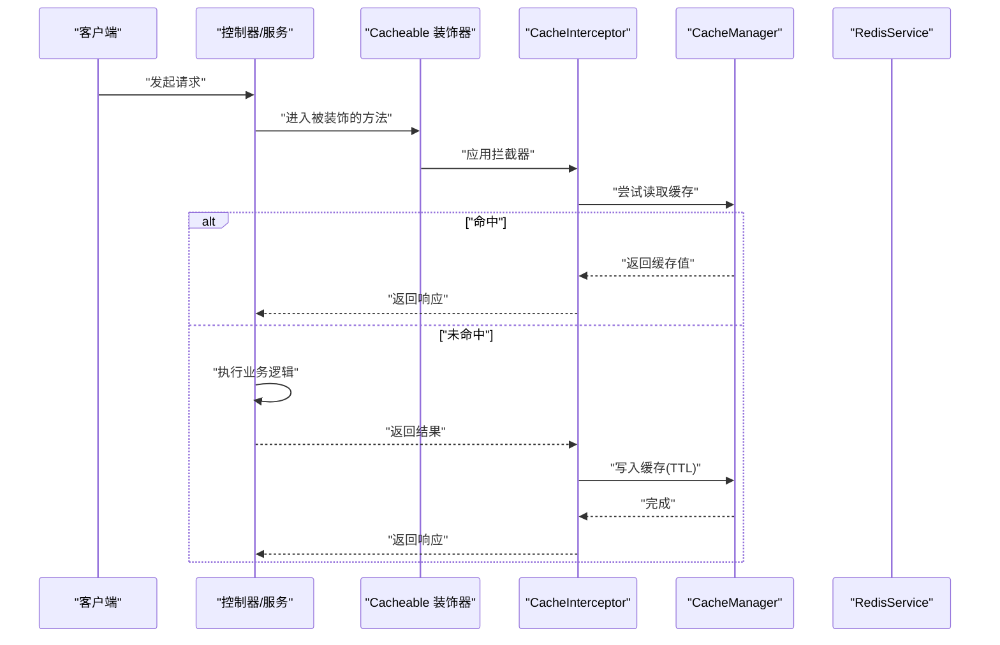
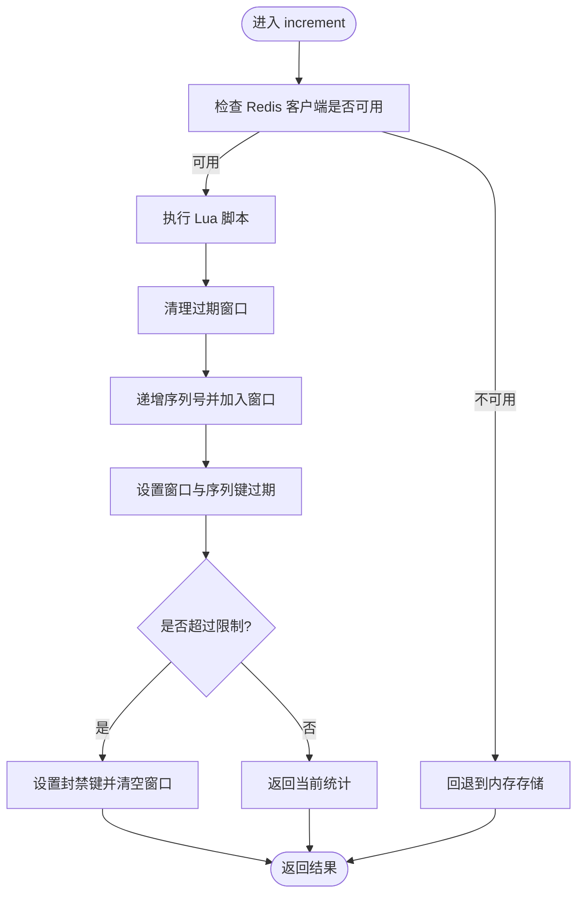
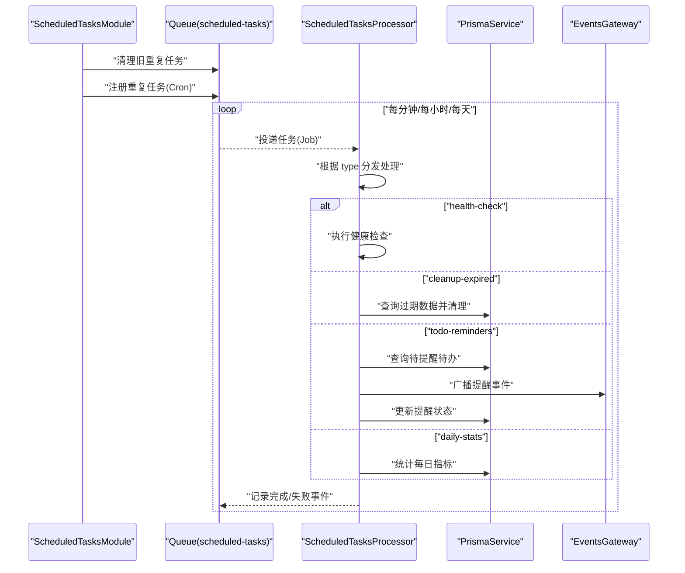
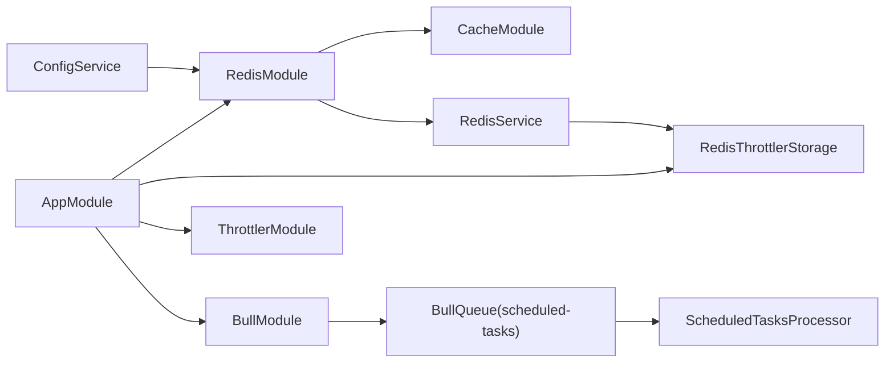

# 缓存与队列系统

<cite>
**本文引用的文件**
- [apps/backend/src/redis/index.ts](file://apps/backend/src/redis/index.ts)
- [apps/backend/src/redis/redis.module.ts](file://apps/backend/src/redis/redis.module.ts)
- [apps/backend/src/redis/redis.service.ts](file://apps/backend/src/redis/redis.service.ts)
- [apps/backend/src/redis/cache.decorator.ts](file://apps/backend/src/redis/cache.decorator.ts)
- [apps/backend/src/redis/redis.health.ts](file://apps/backend/src/redis/redis.health.ts)
- [apps/backend/src/common/throttling/redis-throttler.storage.ts](file://apps/backend/src/common/throttling/redis-throttler.storage.ts)
- [apps/backend/src/scheduled-tasks/constants.ts](file://apps/backend/src/scheduled-tasks/constants.ts)
- [apps/backend/src/scheduled-tasks/scheduled-tasks.module.ts](file://apps/backend/src/scheduled-tasks/scheduled-tasks.module.ts)
- [apps/backend/src/scheduled-tasks/scheduled-tasks.processor.ts](file://apps/backend/src/scheduled-tasks/scheduled-tasks.processor.ts)
- [apps/backend/src/app.module.ts](file://apps/backend/src/app.module.ts)
- [apps/backend/package.json](file://apps/backend/package.json)
</cite>

## 目录
1. [简介](#简介)
2. [项目结构](#项目结构)
3. [核心组件](#核心组件)
4. [架构总览](#架构总览)
5. [详细组件分析](#详细组件分析)
6. [依赖关系分析](#依赖关系分析)
7. [性能考量](#性能考量)
8. [故障排查指南](#故障排查指南)
9. [结论](#结论)
10. [附录](#附录)

## 简介
本文件面向 Lumina Todo 后端的缓存与队列系统，围绕以下目标展开：
- Redis 缓存系统的配置与使用：连接池管理、缓存策略、数据序列化、前缀命名空间与 TTL 管理。
- 缓存装饰器的实现原理与使用场景：方法级缓存、禁用缓存、键与 TTL 策略。
- BullMQ 队列系统的架构设计：作业队列、重复任务与 Cron 调度、失败重试与事件回调。
- 定时任务处理器：Cron 表达式、任务执行与结果处理。
- 缓存优化策略、队列监控与性能调优建议。

## 项目结构
缓存与队列相关代码主要位于后端应用的以下模块中：
- Redis 缓存模块：注册全局缓存、提供 RedisService、健康检查与装饰器导出。
- 速率限制模块：基于 Redis 的限流存储，使用 Lua 脚本原子计数与封禁。
- 定时任务模块：基于 BullMQ 的重复任务，使用 Cron 表达式调度。

**图表来源**
- [apps/backend/src/app.module.ts:97-123](file://apps/backend/src/app.module.ts#L97-L123)
- [apps/backend/src/redis/redis.module.ts:26-83](file://apps/backend/src/redis/redis.module.ts#L26-L83)
- [apps/backend/src/redis/redis.service.ts:61-224](file://apps/backend/src/redis/redis.service.ts#L61-L224)
- [apps/backend/src/redis/cache.decorator.ts:42-58](file://apps/backend/src/redis/cache.decorator.ts#L42-L58)
- [apps/backend/src/common/throttling/redis-throttler.storage.ts:106-156](file://apps/backend/src/common/throttling/redis-throttler.storage.ts#L106-L156)
- [apps/backend/src/scheduled-tasks/scheduled-tasks.module.ts:15-37](file://apps/backend/src/scheduled-tasks/scheduled-tasks.module.ts#L15-L37)
- [apps/backend/src/scheduled-tasks/scheduled-tasks.processor.ts:36-68](file://apps/backend/src/scheduled-tasks/scheduled-tasks.processor.ts#L36-L68)

**章节来源**
- [apps/backend/src/app.module.ts:28-146](file://apps/backend/src/app.module.ts#L28-L146)
- [apps/backend/src/redis/index.ts:1-5](file://apps/backend/src/redis/index.ts#L1-L5)

## 核心组件
- RedisModule：异步注册全局缓存，加载 Redis 连接参数，配置连接重试与默认 TTL，导出 CacheModule 与 RedisService。
- RedisService：统一缓存操作封装，支持前缀键构建、批量删除、刷新 TTL、命名空间缓存、底层客户端访问。
- Cacheable 装饰器：在方法上启用缓存拦截器，支持自定义缓存键与 TTL，并可禁用缓存。
- RedisThrottlerStorage：基于 Redis 的限流存储，使用 Lua 脚本实现原子计数、窗口清理、封禁与回退策略。
- ScheduledTasksModule：注册 BullMQ 队列，清理旧重复任务并按 Cron 注册新任务。
- ScheduledTasksProcessor：处理定时任务，包含健康检查、过期清理、待办提醒与每日统计等任务分支。

**章节来源**
- [apps/backend/src/redis/redis.module.ts:26-83](file://apps/backend/src/redis/redis.module.ts#L26-L83)
- [apps/backend/src/redis/redis.service.ts:61-255](file://apps/backend/src/redis/redis.service.ts#L61-L255)
- [apps/backend/src/redis/cache.decorator.ts:42-88](file://apps/backend/src/redis/cache.decorator.ts#L42-L88)
- [apps/backend/src/common/throttling/redis-throttler.storage.ts:106-173](file://apps/backend/src/common/throttling/redis-throttler.storage.ts#L106-L173)
- [apps/backend/src/scheduled-tasks/scheduled-tasks.module.ts:25-91](file://apps/backend/src/scheduled-tasks/scheduled-tasks.module.ts#L25-L91)
- [apps/backend/src/scheduled-tasks/scheduled-tasks.processor.ts:36-289](file://apps/backend/src/scheduled-tasks/scheduled-tasks.processor.ts#L36-L289)

## 架构总览
系统采用“全局缓存 + 方法级装饰器 + BullMQ 定时任务”的组合架构：
- 缓存层：NestJS CacheManager + cache-manager-ioredis-yet + ioredis，提供连接池、重试与默认 TTL。
- 业务层：通过 RedisService 与装饰器实现数据缓存、会话存储、临时数据管理。
- 队列层：BullMQ + Redis，使用 repeat + Cron 实现分布式唯一执行与失败重试。
- 监控层：健康检查指示器与处理器事件回调，便于观测运行状态。

**图表来源**
- [apps/backend/src/app.module.ts:97-123](file://apps/backend/src/app.module.ts#L97-L123)
- [apps/backend/src/redis/redis.module.ts:28-78](file://apps/backend/src/redis/redis.module.ts#L28-L78)
- [apps/backend/src/redis/redis.service.ts:216-255](file://apps/backend/src/redis/redis.service.ts#L216-L255)
- [apps/backend/src/redis/cache.decorator.ts:42-58](file://apps/backend/src/redis/cache.decorator.ts#L42-L58)
- [apps/backend/src/common/throttling/redis-throttler.storage.ts:106-156](file://apps/backend/src/common/throttling/redis-throttler.storage.ts#L106-L156)
- [apps/backend/src/scheduled-tasks/scheduled-tasks.module.ts:16-23](file://apps/backend/src/scheduled-tasks/scheduled-tasks.module.ts#L16-L23)
- [apps/backend/src/scheduled-tasks/scheduled-tasks.processor.ts:36-68](file://apps/backend/src/scheduled-tasks/scheduled-tasks.processor.ts#L36-L68)

## 详细组件分析

### Redis 缓存模块与服务
- 连接池与重连：通过 redisStore 创建连接，启用 ready 检查与最大重试次数；提供指数退避重试策略。
- 默认 TTL 与键前缀：从配置读取默认 TTL（秒转毫秒），设置 keyPrefix；RedisService 提供前缀拼接与命名空间封装。
- 命名空间缓存：NamespacedCache 自动附加前缀，简化多域缓存管理（如 user/session/auth/temp/rate_limit/config）。
- 关闭流程：模块销毁时遍历 stores 并调用 disconnect，保证优雅退出。
- 常用操作：get/set/del/delMany/reset/getOrSet/has/refresh，均包含错误日志与兜底。
- 健康检查：RedisHealthIndicator 通过 set/get 测试键验证连接可用性。

**图表来源**
- [apps/backend/src/redis/redis.module.ts:26-83](file://apps/backend/src/redis/redis.module.ts#L26-L83)
- [apps/backend/src/redis/redis.service.ts:61-255](file://apps/backend/src/redis/redis.service.ts#L61-L255)
- [apps/backend/src/redis/redis.health.ts:10-42](file://apps/backend/src/redis/redis.health.ts#L10-L42)

**章节来源**
- [apps/backend/src/redis/redis.module.ts:26-83](file://apps/backend/src/redis/redis.module.ts#L26-L83)
- [apps/backend/src/redis/redis.service.ts:61-255](file://apps/backend/src/redis/redis.service.ts#L61-L255)
- [apps/backend/src/redis/redis.health.ts:10-42](file://apps/backend/src/redis/redis.health.ts#L10-L42)

### 缓存装饰器与使用场景
- Cacheable：在方法上启用缓存拦截器，支持自定义缓存键与 TTL；通过元数据传递配置。
- NoCache：禁用特定方法的缓存。
- 使用场景：
  - 数据缓存：对查询类接口进行方法级缓存，降低数据库压力。
  - 会话存储：结合前缀命名空间管理会话与黑名单等临时数据。
  - 临时数据：使用短 TTL 的临时键，如验证码、临时令牌等。

**图表来源**
- [apps/backend/src/redis/cache.decorator.ts:42-58](file://apps/backend/src/redis/cache.decorator.ts#L42-L58)
- [apps/backend/src/redis/redis.service.ts:99-121](file://apps/backend/src/redis/redis.service.ts#L99-L121)

**章节来源**
- [apps/backend/src/redis/cache.decorator.ts:42-88](file://apps/backend/src/redis/cache.decorator.ts#L42-L88)

### 速率限制存储（RedisThrottlerStorage）
- 原子计数与封禁：使用 Lua 脚本在 Redis 中维护 hits 窗口、序列号与封禁键，实现毫秒级窗口清理与封禁。
- 键空间：使用前缀 rate_limit 与限流器名称、键组合形成唯一存储键。
- 回退策略：当底层 Redis 客户端不可用时，回退到内存存储，保证服务可用性。

**图表来源**
- [apps/backend/src/common/throttling/redis-throttler.storage.ts:18-87](file://apps/backend/src/common/throttling/redis-throttler.storage.ts#L18-L87)
- [apps/backend/src/common/throttling/redis-throttler.storage.ts:106-156](file://apps/backend/src/common/throttling/redis-throttler.storage.ts#L106-L156)

**章节来源**
- [apps/backend/src/common/throttling/redis-throttler.storage.ts:106-173](file://apps/backend/src/common/throttling/redis-throttler.storage.ts#L106-L173)

### BullMQ 队列与定时任务处理器
- 队列注册：ScheduledTasksModule 注册名为 scheduled-tasks 的队列。
- 重复任务与 Cron：在模块初始化时清理旧重复任务并注册新的重复任务，使用 Cron 表达式控制执行频率。
- 处理器分支：ScheduledTasksProcessor 根据任务类型分发处理，包含健康检查、过期清理、待办提醒与每日统计。
- 事件回调：监听 completed/failed 事件，记录日志便于监控。

**图表来源**
- [apps/backend/src/scheduled-tasks/scheduled-tasks.module.ts:25-91](file://apps/backend/src/scheduled-tasks/scheduled-tasks.module.ts#L25-L91)
- [apps/backend/src/scheduled-tasks/scheduled-tasks.processor.ts:36-289](file://apps/backend/src/scheduled-tasks/scheduled-tasks.processor.ts#L36-L289)

**章节来源**
- [apps/backend/src/scheduled-tasks/scheduled-tasks.module.ts:25-91](file://apps/backend/src/scheduled-tasks/scheduled-tasks.module.ts#L25-L91)
- [apps/backend/src/scheduled-tasks/scheduled-tasks.processor.ts:36-289](file://apps/backend/src/scheduled-tasks/scheduled-tasks.processor.ts#L36-L289)
- [apps/backend/src/scheduled-tasks/constants.ts:1-5](file://apps/backend/src/scheduled-tasks/constants.ts#L1-L5)

## 依赖关系分析
- 缓存依赖：RedisModule 依赖 ConfigModule 与 Redis 客户端，向全局导出 CacheModule 与 RedisService。
- 业务依赖：AppModule 注册 RedisModule、BullModule、ThrottlerModule，并注入 RedisService 用于限流。
- 队列依赖：ScheduledTasksModule 依赖 BullModule，处理器依赖 PrismaService 与 EventsGateway。

**图表来源**
- [apps/backend/src/app.module.ts:97-123](file://apps/backend/src/app.module.ts#L97-L123)
- [apps/backend/src/redis/redis.module.ts:28-78](file://apps/backend/src/redis/redis.module.ts#L28-L78)
- [apps/backend/src/scheduled-tasks/scheduled-tasks.module.ts:16-23](file://apps/backend/src/scheduled-tasks/scheduled-tasks.module.ts#L16-L23)

**章节来源**
- [apps/backend/src/app.module.ts:97-123](file://apps/backend/src/app.module.ts#L97-L123)
- [apps/backend/src/redis/redis.module.ts:28-78](file://apps/backend/src/redis/redis.module.ts#L28-L78)
- [apps/backend/src/scheduled-tasks/scheduled-tasks.module.ts:16-23](file://apps/backend/src/scheduled-tasks/scheduled-tasks.module.ts#L16-L23)

## 性能考量
- 缓存层
  - TTL 设计：根据数据变更频率选择合适的 TTL，热点数据可缩短 TTL 以减少陈旧风险；静态列表可延长 TTL。
  - 命名空间：使用前缀区分不同业务域，避免键冲突与误删。
  - 批量操作：优先使用 delMany 并行删除，减少网络往返。
  - 序列化：cache-manager 默认序列化，注意对象结构与循环引用，必要时自定义序列化策略。
- 队列层
  - 重复任务：使用 removeOnComplete 控制历史任务清理，避免 Redis 键膨胀。
  - 失败重试：合理设置 attempts 与 backoff（指数退避），避免雪崩效应。
  - 任务粒度：将长耗时任务拆分为多个小任务，提升吞吐与可观测性。
- 监控与可观测性
  - 使用处理器事件回调记录完成/失败日志。
  - 结合 Redis 与 BullMQ 的内置指标与日志，建立告警阈值。

[本节为通用指导，无需列出具体文件来源]

## 故障排查指南
- 缓存连接失败
  - 检查 RedisModule 的 useFactory 是否正确读取配置，确认 host/port/password/db/keyPrefix。
  - 查看重试日志与停止重试条件，定位网络或认证问题。
- 缓存读写异常
  - 使用 RedisHealthIndicator 的 isHealthy 进行快速验证。
  - 检查 RedisService 的错误日志，确认键构建与 TTL 参数。
- 限流失效
  - 若底层 Redis 客户端不可用，将回退到内存存储；检查日志中的回退提示。
  - 确认 Lua 脚本执行权限与键空间前缀。
- 定时任务未执行
  - 确认 ScheduledTasksModule 初始化时清理旧重复任务并注册新任务。
  - 检查 Cron 表达式与 removeOnComplete/removeOnFail 配置。
  - 查看处理器事件回调日志，定位失败原因。

**章节来源**
- [apps/backend/src/redis/redis.health.ts:20-41](file://apps/backend/src/redis/redis.health.ts#L20-L41)
- [apps/backend/src/redis/redis.module.ts:56-64](file://apps/backend/src/redis/redis.module.ts#L56-L64)
- [apps/backend/src/common/throttling/redis-throttler.storage.ts:162-171](file://apps/backend/src/common/throttling/redis-throttler.storage.ts#L162-L171)
- [apps/backend/src/scheduled-tasks/scheduled-tasks.module.ts:28-91](file://apps/backend/src/scheduled-tasks/scheduled-tasks.module.ts#L28-L91)
- [apps/backend/src/scheduled-tasks/scheduled-tasks.processor.ts:280-289](file://apps/backend/src/scheduled-tasks/scheduled-tasks.processor.ts#L280-L289)

## 结论
本系统通过“全局缓存 + 方法级装饰器 + BullMQ 定时任务”实现了高可用、可扩展的缓存与队列能力。RedisModule 提供稳定的连接与默认策略，RedisService 与装饰器覆盖常见缓存场景；BullMQ 的重复任务与事件回调保障定时任务的可靠性与可观测性。配合 RedisThrottlerStorage 的原子限流与健康检查机制，整体具备良好的生产可用性与运维友好性。

[本节为总结，无需列出具体文件来源]

## 附录
- 关键配置项（来自 RedisModule 与 BullModule）
  - Redis 连接：host、port、password、db、keyPrefix。
  - 默认 TTL：REDIS_DEFAULT_TTL（秒，转换为毫秒）。
  - BullMQ 默认作业：removeOnComplete、removeOnFail、attempts、backoff（指数退避）。
- 常用 TTL 常量（秒）
  - 1 分钟、5 分钟、15 分钟、30 分钟、1 小时、1 天、1 周。
- 常见前缀
  - user、session、auth、rate_limit、config、temp。

**章节来源**
- [apps/backend/src/redis/redis.module.ts:34-41](file://apps/backend/src/redis/redis.module.ts#L34-L41)
- [apps/backend/src/app.module.ts:98-116](file://apps/backend/src/app.module.ts#L98-L116)
- [apps/backend/src/redis/redis.service.ts:40-55](file://apps/backend/src/redis/redis.service.ts#L40-L55)