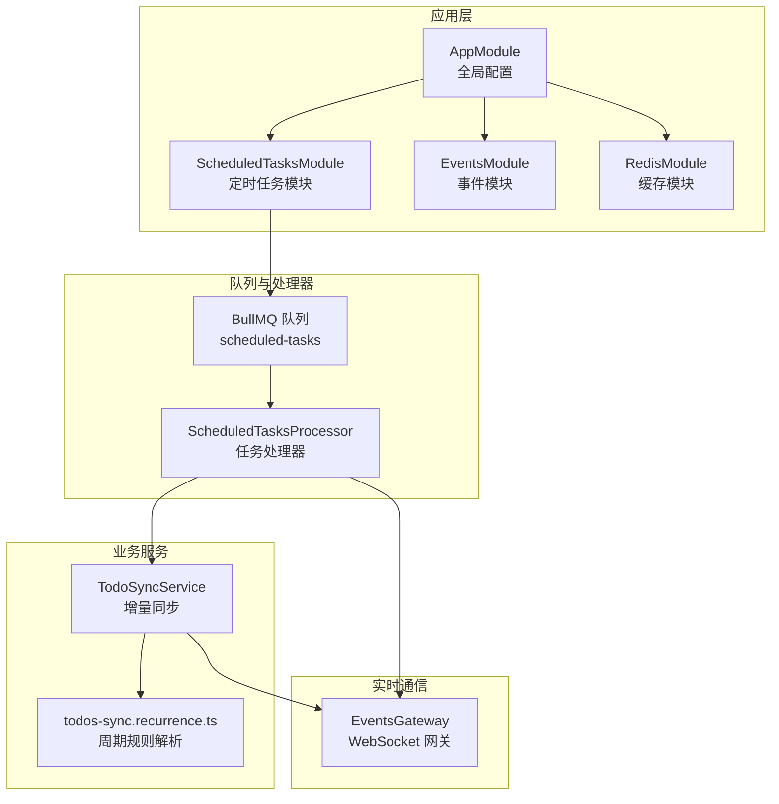
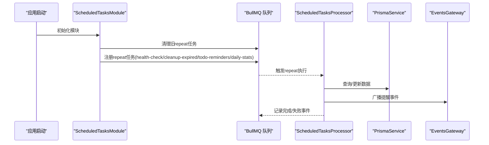
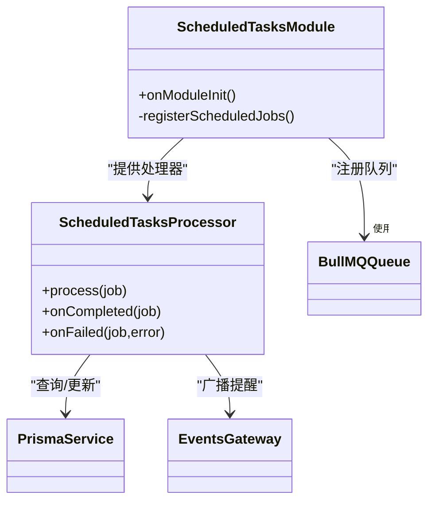
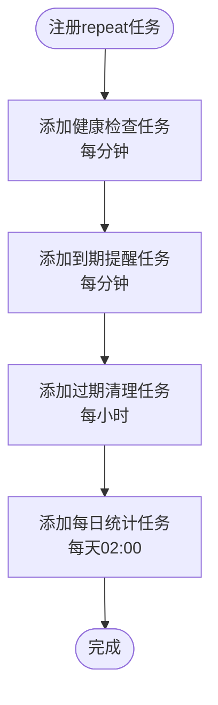
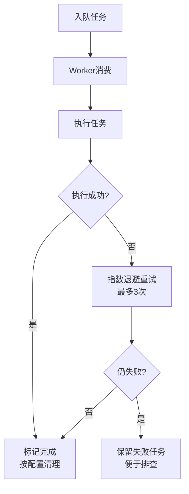
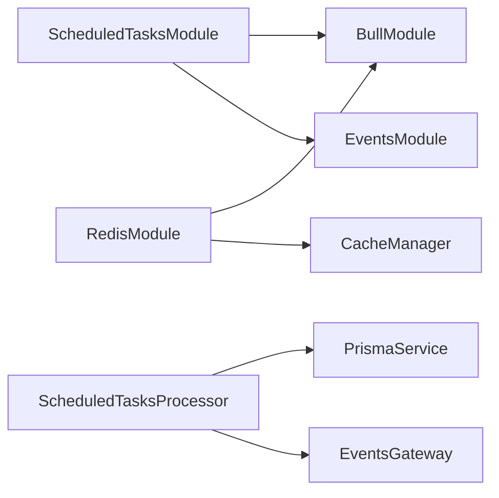

# 任务管理

<cite>
**本文引用的文件**
- [apps/backend/src/scheduled-tasks/constants.ts](file://apps/backend/src/scheduled-tasks/constants.ts)
- [apps/backend/src/scheduled-tasks/index.ts](file://apps/backend/src/scheduled-tasks/index.ts)
- [apps/backend/src/scheduled-tasks/scheduled-tasks.module.ts](file://apps/backend/src/scheduled-tasks/scheduled-tasks.module.ts)
- [apps/backend/src/scheduled-tasks/scheduled-tasks.processor.ts](file://apps/backend/src/scheduled-tasks/scheduled-tasks.processor.ts)
- [apps/backend/src/app.module.ts](file://apps/backend/src/app.module.ts)
- [apps/backend/src/redis/redis.module.ts](file://apps/backend/src/redis/redis.module.ts)
- [apps/backend/src/redis/redis.service.ts](file://apps/backend/src/redis/redis.service.ts)
- [apps/backend/src/events/events.gateway.ts](file://apps/backend/src/events/events.gateway.ts)
- [apps/backend/src/todos/todos-sync.service.ts](file://apps/backend/src/todos/todos-sync.service.ts)
- [apps/backend/src/todos/todos-sync.recurrence.ts](file://apps/backend/src/todos/todos-sync.recurrence.ts)
- [apps/backend/tests/scheduled-tasks.processor.spec.ts](file://apps/backend/tests/scheduled-tasks.processor.spec.ts)
- [apps/backend/tests/events/events.gateway.spec.ts](file://apps/backend/tests/events/events.gateway.spec.ts)
- [apps/backend/src/events/events.module.ts](file://apps/backend/src/events/events.module.ts)
- [deploy.sh](file://deploy.sh)
</cite>

## 目录
1. [简介](#简介)
2. [项目结构](#项目结构)
3. [核心组件](#核心组件)
4. [架构总览](#架构总览)
5. [详细组件分析](#详细组件分析)
6. [依赖分析](#依赖分析)
7. [性能考虑](#性能考虑)
8. [故障排查指南](#故障排查指南)
9. [结论](#结论)
10. [附录](#附录)

## 简介
本文件面向Lumina任务管理系统，系统性梳理定时任务配置、任务调度器实现、任务执行策略，并覆盖以下主题：
- Cron表达式语法与任务调度
- 任务优先级与并发控制
- 任务持久化与失败重试
- 任务监控与告警
- 延迟任务、周期性任务、一次性任务的实现方式
- 任务队列管理、性能优化与资源限制
- 任务开发指南、调试技巧与故障排查

## 项目结构
Lumina后端采用NestJS框架，定时任务由BullMQ队列与Redis共同支撑；任务注册在模块初始化阶段完成，处理器按类型分发执行；实时事件通过WebSocket网关广播；同步与提醒逻辑与任务协同工作。

**图表来源**
- [apps/backend/src/app.module.ts:27-161](file://apps/backend/src/app.module.ts#L27-L161)
- [apps/backend/src/scheduled-tasks/scheduled-tasks.module.ts:15-24](file://apps/backend/src/scheduled-tasks/scheduled-tasks.module.ts#L15-L24)
- [apps/backend/src/scheduled-tasks/scheduled-tasks.processor.ts:36-47](file://apps/backend/src/scheduled-tasks/scheduled-tasks.processor.ts#L36-L47)
- [apps/backend/src/events/events.module.ts:9-13](file://apps/backend/src/events/events.module.ts#L9-L13)
- [apps/backend/src/redis/redis.module.ts:26-83](file://apps/backend/src/redis/redis.module.ts#L26-L83)
- [apps/backend/src/todos/todos-sync.service.ts:40-46](file://apps/backend/src/todos/todos-sync.service.ts#L40-L46)
- [apps/backend/src/todos/todos-sync.recurrence.ts:87-151](file://apps/backend/src/todos/todos-sync.recurrence.ts#L87-L151)

**章节来源**
- [apps/backend/src/app.module.ts:27-161](file://apps/backend/src/app.module.ts#L27-L161)
- [apps/backend/src/scheduled-tasks/scheduled-tasks.module.ts:15-24](file://apps/backend/src/scheduled-tasks/scheduled-tasks.module.ts#L15-L24)
- [apps/backend/src/events/events.module.ts:9-13](file://apps/backend/src/events/events.module.ts#L9-L13)
- [apps/backend/src/redis/redis.module.ts:26-83](file://apps/backend/src/redis/redis.module.ts#L26-L83)

## 核心组件
- 定时任务队列与常量
  - 队列名称：scheduled-tasks
  - 导出入口：index.ts统一导出模块、处理器与常量
- 定时任务模块
  - 注册BullMQ队列，初始化时清理旧repeat任务并注册新的repeat任务
  - 任务类型：健康检查、到期提醒、过期清理、每日统计
- 定时任务处理器
  - 根据job.data.type分发执行
  - 任务完成/失败事件日志
- 全局队列配置
  - 默认作业选项：完成自动清理、失败保留、指数退避重试
- 实时事件网关
  - 广播提醒事件至用户房间
- 同步与周期规则
  - 增量同步合并冲突检测
  - 周期规则解析与下一次到期时间计算

**章节来源**
- [apps/backend/src/scheduled-tasks/constants.ts:1-5](file://apps/backend/src/scheduled-tasks/constants.ts#L1-L5)
- [apps/backend/src/scheduled-tasks/index.ts:1-3](file://apps/backend/src/scheduled-tasks/index.ts#L1-L3)
- [apps/backend/src/scheduled-tasks/scheduled-tasks.module.ts:25-91](file://apps/backend/src/scheduled-tasks/scheduled-tasks.module.ts#L25-L91)
- [apps/backend/src/scheduled-tasks/scheduled-tasks.processor.ts:36-68](file://apps/backend/src/scheduled-tasks/scheduled-tasks.processor.ts#L36-L68)
- [apps/backend/src/app.module.ts:97-115](file://apps/backend/src/app.module.ts#L97-L115)
- [apps/backend/src/events/events.gateway.ts:180-202](file://apps/backend/src/events/events.gateway.ts#L180-L202)
- [apps/backend/src/todos/todos-sync.service.ts:51-219](file://apps/backend/src/todos/todos-sync.service.ts#L51-L219)
- [apps/backend/src/todos/todos-sync.recurrence.ts:87-151](file://apps/backend/src/todos/todos-sync.recurrence.ts#L87-L151)

## 架构总览
Lumina定时任务基于BullMQ的repeat机制实现，结合Redis作为队列存储，具备分布式唯一执行与失败重试能力。任务类型通过处理器分发，部分任务（如到期提醒）通过WebSocket网关向客户端推送。

**图表来源**
- [apps/backend/src/scheduled-tasks/scheduled-tasks.module.ts:28-91](file://apps/backend/src/scheduled-tasks/scheduled-tasks.module.ts#L28-L91)
- [apps/backend/src/scheduled-tasks/scheduled-tasks.processor.ts:49-68](file://apps/backend/src/scheduled-tasks/scheduled-tasks.processor.ts#L49-L68)
- [apps/backend/src/events/events.gateway.ts:180-202](file://apps/backend/src/events/events.gateway.ts#L180-L202)

## 详细组件分析

### 定时任务模块与处理器
- 模块职责
  - 注册BullMQ队列
  - 初始化时清理旧repeat任务，确保配置更新生效
  - 注册repeat任务，使用Cron表达式定义周期
- 处理器职责
  - 根据任务类型分发执行
  - 记录完成/失败事件日志
  - 与Prisma、EventsGateway协作

**图表来源**
- [apps/backend/src/scheduled-tasks/scheduled-tasks.module.ts:25-91](file://apps/backend/src/scheduled-tasks/scheduled-tasks.module.ts#L25-L91)
- [apps/backend/src/scheduled-tasks/scheduled-tasks.processor.ts:36-68](file://apps/backend/src/scheduled-tasks/scheduled-tasks.processor.ts#L36-L68)

**章节来源**
- [apps/backend/src/scheduled-tasks/scheduled-tasks.module.ts:25-91](file://apps/backend/src/scheduled-tasks/scheduled-tasks.module.ts#L25-L91)
- [apps/backend/src/scheduled-tasks/scheduled-tasks.processor.ts:36-68](file://apps/backend/src/scheduled-tasks/scheduled-tasks.processor.ts#L36-L68)

### 任务类型与Cron表达式
- 周期性任务
  - 健康检查：每分钟
  - 到期提醒：每分钟
  - 过期清理：每小时
  - 每日统计：每天凌晨2点
- Cron表达式语法
  - 五段式：分 时 日 月 周
  - 示例：* * * * * 表示每分钟；0 * * * * 表示每小时；0 2 * * * 表示每天02:00

**图表来源**
- [apps/backend/src/scheduled-tasks/scheduled-tasks.module.ts:41-89](file://apps/backend/src/scheduled-tasks/scheduled-tasks.module.ts#L41-L89)

**章节来源**
- [apps/backend/src/scheduled-tasks/scheduled-tasks.module.ts:41-89](file://apps/backend/src/scheduled-tasks/scheduled-tasks.module.ts#L41-L89)

### 任务执行策略与并发控制
- 并发模型
  - BullMQ默认单worker消费队列，天然串行化执行
  - 可通过多实例部署实现水平扩展（repeat仅执行一次）
- 失败重试
  - 默认重试3次，指数退避（初始延迟1秒）
  - 失败保留便于排障
- 完成清理
  - 默认完成自动清理，降低队列膨胀

**图表来源**
- [apps/backend/src/app.module.ts:105-113](file://apps/backend/src/app.module.ts#L105-L113)
- [apps/backend/src/scheduled-tasks/scheduled-tasks.module.ts:48-50](file://apps/backend/src/scheduled-tasks/scheduled-tasks.module.ts#L48-L50)

**章节来源**
- [apps/backend/src/app.module.ts:97-115](file://apps/backend/src/app.module.ts#L97-L115)
- [apps/backend/src/scheduled-tasks/scheduled-tasks.module.ts:48-50](file://apps/backend/src/scheduled-tasks/scheduled-tasks.module.ts#L48-L50)

### 任务持久化与失败重试
- 任务持久化
  - 由Redis存储队列与作业元数据
- 失败重试
  - 指数退避策略，初始延迟1秒
  - 失败保留，便于查看失败原因
- 事务与一致性
  - 过期清理使用事务，确保Tombstone与数据一致性

**章节来源**
- [apps/backend/src/app.module.ts:97-115](file://apps/backend/src/app.module.ts#L97-L115)
- [apps/backend/src/scheduled-tasks/scheduled-tasks.processor.ts:99-118](file://apps/backend/src/scheduled-tasks/scheduled-tasks.processor.ts#L99-L118)

### 任务监控与告警
- 日志监控
  - 处理器记录任务完成/失败事件
  - 应用层使用Pino输出结构化日志
- 实时事件
  - 通过EventsGateway广播提醒事件
- 健康检查
  - 定时任务中预留健康检查入口，可扩展数据库/Redis/API连通性检查

**章节来源**
- [apps/backend/src/scheduled-tasks/scheduled-tasks.processor.ts:280-288](file://apps/backend/src/scheduled-tasks/scheduled-tasks.processor.ts#L280-L288)
- [apps/backend/src/app.module.ts:34-88](file://apps/backend/src/app.module.ts#L34-L88)
- [apps/backend/src/events/events.gateway.ts:180-202](file://apps/backend/src/events/events.gateway.ts#L180-L202)

### 延迟任务、周期性任务、一次性任务
- 周期性任务
  - 使用repeat + Cron表达式，如每分钟、每小时、每天02:00
- 延迟任务
  - 可通过add时设置delay参数实现（当前模块未显式使用）
- 一次性任务
  - 即时入队即为一次性任务（当前模块未显式使用）

**章节来源**
- [apps/backend/src/scheduled-tasks/scheduled-tasks.module.ts:41-89](file://apps/backend/src/scheduled-tasks/scheduled-tasks.module.ts#L41-L89)

### 任务队列管理与性能优化
- 队列配置
  - 默认完成清理、失败保留、3次重试、指数退避
- 性能建议
  - 控制任务粒度，避免单任务耗时过长
  - 对高并发场景，可通过多实例扩展（repeat仅执行一次）
  - 合理设置removeOnComplete/removeOnFail平衡磁盘占用与排障需求

**章节来源**
- [apps/backend/src/app.module.ts:105-113](file://apps/backend/src/app.module.ts#L105-L113)

### 任务开发指南
- 新增任务步骤
  - 在模块中注册repeat任务（选择合适Cron）
  - 在处理器中新增case分支并实现逻辑
  - 如需实时通知，使用EventsGateway广播
- 测试建议
  - 使用单元测试验证处理器逻辑
  - 使用集成测试验证队列与处理器交互

**章节来源**
- [apps/backend/src/scheduled-tasks/scheduled-tasks.module.ts:39-91](file://apps/backend/src/scheduled-tasks/scheduled-tasks.module.ts#L39-L91)
- [apps/backend/src/scheduled-tasks/scheduled-tasks.processor.ts:49-68](file://apps/backend/src/scheduled-tasks/scheduled-tasks.processor.ts#L49-L68)
- [apps/backend/tests/scheduled-tasks.processor.spec.ts:1-47](file://apps/backend/tests/scheduled-tasks.processor.spec.ts#L1-L47)

## 依赖分析
- 模块耦合
  - ScheduledTasksModule依赖BullModule与EventsModule
  - ScheduledTasksProcessor依赖PrismaService与EventsGateway
- 外部依赖
  - Redis：BullMQ队列与缓存
  - dayjs：周期规则解析与时间计算

**图表来源**
- [apps/backend/src/scheduled-tasks/scheduled-tasks.module.ts:15-24](file://apps/backend/src/scheduled-tasks/scheduled-tasks.module.ts#L15-L24)
- [apps/backend/src/scheduled-tasks/scheduled-tasks.processor.ts:40-45](file://apps/backend/src/scheduled-tasks/scheduled-tasks.processor.ts#L40-L45)
- [apps/backend/src/redis/redis.module.ts:26-83](file://apps/backend/src/redis/redis.module.ts#L26-L83)

**章节来源**
- [apps/backend/src/scheduled-tasks/scheduled-tasks.module.ts:15-24](file://apps/backend/src/scheduled-tasks/scheduled-tasks.module.ts#L15-L24)
- [apps/backend/src/scheduled-tasks/scheduled-tasks.processor.ts:40-45](file://apps/backend/src/scheduled-tasks/scheduled-tasks.processor.ts#L40-L45)
- [apps/backend/src/redis/redis.module.ts:26-83](file://apps/backend/src/redis/redis.module.ts#L26-L83)

## 性能考虑
- 队列与重试
  - 默认完成清理降低队列膨胀；失败保留便于排障
  - 指数退避减少对下游压力
- 任务粒度
  - 将长任务拆分为多个短任务，避免阻塞队列
- 并发扩展
  - 多实例部署，repeat仅执行一次，天然去重
- 缓存与数据库
  - Redis缓存提升读性能；批量写入与事务保证一致性

[本节为通用指导，无需具体文件引用]

## 故障排查指南
- 任务未执行或重复执行
  - 检查repeat任务是否正确注册与清理
  - 确认Cron表达式是否符合预期
- 任务失败
  - 查看失败保留任务详情
  - 关注处理器日志与错误堆栈
- 实时提醒未到达
  - 检查EventsGateway认证与房间加入流程
  - 确认广播防抖逻辑与目标房间
- 部署与资源
  - 使用部署脚本检查磁盘阈值与告警关系
  - 关注Redis连接与重试策略

**章节来源**
- [apps/backend/src/scheduled-tasks/scheduled-tasks.module.ts:28-37](file://apps/backend/src/scheduled-tasks/scheduled-tasks.module.ts#L28-L37)
- [apps/backend/src/scheduled-tasks/scheduled-tasks.processor.ts:280-288](file://apps/backend/src/scheduled-tasks/scheduled-tasks.processor.ts#L280-L288)
- [apps/backend/src/events/events.gateway.ts:86-141](file://apps/backend/src/events/events.gateway.ts#L86-L141)
- [apps/backend/tests/events/events.gateway.spec.ts:1-59](file://apps/backend/tests/events/events.gateway.spec.ts#L1-L59)
- [deploy.sh:24-43](file://deploy.sh#L24-L43)

## 结论
Lumina任务管理以BullMQ + Redis为核心，通过repeat机制实现可靠的周期性任务执行，并结合失败重试与日志监控保障稳定性。处理器按类型分发任务，与Prisma与EventsGateway协作，形成从数据到实时通知的闭环。建议在生产中合理配置队列清理与重试策略，拆分长任务，利用多实例扩展，持续完善健康检查与告警体系。

[本节为总结，无需具体文件引用]

## 附录

### Cron表达式速查
- 五段式：分 时 日 月 周
- 示例
  - 每分钟：* * * * *
  - 每小时：0 * * * *
  - 每天02:00：0 2 * * *

**章节来源**
- [apps/backend/src/scheduled-tasks/scheduled-tasks.module.ts:45-84](file://apps/backend/src/scheduled-tasks/scheduled-tasks.module.ts#L45-L84)

### 任务类型与职责对照
- 健康检查：预留检查逻辑入口
- 到期提醒：查询到期待办并广播提醒
- 过期清理：物理删除超期逻辑删除项与Tombstone
- 每日统计：统计活跃/完成/创建/删除等指标

**章节来源**
- [apps/backend/src/scheduled-tasks/scheduled-tasks.processor.ts:73-77](file://apps/backend/src/scheduled-tasks/scheduled-tasks.processor.ts#L73-L77)
- [apps/backend/src/scheduled-tasks/scheduled-tasks.processor.ts:147-190](file://apps/backend/src/scheduled-tasks/scheduled-tasks.processor.ts#L147-L190)
- [apps/backend/src/scheduled-tasks/scheduled-tasks.processor.ts:82-145](file://apps/backend/src/scheduled-tasks/scheduled-tasks.processor.ts#L82-L145)
- [apps/backend/src/scheduled-tasks/scheduled-tasks.processor.ts:195-278](file://apps/backend/src/scheduled-tasks/scheduled-tasks.processor.ts#L195-L278)