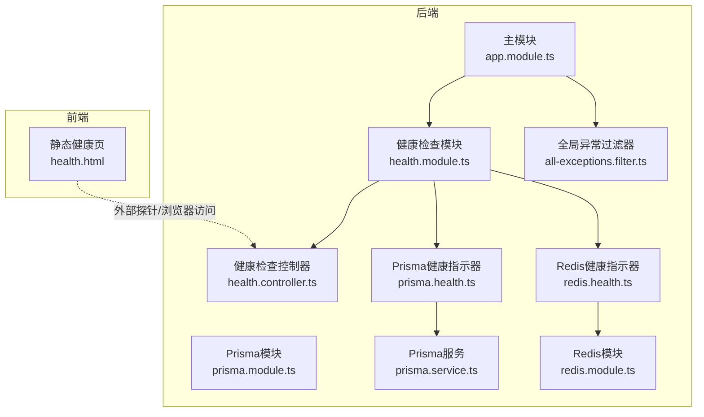
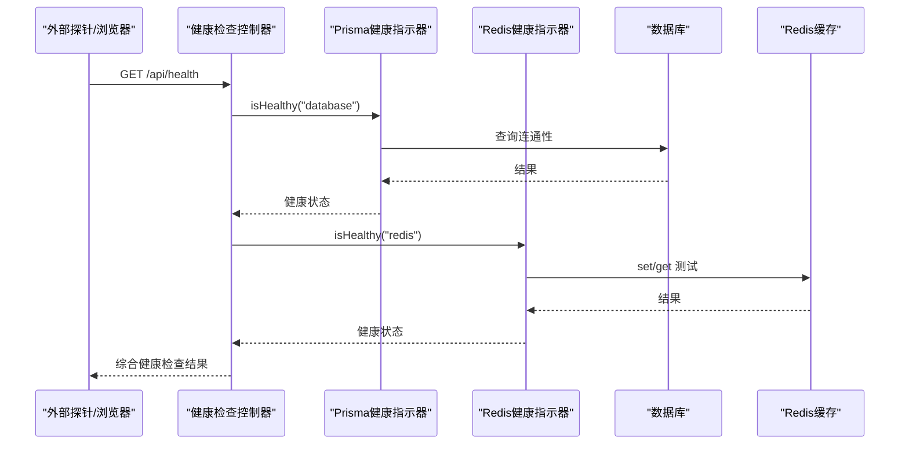
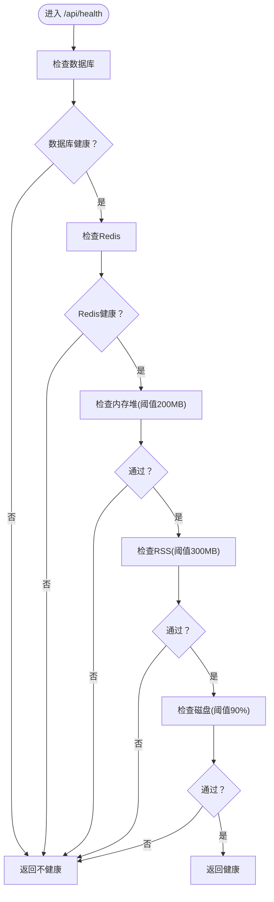
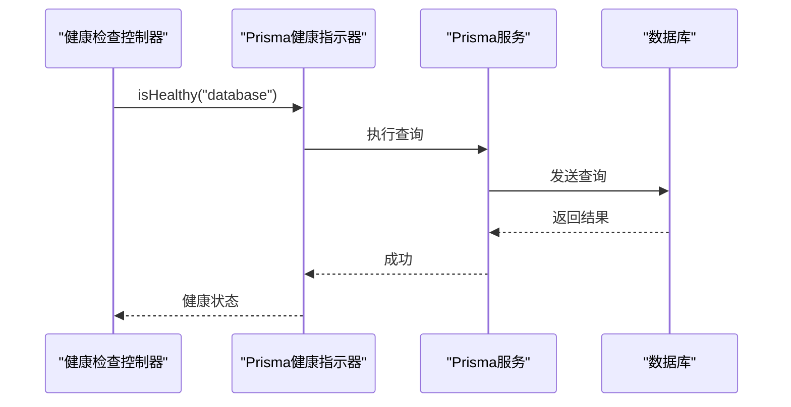
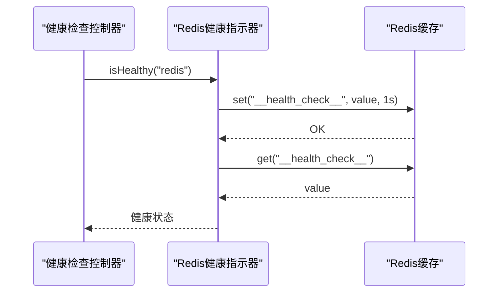
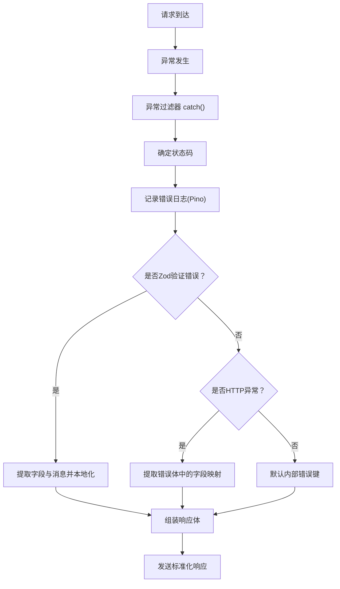
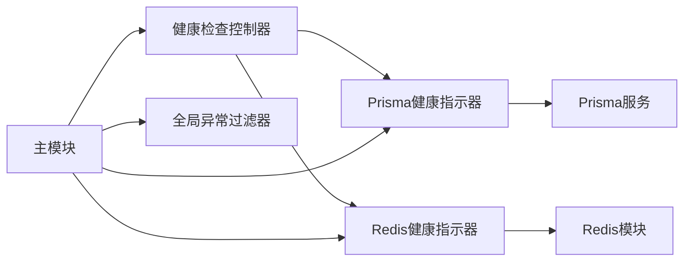

# 健康检查与监控

<cite>
**本文引用的文件**
- [apps/backend/src/health/health.controller.ts](file://apps/backend/src/health/health.controller.ts)
- [apps/backend/src/health/prisma.health.ts](file://apps/backend/src/health/prisma.health.ts)
- [apps/backend/src/redis/redis.health.ts](file://apps/backend/src/redis/redis.health.ts)
- [apps/backend/src/redis/redis.module.ts](file://apps/backend/src/redis/redis.module.ts)
- [apps/backend/src/prisma/prisma.module.ts](file://apps/backend/src/prisma/prisma.module.ts)
- [apps/backend/src/prisma/prisma.service.ts](file://apps/backend/src/prisma/prisma.service.ts)
- [apps/backend/src/common/filters/all-exceptions.filter.ts](file://apps/backend/src/common/filters/all-exceptions.filter.ts)
- [apps/backend/src/app.module.ts](file://apps/backend/src/app.module.ts)
- [apps/backend/src/main.ts](file://apps/backend/src/main.ts)
- [apps/frontend/public/health.html](file://apps/frontend/public/health.html)
- [scripts/deploy-app.sh](file://scripts/deploy-app.sh)
- [scripts/dev-bootstrap.sh](file://scripts/dev-bootstrap.sh)
</cite>

## 目录
1. [简介](#简介)
2. [项目结构](#项目结构)
3. [核心组件](#核心组件)
4. [架构总览](#架构总览)
5. [详细组件分析](#详细组件分析)
6. [依赖关系分析](#依赖关系分析)
7. [性能考量](#性能考量)
8. [故障排查指南](#故障排查指南)
9. [结论](#结论)
10. [附录](#附录)

## 简介
本文件面向Lumina健康检查与监控系统，提供从端点配置、服务可用性检测、依赖服务监控到异常过滤、错误日志与告警通知、监控指标与性能分析、故障诊断工具、最佳实践与运维自动化脚本的完整技术文档。系统基于NestJS + Terminus实现健康检查端点，结合Prisma数据库与Redis缓存的专用健康指示器，配合全局异常过滤器与Pino日志模块，形成可观测、可告警、可自愈的健康监控体系。

## 项目结构
后端采用NestJS模块化架构，健康检查相关模块位于apps/backend/src/health，数据库与缓存分别由PrismaModule与RedisModule提供，全局异常过滤器与日志模块在apps/backend/src/common与apps/backend/src/app.module.ts中配置。前端提供静态健康页，便于外部探针或浏览器快速验证服务可用性。

**图表来源**
- [apps/backend/src/app.module.ts:1-175](file://apps/backend/src/app.module.ts#L1-L175)
- [apps/backend/src/health/health.module.ts:1-14](file://apps/backend/src/health/health.module.ts#L1-L14)
- [apps/backend/src/health/health.controller.ts:1-77](file://apps/backend/src/health/health.controller.ts#L1-L77)
- [apps/backend/src/health/prisma.health.ts:1-32](file://apps/backend/src/health/prisma.health.ts#L1-L32)
- [apps/backend/src/redis/redis.health.ts:1-43](file://apps/backend/src/redis/redis.health.ts#L1-L43)
- [apps/backend/src/prisma/prisma.module.ts:1-10](file://apps/backend/src/prisma/prisma.module.ts#L1-L10)
- [apps/backend/src/prisma/prisma.service.ts:1-34](file://apps/backend/src/prisma/prisma.service.ts#L1-L34)
- [apps/backend/src/redis/redis.module.ts:1-84](file://apps/backend/src/redis/redis.module.ts#L1-L84)
- [apps/frontend/public/health.html:1-11](file://apps/frontend/public/health.html#L1-L11)

**章节来源**
- [apps/backend/src/app.module.ts:1-175](file://apps/backend/src/app.module.ts#L1-L175)
- [apps/backend/src/health/health.module.ts:1-14](file://apps/backend/src/health/health.module.ts#L1-L14)
- [apps/frontend/public/health.html:1-11](file://apps/frontend/public/health.html#L1-L11)

## 核心组件
- 健康检查控制器：提供综合健康检查、存活探针与就绪探针端点，组合Prisma与Redis健康指示器及内存、磁盘指标。
- Prisma健康指示器：通过一次轻量查询验证数据库连通性，失败时抛出健康检查错误。
- Redis健康指示器：通过写入/读取测试键验证缓存连通性与一致性，失败时抛出健康检查错误。
- 全局异常过滤器：统一捕获未处理异常，输出结构化错误响应，记录错误日志并支持国际化。
- 日志与安全：Pino日志模块按状态码动态调整日志级别；CSRF防护与XSS清理中间件保护非GET请求。
- 前端静态健康页：简单HTML页面，便于外部探针或浏览器快速验证服务可用性。

**章节来源**
- [apps/backend/src/health/health.controller.ts:1-77](file://apps/backend/src/health/health.controller.ts#L1-L77)
- [apps/backend/src/health/prisma.health.ts:1-32](file://apps/backend/src/health/prisma.health.ts#L1-L32)
- [apps/backend/src/redis/redis.health.ts:1-43](file://apps/backend/src/redis/redis.health.ts#L1-L43)
- [apps/backend/src/common/filters/all-exceptions.filter.ts:1-137](file://apps/backend/src/common/filters/all-exceptions.filter.ts#L1-L137)
- [apps/backend/src/app.module.ts:34-88](file://apps/backend/src/app.module.ts#L34-L88)
- [apps/backend/src/main.ts:115-157](file://apps/backend/src/main.ts#L115-L157)
- [apps/frontend/public/health.html:1-11](file://apps/frontend/public/health.html#L1-L11)

## 架构总览
系统通过NestJS模块装配健康检查、数据库与缓存模块，控制器聚合多个健康指标，异常过滤器统一处理错误，日志模块记录请求与错误信息，前端静态页辅助外部探针验证。

**图表来源**
- [apps/backend/src/health/health.controller.ts:31-51](file://apps/backend/src/health/health.controller.ts#L31-L51)
- [apps/backend/src/health/prisma.health.ts:19-30](file://apps/backend/src/health/prisma.health.ts#L19-L30)
- [apps/backend/src/redis/redis.health.ts:20-41](file://apps/backend/src/redis/redis.health.ts#L20-L41)

## 详细组件分析

### 健康检查控制器
- 综合健康检查：聚合数据库、缓存、内存堆与RSS、磁盘使用率检查，阈值分别为200MB、300MB、90%。
- 存活探针：返回固定结构的健康信息，适合Kubernetes liveness probe。
- 就绪探针：仅检查数据库与缓存，适合Kubernetes readiness probe。

**图表来源**
- [apps/backend/src/health/health.controller.ts:31-51](file://apps/backend/src/health/health.controller.ts#L31-L51)

**章节来源**
- [apps/backend/src/health/health.controller.ts:27-76](file://apps/backend/src/health/health.controller.ts#L27-L76)

### Prisma健康指示器
- 实现原理：执行一次轻量查询验证数据库连通性；成功返回健康状态，异常则抛出健康检查错误并附带错误信息。
- 关键点：使用PrismaService的原生查询能力，避免复杂业务逻辑对健康检查的影响。

**图表来源**
- [apps/backend/src/health/prisma.health.ts:19-30](file://apps/backend/src/health/prisma.health.ts#L19-L30)
- [apps/backend/src/prisma/prisma.service.ts:17-21](file://apps/backend/src/prisma/prisma.service.ts#L17-L21)

**章节来源**
- [apps/backend/src/health/prisma.health.ts:15-30](file://apps/backend/src/health/prisma.health.ts#L15-L30)
- [apps/backend/src/prisma/prisma.service.ts:10-21](file://apps/backend/src/prisma/prisma.service.ts#L10-L21)

### Redis健康指示器
- 实现原理：通过写入/读取测试键验证缓存连通性与一致性；成功返回健康状态，异常则抛出健康检查错误并附带错误信息。
- 关键点：测试键短生命周期，避免污染生产数据；异常路径包含明确的错误消息。

**图表来源**
- [apps/backend/src/redis/redis.health.ts:20-41](file://apps/backend/src/redis/redis.health.ts#L20-L41)

**章节来源**
- [apps/backend/src/redis/redis.health.ts:16-41](file://apps/backend/src/redis/redis.health.ts#L16-L41)

### 异常过滤器与错误日志
- 统一异常处理：捕获所有未处理异常，区分HTTP状态码与业务异常，输出结构化响应体。
- 国际化支持：基于I18n上下文对错误消息与字段名进行本地化。
- 日志记录：使用Pino记录请求与错误详情，按状态码调整日志级别，排除健康检查端点的自动日志。
- CSRF防护：拦截缺少特定头部的非GET请求，返回安全错误响应。

**图表来源**
- [apps/backend/src/common/filters/all-exceptions.filter.ts:27-135](file://apps/backend/src/common/filters/all-exceptions.filter.ts#L27-L135)
- [apps/backend/src/app.module.ts:34-88](file://apps/backend/src/app.module.ts#L34-L88)
- [apps/backend/src/main.ts:115-157](file://apps/backend/src/main.ts#L115-L157)

**章节来源**
- [apps/backend/src/common/filters/all-exceptions.filter.ts:12-137](file://apps/backend/src/common/filters/all-exceptions.filter.ts#L12-L137)
- [apps/backend/src/app.module.ts:34-88](file://apps/backend/src/app.module.ts#L34-L88)
- [apps/backend/src/main.ts:115-157](file://apps/backend/src/main.ts#L115-L157)

### 前端静态健康页
- 用途：提供简单HTML页面，便于外部探针或浏览器快速验证服务可用性。
- 访问路径：/health.html（由静态资源插件注册）。

**章节来源**
- [apps/frontend/public/health.html:1-11](file://apps/frontend/public/health.html#L1-L11)
- [apps/backend/src/main.ts:72-79](file://apps/backend/src/main.ts#L72-L79)

## 依赖关系分析
- 模块耦合：HealthModule导入TerminusModule与PrismaModule，并注入PrismaHealthIndicator与RedisHealthIndicator；HealthController依赖HealthCheckService与两个健康指示器。
- 外部依赖：PrismaService基于PostgreSQL连接池；RedisModule基于ioredis yet的cache-manager实现；BullMQ队列共享Redis连接。
- 安全与日志：LoggerModule使用Pino；CSRF与XSS防护通过Fastify插件实现；全局拦截器统一响应格式。

**图表来源**
- [apps/backend/src/health/health.controller.ts:19-25](file://apps/backend/src/health/health.controller.ts#L19-L25)
- [apps/backend/src/health/health.module.ts:8-13](file://apps/backend/src/health/health.module.ts#L8-L13)
- [apps/backend/src/prisma/prisma.service.ts:17-21](file://apps/backend/src/prisma/prisma.service.ts#L17-L21)
- [apps/backend/src/redis/redis.module.ts:46-76](file://apps/backend/src/redis/redis.module.ts#L46-L76)
- [apps/backend/src/app.module.ts:149-151](file://apps/backend/src/app.module.ts#L149-L151)

**章节来源**
- [apps/backend/src/health/health.module.ts:1-14](file://apps/backend/src/health/health.module.ts#L1-L14)
- [apps/backend/src/app.module.ts:149-151](file://apps/backend/src/app.module.ts#L149-L151)

## 性能考量
- 健康检查开销：数据库与缓存检查均为轻量操作，避免对生产流量造成影响；磁盘与内存检查为系统级指标，频率建议由探针控制。
- 日志级别：按状态码动态调整日志级别，减少高并发下的日志噪声；排除健康检查端点的自动日志，降低I/O压力。
- 缓存连接：Redis连接具备重试策略与就绪检查，避免瞬时故障导致的误报；TTL与键前缀可按需配置。
- 请求安全：CSRF与XSS防护在非GET请求上生效，减少恶意请求对系统的冲击。

[本节为通用性能建议，无需具体文件引用]

## 故障排查指南
- 健康检查失败
  - 数据库：确认DATABASE_URL环境变量正确，检查PrismaService连接池初始化与$connect/$disconnect流程。
  - 缓存：确认Redis连接参数（host/port/password/db/keyPrefix），查看RedisModule的连接日志与重试策略。
- 异常与错误响应
  - 查看Pino日志中错误堆栈与请求上下文；检查全局异常过滤器对Zod验证错误与业务异常的处理分支。
  - 若出现CSRF拦截，检查客户端是否正确携带X-Requested-With头部。
- 健康页访问
  - 前端静态健康页可用于快速验证服务可用性；若无法访问，检查静态资源插件注册与路由前缀。

**章节来源**
- [apps/backend/src/prisma/prisma.service.ts:10-32](file://apps/backend/src/prisma/prisma.service.ts#L10-L32)
- [apps/backend/src/redis/redis.module.ts:32-76](file://apps/backend/src/redis/redis.module.ts#L32-L76)
- [apps/backend/src/common/filters/all-exceptions.filter.ts:37-45](file://apps/backend/src/common/filters/all-exceptions.filter.ts#L37-L45)
- [apps/backend/src/main.ts:134-156](file://apps/backend/src/main.ts#L134-L156)
- [apps/frontend/public/health.html:1-11](file://apps/frontend/public/health.html#L1-L11)

## 结论
Lumina健康检查与监控体系通过Terminus与自定义健康指示器实现了数据库与缓存的可靠检测，结合全局异常过滤器与Pino日志模块，提供了统一的错误处理与可观测性基础。配合前端静态健康页与CSRF/XSS防护，系统在可用性、安全性与可维护性方面达到良好平衡。建议在生产环境中结合探针策略与告警规则，持续优化阈值与日志级别，提升故障发现与恢复效率。

[本节为总结性内容，无需具体文件引用]

## 附录

### 健康检查端点一览
- 综合健康检查：GET /api/health
- 存活探针：GET /api/health/liveness
- 就绪探针：GET /api/health/readiness
- 前端健康页：/health.html

**章节来源**
- [apps/backend/src/health/health.controller.ts:31-75](file://apps/backend/src/health/health.controller.ts#L31-L75)
- [apps/frontend/public/health.html:1-11](file://apps/frontend/public/health.html#L1-L11)

### 监控与告警建议
- 指标采集：结合探针对存活/就绪端点的成功率与延迟进行统计。
- 告警规则：针对数据库与缓存不可用、内存/RSS超阈、磁盘空间不足设置分级告警。
- 日志分析：利用Pino日志结构化字段进行错误趋势分析与根因定位。

[本节为通用建议，无需具体文件引用]

### 运维自动化脚本
- 部署脚本：将Wails应用复制到/Applications并启动，适用于macOS环境。
- 开发引导脚本：在容器或CI环境中安装依赖、构建共享包与生成Prisma客户端，支持缓存与并发锁。

**章节来源**
- [scripts/deploy-app.sh:1-66](file://scripts/deploy-app.sh#L1-L66)
- [scripts/dev-bootstrap.sh:1-151](file://scripts/dev-bootstrap.sh#L1-L151)