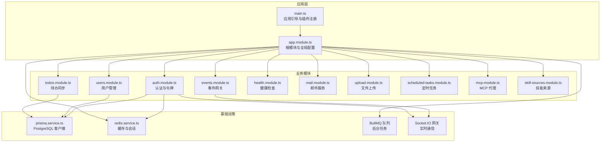
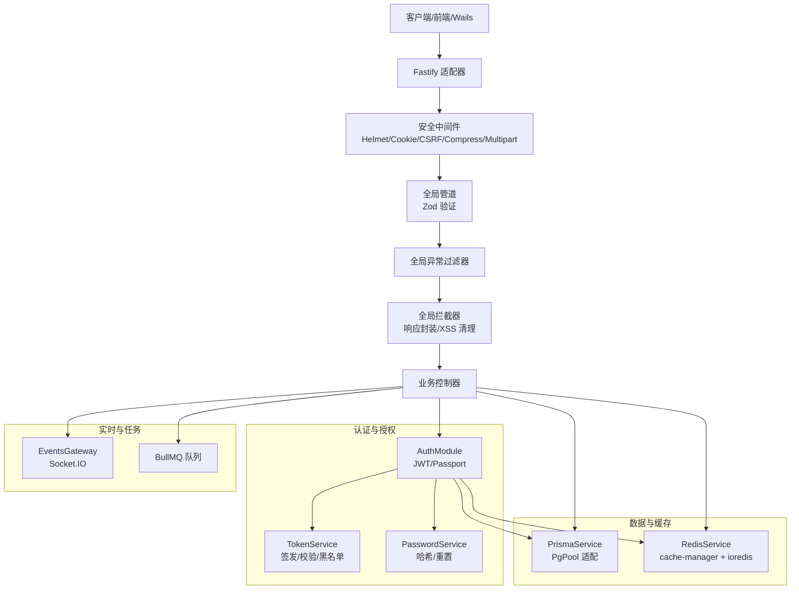
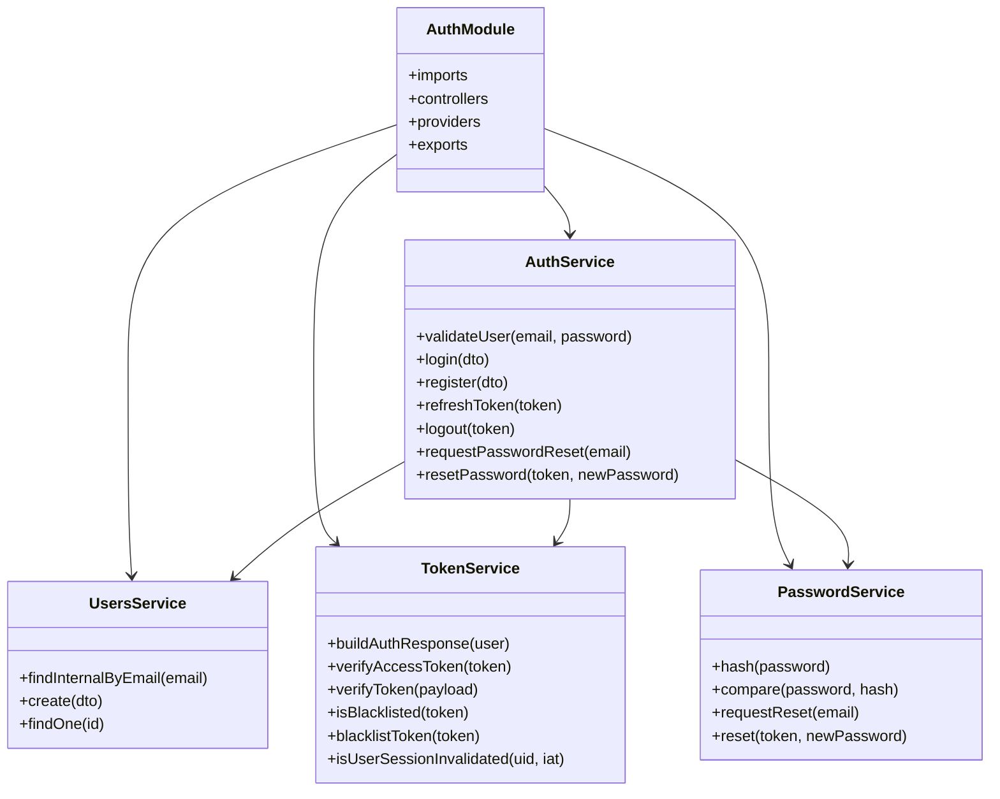
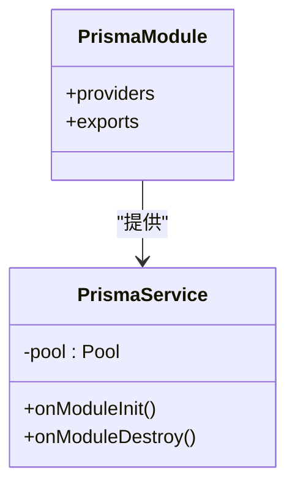
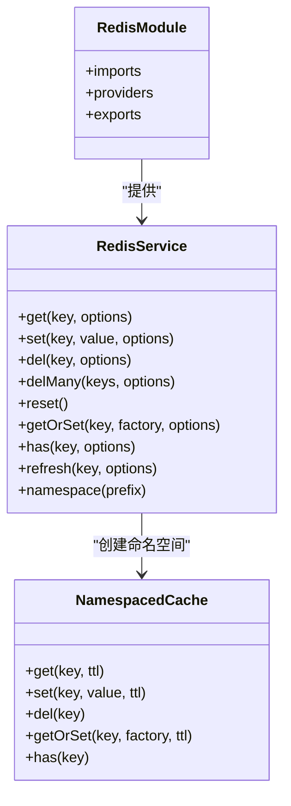
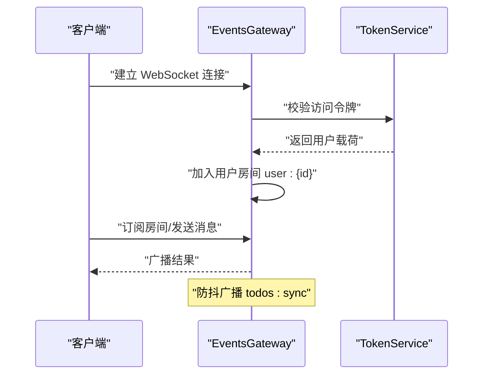
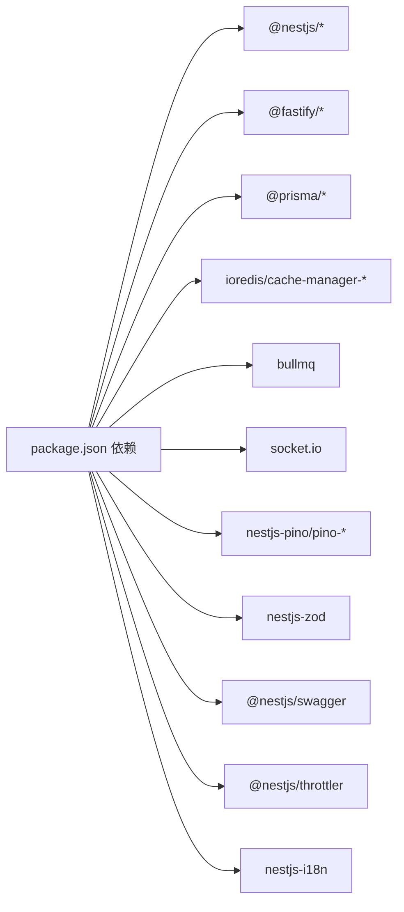

# 后端系统

<cite>
**本文引用的文件**
- [apps/backend/src/app.module.ts](file://apps/backend/src/app.module.ts)
- [apps/backend/src/main.ts](file://apps/backend/src/main.ts)
- [apps/backend/package.json](file://apps/backend/package.json)
- [apps/backend/prisma.config.js](file://apps/backend/prisma.config.js)
- [apps/backend/nest-cli.json](file://apps/backend/nest-cli.json)
- [apps/backend/src/auth/auth.module.ts](file://apps/backend/src/auth/auth.module.ts)
- [apps/backend/src/users/users.module.ts](file://apps/backend/src/users/users.module.ts)
- [apps/backend/src/prisma/prisma.module.ts](file://apps/backend/src/prisma/prisma.module.ts)
- [apps/backend/src/prisma/prisma.service.ts](file://apps/backend/src/prisma/prisma.service.ts)
- [apps/backend/src/redis/redis.module.ts](file://apps/backend/src/redis/redis.module.ts)
- [apps/backend/src/redis/redis.service.ts](file://apps/backend/src/redis/redis.service.ts)
- [apps/backend/src/events/events.module.ts](file://apps/backend/src/events/events.module.ts)
- [apps/backend/src/events/events.gateway.ts](file://apps/backend/src/events/events.gateway.ts)
- [apps/backend/src/auth/auth.service.ts](file://apps/backend/src/auth/auth.service.ts)
- [apps/backend/src/common/interceptors/transform.interceptor.ts](file://apps/backend/src/common/interceptors/transform.interceptor.ts)
</cite>

## 目录
1. [简介](#简介)
2. [项目结构](#项目结构)
3. [核心组件](#核心组件)
4. [架构总览](#架构总览)
5. [详细组件分析](#详细组件分析)
6. [依赖关系分析](#依赖关系分析)
7. [性能考量](#性能考量)
8. [故障排查指南](#故障排查指南)
9. [结论](#结论)
10. [附录](#附录)

## 简介
本文件为 Lumina 后端系统的全面技术文档，面向企业级 NestJS 应用架构，覆盖模块化设计、依赖注入、中间件与拦截器、认证授权（JWT、Passport 策略）、用户与权限模型、Prisma ORM 配置与事务、Redis 缓存与会话、事件驱动与 WebSocket 实时通信、BullMQ 任务调度、健康检查、异常处理、日志与监控等运维主题。文档力求在深入技术细节的同时保持可读性，帮助开发者快速理解并扩展系统。

## 项目结构
后端采用多包工作区结构，核心应用位于 apps/backend，使用 NestJS + Fastify 作为运行时，结合 Prisma、Redis、BullMQ、Socket.IO 等基础设施，提供认证、用户、文件上传、待办同步、实时事件、定时任务等能力。

图表来源
- [apps/backend/src/main.ts:34-195](file://apps/backend/src/main.ts#L34-L195)
- [apps/backend/src/app.module.ts:27-161](file://apps/backend/src/app.module.ts#L27-L161)

章节来源
- [apps/backend/src/main.ts:34-195](file://apps/backend/src/main.ts#L34-L195)
- [apps/backend/src/app.module.ts:27-161](file://apps/backend/src/app.module.ts#L27-L161)

## 核心组件
- 应用引导与安全中间件：Fastify 适配器、Helmet 安全头、CORS、CSRF 防护、压缩、静态资源、Zod 验证管道、全局异常过滤器、响应拦截器。
- 根模块与全局配置：日志（Pino）、事件发射器、队列（BullMQ）、速率限制（Throttler）、国际化（I18n）、数据库（Prisma）、缓存（Redis）、健康检查、认证、用户、邮件、事件、上传、定时任务、MCP、技能来源。
- 认证与授权：Passport JWT 策略、JWT 签发与校验、刷新令牌、登出黑名单、密码服务。
- 数据层：PrismaClient + PgPool 适配，连接池、优雅关闭、事务支持。
- 缓存与会话：Redis 缓存、命名空间、TTL、穿透保护、连接重试与断开。
- 实时通信：Socket.IO 网关、CORS 白名单、鉴权中间件、房间与广播、去抖广播。
- 任务调度：BullMQ 队列、默认作业选项、指数退避、完成/失败清理策略。
- 健康检查：Terminus 集成、Prisma 健康探针。
- 国际化与文档：i18n loader、Swagger 文档生成与清理。

章节来源
- [apps/backend/src/main.ts:34-195](file://apps/backend/src/main.ts#L34-L195)
- [apps/backend/src/app.module.ts:27-161](file://apps/backend/src/app.module.ts#L27-L161)
- [apps/backend/src/auth/auth.module.ts:19-39](file://apps/backend/src/auth/auth.module.ts#L19-L39)
- [apps/backend/src/prisma/prisma.service.ts:6-33](file://apps/backend/src/prisma/prisma.service.ts#L6-L33)
- [apps/backend/src/redis/redis.service.ts:51-202](file://apps/backend/src/redis/redis.service.ts#L51-L202)
- [apps/backend/src/events/events.gateway.ts:57-116](file://apps/backend/src/events/events.gateway.ts#L57-L116)

## 架构总览
系统采用“根模块聚合 + 子模块解耦”的模块化架构，通过依赖注入实现松耦合；全局中间件与拦截器保证一致的安全与响应格式；认证模块负责 JWT 生命周期与会话失效控制；数据访问通过 Prisma 统一抽象；缓存与队列分别支撑性能与异步任务；Socket.IO 提供实时事件通道；健康检查与日志保障可观测性。

图表来源
- [apps/backend/src/main.ts:34-195](file://apps/backend/src/main.ts#L34-L195)
- [apps/backend/src/auth/auth.module.ts:19-39](file://apps/backend/src/auth/auth.module.ts#L19-L39)
- [apps/backend/src/prisma/prisma.service.ts:6-33](file://apps/backend/src/prisma/prisma.service.ts#L6-L33)
- [apps/backend/src/redis/redis.service.ts:51-202](file://apps/backend/src/redis/redis.service.ts#L51-L202)
- [apps/backend/src/events/events.gateway.ts:57-116](file://apps/backend/src/events/events.gateway.ts#L57-L116)

## 详细组件分析

### 认证与授权模块（JWT + Passport）
- 模块组成：AuthModule 引入 Passport/JWT、Prisma、Redis、Mail、Users，并导出服务与策略。
- 策略与令牌：使用 JWT 策略进行访问令牌校验；TokenService 负责签发、验证、刷新令牌与黑名单；PasswordService 负责密码哈希与重置流程。
- 登录/注册/刷新/登出：AuthService 作为门面整合用户查询、密码校验、令牌构建与黑名单写入；刷新令牌时检查类型、用户存在性与会话失效标记；登出尝试写入黑名单并忽略失败以保证幂等。
- 会话失效控制：通过“用户会话失效时间戳”与令牌签发时间组合，拒绝过期会话。

图表来源
- [apps/backend/src/auth/auth.module.ts:19-39](file://apps/backend/src/auth/auth.module.ts#L19-L39)
- [apps/backend/src/auth/auth.service.ts:13-126](file://apps/backend/src/auth/auth.service.ts#L13-L126)

章节来源
- [apps/backend/src/auth/auth.module.ts:19-39](file://apps/backend/src/auth/auth.module.ts#L19-L39)
- [apps/backend/src/auth/auth.service.ts:13-126](file://apps/backend/src/auth/auth.service.ts#L13-L126)

### 用户管理模块
- 依赖关系：UsersModule 引用 AuthModule，形成循环依赖使用 forwardRef。
- 职责边界：UsersService 负责用户 CRUD 与内部查询；AuthModule 通过 UsersService 完成认证与注册流程。
- 扩展建议：可在 UsersModule 下新增权限/角色相关服务与守卫，配合全局守卫实现细粒度权限控制。

章节来源
- [apps/backend/src/users/users.module.ts:6-12](file://apps/backend/src/users/users.module.ts#L6-L12)

### 数据库与 ORM（Prisma）
- 客户端与连接池：PrismaService 继承 PrismaClient，使用 PrismaPg + pg.Pool 建立连接池；构造函数读取 DATABASE_URL 并在 onModuleInit/onModuleDestroy 中完成连接与释放。
- 配置文件：prisma.config.js 指定 schema、datasource.url、迁移目录，支持 .env 注入。
- 事务与查询：Prisma 支持事务块与原生 SQL；建议在需要强一致性的场景使用事务包裹多表写入。

图表来源
- [apps/backend/src/prisma/prisma.service.ts:6-33](file://apps/backend/src/prisma/prisma.service.ts#L6-L33)
- [apps/backend/src/prisma/prisma.module.ts:4-9](file://apps/backend/src/prisma/prisma.module.ts#L4-L9)

章节来源
- [apps/backend/src/prisma/prisma.service.ts:6-33](file://apps/backend/src/prisma/prisma.service.ts#L6-L33)
- [apps/backend/prisma.config.js:13-21](file://apps/backend/prisma.config.js#L13-L21)

### 缓存与会话（Redis）
- 模块配置：RedisModule 使用 cache-manager-ioredis-yet，支持 host/port/password/db/keyPrefix、连接重试策略、ready 检查与 TTL。
- 服务能力：RedisService 提供 get/set/del/delMany/reset、getOrSet（缓存穿透保护）、has、refresh、命名空间 NamespacedCache、模块销毁时断开连接。
- 使用建议：对热点查询、会话状态、限流计数、临时数据采用不同前缀与 TTL；敏感会话可启用黑名单与失效时间戳。

图表来源
- [apps/backend/src/redis/redis.module.ts:26-83](file://apps/backend/src/redis/redis.module.ts#L26-L83)
- [apps/backend/src/redis/redis.service.ts:51-202](file://apps/backend/src/redis/redis.service.ts#L51-L202)

章节来源
- [apps/backend/src/redis/redis.module.ts:26-83](file://apps/backend/src/redis/redis.module.ts#L26-L83)
- [apps/backend/src/redis/redis.service.ts:51-202](file://apps/backend/src/redis/redis.service.ts#L51-L202)

### 实时通信（WebSocket + Socket.IO）
- 网关配置：EventsGateway 支持 CORS 白名单、传输协议、命名空间；鉴权中间件从握手头/参数提取令牌并校验；连接后自动加入用户房间 user:{id}。
- 房间与广播：支持 join/leave、房间内广播、向所有客户端广播；提供后端防抖广播（todos:sync），避免频繁事件风暴。
- 权限控制：ensureOwnRoomAccess 确保用户只能进入自己的房间；WsException 控制未授权访问。

图表来源
- [apps/backend/src/events/events.gateway.ts:86-202](file://apps/backend/src/events/events.gateway.ts#L86-L202)

章节来源
- [apps/backend/src/events/events.gateway.ts:57-116](file://apps/backend/src/events/events.gateway.ts#L57-L116)
- [apps/backend/src/events/events.gateway.ts:126-202](file://apps/backend/src/events/events.gateway.ts#L126-L202)

### 任务调度（BullMQ）
- 队列配置：BullModule.forRootAsync 通过 Redis 连接配置；默认作业选项包含完成清理、失败保留、重试次数与指数退避。
- 使用建议：将耗时任务（如邮件发送、报表生成、外部同步）放入队列；为关键任务设置超时与死信处理；监控队列积压与失败率。

章节来源
- [apps/backend/src/app.module.ts:96-115](file://apps/backend/src/app.module.ts#L96-L115)

### 健康检查与可观测性
- 健康检查：HealthModule 集成 Terminus 与 Prisma 健康探针，提供 liveness/readiness。
- 日志：LoggerModule 使用 Pino，区分生产/开发输出格式，自定义日志级别与序列化器；全局拦截器统一响应格式。
- 监控：建议结合队列统计、Redis 命中率、数据库慢查询、WebSocket 连接数与事件吞吐进行指标采集。

章节来源
- [apps/backend/src/app.module.ts:89-148](file://apps/backend/src/app.module.ts#L89-L148)
- [apps/backend/src/common/interceptors/transform.interceptor.ts:18-29](file://apps/backend/src/common/interceptors/transform.interceptor.ts#L18-L29)

## 依赖关系分析
- 运行时与工具：Fastify、@fastify/* 插件、nestjs-pino、nestjs-zod、@nestjs/swagger、@nestjs/throttler、@nestjs/event-emitter、@nestjs/bullmq、@nestjs/websockets/socket.io、@prisma/client、pg、ioredis、cache-manager-ioredis-yet。
- 构建与脚本：Nest CLI、TypeScript、ESLint、Vitest、Prisma 命令。
- 配置：package.json 脚本、nest-cli.json、prisma.config.js。

图表来源
- [apps/backend/package.json:30-85](file://apps/backend/package.json#L30-L85)

章节来源
- [apps/backend/package.json:30-85](file://apps/backend/package.json#L30-L85)
- [apps/backend/nest-cli.json:5-9](file://apps/backend/nest-cli.json#L5-L9)

## 性能考量
- 请求路径与安全：Helmet、CSRF 防护、XSS 清理、Gzip 压缩、静态资源托管减少网络往返。
- 数据访问：Prisma PgPool 连接池与连接生命周期管理；对热点查询使用 Redis 缓存与 getOrSet 穿透保护；批量删除使用 delMany 并发执行。
- 实时通信：房间广播与全局广播分离；todos:sync 广播采用 500ms 防抖，降低事件风暴。
- 任务处理：BullMQ 默认清理策略与指数退避，避免失败任务堆积；建议按优先级与队列隔离。
- 日志与可观测：Pino 结构化日志，按状态码动态日志级别，便于定位问题。

## 故障排查指南
- 启动失败：检查 DATABASE_URL、REDIS_* 环境变量；确认 Prisma 初始化与 PgPool 连接；查看 Pino 启动日志。
- 认证失败：核对 JWT_SECRET、令牌签名与过期时间；检查 TokenService 的黑名单与会话失效逻辑；确认 Passport/JWT 策略注册。
- WebSocket 连接被拒：检查 CORS 白名单与 Origin 规则；确认握手头中携带有效令牌；查看网关日志与 WsException。
- 缓存异常：关注 Redis 连接重试与断开日志；检查 keyPrefix 与 TTL；必要时使用 reset 清理测试数据。
- 队列积压：监控作业完成/失败率；调整退避策略与并发；检查消费者处理耗时。
- API 响应异常：确认全局拦截器与异常过滤器是否生效；检查 Zod 验证错误与字段映射。

章节来源
- [apps/backend/src/main.ts:144-156](file://apps/backend/src/main.ts#L144-L156)
- [apps/backend/src/redis/redis.service.ts:58-74](file://apps/backend/src/redis/redis.service.ts#L58-L74)
- [apps/backend/src/events/events.gateway.ts:86-116](file://apps/backend/src/events/events.gateway.ts#L86-L116)

## 结论
Lumina 后端系统以 NestJS 为核心，结合 Fastify、Prisma、Redis、Socket.IO、BullMQ 等技术栈，构建了高可用、可观测、可扩展的企业级应用骨架。通过模块化设计与依赖注入，实现了清晰的职责边界；通过全局中间件与拦截器，统一了安全与响应格式；通过认证授权、缓存与队列，兼顾了性能与可靠性；通过健康检查与日志，保障了运维效率。建议后续在权限模型、审计日志、指标埋点与容灾演练方面持续完善。

## 附录
- 开发与部署：使用 Nest CLI 与 TypeScript；Docker 环境需监听 0.0.0.0；PM2 配置见 ecosystem.config.js；Prisma 命令行用于生成、迁移与 Studio。
- 国际化：i18n loader 从 i18n 目录加载语言包，支持请求头与 Accept-Language 解析。
- Swagger：Zod Schema 生成的 OpenAPI 文档经 cleanupOpenApiDoc 处理后展示。

章节来源
- [apps/backend/package.json:7-29](file://apps/backend/package.json#L7-L29)
- [apps/backend/src/app.module.ts:139-148](file://apps/backend/src/app.module.ts#L139-L148)
- [apps/backend/src/main.ts:171-180](file://apps/backend/src/main.ts#L171-L180)