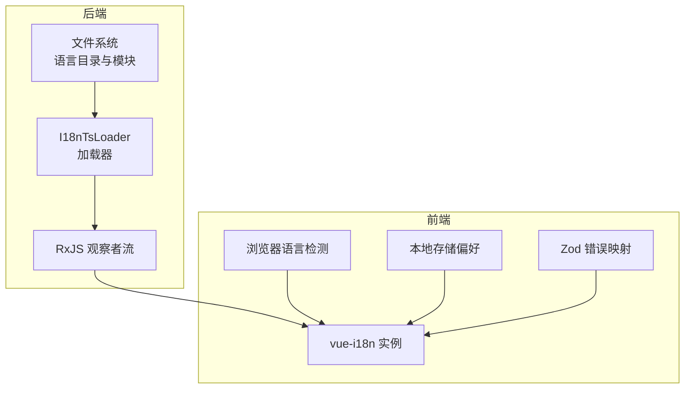
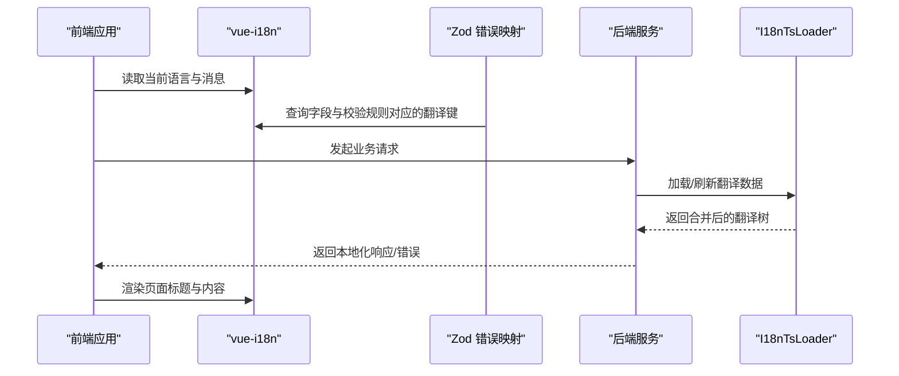
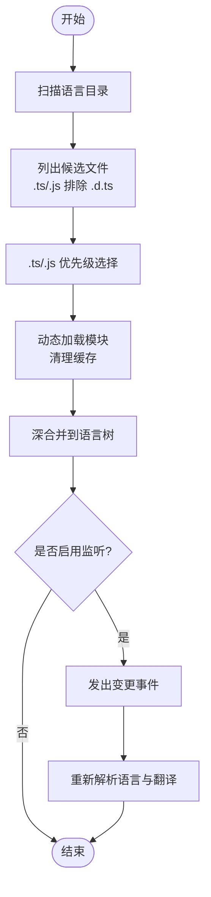
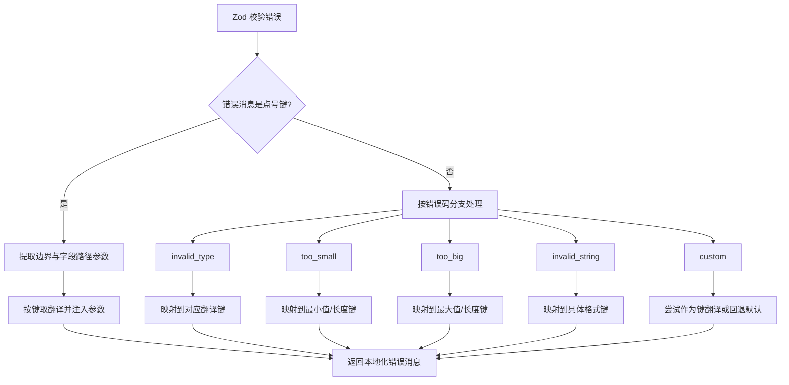

# 国际化

<cite>
**本文引用的文件**
- [apps/backend/src/i18n/i18n-ts.loader.ts](file://apps/backend/src/i18n/i18n-ts.loader.ts)
- [apps/backend/src/i18n/en-US/auth.ts](file://apps/backend/src/i18n/en-US/auth.ts)
- [apps/backend/src/i18n/zh-CN/auth.ts](file://apps/backend/src/i18n/zh-CN/auth.ts)
- [apps/frontend/src/i18n/index.ts](file://apps/frontend/src/i18n/index.ts)
- [apps/frontend/src/i18n/locales/en-US/index.ts](file://apps/frontend/src/i18n/locales/en-US/index.ts)
- [apps/frontend/src/i18n/locales/zh-CN/index.ts](file://apps/frontend/src/i18n/locales/zh-CN/index.ts)
- [apps/frontend/src/i18n/locales/en-US/validation.ts](file://apps/frontend/src/i18n/locales/en-US/validation.ts)
- [apps/frontend/src/i18n/locales/zh-CN/validation.ts](file://apps/frontend/src/i18n/locales/zh-CN/validation.ts)
- [apps/frontend/src/lib/zod-i18n.ts](file://apps/frontend/src/lib/zod-i18n.ts)
- [apps/backend/tests/i18n/i18n-ts-loader.spec.ts](file://apps/backend/tests/i18n/i18n-ts-loader.spec.ts)
- [apps/frontend/tests/router/index.spec.ts](file://apps/frontend/tests/router/index.spec.ts)
- [apps/frontend/src/router/index.ts](file://apps/frontend/src/router/index.ts)
</cite>

## 目录
1. [简介](#简介)
2. [项目结构](#项目结构)
3. [核心组件](#核心组件)
4. [架构总览](#架构总览)
5. [详细组件分析](#详细组件分析)
6. [依赖关系分析](#依赖关系分析)
7. [性能考量](#性能考量)
8. [故障排查指南](#故障排查指南)
9. [结论](#结论)
10. [附录](#附录)

## 简介
本文件面向 Lumina 的国际化（i18n）系统，围绕后端 nestjs-i18n 的 TypeScript 加载器、前端 vue-i18n 的消息源与 Zod 错误映射，系统性阐述以下主题：
- i18n-ts 加载器配置与实现细节
- 多语言资源组织与翻译键值管理
- 上下文相关翻译与参数化占位符
- 前后端语言同步与默认语言回退策略
- 动态语言切换机制与热更新能力
- 语言检测逻辑与区域设置处理
- 文本格式化与路由标题国际化
- 翻译最佳实践、性能优化与维护指南

## 项目结构
Lumina 的国际化由前后端两部分协同完成：
- 后端：基于 nestjs-i18n 的自定义 I18nTsLoader，从文件系统按语言目录加载 TS/JS 模块并合并为树形翻译节点，支持监听变更以实现热更新。
- 前端：基于 vue-i18n 的本地化配置，按模块拆分翻译键，提供浏览器语言检测与本地存储偏好回退；通过 Zod 错误映射将表单校验错误与翻译键绑定。



图表来源
- [apps/backend/src/i18n/i18n-ts.loader.ts:86-184](file://apps/backend/src/i18n/i18n-ts.loader.ts#L86-L184)
- [apps/frontend/src/i18n/index.ts:12-36](file://apps/frontend/src/i18n/index.ts#L12-L36)
- [apps/frontend/src/lib/zod-i18n.ts:18-95](file://apps/frontend/src/lib/zod-i18n.ts#L18-L95)

章节来源
- [apps/backend/src/i18n/i18n-ts.loader.ts:1-184](file://apps/backend/src/i18n/i18n-ts.loader.ts#L1-L184)
- [apps/frontend/src/i18n/index.ts:1-37](file://apps/frontend/src/i18n/index.ts#L1-L37)

## 核心组件
- 后端 I18nTsLoader：负责扫描语言目录、解析 TS/JS 模块、深合并翻译节点、可选的文件变更监听与热更新。
- 前端 vue-i18n：集中管理消息源、默认语言与回退语言、浏览器与本地存储偏好检测。
- Zod 错误映射：将 Zod 校验错误码映射到翻译键，并支持字段路径与参数注入。

章节来源
- [apps/backend/src/i18n/i18n-ts.loader.ts:86-184](file://apps/backend/src/i18n/i18n-ts.loader.ts#L86-L184)
- [apps/frontend/src/i18n/index.ts:24-34](file://apps/frontend/src/i18n/index.ts#L24-L34)
- [apps/frontend/src/lib/zod-i18n.ts:18-95](file://apps/frontend/src/lib/zod-i18n.ts#L18-L95)

## 架构总览
后端通过 I18nTsLoader 将文件系统中的翻译模块加载为内存中的树形结构，前端通过 vue-i18n 使用这些消息进行渲染。Zod 错误映射在前端统一拦截校验错误并转为本地化提示。路由守卫根据当前页面元信息动态设置页面标题，标题文案同样来自翻译键。



图表来源
- [apps/frontend/src/router/index.ts:56-70](file://apps/frontend/src/router/index.ts#L56-L70)
- [apps/frontend/src/lib/zod-i18n.ts:18-95](file://apps/frontend/src/lib/zod-i18n.ts#L18-L95)
- [apps/backend/src/i18n/i18n-ts.loader.ts:136-144](file://apps/backend/src/i18n/i18n-ts.loader.ts#L136-L144)

## 详细组件分析

### 后端 i18n-ts 加载器（I18nTsLoader）
- 文件扫描与过滤
  - 递归遍历语言目录，仅接受 .ts/.js 文件，排除 .d.ts 类型。
  - 当同一基础名同时存在 .ts 与 .js 时，优先选择 .js。
- 模块加载与缓存
  - 使用 require 动态加载模块，并清理模块缓存以支持热更新。
  - 默认导出为对象时直接采用，否则返回空对象。
- 深合并策略
  - 对同名键进行递归合并，确保多文件场景下的键覆盖与补全。
- 观察者与热更新
  - 可选启用文件监听，事件触发后重新解析语言列表与翻译树，返回 RxJS 流以供订阅。
- 错误处理
  - 单文件加载失败时记录错误并跳过，不影响其他文件；整体返回空对象以避免中断。



图表来源
- [apps/backend/src/i18n/i18n-ts.loader.ts:31-75](file://apps/backend/src/i18n/i18n-ts.loader.ts#L31-L75)
- [apps/backend/src/i18n/i18n-ts.loader.ts:146-156](file://apps/backend/src/i18n/i18n-ts.loader.ts#L146-L156)
- [apps/backend/src/i18n/i18n-ts.loader.ts:163-183](file://apps/backend/src/i18n/i18n-ts.loader.ts#L163-L183)

章节来源
- [apps/backend/src/i18n/i18n-ts.loader.ts:1-184](file://apps/backend/src/i18n/i18n-ts.loader.ts#L1-L184)
- [apps/backend/tests/i18n/i18n-ts-loader.spec.ts:1-101](file://apps/backend/tests/i18n/i18n-ts-loader.spec.ts#L1-L101)

### 前端 vue-i18n 配置与语言检测
- 语言检测顺序
  - 优先读取本地存储键值；若无则使用浏览器语言；中文环境默认 zh-CN，其余默认 en-US。
- 消息源与回退
  - 同时注册 zh-CN、en-US 以及 zh/en 简写形式，fallbackLocale 设为 zh-CN，保证键缺失时有稳定回退。
- 类型安全
  - 通过深度字符串化生成 MessageSchema，确保翻译键在编译期具备类型约束。

章节来源
- [apps/frontend/src/i18n/index.ts:12-36](file://apps/frontend/src/i18n/index.ts#L12-L36)

### 前端翻译键组织与上下文相关翻译
- 模块化组织
  - 语言根目录下按功能模块拆分文件（如 common、auth、validation、todo 等），再由 index.ts 统一聚合。
- 上下文与参数化
  - 后端示例中包含带占位符的键（如用户 ID 缺失提示），前端验证文案支持最小/最大长度、类型等参数注入。
- 路由标题国际化
  - 路由 meta.title 对应翻译键，进入页面时动态拼接应用名称，形成“页面标题 - 应用名称”的标准格式。

章节来源
- [apps/frontend/src/i18n/locales/en-US/index.ts:1-28](file://apps/frontend/src/i18n/locales/en-US/index.ts#L1-L28)
- [apps/frontend/src/i18n/locales/zh-CN/index.ts:1-28](file://apps/frontend/src/i18n/locales/zh-CN/index.ts#L1-L28)
- [apps/frontend/src/i18n/locales/en-US/validation.ts:1-14](file://apps/frontend/src/i18n/locales/en-US/validation.ts#L1-L14)
- [apps/frontend/src/i18n/locales/zh-CN/validation.ts:1-14](file://apps/frontend/src/i18n/locales/zh-CN/validation.ts#L1-L14)
- [apps/frontend/src/router/index.ts:56-70](file://apps/frontend/src/router/index.ts#L56-L70)

### Zod 错误映射与翻译键绑定
- 显式键映射
  - 若校验错误消息本身为合法的点号分隔键名，直接按键取翻译，并注入字段路径与边界参数。
- 默认错误码映射
  - 针对 invalid_type、too_small、too_big、invalid_string、custom 等常见错误码提供默认翻译键。
- 字段路径解析
  - 通过路径拼接获取字段级翻译（如 common.fields.xxx），若未找到则回退为原始路径。
- 共享库适配
  - 同时初始化共享库的 Zod 错误映射，确保跨包一致性。



图表来源
- [apps/frontend/src/lib/zod-i18n.ts:18-95](file://apps/frontend/src/lib/zod-i18n.ts#L18-L95)

章节来源
- [apps/frontend/src/lib/zod-i18n.ts:1-96](file://apps/frontend/src/lib/zod-i18n.ts#L1-L96)

### 动态语言切换与热更新
- 前端切换
  - 通过修改 vue-i18n 的 locale 并持久化到本地存储，实现即时切换与重启保留。
- 后端热更新
  - 启用监听后，文件变更会触发事件，加载器自动重新解析并输出新的翻译树，订阅方可实时接收更新。
- 语言列表动态感知
  - 监听模式下，语言列表也通过观察者流动态更新，便于 UI 展示可用语言。

章节来源
- [apps/frontend/src/i18n/index.ts:12-20](file://apps/frontend/src/i18n/index.ts#L12-L20)
- [apps/backend/src/i18n/i18n-ts.loader.ts:99-120](file://apps/backend/src/i18n/i18n-ts.loader.ts#L99-L120)
- [apps/backend/src/i18n/i18n-ts.loader.ts:126-134](file://apps/backend/src/i18n/i18n-ts.loader.ts#L126-L134)

### 区域设置与文本格式化
- 区域设置
  - 语言代码遵循标准区域标签（如 zh-CN、en-US），前端支持 zh/en 简写，后端按目录名识别语言集合。
- 文本格式化
  - 参数化键值（如最小/最大长度、类型不匹配）通过占位符注入，确保不同语言下语序与表达一致。
- 路由标题
  - 页面标题与应用名称组合，统一使用翻译键，避免硬编码。

章节来源
- [apps/frontend/src/i18n/index.ts:22-34](file://apps/frontend/src/i18n/index.ts#L22-L34)
- [apps/frontend/src/router/index.ts:56-70](file://apps/frontend/src/router/index.ts#L56-L70)

## 依赖关系分析
- 后端依赖
  - nestjs-i18n 提供抽象加载器接口与选项注入。
  - chokidar 用于文件系统监听（开发/热更新场景）。
  - RxJS 用于构建观察者流，支持语言列表与翻译树的动态推送。
- 前端依赖
  - vue-i18n 提供本地化实例、消息查询与回退机制。
  - zod 与共享库 zod 提供表单校验与错误映射。
  - 浏览器 API 与本地存储用于语言偏好检测与持久化。

```mermaid
graph LR
N["nestjs-i18n 抽象加载器"] --> L["I18nTsLoader"]
C["chokidar 文件监听"] --> L
R["RxJS 观察者流"] --> L
L --> M["翻译树 I18nTranslation"]
VI["vue-i18n"] <- --> M
Z["zod / @lumina/shared"] --> ZMap["Zod 错误映射"]
ZMap --> VI
LS["本地存储"] --> VI
BN["浏览器语言"] --> VI
```

图表来源
- [apps/backend/src/i18n/i18n-ts.loader.ts:1-10](file://apps/backend/src/i18n/i18n-ts.loader.ts#L1-L10)
- [apps/backend/src/i18n/i18n-ts.loader.ts:104-120](file://apps/backend/src/i18n/i18n-ts.loader.ts#L104-L120)
- [apps/frontend/src/i18n/index.ts:1-37](file://apps/frontend/src/i18n/index.ts#L1-L37)
- [apps/frontend/src/lib/zod-i18n.ts:1-96](file://apps/frontend/src/lib/zod-i18n.ts#L1-L96)

章节来源
- [apps/backend/src/i18n/i18n-ts.loader.ts:1-184](file://apps/backend/src/i18n/i18n-ts.loader.ts#L1-L184)
- [apps/frontend/src/i18n/index.ts:1-37](file://apps/frontend/src/i18n/index.ts#L1-L37)
- [apps/frontend/src/lib/zod-i18n.ts:1-96](file://apps/frontend/src/lib/zod-i18n.ts#L1-L96)

## 性能考量
- 文件加载与缓存
  - 启用监听时，每次变更都会重新解析所有语言与文件，建议在生产环境谨慎开启监听，或仅在开发环境启用。
  - 清理模块缓存可避免旧模块影响，但频繁加载可能带来开销，建议控制变更频率。
- 深合并复杂度
  - 深合并的时间复杂度与键层级与数量相关，建议保持翻译键扁平化与合理分层，减少不必要的嵌套。
- 观察者流
  - RxJS 流在高频变更场景下需注意背压与去抖，必要时可在上层引入节流/去抖策略。
- 前端渲染
  - 大量翻译键与深层嵌套会影响渲染性能，建议按模块懒加载翻译文件或拆分更细粒度的消息源。

## 故障排查指南
- 后端加载失败
  - 现象：某语言目录下翻译键缺失或为空。
  - 排查：检查对应文件是否存在语法错误；查看日志输出的加载失败文件路径；确认文件扩展名与优先级规则。
- 前端键缺失
  - 现象：页面出现未翻译键名而非预期文案。
  - 排查：确认键名大小写与路径正确；检查 fallbackLocale 是否生效；核对模块聚合 index.ts 是否导出。
- Zod 错误未本地化
  - 现象：表单错误仍为英文或默认消息。
  - 排查：确认错误消息是否为合法点号键；检查字段路径是否在 common.fields 中有对应翻译；确认初始化调用位置。
- 路由标题异常
  - 现象：页面标题未按约定格式显示。
  - 排查：确认路由 meta.title 是否存在对应翻译键；检查路由守卫中标题拼接逻辑。

章节来源
- [apps/backend/src/i18n/i18n-ts.loader.ts:146-156](file://apps/backend/src/i18n/i18n-ts.loader.ts#L146-L156)
- [apps/frontend/src/lib/zod-i18n.ts:18-95](file://apps/frontend/src/lib/zod-i18n.ts#L18-L95)
- [apps/frontend/src/router/index.ts:56-70](file://apps/frontend/src/router/index.ts#L56-L70)
- [apps/frontend/tests/router/index.spec.ts:39-54](file://apps/frontend/tests/router/index.spec.ts#L39-L54)

## 结论
Lumina 的国际化体系通过后端 I18nTsLoader 与前端 vue-i18n 的协作，实现了：
- 清晰的模块化翻译组织与强类型约束；
- 灵活的上下文相关翻译与参数化占位符；
- 前后端语言同步与默认语言回退；
- 动态语言切换与热更新能力；
- 表单校验错误的统一本地化映射；
- 路由标题与应用名称的国际化展示。

建议在团队内推广统一的键命名规范、模块划分原则与测试策略，持续优化性能与可维护性。

## 附录

### 语言包组织结构速览
- 后端
  - 语言目录：en-US、zh-CN
  - 模块文件：auth.ts、common.ts、mail.ts、upload.ts、validation.ts 等
- 前端
  - 语言目录：en-US、zh-CN
  - 模块文件：common.ts、auth.ts、validation.ts、todo.ts、statistics.ts、pomodoro.ts、ai.ts 等
  - 聚合入口：各语言根目录的 index.ts 导出聚合对象

章节来源
- [apps/backend/src/i18n/en-US/auth.ts:1-16](file://apps/backend/src/i18n/en-US/auth.ts#L1-L16)
- [apps/backend/src/i18n/zh-CN/auth.ts:1-16](file://apps/backend/src/i18n/zh-CN/auth.ts#L1-L16)
- [apps/frontend/src/i18n/locales/en-US/index.ts:1-28](file://apps/frontend/src/i18n/locales/en-US/index.ts#L1-L28)
- [apps/frontend/src/i18n/locales/zh-CN/index.ts:1-28](file://apps/frontend/src/i18n/locales/zh-CN/index.ts#L1-L28)