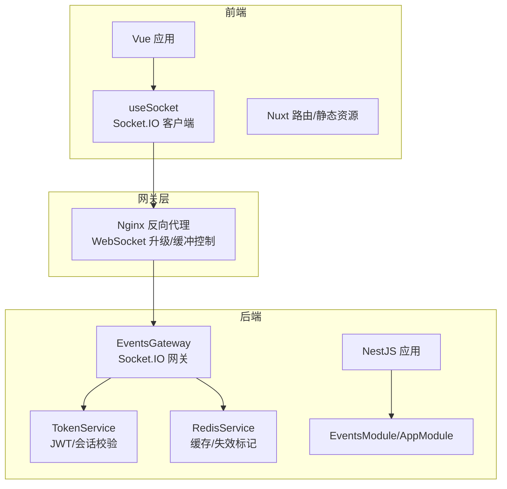
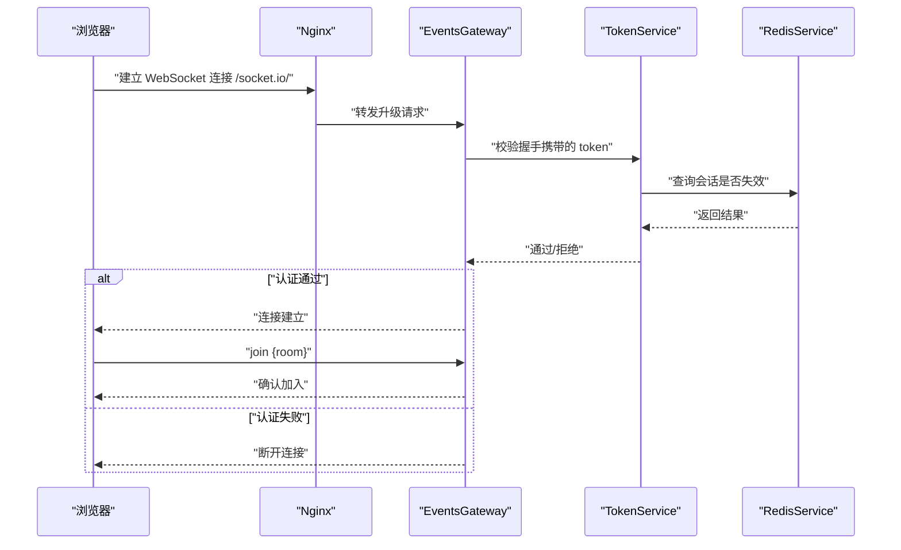
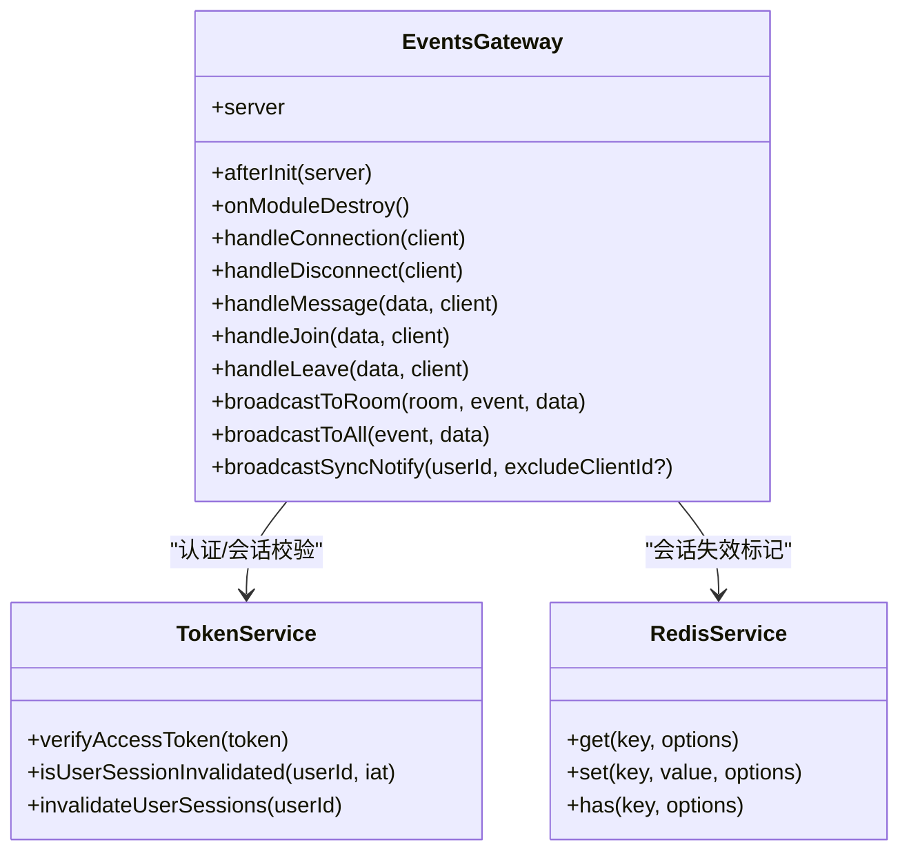
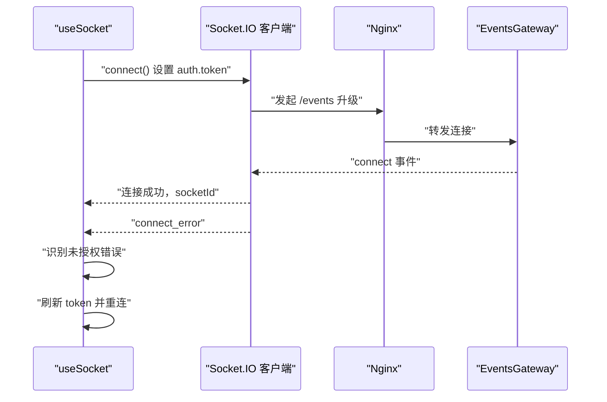
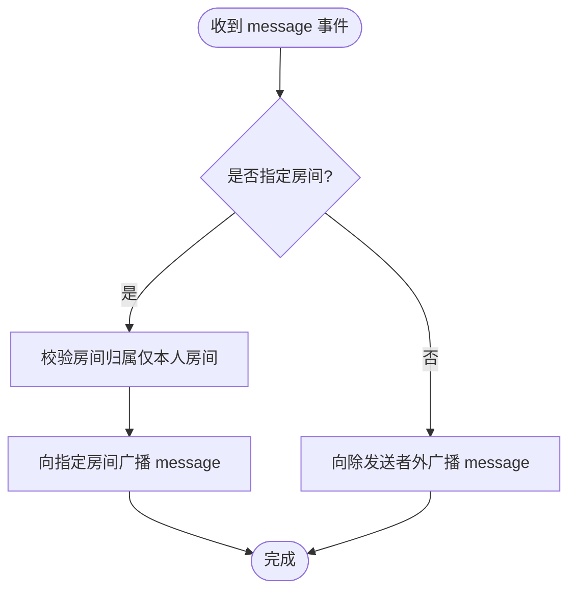
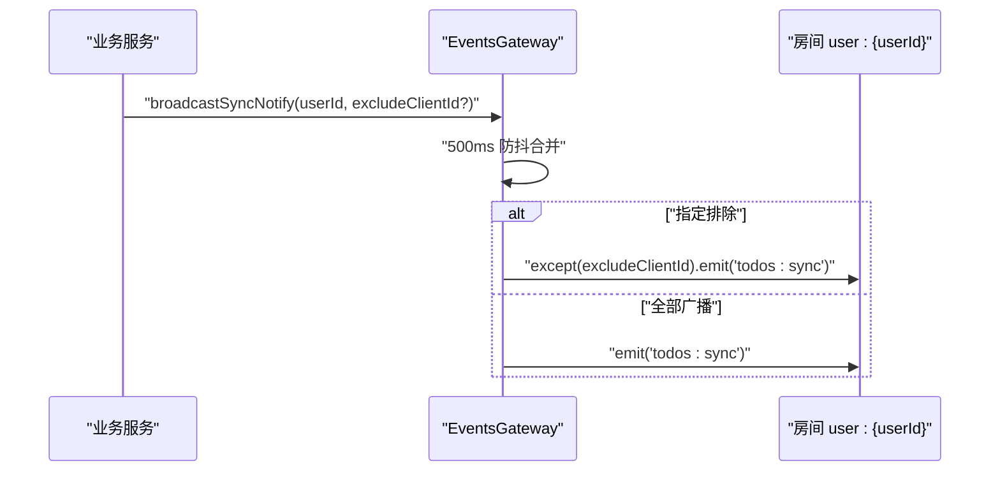
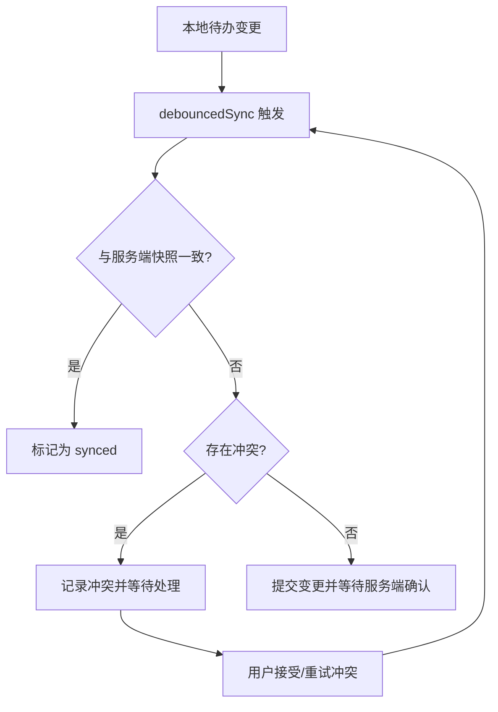
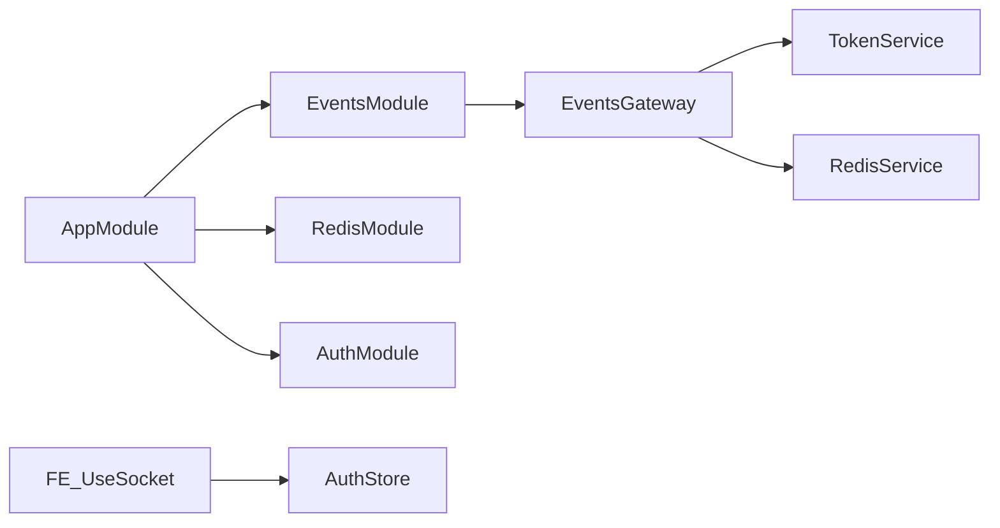

# 实时通信

<cite>
**本文引用的文件**
- [apps/backend/src/events/events.gateway.ts](file://apps/backend/src/events/events.gateway.ts)
- [apps/backend/src/events/events.module.ts](file://apps/backend/src/events/events.module.ts)
- [apps/backend/src/events/index.ts](file://apps/backend/src/events/index.ts)
- [apps/backend/src/auth/token.service.ts](file://apps/backend/src/auth/token.service.ts)
- [apps/backend/src/redis/redis.service.ts](file://apps/backend/src/redis/redis.service.ts)
- [apps/backend/src/redis/redis.module.ts](file://apps/backend/src/redis/redis.module.ts)
- [apps/backend/src/app.module.ts](file://apps/backend/src/app.module.ts)
- [apps/backend/src/health/health.controller.ts](file://apps/backend/src/health/health.controller.ts)
- [apps/frontend/src/composables/useSocket.ts](file://apps/frontend/src/composables/useSocket.ts)
- [apps/frontend/src/features/todo/stores/todo.cloud.sync.ts](file://apps/frontend/src/features/todo/stores/todo.cloud.sync.ts)
- [apps/frontend/src/features/todo/stores/todo.cloud.conflicts.ts](file://apps/frontend/src/features/todo/stores/todo.cloud.conflicts.ts)
- [apps/frontend/src/features/todo/stores/todo.cloud.data.ts](file://apps/frontend/src/features/todo/stores/todo.cloud.data.ts)
- [apps/frontend/nginx.conf](file://apps/frontend/nginx.conf)
- [apps/frontend/nginx.main.conf](file://apps/frontend/nginx.main.conf)
</cite>

## 目录
1. [简介](#简介)
2. [项目结构](#项目结构)
3. [核心组件](#核心组件)
4. [架构总览](#架构总览)
5. [组件详解](#组件详解)
6. [依赖关系分析](#依赖关系分析)
7. [性能考量](#性能考量)
8. [故障排查指南](#故障排查指南)
9. [结论](#结论)
10. [附录](#附录)

## 简介
本技术文档面向Lumina实时通信系统，聚焦于WebSocket网关配置、Socket.IO集成、连接管理策略；文档化事件发布订阅模式、房间管理机制、消息广播策略；详细说明用户在线状态管理、断线重连处理、消息持久化；介绍实时通知推送、多人协作功能、消息去重机制；涵盖连接池管理、负载均衡、性能监控；并提供客户端连接指南、事件处理最佳实践、错误恢复策略。

## 项目结构
Lumina后端采用NestJS框架，前端采用Vue生态。实时通信主要由后端Events网关与前端Socket.IO客户端配合实现，Nginx负责反向代理与WebSocket升级，Redis提供会话与认证相关缓存能力。

图表来源
- [apps/backend/src/events/events.gateway.ts:20-56](file://apps/backend/src/events/events.gateway.ts#L20-L56)
- [apps/backend/src/redis/redis.module.ts:26-82](file://apps/backend/src/redis/redis.module.ts#L26-L82)
- [apps/frontend/nginx.conf:144-180](file://apps/frontend/nginx.conf#L144-L180)

章节来源
- [apps/backend/src/app.module.ts:16-22](file://apps/backend/src/app.module.ts#L16-L22)
- [apps/backend/src/events/events.module.ts:1-15](file://apps/backend/src/events/events.module.ts#L1-L15)
- [apps/frontend/nginx.conf:144-180](file://apps/frontend/nginx.conf#L144-L180)

## 核心组件
- WebSocket网关与事件处理：EventsGateway负责CORS、认证中间件、房间加入/离开、消息广播、用户房间自动绑定、广播防抖等。
- Socket.IO客户端：useSocket封装连接、断开、重连、认证参数传递、连接等待、错误处理与自动刷新。
- 认证与会话：TokenService基于JWT与Redis实现访问令牌校验、会话失效标记、黑名单等。
- 缓存与会话：RedisService提供统一缓存接口、命名空间、TTL、批量操作、连接生命周期管理。
- 负载均衡与代理：Nginx配置反向代理、WebSocket升级、超时与缓冲策略、CORS与安全头。
- 健康检查：HealthController提供综合健康检查、存活探针、就绪探针。

章节来源
- [apps/backend/src/events/events.gateway.ts:16-266](file://apps/backend/src/events/events.gateway.ts#L16-L266)
- [apps/frontend/src/composables/useSocket.ts:1-176](file://apps/frontend/src/composables/useSocket.ts#L1-L176)
- [apps/backend/src/auth/token.service.ts:15-187](file://apps/backend/src/auth/token.service.ts#L15-L187)
- [apps/backend/src/redis/redis.service.ts:51-233](file://apps/backend/src/redis/redis.service.ts#L51-L233)
- [apps/frontend/nginx.conf:144-180](file://apps/frontend/nginx.conf#L144-L180)
- [apps/backend/src/health/health.controller.ts:16-77](file://apps/backend/src/health/health.controller.ts#L16-L77)

## 架构总览
下图展示从浏览器到后端网关、认证与缓存的整体交互流程。

图表来源
- [apps/backend/src/events/events.gateway.ts:86-116](file://apps/backend/src/events/events.gateway.ts#L86-L116)
- [apps/backend/src/auth/token.service.ts:55-76](file://apps/backend/src/auth/token.service.ts#L55-L76)
- [apps/backend/src/redis/redis.service.ts:86-108](file://apps/backend/src/redis/redis.service.ts#L86-L108)
- [apps/frontend/nginx.conf:144-180](file://apps/frontend/nginx.conf#L144-L180)

## 组件详解

### WebSocket网关与Socket.IO集成
- 网关配置
  - 命名空间：/events
  - 传输协议：polling 与 websocket
  - CORS：动态校验 origin，支持通配与开发调试场景
  - 认证中间件：从握手头部或握手 auth 字段提取 token，校验并注入用户信息
- 房间与权限
  - 自动加入用户房间 user:{userId}
  - 仅允许进入/离开自己的房间，否则抛出异常
- 事件处理
  - message：支持指定房间广播或全站广播（除发送者）
  - join/leave：加入/离开房间，并广播通知
  - 广播防抖：针对todos:sync事件按用户维度进行500ms防抖，避免风暴
- 广播接口
  - broadcastToRoom / broadcastToAll：供其他服务调用

图表来源
- [apps/backend/src/events/events.gateway.ts:57-266](file://apps/backend/src/events/events.gateway.ts#L57-L266)
- [apps/backend/src/auth/token.service.ts:15-187](file://apps/backend/src/auth/token.service.ts#L15-L187)
- [apps/backend/src/redis/redis.service.ts:51-233](file://apps/backend/src/redis/redis.service.ts#L51-L233)

章节来源
- [apps/backend/src/events/events.gateway.ts:20-145](file://apps/backend/src/events/events.gateway.ts#L20-L145)
- [apps/backend/src/events/events.gateway.ts:147-266](file://apps/backend/src/events/events.gateway.ts#L147-L266)

### 连接管理策略与断线重连
- 客户端策略
  - 优先使用 websocket，回退 polling
  - 自动连接：检测到认证状态变化时自动连接
  - 连接等待：waitForConnection提供超时与一次性事件监听
  - 断线错误处理：识别“未授权”类错误，触发token刷新并重连
- 服务端策略
  - 认证中间件：严格校验token与会话有效性
  - 自动加入用户房间：连接即加入 user:{userId}
  - 广播防抖：避免同一用户短时间内重复广播

图表来源
- [apps/frontend/src/composables/useSocket.ts:98-146](file://apps/frontend/src/composables/useSocket.ts#L98-L146)
- [apps/backend/src/events/events.gateway.ts:86-116](file://apps/backend/src/events/events.gateway.ts#L86-L116)
- [apps/frontend/nginx.conf:144-180](file://apps/frontend/nginx.conf#L144-L180)

章节来源
- [apps/frontend/src/composables/useSocket.ts:22-176](file://apps/frontend/src/composables/useSocket.ts#L22-L176)
- [apps/backend/src/events/events.gateway.ts:126-145](file://apps/backend/src/events/events.gateway.ts#L126-L145)

### 事件发布订阅与房间管理
- 房间模型
  - 用户房间：user:{userId}，仅本人可加入/离开
  - 广播范围：房间内广播或全站广播
- 事件类型
  - message：内容与时间戳，支持房间定向或全站广播
  - user:joined / user:left：房间成员变更通知
  - todos:sync：待办同步通知（经防抖处理）

图表来源
- [apps/backend/src/events/events.gateway.ts:147-175](file://apps/backend/src/events/events.gateway.ts#L147-L175)

章节来源
- [apps/backend/src/events/events.gateway.ts:147-250](file://apps/backend/src/events/events.gateway.ts#L147-L250)

### 实时通知推送与多人协作
- 通知推送
  - 服务端对todos:sync事件进行用户维度防抖，避免风暴
  - 可选择排除特定客户端ID，避免自身重复接收
- 多人协作
  - 房间机制天然支持多端协作：同一用户多设备加入同一房间
  - 客户端在连接建立后主动加入 user:{userId} 房间

图表来源
- [apps/backend/src/events/events.gateway.ts:177-202](file://apps/backend/src/events/events.gateway.ts#L177-L202)

章节来源
- [apps/backend/src/events/events.gateway.ts:177-202](file://apps/backend/src/events/events.gateway.ts#L177-L202)

### 消息去重与持久化
- 前端去重
  - 待办同步采用版本冲突检测与去重策略：接受/重试/清理冲突项
  - 本地状态与服务端快照比对，仅在必要时更新
- 后端去重
  - 广播防抖：同一用户在500ms内仅广播一次todos:sync
- 持久化
  - 会话失效标记：通过Redis记录用户会话失效时间，认证中间件据此拒绝旧token
  - 缓存接口：统一的get/set/has等操作，支持命名空间与TTL

图表来源
- [apps/frontend/src/features/todo/stores/todo.cloud.sync.ts:40-213](file://apps/frontend/src/features/todo/stores/todo.cloud.sync.ts#L40-L213)
- [apps/frontend/src/features/todo/stores/todo.cloud.conflicts.ts:43-90](file://apps/frontend/src/features/todo/stores/todo.cloud.conflicts.ts#L43-L90)

章节来源
- [apps/backend/src/redis/redis.service.ts:51-233](file://apps/backend/src/redis/redis.service.ts#L51-L233)
- [apps/backend/src/auth/token.service.ts:47-76](file://apps/backend/src/auth/token.service.ts#L47-L76)
- [apps/frontend/src/features/todo/stores/todo.cloud.conflicts.ts:43-90](file://apps/frontend/src/features/todo/stores/todo.cloud.conflicts.ts#L43-L90)

### 客户端连接指南与事件处理最佳实践
- 连接指南
  - 前端通过useSocket创建Socket实例，设置withCredentials、transports顺序、path与auth
  - 连接成功后主动加入user:{userId}房间
  - 使用waitForConnection在关键操作前确保连接可用
- 事件处理最佳实践
  - 服务端：严格校验房间归属，避免越权；使用广播防抖；区分房间广播与全站广播
  - 客户端：识别connect_error中的未授权错误，触发token刷新与重连；对冲突进行可视化提示与重试

章节来源
- [apps/frontend/src/composables/useSocket.ts:22-176](file://apps/frontend/src/composables/useSocket.ts#L22-L176)
- [apps/backend/src/events/events.gateway.ts:77-84](file://apps/backend/src/events/events.gateway.ts#L77-L84)
- [apps/backend/src/events/events.gateway.ts:177-202](file://apps/backend/src/events/events.gateway.ts#L177-L202)

## 依赖关系分析
- 模块依赖
  - AppModule导入EventsModule、RedisModule、AuthModule等
  - EventsModule导出EventsGateway，供应用使用
- 网关依赖
  - EventsGateway依赖TokenService进行认证，依赖RedisService进行会话失效标记
- 前端依赖
  - useSocket依赖useAuthStore提供的token，自动在连接时注入auth参数

图表来源
- [apps/backend/src/app.module.ts:16-22](file://apps/backend/src/app.module.ts#L16-L22)
- [apps/backend/src/events/events.module.ts:9-14](file://apps/backend/src/events/events.module.ts#L9-L14)
- [apps/backend/src/events/events.gateway.ts](file://apps/backend/src/events/events.gateway.ts#L66)

章节来源
- [apps/backend/src/app.module.ts:16-22](file://apps/backend/src/app.module.ts#L16-L22)
- [apps/backend/src/events/events.module.ts:9-14](file://apps/backend/src/events/events.module.ts#L9-L14)

## 性能考量
- 传输与代理
  - Nginx对WebSocket进行升级透传，关闭代理缓冲，延长读写超时，避免长连接断开
  - 前端优先使用websocket，降低polling带来的400错误与额外开销
- 广播风暴防护
  - 服务端对todos:sync按用户维度进行500ms防抖
- 缓存与会话
  - Redis提供快速的会话失效查询与黑名单判断
- 负载均衡
  - 通过Nginx反向代理实现多实例横向扩展，结合Redis共享状态

章节来源
- [apps/frontend/nginx.conf:144-180](file://apps/frontend/nginx.conf#L144-L180)
- [apps/backend/src/events/events.gateway.ts:177-202](file://apps/backend/src/events/events.gateway.ts#L177-L202)
- [apps/backend/src/redis/redis.module.ts:26-82](file://apps/backend/src/redis/redis.module.ts#L26-L82)

## 故障排查指南
- 认证失败
  - 现象：connect_error包含“unauthorized”、“token”、“authentication”
  - 处理：前端自动刷新token并重连；后端认证中间件严格校验
- CORS拒绝
  - 现象：握手阶段被CORS拒绝
  - 处理：核对CORS_ORIGIN配置与请求头，确保允许的origin列表正确
- 广播风暴
  - 现象：同一用户频繁收到todos:sync
  - 处理：确认服务端防抖逻辑生效；客户端避免重复触发
- 健康检查
  - 端点：GET /health、GET /health/liveness、GET /health/readiness
  - 用途：综合检查数据库、Redis、内存、磁盘；就绪探针仅检查关键依赖

章节来源
- [apps/frontend/src/composables/useSocket.ts:60-93](file://apps/frontend/src/composables/useSocket.ts#L60-L93)
- [apps/backend/src/events/events.gateway.ts:21-56](file://apps/backend/src/events/events.gateway.ts#L21-L56)
- [apps/backend/src/health/health.controller.ts:16-77](file://apps/backend/src/health/health.controller.ts#L16-L77)

## 结论
Lumina实时通信系统通过Socket.IO与NestJS网关实现高可用的事件驱动架构，结合Redis的会话与缓存能力，提供了可靠的认证、房间管理、广播防抖与冲突处理机制。前端通过useSocket实现了健壮的连接管理与断线重连策略。配合Nginx的WebSocket代理与健康检查端点，系统具备良好的可扩展性与可观测性。

## 附录
- 客户端事件处理参考
  - message：服务端广播消息
  - join/leave：房间加入/离开
  - user:joined/user:left：房间成员变更
  - todos:sync：待办同步通知
- 前端同步与冲突处理参考
  - 待办同步入口与防抖策略
  - 冲突接受/重试/清理流程

章节来源
- [apps/backend/src/events/events.gateway.ts:147-250](file://apps/backend/src/events/events.gateway.ts#L147-L250)
- [apps/frontend/src/features/todo/stores/todo.cloud.sync.ts:40-213](file://apps/frontend/src/features/todo/stores/todo.cloud.sync.ts#L40-L213)
- [apps/frontend/src/features/todo/stores/todo.cloud.conflicts.ts:43-90](file://apps/frontend/src/features/todo/stores/todo.cloud.conflicts.ts#L43-L90)