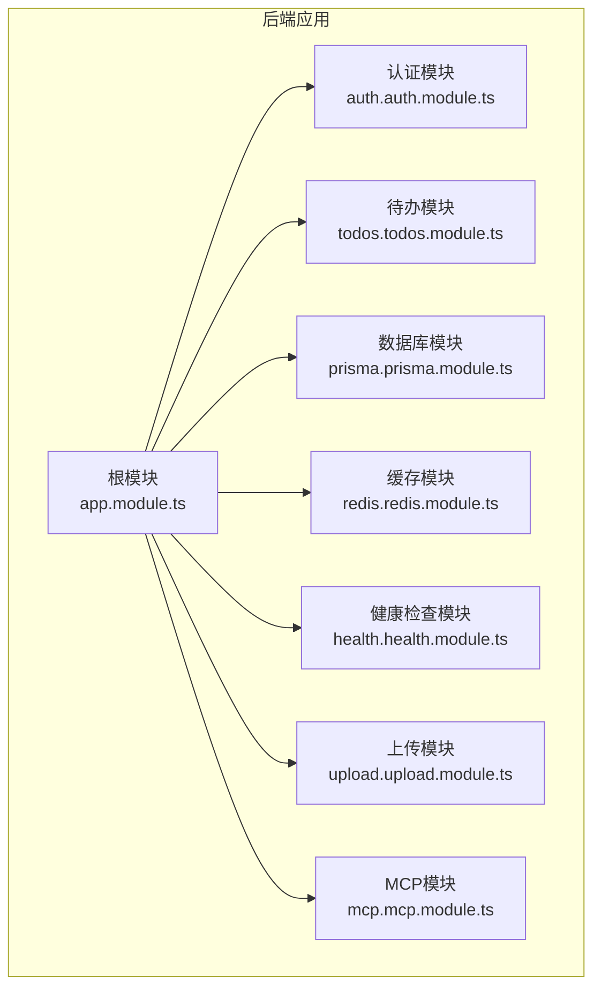
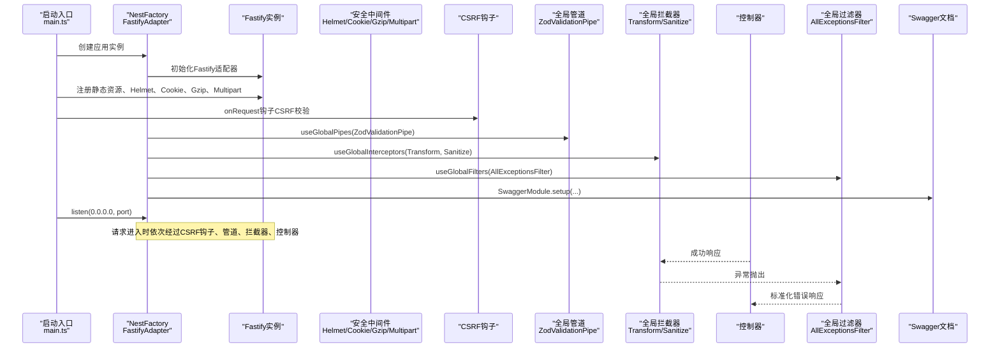
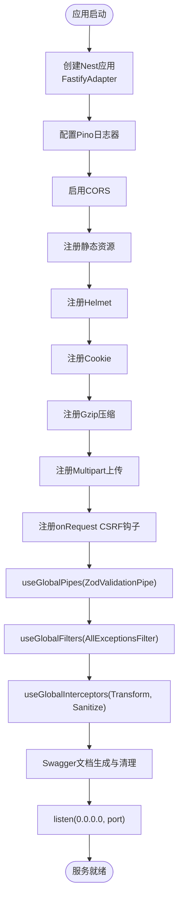
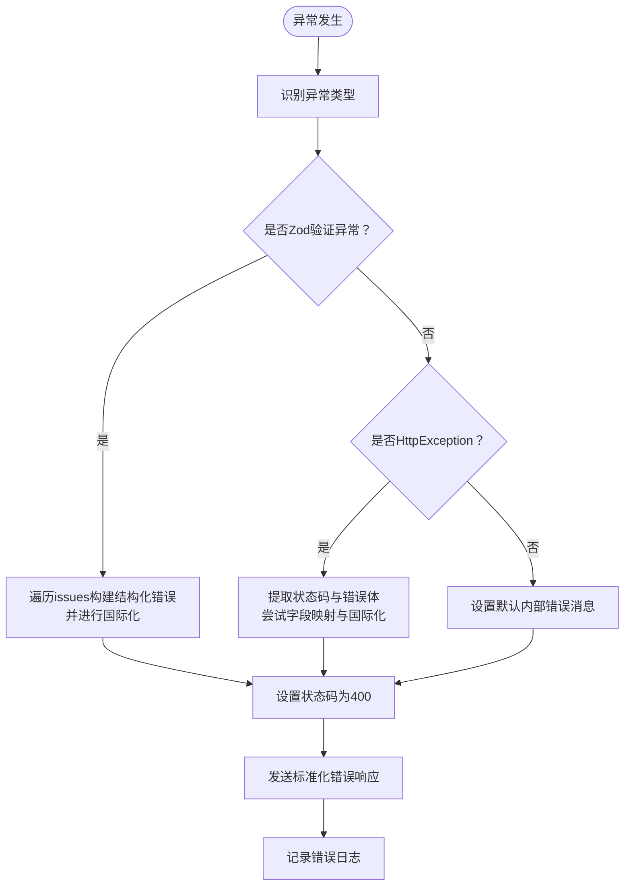
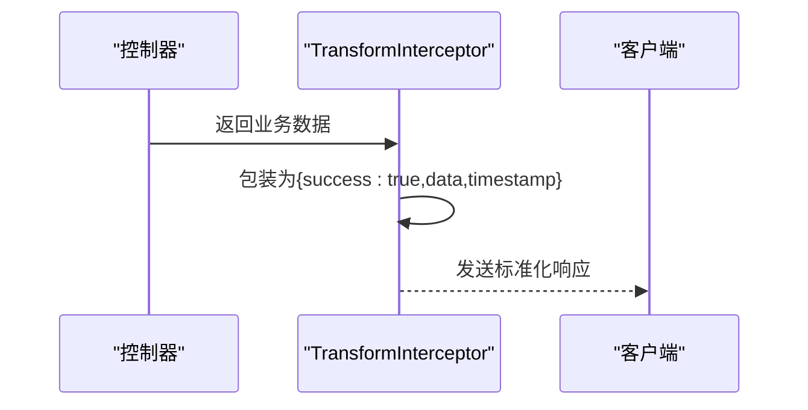
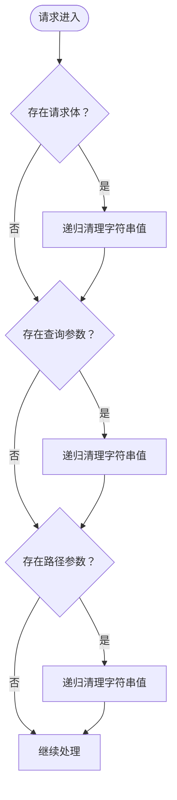
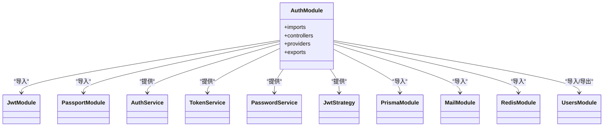
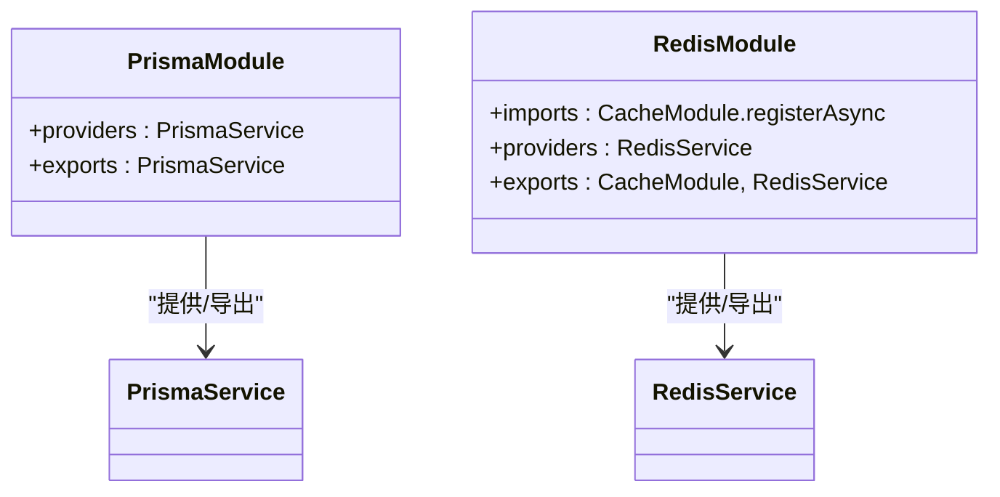
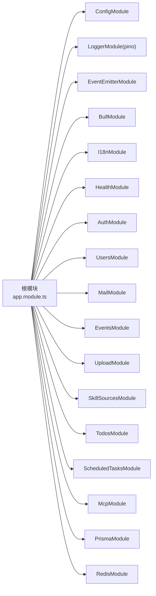

# 应用架构

<cite>
**本文引用的文件**
- [apps/backend/src/main.ts](file://apps/backend/src/main.ts)
- [apps/backend/src/app.module.ts](file://apps/backend/src/app.module.ts)
- [apps/backend/src/common/filters/all-exceptions.filter.ts](file://apps/backend/src/common/filters/all-exceptions.filter.ts)
- [apps/backend/src/common/interceptors/transform.interceptor.ts](file://apps/backend/src/common/interceptors/transform.interceptor.ts)
- [apps/backend/src/common/interceptors/sanitize.interceptor.ts](file://apps/backend/src/common/interceptors/sanitize.interceptor.ts)
- [apps/backend/src/auth/auth.module.ts](file://apps/backend/src/auth/auth.module.ts)
- [apps/backend/src/todos/todos.module.ts](file://apps/backend/src/todos/todos.module.ts)
- [apps/backend/src/prisma/prisma.module.ts](file://apps/backend/src/prisma/prisma.module.ts)
- [apps/backend/src/redis/redis.module.ts](file://apps/backend/src/redis/redis.module.ts)
- [apps/backend/src/health/health.module.ts](file://apps/backend/src/health/health.module.ts)
- [apps/backend/src/upload/upload.module.ts](file://apps/backend/src/upload/upload.module.ts)
- [apps/backend/src/mcp/mcp.module.ts](file://apps/backend/src/mcp/mcp.module.ts)
- [apps/backend/package.json](file://apps/backend/package.json)
- [apps/backend/nest-cli.json](file://apps/backend/nest-cli.json)
- [apps/backend/tsconfig.json](file://apps/backend/tsconfig.json)
</cite>

## 目录
1. [引言](#引言)
2. [项目结构](#项目结构)
3. [核心组件](#核心组件)
4. [架构总览](#架构总览)
5. [详细组件分析](#详细组件分析)
6. [依赖关系分析](#依赖关系分析)
7. [性能考虑](#性能考虑)
8. [故障排查指南](#故障排查指南)
9. [结论](#结论)
10. [附录](#附录)

## 引言
本文件面向Lumina后端应用，系统性阐述基于NestJS的企业级架构设计与实现细节。重点覆盖模块化架构、依赖注入容器、生命周期管理；应用程序启动流程、中间件与安全中间件注册顺序、全局配置选项；Fastify适配器优势与性能优化策略；全局管道、拦截器、过滤器的作用机制；Swagger文档自动生成与Zod验证管道集成；日志系统配置；以及配套的架构图示与最佳实践建议。

## 项目结构
后端采用多包工作区结构，核心应用位于apps/backend，按功能域拆分为多个特性模块，并通过根模块集中装配。构建与运行脚本、类型配置、编译器选项均在该目录内维护。

**图表来源**
- [apps/backend/src/app.module.ts:27-161](file://apps/backend/src/app.module.ts#L27-L161)
- [apps/backend/src/auth/auth.module.ts:19-39](file://apps/backend/src/auth/auth.module.ts#L19-L39)
- [apps/backend/src/todos/todos.module.ts:8-14](file://apps/backend/src/todos/todos.module.ts#L8-L14)
- [apps/backend/src/prisma/prisma.module.ts:4-9](file://apps/backend/src/prisma/prisma.module.ts#L4-L9)
- [apps/backend/src/redis/redis.module.ts:26-82](file://apps/backend/src/redis/redis.module.ts#L26-L82)
- [apps/backend/src/health/health.module.ts:8-13](file://apps/backend/src/health/health.module.ts#L8-L13)
- [apps/backend/src/upload/upload.module.ts:10-15](file://apps/backend/src/upload/upload.module.ts#L10-L15)
- [apps/backend/src/mcp/mcp.module.ts:13-23](file://apps/backend/src/mcp/mcp.module.ts#L13-L23)

**章节来源**
- [apps/backend/src/app.module.ts:27-161](file://apps/backend/src/app.module.ts#L27-L161)
- [apps/backend/nest-cli.json:1-11](file://apps/backend/nest-cli.json#L1-L11)
- [apps/backend/tsconfig.json:1-30](file://apps/backend/tsconfig.json#L1-L30)

## 核心组件
- 启动入口与适配器：使用Fastify适配器，启用信任代理、缓冲日志、优雅关闭钩子，结合Pino日志器。
- 安全中间件：Helmet安全头、Cookie、Gzip压缩、CSRF防护钩子、XSS清理拦截器。
- 全局管道与过滤器：Zod验证管道、统一异常过滤器。
- 全局拦截器：响应统一包装与XSS清理。
- Swagger与Zod：自动生成OpenAPI文档并清理Zod Schema生成的冗余描述。
- 配置与环境：ConfigModule、I18n国际化、BullMQ队列、EventEmitter事件驱动、Throttler限流守卫。

**章节来源**
- [apps/backend/src/main.ts:34-195](file://apps/backend/src/main.ts#L34-L195)
- [apps/backend/src/app.module.ts:28-168](file://apps/backend/src/app.module.ts#L28-L168)

## 架构总览
下图展示应用启动到请求处理的关键交互，包括Fastify插件注册、全局中间件链路、全局管道与拦截器、异常过滤器以及Swagger文档生成。

**图表来源**
- [apps/backend/src/main.ts:34-195](file://apps/backend/src/main.ts#L34-L195)
- [apps/backend/src/common/filters/all-exceptions.filter.ts:16-136](file://apps/backend/src/common/filters/all-exceptions.filter.ts#L16-L136)
- [apps/backend/src/common/interceptors/transform.interceptor.ts:18-29](file://apps/backend/src/common/interceptors/transform.interceptor.ts#L18-L29)
- [apps/backend/src/common/interceptors/sanitize.interceptor.ts:9-36](file://apps/backend/src/common/interceptors/sanitize.interceptor.ts#L9-L36)

## 详细组件分析

### 启动流程与中间件注册顺序
- Fastify适配器：启用信任代理以正确解析客户端真实IP；缓冲日志以便统一输出。
- CORS：显式白名单与凭证支持，避免通配符导致的安全问题。
- 静态资源：条件注册public目录，提供/api/public/前缀访问。
- 安全中间件：
  - Helmet：配置内容安全策略、跨源嵌入/资源策略等。
  - Cookie：启用会话相关能力。
  - Gzip：阈值与压缩等级优化传输体积。
  - Multipart：上传大小与文件数量限制。
- CSRF防护钩子：对非安全方法拦截缺少X-Requested-With头的请求，记录告警并返回标准化错误。
- 全局管道与过滤器：Zod验证、统一异常过滤器。
- 全局拦截器：响应统一包装、XSS清理。
- Swagger：构建文档并清理Zod生成的OpenAPI冗余描述，暴露/api/docs。
- 优雅关闭：启用关闭钩子，监听SIGINT/SIGTERM。

**图表来源**
- [apps/backend/src/main.ts:34-195](file://apps/backend/src/main.ts#L34-L195)

**章节来源**
- [apps/backend/src/main.ts:34-195](file://apps/backend/src/main.ts#L34-L195)

### 全局异常过滤器 AllExceptionsFilter
- 统一错误响应格式，包含success、data、message、errors、statusCode、timestamp。
- 支持Zod验证错误结构化映射，提取字段路径与国际化消息。
- 对HttpException状态码与响应体进行兼容处理，必要时进行字段映射。
- 国际化支持：优先使用I18n上下文翻译，回退至默认键或原始消息。
- 错误日志：记录请求方法、URL、状态码与堆栈信息。

**图表来源**
- [apps/backend/src/common/filters/all-exceptions.filter.ts:27-136](file://apps/backend/src/common/filters/all-exceptions.filter.ts#L27-L136)

**章节来源**
- [apps/backend/src/common/filters/all-exceptions.filter.ts:16-136](file://apps/backend/src/common/filters/all-exceptions.filter.ts#L16-L136)

### 全局响应转换拦截器 TransformInterceptor
- 将控制器返回的成功响应统一包装为包含success、data、timestamp的标准结构。
- 保持原有数据结构不变，便于前端一致处理。

**图表来源**
- [apps/backend/src/common/interceptors/transform.interceptor.ts:19-29](file://apps/backend/src/common/interceptors/transform.interceptor.ts#L19-L29)

**章节来源**
- [apps/backend/src/common/interceptors/transform.interceptor.ts:18-29](file://apps/backend/src/common/interceptors/transform.interceptor.ts#L18-L29)

### XSS清理拦截器 SanitizeInterceptor
- 对请求体、查询参数、路径参数进行原地递归清理，禁止任何HTML标签，防止XSS。
- 适用于富文本输入场景的前置净化，降低后续处理风险。

**图表来源**
- [apps/backend/src/common/interceptors/sanitize.interceptor.ts:17-36](file://apps/backend/src/common/interceptors/sanitize.interceptor.ts#L17-L36)

**章节来源**
- [apps/backend/src/common/interceptors/sanitize.interceptor.ts:9-64](file://apps/backend/src/common/interceptors/sanitize.interceptor.ts#L9-L64)

### 认证模块 AuthModule
- 集成Passport与JWT，配置默认策略为jwt。
- 通过ConfigService读取JWT密钥与过期时间，提供TokenService、PasswordService、JwtStrategy等服务。
- 依赖PrismaModule、MailModule、RedisModule与UsersModule。

**图表来源**
- [apps/backend/src/auth/auth.module.ts:19-39](file://apps/backend/src/auth/auth.module.ts#L19-L39)

**章节来源**
- [apps/backend/src/auth/auth.module.ts:1-41](file://apps/backend/src/auth/auth.module.ts#L1-L41)

### 数据库与缓存模块
- PrismaModule：全局单例PrismaService，贯穿各领域模块。
- RedisModule：基于cache-manager-ioredis-yet的异步连接工厂，支持重连策略、TTL与键前缀，提供RedisService。

**图表来源**
- [apps/backend/src/prisma/prisma.module.ts:4-9](file://apps/backend/src/prisma/prisma.module.ts#L4-L9)
- [apps/backend/src/redis/redis.module.ts:26-82](file://apps/backend/src/redis/redis.module.ts#L26-L82)

**章节来源**
- [apps/backend/src/prisma/prisma.module.ts:1-10](file://apps/backend/src/prisma/prisma.module.ts#L1-L10)
- [apps/backend/src/redis/redis.module.ts:1-84](file://apps/backend/src/redis/redis.module.ts#L1-L84)

### 健康检查模块 HealthModule
- 集成@nestjs/terminus，提供Prisma与Redis健康指标。
- 暴露HealthController，支持存活/就绪探针。

**章节来源**
- [apps/backend/src/health/health.module.ts:1-14](file://apps/backend/src/health/health.module.ts#L1-L14)

### 上传模块 UploadModule
- 提供UploadController，配合StorageService与FileParsingService，支持本地与S3存储策略。

**章节来源**
- [apps/backend/src/upload/upload.module.ts:1-16](file://apps/backend/src/upload/upload.module.ts#L1-L16)

### MCP模块 McpModule
- 提供MCP服务器配置、客户端、传输工厂、连接管理与工具注册等能力，支撑外部模型上下文协议集成。

**章节来源**
- [apps/backend/src/mcp/mcp.module.ts:1-25](file://apps/backend/src/mcp/mcp.module.ts#L1-L25)

### Swagger与Zod验证管道
- SwaggerModule：构建文档并使用cleanupOpenApiDoc清理Zod生成的冗余描述，统一暴露/api/docs。
- ZodValidationPipe：全局替换class-validator，自动将ZodSchema映射为OpenAPI与请求校验。

**章节来源**
- [apps/backend/src/main.ts:171-180](file://apps/backend/src/main.ts#L171-L180)
- [apps/backend/package.json:30-86](file://apps/backend/package.json#L30-L86)

## 依赖关系分析
- 根模块集中导入配置、日志、事件、队列、国际化、健康检查、认证、用户、邮件、事件、上传、技能源、待办、定时任务、MCP等模块。
- 全局守卫：ThrottlerGuard作为APP_GUARD，统一限流策略。
- 依赖注入容器：各模块通过providers提供服务，exports导出供其他模块使用。
- Fastify生态：与@fastify/*系列插件深度集成，形成安全、压缩、上传、静态资源的完整链路。

**图表来源**
- [apps/backend/src/app.module.ts:27-161](file://apps/backend/src/app.module.ts#L27-L161)

**章节来源**
- [apps/backend/src/app.module.ts:162-168](file://apps/backend/src/app.module.ts#L162-L168)

## 性能考虑
- Fastify适配器：相比Express具备更高吞吐与更低延迟，适合高并发场景。
- Gzip压缩：针对大于阈值的数据启用压缩，减少带宽占用。
- 上传限制：通过Multipart限制单文件大小与文件数量，避免内存与磁盘压力。
- 缓存：RedisModule提供连接池与重连策略，合理设置TTL与键前缀，提升读写效率。
- 日志：生产环境使用JSON格式，开发环境使用pino-pretty，避免格式化开销。
- 优雅关闭：启用关闭钩子，确保进程平滑退出，避免请求中断。

[本节为通用性能建议，不直接分析具体文件]

## 故障排查指南
- CSRF拦截：若出现403错误且提示缺失X-Requested-With头，请确认前端请求携带该头部或调整CSRF策略。
- Zod验证错误：查看errors字段的结构化映射，定位具体字段与国际化消息。
- 异常过滤器：统一错误响应包含timestamp与statusCode，便于定位问题。
- Swagger文档：访问/api/docs核对接口签名与参数约束，结合Zod清理后的描述进行调试。
- 日志：通过Pino日志器查看请求链路与错误堆栈，注意区分info/warn/error级别。

**章节来源**
- [apps/backend/src/main.ts:142-156](file://apps/backend/src/main.ts#L142-L156)
- [apps/backend/src/common/filters/all-exceptions.filter.ts:126-135](file://apps/backend/src/common/filters/all-exceptions.filter.ts#L126-L135)
- [apps/backend/src/main.ts:171-180](file://apps/backend/src/main.ts#L171-L180)

## 结论
Lumina后端采用NestJS模块化架构与Fastify适配器，结合Pino日志、BullMQ队列、国际化与健康检查，构建了高性能、可扩展、可观测的企业级应用。通过Helmet、Cookie、Gzip、CSRF钩子与XSS清理拦截器形成完整的安全基线；Zod验证与Swagger自动生成提升了接口一致性与可维护性。全局管道、拦截器与过滤器确保了请求处理的一致性与稳定性。

## 附录
- 构建与运行脚本：参见apps/backend/package.json的scripts字段。
- 编译器与路径映射：参见apps/backend/tsconfig.json与nest-cli.json。
- 环境变量：CORS_ORIGIN、PORT、UPLOAD_MAX_SIZE、UPLOAD_MAX_FILES、JWT_SECRET、REDIS_*、THROTTLE_*、LOG_LEVEL等。

**章节来源**
- [apps/backend/package.json:7-29](file://apps/backend/package.json#L7-L29)
- [apps/backend/tsconfig.json:1-30](file://apps/backend/tsconfig.json#L1-L30)
- [apps/backend/nest-cli.json:1-11](file://apps/backend/nest-cli.json#L1-L11)