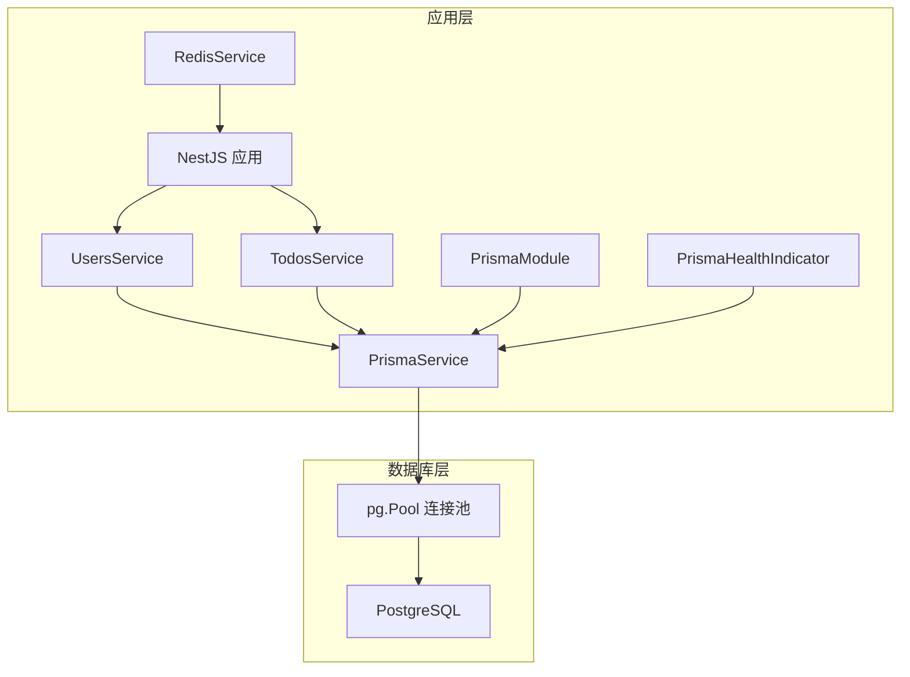
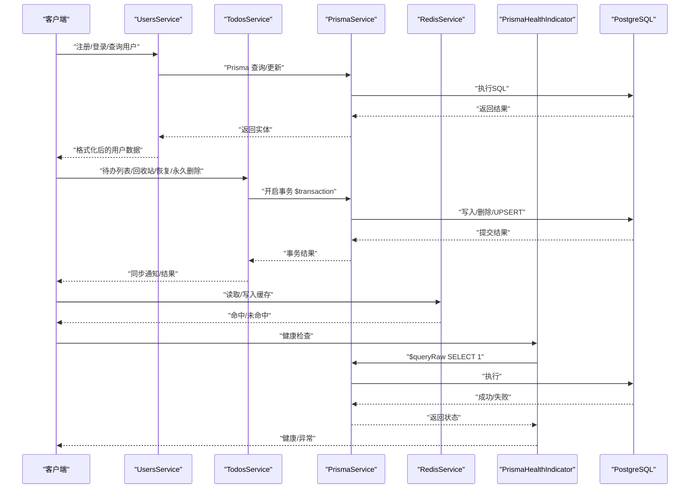
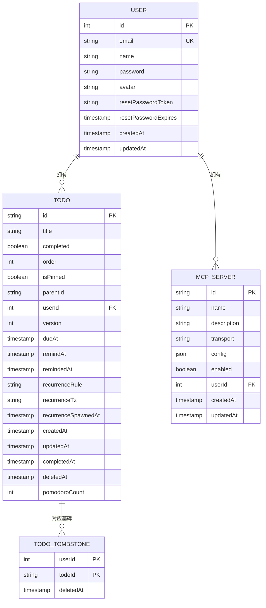
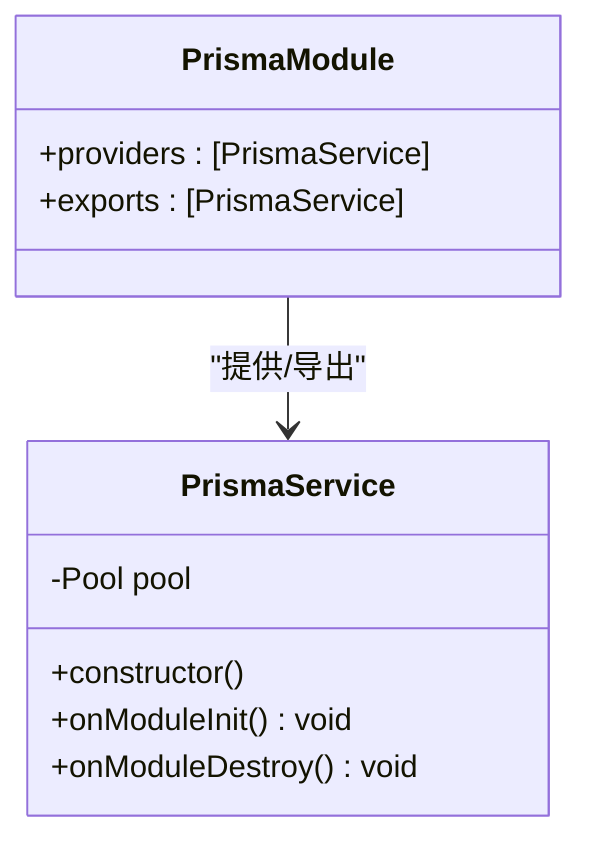
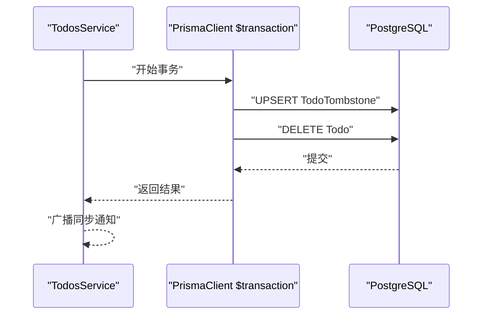
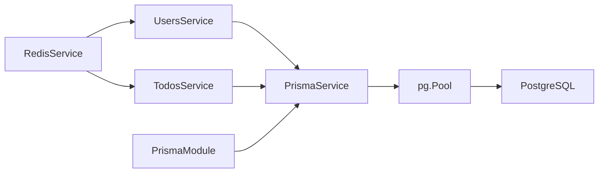

# 数据库与ORM

<cite>
**本文引用的文件**
- [apps/backend/prisma/schema/base.prisma](file://apps/backend/prisma/schema/base.prisma)
- [apps/backend/prisma/schema/user.prisma](file://apps/backend/prisma/schema/user.prisma)
- [apps/backend/prisma/schema/todo.prisma](file://apps/backend/prisma/schema/todo.prisma)
- [apps/backend/prisma/schema/mcp.prisma](file://apps/backend/prisma/schema/mcp.prisma)
- [apps/backend/prisma.config.js](file://apps/backend/prisma.config.js)
- [apps/backend/src/prisma/prisma.service.ts](file://apps/backend/src/prisma/prisma.service.ts)
- [apps/backend/src/prisma/prisma.module.ts](file://apps/backend/src/prisma/prisma.module.ts)
- [apps/backend/src/users/users.service.ts](file://apps/backend/src/users/users.service.ts)
- [apps/backend/src/todos/todos.service.ts](file://apps/backend/src/todos/todos.service.ts)
- [apps/backend/src/health/prisma.health.ts](file://apps/backend/src/health/prisma.health.ts)
- [apps/backend/src/redis/redis.service.ts](file://apps/backend/src/redis/redis.service.ts)
</cite>

## 目录
1. [简介](#简介)
2. [项目结构](#项目结构)
3. [核心组件](#核心组件)
4. [架构总览](#架构总览)
5. [详细组件分析](#详细组件分析)
6. [依赖分析](#依赖分析)
7. [性能考虑](#性能考虑)
8. [故障排查指南](#故障排查指南)
9. [结论](#结论)
10. [附录](#附录)

## 简介
本文件面向Lumina数据库与ORM系统，聚焦于Prisma ORM配置、数据库连接池管理、事务处理机制，以及用户表、待办事项表、MCP服务器表的Schema设计、字段定义、索引策略与关系约束。文档同时覆盖查询优化技巧、批量操作、分页查询实现、数据库迁移管理、种子数据导入、性能监控，并提供Prisma Client使用指南、类型安全查询与错误处理策略。

## 项目结构
后端采用NestJS框架，数据库层通过Prisma实现，使用PostgreSQL作为数据源。Prisma配置位于应用根目录下的配置文件中，Schema按领域拆分为多个文件：基础配置、用户、待办、MCP服务器。数据库连接通过自定义PrismaService注入全局模块，配合连接池与生命周期钩子完成连接与断开管理；健康检查通过专用健康指示器进行数据库连通性验证；缓存层采用Redis服务封装，提供命名空间、批量操作与TTL刷新能力。

图表来源
- [apps/backend/src/prisma/prisma.module.ts:1-10](file://apps/backend/src/prisma/prisma.module.ts#L1-L10)
- [apps/backend/src/prisma/prisma.service.ts:1-34](file://apps/backend/src/prisma/prisma.service.ts#L1-L34)
- [apps/backend/src/health/prisma.health.ts:1-32](file://apps/backend/src/health/prisma.health.ts#L1-L32)
- [apps/backend/src/redis/redis.service.ts:1-233](file://apps/backend/src/redis/redis.service.ts#L1-L233)

章节来源
- [apps/backend/prisma.schema/base.prisma:1-9](file://apps/backend/prisma/schema/base.prisma#L1-L9)
- [apps/backend/prisma.config.js:1-22](file://apps/backend/prisma.config.js#L1-L22)
- [apps/backend/src/prisma/prisma.module.ts:1-10](file://apps/backend/src/prisma/prisma.module.ts#L1-L10)
- [apps/backend/src/prisma/prisma.service.ts:1-34](file://apps/backend/src/prisma/prisma.service.ts#L1-L34)

## 核心组件
- Prisma ORM配置与Schema
  - 基础配置定义生成器与数据源类型，确保客户端适配与二进制目标兼容。
  - 用户、待办、MCP服务器三张核心表的字段、索引与关系在各自Schema文件中定义。
- 数据库连接与连接池
  - 自定义PrismaService基于pg.Pool创建适配器，注入PrismaClient，实现连接池共享与生命周期管理。
- 事务处理
  - TodosService在关键删除与清空回收站场景使用$transaction包裹，确保一致性与原子性。
- 健康检查
  - PrismaHealthIndicator通过原生查询验证数据库可用性，便于Kubernetes等平台进行存活/就绪探测。
- 缓存与性能
  - RedisService提供命名空间、批量删除、TTL刷新与缓存穿透保护等能力，辅助热点数据加速与一致性保障。

章节来源
- [apps/backend/prisma/schema/base.prisma:1-9](file://apps/backend/prisma/schema/base.prisma#L1-L9)
- [apps/backend/prisma/schema/user.prisma:1-16](file://apps/backend/prisma/schema/user.prisma#L1-L16)
- [apps/backend/prisma/schema/todo.prisma:1-39](file://apps/backend/prisma/schema/todo.prisma#L1-L39)
- [apps/backend/prisma/schema/mcp.prisma:1-16](file://apps/backend/prisma/schema/mcp.prisma#L1-L16)
- [apps/backend/src/prisma/prisma.service.ts:1-34](file://apps/backend/src/prisma/prisma.service.ts#L1-L34)
- [apps/backend/src/todos/todos.service.ts:96-110](file://apps/backend/src/todos/todos.service.ts#L96-L110)
- [apps/backend/src/health/prisma.health.ts:1-32](file://apps/backend/src/health/prisma.health.ts#L1-L32)
- [apps/backend/src/redis/redis.service.ts:1-233](file://apps/backend/src/redis/redis.service.ts#L1-L233)

## 架构总览
下图展示从应用到数据库的调用链路与数据流，包括连接池、事务边界与健康检查路径。

图表来源
- [apps/backend/src/users/users.service.ts:1-110](file://apps/backend/src/users/users.service.ts#L1-L110)
- [apps/backend/src/todos/todos.service.ts:1-146](file://apps/backend/src/todos/todos.service.ts#L1-L146)
- [apps/backend/src/prisma/prisma.service.ts:1-34](file://apps/backend/src/prisma/prisma.service.ts#L1-L34)
- [apps/backend/src/redis/redis.service.ts:1-233](file://apps/backend/src/redis/redis.service.ts#L1-L233)
- [apps/backend/src/health/prisma.health.ts:1-32](file://apps/backend/src/health/prisma.health.ts#L1-L32)

## 详细组件分析

### Prisma ORM配置与Schema设计
- 基础配置
  - 生成器：prisma-client-js，支持多平台二进制目标，确保跨环境部署一致性。
  - 数据源：PostgreSQL，统一驱动与连接字符串来源。
- 用户表(User)
  - 主键：自增整数ID。
  - 唯一约束：email。
  - 时间戳：createdAt默认当前时间，updatedAt自动更新。
  - 关系：一对多到McpServer与Todo。
  - 映射：表名为users。
- 待办表(Todo)
  - 主键：UUID字符串ID。
  - 默认值：completed=false，order=0，version=0，pomodoroCount=0。
  - 时间戳：createdAt默认当前时间，updatedAt自动更新，completedAt、deletedAt可为空。
  - 关系：多对一到User（userId）。
  - 索引：复合索引(userId, updatedAt)、(userId, remindAt)、(userId, dueAt)，单列索引(deletedAt)。
  - 映射：表名为todos。
  - 副表：TodoTombstone（软删除墓碑），联合主键(userId, todoId)，索引(userId, deletedAt)。
- MCP服务器表(McpServer)
  - 主键：UUID字符串ID。
  - 字段：name、description、transport、config(JSON)、enabled布尔值。
  - 关系：多对一到User（userId），onDelete=Cascade。
  - 索引：单列索引(userId)。
  - 映射：表名为mcp_servers。

图表来源
- [apps/backend/prisma/schema/user.prisma:1-16](file://apps/backend/prisma/schema/user.prisma#L1-L16)
- [apps/backend/prisma/schema/todo.prisma:1-39](file://apps/backend/prisma/schema/todo.prisma#L1-L39)
- [apps/backend/prisma/schema/mcp.prisma:1-16](file://apps/backend/prisma/schema/mcp.prisma#L1-L16)

章节来源
- [apps/backend/prisma/schema/base.prisma:1-9](file://apps/backend/prisma/schema/base.prisma#L1-L9)
- [apps/backend/prisma/schema/user.prisma:1-16](file://apps/backend/prisma/schema/user.prisma#L1-L16)
- [apps/backend/prisma/schema/todo.prisma:1-39](file://apps/backend/prisma/schema/todo.prisma#L1-L39)
- [apps/backend/prisma/schema/mcp.prisma:1-16](file://apps/backend/prisma/schema/mcp.prisma#L1-L16)

### 数据库连接池管理与生命周期
- 连接池初始化
  - 从环境变量读取DATABASE_URL，构造pg.Pool并传入PrismaPg适配器，交由PrismaClient使用。
- 生命周期钩子
  - onModuleInit：连接数据库。
  - onModuleDestroy：断开Prisma连接并关闭pg.Pool，释放资源。
- 全局注入
  - PrismaModule以@Global导出PrismaService，确保各模块可直接注入使用。

图表来源
- [apps/backend/src/prisma/prisma.service.ts:1-34](file://apps/backend/src/prisma/prisma.service.ts#L1-L34)
- [apps/backend/src/prisma/prisma.module.ts:1-10](file://apps/backend/src/prisma/prisma.module.ts#L1-L10)

章节来源
- [apps/backend/src/prisma/prisma.service.ts:1-34](file://apps/backend/src/prisma/prisma.service.ts#L1-L34)
- [apps/backend/src/prisma/prisma.module.ts:1-10](file://apps/backend/src/prisma/prisma.module.ts#L1-L10)

### 事务处理机制
- 场景一：永久删除待办事项
  - 在$transaction中先UPSERT墓碑记录，再删除Todo，保证软删除一致性与原子性。
- 场景二：清空回收站
  - 若存在待删除项，先批量写入墓碑，再删除所有标记为deletedAt非空的Todo，避免遗漏与重复删除。

图表来源
- [apps/backend/src/todos/todos.service.ts:96-110](file://apps/backend/src/todos/todos.service.ts#L96-L110)

章节来源
- [apps/backend/src/todos/todos.service.ts:96-110](file://apps/backend/src/todos/todos.service.ts#L96-L110)
- [apps/backend/src/todos/todos.service.ts:115-144](file://apps/backend/src/todos/todos.service.ts#L115-L144)

### 查询优化与批量操作
- 查询优化
  - Todo表针对高频查询建立复合索引：(userId, updatedAt)、(userId, remindAt)、(userId, dueAt)，并为deletedAt建立单列索引，提升过滤与排序效率。
  - 使用select裁剪字段，减少网络传输与序列化成本。
- 批量操作
  - 清空回收站使用createMany批量写入墓碑，降低多次往返开销。
- 分页查询
  - 当前实现以orderBy与条件过滤为主；建议结合游标分页或偏移分页，配合索引与LIMIT/OFFSET控制结果集大小。

章节来源
- [apps/backend/prisma/schema/todo.prisma:23-27](file://apps/backend/prisma/schema/todo.prisma#L23-L27)
- [apps/backend/src/todos/todos.service.ts:5-24](file://apps/backend/src/todos/todos.service.ts#L5-L24)
- [apps/backend/src/todos/todos.service.ts:37-46](file://apps/backend/src/todos/todos.service.ts#L37-L46)

### 数据模型关系与外键约束
- 用户与待办：一对多，外键userId，级联删除由Todo的deletedAt软删除策略替代，避免物理删除带来的级联影响。
- 用户与MCP服务器：一对多，外键userId，onDelete=Cascade，确保用户删除时自动清理其MCP配置。
- 软删除机制：TodoTombstone记录被删除的Todo，配合deletedAt过滤实现回收站功能。

章节来源
- [apps/backend/prisma/schema/todo.prisma:21](file://apps/backend/prisma/schema/todo.prisma#L21)
- [apps/backend/prisma/schema/mcp.prisma:11](file://apps/backend/prisma/schema/mcp.prisma#L11)
- [apps/backend/prisma/schema/todo.prisma:30-38](file://apps/backend/prisma/schema/todo.prisma#L30-L38)

### 数据库迁移管理与种子数据导入
- 迁移路径
  - Prisma配置中明确迁移目录为prisma/migrations，遵循Prisma CLI约定。
- 种子数据
  - 可在迁移脚本中插入初始数据，或通过独立种子脚本在开发环境初始化基础数据。

章节来源
- [apps/backend/prisma.config.js:18-21](file://apps/backend/prisma.config.js#L18-L21)

### 性能监控与健康检查
- 健康检查
  - PrismaHealthIndicator通过原生查询验证数据库连通性，异常时抛出HealthCheckError，便于平台侧快速发现故障。
- 缓存辅助
  - RedisService提供命名空间与批量操作，缓解数据库压力，提升响应速度。

章节来源
- [apps/backend/src/health/prisma.health.ts:1-32](file://apps/backend/src/health/prisma.health.ts#L1-L32)
- [apps/backend/src/redis/redis.service.ts:1-233](file://apps/backend/src/redis/redis.service.ts#L1-L233)

### Prisma Client使用指南与类型安全
- 类型安全查询
  - 使用PrismaService提供的方法进行查询与更新，返回类型由Prisma Client自动生成，避免手写SQL导致的类型不一致。
- 错误处理策略
  - 对于唯一约束冲突（如邮箱重复注册），抛出ConflictException；对于不存在的资源抛出NotFoundException；数据库异常通过HealthIndicator统一捕获与上报。
- 事务边界
  - 在需要强一致性的场景使用$transaction包裹，确保多条写入在同一事务内完成。

章节来源
- [apps/backend/src/users/users.service.ts:88-108](file://apps/backend/src/users/users.service.ts#L88-L108)
- [apps/backend/src/users/users.service.ts:27-39](file://apps/backend/src/users/users.service.ts#L27-L39)
- [apps/backend/src/todos/todos.service.ts:96-110](file://apps/backend/src/todos/todos.service.ts#L96-L110)

## 依赖分析
- 组件耦合
  - UsersService与TodosService均依赖PrismaService，PrismaModule全局导出，降低模块间耦合。
  - RedisService与应用其他模块松耦合，通过统一接口提供缓存能力。
- 外部依赖
  - PostgreSQL作为数据存储，pg.Pool提供连接池能力，PrismaPg适配器桥接两者。
  - Prisma CLI与迁移工具链用于Schema变更与版本管理。

图表来源
- [apps/backend/src/prisma/prisma.module.ts:1-10](file://apps/backend/src/prisma/prisma.module.ts#L1-L10)
- [apps/backend/src/prisma/prisma.service.ts:1-34](file://apps/backend/src/prisma/prisma.service.ts#L1-L34)
- [apps/backend/src/users/users.service.ts:1-110](file://apps/backend/src/users/users.service.ts#L1-L110)
- [apps/backend/src/todos/todos.service.ts:1-146](file://apps/backend/src/todos/todos.service.ts#L1-L146)
- [apps/backend/src/redis/redis.service.ts:1-233](file://apps/backend/src/redis/redis.service.ts#L1-L233)

章节来源
- [apps/backend/src/prisma/prisma.module.ts:1-10](file://apps/backend/src/prisma/prisma.module.ts#L1-L10)
- [apps/backend/src/prisma/prisma.service.ts:1-34](file://apps/backend/src/prisma/prisma.service.ts#L1-L34)
- [apps/backend/src/users/users.service.ts:1-110](file://apps/backend/src/users/users.service.ts#L1-L110)
- [apps/backend/src/todos/todos.service.ts:1-146](file://apps/backend/src/todos/todos.service.ts#L1-L146)
- [apps/backend/src/redis/redis.service.ts:1-233](file://apps/backend/src/redis/redis.service.ts#L1-L233)

## 性能考虑
- 索引策略
  - Todo高频过滤字段建立复合索引，结合查询条件选择最优索引。
- 查询裁剪
  - 使用select仅返回必要字段，减少序列化与网络传输。
- 批量写入
  - createMany与upsert在事务中批量执行，降低往返次数。
- 缓存策略
  - 对热点数据使用Redis缓存，设置合理TTL，结合命名空间隔离不同业务域。
- 连接池
  - 合理配置连接池大小与超时，避免高并发下的连接争用。

## 故障排查指南
- 数据库不可达
  - 通过PrismaHealthIndicator执行原生查询，定位连接问题；检查DATABASE_URL与网络连通性。
- 事务失败
  - 检查$transaction包裹范围内的写入顺序与幂等性；确认异常被捕获并回滚。
- 缓存异常
  - 观察RedisService日志输出，确认键构建、TTL设置与批量删除流程是否正确。
- 唯一约束冲突
  - 用户注册时若邮箱重复，应返回冲突错误；检查数据库唯一索引与Prisma Schema定义。

章节来源
- [apps/backend/src/health/prisma.health.ts:19-30](file://apps/backend/src/health/prisma.health.ts#L19-L30)
- [apps/backend/src/todos/todos.service.ts:96-110](file://apps/backend/src/todos/todos.service.ts#L96-L110)
- [apps/backend/src/redis/redis.service.ts:86-108](file://apps/backend/src/redis/redis.service.ts#L86-L108)
- [apps/backend/src/users/users.service.ts:88-108](file://apps/backend/src/users/users.service.ts#L88-L108)

## 结论
本系统通过清晰的Schema设计、连接池与事务管理、索引优化与缓存策略，实现了高性能、可维护的数据库与ORM方案。建议持续完善分页策略、引入游标分页与查询计划分析，并在生产环境加强监控与告警，确保系统稳定运行。

## 附录
- 配置要点
  - DATABASE_URL：数据库连接字符串，由环境变量提供。
  - Prisma迁移目录：prisma/migrations。
- 建议实践
  - 开发阶段使用Prisma Studio或CLI进行Schema演进与迁移。
  - 生产环境启用连接池参数调优与慢查询日志分析。
  - 对高频接口增加缓存与降级策略，提升用户体验。