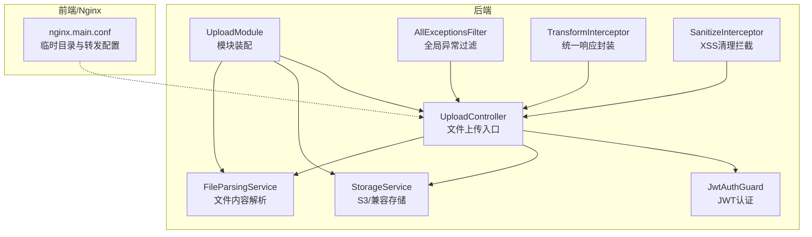
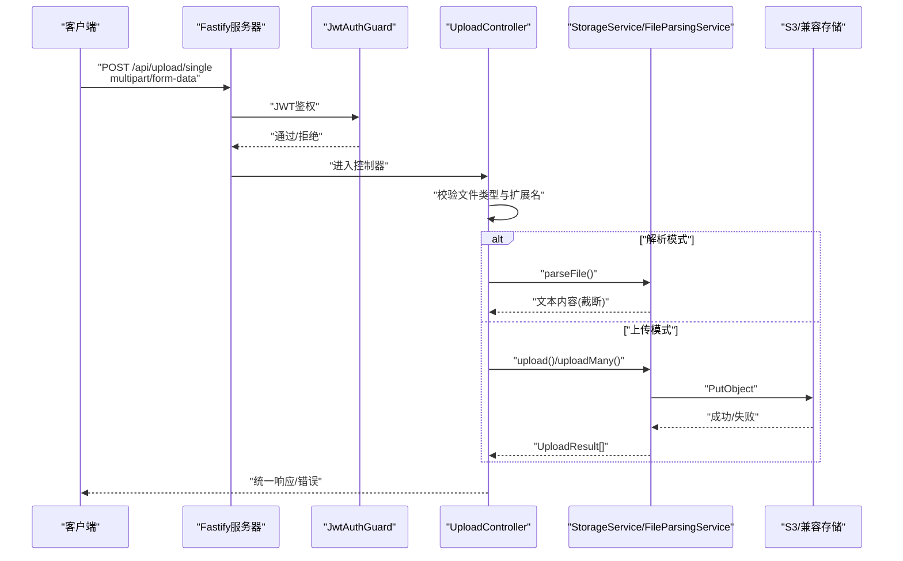
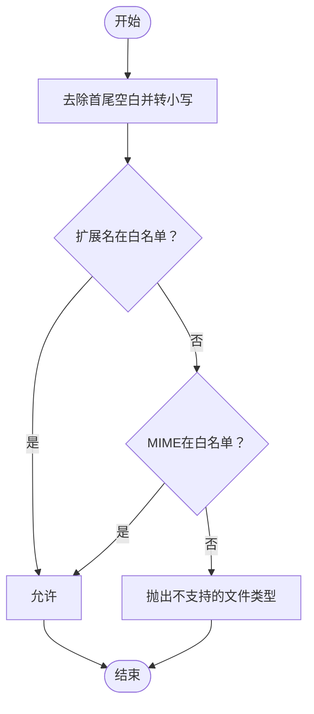
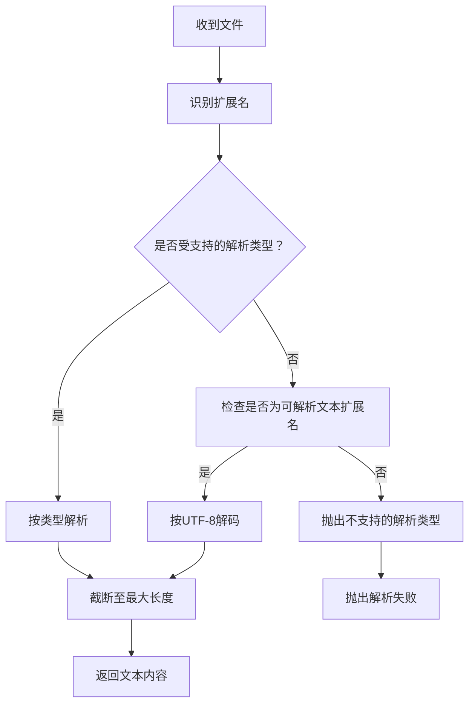
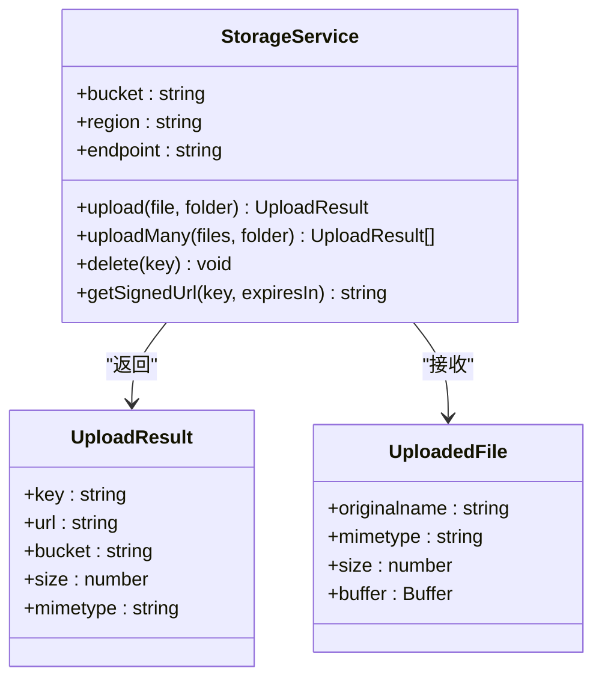
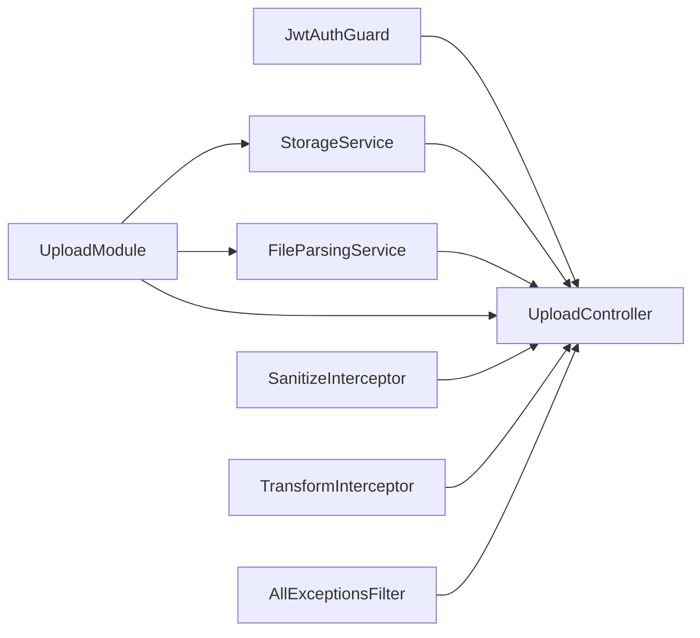

# 上传安全

<cite>
**本文引用的文件**
- [apps/backend/src/upload/upload.controller.ts](file://apps/backend/src/upload/upload.controller.ts)
- [apps/backend/src/upload/storage.service.ts](file://apps/backend/src/upload/storage.service.ts)
- [apps/backend/src/upload/file-parsing.service.ts](file://apps/backend/src/upload/file-parsing.service.ts)
- [apps/backend/src/upload/upload.constants.ts](file://apps/backend/src/upload/upload.constants.ts)
- [apps/backend/src/upload/upload.module.ts](file://apps/backend/src/upload/upload.module.ts)
- [apps/backend/src/i18n/en-US/upload.ts](file://apps/backend/src/i18n/en-US/upload.ts)
- [apps/backend/src/i18n/zh-CN/upload.ts](file://apps/backend/src/i18n/zh-CN/upload.ts)
- [apps/backend/src/common/filters/all-exceptions.filter.ts](file://apps/backend/src/common/filters/all-exceptions.filter.ts)
- [apps/backend/src/common/interceptors/transform.interceptor.ts](file://apps/backend/src/common/interceptors/transform.interceptor.ts)
- [apps/backend/src/common/interceptors/sanitize.interceptor.ts](file://apps/backend/src/common/interceptors/sanitize.interceptor.ts)
- [apps/backend/src/auth/jwt-auth.guard.ts](file://apps/backend/src/auth/jwt-auth.guard.ts)
- [apps/backend/src/main.ts](file://apps/backend/src/main.ts)
- [apps/backend/tests/upload/upload.controller.spec.ts](file://apps/backend/tests/upload/upload.controller.spec.ts)
- [apps/backend/tests/upload/storage.service.spec.ts](file://apps/backend/tests/upload/storage.service.spec.ts)
- [apps/backend/tests/auth/token.service.spec.ts](file://apps/backend/tests/auth/token.service.spec.ts)
- [apps/frontend/src/features/ai/composables/useAIConfig.ts](file://apps/frontend/src/features/ai/composables/useAIConfig.ts)
- [apps/frontend/nginx.main.conf](file://apps/frontend/nginx.main.conf)
</cite>

## 目录
1. [简介](#简介)
2. [项目结构](#项目结构)
3. [核心组件](#核心组件)
4. [架构总览](#架构总览)
5. [详细组件分析](#详细组件分析)
6. [依赖关系分析](#依赖关系分析)
7. [性能与容量规划](#性能与容量规划)
8. [故障排查指南](#故障排查指南)
9. [结论](#结论)
10. [附录](#附录)

## 简介
本文件面向Lumina后端“上传”子系统的安全机制，系统性梳理并文档化以下方面：
- 文件类型白名单与扩展名检查策略
- MIME类型验证与双重校验逻辑
- 恶意文件检测与内容安全策略
- 文件大小限制、上传频率控制与并发上传限制
- 安全过滤器、异常处理与错误信息保护
- CSRF防护、XSS预防与路径遍历防护
- 安全审计日志、威胁检测与入侵防护策略
- 安全配置最佳实践、漏洞修复与安全更新机制

## 项目结构
上传相关代码主要位于后端应用的上传模块，配合全局拦截器、异常过滤器与认证守卫共同构成安全边界；前端侧通过Nginx配置与部分客户端逻辑辅助安全。

图示来源
- [apps/backend/src/upload/upload.controller.ts:1-156](file://apps/backend/src/upload/upload.controller.ts#L1-L156)
- [apps/backend/src/upload/storage.service.ts:1-151](file://apps/backend/src/upload/storage.service.ts#L1-L151)
- [apps/backend/src/upload/file-parsing.service.ts:1-142](file://apps/backend/src/upload/file-parsing.service.ts#L1-L142)
- [apps/backend/src/upload/upload.module.ts:1-16](file://apps/backend/src/upload/upload.module.ts#L1-L16)
- [apps/backend/src/auth/jwt-auth.guard.ts:1-9](file://apps/backend/src/auth/jwt-auth.guard.ts#L1-L9)
- [apps/backend/src/common/filters/all-exceptions.filter.ts:1-137](file://apps/backend/src/common/filters/all-exceptions.filter.ts#L1-L137)
- [apps/backend/src/common/interceptors/transform.interceptor.ts:1-30](file://apps/backend/src/common/interceptors/transform.interceptor.ts#L1-L30)
- [apps/backend/src/common/interceptors/sanitize.interceptor.ts:1-64](file://apps/backend/src/common/interceptors/sanitize.interceptor.ts#L1-L64)
- [apps/frontend/nginx.main.conf:1-50](file://apps/frontend/nginx.main.conf#L1-L50)

章节来源
- [apps/backend/src/upload/upload.module.ts:1-16](file://apps/backend/src/upload/upload.module.ts#L1-L16)
- [apps/backend/src/upload/upload.controller.ts:1-156](file://apps/backend/src/upload/upload.controller.ts#L1-L156)
- [apps/backend/src/upload/storage.service.ts:1-151](file://apps/backend/src/upload/storage.service.ts#L1-L151)
- [apps/backend/src/upload/file-parsing.service.ts:1-142](file://apps/backend/src/upload/file-parsing.service.ts#L1-L142)
- [apps/backend/src/upload/upload.constants.ts:1-61](file://apps/backend/src/upload/upload.constants.ts#L1-L61)
- [apps/backend/src/auth/jwt-auth.guard.ts:1-9](file://apps/backend/src/auth/jwt-auth.guard.ts#L1-L9)
- [apps/backend/src/common/filters/all-exceptions.filter.ts:1-137](file://apps/backend/src/common/filters/all-exceptions.filter.ts#L1-L137)
- [apps/backend/src/common/interceptors/transform.interceptor.ts:1-30](file://apps/backend/src/common/interceptors/transform.interceptor.ts#L1-L30)
- [apps/backend/src/common/interceptors/sanitize.interceptor.ts:1-64](file://apps/backend/src/common/interceptors/sanitize.interceptor.ts#L1-L64)
- [apps/frontend/nginx.main.conf:1-50](file://apps/frontend/nginx.main.conf#L1-L50)

## 核心组件
- 上传控制器：负责接收multipart文件、执行白名单与扩展名校验、调用存储服务或解析服务，并对删除操作进行鉴权与权限控制。
- 存储服务：封装S3/兼容对象存储，生成唯一文件Key并返回公开URL或签名URL；在凭证未配置时拒绝操作。
- 文件解析服务：按扩展名选择解析器，限制最大解析长度，统一异常处理。
- 白名单常量：集中定义允许的MIME类型与扩展名集合，以及可解析文本扩展名与最大解析字符数。
- 安全拦截器与过滤器：统一响应格式、XSS清理、全局异常处理与国际化错误输出。
- 认证守卫：JWT认证守卫保护上传路由，确保只有登录态用户可上传。
- 前端Nginx：将临时路径指向可写目录，避免只读文件系统导致的上传失败。

章节来源
- [apps/backend/src/upload/upload.controller.ts:1-156](file://apps/backend/src/upload/upload.controller.ts#L1-L156)
- [apps/backend/src/upload/storage.service.ts:1-151](file://apps/backend/src/upload/storage.service.ts#L1-L151)
- [apps/backend/src/upload/file-parsing.service.ts:1-142](file://apps/backend/src/upload/file-parsing.service.ts#L1-L142)
- [apps/backend/src/upload/upload.constants.ts:1-61](file://apps/backend/src/upload/upload.constants.ts#L1-L61)
- [apps/backend/src/common/interceptors/sanitize.interceptor.ts:1-64](file://apps/backend/src/common/interceptors/sanitize.interceptor.ts#L1-L64)
- [apps/backend/src/common/filters/all-exceptions.filter.ts:1-137](file://apps/backend/src/common/filters/all-exceptions.filter.ts#L1-L137)
- [apps/backend/src/auth/jwt-auth.guard.ts:1-9](file://apps/backend/src/auth/jwt-auth.guard.ts#L1-L9)
- [apps/frontend/nginx.main.conf:1-50](file://apps/frontend/nginx.main.conf#L1-L50)

## 架构总览
下图展示从客户端到后端上传流程的关键安全节点与数据流。

图示来源
- [apps/backend/src/upload/upload.controller.ts:68-144](file://apps/backend/src/upload/upload.controller.ts#L68-L144)
- [apps/backend/src/upload/storage.service.ts:72-102](file://apps/backend/src/upload/storage.service.ts#L72-L102)
- [apps/backend/src/upload/file-parsing.service.ts:16-72](file://apps/backend/src/upload/file-parsing.service.ts#L16-L72)
- [apps/backend/src/auth/jwt-auth.guard.ts:1-9](file://apps/backend/src/auth/jwt-auth.guard.ts#L1-L9)

## 详细组件分析

### 文件类型白名单与扩展名校验
- 白名单策略
  - 使用ALLOWED_UPLOAD_MIME_TYPES与ALLOWED_UPLOAD_EXTENSIONS两个维度进行双重校验。
  - 若任一维度匹配即放行，否则抛出“不支持的文件类型”错误。
- 扩展名检查
  - 对原始文件名进行小写与去空白处理后，判断是否以允许的扩展名结尾。
- 国际化错误
  - 错误消息键统一为upload.UNSUPPORTED_FILE_TYPE，便于多语言输出。
- 测试覆盖
  - 单测验证了不被允许的MIME类型与通用HTML等扩展名会被拒绝，同时允许白名单内的docx等类型通过。

图示来源
- [apps/backend/src/upload/upload.controller.ts:51-63](file://apps/backend/src/upload/upload.controller.ts#L51-L63)
- [apps/backend/src/upload/upload.constants.ts:1-61](file://apps/backend/src/upload/upload.constants.ts#L1-L61)

章节来源
- [apps/backend/src/upload/upload.controller.ts:51-63](file://apps/backend/src/upload/upload.controller.ts#L51-L63)
- [apps/backend/src/upload/upload.constants.ts:1-61](file://apps/backend/src/upload/upload.constants.ts#L1-L61)
- [apps/backend/tests/upload/upload.controller.spec.ts:46-70](file://apps/backend/tests/upload/upload.controller.spec.ts#L46-L70)

### MIME类型验证与双重校验逻辑
- 控制器在将multipart文件转换为内部UploadedFile前，先执行ensureAllowedFile校验。
- 该方法同时比较MIME与扩展名，满足其一即可通过。
- 该设计兼顾浏览器上报MIME与文件实际扩展名的差异，降低绕过风险。

章节来源
- [apps/backend/src/upload/upload.controller.ts:33-63](file://apps/backend/src/upload/upload.controller.ts#L33-L63)

### 文件解析与内容安全策略
- 支持解析的文件类型包括PDF、DOCX、XLS/XLSX等；对于可直接按文本解析的扩展名，采用UTF-8解码。
- 为防止超长内容导致内存压力，解析结果会进行截断，最大字符数由MAX_PARSED_CONTENT_CHARS控制。
- 异常处理
  - 若解析过程抛出BadRequestException且消息键以upload.开头，则直接透传，避免泄露内部细节。
  - 其他异常统一记录日志并返回upload.FILE_PARSING_FAILED，保证错误信息对外一致且无敏感堆栈。
- 国际化错误
  - 对应的i18n键为upload.UNSUPPORTED_PARSE_FILE_TYPE与upload.FILE_PARSING_FAILED。

图示来源
- [apps/backend/src/upload/file-parsing.service.ts:16-72](file://apps/backend/src/upload/file-parsing.service.ts#L16-L72)
- [apps/backend/src/upload/upload.constants.ts:40-61](file://apps/backend/src/upload/upload.constants.ts#L40-L61)

章节来源
- [apps/backend/src/upload/file-parsing.service.ts:16-72](file://apps/backend/src/upload/file-parsing.service.ts#L16-L72)
- [apps/backend/src/i18n/en-US/upload.ts:1-10](file://apps/backend/src/i18n/en-US/upload.ts#L1-L10)
- [apps/backend/src/i18n/zh-CN/upload.ts:1-10](file://apps/backend/src/i18n/zh-CN/upload.ts#L1-L10)

### 存储服务与对象存储集成
- 支持AWS S3与兼容S3协议的服务（如OSS/MinIO），通过环境变量配置。
- 未配置凭证时，所有上传/删除/签名URL操作将抛出“存储未配置”，避免误用。
- 上传时生成随机UUID作为文件Key，保留原扩展名，避免路径穿越风险。
- 支持批量上传与删除；签名URL用于临时访问私有资源。

图示来源
- [apps/backend/src/upload/storage.service.ts:13-151](file://apps/backend/src/upload/storage.service.ts#L13-L151)

章节来源
- [apps/backend/src/upload/storage.service.ts:43-151](file://apps/backend/src/upload/storage.service.ts#L43-L151)
- [apps/backend/tests/upload/storage.service.spec.ts:32-72](file://apps/backend/tests/upload/storage.service.spec.ts#L32-L72)

### CSRF防护、XSS预防与路径遍历防护
- CSRF防护
  - 全局Fastify钩子对非GET/HEAD/OPTIONS请求强制要求X-Requested-With头，缺失则403并记录告警。
  - 该策略有效抵御跨站请求伪造，尤其针对AJAX场景。
- XSS预防
  - 全局SanitizeInterceptor对请求体、查询参数与路径参数中的字符串进行递归清理，不允许任何HTML标签，防止XSS注入。
- 路径遍历防护
  - 存储Key基于随机UUID拼接原扩展名生成，不直接使用用户可控路径，天然规避路径遍历风险。
  - 前端Nginx将临时路径指向/tmp，避免只读文件系统导致的路径问题，减少因路径权限引发的异常。

章节来源
- [apps/backend/src/main.ts:123-157](file://apps/backend/src/main.ts#L123-L157)
- [apps/backend/src/common/interceptors/sanitize.interceptor.ts:1-64](file://apps/backend/src/common/interceptors/sanitize.interceptor.ts#L1-L64)
- [apps/backend/src/upload/storage.service.ts:74-75](file://apps/backend/src/upload/storage.service.ts#L74-L75)
- [apps/frontend/nginx.main.conf:40-48](file://apps/frontend/nginx.main.conf#L40-L48)

### 异常处理与错误信息保护
- 全局异常过滤器
  - 统一记录请求方法、URL、状态码与错误消息；对Zod验证错误进行结构化映射与字段级国际化。
  - 对HttpException进行消息与字段映射处理，若消息键以点号分隔则尝试i18n翻译。
  - 默认内部错误使用common.error.INTERNAL_SERVER_ERROR键，最终由i18n兜底。
- 错误响应格式
  - 统一返回success、data、message、errors、statusCode、timestamp字段，便于前端一致处理。
- 上传模块错误
  - 上传/解析失败、存储未配置等错误均使用upload.*键，保持一致性与可翻译性。

章节来源
- [apps/backend/src/common/filters/all-exceptions.filter.ts:27-135](file://apps/backend/src/common/filters/all-exceptions.filter.ts#L27-L135)
- [apps/backend/src/i18n/en-US/upload.ts:1-10](file://apps/backend/src/i18n/en-US/upload.ts#L1-L10)
- [apps/backend/src/i18n/zh-CN/upload.ts:1-10](file://apps/backend/src/i18n/zh-CN/upload.ts#L1-L10)

### 文件大小限制、上传频率控制与并发上传限制
- 文件大小限制
  - 解析服务对输出文本进行截断，避免超大文件导致内存与下游处理压力。
  - 前端外部源拉取存在文件与归档压缩包大小上限，防止过大内容进入系统。
- 上传频率控制
  - 当前代码未见显式的速率限制实现；建议结合Redis限流或网关层策略在网关/反向代理层实施。
- 并发上传限制
  - 控制器支持批量上传（最多10个），但未见服务端并发数限制；建议在网关或应用层增加并发上限与队列策略。

章节来源
- [apps/backend/src/upload/file-parsing.service.ts:134-140](file://apps/backend/src/upload/file-parsing.service.ts#L134-L140)
- [apps/frontend/src/features/ai/composables/useAIConfig.ts:104-107](file://apps/frontend/src/features/ai/composables/useAIConfig.ts#L104-L107)
- [apps/frontend/src/features/ai/composables/useAIConfig.ts:281-327](file://apps/frontend/src/features/ai/composables/useAIConfig.ts#L281-L327)
- [apps/backend/src/upload/upload.controller.ts:117-144](file://apps/backend/src/upload/upload.controller.ts#L117-L144)

### 安全审计日志、威胁检测与入侵防护
- 审计日志
  - 全局异常过滤器记录请求URL、方法与错误堆栈，便于事后审计与溯源。
  - CSRF拦截在缺失X-Requested-With时记录告警并返回标准化错误。
- 威胁检测
  - 通过白名单与双重校验、XSS清理、随机Key命名等手段降低常见攻击面。
- 入侵防护
  - JWT认证守卫保护上传路由；令牌失效策略通过Redis记录与策略判定，阻断无效会话。
  - 建议在网关层增加WAF规则与IP信誉库，结合速率限制与深度包检测。

章节来源
- [apps/backend/src/common/filters/all-exceptions.filter.ts:37-45](file://apps/backend/src/common/filters/all-exceptions.filter.ts#L37-L45)
- [apps/backend/src/main.ts:142-156](file://apps/backend/src/main.ts#L142-L156)
- [apps/backend/src/auth/jwt-auth.guard.ts:1-9](file://apps/backend/src/auth/jwt-auth.guard.ts#L1-L9)
- [apps/backend/tests/auth/token.service.spec.ts:143-179](file://apps/backend/tests/auth/token.service.spec.ts#L143-L179)

### 安全配置最佳实践
- 对象存储
  - 必须配置S3_ACCESS_KEY_ID与S3_SECRET_ACCESS_KEY；未配置时禁止上传/删除/签名URL。
  - endpoint为空时走AWS S3，设置后走兼容S3协议服务（如OSS/MinIO）。
- CORS与安全头
  - 建议在网关层统一设置CORS、HSTS、X-Content-Type-Options、X-Frame-Options等安全头。
- 临时目录
  - 前端Nginx将client_body_temp_path等指向/tmp，确保容器内可写。
- 日志与监控
  - 开启访问日志与错误日志，结合告警规则对403/4xx异常进行阈值告警。

章节来源
- [apps/backend/src/upload/storage.service.ts:43-67](file://apps/backend/src/upload/storage.service.ts#L43-L67)
- [apps/frontend/nginx.main.conf:40-48](file://apps/frontend/nginx.main.conf#L40-L48)

### 漏洞修复指南与安全更新机制
- 已知风险与缓解
  - CSRF：通过X-Requested-With头强制与全局拦截实现缓解。
  - XSS：通过全局SanitizeInterceptor清理请求参数。
  - 路径遍历：通过随机Key与不使用用户可控路径缓解。
  - 速率限制与并发：建议在网关层引入限流与并发控制。
- 更新机制
  - 依赖管理与安全扫描：建议启用自动化依赖扫描与漏洞修复流程。
  - 版本升级：定期升级NestJS、Fastify、sanitize-html与S3 SDK等关键依赖。

章节来源
- [apps/backend/src/main.ts:123-157](file://apps/backend/src/main.ts#L123-L157)
- [apps/backend/src/common/interceptors/sanitize.interceptor.ts:1-64](file://apps/backend/src/common/interceptors/sanitize.interceptor.ts#L1-L64)
- [apps/backend/src/upload/storage.service.ts:74-75](file://apps/backend/src/upload/storage.service.ts#L74-L75)

## 依赖关系分析
- 控制器依赖认证守卫、存储服务与文件解析服务。
- 模块负责装配控制器、存储与解析服务并导出供其他模块使用。
- 全局拦截器与过滤器在应用启动阶段注册，影响所有请求。

图示来源
- [apps/backend/src/upload/upload.module.ts:10-15](file://apps/backend/src/upload/upload.module.ts#L10-L15)
- [apps/backend/src/upload/upload.controller.ts:24-28](file://apps/backend/src/upload/upload.controller.ts#L24-L28)
- [apps/backend/src/auth/jwt-auth.guard.ts:1-9](file://apps/backend/src/auth/jwt-auth.guard.ts#L1-L9)
- [apps/backend/src/common/interceptors/sanitize.interceptor.ts:1-64](file://apps/backend/src/common/interceptors/sanitize.interceptor.ts#L1-L64)
- [apps/backend/src/common/interceptors/transform.interceptor.ts:1-30](file://apps/backend/src/common/interceptors/transform.interceptor.ts#L1-L30)
- [apps/backend/src/common/filters/all-exceptions.filter.ts:1-137](file://apps/backend/src/common/filters/all-exceptions.filter.ts#L1-L137)

章节来源
- [apps/backend/src/upload/upload.module.ts:1-16](file://apps/backend/src/upload/upload.module.ts#L1-L16)
- [apps/backend/src/upload/upload.controller.ts:1-156](file://apps/backend/src/upload/upload.controller.ts#L1-L156)

## 性能与容量规划
- 并发上传
  - 控制器支持批量上传，但未见服务端并发上限；建议在网关层限制并发连接数与每用户并发数。
- 内存与CPU
  - 解析服务对输出进行截断，避免超长内容占用过多内存；建议对大文件上传采用流式处理与分块解析。
- 存储吞吐
  - S3/兼容存储的吞吐取决于网络与对象存储性能；建议对热点文件启用CDN与缓存策略。

[本节为通用指导，无需列出章节来源]

## 故障排查指南
- 上传失败：检查S3凭证是否配置；确认Bucket/Region/Endpoint设置正确。
- 解析失败：确认文件扩展名在可解析列表中；查看解析异常日志并定位具体类型。
- CSRF拦截：确认请求携带X-Requested-With头；检查网关或前端是否正确设置。
- XSS相关问题：确认SanitizeInterceptor生效；检查自定义中间件是否覆盖默认行为。
- 路径遍历：确认Key生成逻辑未使用用户输入路径；检查Nginx临时目录配置。

章节来源
- [apps/backend/src/upload/storage.service.ts:143-149](file://apps/backend/src/upload/storage.service.ts#L143-L149)
- [apps/backend/src/upload/file-parsing.service.ts:48-72](file://apps/backend/src/upload/file-parsing.service.ts#L48-L72)
- [apps/backend/src/main.ts:142-156](file://apps/backend/src/main.ts#L142-L156)
- [apps/frontend/nginx.main.conf:40-48](file://apps/frontend/nginx.main.conf#L40-L48)

## 结论
Lumina上传安全机制通过“白名单+双重校验+随机Key+全局拦截与过滤”的组合拳，有效降低了常见上传攻击面。建议在现有基础上补充网关层速率限制、并发控制与WAF策略，完善安全闭环；同时持续进行依赖安全扫描与更新，确保系统长期稳定与安全。

[本节为总结性内容，无需列出章节来源]

## 附录
- 国际化键参考
  - upload.FILE_REQUIRED
  - upload.UNSUPPORTED_FILE_TYPE
  - upload.UNSUPPORTED_PARSE_FILE_TYPE
  - upload.FILE_PARSING_FAILED
  - upload.STORAGE_NOT_CONFIGURED

章节来源
- [apps/backend/src/i18n/en-US/upload.ts:1-10](file://apps/backend/src/i18n/en-US/upload.ts#L1-L10)
- [apps/backend/src/i18n/zh-CN/upload.ts:1-10](file://apps/backend/src/i18n/zh-CN/upload.ts#L1-L10)