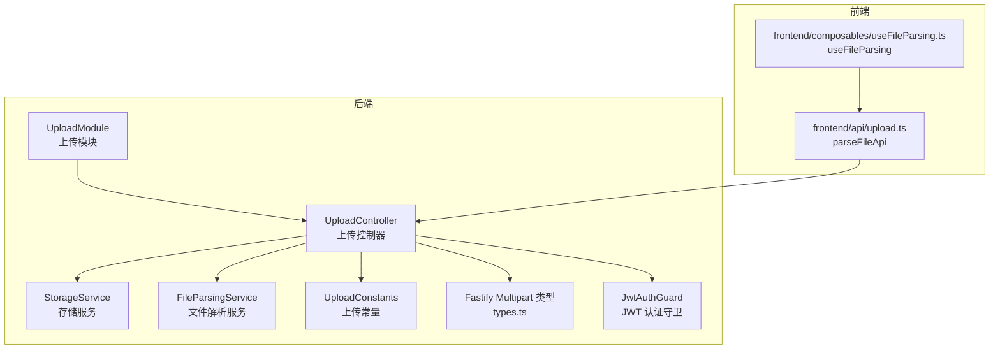
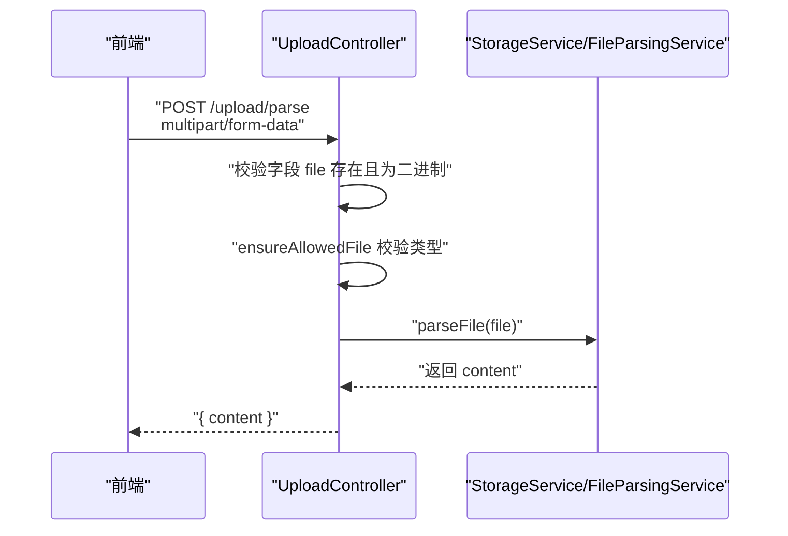
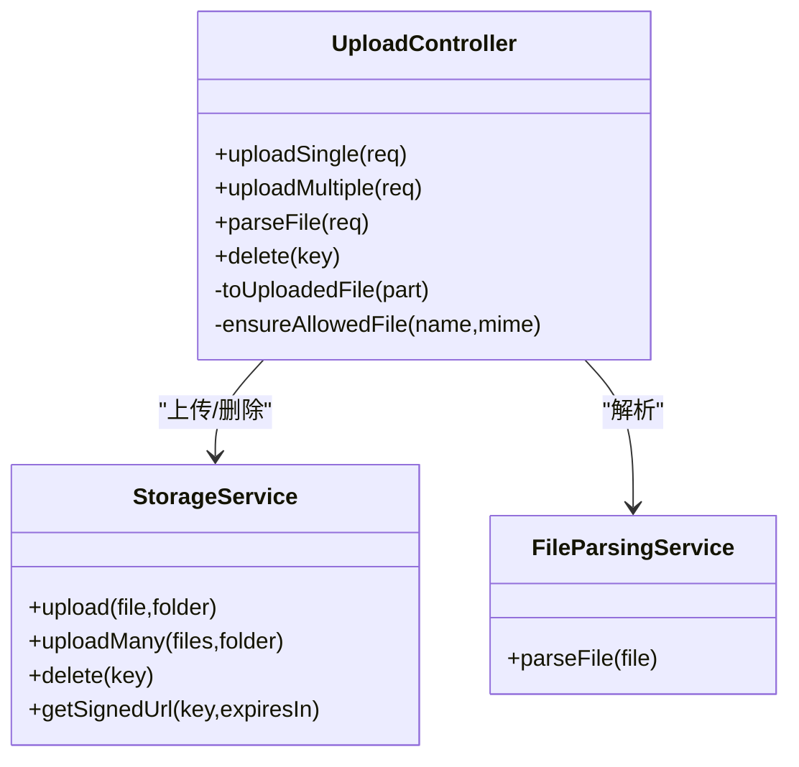
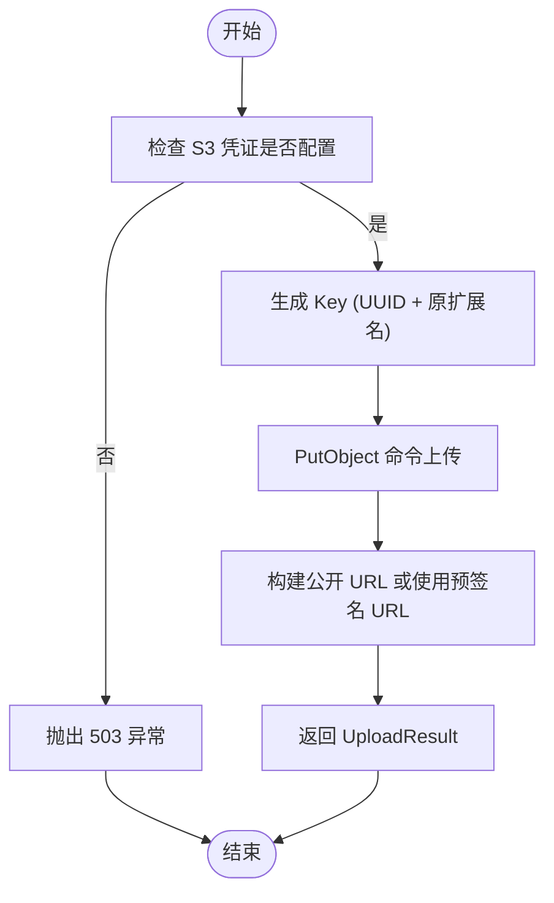
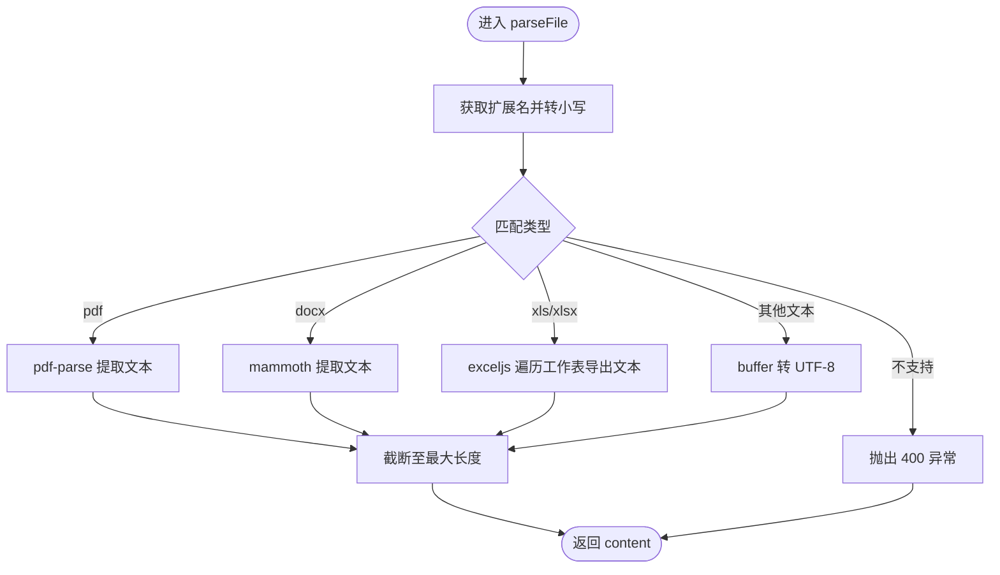
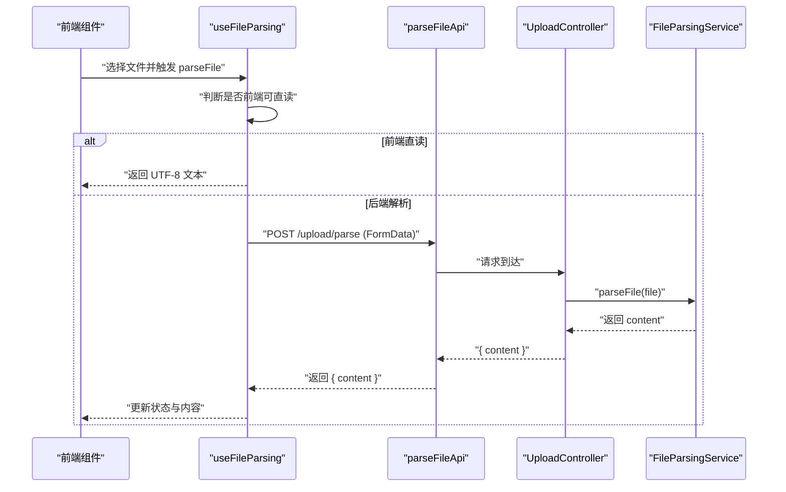
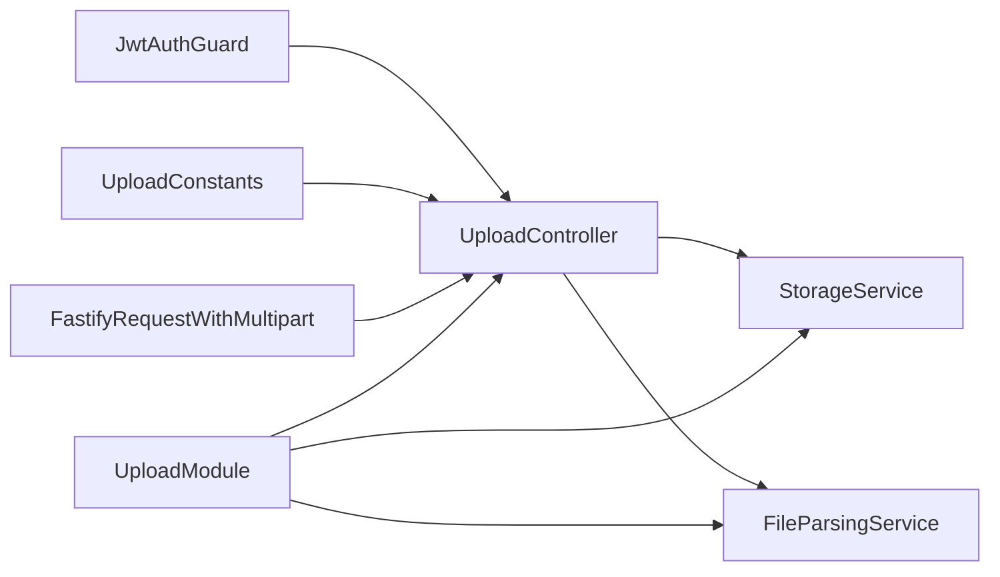

# 上传控制器

<cite>
**本文引用的文件**
- [apps/backend/src/upload/upload.controller.ts](file://apps/backend/src/upload/upload.controller.ts)
- [apps/backend/src/upload/upload.module.ts](file://apps/backend/src/upload/upload.module.ts)
- [apps/backend/src/upload/storage.service.ts](file://apps/backend/src/upload/storage.service.ts)
- [apps/backend/src/upload/file-parsing.service.ts](file://apps/backend/src/upload/file-parsing.service.ts)
- [apps/backend/src/upload/upload.constants.ts](file://apps/backend/src/upload/upload.constants.ts)
- [apps/backend/src/common/types.ts](file://apps/backend/src/common/types.ts)
- [apps/backend/src/auth/jwt-auth.guard.ts](file://apps/backend/src/auth/jwt-auth.guard.ts)
- [apps/backend/src/i18n/en-US/upload.ts](file://apps/backend/src/i18n/en-US/upload.ts)
- [apps/backend/src/i18n/zh-CN/upload.ts](file://apps/backend/src/i18n/zh-CN/upload.ts)
- [apps/backend/src/app.module.ts](file://apps/backend/src/app.module.ts)
- [apps/frontend/src/api/upload.ts](file://apps/frontend/src/api/upload.ts)
- [apps/frontend/src/composables/useFileParsing.ts](file://apps/frontend/src/composables/useFileParsing.ts)
- [packages/shared/src/dto/common.dto.ts](file://packages/shared/src/dto/common.dto.ts)
- [apps/backend/tests/upload/upload.controller.spec.ts](file://apps/backend/tests/upload/upload.controller.spec.ts)
</cite>

## 目录
1. [简介](#简介)
2. [项目结构](#项目结构)
3. [核心组件](#核心组件)
4. [架构总览](#架构总览)
5. [详细组件分析](#详细组件分析)
6. [依赖关系分析](#依赖关系分析)
7. [性能考量](#性能考量)
8. [故障排除指南](#故障排除指南)
9. [结论](#结论)
10. [附录](#附录)

## 简介
本文件为 Lumina 后端“上传控制器”的技术文档，覆盖以下主题：
- REST API 接口设计与端点规范
- 单文件上传、多文件上传、文件解析、文件删除
- JWT 认证机制与权限控制
- Multipart 请求处理与文件类型校验
- 错误处理机制、异常类型与国际化错误消息
- 前端集成指南与客户端实现最佳实践
- 实际 API 调用示例、参数说明与状态码含义

## 项目结构
上传相关能力由后端 NestJS 模块提供，前端通过统一的 HTTP 客户端进行调用。

**图表来源**
- [apps/backend/src/upload/upload.controller.ts:1-156](file://apps/backend/src/upload/upload.controller.ts#L1-L156)
- [apps/backend/src/upload/upload.module.ts:1-16](file://apps/backend/src/upload/upload.module.ts#L1-L16)
- [apps/backend/src/upload/storage.service.ts:1-151](file://apps/backend/src/upload/storage.service.ts#L1-L151)
- [apps/backend/src/upload/file-parsing.service.ts:1-142](file://apps/backend/src/upload/file-parsing.service.ts#L1-L142)
- [apps/backend/src/upload/upload.constants.ts:1-61](file://apps/backend/src/upload/upload.constants.ts#L1-L61)
- [apps/backend/src/common/types.ts:1-16](file://apps/backend/src/common/types.ts#L1-L16)
- [apps/backend/src/auth/jwt-auth.guard.ts:1-10](file://apps/backend/src/auth/jwt-auth.guard.ts#L1-L10)
- [apps/frontend/src/api/upload.ts:1-23](file://apps/frontend/src/api/upload.ts#L1-L23)
- [apps/frontend/src/composables/useFileParsing.ts:1-122](file://apps/frontend/src/composables/useFileParsing.ts#L1-L122)

**章节来源**
- [apps/backend/src/upload/upload.controller.ts:1-156](file://apps/backend/src/upload/upload.controller.ts#L1-L156)
- [apps/backend/src/upload/upload.module.ts:1-16](file://apps/backend/src/upload/upload.module.ts#L1-L16)
- [apps/backend/src/common/types.ts:1-16](file://apps/backend/src/common/types.ts#L1-L16)
- [apps/backend/src/auth/jwt-auth.guard.ts:1-10](file://apps/backend/src/auth/jwt-auth.guard.ts#L1-L10)

## 核心组件
- 上传控制器：提供单文件上传、多文件上传、文件解析、删除接口，并统一进行文件类型校验与鉴权。
- 存储服务：封装 S3/兼容 S3 的对象存储上传、批量上传、删除、生成公开 URL 或预签名 URL。
- 文件解析服务：对 PDF、DOCX、XLS/XLSX 等文档进行内容提取，支持 UTF-8 文本类扩展名直读。
- 上传常量：白名单 MIME 类型与扩展名、可解析文本扩展名、最大解析字符数。
- 前端 API：提供 parseFileApi 方法，用于上传并解析文件内容（不保存）。
- 前端组合式：useFileParsing 统一处理前端直读与后端解析两种路径，并进行截断与错误提示。

**章节来源**
- [apps/backend/src/upload/storage.service.ts:1-151](file://apps/backend/src/upload/storage.service.ts#L1-L151)
- [apps/backend/src/upload/file-parsing.service.ts:1-142](file://apps/backend/src/upload/file-parsing.service.ts#L1-L142)
- [apps/backend/src/upload/upload.constants.ts:1-61](file://apps/backend/src/upload/upload.constants.ts#L1-L61)
- [apps/frontend/src/api/upload.ts:1-23](file://apps/frontend/src/api/upload.ts#L1-L23)
- [apps/frontend/src/composables/useFileParsing.ts:1-122](file://apps/frontend/src/composables/useFileParsing.ts#L1-L122)

## 架构总览
上传控制器在全局启用 JWT 认证守卫，所有上传相关接口均需携带有效 Bearer Token。控制器负责：
- Multipart 请求解析与字段校验
- 文件类型白名单校验
- 调用存储服务完成上传或批量上传
- 调用文件解析服务提取文本内容
- 提供删除接口，基于对象存储 Key 进行删除

**图表来源**
- [apps/backend/src/upload/upload.controller.ts:68-112](file://apps/backend/src/upload/upload.controller.ts#L68-L112)
- [apps/backend/src/upload/file-parsing.service.ts:16-72](file://apps/backend/src/upload/file-parsing.service.ts#L16-L72)

**章节来源**
- [apps/backend/src/upload/upload.controller.ts:20-28](file://apps/backend/src/upload/upload.controller.ts#L20-L28)
- [apps/backend/src/auth/jwt-auth.guard.ts:1-10](file://apps/backend/src/auth/jwt-auth.guard.ts#L1-L10)

## 详细组件分析

### 上传控制器（UploadController）
- 路由前缀：/upload
- 认证：全局启用 JwtAuthGuard，要求 Authorization: Bearer <token>
- 主要端点：
  - POST /upload/single：单文件上传
  - POST /upload/parse：上传并解析文件内容（不保存）
  - POST /upload/multiple：多文件上传（最多 10 个）
  - DELETE /upload/:key：删除指定 Key 的文件
- 关键逻辑：
  - toUploadedFile：将 MultipartFile 转换为内部 UploadedFile 并执行类型校验
  - ensureAllowedFile：基于白名单 MIME 类型与扩展名进行校验
  - uploadSingle/uploadMultiple：委托 StorageService 完成上传
  - parseFile：委托 FileParsingService 完成解析
  - delete：委托 StorageService 删除

**图表来源**
- [apps/backend/src/upload/upload.controller.ts:24-156](file://apps/backend/src/upload/upload.controller.ts#L24-L156)
- [apps/backend/src/upload/storage.service.ts:32-151](file://apps/backend/src/upload/storage.service.ts#L32-L151)
- [apps/backend/src/upload/file-parsing.service.ts:9-142](file://apps/backend/src/upload/file-parsing.service.ts#L9-L142)

**章节来源**
- [apps/backend/src/upload/upload.controller.ts:68-154](file://apps/backend/src/upload/upload.controller.ts#L68-L154)

### 存储服务（StorageService）
- 功能：上传、批量上传、删除、生成公开 URL 或预签名 URL
- 配置：从 ConfigService 读取 S3_REGION、S3_BUCKET、S3_ENDPOINT、S3_ACCESS_KEY_ID、S3_SECRET_ACCESS_KEY
- 行为：
  - 若未配置凭证，调用上传/删除/签名接口会抛出 ServiceUnavailableException
  - 上传时自动生成 UUID Key，并按扩展名拼接
  - 支持自定义 endpoint（OSS/MinIO），否则使用标准 S3 URL
- 返回结构：UploadResult 包含 key、url、bucket、size、mimetype

**图表来源**
- [apps/backend/src/upload/storage.service.ts:43-149](file://apps/backend/src/upload/storage.service.ts#L43-L149)

**章节来源**
- [apps/backend/src/upload/storage.service.ts:32-151](file://apps/backend/src/upload/storage.service.ts#L32-L151)

### 文件解析服务（FileParsingService）
- 支持格式：
  - PDF：使用 pdf-parse
  - DOCX：使用 mammoth
  - XLS/XLSX：使用 exceljs，遍历工作表导出 CSV 风格文本
  - 文本类扩展名：UTF-8 直读
- 截断策略：超过最大字符数（常量）时截断并追加省略标记
- 错误处理：捕获非 upload.* 异常并转换为通用错误消息

**图表来源**
- [apps/backend/src/upload/file-parsing.service.ts:16-72](file://apps/backend/src/upload/file-parsing.service.ts#L16-L72)
- [apps/backend/src/upload/upload.constants.ts:40-61](file://apps/backend/src/upload/upload.constants.ts#L40-L61)

**章节来源**
- [apps/backend/src/upload/file-parsing.service.ts:9-142](file://apps/backend/src/upload/file-parsing.service.ts#L9-L142)
- [apps/backend/src/upload/upload.constants.ts:1-61](file://apps/backend/src/upload/upload.constants.ts#L1-L61)

### 上传常量（ALLOWED_*）
- 允许的 MIME 类型与扩展名白名单
- 可解析文本扩展名集合
- 最大解析字符数阈值

**章节来源**
- [apps/backend/src/upload/upload.constants.ts:1-61](file://apps/backend/src/upload/upload.constants.ts#L1-L61)

### 前端集成（parseFileApi 与 useFileParsing）
- parseFileApi：构造 multipart/form-data，向 /upload/parse 发送请求，返回 { content }
- useFileParsing：根据文件类型选择前端直读或后端解析；对超长内容进行截断并提示；管理解析状态与错误

**图表来源**
- [apps/frontend/src/api/upload.ts:11-22](file://apps/frontend/src/api/upload.ts#L11-L22)
- [apps/frontend/src/composables/useFileParsing.ts:47-95](file://apps/frontend/src/composables/useFileParsing.ts#L47-L95)
- [apps/backend/src/upload/upload.controller.ts:92-112](file://apps/backend/src/upload/upload.controller.ts#L92-L112)
- [apps/backend/src/upload/file-parsing.service.ts:16-72](file://apps/backend/src/upload/file-parsing.service.ts#L16-L72)

**章节来源**
- [apps/frontend/src/api/upload.ts:1-23](file://apps/frontend/src/api/upload.ts#L1-L23)
- [apps/frontend/src/composables/useFileParsing.ts:1-122](file://apps/frontend/src/composables/useFileParsing.ts#L1-L122)

## 依赖关系分析
- 控制器依赖：
  - StorageService：上传/删除/签名 URL
  - FileParsingService：解析文件内容
  - JwtAuthGuard：全局认证
  - UploadConstants：类型白名单与阈值
  - FastifyRequestWithMultipart：Multipart 请求类型
- 模块装配：UploadModule 导出 StorageService 与 FileParsingService，供其他模块复用

**图表来源**
- [apps/backend/src/upload/upload.controller.ts:10-28](file://apps/backend/src/upload/upload.controller.ts#L10-L28)
- [apps/backend/src/upload/upload.module.ts:10-15](file://apps/backend/src/upload/upload.module.ts#L10-L15)
- [apps/backend/src/auth/jwt-auth.guard.ts:1-10](file://apps/backend/src/auth/jwt-auth.guard.ts#L1-L10)

**章节来源**
- [apps/backend/src/upload/upload.module.ts:1-16](file://apps/backend/src/upload/upload.module.ts#L1-L16)
- [apps/backend/src/app.module.ts:152-156](file://apps/backend/src/app.module.ts#L152-L156)

## 性能考量
- 多文件上传采用 Promise.all 并行上传，提升吞吐；注意内存占用与并发限制
- 文件解析对大体积 PDF/Excel 有解析成本，建议前端直读纯文本类文件，复杂文档走后端解析
- 预签名 URL 可降低对象存储访问延迟，适合临时下载场景
- 建议在网关层或反向代理层设置合理的上传大小限制与超时时间

[本节为通用指导，无需列出具体文件来源]

## 故障排除指南
- 常见错误与国际化消息
  - 上传缺少文件字段：upload.FILE_REQUIRED
  - 不支持的文件类型：upload.UNSUPPORTED_FILE_TYPE
  - 不支持解析的文件类型：upload.UNSUPPORTED_PARSE_FILE_TYPE
  - 文件解析失败：upload.FILE_PARSING_FAILED
  - 对象存储未配置：upload.STORAGE_NOT_CONFIGURED
- 前端提示与处理
  - useFileParsing 在截断时弹出警告提示
  - unwrapApiResponse 将错误响应抛出为 Error，便于前端统一处理
- 测试参考
  - 单元测试覆盖了不支持 MIME 类型与扩展名的拒绝行为，以及允许类型的转发行为

**章节来源**
- [apps/backend/src/i18n/en-US/upload.ts:1-10](file://apps/backend/src/i18n/en-US/upload.ts#L1-L10)
- [apps/backend/src/i18n/zh-CN/upload.ts:1-10](file://apps/backend/src/i18n/zh-CN/upload.ts#L1-L10)
- [apps/frontend/src/composables/useFileParsing.ts:33-45](file://apps/frontend/src/composables/useFileParsing.ts#L33-L45)
- [packages/shared/src/dto/common.dto.ts:46-54](file://packages/shared/src/dto/common.dto.ts#L46-L54)
- [apps/backend/tests/upload/upload.controller.spec.ts:46-101](file://apps/backend/tests/upload/upload.controller.spec.ts#L46-L101)

## 结论
上传控制器通过清晰的职责划分与严格的类型校验，提供了安全、可扩展的文件上传与解析能力。结合 JWT 认证与对象存储抽象，既满足前端直读与后端解析的混合策略，又具备良好的国际化与错误处理体验。建议在生产环境中完善对象存储凭证与网络配置，并在网关层设置合理的限流与大小限制。

[本节为总结性内容，无需列出具体文件来源]

## 附录

### API 端点规范与参数
- 上传单个文件
  - 方法：POST
  - 路径：/upload/single
  - 认证：Bearer Token
  - 请求体：multipart/form-data
    - file: 二进制文件（必填）
  - 成功响应：UploadResult
    - key: 存储 Key
    - url: 公开访问 URL 或预签名 URL
    - bucket: 存储桶
    - size: 文件大小
    - mimetype: MIME 类型
  - 错误：
    - 400：缺少文件字段或不支持的文件类型
    - 503：对象存储未配置
- 上传并解析文件（不保存）
  - 方法：POST
  - 路径：/upload/parse
  - 认证：Bearer Token
  - 请求体：multipart/form-data
    - file: 二进制文件（必填）
  - 成功响应：{ content: string }
  - 错误：
    - 400：缺少文件字段、不支持的文件类型、解析失败
- 上传多个文件（最多 10 个）
  - 方法：POST
  - 路径：/upload/multiple
  - 认证：Bearer Token
  - 请求体：multipart/form-data
    - files: 二进制文件数组（必填）
  - 成功响应：UploadResult[]
  - 错误：
    - 400：缺少文件字段或不支持的文件类型
    - 503：对象存储未配置
- 删除文件
  - 方法：DELETE
  - 路径：/upload/:key
  - 认证：Bearer Token
  - 成功响应：{ success: boolean }
  - 错误：
    - 503：对象存储未配置

**章节来源**
- [apps/backend/src/upload/upload.controller.ts:68-154](file://apps/backend/src/upload/upload.controller.ts#L68-L154)
- [apps/backend/src/upload/storage.service.ts:13-26](file://apps/backend/src/upload/storage.service.ts#L13-L26)
- [apps/backend/src/i18n/en-US/upload.ts:1-10](file://apps/backend/src/i18n/en-US/upload.ts#L1-L10)
- [apps/backend/src/i18n/zh-CN/upload.ts:1-10](file://apps/backend/src/i18n/zh-CN/upload.ts#L1-L10)

### 前端集成指南与最佳实践
- 使用 parseFileApi 上传并解析文件内容（不保存）
- 前端直读策略：仅对可直读文本类文件使用 FileReader，避免跨域与大文件解析成本
- 后端解析策略：复杂文档（PDF/DOCX/XLSX）必须登录后调用 /upload/parse
- 截断与提示：当解析内容超过阈值时，前端进行截断并提示用户
- 错误处理：统一使用 unwrapApiResponse 抛错，前端捕获并展示友好提示

**章节来源**
- [apps/frontend/src/api/upload.ts:1-23](file://apps/frontend/src/api/upload.ts#L1-L23)
- [apps/frontend/src/composables/useFileParsing.ts:1-122](file://apps/frontend/src/composables/useFileParsing.ts#L1-L122)
- [packages/shared/src/dto/common.dto.ts:46-54](file://packages/shared/src/dto/common.dto.ts#L46-L54)