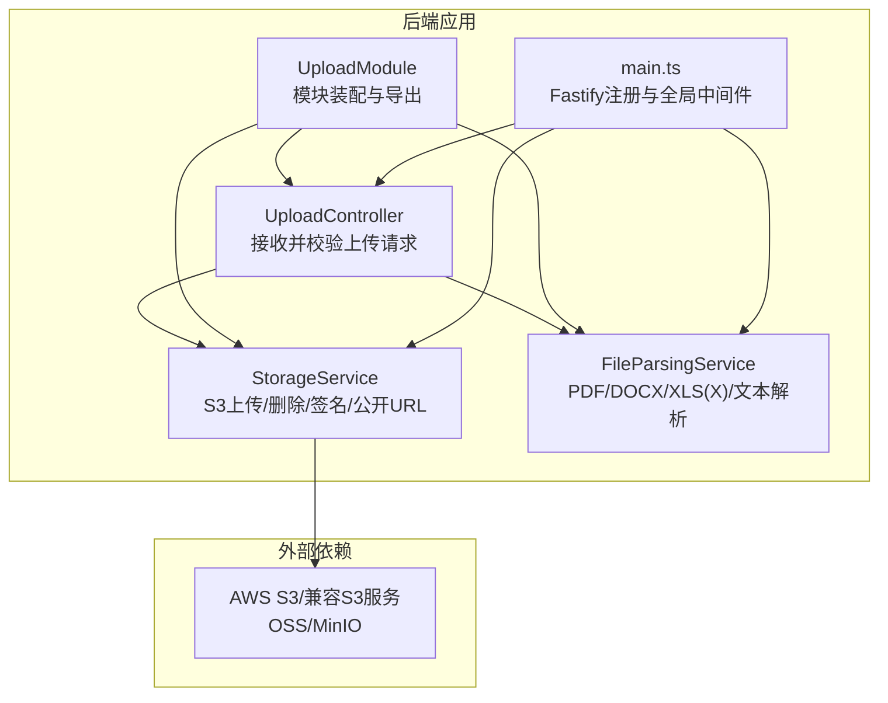
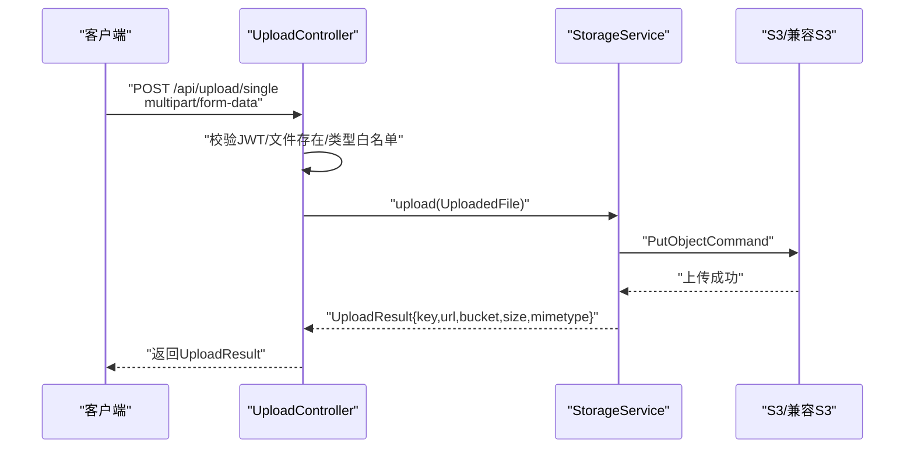
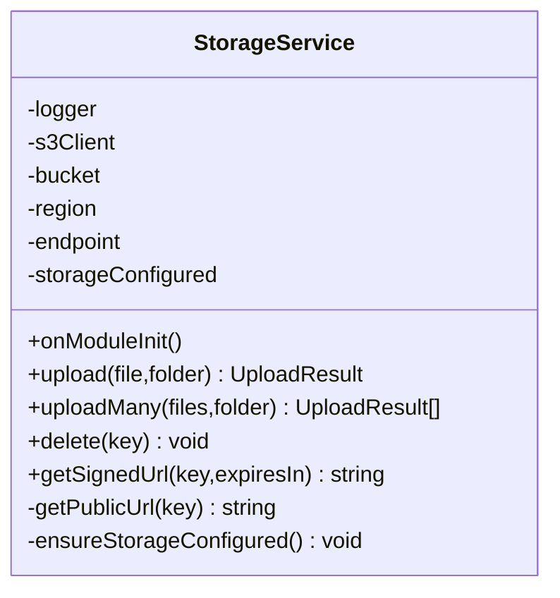
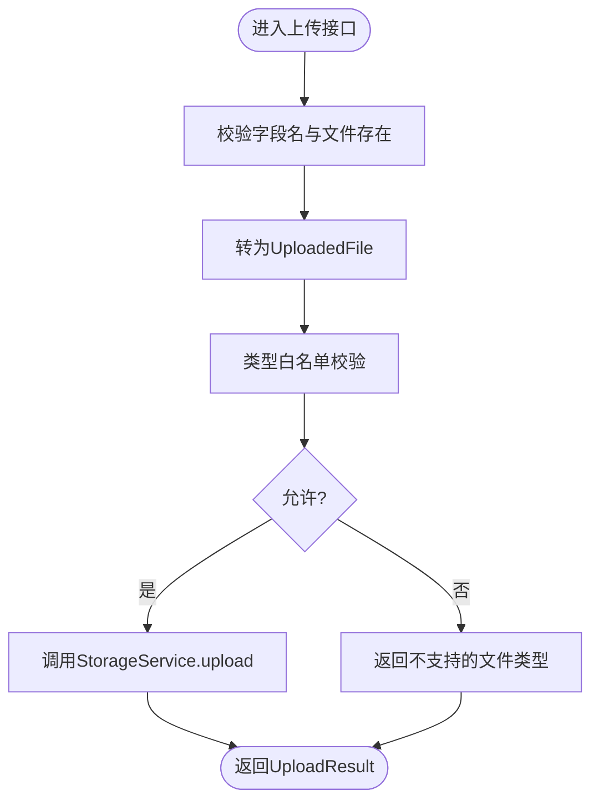
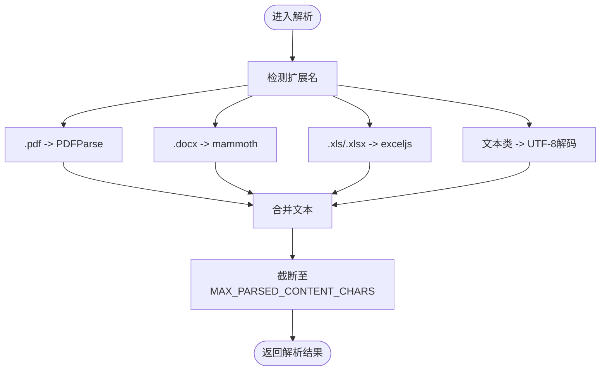
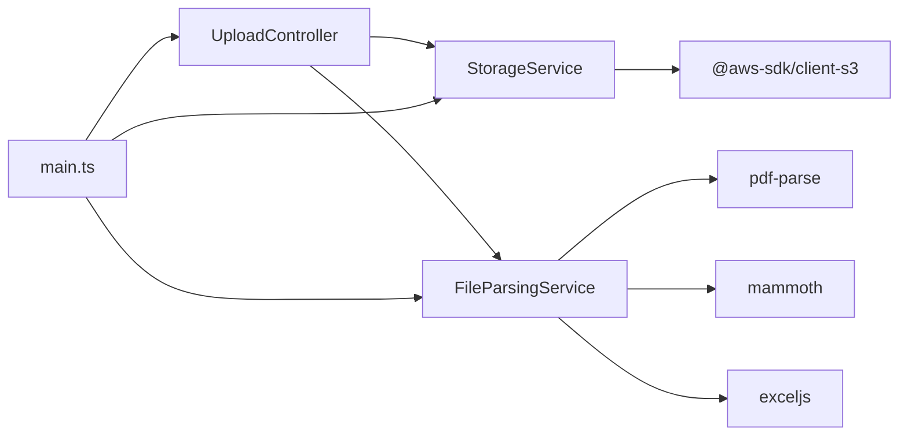

# 存储服务

<cite>
**本文引用的文件**
- [apps/backend/src/upload/storage.service.ts](file://apps/backend/src/upload/storage.service.ts)
- [apps/backend/src/upload/upload.controller.ts](file://apps/backend/src/upload/upload.controller.ts)
- [apps/backend/src/upload/upload.constants.ts](file://apps/backend/src/upload/upload.constants.ts)
- [apps/backend/src/upload/file-parsing.service.ts](file://apps/backend/src/upload/file-parsing.service.ts)
- [apps/backend/src/upload/upload.module.ts](file://apps/backend/src/upload/upload.module.ts)
- [apps/backend/src/main.ts](file://apps/backend/src/main.ts)
- [apps/backend/package.json](file://apps/backend/package.json)
- [docker-compose.yml](file://docker-compose.yml)
- [apps/backend/tests/upload/storage.service.spec.ts](file://apps/backend/tests/upload/storage.service.spec.ts)
</cite>

## 目录
1. [简介](#简介)
2. [项目结构](#项目结构)
3. [核心组件](#核心组件)
4. [架构总览](#架构总览)
5. [详细组件分析](#详细组件分析)
6. [依赖关系分析](#依赖关系分析)
7. [性能考虑](#性能考虑)
8. [故障排查指南](#故障排查指南)
9. [结论](#结论)
10. [附录](#附录)

## 简介
本文件面向Lumina存储服务，系统性阐述文件存储架构设计、云存储集成方案、文件路径生成规则与命名策略、目录结构组织、文件大小限制与配额管理、清理策略、安全与访问控制、防篡改措施、性能优化与缓存策略、CDN集成、配置项与环境变量、故障转移机制、监控指标、容量规划与备份恢复策略。文档基于仓库中实际实现进行分析，并提供可视化图示帮助理解。

## 项目结构
Lumina后端采用NestJS框架，上传与存储能力集中在“upload”模块内，围绕以下文件组织：
- 控制器：接收HTTP请求，校验与转换多部分文件，调用存储与解析服务
- 服务层：封装S3客户端，负责上传、删除、签名URL与公开URL生成
- 解析服务：对特定格式文件进行内容提取与截断
- 常量：白名单扩展名与MIME类型、可解析文本扩展集、最大解析字符数
- 模块：装配控制器、服务与导出依赖
- 入口：Fastify适配器、CSRF防护、压缩、静态资源、Swagger、上传大小与文件数量限制等

图表来源
- [apps/backend/src/upload/upload.controller.ts:24-155](file://apps/backend/src/upload/upload.controller.ts#L24-L155)
- [apps/backend/src/upload/storage.service.ts:32-150](file://apps/backend/src/upload/storage.service.ts#L32-L150)
- [apps/backend/src/upload/file-parsing.service.ts:9-141](file://apps/backend/src/upload/file-parsing.service.ts#L9-L141)
- [apps/backend/src/upload/upload.module.ts:6-15](file://apps/backend/src/upload/upload.module.ts#L6-L15)
- [apps/backend/src/main.ts:34-121](file://apps/backend/src/main.ts#L34-L121)

章节来源
- [apps/backend/src/upload/upload.module.ts:6-15](file://apps/backend/src/upload/upload.module.ts#L6-L15)
- [apps/backend/src/main.ts:34-121](file://apps/backend/src/main.ts#L34-L121)

## 核心组件
- 上传控制器：负责JWT鉴权、多部分文件解析、文件类型校验、批量上传、删除接口、解析接口
- 存储服务：封装S3客户端，支持AWS S3与兼容S3协议的服务（如OSS/MinIO），提供上传、批量上传、删除、预签名URL与公开URL生成
- 文件解析服务：根据扩展名选择解析策略，支持PDF、DOCX、XLS/XLSX；对文本类文件进行UTF-8解码；对解析结果进行长度截断
- 常量与白名单：限定允许的MIME类型与扩展名，定义可解析文本扩展集与最大解析字符数
- 入口与中间件：Fastify注册multipart、压缩、CSRF防护、CSP、静态资源与Swagger；设置全局前缀与异常过滤器

章节来源
- [apps/backend/src/upload/upload.controller.ts:24-155](file://apps/backend/src/upload/upload.controller.ts#L24-L155)
- [apps/backend/src/upload/storage.service.ts:32-150](file://apps/backend/src/upload/storage.service.ts#L32-L150)
- [apps/backend/src/upload/file-parsing.service.ts:9-141](file://apps/backend/src/upload/file-parsing.service.ts#L9-L141)
- [apps/backend/src/upload/upload.constants.ts:1-61](file://apps/backend/src/upload/upload.constants.ts#L1-L61)
- [apps/backend/src/main.ts:34-121](file://apps/backend/src/main.ts#L34-L121)

## 架构总览
Lumina存储服务采用“控制器-服务-外部对象存储”的分层架构。控制器负责请求接入与安全校验，服务层封装S3操作，解析服务提供内容提取能力。上传通过Fastify multipart插件接收，受全局CSRF与CORS保护，最终落盘至S3或兼容S3的对象存储。

图表来源
- [apps/backend/src/upload/upload.controller.ts:68-87](file://apps/backend/src/upload/upload.controller.ts#L68-L87)
- [apps/backend/src/upload/storage.service.ts:72-95](file://apps/backend/src/upload/storage.service.ts#L72-L95)

## 详细组件分析

### 存储服务（StorageService）
- 功能职责
  - 初始化S3客户端：读取S3_BUCKET、S3_REGION、S3_ENDPOINT、S3_ACCESS_KEY_ID、S3_SECRET_ACCESS_KEY；当endpoint存在时启用forcePathStyle以适配OSS/MinIO
  - 上传：生成带UUID的文件Key（按folder/uuid.ext），写入S3，返回UploadResult
  - 批量上传：并发执行上传
  - 删除：删除指定Key
  - 预签名URL：生成临时访问链接（默认过期时间）
  - 公开URL：根据endpoint或AWS S3标准格式拼接
  - 配置检查：若凭证未配置，抛出ServiceUnavailable异常
- 关键点
  - Key生成规则：folder + "/" + UUID + 原文件扩展名
  - 目录结构：通过folder参数控制（默认uploads），便于按业务域隔离
  - 访问策略：默认不设置ACL；可通过公开URL访问（取决于桶策略与对象ACL）
  - 兼容性：endpoint存在时走Path Style，适配OSS/MinIO

图表来源
- [apps/backend/src/upload/storage.service.ts:32-150](file://apps/backend/src/upload/storage.service.ts#L32-L150)

章节来源
- [apps/backend/src/upload/storage.service.ts:32-150](file://apps/backend/src/upload/storage.service.ts#L32-L150)

### 上传控制器（UploadController）
- 功能职责
  - 单文件上传：校验字段名、转换为UploadedFile、调用StorageService.upload
  - 批量上传：遍历files字段，最多10个（受Fastify multipart限制）
  - 文件解析：调用FileParsingService提取文本内容
  - 删除：调用StorageService.delete
  - 安全校验：JWT鉴权、文件必填、类型白名单
- 关键点
  - 类型白名单：ALLOWED_UPLOAD_MIME_TYPES与ALLOWED_UPLOAD_EXTENSIONS双重校验
  - 错误处理：针对缺失字段、不支持类型、解析失败等返回明确错误码

图表来源
- [apps/backend/src/upload/upload.controller.ts:68-87](file://apps/backend/src/upload/upload.controller.ts#L68-L87)
- [apps/backend/src/upload/upload.constants.ts:1-61](file://apps/backend/src/upload/upload.constants.ts#L1-L61)

章节来源
- [apps/backend/src/upload/upload.controller.ts:24-155](file://apps/backend/src/upload/upload.controller.ts#L24-L155)
- [apps/backend/src/upload/upload.constants.ts:1-61](file://apps/backend/src/upload/upload.constants.ts#L1-L61)

### 文件解析服务（FileParsingService）
- 功能职责
  - 根据扩展名选择解析策略：PDF、DOCX、XLS/XLSX；其余文本类扩展名直接UTF-8解码
  - Excel解析：遍历工作表，按行输出CSV风格文本
  - 截断：超过MAX_PARSED_CONTENT_CHARS的文本进行截断并追加标记
  - 异常处理：区分业务异常与未知错误，记录日志并返回标准化错误
- 关键点
  - PARSABLE_TEXT_EXTENSIONS覆盖多种源码与配置文件扩展
  - 截断策略避免超长内容影响下游处理

图表来源
- [apps/backend/src/upload/file-parsing.service.ts:16-72](file://apps/backend/src/upload/file-parsing.service.ts#L16-L72)
- [apps/backend/src/upload/upload.constants.ts:40-61](file://apps/backend/src/upload/upload.constants.ts#L40-L61)

章节来源
- [apps/backend/src/upload/file-parsing.service.ts:9-141](file://apps/backend/src/upload/file-parsing.service.ts#L9-L141)
- [apps/backend/src/upload/upload.constants.ts:1-61](file://apps/backend/src/upload/upload.constants.ts#L1-L61)

### 模块与装配（UploadModule）
- 功能职责
  - 装配UploadController、StorageService、FileParsingService
  - 导出StorageService与FileParsingService供其他模块使用
- 关键点
  - 无额外装饰器或拦截器，保持轻量与高内聚

章节来源
- [apps/backend/src/upload/upload.module.ts:6-15](file://apps/backend/src/upload/upload.module.ts#L6-L15)

### 入口与全局配置（main.ts）
- 功能职责
  - Fastify适配器、CORS、Helmet、Cookie、压缩、CSRF防护钩子、静态资源、Swagger
  - 上传限制：UPLOAD_MAX_SIZE（字节）、UPLOAD_MAX_FILES（数量）
  - 全局异常过滤器、响应拦截器、XSS清理拦截器
- 关键点
  - 通过环境变量控制上传大小与数量，避免过大文件导致内存压力
  - CSRF防护要求X-Requested-With头，提升安全性

章节来源
- [apps/backend/src/main.ts:34-121](file://apps/backend/src/main.ts#L34-L121)

## 依赖关系分析
- 内部依赖
  - UploadController依赖StorageService与FileParsingService
  - StorageService依赖@aws-sdk/client-s3与@aws-sdk/s3-request-presigner
  - FileParsingService依赖pdf-parse、mammoth、exceljs
- 外部依赖
  - S3/兼容S3（AWS S3、阿里云OSS、MinIO）
  - Fastify生态（multipart、compress、helmet、cookie、static）
- 配置依赖
  - S3相关环境变量在docker-compose中注入

图表来源
- [apps/backend/src/upload/upload.controller.ts:24-28](file://apps/backend/src/upload/upload.controller.ts#L24-L28)
- [apps/backend/src/upload/storage.service.ts:1-11](file://apps/backend/src/upload/storage.service.ts#L1-L11)
- [apps/backend/src/upload/file-parsing.service.ts:1-7](file://apps/backend/src/upload/file-parsing.service.ts#L1-L7)
- [apps/backend/src/main.ts:22-29](file://apps/backend/src/main.ts#L22-L29)

章节来源
- [apps/backend/src/upload/storage.service.ts:1-11](file://apps/backend/src/upload/storage.service.ts#L1-L11)
- [apps/backend/src/upload/file-parsing.service.ts:1-7](file://apps/backend/src/upload/file-parsing.service.ts#L1-L7)
- [apps/backend/src/main.ts:22-29](file://apps/backend/src/main.ts#L22-L29)

## 性能考虑
- 上传性能
  - Fastify multipart限制上传大小与文件数量，避免内存峰值过高
  - 批量上传采用Promise.all并发执行，提升吞吐
- 缓存策略
  - 当前未见显式的对象存储侧缓存配置；可在S3层结合生命周期规则与CDN实现缓存与加速
- CDN集成
  - 可通过公开URL接入CDN；对于私有对象，使用预签名URL在CDN边缘缓存短期有效内容
- 压缩与传输
  - 启用gzip压缩降低带宽占用
- 解析性能
  - 对大体积Excel/PDF建议在队列异步处理，避免阻塞上传接口

章节来源
- [apps/backend/src/main.ts:106-113](file://apps/backend/src/main.ts#L106-L113)
- [apps/backend/src/upload/storage.service.ts:100-102](file://apps/backend/src/upload/storage.service.ts#L100-L102)

## 故障排查指南
- 存储未配置
  - 现象：调用上传/删除/签名接口抛出“STORAGE_NOT_CONFIGURED”
  - 原因：S3_ACCESS_KEY_ID或S3_SECRET_ACCESS_KEY为空
  - 处理：在环境变量中补齐S3凭证或配置endpoint以启用兼容模式
- 文件类型不被支持
  - 现象：返回“不支持的文件类型”
  - 原因：不在ALLOWED_UPLOAD_MIME_TYPES或ALLOWED_UPLOAD_EXTENSIONS白名单
  - 处理：确认扩展名与MIME类型，或扩展白名单
- 解析失败
  - 现象：返回“文件解析失败”或具体业务异常
  - 原因：解析器内部异常或输入格式不匹配
  - 处理：检查文件完整性与扩展名映射，关注日志
- CSRF防护拦截
  - 现象：非安全方法缺少X-Requested-With头被拒绝
  - 处理：确保前端请求携带该头部

章节来源
- [apps/backend/src/upload/storage.service.ts:143-149](file://apps/backend/src/upload/storage.service.ts#L143-L149)
- [apps/backend/src/upload/upload.controller.ts:51-63](file://apps/backend/src/upload/upload.controller.ts#L51-L63)
- [apps/backend/src/upload/file-parsing.service.ts:48-72](file://apps/backend/src/upload/file-parsing.service.ts#L48-L72)
- [apps/backend/src/main.ts:142-156](file://apps/backend/src/main.ts#L142-L156)

## 结论
Lumina存储服务以清晰的分层架构实现了上传、解析与对象存储集成。通过严格的类型白名单、CSRF与CORS防护、压缩与静态资源服务，保障了安全性与可用性。当前未内置本地存储与配额管理、清理策略、缓存与CDN配置，但具备良好的扩展点：可在S3层引入生命周期规则与CDN缓存，在应用层增加配额与清理任务。建议后续补充容量监控与备份策略，完善运维可观测性。

## 附录

### 文件路径生成规则与命名策略
- Key生成：folder + "/" + UUID + 原文件扩展名
- 目录结构：通过folder参数控制，默认“uploads”，便于按业务域隔离
- 命名策略：UUID保证唯一性，避免重名冲突与路径遍历风险

章节来源
- [apps/backend/src/upload/storage.service.ts:74-75](file://apps/backend/src/upload/storage.service.ts#L74-L75)

### 目录结构组织
- 业务域隔离：通过folder参数将不同业务的文件归档至独立目录
- 统一入口：控制器统一暴露单文件、批量、解析、删除接口

章节来源
- [apps/backend/src/upload/upload.controller.ts:68-144](file://apps/backend/src/upload/upload.controller.ts#L68-L144)

### 文件大小限制与配额管理
- 上传大小限制：通过UPLOAD_MAX_SIZE（字节）控制
- 上传文件数量限制：通过UPLOAD_MAX_FILES（数量）控制
- 配额管理：当前未实现用户级配额；建议在业务层引入配额模型并在上传前校验

章节来源
- [apps/backend/src/main.ts:106-113](file://apps/backend/src/main.ts#L106-L113)

### 清理策略
- 当前未实现自动清理；建议结合S3生命周期规则与定期任务清理过期对象

### 安全机制与访问控制
- 认证：JWT鉴权保护上传与删除接口
- 授权：控制器层按业务逻辑控制访问范围
- 防护：Helmet、CSP、CSRF防护、XSS清理、压缩
- 访问策略：默认不设置ACL；可通过公开URL或预签名URL控制访问

章节来源
- [apps/backend/src/upload/upload.controller.ts:22-28](file://apps/backend/src/upload/upload.controller.ts#L22-L28)
- [apps/backend/src/main.ts:84-121](file://apps/backend/src/main.ts#L84-L121)

### 防篡改措施
- 传输安全：HTTPS与CSP
- 请求校验：CSRF防护与类型白名单
- 内容截断：解析结果长度限制，降低恶意内容影响面

章节来源
- [apps/backend/src/main.ts:84-121](file://apps/backend/src/main.ts#L84-L121)
- [apps/backend/src/upload/file-parsing.service.ts:134-140](file://apps/backend/src/upload/file-parsing.service.ts#L134-L140)

### 缓存策略与CDN集成
- 缓存：可在S3层设置对象缓存策略
- CDN：通过公开URL接入CDN；私有对象使用预签名URL在CDN边缘缓存短期有效内容

章节来源
- [apps/backend/src/upload/storage.service.ts:134-141](file://apps/backend/src/upload/storage.service.ts#L134-L141)

### 存储配置选项与环境变量
- S3相关
  - S3_BUCKET：桶名称
  - S3_REGION：区域
  - S3_ENDPOINT：可选，用于OSS/MinIO
  - S3_ACCESS_KEY_ID：访问密钥ID
  - S3_SECRET_ACCESS_KEY：访问密钥
- 上传限制
  - UPLOAD_MAX_SIZE：单次上传大小上限（字节）
  - UPLOAD_MAX_FILES：单次上传文件数量上限
- 其他
  - CORS_ORIGIN：跨域来源
  - JWT_SECRET/JWT_REFRESH_SECRET：JWT密钥
  - REDIS_*：缓存与消息队列配置

章节来源
- [apps/backend/src/upload/storage.service.ts:44-49](file://apps/backend/src/upload/storage.service.ts#L44-L49)
- [apps/backend/src/main.ts:106-113](file://apps/backend/src/main.ts#L106-L113)
- [docker-compose.yml:111-111](file://docker-compose.yml#L111-L111)

### 故障转移机制
- 当前未实现多活/故障转移；建议在S3层启用跨区域复制或在应用层引入多桶冗余策略

### 监控指标与容量规划
- 监控指标建议
  - 上传成功率、失败率、平均耗时
  - S3存储用量、对象数量、请求计数
  - 解析任务队列长度与耗时
- 容量规划建议
  - 基于历史上传量与增长趋势估算S3容量
  - 为峰值流量预留缓冲，结合CDN与压缩降低带宽成本

### 备份与恢复策略
- 建议
  - 对关键元数据进行数据库备份
  - 对S3对象进行跨区域复制与版本控制
  - 制定演练计划，验证恢复流程