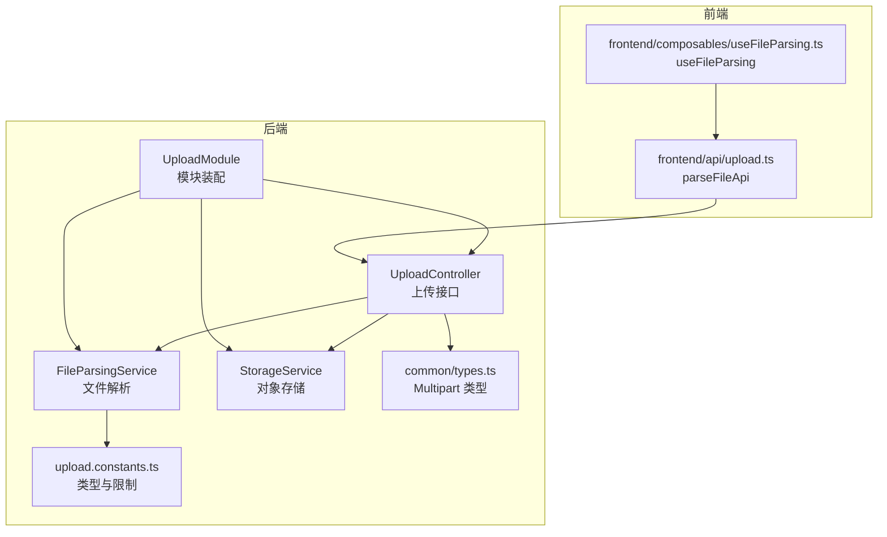
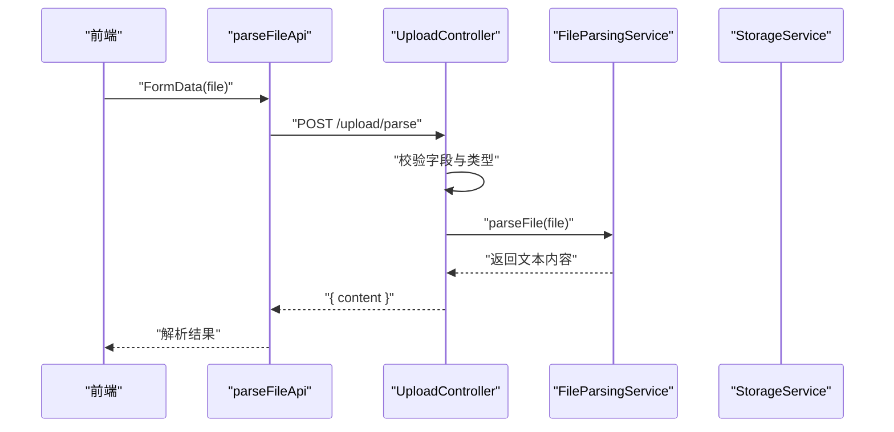
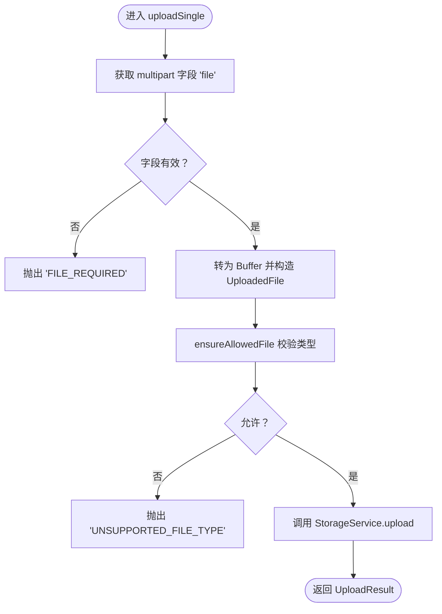
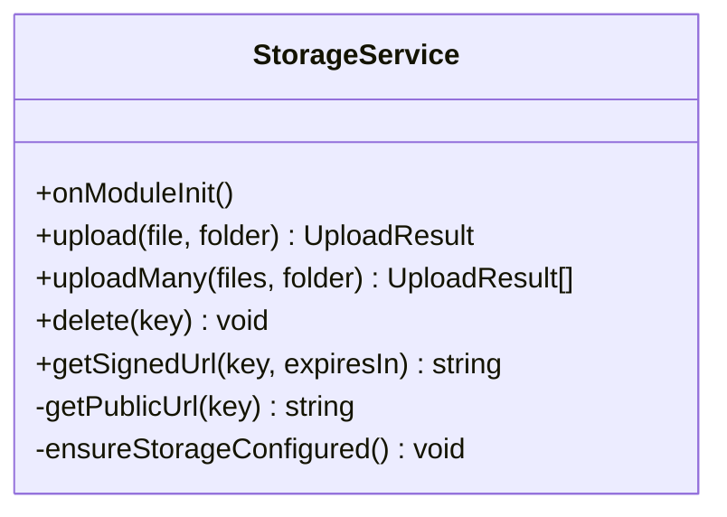
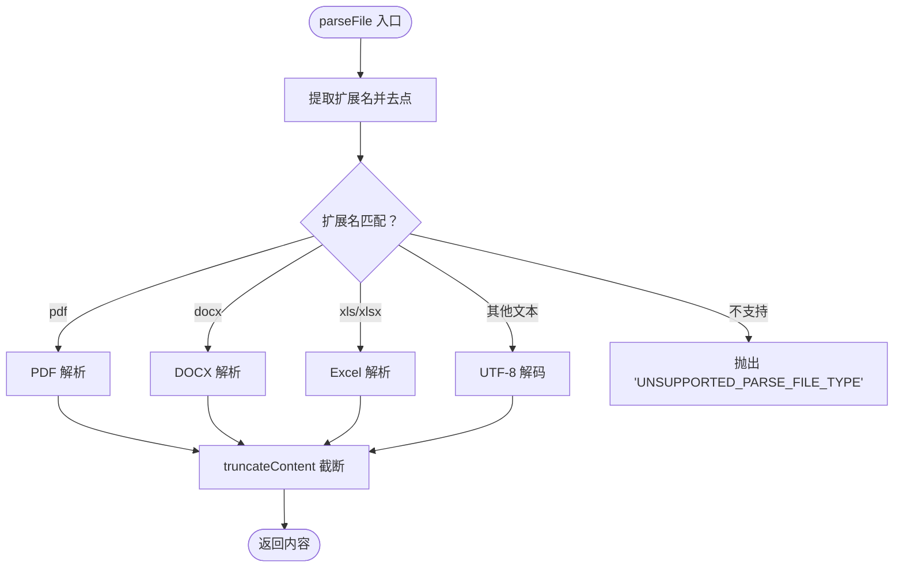
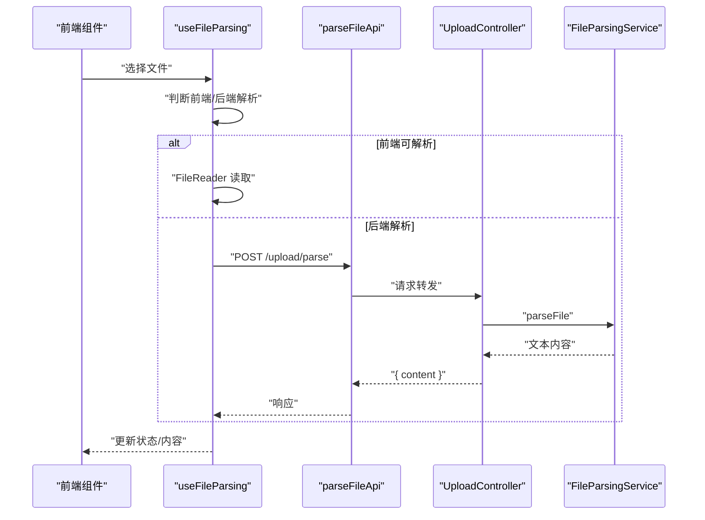
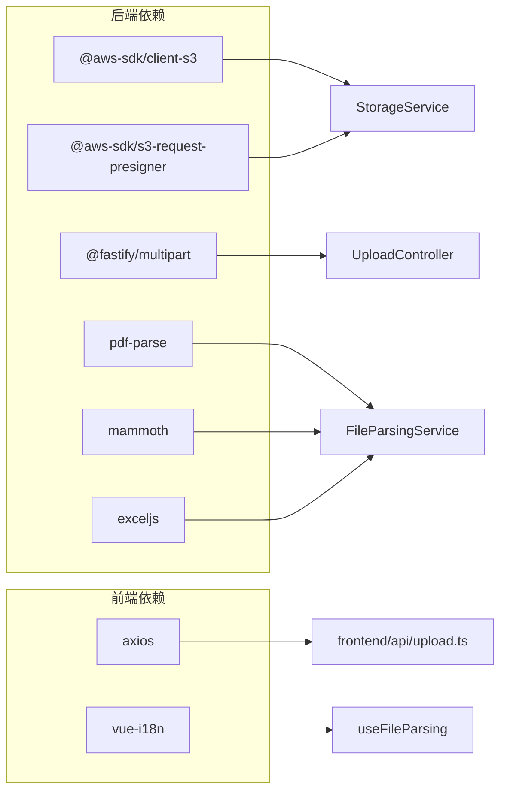

# 文件上传

<cite>
**本文引用的文件**
- [apps/backend/src/upload/upload.controller.ts](file://apps/backend/src/upload/upload.controller.ts)
- [apps/backend/src/upload/storage.service.ts](file://apps/backend/src/upload/storage.service.ts)
- [apps/backend/src/upload/file-parsing.service.ts](file://apps/backend/src/upload/file-parsing.service.ts)
- [apps/backend/src/upload/upload.module.ts](file://apps/backend/src/upload/upload.module.ts)
- [apps/backend/src/upload/upload.constants.ts](file://apps/backend/src/upload/upload.constants.ts)
- [apps/backend/src/common/types.ts](file://apps/backend/src/common/types.ts)
- [apps/backend/src/i18n/en-US/upload.ts](file://apps/backend/src/i18n/en-US/upload.ts)
- [apps/backend/src/i18n/zh-CN/upload.ts](file://apps/backend/src/i18n/zh-CN/upload.ts)
- [apps/frontend/src/api/upload.ts](file://apps/frontend/src/api/upload.ts)
- [apps/frontend/src/composables/useFileParsing.ts](file://apps/frontend/src/composables/useFileParsing.ts)
- [apps/backend/package.json](file://apps/backend/package.json)
- [apps/frontend/package.json](file://apps/frontend/package.json)
- [apps/backend/tests/upload/upload.controller.spec.ts](file://apps/backend/tests/upload/upload.controller.spec.ts)
- [apps/backend/tests/upload/file-parsing.service.spec.ts](file://apps/backend/tests/upload/file-parsing.service.spec.ts)
- [apps/backend/tests/upload/storage.service.spec.ts](file://apps/backend/tests/upload/storage.service.spec.ts)
</cite>

## 目录
1. [简介](#简介)
2. [项目结构](#项目结构)
3. [核心组件](#核心组件)
4. [架构总览](#架构总览)
5. [详细组件分析](#详细组件分析)
6. [依赖关系分析](#依赖关系分析)
7. [性能考量](#性能考量)
8. [故障排查指南](#故障排查指南)
9. [结论](#结论)
10. [附录](#附录)

## 简介
本技术文档围绕 Lumina 的文件上传系统展开，覆盖接口设计、Multipart 解析、文件类型与大小限制、存储服务配置（本地与云存储）、文件路径管理、文件类型验证与安全扫描、文件解析与元数据提取、缩略图生成现状、上传进度与断点续传支持现状、批量上传能力、以及文件管理最佳实践与安全防护策略。文档以代码为依据，结合前后端实现细节，帮助开发者快速理解与扩展系统。

## 项目结构
- 后端采用 NestJS + Fastify 平台，上传模块位于 apps/backend/src/upload，包含控制器、存储服务、文件解析服务与常量定义。
- 前端位于 apps/frontend，提供文件解析的组合式函数与 API 调用封装。
- 国际化错误消息位于 apps/backend/src/i18n/{lang}/upload.ts。

图表来源
- [apps/backend/src/upload/upload.controller.ts:1-156](file://apps/backend/src/upload/upload.controller.ts#L1-L156)
- [apps/backend/src/upload/storage.service.ts:1-151](file://apps/backend/src/upload/storage.service.ts#L1-L151)
- [apps/backend/src/upload/file-parsing.service.ts:1-142](file://apps/backend/src/upload/file-parsing.service.ts#L1-L142)
- [apps/backend/src/upload/upload.module.ts:1-16](file://apps/backend/src/upload/upload.module.ts#L1-L16)
- [apps/backend/src/upload/upload.constants.ts:1-61](file://apps/backend/src/upload/upload.constants.ts#L1-L61)
- [apps/backend/src/common/types.ts:1-16](file://apps/backend/src/common/types.ts#L1-L16)
- [apps/frontend/src/api/upload.ts:1-23](file://apps/frontend/src/api/upload.ts#L1-L23)
- [apps/frontend/src/composables/useFileParsing.ts:1-122](file://apps/frontend/src/composables/useFileParsing.ts#L1-L122)

章节来源
- [apps/backend/src/upload/upload.module.ts:1-16](file://apps/backend/src/upload/upload.module.ts#L1-L16)
- [apps/backend/src/upload/upload.controller.ts:1-156](file://apps/backend/src/upload/upload.controller.ts#L1-L156)
- [apps/backend/src/upload/storage.service.ts:1-151](file://apps/backend/src/upload/storage.service.ts#L1-L151)
- [apps/backend/src/upload/file-parsing.service.ts:1-142](file://apps/backend/src/upload/file-parsing.service.ts#L1-L142)
- [apps/backend/src/upload/upload.constants.ts:1-61](file://apps/backend/src/upload/upload.constants.ts#L1-L61)
- [apps/backend/src/common/types.ts:1-16](file://apps/backend/src/common/types.ts#L1-L16)
- [apps/frontend/src/api/upload.ts:1-23](file://apps/frontend/src/api/upload.ts#L1-L23)
- [apps/frontend/src/composables/useFileParsing.ts:1-122](file://apps/frontend/src/composables/useFileParsing.ts#L1-L122)

## 核心组件
- 上传控制器：负责接收 multipart 请求、校验字段与文件类型、调用存储与解析服务，并返回标准化结果。
- 存储服务：封装 AWS S3/兼容 S3（如 OSS/MinIO）客户端，提供上传、批量上传、删除、签名 URL 与公开 URL 生成。
- 文件解析服务：对 PDF、DOCX、XLS/XLSX 等格式进行内容提取；对纯文本/代码类扩展名进行 UTF-8 解码；统一截断超长内容。
- 上传模块：装配控制器、存储与解析服务，导出所需依赖。
- 上传常量：集中定义允许的 MIME 类型、扩展名、可解析文本扩展名与最大解析字符数。
- 公共类型：定义 Fastify 的 Multipart 请求与文件类型，确保控制器与底层库一致。

章节来源
- [apps/backend/src/upload/upload.controller.ts:1-156](file://apps/backend/src/upload/upload.controller.ts#L1-L156)
- [apps/backend/src/upload/storage.service.ts:1-151](file://apps/backend/src/upload/storage.service.ts#L1-L151)
- [apps/backend/src/upload/file-parsing.service.ts:1-142](file://apps/backend/src/upload/file-parsing.service.ts#L1-L142)
- [apps/backend/src/upload/upload.module.ts:1-16](file://apps/backend/src/upload/upload.module.ts#L1-L16)
- [apps/backend/src/upload/upload.constants.ts:1-61](file://apps/backend/src/upload/upload.constants.ts#L1-L61)
- [apps/backend/src/common/types.ts:1-16](file://apps/backend/src/common/types.ts#L1-L16)

## 架构总览
下图展示从浏览器到后端的典型上传与解析流程，包括 JWT 认证、Multipart 解析、类型校验、存储与解析服务调用。

图表来源
- [apps/frontend/src/api/upload.ts:1-23](file://apps/frontend/src/api/upload.ts#L1-L23)
- [apps/backend/src/upload/upload.controller.ts:92-112](file://apps/backend/src/upload/upload.controller.ts#L92-L112)
- [apps/backend/src/upload/file-parsing.service.ts:16-72](file://apps/backend/src/upload/file-parsing.service.ts#L16-L72)

章节来源
- [apps/frontend/src/api/upload.ts:1-23](file://apps/frontend/src/api/upload.ts#L1-L23)
- [apps/backend/src/upload/upload.controller.ts:92-112](file://apps/backend/src/upload/upload.controller.ts#L92-L112)
- [apps/backend/src/upload/file-parsing.service.ts:16-72](file://apps/backend/src/upload/file-parsing.service.ts#L16-L72)

## 详细组件分析

### 上传控制器（UploadController）
- 单文件上传：接收名为 file 的 multipart 字段，转换为通用 UploadedFile，执行类型校验后调用存储服务上传。
- 批量上传：接收名为 files 的数组字段，逐个转换并并行上传，返回多条结果。
- 文件解析：接收文件并调用解析服务，返回纯文本内容（不持久化）。
- 删除文件：基于鉴权与存储服务提供的删除能力。
- 类型校验：同时检查 MIME 类型与扩展名，不满足则抛出对应国际化错误。

图表来源
- [apps/backend/src/upload/upload.controller.ts:79-87](file://apps/backend/src/upload/upload.controller.ts#L79-L87)
- [apps/backend/src/upload/upload.controller.ts:30-63](file://apps/backend/src/upload/upload.controller.ts#L30-L63)

章节来源
- [apps/backend/src/upload/upload.controller.ts:1-156](file://apps/backend/src/upload/upload.controller.ts#L1-L156)
- [apps/backend/src/i18n/en-US/upload.ts:1-10](file://apps/backend/src/i18n/en-US/upload.ts#L1-L10)
- [apps/backend/src/i18n/zh-CN/upload.ts:1-10](file://apps/backend/src/i18n/zh-CN/upload.ts#L1-L10)

### 存储服务（StorageService）
- 初始化：从配置读取 S3 区域、桶、可选 endpoint（用于 OSS/MinIO），凭据为空时记录警告并拒绝后续操作。
- 上传：生成带扩展名的唯一 key（uploads/uuid.ext），设置 Content-Type，返回 key、公开 URL、桶名、大小与 MIME。
- 批量上传：Promise.all 并行处理。
- 删除：删除指定 key。
- 签名 URL：生成带过期时间的私有访问 URL。
- 公开 URL：根据是否存在 endpoint 判断 OSS/MinIO 或 AWS S3 格式。

图表来源
- [apps/backend/src/upload/storage.service.ts:32-151](file://apps/backend/src/upload/storage.service.ts#L32-L151)

章节来源
- [apps/backend/src/upload/storage.service.ts:1-151](file://apps/backend/src/upload/storage.service.ts#L1-L151)

### 文件解析服务（FileParsingService）
- 支持格式：PDF、DOCX、XLS/XLSX；其他扩展名若在可解析文本列表中则按 UTF-8 解码。
- 错误处理：区分业务异常与通用异常，前者透传国际化消息，后者统一为“解析失败”。
- 截断策略：超过最大字符数时截断并追加省略标记。

图表来源
- [apps/backend/src/upload/file-parsing.service.ts:16-72](file://apps/backend/src/upload/file-parsing.service.ts#L16-L72)
- [apps/backend/src/upload/upload.constants.ts:40-61](file://apps/backend/src/upload/upload.constants.ts#L40-L61)

章节来源
- [apps/backend/src/upload/file-parsing.service.ts:1-142](file://apps/backend/src/upload/file-parsing.service.ts#L1-L142)
- [apps/backend/src/upload/upload.constants.ts:1-61](file://apps/backend/src/upload/upload.constants.ts#L1-L61)

### 前端解析与调用
- parseFileApi：构造 FormData，调用 /upload/parse，设置 Content-Type 为 null 以让浏览器自动生成边界。
- useFileParsing：混合解析策略
  - 前端可解析：直接 FileReader 读取文本。
  - 后端解析：需要登录态，调用 parseFileApi，截断长度并提示。
- 组件层：在聊天输入附件区域展示解析后的文件列表与状态。

图表来源
- [apps/frontend/src/composables/useFileParsing.ts:47-95](file://apps/frontend/src/composables/useFileParsing.ts#L47-L95)
- [apps/frontend/src/api/upload.ts:11-22](file://apps/frontend/src/api/upload.ts#L11-L22)
- [apps/backend/src/upload/upload.controller.ts:103-112](file://apps/backend/src/upload/upload.controller.ts#L103-L112)
- [apps/backend/src/upload/file-parsing.service.ts:16-72](file://apps/backend/src/upload/file-parsing.service.ts#L16-L72)

章节来源
- [apps/frontend/src/api/upload.ts:1-23](file://apps/frontend/src/api/upload.ts#L1-L23)
- [apps/frontend/src/composables/useFileParsing.ts:1-122](file://apps/frontend/src/composables/useFileParsing.ts#L1-L122)

## 依赖关系分析
- 后端依赖
  - @aws-sdk/client-s3 与 @aws-sdk/s3-request-presigner：S3/兼容存储客户端与签名 URL。
  - fastify multipart：Multipart 请求解析。
  - pdf-parse、mammoth、exceljs：文档解析。
  - nestjs/swagger、jwt、helmet、cors 等：接口文档、认证、安全与跨域。
- 前端依赖
  - axios：HTTP 客户端。
  - pinia、vue-i18n：状态与国际化。
  - lucide-vue-next、tailwind 等：UI 组件与样式。

图表来源
- [apps/backend/package.json:30-86](file://apps/backend/package.json#L30-L86)
- [apps/frontend/package.json:30-70](file://apps/frontend/package.json#L30-L70)

章节来源
- [apps/backend/package.json:1-108](file://apps/backend/package.json#L1-L108)
- [apps/frontend/package.json:1-104](file://apps/frontend/package.json#L1-L104)

## 性能考量
- 并发上传：StorageService.uploadMany 使用 Promise.all 并行处理，显著提升批量上传吞吐。
- 内存占用：解析服务将 Buffer 转为字符串，注意大文件内存压力；建议前端仅对小文件走后端解析或分块处理。
- 传输效率：S3/MinIO/兼容存储具备高并发与低延迟特性；可结合 CDN 提升静态资源访问速度。
- 缓存策略：结合前端缓存与后端签名 URL 过期控制，平衡安全性与性能。

## 故障排查指南
- 常见错误与定位
  - 未选择文件：upload.FILE_REQUIRED（前端提示“请选择要上传的文件”）。
  - 不支持的文件类型：upload.UNSUPPORTED_FILE_TYPE（MIME 或扩展名不在允许列表）。
  - 不支持解析的文件类型：upload.UNSUPPORTED_PARSE_FILE_TYPE。
  - 文件解析失败：upload.FILE_PARSING_FAILED（通用异常兜底）。
  - 对象存储未配置：upload.STORAGE_NOT_CONFIGURED（S3 凭据缺失）。
- 测试用例参考
  - 控制器：单文件与多文件上传、不支持 MIME 的场景。
  - 解析服务：不支持扩展名与超长内容截断。
  - 存储服务：凭据缺失时拒绝操作。

章节来源
- [apps/backend/src/i18n/en-US/upload.ts:1-10](file://apps/backend/src/i18n/en-US/upload.ts#L1-L10)
- [apps/backend/src/i18n/zh-CN/upload.ts:1-10](file://apps/backend/src/i18n/zh-CN/upload.ts#L1-L10)
- [apps/backend/tests/upload/upload.controller.spec.ts:1-51](file://apps/backend/tests/upload/upload.controller.spec.ts#L1-L51)
- [apps/backend/tests/upload/file-parsing.service.spec.ts:1-52](file://apps/backend/tests/upload/file-parsing.service.spec.ts#L1-L52)
- [apps/backend/tests/upload/storage.service.spec.ts:1-72](file://apps/backend/tests/upload/storage.service.spec.ts#L1-L72)

## 结论
Lumina 文件上传系统以清晰的职责分离实现了“上传—解析—存储”的闭环：控制器负责协议与类型校验，解析服务覆盖常见办公文档与文本，存储服务对接 S3/兼容存储并提供签名 URL 能力。当前系统未内置文件大小限制、恶意文件检测与安全扫描、缩略图生成、上传进度与断点续传功能，可在保持现有模块边界的前提下逐步扩展。

## 附录

### 接口与数据模型

- 上传接口
  - 单文件上传：POST /upload/single（multipart/form-data，字段 file）
  - 批量上传：POST /upload/multiple（multipart/form-data，字段 files[]）
  - 解析文件：POST /upload/parse（multipart/form-data，字段 file）
  - 删除文件：DELETE /upload/:key
- 返回模型 UploadResult
  - key：对象键
  - url：公开访问 URL
  - bucket：桶名
  - size：字节数
  - mimetype：MIME 类型
- 上传常量
  - 允许的 MIME 类型与扩展名
  - 可解析文本扩展名
  - 最大解析字符数

章节来源
- [apps/backend/src/upload/upload.controller.ts:68-154](file://apps/backend/src/upload/upload.controller.ts#L68-L154)
- [apps/backend/src/upload/storage.service.ts:13-26](file://apps/backend/src/upload/storage.service.ts#L13-L26)
- [apps/backend/src/upload/upload.constants.ts:1-61](file://apps/backend/src/upload/upload.constants.ts#L1-L61)

### 文件类型与大小限制
- 类型限制：通过 ALLOWED_UPLOAD_MIME_TYPES 与 ALLOWED_UPLOAD_EXTENSIONS 双重校验。
- 大小限制：当前代码未显式设置大小上限；可在 Fastify multipart 配置或控制器参数校验处增加限制，避免内存与带宽压力。

章节来源
- [apps/backend/src/upload/upload.controller.ts:51-63](file://apps/backend/src/upload/upload.controller.ts#L51-L63)
- [apps/backend/src/upload/upload.constants.ts:1-61](file://apps/backend/src/upload/upload.constants.ts#L1-L61)

### 存储服务配置与路径管理
- 配置项：S3_BUCKET、S3_REGION、S3_ACCESS_KEY_ID、S3_SECRET_ACCESS_KEY、S3_ENDPOINT（可选）。
- 路径规则：uploads/{uuid}.{ext}，支持自定义 folder 参数。
- URL 生成：endpoint 存在时使用 OSS/MinIO 格式，否则使用 AWS S3 格式。

章节来源
- [apps/backend/src/upload/storage.service.ts:43-67](file://apps/backend/src/upload/storage.service.ts#L43-L67)
- [apps/backend/src/upload/storage.service.ts:72-95](file://apps/backend/src/upload/storage.service.ts#L72-L95)
- [apps/backend/src/upload/storage.service.ts:134-141](file://apps/backend/src/upload/storage.service.ts#L134-L141)

### 文件解析与元数据提取
- 支持格式：PDF、DOCX、XLS/XLSX；文本/代码类扩展名按 UTF-8 解码。
- 元数据：返回 mimetype、size；内容长度受 MAX_PARSED_CONTENT_CHARS 限制。
- 缩略图：当前未实现图片缩略图生成逻辑。

章节来源
- [apps/backend/src/upload/file-parsing.service.ts:16-72](file://apps/backend/src/upload/file-parsing.service.ts#L16-L72)
- [apps/backend/src/upload/upload.constants.ts:40-61](file://apps/backend/src/upload/upload.constants.ts#L40-L61)

### 安全与合规
- 认证：JWT 认证守卫保护上传接口。
- CORS 与安全头：后端依赖 @fastify/cors 与 @fastify/helmet，默认启用。
- 国际化错误：统一返回 upload.* 键值，便于前端本地化提示。
- 建议增强：引入文件病毒扫描、敏感词检测、白名单策略与速率限制。

章节来源
- [apps/backend/src/upload/upload.controller.ts:20-24](file://apps/backend/src/upload/upload.controller.ts#L20-L24)
- [apps/backend/package.json:33-38](file://apps/backend/package.json#L33-L38)
- [apps/backend/src/i18n/en-US/upload.ts:1-10](file://apps/backend/src/i18n/en-US/upload.ts#L1-L10)
- [apps/backend/src/i18n/zh-CN/upload.ts:1-10](file://apps/backend/src/i18n/zh-CN/upload.ts#L1-L10)

### 扩展建议（非当前实现）
- 上传进度与断点续传：建议引入分片上传（如 S3 分段上传）与前端进度回调。
- 批量上传优化：结合队列与并发度控制，避免瞬时峰值。
- 安全扫描：集成第三方 AV 引擎与内容审核服务。
- 缩略图：针对图片生成多尺寸缩略图并缓存。
- 存储优化：冷热分层、生命周期策略、CDN 加速。