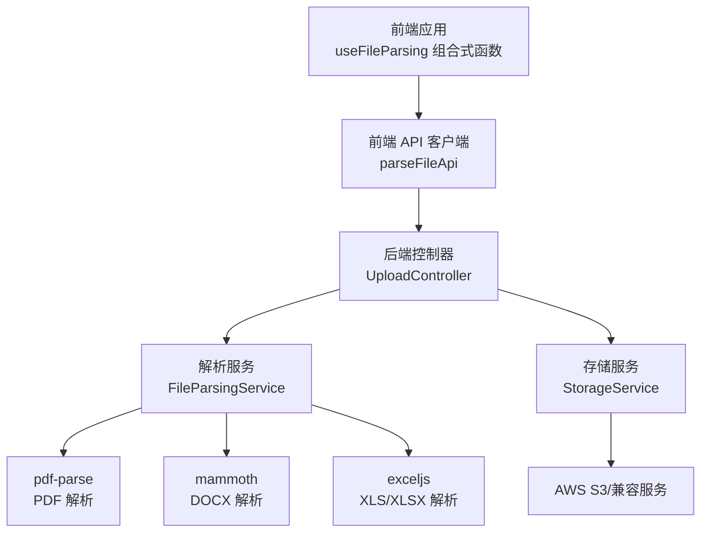
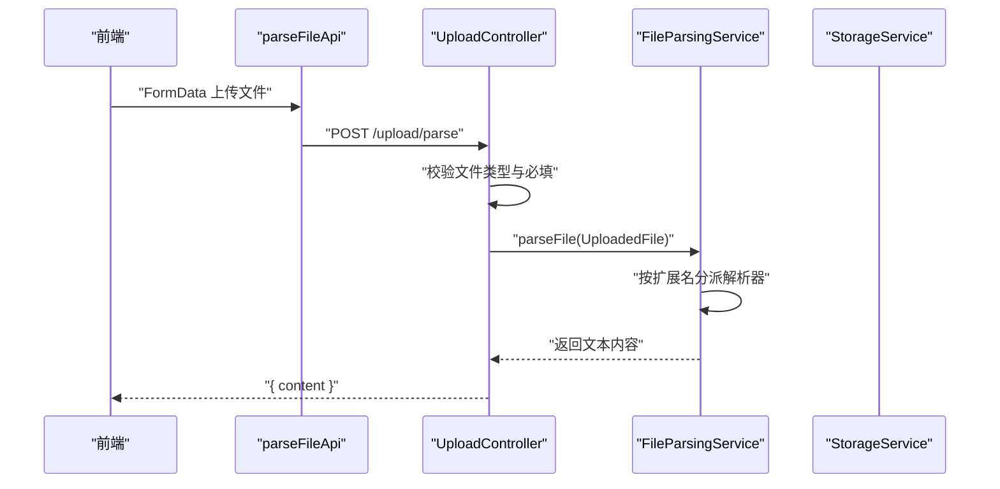
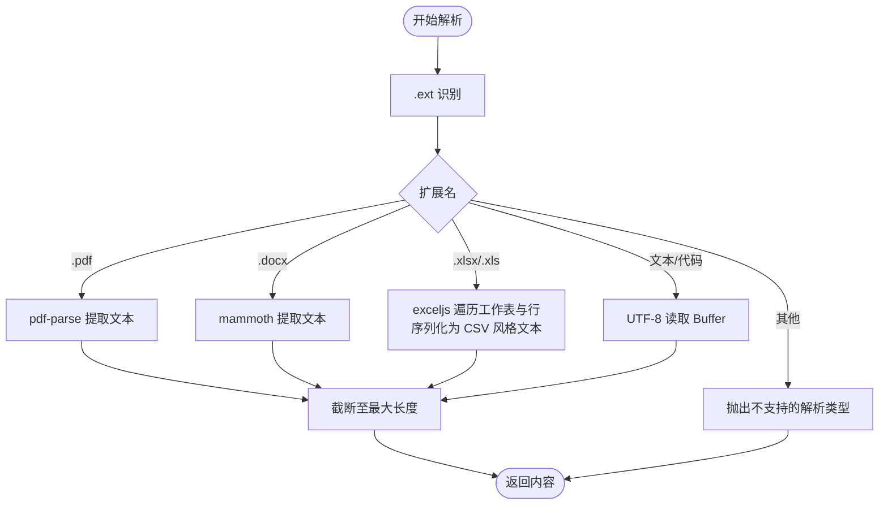
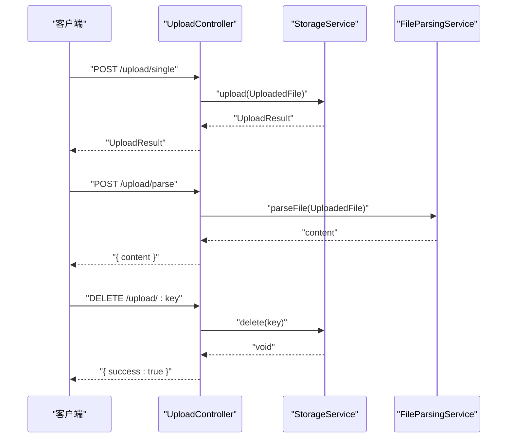
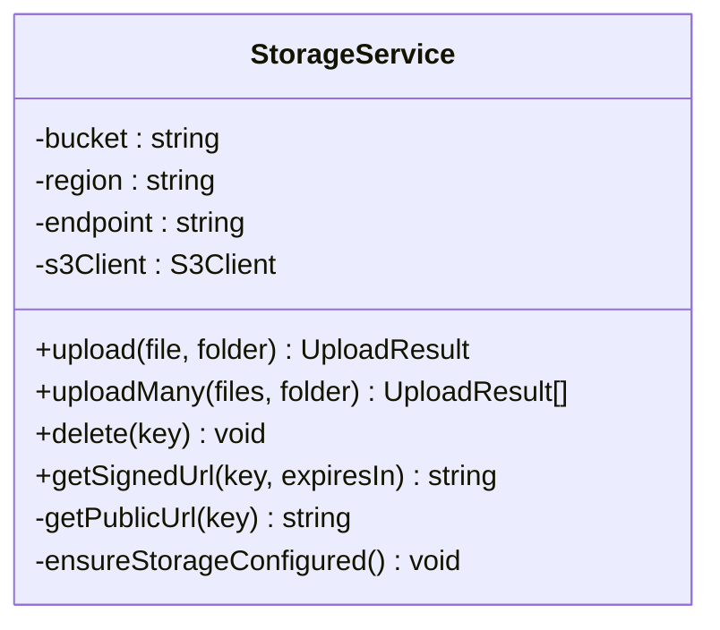
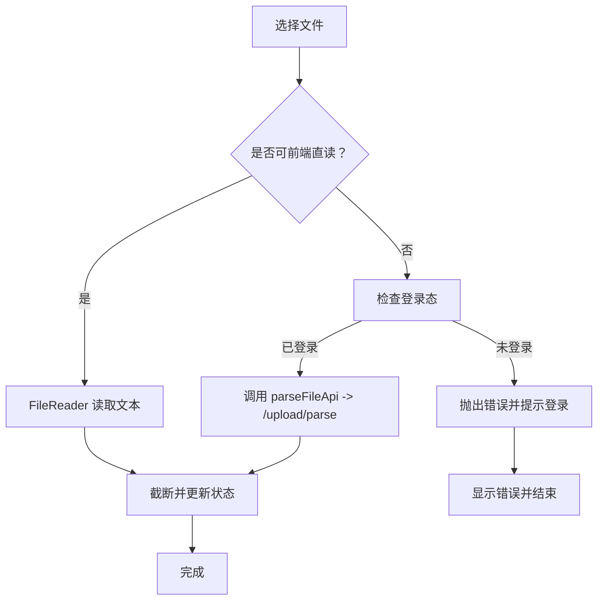
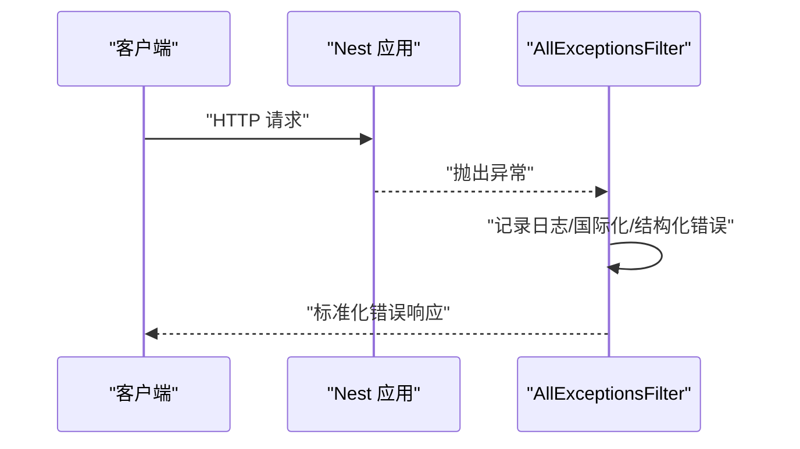
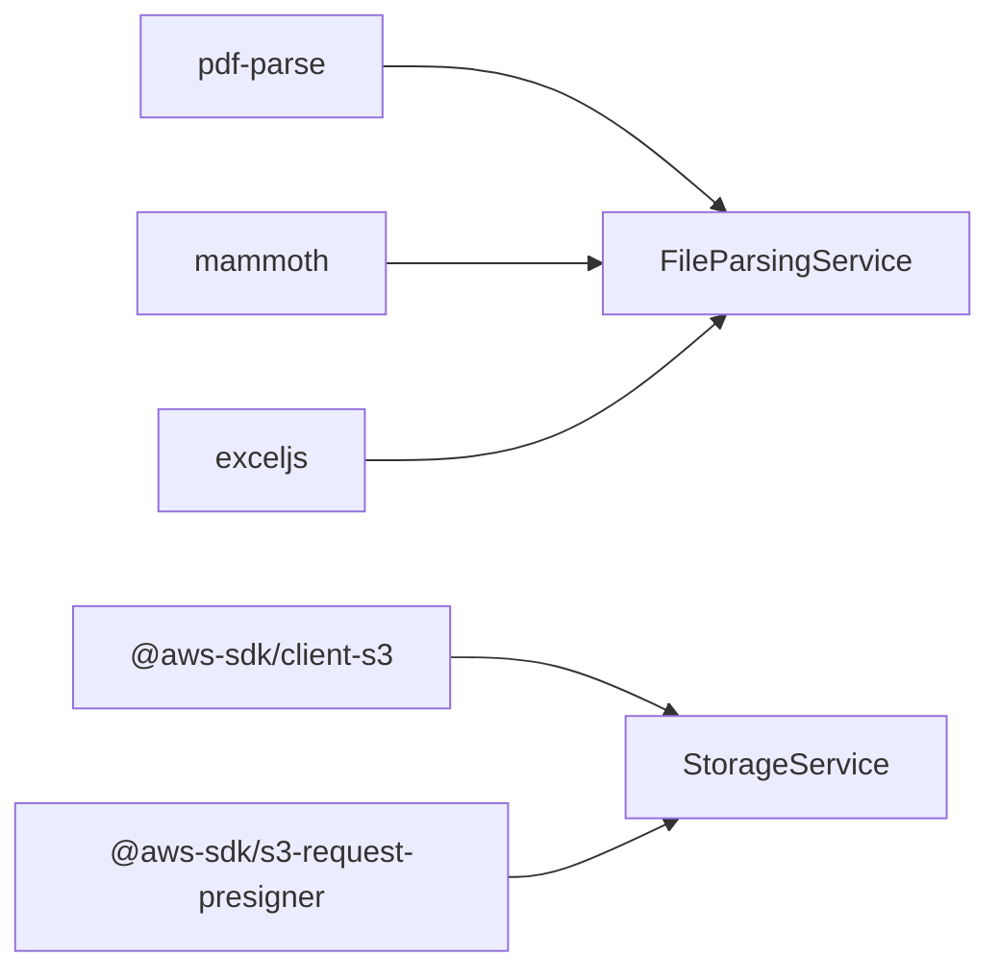

# 文件解析服务

<cite>
**本文引用的文件**
- [apps/backend/src/upload/file-parsing.service.ts](file://apps/backend/src/upload/file-parsing.service.ts)
- [apps/backend/src/upload/upload.controller.ts](file://apps/backend/src/upload/upload.controller.ts)
- [apps/backend/src/upload/storage.service.ts](file://apps/backend/src/upload/storage.service.ts)
- [apps/backend/src/upload/upload.constants.ts](file://apps/backend/src/upload/upload.constants.ts)
- [apps/backend/src/common/filters/all-exceptions.filter.ts](file://apps/backend/src/common/filters/all-exceptions.filter.ts)
- [apps/backend/tests/upload/file-parsing.service.spec.ts](file://apps/backend/tests/upload/file-parsing.service.spec.ts)
- [apps/frontend/src/composables/useFileParsing.ts](file://apps/frontend/src/composables/useFileParsing.ts)
- [apps/frontend/src/api/upload.ts](file://apps/frontend/src/api/upload.ts)
- [apps/backend/package.json](file://apps/backend/package.json)
- [apps/backend/nest-cli.json](file://apps/backend/nest-cli.json)
</cite>

## 目录
1. [简介](#简介)
2. [项目结构](#项目结构)
3. [核心组件](#核心组件)
4. [架构总览](#架构总览)
5. [详细组件分析](#详细组件分析)
6. [依赖关系分析](#依赖关系分析)
7. [性能考虑](#性能考虑)
8. [故障排查指南](#故障排查指南)
9. [结论](#结论)
10. [附录](#附录)

## 简介
本文件解析服务为 Lumina 提供统一的多格式文件解析能力，覆盖文本文件、图片（作为附件）、PDF、Office 文档（Word、Excel）等常见格式。系统采用“前端直读 + 后端解析”的混合策略：对简单文本/代码类文件在前端直接读取；对复杂文档（PDF、DOCX、XLSX/XLS）由后端解析并返回纯文本内容。解析结果支持长度截断、统一编码处理，并通过全局异常过滤器实现标准化错误输出。同时，系统具备云存储上传、签名 URL、批量上传、删除等能力，便于与 AI 记忆与对话流程集成。

## 项目结构
围绕文件解析的关键模块分布于后端与前端：
- 后端
  - 控制器：接收 multipart 表单请求，校验文件类型，调用解析与存储服务
  - 解析服务：按扩展名分派解析器，提取文本内容并截断
  - 存储服务：对接 S3/兼容服务，提供上传、批量上传、删除、签名 URL
  - 异常过滤器：统一错误响应格式，支持国际化与结构化错误对象
- 前端
  - 组合式函数：根据文件类型选择前端直读或后端解析，管理解析状态与截断提示
  - API 客户端：封装 /upload/parse 接口调用

图表来源
- [apps/backend/src/upload/upload.controller.ts:1-156](file://apps/backend/src/upload/upload.controller.ts#L1-156)
- [apps/backend/src/upload/file-parsing.service.ts:1-142](file://apps/backend/src/upload/file-parsing.service.ts#L1-142)
- [apps/backend/src/upload/storage.service.ts:1-151](file://apps/backend/src/upload/storage.service.ts#L1-151)
- [apps/frontend/src/composables/useFileParsing.ts:1-122](file://apps/frontend/src/composables/useFileParsing.ts#L1-122)
- [apps/frontend/src/api/upload.ts:1-23](file://apps/frontend/src/api/upload.ts#L1-23)

章节来源
- [apps/backend/src/upload/upload.controller.ts:1-156](file://apps/backend/src/upload/upload.controller.ts#L1-156)
- [apps/backend/src/upload/file-parsing.service.ts:1-142](file://apps/backend/src/upload/file-parsing.service.ts#L1-142)
- [apps/backend/src/upload/storage.service.ts:1-151](file://apps/backend/src/upload/storage.service.ts#L1-151)
- [apps/frontend/src/composables/useFileParsing.ts:1-122](file://apps/frontend/src/composables/useFileParsing.ts#L1-122)
- [apps/frontend/src/api/upload.ts:1-23](file://apps/frontend/src/api/upload.ts#L1-23)

## 核心组件
- 文件解析服务（FileParsingService）
  - 功能：根据文件扩展名分派解析器，提取文本内容，统一编码处理，截断超长内容
  - 支持格式：PDF、DOCX、XLS/XLSX、以及多种文本/代码扩展名
  - 错误处理：捕获解析异常并统一抛出业务异常，记录日志
- 上传控制器（UploadController）
  - 功能：接收 multipart 文件，校验扩展名与 MIME 类型，转为内部 UploadedFile 结构，调用存储或解析服务
  - 接口：/upload/single、/upload/parse、/upload/multiple、/upload/:key(delete)
- 存储服务（StorageService）
  - 功能：对接 S3/兼容服务，提供上传、批量上传、删除、签名 URL、公开 URL 生成
  - 配置：从环境变量读取 S3 参数，支持 OSS/MinIO 的 path-style 访问
- 前端解析组合式函数（useFileParsing）
  - 功能：根据 isFrontendParsable 判定直读或后端解析；管理解析状态、截断提示与错误反馈
- 全局异常过滤器（AllExceptionsFilter）
  - 功能：统一捕获异常，输出标准化响应，支持国际化与结构化错误对象

章节来源
- [apps/backend/src/upload/file-parsing.service.ts:1-142](file://apps/backend/src/upload/file-parsing.service.ts#L1-142)
- [apps/backend/src/upload/upload.controller.ts:1-156](file://apps/backend/src/upload/upload.controller.ts#L1-156)
- [apps/backend/src/upload/storage.service.ts:1-151](file://apps/backend/src/upload/storage.service.ts#L1-151)
- [apps/frontend/src/composables/useFileParsing.ts:1-122](file://apps/frontend/src/composables/useFileParsing.ts#L1-122)
- [apps/backend/src/common/filters/all-exceptions.filter.ts:1-137](file://apps/backend/src/common/filters/all-exceptions.filter.ts#L1-137)

## 架构总览
下图展示从前端到后端再到存储的整体流程，以及解析服务的多格式分派逻辑：

图表来源
- [apps/frontend/src/api/upload.ts:1-23](file://apps/frontend/src/api/upload.ts#L1-23)
- [apps/frontend/src/composables/useFileParsing.ts:1-122](file://apps/frontend/src/composables/useFileParsing.ts#L1-122)
- [apps/backend/src/upload/upload.controller.ts:1-156](file://apps/backend/src/upload/upload.controller.ts#L1-156)
- [apps/backend/src/upload/file-parsing.service.ts:1-142](file://apps/backend/src/upload/file-parsing.service.ts#L1-142)

## 详细组件分析

### 文件解析服务（FileParsingService）
- 解析算法与内容提取
  - PDF：使用 pdf-parse 将二进制缓冲区转为文本
  - DOCX：使用 mammoth 提取纯文本
  - Excel：使用 exceljs 加载工作簿，遍历工作表与行，将单元格值序列化为 CSV 风格文本
  - 文本/代码：直接以 UTF-8 编码读取 Buffer
- 元数据识别与结构化
  - Excel：在输出中包含工作表名称标识，便于后续结构化处理
- 内容截断与标准化
  - 截断阈值由常量控制，超过长度自动截断并在末尾添加省略标记
- 错误处理
  - 对不支持的扩展名抛出业务异常
  - 解析过程中的异常被记录并转换为统一的业务异常

图表来源
- [apps/backend/src/upload/file-parsing.service.ts:16-140](file://apps/backend/src/upload/file-parsing.service.ts#L16-L140)
- [apps/backend/src/upload/upload.constants.ts:40-61](file://apps/backend/src/upload/upload.constants.ts#L40-L61)

章节来源
- [apps/backend/src/upload/file-parsing.service.ts:1-142](file://apps/backend/src/upload/file-parsing.service.ts#L1-142)
- [apps/backend/src/upload/upload.constants.ts:1-61](file://apps/backend/src/upload/upload.constants.ts#L1-61)

### 上传控制器（UploadController）
- 文件类型校验
  - 依据允许的 MIME 类型与扩展名白名单进行检查
- 接口职责
  - 单文件上传：仅上传不解析
  - 批量上传：最多 10 个文件
  - 解析接口：上传并解析，不保存到存储
  - 删除接口：按 key 删除存储文件
- 请求体规范
  - multipart/form-data，字段名为 file 或 files 数组

图表来源
- [apps/backend/src/upload/upload.controller.ts:68-154](file://apps/backend/src/upload/upload.controller.ts#L68-L154)

章节来源
- [apps/backend/src/upload/upload.controller.ts:1-156](file://apps/backend/src/upload/upload.controller.ts#L1-156)

### 存储服务（StorageService）
- 功能特性
  - 上传/批量上传：生成唯一 key，写入指定桶
  - 删除：按 key 删除对象
  - 签名 URL：生成临时访问链接
  - 公开 URL：根据 endpoint 是否存在决定 OSS/MinIO 或 AWS S3 的 URL 格式
- 配置要点
  - 从环境变量读取 S3_BUCKET、S3_REGION、S3_ENDPOINT、S3_ACCESS_KEY_ID、S3_SECRET_ACCESS_KEY
  - 当存在 endpoint 时启用 path-style 访问
- 异常处理
  - 未配置存储时，相关操作抛出服务不可用异常

图表来源
- [apps/backend/src/upload/storage.service.ts:32-151](file://apps/backend/src/upload/storage.service.ts#L32-L151)

章节来源
- [apps/backend/src/upload/storage.service.ts:1-151](file://apps/backend/src/upload/storage.service.ts#L1-151)

### 前端解析组合式函数（useFileParsing）
- 混合解析策略
  - 前端直读：对可直读的文本/代码文件使用 FileReader
  - 后端解析：对 PDF、DOCX、XLSX/XLS 等复杂文档调用 /upload/parse
- 状态管理与截断
  - 维护解析队列与状态（parsing/completed/error）
  - 前端同样对超长内容进行截断并提示
- 登录态要求
  - 后端解析需要 JWT 认证，前端在调用前检查认证状态

图表来源
- [apps/frontend/src/composables/useFileParsing.ts:47-95](file://apps/frontend/src/composables/useFileParsing.ts#L47-L95)
- [apps/frontend/src/api/upload.ts:11-22](file://apps/frontend/src/api/upload.ts#L11-L22)

章节来源
- [apps/frontend/src/composables/useFileParsing.ts:1-122](file://apps/frontend/src/composables/useFileParsing.ts#L1-122)
- [apps/frontend/src/api/upload.ts:1-23](file://apps/frontend/src/api/upload.ts#L1-23)

### 全局异常过滤器（AllExceptionsFilter）
- 统一错误响应
  - 输出包含 success、data、message、errors、statusCode、timestamp
  - 支持国际化键名翻译与结构化错误对象
- 特殊处理
  - Zod 验证异常：将 issues 展开为结构化错误
  - 业务异常：尝试从消息中推断字段映射
  - 未知错误：统一为内部服务器错误

图表来源
- [apps/backend/src/common/filters/all-exceptions.filter.ts:27-135](file://apps/backend/src/common/filters/all-exceptions.filter.ts#L27-L135)

章节来源
- [apps/backend/src/common/filters/all-exceptions.filter.ts:1-137](file://apps/backend/src/common/filters/all-exceptions.filter.ts#L1-137)

## 依赖关系分析
- 第三方库
  - pdf-parse：PDF 文本提取
  - mammoth：DOCX 文本提取
  - exceljs：XLS/XLSX 工作簿加载与遍历
  - @aws-sdk/client-s3 与 @aws-sdk/s3-request-presigner：S3/兼容存储
- 前端直读范围
  - 前端仅对文本/代码类扩展名进行直读，其余复杂文档走后端解析
- 测试覆盖
  - 单测覆盖不支持的扩展名、YAML 文本解析、超长内容截断

图表来源
- [apps/backend/src/upload/file-parsing.service.ts:3-5](file://apps/backend/src/upload/file-parsing.service.ts#L3-L5)
- [apps/backend/src/upload/storage.service.ts:4-9](file://apps/backend/src/upload/storage.service.ts#L4-L9)
- [apps/backend/package.json:30-85](file://apps/backend/package.json#L30-L85)

章节来源
- [apps/backend/package.json:1-108](file://apps/backend/package.json#L1-108)
- [apps/backend/tests/upload/file-parsing.service.spec.ts:1-53](file://apps/backend/tests/upload/file-parsing.service.spec.ts#L1-53)

## 性能考虑
- 并发与批量
  - 批量上传使用 Promise.all 并行执行，提升吞吐
- 内存管理
  - 解析服务对超长内容进行截断，避免内存膨胀
  - 前端同样对解析内容进行截断，降低 UI 渲染压力
- I/O 优化
  - 存储服务使用 S3/兼容服务，适合大文件与高并发场景
- 前端直读策略
  - 对简单文本/代码文件在前端直读，减少后端解析负载

章节来源
- [apps/backend/src/upload/storage.service.ts:100-102](file://apps/backend/src/upload/storage.service.ts#L100-L102)
- [apps/backend/src/upload/file-parsing.service.ts:134-140](file://apps/backend/src/upload/file-parsing.service.ts#L134-L140)
- [apps/frontend/src/composables/useFileParsing.ts:33-45](file://apps/frontend/src/composables/useFileParsing.ts#L33-L45)

## 故障排查指南
- 常见错误与定位
  - 不支持的解析文件类型：检查扩展名与 MIME 类型是否在白名单内
  - 文件解析失败：查看后端日志与异常过滤器输出，确认解析器可用性
  - 存储未配置：当凭证缺失时，上传/删除/签名 URL 接口会返回服务不可用
- 日志与监控
  - 异常过滤器统一记录请求方法、URL、状态码与堆栈
  - 解析服务在解析 PDF/DOCX/XLS 时记录错误详情
- 回退策略
  - 前端直读失败时，可降级为后端解析
  - 对超长内容，前后端均进行截断，避免性能问题

章节来源
- [apps/backend/src/upload/file-parsing.service.ts:48-72](file://apps/backend/src/upload/file-parsing.service.ts#L48-L72)
- [apps/backend/src/common/filters/all-exceptions.filter.ts:37-45](file://apps/backend/src/common/filters/all-exceptions.filter.ts#L37-L45)
- [apps/backend/src/upload/storage.service.ts:143-149](file://apps/backend/src/upload/storage.service.ts#L143-L149)

## 结论
该文件解析服务通过“前端直读 + 后端解析”的混合模式，兼顾了性能与覆盖面。后端解析服务对 PDF、DOCX、XLSX/XLS 等复杂文档提供了稳定的文本提取能力，并结合统一的错误处理与截断策略，保证了系统的鲁棒性与可维护性。配合云存储与签名 URL 能力，可无缝接入 AI 记忆与对话流程，满足多场景下的文档处理需求。

## 附录

### 支持的文件类型与扩展名
- 允许的 MIME 类型与扩展名详见常量定义
- 文本/代码扩展名集合用于前端直读判定

章节来源
- [apps/backend/src/upload/upload.constants.ts:1-61](file://apps/backend/src/upload/upload.constants.ts#L1-L61)

### 配置项与环境变量
- S3 相关：S3_BUCKET、S3_REGION、S3_ENDPOINT、S3_ACCESS_KEY_ID、S3_SECRET_ACCESS_KEY
- 解析截断阈值：MAX_PARSED_CONTENT_CHARS（后端）、MAX_PARSED_FILE_CHARS（前端）

章节来源
- [apps/backend/src/upload/storage.service.ts:43-67](file://apps/backend/src/upload/storage.service.ts#L43-L67)
- [apps/backend/src/upload/upload.constants.ts:60-61](file://apps/backend/src/upload/upload.constants.ts#L60-L61)
- [apps/frontend/src/composables/useFileParsing.ts:33-45](file://apps/frontend/src/composables/useFileParsing.ts#L33-L45)

### 扩展开发指南
- 新增解析器步骤
  - 在解析服务中新增扩展名分支与解析逻辑
  - 在常量中补充允许的扩展名与 MIME 类型
  - 在前端组合式函数中决定是否走前端直读
  - 补充单元测试覆盖边界与错误场景
- 集成第三方库
  - 在后端 package.json 中添加依赖
  - 在解析服务中引入并使用对应库
  - 注意内存与性能影响，必要时增加截断与缓存策略

章节来源
- [apps/backend/src/upload/file-parsing.service.ts:24-47](file://apps/backend/src/upload/file-parsing.service.ts#L24-L47)
- [apps/backend/src/upload/upload.constants.ts:16-38](file://apps/backend/src/upload/upload.constants.ts#L16-L38)
- [apps/backend/package.json:65-76](file://apps/backend/package.json#L65-L76)