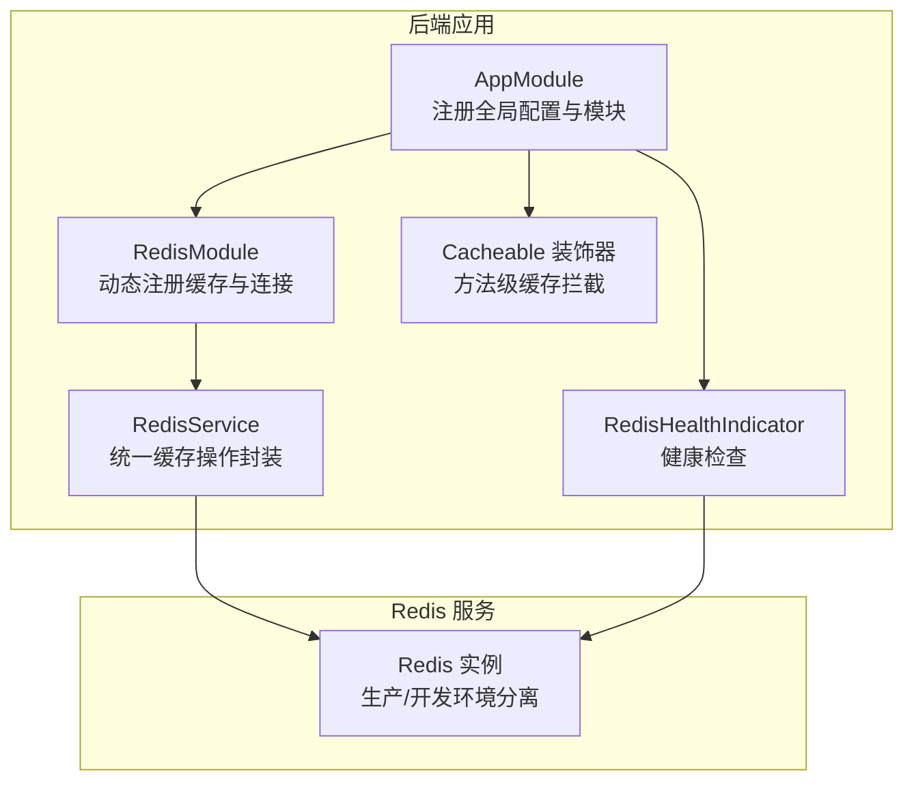
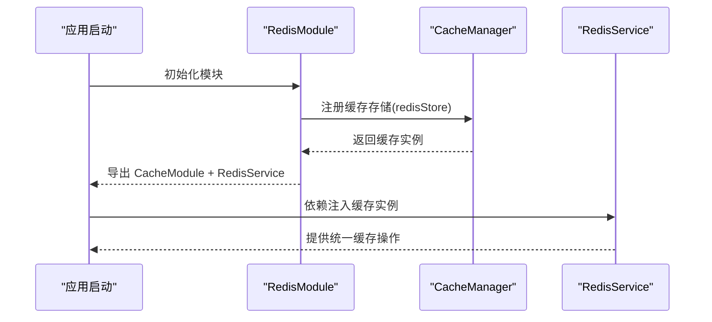
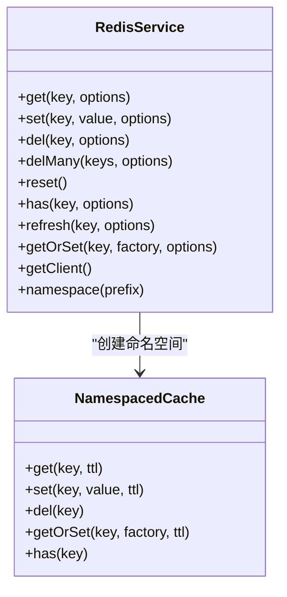
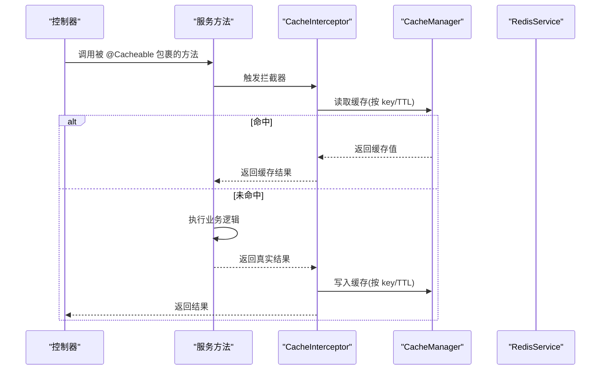
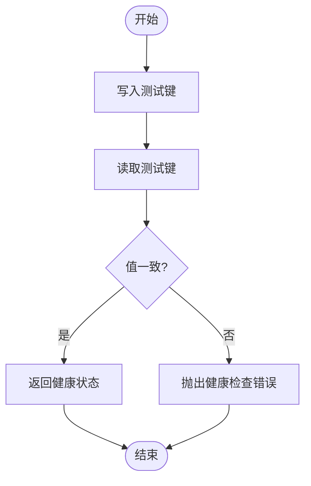
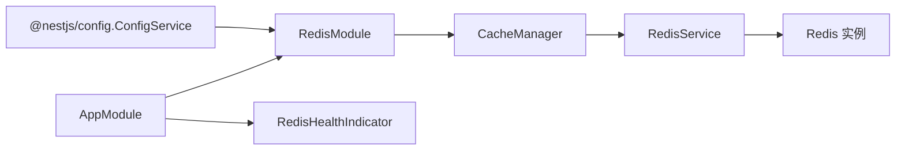

# 缓存系统

<cite>
**本文引用的文件**
- [apps/backend/src/redis/redis.module.ts](file://apps/backend/src/redis/redis.module.ts)
- [apps/backend/src/redis/redis.service.ts](file://apps/backend/src/redis/redis.service.ts)
- [apps/backend/src/redis/cache.decorator.ts](file://apps/backend/src/redis/cache.decorator.ts)
- [apps/backend/src/redis/redis.health.ts](file://apps/backend/src/redis/redis.health.ts)
- [apps/backend/src/app.module.ts](file://apps/backend/src/app.module.ts)
- [docker-compose.yml](file://docker-compose.yml)
- [docker-compose.dev.yml](file://docker-compose.dev.yml)
- [apps/backend/src/redis/index.ts](file://apps/backend/src/redis/index.ts)
</cite>

## 目录
1. [简介](#简介)
2. [项目结构](#项目结构)
3. [核心组件](#核心组件)
4. [架构总览](#架构总览)
5. [详细组件分析](#详细组件分析)
6. [依赖关系分析](#依赖关系分析)
7. [性能考量](#性能考量)
8. [故障排查指南](#故障排查指南)
9. [结论](#结论)
10. [附录](#附录)

## 简介
本文件为 Lumina 缓存系统的全面技术文档，覆盖 Redis 缓存配置、连接池与重试策略、集群部署建议、缓存装饰器使用、键命名规范与过期策略、会话存储与分布式锁思路、缓存穿透防护、缓存预热与更新策略、一致性保障、监控指标、性能调优与故障恢复机制，并提供最佳实践与内存/持久化配置指南。内容基于仓库中实际实现与配置文件进行整理与提炼。

## 项目结构
Lumina 的缓存子系统位于后端应用的 redis 目录，采用模块化设计，结合 NestJS 的全局模块与缓存管理器，提供统一的 Redis 访问能力与健康检查能力。生产与开发环境通过 Docker Compose 提供独立的 Redis 服务实例。

图表来源
- [apps/backend/src/app.module.ts:150](file://apps/backend/src/app/module.ts#L150)
- [apps/backend/src/redis/redis.module.ts:27](file://apps/backend/src/redis/redis.module.ts#L27)
- [apps/backend/src/redis/redis.service.ts:52](file://apps/backend/src/redis/redis.service.ts#L52)
- [apps/backend/src/redis/cache.decorator.ts:42](file://apps/backend/src/redis/cache.decorator.ts#L42)
- [apps/backend/src/redis/redis.health.ts:11](file://apps/backend/src/redis/redis.health.ts#L11)

章节来源
- [apps/backend/src/app.module.ts:150](file://apps/backend/src/app.module.ts#L150)
- [apps/backend/src/redis/redis.module.ts:27](file://apps/backend/src/redis/redis.module.ts#L27)
- [apps/backend/src/redis/redis.service.ts:52](file://apps/backend/src/redis/redis.service.ts#L52)
- [apps/backend/src/redis/cache.decorator.ts:42](file://apps/backend/src/redis/cache.decorator.ts#L42)
- [apps/backend/src/redis/redis.health.ts:11](file://apps/backend/src/redis/redis.health.ts#L11)

## 核心组件
- RedisModule：全局注册缓存模块，基于 cache-manager 与 ioredis 实现，支持从配置注入动态连接参数、键前缀与默认 TTL，内置连接重试策略与日志记录。
- RedisService：统一缓存操作封装，提供 get/set/del/delMany/reset、has、refresh、getOrSet（缓存穿透保护）、命名空间缓存（自动加前缀）与客户端直连能力。
- Cacheable 装饰器：基于 @nestjs/cache-manager 的方法级缓存拦截，支持自定义缓存键与 TTL，以及禁用缓存标记。
- RedisHealthIndicator：基于 cache-manager 的健康检查，通过一次 set/get 验证连接与读写能力。
- 部署与配置：生产与开发环境分别在 docker-compose 中提供 Redis 服务，支持密码认证、持久化与内存策略配置。

章节来源
- [apps/backend/src/redis/redis.module.ts:27](file://apps/backend/src/redis/redis.module.ts#L27)
- [apps/backend/src/redis/redis.service.ts:52](file://apps/backend/src/redis/redis.service.ts#L52)
- [apps/backend/src/redis/cache.decorator.ts:42](file://apps/backend/src/redis/cache.decorator.ts#L42)
- [apps/backend/src/redis/redis.health.ts:11](file://apps/backend/src/redis/redis.health.ts#L11)
- [docker-compose.yml:55](file://docker-compose.yml#L55)
- [docker-compose.dev.yml:45](file://docker-compose.dev.yml#L45)

## 架构总览
Lumina 的缓存层围绕 Redis 展开，通过全局模块注入与缓存拦截器实现“声明式”缓存与“编程式”缓存的双通道。应用启动时，RedisModule 基于 ConfigService 注入环境变量，建立连接并导出 CacheModule 与 RedisService，供其他模块使用。

图表来源
- [apps/backend/src/redis/redis.module.ts:29](file://apps/backend/src/redis/redis.module.ts#L29)
- [apps/backend/src/redis/redis.module.ts:69](file://apps/backend/src/redis/redis.module.ts#L69)
- [apps/backend/src/redis/redis.service.ts:56](file://apps/backend/src/redis/redis.service.ts#L56)

章节来源
- [apps/backend/src/redis/redis.module.ts:29](file://apps/backend/src/redis/redis.module.ts#L29)
- [apps/backend/src/redis/redis.module.ts:69](file://apps/backend/src/redis/redis.module.ts#L69)
- [apps/backend/src/redis/redis.service.ts:56](file://apps/backend/src/redis/redis.service.ts#L56)

## 详细组件分析

### RedisModule：连接与配置
- 动态配置项
  - 主机与端口：从环境变量读取，默认本地回环与标准端口。
  - 密码与数据库索引：可选配置，便于多租户隔离。
  - 键前缀：统一前缀，便于运维与清理。
  - 默认 TTL：以秒为单位配置，内部转换为毫秒传递给缓存管理器。
- 连接与重试
  - 使用 redisStore 初始化，启用 ready 检查与延迟连接。
  - 重试策略：最大重试次数限制，指数退避上限控制，超过阈值停止重试并记录错误。
- 日志与可观测性
  - 成功与失败日志输出，便于问题定位。

章节来源
- [apps/backend/src/redis/redis.module.ts:34](file://apps/backend/src/redis/redis.module.ts#L34)
- [apps/backend/src/redis/redis.module.ts:56](file://apps/backend/src/redis/redis.module.ts#L56)
- [apps/backend/src/redis/redis.module.ts:69](file://apps/backend/src/redis/redis.module.ts#L69)

### RedisService：统一缓存操作与命名空间
- 键前缀与命名空间
  - 内置前缀枚举，涵盖用户、会话、认证、限流、配置、临时等场景。
  - 提供 namespace(prefix) 方法，返回 NamespacedCache，自动为每个操作加上前缀。
- 基础操作
  - get/set/del/delMany/reset：支持单键、批量删除与全量清空（谨慎使用）。
  - has：判断键是否存在。
  - refresh：刷新 TTL（重新设置过期时间）。
- 缓存穿透保护
  - getOrSet：若缓存命中则直接返回；未命中则执行工厂函数获取数据，仅当值非空时写入缓存。
- 客户端直连
  - getClient：返回底层 cache-manager 实例，便于高级操作或直接访问底层命令。

图表来源
- [apps/backend/src/redis/redis.service.ts:52](file://apps/backend/src/redis/redis.service.ts#L52)
- [apps/backend/src/redis/redis.service.ts:207](file://apps/backend/src/redis/redis.service.ts#L207)

章节来源
- [apps/backend/src/redis/redis.service.ts:8](file://apps/backend/src/redis/redis.service.ts#L8)
- [apps/backend/src/redis/redis.service.ts:150](file://apps/backend/src/redis/redis.service.ts#L150)
- [apps/backend/src/redis/redis.service.ts:207](file://apps/backend/src/redis/redis.service.ts#L207)

### Cacheable 装饰器：方法级缓存
- 能力
  - 自动缓存方法返回值，基于 CacheInterceptor。
  - 支持自定义缓存键（含占位符）、自定义 TTL。
  - 支持禁用缓存标记。
- 常量
  - 提供常用 TTL 常量（毫秒），便于在装饰器中直接使用。

图表来源
- [apps/backend/src/redis/cache.decorator.ts:42](file://apps/backend/src/redis/cache.decorator.ts#L42)

章节来源
- [apps/backend/src/redis/cache.decorator.ts:42](file://apps/backend/src/redis/cache.decorator.ts#L42)
- [apps/backend/src/redis/cache.decorator.ts:72](file://apps/backend/src/redis/cache.decorator.ts#L72)

### 健康检查：RedisHealthIndicator
- 通过一次短 TTL 的 set/get 操作验证 Redis 连接与读写能力。
- 异常时抛出 HealthCheckError，便于集成到健康检查端点。

图表来源
- [apps/backend/src/redis/redis.health.ts:20](file://apps/backend/src/redis/redis.health.ts#L20)

章节来源
- [apps/backend/src/redis/redis.health.ts:20](file://apps/backend/src/redis/redis.health.ts#L20)

### 部署与集群策略
- 单实例部署
  - 生产与开发环境均通过 docker-compose 提供独立 Redis 实例，支持密码认证与持久化。
- 集群/高可用建议
  - 在生产环境中，建议使用 Redis Sentinel 或 Redis Cluster 实现主从复制与故障转移。
  - 配置只读副本以分流读流量，减少主节点压力。
  - 使用连接池与合理的超时、重试策略，避免热点键导致的阻塞。
- 安全与持久化
  - 生产环境启用 requirepass 并限制网络访问；开启 AOF 持久化与合理 maxmemory 策略。
  - 开发环境可放宽策略以便调试，但需注意内存回收与 noeviction 策略的风险。

章节来源
- [docker-compose.yml:55](file://docker-compose.yml#L55)
- [docker-compose.dev.yml:45](file://docker-compose.dev.yml#L45)

## 依赖关系分析
- 模块耦合
  - RedisModule 依赖 ConfigModule 与 ConfigService，解耦配置来源。
  - RedisService 依赖 CACHE_MANAGER，面向抽象而非具体实现，便于替换存储。
  - Cacheable 装饰器依赖 @nestjs/cache-manager 的 CacheInterceptor。
- 外部依赖
  - cache-manager 与 cache-manager-ioredis-yet 提供统一缓存抽象与 Redis 存储实现。
  - BullMQ 使用同一 Redis 实例作为队列后端，注意队列与缓存的资源竞争。

图表来源
- [apps/backend/src/redis/redis.module.ts:32](file://apps/backend/src/redis/redis.module.ts#L32)
- [apps/backend/src/redis/redis.service.ts:56](file://apps/backend/src/redis/redis.service.ts#L56)
- [apps/backend/src/app.module.ts:150](file://apps/backend/src/app.module.ts#L150)

章节来源
- [apps/backend/src/redis/redis.module.ts:32](file://apps/backend/src/redis/redis.module.ts#L32)
- [apps/backend/src/redis/redis.service.ts:56](file://apps/backend/src/redis/redis.service.ts#L56)
- [apps/backend/src/app.module.ts:150](file://apps/backend/src/app.module.ts#L150)

## 性能考量
- 连接与重试
  - 合理设置 maxRetriesPerRequest 与 retryStrategy，避免瞬时抖动导致大量重试。
  - 使用 lazyConnect 与 enableReadyCheck，降低启动时的失败概率。
- 键前缀与命名空间
  - 统一前缀与命名空间可简化批量清理与运维，避免键冲突。
- TTL 策略
  - 对热点数据设置较短 TTL，对静态数据设置较长 TTL。
  - 使用 refresh 保持活跃键的 TTL，避免“幽灵过期”。
- 缓存穿透与击穿
  - getOrSet 在未命中时才回源加载，配合短 TTL 与互斥策略可缓解击穿风险。
- 批量操作
  - 使用 delMany 并行删除多个键，减少网络往返。
- 队列与缓存竞争
  - BullMQ 与缓存共享同一 Redis 实例，建议为队列与缓存设置不同 DB 或使用独立实例，避免相互影响。

章节来源
- [apps/backend/src/redis/redis.module.ts:56](file://apps/backend/src/redis/redis.module.ts#L56)
- [apps/backend/src/redis/redis.service.ts:150](file://apps/backend/src/redis/redis.service.ts#L150)
- [apps/backend/src/redis/redis.service.ts:174](file://apps/backend/src/redis/redis.service.ts#L174)
- [apps/backend/src/redis/redis.service.ts:125](file://apps/backend/src/redis/redis.service.ts#L125)

## 故障排查指南
- 连接失败
  - 检查环境变量 REDIS_HOST/REDIS_PORT/REDIS_PASSWORD/REDIS_DB 是否正确。
  - 关注日志中的重试次数与延迟，确认网络与认证配置。
- 健康检查失败
  - 使用 RedisHealthIndicator 的 isHealthy 方法进行快速验证。
  - 若读写不一致，检查 Redis 实例状态与权限。
- 缓存未生效
  - 确认方法是否被 @Cacheable 包裹，且未被 NoCache 标记。
  - 检查自定义 key 与 TTL 是否符合预期。
- 命名空间与键冲突
  - 使用 namespace(prefix) 自动加前缀，避免跨模块键污染。
- 资源竞争
  - 若出现队列堆积或缓存延迟，考虑拆分 Redis 实例或调整队列/缓存的 DB。

章节来源
- [apps/backend/src/redis/redis.module.ts:34](file://apps/backend/src/redis/redis.module.ts#L34)
- [apps/backend/src/redis/redis.health.ts:20](file://apps/backend/src/redis/redis.health.ts#L20)
- [apps/backend/src/redis/cache.decorator.ts:64](file://apps/backend/src/redis/cache.decorator.ts#L64)
- [apps/backend/src/redis/redis.service.ts:199](file://apps/backend/src/redis/redis.service.ts#L199)

## 结论
Lumina 的缓存系统以 Redis 为核心，通过全局模块与缓存拦截器实现了“声明式”与“编程式”的双重缓存能力。结合统一的键前缀、命名空间、健康检查与可配置的 TTL/重试策略，满足了开发与生产的多样化需求。建议在生产环境中进一步完善集群/高可用、安全加固与资源隔离策略，以获得更稳健的性能表现。

## 附录

### 缓存装饰器使用要点
- 基础用法：在方法上添加 @Cacheable() 即可启用缓存。
- 自定义 TTL：传入 ttl 参数（毫秒）。
- 自定义键：传入 key 参数，支持占位符。
- 禁用缓存：对敏感或频繁变化的方法使用 @NoCache()。

章节来源
- [apps/backend/src/redis/cache.decorator.ts:42](file://apps/backend/src/redis/cache.decorator.ts#L42)
- [apps/backend/src/redis/cache.decorator.ts:64](file://apps/backend/src/redis/cache.decorator.ts#L64)

### 缓存键命名规范
- 前缀枚举：user/session/auth/rate_limit/config/temp 等。
- 命名空间：优先使用 namespace(prefix) 自动加前缀。
- 建议：路径/动作/参数维度组合，避免冲突。

章节来源
- [apps/backend/src/redis/redis.service.ts:8](file://apps/backend/src/redis/redis.service.ts#L8)
- [apps/backend/src/redis/redis.service.ts:199](file://apps/backend/src/redis/redis.service.ts#L199)

### 过期时间策略
- 默认 TTL：服务内部默认 5 分钟，可通过 options 覆盖。
- 装饰器 TTL：使用 CacheableTTL 常量，按场景选择。
- 短 TTL：热点列表、临时数据。
- 长 TTL：静态配置、用户基础信息。

章节来源
- [apps/backend/src/redis/redis.service.ts:30](file://apps/backend/src/redis/redis.service.ts#L30)
- [apps/backend/src/redis/cache.decorator.ts:72](file://apps/backend/src/redis/cache.decorator.ts#L72)

### 会话存储与分布式锁
- 会话存储：推荐使用 Redis 的 session 前缀命名空间，结合短 TTL 与刷新策略。
- 分布式锁：可在 Redis 上基于 SET key value NX EX ttl 实现简单互斥，避免缓存击穿。

章节来源
- [apps/backend/src/redis/redis.service.ts:8](file://apps/backend/src/redis/redis.service.ts#L8)

### 缓存穿透、预热与一致性
- 穿透防护：getOrSet 在未命中时回源并写入缓存，同时仅在值非空时保存。
- 预热：在应用启动或定时任务中批量写入热点键。
- 一致性：对写操作执行 del 或 delMany 清理相关键，必要时使用 refresh 延长活跃键 TTL。

章节来源
- [apps/backend/src/redis/redis.service.ts:150](file://apps/backend/src/redis/redis.service.ts#L150)
- [apps/backend/src/redis/redis.service.ts:113](file://apps/backend/src/redis/redis.service.ts#L113)
- [apps/backend/src/redis/redis.service.ts:174](file://apps/backend/src/redis/redis.service.ts#L174)

### 监控指标与性能调优
- 指标：连接数、命中率、慢查询、内存使用、过期键比例。
- 调优：合理设置 maxmemory 与淘汰策略；区分队列与缓存 DB；使用只读副本分流读请求。

章节来源
- [docker-compose.yml:60](file://docker-compose.yml#L60)
- [docker-compose.dev.yml:51](file://docker-compose.dev.yml#L51)

### 故障恢复机制
- 连接重试：内置重试策略与日志，超过阈值停止重试。
- 健康检查：通过 isHealthy 快速发现不可用实例。
- 渐进式恢复：先恢复缓存，再逐步放开队列与写操作。

章节来源
- [apps/backend/src/redis/redis.module.ts:56](file://apps/backend/src/redis/redis.module.ts#L56)
- [apps/backend/src/redis/redis.health.ts:20](file://apps/backend/src/redis/redis.health.ts#L20)

### 最佳实践与内存/持久化配置
- 最佳实践
  - 明确 TTL 分层；对热点数据使用短 TTL 与预热；对静态数据使用长 TTL。
  - 使用命名空间与前缀，避免键冲突。
  - 对关键路径使用 getOrSet 防穿透，必要时引入互斥锁。
- 内存与持久化
  - 生产：开启 AOF，设置 maxmemory 与 LRU 淘汰策略。
  - 开发：可使用 noeviction，便于调试但需关注内存上限。

章节来源
- [docker-compose.yml:60](file://docker-compose.yml#L60)
- [docker-compose.dev.yml:51](file://docker-compose.dev.yml#L51)