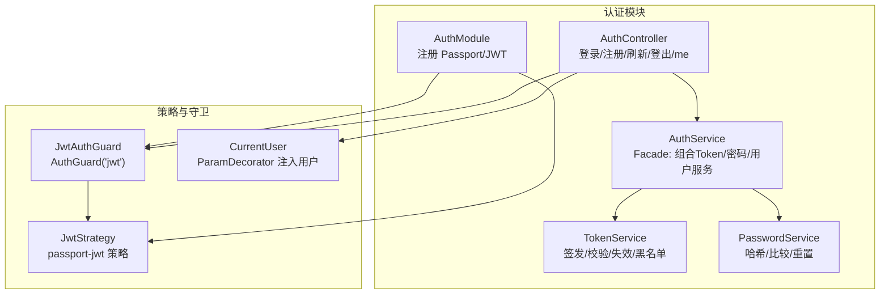
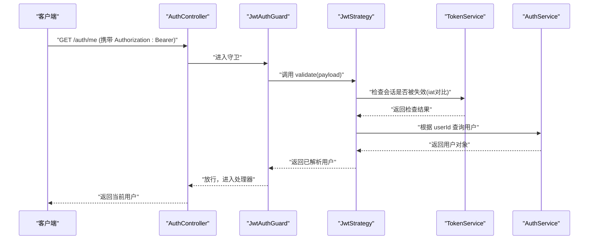
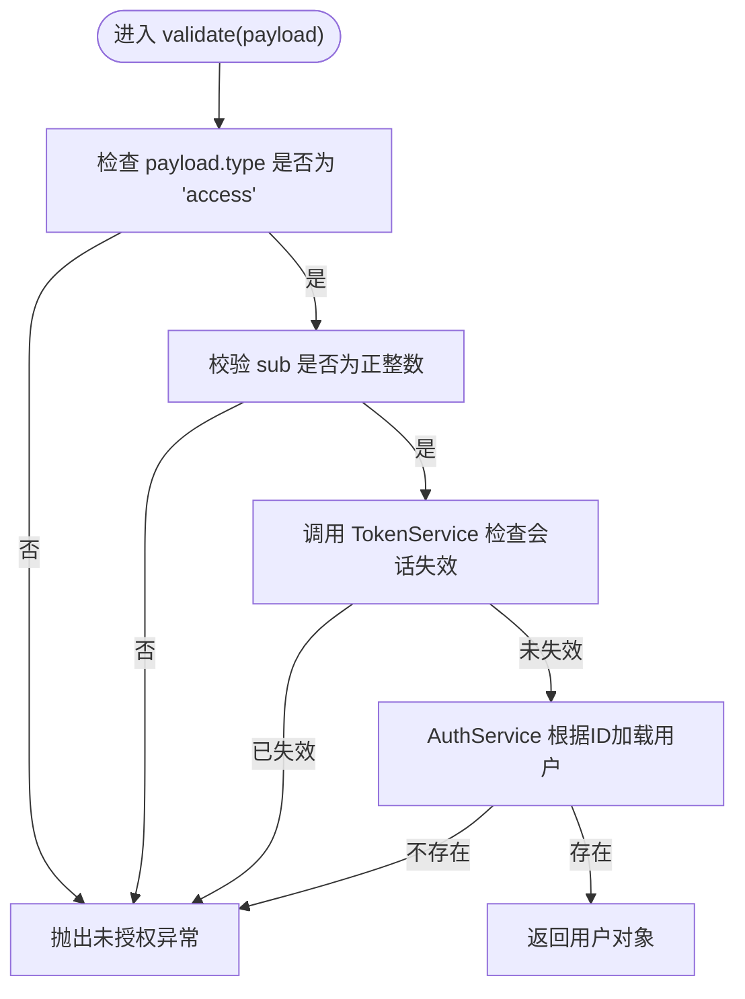
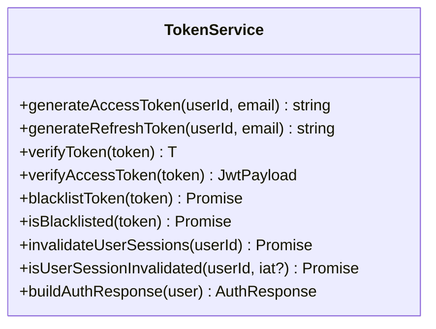
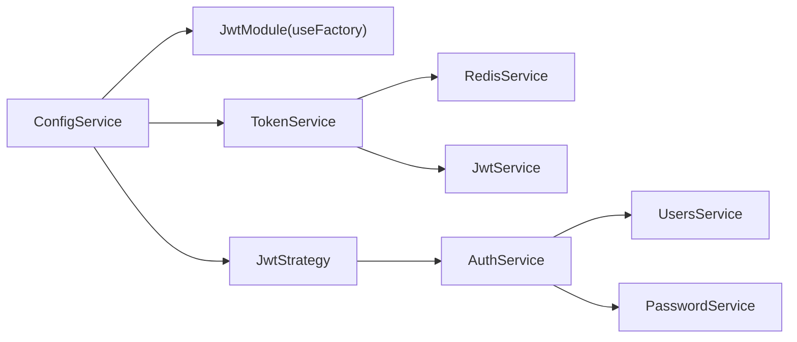

# JWT认证机制

<cite>
**本文引用的文件**
- [apps/backend/src/auth/jwt-auth.guard.ts](file://apps/backend/src/auth/jwt-auth.guard.ts)
- [apps/backend/src/auth/current-user.decorator.ts](file://apps/backend/src/auth/current-user.decorator.ts)
- [apps/backend/src/auth/jwt.strategy.ts](file://apps/backend/src/auth/jwt.strategy.ts)
- [apps/backend/src/auth/token.service.ts](file://apps/backend/src/auth/token.service.ts)
- [apps/backend/src/auth/auth.service.ts](file://apps/backend/src/auth/auth.service.ts)
- [apps/backend/src/auth/auth.module.ts](file://apps/backend/src/auth/auth.module.ts)
- [apps/backend/src/auth/auth.controller.ts](file://apps/backend/src/auth/auth.controller.ts)
- [apps/backend/src/auth/password.service.ts](file://apps/backend/src/auth/password.service.ts)
- [apps/backend/tests/auth/jwt.strategy.spec.ts](file://apps/backend/tests/auth/jwt.strategy.spec.ts)
- [apps/backend/tests/auth/token.service.spec.ts](file://apps/backend/tests/auth/token.service.spec.ts)
- [apps/backend/tests/e2e/test-app.ts](file://apps/backend/tests/e2e/test-app.ts)
</cite>

## 目录
1. [简介](#简介)
2. [项目结构](#项目结构)
3. [核心组件](#核心组件)
4. [架构总览](#架构总览)
5. [详细组件分析](#详细组件分析)
6. [依赖关系分析](#依赖关系分析)
7. [性能考量](#性能考量)
8. [故障排查指南](#故障排查指南)
9. [结论](#结论)
10. [附录：配置与使用示例](#附录配置与使用示例)

## 简介
本文件系统性阐述该仓库中的JWT认证机制，覆盖以下主题：
- JWT策略实现原理与Token验证流程
- 用户身份解析与上下文注入
- 守卫工作机制与路由保护策略
- 请求拦截与上下文访问模式
- currentUser装饰器用法与参数提取
- JWT配置参数、过期时间与签名密钥管理
- 在控制器与服务层中使用守卫与装饰器的完整示例路径

## 项目结构
JWT认证相关代码集中在后端应用的认证子系统中，采用模块化组织，关键文件如下：
- 守卫：jwt-auth.guard.ts
- 装饰器：current-user.decorator.ts
- 策略：jwt.strategy.ts
- 令牌服务：token.service.ts
- 认证服务：auth.service.ts
- 认证模块：auth.module.ts
- 认证控制器：auth.controller.ts
- 密码服务：password.service.ts
- 测试与端到端配置：jwt.strategy.spec.ts、token.service.spec.ts、test-app.ts

图表来源
- [apps/backend/src/auth/auth.module.ts:19-41](file://apps/backend/src/auth/auth.module.ts#L19-L41)
- [apps/backend/src/auth/auth.controller.ts:14-82](file://apps/backend/src/auth/auth.controller.ts#L14-L82)
- [apps/backend/src/auth/auth.service.ts:12-22](file://apps/backend/src/auth/auth.service.ts#L12-L22)
- [apps/backend/src/auth/token.service.ts:15-46](file://apps/backend/src/auth/token.service.ts#L15-L46)
- [apps/backend/src/auth/password.service.ts:9-21](file://apps/backend/src/auth/password.service.ts#L9-L21)
- [apps/backend/src/auth/jwt.strategy.ts:19-36](file://apps/backend/src/auth/jwt.strategy.ts#L19-L36)
- [apps/backend/src/auth/jwt-auth.guard.ts:8-9](file://apps/backend/src/auth/jwt-auth.guard.ts#L8-L9)
- [apps/backend/src/auth/current-user.decorator.ts:8-18](file://apps/backend/src/auth/current-user.decorator.ts#L8-L18)

章节来源
- [apps/backend/src/auth/auth.module.ts:19-41](file://apps/backend/src/auth/auth.module.ts#L19-L41)
- [apps/backend/src/auth/auth.controller.ts:14-82](file://apps/backend/src/auth/auth.controller.ts#L14-L82)

## 核心组件
- 守卫 JwtAuthGuard：基于 @nestjs/passport 的 AuthGuard('jwt')，用于保护路由。
- 策略 JwtStrategy：继承自 PassportStrategy(Strategy)，负责从请求头解析并验证JWT，校验payload类型与有效性，并通过TokenService与AuthService完成会话与用户查询。
- 令牌服务 TokenService：封装JWT签发、校验、黑名单、会话失效标记等逻辑；支持访问令牌与刷新令牌不同密钥与过期时间。
- 认证服务 AuthService：对外提供登录、注册、刷新、登出等统一接口，内部组合TokenService与PasswordService。
- 装饰器 CurrentUser：从请求上下文提取当前用户对象或其字段，支持按属性名提取。
- 认证控制器 AuthController：暴露登录、注册、刷新、登出、获取当前用户信息等接口。

章节来源
- [apps/backend/src/auth/jwt-auth.guard.ts:8-9](file://apps/backend/src/auth/jwt-auth.guard.ts#L8-L9)
- [apps/backend/src/auth/jwt.strategy.ts:19-67](file://apps/backend/src/auth/jwt.strategy.ts#L19-L67)
- [apps/backend/src/auth/token.service.ts:15-187](file://apps/backend/src/auth/token.service.ts#L15-L187)
- [apps/backend/src/auth/auth.service.ts:12-127](file://apps/backend/src/auth/auth.service.ts#L12-L127)
- [apps/backend/src/auth/current-user.decorator.ts:8-18](file://apps/backend/src/auth/current-user.decorator.ts#L8-L18)
- [apps/backend/src/auth/auth.controller.ts:14-82](file://apps/backend/src/auth/auth.controller.ts#L14-L82)

## 架构总览
下图展示了JWT认证在请求生命周期中的关键交互：

图表来源
- [apps/backend/src/auth/auth.controller.ts:53-60](file://apps/backend/src/auth/auth.controller.ts#L53-L60)
- [apps/backend/src/auth/jwt-auth.guard.ts:8-9](file://apps/backend/src/auth/jwt-auth.guard.ts#L8-L9)
- [apps/backend/src/auth/jwt.strategy.ts:41-66](file://apps/backend/src/auth/jwt.strategy.ts#L41-L66)
- [apps/backend/src/auth/token.service.ts:55-76](file://apps/backend/src/auth/token.service.ts#L55-L76)
- [apps/backend/src/auth/auth.service.ts:119-125](file://apps/backend/src/auth/auth.service.ts#L119-L125)

## 详细组件分析

### JwtAuthGuard：路由保护与拦截
- 作用：对受保护路由启用JWT认证拦截。
- 实现：通过 AuthGuard('jwt') 委托给 passport-jwt 策略进行验证。
- 使用场景：在控制器方法上添加 @UseGuards(JwtAuthGuard) 即可保护该接口。

章节来源
- [apps/backend/src/auth/jwt-auth.guard.ts:8-9](file://apps/backend/src/auth/jwt-auth.guard.ts#L8-L9)
- [apps/backend/src/auth/auth.controller.ts:53-60](file://apps/backend/src/auth/auth.controller.ts#L53-L60)

### JwtStrategy：Token解析与用户解析
- 解析来源：从Authorization头提取Bearer Token。
- 校验规则：
  - 仅接受type为'access'的payload；
  - 校验sub为正整数；
  - 通过TokenService检查会话是否被标记失效（基于Redis的失效时间戳）；
  - 通过AuthService按ID查询用户是否存在。
- 返回值：返回用户实体，供守卫与后续处理器使用。

图表来源
- [apps/backend/src/auth/jwt.strategy.ts:41-66](file://apps/backend/src/auth/jwt.strategy.ts#L41-L66)
- [apps/backend/src/auth/token.service.ts:55-76](file://apps/backend/src/auth/token.service.ts#L55-L76)
- [apps/backend/src/auth/auth.service.ts:119-125](file://apps/backend/src/auth/auth.service.ts#L119-L125)

章节来源
- [apps/backend/src/auth/jwt.strategy.ts:19-67](file://apps/backend/src/auth/jwt.strategy.ts#L19-L67)

### TokenService：令牌签发、校验与会话管理
- 签发：
  - 访问令牌：短期有效，使用JWT_ACCESS_EXPIRES_IN配置；
  - 刷新令牌：长期有效，使用JWT_REFRESH_EXPIRES_IN配置；
  - 访问/刷新密钥：默认共享，生产环境建议区分并配置JWT_REFRESH_SECRET。
- 校验：
  - 支持先用刷新密钥再回退到访问密钥进行验证；
  - 严格校验type为'access'的访问令牌。
- 会话失效：
  - 通过Redis记录用户失效时间戳，新Token的iat需晚于该时间戳才有效；
  - 支持登出时将刷新令牌加入黑名单，避免复用。
- 黑名单：
  - 登出时根据exp计算剩余有效期，将Token写入Redis黑名单，实现即时失效。

图表来源
- [apps/backend/src/auth/token.service.ts:15-187](file://apps/backend/src/auth/token.service.ts#L15-L187)

章节来源
- [apps/backend/src/auth/token.service.ts:15-187](file://apps/backend/src/auth/token.service.ts#L15-L187)

### AuthService：认证门面与令牌刷新/登出
- 对外接口：
  - validateUser：校验用户名与密码；
  - login/register：返回包含accessToken、refreshToken与expiresIn的响应；
  - refreshToken：校验刷新令牌并重新签发新令牌；
  - logout：将刷新令牌加入黑名单。
- 异常处理：统一转换为未授权异常，避免泄露内部错误。

章节来源
- [apps/backend/src/auth/auth.service.ts:12-127](file://apps/backend/src/auth/auth.service.ts#L12-L127)

### CurrentUser装饰器：用户信息注入与上下文访问
- 功能：从请求上下文中读取用户对象，支持两种来源：
  - request.user（常规请求）
  - request.raw?.user（某些适配器场景）
- 支持字段提取：当传入属性名时，返回用户对应字段值；否则返回整个用户对象。
- 使用方式：在控制器方法参数上使用 @CurrentUser() 或 @CurrentUser('email')。

章节来源
- [apps/backend/src/auth/current-user.decorator.ts:8-18](file://apps/backend/src/auth/current-user.decorator.ts#L8-L18)
- [apps/backend/src/auth/auth.controller.ts:58-60](file://apps/backend/src/auth/auth.controller.ts#L58-L60)

### AuthController：认证接口与守卫/装饰器集成
- 接口：
  - POST /auth/login：登录并返回认证响应；
  - POST /auth/register：注册并返回认证响应；
  - POST /auth refresh：使用刷新令牌换取新的访问令牌；
  - GET /auth/me：使用JwtAuthGuard与CurrentUser获取当前用户；
  - POST /auth/logout：使用JwtAuthGuard，清空Cookie并尝试将刷新令牌加入黑名单。
- 速率限制：对登录/注册/刷新接口设置节流策略。

章节来源
- [apps/backend/src/auth/auth.controller.ts:14-82](file://apps/backend/src/auth/auth.controller.ts#L14-L82)

### PasswordService：密码安全与重置流程
- 密码哈希与比较：使用bcrypt；
- 密码重置：
  - 生成随机token并哈希存储，带过期时间；
  - 发送重置链接至邮箱；
  - 重置时校验token与过期时间，成功后清除token并使旧会话失效。

章节来源
- [apps/backend/src/auth/password.service.ts:9-100](file://apps/backend/src/auth/password.service.ts#L9-L100)

## 依赖关系分析
- 模块装配：
  - AuthModule注册 PassportModule.defaultStrategy为'jwt'，并异步配置JwtModule的secret与signOptions；
  - 导出JwtModule与PassportModule，供其他模块复用。
- 运行时依赖：
  - JwtStrategy依赖ConfigService、TokenService、AuthService；
  - TokenService依赖JwtService、ConfigService、RedisService；
  - AuthService依赖UsersService、TokenService、PasswordService。

图表来源
- [apps/backend/src/auth/auth.module.ts:25-34](file://apps/backend/src/auth/auth.module.ts#L25-L34)
- [apps/backend/src/auth/jwt.strategy.ts:21-25](file://apps/backend/src/auth/jwt.strategy.ts#L21-L25)
- [apps/backend/src/auth/token.service.ts:22-29](file://apps/backend/src/auth/token.service.ts#L22-L29)
- [apps/backend/src/auth/auth.service.ts:14-21](file://apps/backend/src/auth/auth.service.ts#L14-L21)

章节来源
- [apps/backend/src/auth/auth.module.ts:19-41](file://apps/backend/src/auth/auth.module.ts#L19-L41)

## 性能考量
- Token校验成本低：主要为签名验证与Redis读取，建议合理设置Redis缓存命中率。
- 会话失效检查：每次访问均需读取Redis并进行时间戳比较，建议优化Redis延迟与键空间设计。
- 黑名单写入：登出时按剩余有效期写入黑名单，避免过期键占用空间。
- 速率限制：对敏感接口启用节流，降低暴力破解风险。

## 故障排查指南
- 未授权异常（auth.INVALID_TOKEN）：
  - 可能原因：非访问令牌、用户不存在、会话被标记失效、payload不合法。
  - 排查步骤：确认请求头携带的是访问令牌；检查Redis中是否存在对应用户的失效时间戳；核对payload的sub与iat。
- 未授权异常（auth.USER_NOT_FOUND）：
  - 可能原因：用户ID无效或用户已被删除。
  - 排查步骤：确认用户存在且ID为正整数；检查数据库一致性。
- 未授权异常（auth.INVALID_REFRESH_TOKEN）：
  - 可能原因：刷新令牌不在黑名单中但校验失败，或已被加入黑名单。
  - 排查步骤：确认刷新令牌有效且未被加入黑名单；检查Redis黑名单键是否存在。
- 未授权异常（auth.TOKEN_EXPIRED）：
  - 可能原因：令牌过期。
  - 排查步骤：检查JWT_ACCESS_EXPIRES_IN与JWT_REFRESH_EXPIRES_IN配置；确认客户端及时刷新。

章节来源
- [apps/backend/src/auth/jwt.strategy.ts:41-66](file://apps/backend/src/auth/jwt.strategy.ts#L41-L66)
- [apps/backend/src/auth/token.service.ts:103-125](file://apps/backend/src/auth/token.service.ts#L103-L125)
- [apps/backend/src/auth/auth.service.ts:59-93](file://apps/backend/src/auth/auth.service.ts#L59-L93)

## 结论
该JWT认证体系以策略驱动的passport-jwt为核心，结合TokenService与AuthService实现了完善的令牌签发、校验、刷新与登出流程，并通过Redis实现会话级失效控制。JwtAuthGuard与CurrentUser装饰器提供了简洁的路由保护与上下文注入能力，适合在多模块场景中复用。

## 附录：配置与使用示例

### JWT配置参数
- JWT_SECRET：访问令牌与刷新令牌默认共享密钥（开发环境可用），生产环境建议区分。
- JWT_REFRESH_SECRET：刷新令牌专用密钥（生产环境必须配置）。
- JWT_ACCESS_EXPIRES_IN：访问令牌过期间隔（秒），默认900。
- JWT_REFRESH_EXPIRES_IN：刷新令牌过期间隔（秒），默认604800。

章节来源
- [apps/backend/src/auth/auth.module.ts:26-34](file://apps/backend/src/auth/auth.module.ts#L26-L34)
- [apps/backend/src/auth/token.service.ts:30-44](file://apps/backend/src/auth/token.service.ts#L30-L44)
- [apps/backend/tests/e2e/test-app.ts:410-414](file://apps/backend/tests/e2e/test-app.ts#L410-L414)

### Token验证流程（代码路径）
- 策略初始化与验证入口：[apps/backend/src/auth/jwt.strategy.ts:21-36](file://apps/backend/src/auth/jwt.strategy.ts#L21-L36), [apps/backend/src/auth/jwt.strategy.ts:41-66](file://apps/backend/src/auth/jwt.strategy.ts#L41-L66)
- 令牌签发与校验：[apps/backend/src/auth/token.service.ts:78-125](file://apps/backend/src/auth/token.service.ts#L78-L125)
- 会话失效检查：[apps/backend/src/auth/token.service.ts:55-76](file://apps/backend/src/auth/token.service.ts#L55-L76)

### 路由保护与装饰器使用（代码路径）
- 守卫与控制器集成：[apps/backend/src/auth/jwt-auth.guard.ts:8-9](file://apps/backend/src/auth/jwt-auth.guard.ts#L8-L9), [apps/backend/src/auth/auth.controller.ts:53-60](file://apps/backend/src/auth/auth.controller.ts#L53-L60)
- 装饰器定义与使用：[apps/backend/src/auth/current-user.decorator.ts:8-18](file://apps/backend/src/auth/current-user.decorator.ts#L8-L18), [apps/backend/src/auth/auth.controller.ts:58-60](file://apps/backend/src/auth/auth.controller.ts#L58-L60)

### 服务层获取当前用户（代码路径）
- 通过CurrentUser装饰器在控制器中注入用户对象：[apps/backend/src/auth/auth.controller.ts:58-60](file://apps/backend/src/auth/auth.controller.ts#L58-L60)
- 服务层辅助方法：getUserById（供策略或内部流程使用）：[apps/backend/src/auth/auth.service.ts:119-125](file://apps/backend/src/auth/auth.service.ts#L119-L125)

### 登录/注册/刷新/登出端到端流程（代码路径）
- 控制器接口：[apps/backend/src/auth/auth.controller.ts:22-80](file://apps/backend/src/auth/auth.controller.ts#L22-L80)
- 认证服务门面：[apps/backend/src/auth/auth.service.ts:41-101](file://apps/backend/src/auth/auth.service.ts#L41-L101)
- 模块装配与策略注册：[apps/backend/src/auth/auth.module.ts:19-41](file://apps/backend/src/auth/auth.module.ts#L19-L41)