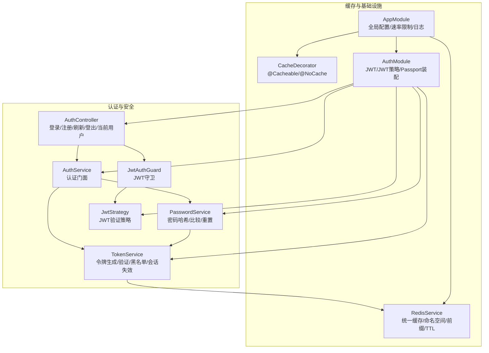
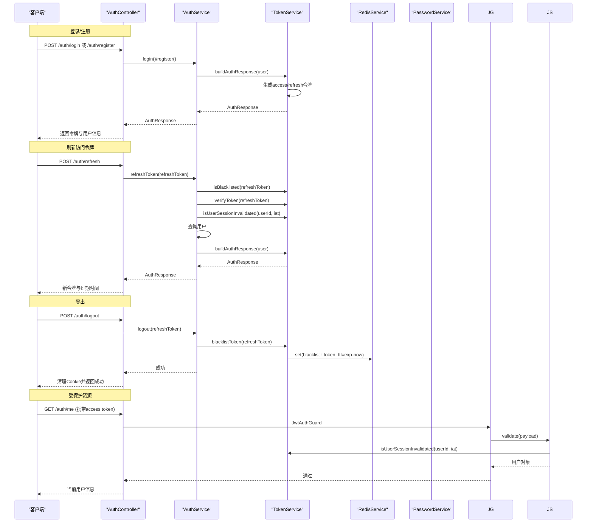
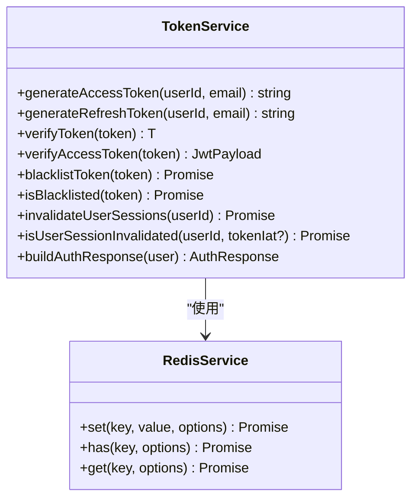
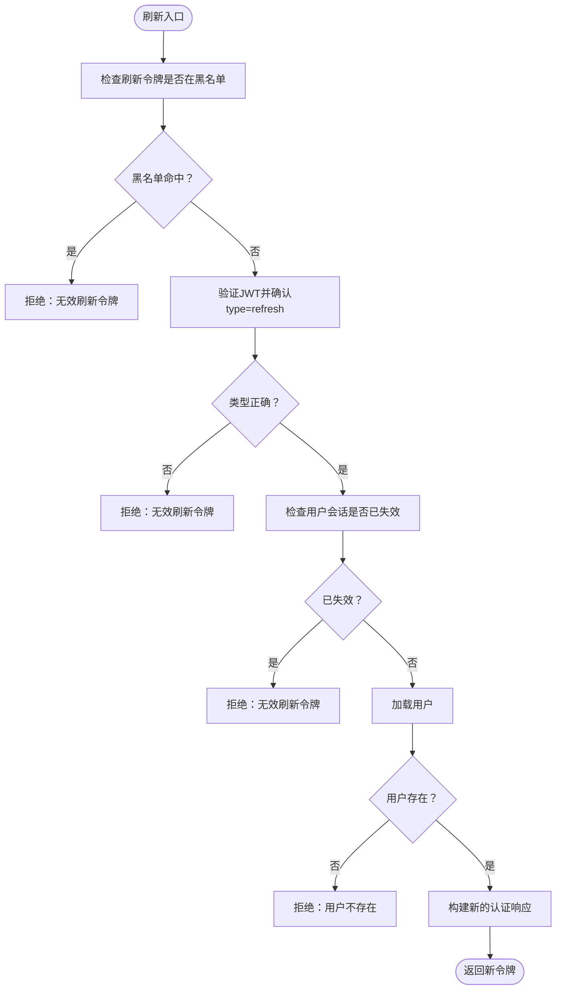
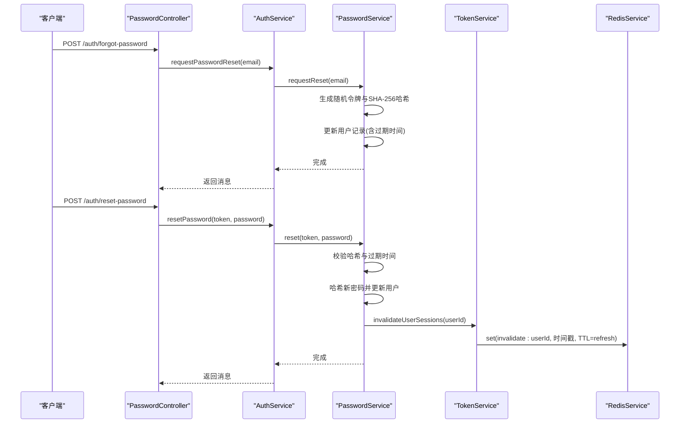
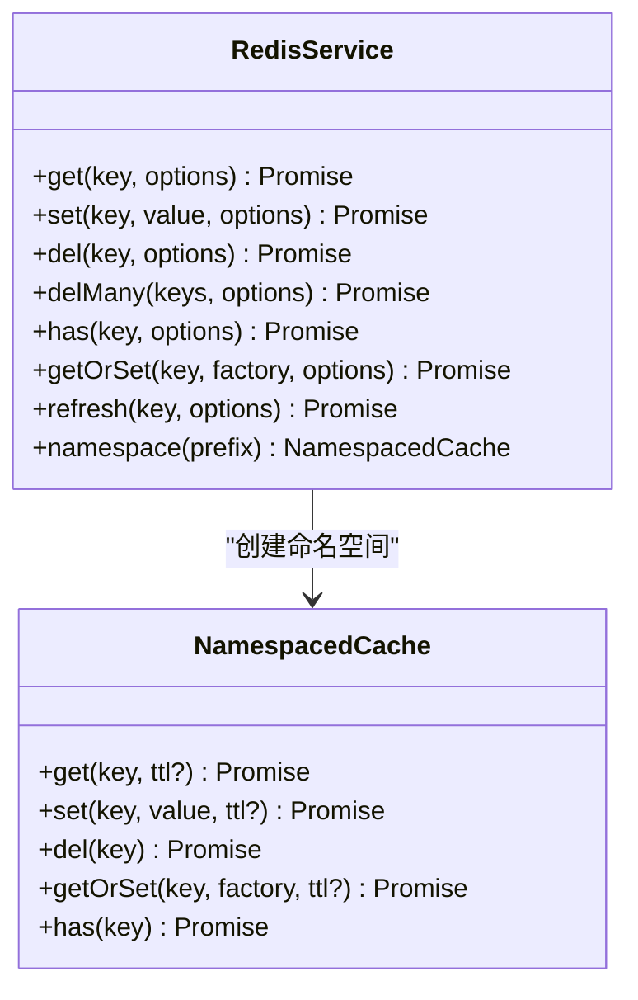
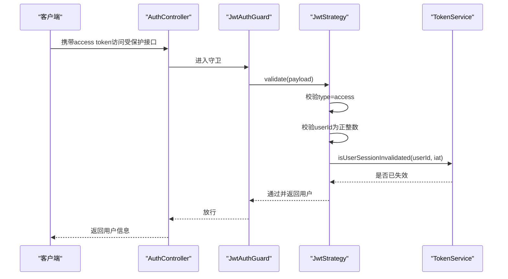
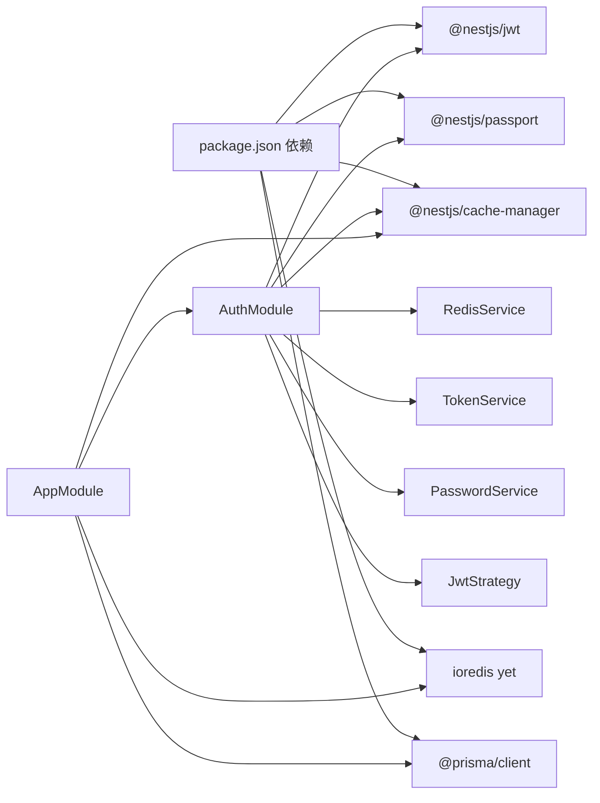

# Token管理

<cite>
**本文引用的文件**
- [apps/backend/src/auth/token.service.ts](file://apps/backend/src/auth/token.service.ts)
- [apps/backend/src/auth/auth.service.ts](file://apps/backend/src/auth/auth.service.ts)
- [apps/backend/src/auth/auth.controller.ts](file://apps/backend/src/auth/auth.controller.ts)
- [apps/backend/src/auth/password.service.ts](file://apps/backend/src/auth/password.service.ts)
- [apps/backend/src/auth/password.controller.ts](file://apps/backend/src/auth/password.controller.ts)
- [apps/backend/src/auth/jwt-auth.guard.ts](file://apps/backend/src/auth/jwt-auth.guard.ts)
- [apps/backend/src/auth/jwt.strategy.ts](file://apps/backend/src/auth/jwt.strategy.ts)
- [apps/backend/src/redis/redis.service.ts](file://apps/backend/src/redis/redis.service.ts)
- [apps/backend/src/redis/cache.decorator.ts](file://apps/backend/src/redis/cache.decorator.ts)
- [apps/backend/src/auth/auth.module.ts](file://apps/backend/src/auth/auth.module.ts)
- [apps/backend/src/app.module.ts](file://apps/backend/src/app.module.ts)
- [apps/backend/package.json](file://apps/backend/package.json)
</cite>

## 目录
1. [简介](#简介)
2. [项目结构](#项目结构)
3. [核心组件](#核心组件)
4. [架构总览](#架构总览)
5. [详细组件分析](#详细组件分析)
6. [依赖关系分析](#依赖关系分析)
7. [性能考量](#性能考量)
8. [故障排除指南](#故障排除指南)
9. [结论](#结论)
10. [附录](#附录)

## 简介
本技术文档围绕Token管理系统进行深入解析，覆盖以下关键主题：
- Token生成算法与密钥管理：区分访问令牌与刷新令牌，分别采用不同密钥与过期策略。
- 唯一性与安全性：通过黑名单机制、会话失效标记、令牌类型校验与过期检测，降低重放与滥用风险。
- 存储与缓存策略：基于Redis的缓存键前缀、TTL与原子写入，保障高并发下的正确性与一致性。
- 刷新与过期：刷新流程中的黑名单校验、用户会话失效标记校验、以及访问令牌的即时过期检测。
- 黑名单与撤销：将即将过期的刷新令牌写入黑名单，结合会话失效标记实现强制撤销。
- 多设备会话控制：通过用户维度的“会话失效时间戳”实现全局撤销，确保多设备同步生效。
- 并发与容错：统一异常处理、忽略黑名单写入失败以保证登出可用性、Redis操作的错误降级。
- 监控与可观测性：日志模块、速率限制、健康检查与错误码，便于问题定位与容量规划。

## 项目结构
认证与Token相关的核心文件组织如下：
- 控制层：负责HTTP接口与请求/响应封装
- 业务层：整合认证、令牌与密码服务
- 安全层：JWT策略与守卫，拦截非授权访问
- 缓存层：统一Redis服务与命名空间缓存
- 配置与模块：全局配置、速率限制、日志与模块装配

图表来源
- [apps/backend/src/auth/auth.controller.ts:1-82](file://apps/backend/src/auth/auth.controller.ts#L1-L82)
- [apps/backend/src/auth/auth.service.ts:1-127](file://apps/backend/src/auth/auth.service.ts#L1-L127)
- [apps/backend/src/auth/token.service.ts:1-187](file://apps/backend/src/auth/token.service.ts#L1-L187)
- [apps/backend/src/auth/password.service.ts:1-100](file://apps/backend/src/auth/password.service.ts#L1-L100)
- [apps/backend/src/auth/jwt.strategy.ts:1-68](file://apps/backend/src/auth/jwt.strategy.ts#L1-L68)
- [apps/backend/src/auth/jwt-auth.guard.ts:1-10](file://apps/backend/src/auth/jwt-auth.guard.ts#L1-L10)
- [apps/backend/src/redis/redis.service.ts:1-233](file://apps/backend/src/redis/redis.service.ts#L1-L233)
- [apps/backend/src/redis/cache.decorator.ts:1-88](file://apps/backend/src/redis/cache.decorator.ts#L1-L88)
- [apps/backend/src/auth/auth.module.ts:1-41](file://apps/backend/src/auth/auth.module.ts#L1-L41)
- [apps/backend/src/app.module.ts:1-175](file://apps/backend/src/app.module.ts#L1-L175)

章节来源
- [apps/backend/src/auth/auth.controller.ts:1-82](file://apps/backend/src/auth/auth.controller.ts#L1-L82)
- [apps/backend/src/auth/auth.service.ts:1-127](file://apps/backend/src/auth/auth.service.ts#L1-L127)
- [apps/backend/src/auth/token.service.ts:1-187](file://apps/backend/src/auth/token.service.ts#L1-L187)
- [apps/backend/src/auth/password.service.ts:1-100](file://apps/backend/src/auth/password.service.ts#L1-L100)
- [apps/backend/src/auth/jwt.strategy.ts:1-68](file://apps/backend/src/auth/jwt.strategy.ts#L1-L68)
- [apps/backend/src/auth/jwt-auth.guard.ts:1-10](file://apps/backend/src/auth/jwt-auth.guard.ts#L1-L10)
- [apps/backend/src/redis/redis.service.ts:1-233](file://apps/backend/src/redis/redis.service.ts#L1-L233)
- [apps/backend/src/redis/cache.decorator.ts:1-88](file://apps/backend/src/redis/cache.decorator.ts#L1-L88)
- [apps/backend/src/auth/auth.module.ts:1-41](file://apps/backend/src/auth/auth.module.ts#L1-L41)
- [apps/backend/src/app.module.ts:1-175](file://apps/backend/src/app.module.ts#L1-L175)

## 核心组件
- TokenService：负责访问/刷新令牌生成、JWT验证、黑名单维护、会话失效标记与响应构建。
- AuthService：认证门面，协调用户校验、令牌生成与密码服务；提供刷新与登出逻辑。
- PasswordService：密码哈希/比较、重置令牌生成与校验、重置成功后使用户所有会话失效。
- RedisService：统一缓存接口，支持前缀、TTL、命名空间、批量删除与穿透保护。
- JwtStrategy/JwtAuthGuard：基于Passport的JWT验证策略与守卫，拦截非授权访问。
- 缓存装饰器：提供方法级缓存能力，支持自定义键与TTL。

章节来源
- [apps/backend/src/auth/token.service.ts:1-187](file://apps/backend/src/auth/token.service.ts#L1-L187)
- [apps/backend/src/auth/auth.service.ts:1-127](file://apps/backend/src/auth/auth.service.ts#L1-L127)
- [apps/backend/src/auth/password.service.ts:1-100](file://apps/backend/src/auth/password.service.ts#L1-L100)
- [apps/backend/src/redis/redis.service.ts:1-233](file://apps/backend/src/redis/redis.service.ts#L1-L233)
- [apps/backend/src/auth/jwt.strategy.ts:1-68](file://apps/backend/src/auth/jwt.strategy.ts#L1-L68)
- [apps/backend/src/auth/jwt-auth.guard.ts:1-10](file://apps/backend/src/auth/jwt-auth.guard.ts#L1-L10)
- [apps/backend/src/redis/cache.decorator.ts:1-88](file://apps/backend/src/redis/cache.decorator.ts#L1-L88)

## 架构总览
下图展示从客户端到服务端的关键交互路径，包括登录、刷新、登出与受保护资源访问。

图表来源
- [apps/backend/src/auth/auth.controller.ts:1-82](file://apps/backend/src/auth/auth.controller.ts#L1-L82)
- [apps/backend/src/auth/auth.service.ts:1-127](file://apps/backend/src/auth/auth.service.ts#L1-L127)
- [apps/backend/src/auth/token.service.ts:1-187](file://apps/backend/src/auth/token.service.ts#L1-L187)
- [apps/backend/src/auth/jwt.strategy.ts:1-68](file://apps/backend/src/auth/jwt.strategy.ts#L1-L68)
- [apps/backend/src/redis/redis.service.ts:1-233](file://apps/backend/src/redis/redis.service.ts#L1-L233)

## 详细组件分析

### TokenService：令牌生成、验证与撤销
- 令牌类型与密钥
  - 访问令牌：短期有效，使用通用密钥。
  - 刷新令牌：长期有效，在生产环境可使用独立密钥。
- 生成与验证
  - 生成访问/刷新令牌：基于JWT签名，分别设置过期时间。
  - 验证：优先尝试刷新密钥，再尝试访问密钥；若均失败则抛出未授权异常。
  - 访问令牌专用验证：严格校验type=access，否则拒绝。
- 黑名单与撤销
  - 将即将过期的刷新令牌写入黑名单，键为“blacklist:原令牌”，TTL为剩余有效期。
  - 刷新流程中先检查黑名单，命中即拒绝。
- 会话失效与多设备控制
  - 通过“invalidate:userId”记录最近失效时间戳，访问令牌验证时比较iat，早于失效时间戳则拒绝。
  - 密码重置成功后调用使用户会话整体失效，实现强制多设备登出。
- 响应构建
  - 统一返回access/refresh令牌与过期秒数，以及用户信息。

图表来源
- [apps/backend/src/auth/token.service.ts:1-187](file://apps/backend/src/auth/token.service.ts#L1-L187)
- [apps/backend/src/redis/redis.service.ts:1-233](file://apps/backend/src/redis/redis.service.ts#L1-L233)

章节来源
- [apps/backend/src/auth/token.service.ts:1-187](file://apps/backend/src/auth/token.service.ts#L1-L187)

### AuthService：认证门面与刷新/登出
- 登录/注册：委托TokenService生成令牌并返回完整响应。
- 刷新：校验刷新令牌是否在黑名单、是否为刷新类型、是否已被用户会话失效、用户是否存在；通过后重新签发令牌。
- 登出：将刷新令牌加入黑名单，忽略黑名单写入失败，确保登出接口可用。
- 密码重置：委托PasswordService完成，重置成功后调用TokenService使用户会话失效。

图表来源
- [apps/backend/src/auth/auth.service.ts:59-93](file://apps/backend/src/auth/auth.service.ts#L59-L93)
- [apps/backend/src/auth/token.service.ts:103-125](file://apps/backend/src/auth/token.service.ts#L103-L125)

章节来源
- [apps/backend/src/auth/auth.service.ts:1-127](file://apps/backend/src/auth/auth.service.ts#L1-L127)

### PasswordService：密码与重置令牌
- 密码哈希与比较：使用bcryptjs。
- 重置令牌：随机生成明文令牌，数据库保存SHA-256哈希；设置过期时间；向用户邮箱发送重置链接。
- 重置流程：校验哈希与过期时间，成功后更新密码并将用户会话整体失效。

图表来源
- [apps/backend/src/auth/password.controller.ts:1-39](file://apps/backend/src/auth/password.controller.ts#L1-L39)
- [apps/backend/src/auth/auth.service.ts:106-112](file://apps/backend/src/auth/auth.service.ts#L106-L112)
- [apps/backend/src/auth/password.service.ts:39-89](file://apps/backend/src/auth/password.service.ts#L39-L89)
- [apps/backend/src/auth/token.service.ts:47-53](file://apps/backend/src/auth/token.service.ts#L47-L53)
- [apps/backend/src/redis/redis.service.ts:100-108](file://apps/backend/src/redis/redis.service.ts#L100-L108)

章节来源
- [apps/backend/src/auth/password.service.ts:1-100](file://apps/backend/src/auth/password.service.ts#L1-L100)
- [apps/backend/src/auth/password.controller.ts:1-39](file://apps/backend/src/auth/password.controller.ts#L1-L39)

### RedisService：缓存策略与命名空间
- 前缀与命名空间：通过CachePrefix与NamespacedCache实现键隔离，避免冲突。
- TTL与原子写入：set操作统一转换为毫秒级TTL；黑名单写入按剩余有效期设置TTL，确保过期自动清理。
- 批量与穿透保护：支持批量删除与getOrSet，减少缓存穿透风险。
- 错误降级：所有缓存操作捕获异常并记录日志，不影响主流程。

图表来源
- [apps/backend/src/redis/redis.service.ts:51-233](file://apps/backend/src/redis/redis.service.ts#L51-L233)

章节来源
- [apps/backend/src/redis/redis.service.ts:1-233](file://apps/backend/src/redis/redis.service.ts#L1-L233)

### JwtStrategy 与 JwtAuthGuard：访问令牌验证
- JwtAuthGuard：基于Passport的jwt策略，拦截未携带或无效的访问令牌。
- JwtStrategy.validate：
  - 强制type=access；
  - 校验sub为正整数；
  - 结合TokenService检查用户会话是否已失效；
  - 加载用户并返回上下文。

图表来源
- [apps/backend/src/auth/jwt-auth.guard.ts:1-10](file://apps/backend/src/auth/jwt-auth.guard.ts#L1-L10)
- [apps/backend/src/auth/jwt.strategy.ts:41-66](file://apps/backend/src/auth/jwt.strategy.ts#L41-L66)
- [apps/backend/src/auth/token.service.ts:55-76](file://apps/backend/src/auth/token.service.ts#L55-L76)

章节来源
- [apps/backend/src/auth/jwt-auth.guard.ts:1-10](file://apps/backend/src/auth/jwt-auth.guard.ts#L1-L10)
- [apps/backend/src/auth/jwt.strategy.ts:1-68](file://apps/backend/src/auth/jwt.strategy.ts#L1-L68)

### 缓存装饰器与方法级缓存
- Cacheable：为方法启用缓存，支持自定义键与TTL。
- NoCache：禁用缓存。
- CacheDecoratorOptions：支持key、ttl、useParams、useQuery等配置。

章节来源
- [apps/backend/src/redis/cache.decorator.ts:1-88](file://apps/backend/src/redis/cache.decorator.ts#L1-L88)

## 依赖关系分析
- 模块装配：AppModule集中配置全局日志、速率限制、BullMQ队列与各子模块；AuthModule装配JWT、Passport与认证相关服务。
- 外部依赖：NestJS生态（JWT、Passport、Cache Manager、ioredis yet）、Prisma、Fastify等。
- 关键耦合点：
  - TokenService依赖RedisService与ConfigService；
  - JwtStrategy依赖ConfigService与TokenService；
  - AuthService聚合TokenService与PasswordService；
  - AuthController依赖AuthService与JwtAuthGuard。

图表来源
- [apps/backend/package.json:30-86](file://apps/backend/package.json#L30-L86)
- [apps/backend/src/auth/auth.module.ts:26-34](file://apps/backend/src/auth/auth.module.ts#L26-L34)
- [apps/backend/src/app.module.ts:97-115](file://apps/backend/src/app.module.ts#L97-L115)

章节来源
- [apps/backend/package.json:1-108](file://apps/backend/package.json#L1-L108)
- [apps/backend/src/auth/auth.module.ts:1-41](file://apps/backend/src/auth/auth.module.ts#L1-L41)
- [apps/backend/src/app.module.ts:1-175](file://apps/backend/src/app.module.ts#L1-L175)

## 性能考量
- Redis写入与TTL
  - 黑名单写入按剩余有效期设置TTL，避免手动清理，降低运维成本。
  - 命名空间前缀隔离，减少键冲突与扫描开销。
- 缓存穿透保护
  - getOrSet在缓存缺失时才回源，减少数据库压力。
- 并发与一致性
  - Redis操作统一捕获异常并降级，避免影响主流程。
  - 刷新与登出流程对黑名单写入失败采取忽略策略，保证用户体验。
- 速率限制
  - 全局Throttler配置短/中/长窗口，防止暴力破解与滥用。
- 日志与可观测性
  - Pino日志模块按环境输出结构化日志，便于问题定位与审计。

## 故障排除指南
- 令牌过期/无效
  - 访问令牌：JwtStrategy.validate中type校验与会话失效检查。
  - 刷新令牌：AuthService.refreshToken中黑名单与用户会话失效检查。
- 登出失败或令牌仍可用
  - 检查Redis连接与写入是否成功；黑名单写入失败会被忽略，但登出接口仍返回成功。
- 多设备会话未立即失效
  - 确认PasswordService重置成功后调用了invalidateUserSessions，并且Redis中存在对应键。
- 频繁触发速率限制
  - 检查Throttler配置与客户端重试策略，适当调整限流阈值。
- 日志与错误码
  - 使用统一的未授权异常与错误消息，便于前端提示与后端排查。

章节来源
- [apps/backend/src/auth/jwt.strategy.ts:41-66](file://apps/backend/src/auth/jwt.strategy.ts#L41-L66)
- [apps/backend/src/auth/auth.service.ts:59-93](file://apps/backend/src/auth/auth.service.ts#L59-L93)
- [apps/backend/src/auth/password.service.ts:88-89](file://apps/backend/src/auth/password.service.ts#L88-L89)
- [apps/backend/src/redis/redis.service.ts:100-108](file://apps/backend/src/redis/redis.service.ts#L100-L108)

## 结论
本Token系统通过“访问令牌+刷新令牌”的双令牌模型与Redis缓存实现高效、安全的认证与会话管理。核心特性包括：
- 明确的令牌生命周期与过期检测；
- 黑名单与会话失效标记相结合，实现主动撤销与多设备同步；
- 统一的JWT验证策略与守卫，确保访问令牌的即时有效性；
- 方法级缓存与命名空间前缀，提升性能与可维护性；
- 完善的异常处理与速率限制，增强系统鲁棒性与抗压能力。

## 附录
- 配置项参考（来自模块与服务）
  - JWT_SECRET、JWT_REFRESH_SECRET（生产环境建议分离）、JWT_ACCESS_EXPIRES_IN、JWT_REFRESH_EXPIRES_IN、RESET_PASSWORD_EXPIRES_IN、THROTTLE_*、REDIS_* 等。
- 关键流程路径
  - 登录/注册：AuthController -> AuthService -> TokenService
  - 刷新：AuthController -> AuthService -> TokenService（黑名单/会话失效/用户校验）
  - 登出：AuthController -> AuthService -> TokenService（黑名单写入）
  - 受保护资源：JwtAuthGuard -> JwtStrategy.validate -> TokenService（会话失效检查）