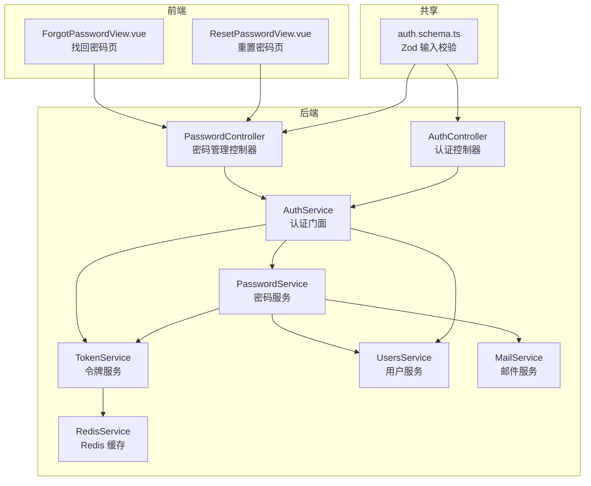
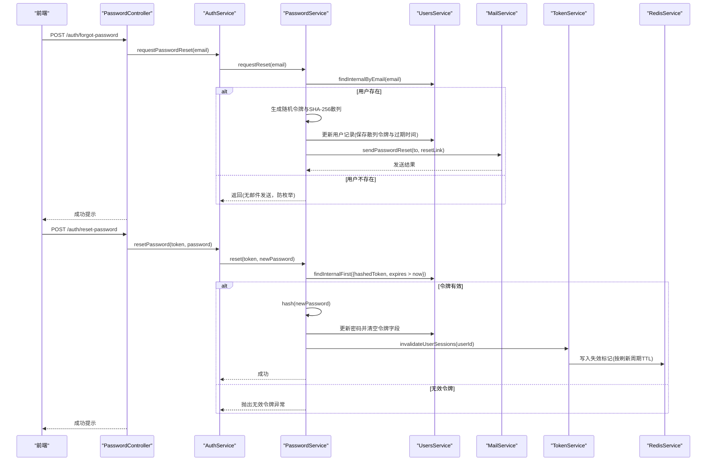
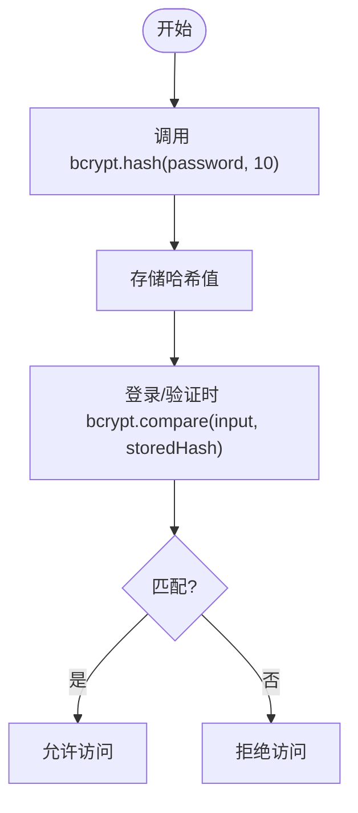
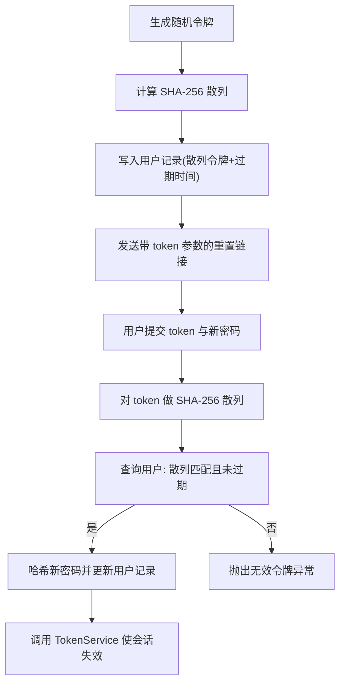
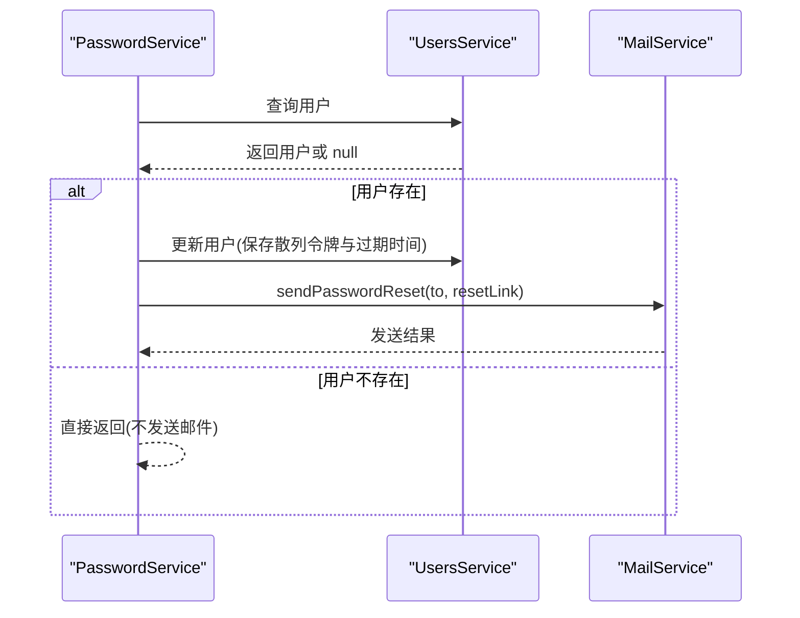
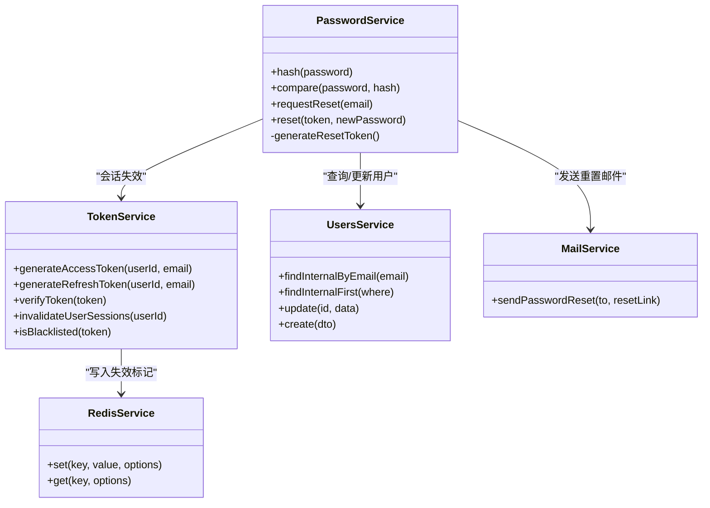

# 密码管理

<cite>
**本文引用的文件**
- [apps/backend/src/auth/password.controller.ts](file://apps/backend/src/auth/password.controller.ts)
- [apps/backend/src/auth/password.service.ts](file://apps/backend/src/auth/password.service.ts)
- [apps/backend/src/auth/auth.service.ts](file://apps/backend/src/auth/auth.service.ts)
- [apps/backend/src/auth/token.service.ts](file://apps/backend/src/auth/token.service.ts)
- [apps/backend/src/auth/auth.controller.ts](file://apps/backend/src/auth/auth.controller.ts)
- [apps/backend/src/auth/auth.dto.ts](file://apps/backend/src/auth/auth.dto.ts)
- [apps/backend/src/mail/mail.service.ts](file://apps/backend/src/mail/mail.service.ts)
- [apps/backend/src/users/users.service.ts](file://apps/backend/src/users/users.service.ts)
- [packages/shared/src/schemas/auth.schema.ts](file://packages/shared/src/schemas/auth.schema.ts)
- [apps/backend/src/app.module.ts](file://apps/backend/src/app.module.ts)
- [apps/backend/src/redis/redis.service.ts](file://apps/backend/src/redis/redis.service.ts)
- [apps/frontend/src/features/auth/views/ForgotPasswordView.vue](file://apps/frontend/src/features/auth/views/ForgotPasswordView.vue)
- [apps/frontend/src/features/auth/views/ResetPasswordView.vue](file://apps/frontend/src/features/auth/views/ResetPasswordView.vue)
- [apps/backend/tests/auth/password.service.spec.ts](file://apps/backend/tests/auth/password.service.spec.ts)
</cite>

## 目录
1. [简介](#简介)
2. [项目结构](#项目结构)
3. [核心组件](#核心组件)
4. [架构总览](#架构总览)
5. [详细组件分析](#详细组件分析)
6. [依赖关系分析](#依赖关系分析)
7. [性能考量](#性能考量)
8. [故障排除指南](#故障排除指南)
9. [结论](#结论)
10. [附录：API 接口与错误处理](#附录api-接口与错误处理)

## 简介
本文件为密码管理系统的全面技术文档，覆盖密码加密算法选择与实现（bcrypt）、盐值生成策略、密码强度验证与复杂度检查、常见弱密码检测、密码重置流程（含邮件发送机制、重置令牌生成与验证）、密码修改与旧密码验证、新密码设置流程、安全最佳实践（密码存储安全、防暴力破解）、以及完整的 API 接口文档与错误处理指南。

## 项目结构
密码管理相关代码主要分布在后端认证模块与共享 DTO 定义中，并通过前端视图完成用户交互与校验。关键目录与文件如下：
- 后端认证模块：控制器、服务、令牌服务、用户服务、邮件服务
- 共享 DTO：前后端统一的输入校验规则
- 前端视图：密码找回与重置页面
- 速率限制与全局守卫：防止暴力破解
- 缓存与会话失效：基于 Redis 的会话失效标记

图表来源
- [apps/backend/src/auth/password.controller.ts:1-39](file://apps/backend/src/auth/password.controller.ts#L1-L39)
- [apps/backend/src/auth/auth.controller.ts:1-82](file://apps/backend/src/auth/auth.controller.ts#L1-L82)
- [apps/backend/src/auth/auth.service.ts:1-127](file://apps/backend/src/auth/auth.service.ts#L1-L127)
- [apps/backend/src/auth/password.service.ts:1-100](file://apps/backend/src/auth/password.service.ts#L1-L100)
- [apps/backend/src/auth/token.service.ts:1-187](file://apps/backend/src/auth/token.service.ts#L1-L187)
- [apps/backend/src/users/users.service.ts:1-110](file://apps/backend/src/users/users.service.ts#L1-L110)
- [apps/backend/src/mail/mail.service.ts:1-117](file://apps/backend/src/mail/mail.service.ts#L1-L117)
- [apps/backend/src/redis/redis.service.ts:1-233](file://apps/backend/src/redis/redis.service.ts#L1-L233)
- [packages/shared/src/schemas/auth.schema.ts:1-121](file://packages/shared/src/schemas/auth.schema.ts#L1-L121)
- [apps/frontend/src/features/auth/views/ForgotPasswordView.vue:1-104](file://apps/frontend/src/features/auth/views/ForgotPasswordView.vue#L1-L104)
- [apps/frontend/src/features/auth/views/ResetPasswordView.vue:1-152](file://apps/frontend/src/features/auth/views/ResetPasswordView.vue#L1-L152)

章节来源
- [apps/backend/src/auth/password.controller.ts:1-39](file://apps/backend/src/auth/password.controller.ts#L1-L39)
- [apps/backend/src/auth/auth.controller.ts:1-82](file://apps/backend/src/auth/auth.controller.ts#L1-L82)
- [apps/backend/src/auth/auth.service.ts:1-127](file://apps/backend/src/auth/auth.service.ts#L1-L127)
- [apps/backend/src/auth/password.service.ts:1-100](file://apps/backend/src/auth/password.service.ts#L1-L100)
- [apps/backend/src/auth/token.service.ts:1-187](file://apps/backend/src/auth/token.service.ts#L1-L187)
- [apps/backend/src/users/users.service.ts:1-110](file://apps/backend/src/users/users.service.ts#L1-L110)
- [apps/backend/src/mail/mail.service.ts:1-117](file://apps/backend/src/mail/mail.service.ts#L1-L117)
- [apps/backend/src/redis/redis.service.ts:1-233](file://apps/backend/src/redis/redis.service.ts#L1-L233)
- [packages/shared/src/schemas/auth.schema.ts:1-121](file://packages/shared/src/schemas/auth.schema.ts#L1-L121)
- [apps/frontend/src/features/auth/views/ForgotPasswordView.vue:1-104](file://apps/frontend/src/features/auth/views/ForgotPasswordView.vue#L1-L104)
- [apps/frontend/src/features/auth/views/ResetPasswordView.vue:1-152](file://apps/frontend/src/features/auth/views/ResetPasswordView.vue#L1-L152)

## 核心组件
- 密码服务 PasswordService：负责密码哈希、比较、重置令牌生成与验证、触发邮件发送与会话失效
- 令牌服务 TokenService：负责 JWT 访问/刷新令牌生成、验证、黑名单、会话失效标记
- 用户服务 UsersService：负责用户查询、更新、创建时的密码哈希
- 邮件服务 MailService：封装邮件发送，支持国际化主题与内容
- 认证门面 AuthService：整合 PasswordService 与 TokenService，对外提供统一接口
- 控制器：PasswordController 负责“找回密码”和“重置密码”；AuthController 负责登录、注册、刷新、登出、当前用户

章节来源
- [apps/backend/src/auth/password.service.ts:1-100](file://apps/backend/src/auth/password.service.ts#L1-L100)
- [apps/backend/src/auth/token.service.ts:1-187](file://apps/backend/src/auth/token.service.ts#L1-L187)
- [apps/backend/src/users/users.service.ts:1-110](file://apps/backend/src/users/users.service.ts#L1-L110)
- [apps/backend/src/mail/mail.service.ts:1-117](file://apps/backend/src/mail/mail.service.ts#L1-L117)
- [apps/backend/src/auth/auth.service.ts:1-127](file://apps/backend/src/auth/auth.service.ts#L1-L127)
- [apps/backend/src/auth/password.controller.ts:1-39](file://apps/backend/src/auth/password.controller.ts#L1-L39)
- [apps/backend/src/auth/auth.controller.ts:1-82](file://apps/backend/src/auth/auth.controller.ts#L1-L82)

## 架构总览
密码管理采用分层架构：控制器接收请求，门面服务协调密码与令牌服务，令牌服务与缓存协同实现会话失效控制，用户服务与数据库交互，邮件服务负责通知。

图表来源
- [apps/backend/src/auth/password.controller.ts:1-39](file://apps/backend/src/auth/password.controller.ts#L1-L39)
- [apps/backend/src/auth/auth.service.ts:106-112](file://apps/backend/src/auth/auth.service.ts#L106-L112)
- [apps/backend/src/auth/password.service.ts:39-89](file://apps/backend/src/auth/password.service.ts#L39-L89)
- [apps/backend/src/users/users.service.ts:55-83](file://apps/backend/src/users/users.service.ts#L55-L83)
- [apps/backend/src/mail/mail.service.ts:91-115](file://apps/backend/src/mail/mail.service.ts#L91-L115)
- [apps/backend/src/auth/token.service.ts:47-53](file://apps/backend/src/auth/token.service.ts#L47-L53)
- [apps/backend/src/redis/redis.service.ts:79-81](file://apps/backend/src/redis/redis.service.ts#L79-L81)

## 详细组件分析

### 密码加密与盐值策略
- 加密算法：bcrypt（使用 bcryptjs），成本因子固定为 10
- 盐值生成：由 bcrypt 自动处理，无需手动干预
- 密码比较：使用 bcrypt.compare 进行常量时间比较，降低侧信道风险
- 存储策略：注册与重置时均对明文密码进行哈希后再入库

图表来源
- [apps/backend/src/auth/password.service.ts:25-34](file://apps/backend/src/auth/password.service.ts#L25-L34)
- [apps/backend/src/users/users.service.ts:97-104](file://apps/backend/src/users/users.service.ts#L97-L104)

章节来源
- [apps/backend/src/auth/password.service.ts:25-34](file://apps/backend/src/auth/password.service.ts#L25-L34)
- [apps/backend/src/users/users.service.ts:97-104](file://apps/backend/src/users/users.service.ts#L97-L104)

### 重置令牌生成与验证
- 令牌生成：使用 crypto.randomBytes 生成 32 字节随机十六进制字符串作为明文令牌；同时计算 SHA-256 散列存入数据库，查询时使用散列比对
- 过期控制：根据配置项设置过期时间（秒），查询时需满足“过期时间大于当前时间”
- 防枚举攻击：若邮箱不存在，不发送邮件，避免泄露用户注册状态
- 会话失效：重置成功后调用 TokenService 在 Redis 中写入失效标记，使后续刷新/访问令牌校验失败

图表来源
- [apps/backend/src/auth/password.service.ts:94-98](file://apps/backend/src/auth/password.service.ts#L94-L98)
- [apps/backend/src/auth/password.service.ts:47-50](file://apps/backend/src/auth/password.service.ts#L47-L50)
- [apps/backend/src/auth/password.service.ts:66-89](file://apps/backend/src/auth/password.service.ts#L66-L89)
- [apps/backend/src/auth/token.service.ts:47-53](file://apps/backend/src/auth/token.service.ts#L47-L53)

章节来源
- [apps/backend/src/auth/password.service.ts:39-89](file://apps/backend/src/auth/password.service.ts#L39-L89)
- [apps/backend/src/auth/token.service.ts:47-53](file://apps/backend/src/auth/token.service.ts#L47-L53)

### 邮件发送机制
- 邮件模板：使用国际化键动态生成主题与正文，HTML 版本包含按钮与过期提示
- 发送流程：PasswordService 生成重置链接后调用 MailService.sendPasswordReset，内部通过 nodemailer 发送
- 失败处理：发送失败不会中断流程，仅记录日志并返回布尔结果

图表来源
- [apps/backend/src/auth/password.service.ts:39-61](file://apps/backend/src/auth/password.service.ts#L39-L61)
- [apps/backend/src/mail/mail.service.ts:91-115](file://apps/backend/src/mail/mail.service.ts#L91-L115)

章节来源
- [apps/backend/src/mail/mail.service.ts:91-115](file://apps/backend/src/mail/mail.service.ts#L91-L115)
- [apps/backend/src/auth/password.service.ts:39-61](file://apps/backend/src/auth/password.service.ts#L39-L61)

### 密码强度与复杂度检查
- 基础规则：最小长度、最大长度、必填
- 前端校验：ResetPasswordView 对新密码与确认密码进行一致性校验
- 共享规则：auth.schema.ts 定义了通用的邮箱与密码基础规则，前后端统一使用
- 弱密码检测：当前实现未包含常见弱密码列表检测；建议在业务层扩展字典校验或引入在线查询（需权衡隐私与性能）

章节来源
- [packages/shared/src/schemas/auth.schema.ts:17-21](file://packages/shared/src/schemas/auth.schema.ts#L17-L21)
- [packages/shared/src/schemas/auth.schema.ts:107-110](file://packages/shared/src/schemas/auth.schema.ts#L107-L110)
- [apps/frontend/src/features/auth/views/ResetPasswordView.vue:24-32](file://apps/frontend/src/features/auth/views/ResetPasswordView.vue#L24-L32)

### 旧密码验证与新密码设置
- 当前系统未提供“旧密码验证 + 修改密码”的接口；现有流程为“忘记密码 → 重置令牌 → 设置新密码”
- 若需实现“修改密码”，可在 AuthService/PasswordController 中新增接口，流程应包括：
  - 旧密码验证（bcrypt.compare）
  - 新密码强度校验
  - 新密码哈希与更新
  - 可选：触发会话失效以强制重新登录

章节来源
- [apps/backend/src/auth/auth.service.ts:106-112](file://apps/backend/src/auth/auth.service.ts#L106-L112)
- [apps/backend/src/auth/password.controller.ts:1-39](file://apps/backend/src/auth/password.controller.ts#L1-L39)

### 速率限制与防暴力破解
- 全局速率限制：ThrottlerModule 配置多级 TTL 与限制，统一拦截高频请求
- 控制器级别限制：登录、注册、刷新、找回密码、重置密码等接口分别设置不同阈值
- 令牌黑名单：TokenService 支持将已注销的令牌加入黑名单，结合 Redis TTL 实现短期阻断
- 会话失效：重置密码后通过 Redis 写入失效标记，使旧令牌无法继续使用

章节来源
- [apps/backend/src/app.module.ts:117-138](file://apps/backend/src/app.module.ts#L117-L138)
- [apps/backend/src/auth/auth.controller.ts:22-48](file://apps/backend/src/auth/auth.controller.ts#L22-L48)
- [apps/backend/src/auth/password.controller.ts:19-37](file://apps/backend/src/auth/password.controller.ts#L19-L37)
- [apps/backend/src/auth/token.service.ts:130-149](file://apps/backend/src/auth/token.service.ts#L130-L149)
- [apps/backend/src/auth/token.service.ts:47-53](file://apps/backend/src/auth/token.service.ts#L47-L53)

## 依赖关系分析
- 组件耦合
  - PasswordService 依赖 UsersService、ConfigService、MailService、TokenService
  - TokenService 依赖 JwtService、ConfigService、RedisService
  - AuthService 作为门面聚合 PasswordService 与 TokenService
- 外部依赖
  - bcryptjs：密码哈希与比较
  - crypto：随机令牌与 SHA-256 散列
  - nodemailer：邮件发送
  - cache-manager + Redis：缓存与会话失效标记
- 潜在循环依赖
  - PasswordService 与 TokenService 通过 AuthService 解耦，避免直接互相注入

图表来源
- [apps/backend/src/auth/password.service.ts:1-100](file://apps/backend/src/auth/password.service.ts#L1-L100)
- [apps/backend/src/auth/token.service.ts:1-187](file://apps/backend/src/auth/token.service.ts#L1-L187)
- [apps/backend/src/users/users.service.ts:1-110](file://apps/backend/src/users/users.service.ts#L1-L110)
- [apps/backend/src/mail/mail.service.ts:1-117](file://apps/backend/src/mail/mail.service.ts#L1-L117)
- [apps/backend/src/redis/redis.service.ts:1-233](file://apps/backend/src/redis/redis.service.ts#L1-L233)

章节来源
- [apps/backend/src/auth/password.service.ts:1-100](file://apps/backend/src/auth/password.service.ts#L1-L100)
- [apps/backend/src/auth/token.service.ts:1-187](file://apps/backend/src/auth/token.service.ts#L1-L187)
- [apps/backend/src/users/users.service.ts:1-110](file://apps/backend/src/users/users.service.ts#L1-L110)
- [apps/backend/src/mail/mail.service.ts:1-117](file://apps/backend/src/mail/mail.service.ts#L1-L117)
- [apps/backend/src/redis/redis.service.ts:1-233](file://apps/backend/src/redis/redis.service.ts#L1-L233)

## 性能考量
- bcrypt 成本因子：当前为 10，平衡安全性与性能；高并发场景可评估提升至 12，但需监控 CPU 与延迟
- 速率限制：多级 TTL 与限制组合，避免突发流量导致系统过载
- 缓存命中：Redis 命中率影响会话校验与黑名单查询性能；建议合理设置 TTL 与键前缀
- 邮件异步：建议将邮件发送改为队列异步处理，避免阻塞请求

## 故障排除指南
- 无效重置令牌
  - 现象：抛出“无效重置令牌”异常
  - 原因：令牌不存在、已过期、或明文与散列不匹配
  - 处理：检查前端传参、后端过期时间配置、Redis 是否正确写入
- 邮件发送失败
  - 现象：返回发送失败布尔值，日志记录错误
  - 原因：SMTP 配置错误、网络问题、收件人地址无效
  - 处理：检查 MAIL_* 环境变量与 SMTP 服务器连通性
- 会话未失效
  - 现象：重置后仍可使用旧令牌
  - 原因：Redis 写入失败或 TTL 设置不当
  - 处理：检查 Redis 连接与 TTL 配置，确认刷新令牌周期
- 登录/注册频繁失败
  - 现象：被速率限制拦截
  - 原因：超出每分钟请求数
  - 处理：前端退避重试，后端调整限流阈值

章节来源
- [apps/backend/src/auth/password.service.ts:76-78](file://apps/backend/src/auth/password.service.ts#L76-L78)
- [apps/backend/src/mail/mail.service.ts:55-59](file://apps/backend/src/mail/mail.service.ts#L55-L59)
- [apps/backend/src/auth/token.service.ts:47-53](file://apps/backend/src/auth/token.service.ts#L47-L53)
- [apps/backend/src/app.module.ts:117-138](file://apps/backend/src/app.module.ts#L117-L138)

## 结论
本密码管理系统在安全性方面采用了 bcrypt 哈希、随机令牌与 SHA-256 散列、邮件通知与会话失效标记等综合手段；在可用性方面通过速率限制与国际化邮件模板提升了用户体验。建议后续补充“旧密码验证 + 修改密码”接口、弱密码检测与异步邮件队列，进一步完善安全与性能。

## 附录：API 接口与错误处理

### API 接口定义
- POST /auth/forgot-password
  - 功能：请求密码重置
  - 速率限制：每分钟最多 3 次
  - 请求体：邮箱
  - 响应：成功提示消息
  - 错误：无用户时不发送邮件（防枚举）
- POST /auth/reset-password
  - 功能：使用令牌重置密码
  - 速率限制：每分钟最多 5 次
  - 请求体：令牌、新密码
  - 响应：成功提示消息
  - 错误：无效令牌、过期令牌

章节来源
- [apps/backend/src/auth/password.controller.ts:19-37](file://apps/backend/src/auth/password.controller.ts#L19-L37)
- [apps/backend/src/auth/password.service.ts:39-89](file://apps/backend/src/auth/password.service.ts#L39-L89)

### 错误处理与国际化
- 错误键
  - auth.INVALID_RESET_TOKEN：无效重置令牌
  - auth.INVALID_CREDENTIALS：无效凭据
  - auth.TOKEN_EXPIRED：令牌过期
  - auth.INVALID_TOKEN：无效令牌
  - auth.INVALID_REFRESH_TOKEN：无效刷新令牌
  - auth.USER_NOT_FOUND：用户不存在
  - auth.EMAIL_EXISTS：邮箱已存在
  - auth.INVALID_USER_ID：用户ID无效
  - auth.USER_ID_NOT_FOUND：用户ID未找到
- 国际化：邮件模板与错误消息通过 i18n 动态加载，支持多语言

章节来源
- [apps/backend/src/auth/password.service.ts:76-78](file://apps/backend/src/auth/password.service.ts#L76-L78)
- [apps/backend/src/auth/auth.service.ts:44-46](file://apps/backend/src/auth/auth.service.ts#L44-L46)
- [apps/backend/src/auth/token.service.ts:103-113](file://apps/backend/src/auth/token.service.ts#L103-L113)
- [apps/backend/src/mail/mail.service.ts:91-115](file://apps/backend/src/mail/mail.service.ts#L91-L115)

### 测试要点（参考）
- bcrypt 哈希与比较行为
- 重置令牌生成与散列存储
- 无效用户不发送邮件
- 令牌过期与无效令牌异常
- 重置成功后会话失效标记写入

章节来源
- [apps/backend/tests/auth/password.service.spec.ts:37-58](file://apps/backend/tests/auth/password.service.spec.ts#L37-L58)
- [apps/backend/tests/auth/password.service.spec.ts:60-81](file://apps/backend/tests/auth/password.service.spec.ts#L60-L81)