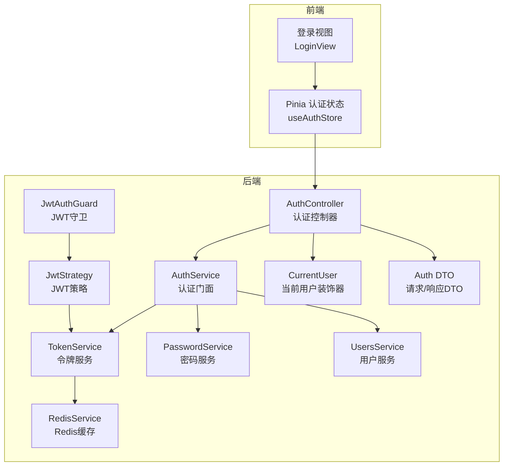
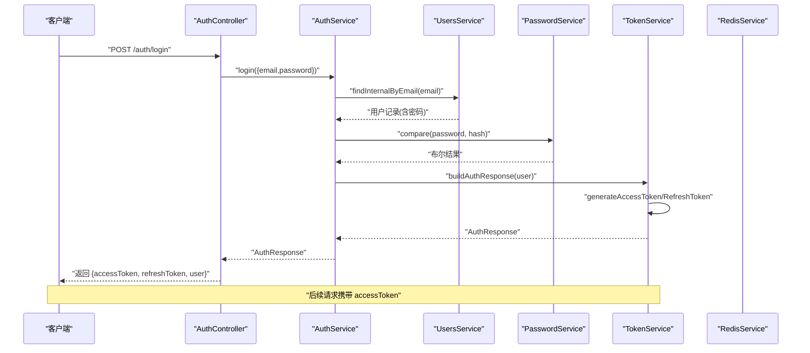
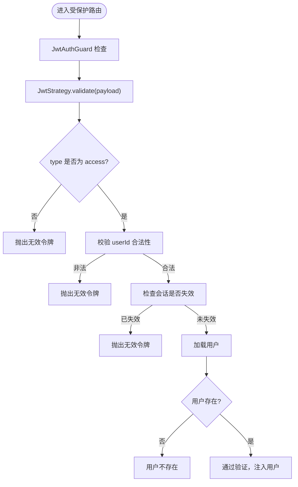
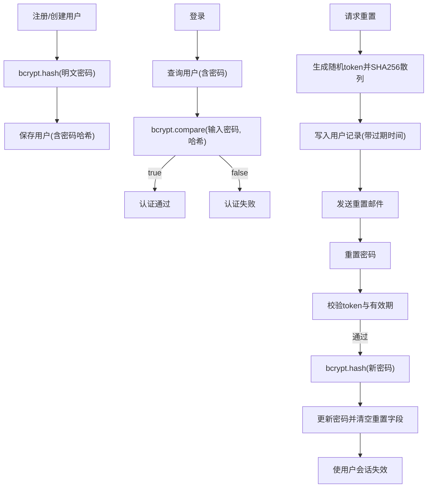
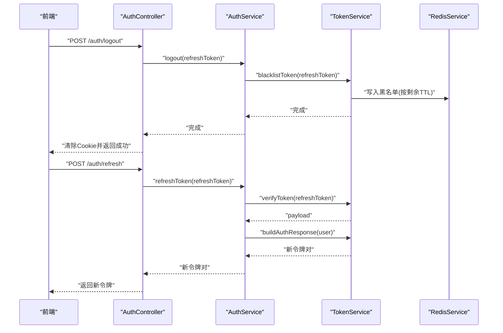
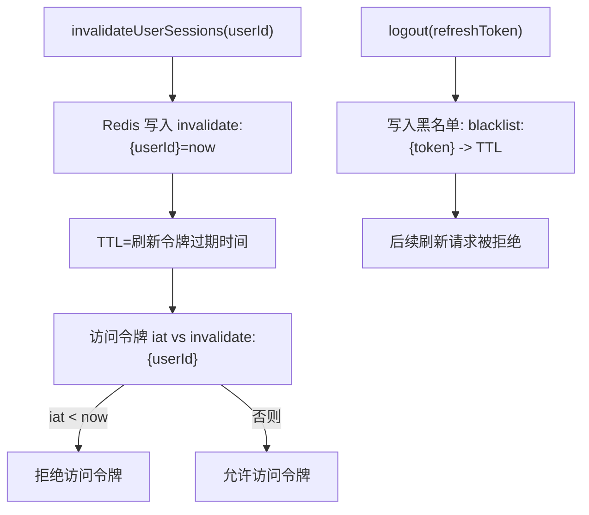
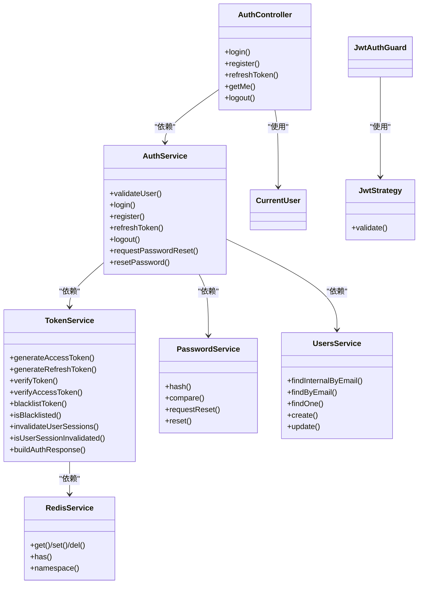

# 认证与授权

<cite>
**本文引用的文件**
- [apps/backend/src/auth/auth.controller.ts](file://apps/backend/src/auth/auth.controller.ts)
- [apps/backend/src/auth/auth.service.ts](file://apps/backend/src/auth/auth.service.ts)
- [apps/backend/src/auth/jwt-auth.guard.ts](file://apps/backend/src/auth/jwt-auth.guard.ts)
- [apps/backend/src/auth/jwt.strategy.ts](file://apps/backend/src/auth/jwt.strategy.ts)
- [apps/backend/src/auth/token.service.ts](file://apps/backend/src/auth/token.service.ts)
- [apps/backend/src/auth/password.service.ts](file://apps/backend/src/auth/password.service.ts)
- [apps/backend/src/auth/password.controller.ts](file://apps/backend/src/auth/password.controller.ts)
- [apps/backend/src/auth/current-user.decorator.ts](file://apps/backend/src/auth/current-user.decorator.ts)
- [apps/backend/src/auth/auth.dto.ts](file://apps/backend/src/auth/auth.dto.ts)
- [apps/backend/src/users/users.service.ts](file://apps/backend/src/users/users.service.ts)
- [apps/backend/src/redis/redis.service.ts](file://apps/backend/src/redis/redis.service.ts)
- [apps/backend/src/app.module.ts](file://apps/backend/src/app.module.ts)
- [apps/frontend/src/features/auth/stores/auth.ts](file://apps/frontend/src/features/auth/stores/auth.ts)
- [apps/frontend/src/features/auth/views/LoginView.vue](file://apps/frontend/src/features/auth/views/LoginView.vue)
- [packages/shared/src/schemas/auth.schema.ts](file://packages/shared/src/schemas/auth.schema.ts)
</cite>

## 目录
1. [简介](#简介)
2. [项目结构](#项目结构)
3. [核心组件](#核心组件)
4. [架构总览](#架构总览)
5. [详细组件分析](#详细组件分析)
6. [依赖关系分析](#依赖关系分析)
7. [性能考量](#性能考量)
8. [故障排除指南](#故障排除指南)
9. [结论](#结论)
10. [附录：API接口与错误处理](#附录api接口与错误处理)

## 简介
本文件面向Lumina认证与授权系统，系统采用基于JWT的双令牌模型（短期访问令牌 + 长期刷新令牌），结合Passport策略与NestJS守卫实现统一的认证与授权控制；通过Redis实现令牌黑名单、会话失效标记与速率限制；前端使用Pinia状态管理与拦截器配合，实现自动令牌刷新与跨页面持久化。本文档覆盖JWT认证流程、Passport策略实现、用户密码加密存储、登录登出机制、Token刷新策略、多设备会话管理、JWT守卫使用场景、角色权限与资源访问控制、密码重置流程、邮箱验证机制、第三方登录集成建议、安全最佳实践、CSRF防护与会话超时处理，并提供完整的API接口与错误处理指南。

## 项目结构
后端采用NestJS模块化组织，认证相关模块集中于apps/backend/src/auth，用户与缓存分别位于users与redis子模块；共享Schema位于packages/shared；前端认证状态与UI位于apps/frontend/src/features/auth。

图表来源
- [apps/backend/src/auth/auth.controller.ts:1-82](file://apps/backend/src/auth/auth.controller.ts#L1-L82)
- [apps/backend/src/auth/auth.service.ts:1-127](file://apps/backend/src/auth/auth.service.ts#L1-L127)
- [apps/backend/src/auth/token.service.ts:1-187](file://apps/backend/src/auth/token.service.ts#L1-L187)
- [apps/backend/src/auth/password.service.ts:1-100](file://apps/backend/src/auth/password.service.ts#L1-L100)
- [apps/backend/src/users/users.service.ts:1-110](file://apps/backend/src/users/users.service.ts#L1-L110)
- [apps/backend/src/redis/redis.service.ts:1-233](file://apps/backend/src/redis/redis.service.ts#L1-L233)
- [apps/backend/src/auth/jwt.strategy.ts:1-68](file://apps/backend/src/auth/jwt.strategy.ts#L1-L68)
- [apps/backend/src/auth/jwt-auth.guard.ts:1-10](file://apps/backend/src/auth/jwt-auth.guard.ts#L1-L10)
- [apps/backend/src/auth/current-user.decorator.ts:1-19](file://apps/backend/src/auth/current-user.decorator.ts#L1-L19)
- [apps/backend/src/auth/auth.dto.ts:1-41](file://apps/backend/src/auth/auth.dto.ts#L1-L41)
- [apps/frontend/src/features/auth/stores/auth.ts:1-391](file://apps/frontend/src/features/auth/stores/auth.ts#L1-L391)
- [apps/frontend/src/features/auth/views/LoginView.vue:1-111](file://apps/frontend/src/features/auth/views/LoginView.vue#L1-L111)

章节来源
- [apps/backend/src/app.module.ts:1-175](file://apps/backend/src/app.module.ts#L1-L175)

## 核心组件
- 认证控制器：提供登录、注册、刷新、登出、获取当前用户等REST接口，内置节流与Swagger标注。
- 认证服务：作为门面整合用户查询、密码校验、令牌构建与密码重置流程。
- 令牌服务：负责JWT签名/验证、访问令牌与刷新令牌生成、令牌黑名单、用户会话失效标记。
- 密码服务：负责密码哈希/比较、重置令牌生成与校验、邮件发送。
- 用户服务：提供用户查询、创建、更新等基础能力。
- Redis服务：提供统一缓存接口，支撑黑名单、会话失效标记、速率限制等。
- JWT策略与守卫：Passport策略验证访问令牌有效性，守卫保护受保护路由。
- 当前用户装饰器：简化从请求中提取当前用户。
- 前端认证状态：Pinia持久化存储token与用户信息，自动刷新与错误处理。

章节来源
- [apps/backend/src/auth/auth.controller.ts:1-82](file://apps/backend/src/auth/auth.controller.ts#L1-L82)
- [apps/backend/src/auth/auth.service.ts:1-127](file://apps/backend/src/auth/auth.service.ts#L1-L127)
- [apps/backend/src/auth/token.service.ts:1-187](file://apps/backend/src/auth/token.service.ts#L1-L187)
- [apps/backend/src/auth/password.service.ts:1-100](file://apps/backend/src/auth/password.service.ts#L1-L100)
- [apps/backend/src/users/users.service.ts:1-110](file://apps/backend/src/users/users.service.ts#L1-L110)
- [apps/backend/src/redis/redis.service.ts:1-233](file://apps/backend/src/redis/redis.service.ts#L1-L233)
- [apps/backend/src/auth/jwt-auth.guard.ts:1-10](file://apps/backend/src/auth/jwt-auth.guard.ts#L1-L10)
- [apps/backend/src/auth/jwt.strategy.ts:1-68](file://apps/backend/src/auth/jwt.strategy.ts#L1-L68)
- [apps/backend/src/auth/current-user.decorator.ts:1-19](file://apps/backend/src/auth/current-user.decorator.ts#L1-L19)
- [apps/frontend/src/features/auth/stores/auth.ts:1-391](file://apps/frontend/src/features/auth/stores/auth.ts#L1-L391)

## 架构总览
系统采用“控制器-服务-策略-守卫-缓存”的分层设计，认证流程由控制器接收请求，服务层协调用户与令牌逻辑，策略负责JWT验证，守卫保护路由，Redis提供黑名单与会话失效标记，前端负责状态持久化与自动刷新。

图表来源
- [apps/backend/src/auth/auth.controller.ts:22-27](file://apps/backend/src/auth/auth.controller.ts#L22-L27)
- [apps/backend/src/auth/auth.service.ts:41-49](file://apps/backend/src/auth/auth.service.ts#L41-L49)
- [apps/backend/src/auth/token.service.ts:175-185](file://apps/backend/src/auth/token.service.ts#L175-L185)
- [apps/backend/src/users/users.service.ts:55-57](file://apps/backend/src/users/users.service.ts#L55-L57)
- [apps/backend/src/auth/password.service.ts:32-34](file://apps/backend/src/auth/password.service.ts#L32-L34)

## 详细组件分析

### JWT认证流程与Passport策略
- 访问令牌与刷新令牌：访问令牌短期有效，刷新令牌长期有效；策略仅接受type=access的令牌，且需满足会话未失效。
- 策略验证步骤：校验令牌类型、用户ID合法性、会话失效标记、用户存在性。
- 守卫使用：JwtAuthGuard用于保护受保护路由，确保请求携带有效的访问令牌。

图表来源
- [apps/backend/src/auth/jwt-auth.guard.ts:1-10](file://apps/backend/src/auth/jwt-auth.guard.ts#L1-L10)
- [apps/backend/src/auth/jwt.strategy.ts:41-66](file://apps/backend/src/auth/jwt.strategy.ts#L41-L66)

章节来源
- [apps/backend/src/auth/jwt-auth.guard.ts:1-10](file://apps/backend/src/auth/jwt-auth.guard.ts#L1-L10)
- [apps/backend/src/auth/jwt.strategy.ts:1-68](file://apps/backend/src/auth/jwt.strategy.ts#L1-L68)

### 用户密码加密存储
- 注册与创建用户时使用bcrypt进行密码哈希。
- 登录时使用bcrypt比较输入密码与数据库中的哈希值。
- 密码重置流程：生成随机重置令牌并SHA256散列存储，设置过期时间，发送重置链接；重置时校验令牌与有效期，成功后哈希新密码并使用户会话失效。

图表来源
- [apps/backend/src/users/users.service.ts:97-107](file://apps/backend/src/users/users.service.ts#L97-L107)
- [apps/backend/src/auth/password.service.ts:25-34](file://apps/backend/src/auth/password.service.ts#L25-L34)
- [apps/backend/src/auth/password.service.ts:66-89](file://apps/backend/src/auth/password.service.ts#L66-L89)
- [apps/backend/src/auth/token.service.ts:47-53](file://apps/backend/src/auth/token.service.ts#L47-L53)

章节来源
- [apps/backend/src/users/users.service.ts:1-110](file://apps/backend/src/users/users.service.ts#L1-L110)
- [apps/backend/src/auth/password.service.ts:1-100](file://apps/backend/src/auth/password.service.ts#L1-L100)

### 登录、登出与Token刷新
- 登录：校验凭据，构建包含访问令牌、刷新令牌与用户信息的响应。
- 登出：将刷新令牌加入黑名单，后端同时清除客户端Cookie。
- 刷新：校验刷新令牌有效性、类型、用户会话未失效，成功后重新签发新的访问与刷新令牌。
- 前端刷新：在访问令牌即将过期或401时，使用刷新令牌自动重试有限次数，失败则引导登出。

图表来源
- [apps/backend/src/auth/auth.controller.ts:65-80](file://apps/backend/src/auth/auth.controller.ts#L65-L80)
- [apps/backend/src/auth/auth.service.ts:95-101](file://apps/backend/src/auth/auth.service.ts#L95-L101)
- [apps/backend/src/auth/token.service.ts:130-150](file://apps/backend/src/auth/token.service.ts#L130-L150)
- [apps/frontend/src/features/auth/stores/auth.ts:325-351](file://apps/frontend/src/features/auth/stores/auth.ts#L325-L351)

章节来源
- [apps/backend/src/auth/auth.controller.ts:1-82](file://apps/backend/src/auth/auth.controller.ts#L1-L82)
- [apps/backend/src/auth/auth.service.ts:1-127](file://apps/backend/src/auth/auth.service.ts#L1-L127)
- [apps/backend/src/auth/token.service.ts:1-187](file://apps/backend/src/auth/token.service.ts#L1-L187)
- [apps/frontend/src/features/auth/stores/auth.ts:1-391](file://apps/frontend/src/features/auth/stores/auth.ts#L1-L391)

### 多设备会话管理
- 会话失效：调用invalidateUserSessions为用户写入失效时间戳，后续访问令牌的iat早于失效时间戳将被拒绝。
- 黑名单：刷新令牌登出时写入黑名单，按剩余TTL缓存，确保离线期间也能阻止使用。
- 前端持久化：使用localStorage持久化token与用户信息，跨页面刷新后可恢复状态并触发自动刷新。

图表来源
- [apps/backend/src/auth/token.service.ts:47-53](file://apps/backend/src/auth/token.service.ts#L47-L53)
- [apps/backend/src/auth/token.service.ts:130-150](file://apps/backend/src/auth/token.service.ts#L130-L150)
- [apps/frontend/src/features/auth/stores/auth.ts:53-70](file://apps/frontend/src/features/auth/stores/auth.ts#L53-L70)

章节来源
- [apps/backend/src/auth/token.service.ts:1-187](file://apps/backend/src/auth/token.service.ts#L1-L187)
- [apps/frontend/src/features/auth/stores/auth.ts:1-391](file://apps/frontend/src/features/auth/stores/auth.ts#L1-L391)

### JWT守卫使用场景、角色权限与资源访问控制
- 路由级保护：在需要认证的路由上使用JwtAuthGuard，确保只有携带有效访问令牌的请求才能通过。
- 资源访问控制：结合装饰器与业务服务实现更细粒度的资源访问控制（如用户ID匹配、资源所有权校验等）。
- 角色权限：可在策略或守卫中扩展角色字段，结合装饰器实现RBAC。

章节来源
- [apps/backend/src/auth/jwt-auth.guard.ts:1-10](file://apps/backend/src/auth/jwt-auth.guard.ts#L1-L10)
- [apps/backend/src/auth/jwt.strategy.ts:41-66](file://apps/backend/src/auth/jwt.strategy.ts#L41-L66)

### 密码重置流程与邮箱验证机制
- 请求重置：根据邮箱查找用户，生成随机token并SHA256散列存储，设置过期时间，发送重置链接。
- 重置密码：校验token与有效期，成功后哈希新密码并清空重置字段，同时使用户会话失效。
- 邮箱验证：通过MailService发送重置邮件，前端引导用户点击链接完成重置。

章节来源
- [apps/backend/src/auth/password.controller.ts:1-39](file://apps/backend/src/auth/password.controller.ts#L1-L39)
- [apps/backend/src/auth/password.service.ts:39-89](file://apps/backend/src/auth/password.service.ts#L39-L89)

### 第三方登录集成（建议）
- Passport策略扩展：新增OAuth策略（如Google、GitHub），在策略中解析第三方用户信息并映射到本地用户。
- 令牌发放：第三方登录成功后，沿用现有TokenService签发访问与刷新令牌。
- 安全建议：使用一次性state参数防CSRF，严格校验回调域名与state一致性。

（本小节为概念性建议，不直接对应具体源文件）

### 安全最佳实践
- 机密配置：JWT_SECRET与JWT_REFRESH_SECRET在生产环境必须配置，且定期轮换。
- 传输安全：强制HTTPS，Secure与SameSite Cookie策略，避免XSS与CSRF。
- 输入校验：使用共享Schema进行前后端一致的输入校验。
- 速率限制：全局ThrottlerGuard与控制器级Throttle装饰器共同防护暴力破解。
- 会话安全：短令牌、长令牌分离，登出与重置后立即失效相关会话。

章节来源
- [apps/backend/src/auth/token.service.ts:30-44](file://apps/backend/src/auth/token.service.ts#L30-L44)
- [apps/backend/src/app.module.ts:117-138](file://apps/backend/src/app.module.ts#L117-L138)

### CSRF防护措施
- OAuth回调：使用state参数与后端会话绑定，校验回调一致性。
- 表单提交：结合CSRF Token与SameSite Cookie策略，后端校验Origin/Header。
- Cookie策略：Secure + HttpOnly（若使用Cookie存储），或使用HttpOnly存储刷新令牌。

（本小节为通用安全建议，不直接对应具体源文件）

### 会话超时处理
- 访问令牌：短期过期，前端在401时触发刷新；若刷新失败则登出并清空本地状态。
- 刷新令牌：长期有效，登出或重置密码后加入黑名单并使会话失效。
- 前端持久化：localStorage持久化token，应用启动时恢复状态并尝试刷新。

章节来源
- [apps/frontend/src/features/auth/stores/auth.ts:275-320](file://apps/frontend/src/features/auth/stores/auth.ts#L275-L320)
- [apps/backend/src/auth/token.service.ts:130-150](file://apps/backend/src/auth/token.service.ts#L130-L150)

## 依赖关系分析

图表来源
- [apps/backend/src/auth/auth.controller.ts:1-82](file://apps/backend/src/auth/auth.controller.ts#L1-L82)
- [apps/backend/src/auth/auth.service.ts:1-127](file://apps/backend/src/auth/auth.service.ts#L1-L127)
- [apps/backend/src/auth/token.service.ts:1-187](file://apps/backend/src/auth/token.service.ts#L1-L187)
- [apps/backend/src/auth/password.service.ts:1-100](file://apps/backend/src/auth/password.service.ts#L1-L100)
- [apps/backend/src/users/users.service.ts:1-110](file://apps/backend/src/users/users.service.ts#L1-L110)
- [apps/backend/src/redis/redis.service.ts:1-233](file://apps/backend/src/redis/redis.service.ts#L1-L233)
- [apps/backend/src/auth/jwt-auth.guard.ts:1-10](file://apps/backend/src/auth/jwt-auth.guard.ts#L1-L10)
- [apps/backend/src/auth/jwt.strategy.ts:1-68](file://apps/backend/src/auth/jwt.strategy.ts#L1-L68)
- [apps/backend/src/auth/current-user.decorator.ts:1-19](file://apps/backend/src/auth/current-user.decorator.ts#L1-L19)

## 性能考量
- 令牌签名/验证：使用NestJS JwtService，建议在高并发下启用集群共享密钥与合理的过期策略。
- Redis命中：黑名单与会话失效标记使用带前缀的键空间，避免冲突；合理设置TTL减少内存占用。
- 速率限制：全局Throttler与控制器级Throttle组合，避免热点接口被刷。
- 前端刷新重试：指数退避与最大重试次数，降低网络抖动影响。

（本节为通用性能建议，不直接对应具体源文件）

## 故障排除指南
- 401 无效凭据/令牌：检查JWT_SECRET/JWT_REFRESH_SECRET配置、令牌类型与过期时间、会话是否已失效。
- 401 无效刷新令牌：确认刷新令牌未被加入黑名单、用户会话未失效、令牌payload合法。
- 404 用户不存在：确认用户ID合法性与用户存在性。
- 5xx 服务器错误：查看日志模块输出，定位具体服务异常。
- 前端无法刷新：检查刷新令牌是否存在、网络异常与重试策略是否生效。

章节来源
- [apps/backend/src/auth/auth.service.ts:86-93](file://apps/backend/src/auth/auth.service.ts#L86-L93)
- [apps/backend/src/auth/jwt.strategy.ts:41-66](file://apps/backend/src/auth/jwt.strategy.ts#L41-L66)
- [apps/frontend/src/features/auth/stores/auth.ts:275-320](file://apps/frontend/src/features/auth/stores/auth.ts#L275-L320)

## 结论
Lumina认证与授权系统通过JWT双令牌模型、Passport策略与守卫、Redis会话管理与黑名单机制，实现了安全、可靠的认证与授权能力。配合前端Pinia状态管理与自动刷新，提供了良好的用户体验。建议在生产环境中强化密钥轮换、传输安全与CSRF防护，并持续监控与优化性能与可用性。

## 附录：API接口与错误处理

### 认证与授权接口
- POST /auth/login
  - 请求体：登录DTO（邮箱、密码）
  - 成功：返回认证响应（访问令牌、刷新令牌、用户信息）
  - 速率限制：默认每分钟5次
- POST /auth/register
  - 请求体：注册DTO（邮箱、姓名、密码）
  - 成功：返回认证响应
  - 速率限制：默认每分钟3次
- POST /auth/refresh
  - 请求体：刷新令牌DTO（refreshToken）
  - 成功：返回新的认证响应
  - 速率限制：默认每分钟10次
- GET /auth/me
  - 请求头：Authorization: Bearer accessToken
  - 成功：返回当前用户信息
  - 速率限制：跳过节流
- POST /auth/logout
  - 请求体：登出DTO（refreshToken）
  - 成功：清除Cookie并返回成功消息
  - 速率限制：默认每分钟10次

章节来源
- [apps/backend/src/auth/auth.controller.ts:22-80](file://apps/backend/src/auth/auth.controller.ts#L22-L80)
- [apps/backend/src/auth/auth.dto.ts:15-41](file://apps/backend/src/auth/auth.dto.ts#L15-L41)

### 密码管理接口
- POST /auth/forgot-password
  - 请求体：忘记密码DTO（邮箱）
  - 成功：返回提示消息（无论邮箱是否存在）
  - 速率限制：默认每分钟3次
- POST /auth/reset-password
  - 请求体：重置密码DTO（token、新密码）
  - 成功：返回成功消息
  - 速率限制：默认每分钟5次

章节来源
- [apps/backend/src/auth/password.controller.ts:19-38](file://apps/backend/src/auth/password.controller.ts#L19-L38)
- [apps/backend/src/auth/auth.dto.ts:30-35](file://apps/backend/src/auth/auth.dto.ts#L30-L35)

### 错误处理与国际化
- 统一错误：服务层抛出UnauthorizedException/BadRequestException等，控制器与全局过滤器保证对外一致的错误格式。
- 国际化：I18n模块支持多语言错误消息，前端根据语言显示对应文案。
- 前端错误：Pinia store捕获API错误，区分字段级错误与通用错误，支持重试与登出。

章节来源
- [apps/backend/src/auth/auth.service.ts:44-46](file://apps/backend/src/auth/auth.service.ts#L44-L46)
- [apps/backend/src/auth/password.service.ts:77-78](file://apps/backend/src/auth/password.service.ts#L77-L78)
- [apps/frontend/src/features/auth/stores/auth.ts:40-51](file://apps/frontend/src/features/auth/stores/auth.ts#L40-L51)

### 前端认证状态与UI
- 登录视图：使用VeeValidate与共享Schema进行表单校验，提交后跳转首页。
- Pinia状态：持久化token与用户信息，自动刷新与错误处理，登出时清理本地状态并通知后端。

章节来源
- [apps/frontend/src/features/auth/views/LoginView.vue:30-37](file://apps/frontend/src/features/auth/views/LoginView.vue#L30-L37)
- [apps/frontend/src/features/auth/stores/auth.ts:148-212](file://apps/frontend/src/features/auth/stores/auth.ts#L148-L212)