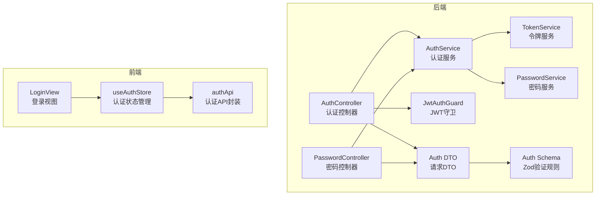
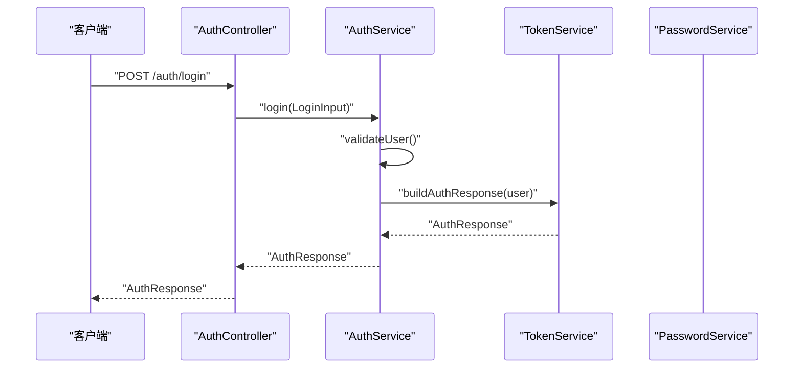
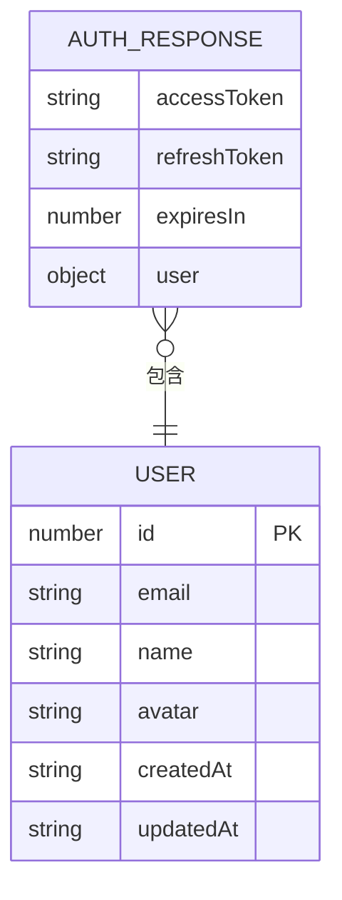
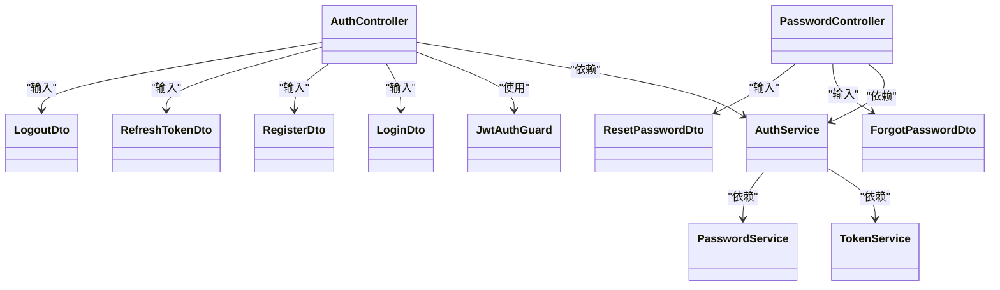

# 认证控制器

<cite>
**本文引用的文件**
- [apps/backend/src/auth/auth.controller.ts](file://apps/backend/src/auth/auth.controller.ts)
- [apps/backend/src/auth/password.controller.ts](file://apps/backend/src/auth/password.controller.ts)
- [apps/backend/src/auth/auth.dto.ts](file://apps/backend/src/auth/auth.dto.ts)
- [apps/backend/src/auth/auth.service.ts](file://apps/backend/src/auth/auth.service.ts)
- [apps/backend/src/auth/password.service.ts](file://apps/backend/src/auth/password.service.ts)
- [apps/backend/src/auth/token.service.ts](file://apps/backend/src/auth/token.service.ts)
- [apps/backend/src/auth/jwt-auth.guard.ts](file://apps/backend/src/auth/jwt-auth.guard.ts)
- [packages/shared/src/schemas/auth.schema.ts](file://packages/shared/src/schemas/auth.schema.ts)
- [apps/frontend/src/features/auth/api/index.ts](file://apps/frontend/src/features/auth/api/index.ts)
- [apps/frontend/src/features/auth/stores/auth.ts](file://apps/frontend/src/features/auth/stores/auth.ts)
- [apps/frontend/src/features/auth/views/LoginView.vue](file://apps/frontend/src/features/auth/views/LoginView.vue)
- [apps/backend/tests/e2e/auth.e2e.spec.ts](file://apps/backend/tests/e2e/auth.e2e.spec.ts)
- [apps/backend/tests/auth/auth.service.spec.ts](file://apps/backend/tests/auth/auth.service.spec.ts)
- [apps/backend/src/i18n/zh-CN/auth.ts](file://apps/backend/src/i18n/zh-CN/auth.ts)
- [apps/backend/src/i18n/en-US/auth.ts](file://apps/backend/src/i18n/en-US/auth.ts)
</cite>

## 目录
1. [简介](#简介)
2. [项目结构](#项目结构)
3. [核心组件](#核心组件)
4. [架构总览](#架构总览)
5. [详细组件分析](#详细组件分析)
6. [依赖关系分析](#依赖关系分析)
7. [性能考虑](#性能考虑)
8. [故障排查指南](#故障排查指南)
9. [结论](#结论)
10. [附录](#附录)

## 简介
本文件为认证控制器的完整API文档，覆盖登录、注册、刷新令牌、登出、找回密码与重置密码等接口。文档从接口定义、请求参数、响应格式、字段验证规则、业务流程、错误码说明到客户端集成示例与调试技巧进行全面阐述，并提供性能优化建议。

## 项目结构
后端采用NestJS模块化架构，认证相关代码集中在apps/backend/src/auth目录；前端认证逻辑位于apps/frontend/src/features/auth，前后端通过共享的Zod Schema进行数据契约约束。

图表来源
- [apps/backend/src/auth/auth.controller.ts:14-81](file://apps/backend/src/auth/auth.controller.ts#L14-L81)
- [apps/backend/src/auth/password.controller.ts:10-38](file://apps/backend/src/auth/password.controller.ts#L10-L38)
- [apps/backend/src/auth/auth.service.ts:12-126](file://apps/backend/src/auth/auth.service.ts#L12-L126)
- [apps/backend/src/auth/password.service.ts:9-99](file://apps/backend/src/auth/password.service.ts#L9-L99)
- [apps/backend/src/auth/token.service.ts:15-186](file://apps/backend/src/auth/token.service.ts#L15-L186)
- [apps/backend/src/auth/jwt-auth.guard.ts:8-9](file://apps/backend/src/auth/jwt-auth.guard.ts#L8-L9)
- [apps/backend/src/auth/auth.dto.ts:1-41](file://apps/backend/src/auth/auth.dto.ts#L1-L41)
- [packages/shared/src/schemas/auth.schema.ts:1-121](file://packages/shared/src/schemas/auth.schema.ts#L1-L121)
- [apps/frontend/src/features/auth/api/index.ts:7-78](file://apps/frontend/src/features/auth/api/index.ts#L7-L78)
- [apps/frontend/src/features/auth/stores/auth.ts:23-390](file://apps/frontend/src/features/auth/stores/auth.ts#L23-L390)
- [apps/frontend/src/features/auth/views/LoginView.vue:1-111](file://apps/frontend/src/features/auth/views/LoginView.vue#L1-L111)

章节来源
- [apps/backend/src/auth/auth.controller.ts:14-81](file://apps/backend/src/auth/auth.controller.ts#L14-L81)
- [apps/backend/src/auth/password.controller.ts:10-38](file://apps/backend/src/auth/password.controller.ts#L10-L38)
- [apps/backend/src/auth/auth.dto.ts:1-41](file://apps/backend/src/auth/auth.dto.ts#L1-L41)
- [packages/shared/src/schemas/auth.schema.ts:1-121](file://packages/shared/src/schemas/auth.schema.ts#L1-L121)
- [apps/frontend/src/features/auth/api/index.ts:7-78](file://apps/frontend/src/features/auth/api/index.ts#L7-L78)
- [apps/frontend/src/features/auth/stores/auth.ts:23-390](file://apps/frontend/src/features/auth/stores/auth.ts#L23-L390)
- [apps/frontend/src/features/auth/views/LoginView.vue:1-111](file://apps/frontend/src/features/auth/views/LoginView.vue#L1-L111)

## 核心组件
- 认证控制器：提供登录、注册、刷新令牌、获取当前用户、登出接口。
- 密码控制器：提供找回密码、重置密码接口。
- 认证服务：整合用户、令牌与密码服务，提供统一的业务流程。
- 令牌服务：负责JWT签发、校验、黑名单与会话失效标记。
- 密码服务：负责密码哈希、比较、重置令牌生成与邮件发送。
- DTO与Schema：前后端共享的Zod验证规则，保证输入输出一致性。
- 前端API与状态管理：封装HTTP请求、维护token与用户状态、处理刷新与登出。

章节来源
- [apps/backend/src/auth/auth.controller.ts:14-81](file://apps/backend/src/auth/auth.controller.ts#L14-L81)
- [apps/backend/src/auth/password.controller.ts:10-38](file://apps/backend/src/auth/password.controller.ts#L10-L38)
- [apps/backend/src/auth/auth.service.ts:12-126](file://apps/backend/src/auth/auth.service.ts#L12-L126)
- [apps/backend/src/auth/token.service.ts:15-186](file://apps/backend/src/auth/token.service.ts#L15-L186)
- [apps/backend/src/auth/password.service.ts:9-99](file://apps/backend/src/auth/password.service.ts#L9-L99)
- [apps/backend/src/auth/auth.dto.ts:1-41](file://apps/backend/src/auth/auth.dto.ts#L1-L41)
- [packages/shared/src/schemas/auth.schema.ts:1-121](file://packages/shared/src/schemas/auth.schema.ts#L1-L121)
- [apps/frontend/src/features/auth/api/index.ts:7-78](file://apps/frontend/src/features/auth/api/index.ts#L7-L78)
- [apps/frontend/src/features/auth/stores/auth.ts:23-390](file://apps/frontend/src/features/auth/stores/auth.ts#L23-L390)

## 架构总览
认证体系采用“控制器-服务-工具层”分层设计：
- 控制器负责HTTP路由、装饰器（鉴权、节流）与响应包装。
- 服务层编排业务：用户校验、令牌签发、密码处理。
- 工具层（令牌/密码服务）提供可复用能力：JWT签名/校验、Redis黑名单、会话失效标记、邮件发送等。

图表来源
- [apps/backend/src/auth/auth.controller.ts:22-27](file://apps/backend/src/auth/auth.controller.ts#L22-L27)
- [apps/backend/src/auth/auth.service.ts:41-49](file://apps/backend/src/auth/auth.service.ts#L41-L49)
- [apps/backend/src/auth/token.service.ts:175-185](file://apps/backend/src/auth/token.service.ts#L175-L185)

章节来源
- [apps/backend/src/auth/auth.controller.ts:14-81](file://apps/backend/src/auth/auth.controller.ts#L14-L81)
- [apps/backend/src/auth/auth.service.ts:12-126](file://apps/backend/src/auth/auth.service.ts#L12-L126)
- [apps/backend/src/auth/token.service.ts:15-186](file://apps/backend/src/auth/token.service.ts#L15-L186)

## 详细组件分析

### 登录接口
- HTTP方法与路径
  - 方法：POST
  - 路径：/auth/login
- 请求体参数
  - 字段：email、password
  - 类型：字符串
  - 验证规则：详见“字段验证与校验规则”
- 成功响应
  - 结构：包含accessToken、refreshToken、expiresIn、user
  - user字段：id、email、name、avatar、createdAt、updatedAt
- 异常与错误码
  - 401 未授权：凭据无效
- 客户端集成要点
  - 登录成功后应保存accessToken与refreshToken，并设置到后续请求的Authorization头
  - 建议同时持久化用户信息，便于UI展示

章节来源
- [apps/backend/src/auth/auth.controller.ts:22-27](file://apps/backend/src/auth/auth.controller.ts#L22-L27)
- [apps/backend/src/auth/auth.service.ts:41-49](file://apps/backend/src/auth/auth.service.ts#L41-L49)
- [packages/shared/src/schemas/auth.schema.ts:24-28](file://packages/shared/src/schemas/auth.schema.ts#L24-L28)
- [apps/backend/src/i18n/zh-CN/auth.ts:5-5](file://apps/backend/src/i18n/zh-CN/auth.ts#L5-L5)
- [apps/backend/src/i18n/en-US/auth.ts:5-5](file://apps/backend/src/i18n/en-US/auth.ts#L5-L5)

### 注册接口
- HTTP方法与路径
  - 方法：POST
  - 路径：/auth/register
- 请求体参数
  - 字段：email、name、password
  - 类型：字符串
  - 验证规则：详见“字段验证与校验规则”
- 成功响应
  - 结构：AuthResponse（同登录）
- 异常与错误码
  - 400/409：邮箱已存在（由后端业务抛出）
- 客户端集成要点
  - 注册成功后立即进入登录态，保存token并跳转首页

章节来源
- [apps/backend/src/auth/auth.controller.ts:33-38](file://apps/backend/src/auth/auth.controller.ts#L33-L38)
- [apps/backend/src/auth/auth.service.ts:51-54](file://apps/backend/src/auth/auth.service.ts#L51-L54)
- [packages/shared/src/schemas/auth.schema.ts:33-41](file://packages/shared/src/schemas/auth.schema.ts#L33-L41)
- [apps/backend/src/i18n/zh-CN/auth.ts:7-7](file://apps/backend/src/i18n/zh-CN/auth.ts#L7-L7)
- [apps/backend/src/i18n/en-US/auth.ts:7-7](file://apps/backend/src/i18n/en-US/auth.ts#L7-L7)

### 刷新访问令牌接口
- HTTP方法与路径
  - 方法：POST
  - 路径：/auth/refresh
- 请求体参数
  - 字段：refreshToken
  - 类型：字符串
  - 验证规则：必填且非空
- 成功响应
  - 结构：AuthResponse
- 业务逻辑
  - 校验refreshToken是否在黑名单
  - 校验token类型必须为refresh
  - 校验用户会话是否被标记失效（基于Redis的失效时间戳）
  - 若有效则签发新的accessToken与refreshToken
- 异常与错误码
  - 401：无效刷新令牌、令牌过期、会话失效、用户不存在
- 客户端集成要点
  - 在accessToken即将过期前主动刷新，避免请求失败
  - 刷新失败时按指数退避策略重试

章节来源
- [apps/backend/src/auth/auth.controller.ts:43-48](file://apps/backend/src/auth/auth.controller.ts#L43-L48)
- [apps/backend/src/auth/auth.service.ts:59-93](file://apps/backend/src/auth/auth.service.ts#L59-L93)
- [apps/backend/src/auth/token.service.ts:103-125](file://apps/backend/src/auth/token.service.ts#L103-L125)
- [apps/backend/src/auth/token.service.ts:166-170](file://apps/backend/src/auth/token.service.ts#L166-L170)
- [apps/backend/src/i18n/zh-CN/auth.ts:6-6](file://apps/backend/src/i18n/zh-CN/auth.ts#L6-L6)
- [apps/backend/src/i18n/en-US/auth.ts:6-6](file://apps/backend/src/i18n/en-US/auth.ts#L6-L6)

### 获取当前用户接口
- HTTP方法与路径
  - 方法：GET
  - 路径：/auth/me
- 鉴权要求
  - 需携带有效的Bearer accessToken
- 成功响应
  - 结构：User对象
- 异常与错误码
  - 401：未授权或token无效
- 客户端集成要点
  - 首次进入应用或刷新页面时调用，用于恢复登录态

章节来源
- [apps/backend/src/auth/auth.controller.ts:53-60](file://apps/backend/src/auth/auth.controller.ts#L53-L60)
- [apps/backend/src/auth/jwt-auth.guard.ts:8-9](file://apps/backend/src/auth/jwt-auth.guard.ts#L8-L9)
- [apps/backend/src/auth/token.service.ts:115-125](file://apps/backend/src/auth/token.service.ts#L115-L125)
- [apps/backend/src/i18n/zh-CN/auth.ts:9-9](file://apps/backend/src/i18n/zh-CN/auth.ts#L9-L9)
- [apps/backend/src/i18n/en-US/auth.ts:9-9](file://apps/backend/src/i18n/en-US/auth.ts#L9-L9)

### 登出接口
- HTTP方法与路径
  - 方法：POST
  - 路径：/auth/logout
- 请求体参数
  - 字段：refreshToken
  - 类型：字符串
  - 验证规则：必填且非空
- 成功响应
  - 结构：{ message: string }
- 业务逻辑
  - 将refreshToken加入黑名单
  - 清除客户端Cookie中的accessToken与refreshToken
  - 返回登出成功消息
- 异常与错误码
  - 401：未授权（通常发生在token无效时）
- 客户端集成要点
  - 登出时先清本地状态，再异步调用后端登出，忽略后端失败（可能因token已过期）

章节来源
- [apps/backend/src/auth/auth.controller.ts:65-80](file://apps/backend/src/auth/auth.controller.ts#L65-L80)
- [apps/backend/src/auth/auth.service.ts:95-101](file://apps/backend/src/auth/auth.service.ts#L95-L101)
- [apps/backend/src/auth/token.service.ts:130-149](file://apps/backend/src/auth/token.service.ts#L130-L149)
- [apps/frontend/src/features/auth/stores/auth.ts:324-351](file://apps/frontend/src/features/auth/stores/auth.ts#L324-L351)

### 密码控制器接口
- 请求密码重置
  - 方法：POST /auth/forgot-password
  - 参数：email
  - 行为：若邮箱存在，生成带有效期的重置令牌并发送邮件
  - 响应：{ message: string }
- 重置密码
  - 方法：POST /auth/reset-password
  - 参数：token、password
  - 行为：校验token有效性与时效，更新密码并使该用户所有会话失效
  - 响应：{ message: string }

章节来源
- [apps/backend/src/auth/password.controller.ts:19-37](file://apps/backend/src/auth/password.controller.ts#L19-L37)
- [apps/backend/src/auth/password.service.ts:39-61](file://apps/backend/src/auth/password.service.ts#L39-L61)
- [apps/backend/src/auth/password.service.ts:66-89](file://apps/backend/src/auth/password.service.ts#L66-L89)
- [apps/backend/src/i18n/zh-CN/auth.ts:13-13](file://apps/backend/src/i18n/zh-CN/auth.ts#L13-L13)
- [apps/backend/src/i18n/en-US/auth.ts:13-13](file://apps/backend/src/i18n/en-US/auth.ts#L13-L13)

### 字段验证与校验规则
- 邮箱验证
  - 必填、合法邮箱格式、小写、去空白
- 密码验证
  - 必填、长度6~100字符
- 注册额外字段
  - name：必填、长度2~50字符、去空白
- 刷新/登出/重置密码
  - refreshToken/token：必填且非空
- 用户信息
  - id、email、name、avatar、createdAt、updatedAt

章节来源
- [packages/shared/src/schemas/auth.schema.ts:7-21](file://packages/shared/src/schemas/auth.schema.ts#L7-L21)
- [packages/shared/src/schemas/auth.schema.ts:24-41](file://packages/shared/src/schemas/auth.schema.ts#L24-L41)
- [packages/shared/src/schemas/auth.schema.ts:59-77](file://packages/shared/src/schemas/auth.schema.ts#L59-L77)
- [packages/shared/src/schemas/auth.schema.ts:82-95](file://packages/shared/src/schemas/auth.schema.ts#L82-L95)
- [packages/shared/src/schemas/auth.schema.ts:100-110](file://packages/shared/src/schemas/auth.schema.ts#L100-L110)

### 数据模型与响应结构

图表来源
- [packages/shared/src/schemas/auth.schema.ts:59-77](file://packages/shared/src/schemas/auth.schema.ts#L59-L77)

章节来源
- [packages/shared/src/schemas/auth.schema.ts:59-77](file://packages/shared/src/schemas/auth.schema.ts#L59-L77)

## 依赖关系分析
- 控制器依赖服务：AuthController与PasswordController均依赖AuthService。
- 服务依赖工具：AuthService依赖TokenService与PasswordService；PasswordService依赖UsersService、ConfigService、MailService与TokenService。
- DTO与Schema：Auth DTO通过createZodDto包装共享Schema，确保前后端一致的验证规则。
- 前端依赖：前端通过authApi封装HTTP请求，useAuthStore管理状态与刷新逻辑。

图表来源
- [apps/backend/src/auth/auth.controller.ts:14-81](file://apps/backend/src/auth/auth.controller.ts#L14-L81)
- [apps/backend/src/auth/password.controller.ts:10-38](file://apps/backend/src/auth/password.controller.ts#L10-L38)
- [apps/backend/src/auth/auth.service.ts:12-21](file://apps/backend/src/auth/auth.service.ts#L12-L21)
- [apps/backend/src/auth/token.service.ts:15-45](file://apps/backend/src/auth/token.service.ts#L15-L45)
- [apps/backend/src/auth/password.service.ts:9-20](file://apps/backend/src/auth/password.service.ts#L9-L20)
- [apps/backend/src/auth/jwt-auth.guard.ts:8-9](file://apps/backend/src/auth/jwt-auth.guard.ts#L8-L9)
- [apps/backend/src/auth/auth.dto.ts:1-41](file://apps/backend/src/auth/auth.dto.ts#L1-L41)

章节来源
- [apps/backend/src/auth/auth.controller.ts:14-81](file://apps/backend/src/auth/auth.controller.ts#L14-L81)
- [apps/backend/src/auth/password.controller.ts:10-38](file://apps/backend/src/auth/password.controller.ts#L10-L38)
- [apps/backend/src/auth/auth.service.ts:12-21](file://apps/backend/src/auth/auth.service.ts#L12-L21)
- [apps/backend/src/auth/token.service.ts:15-45](file://apps/backend/src/auth/token.service.ts#L15-L45)
- [apps/backend/src/auth/password.service.ts:9-20](file://apps/backend/src/auth/password.service.ts#L9-L20)
- [apps/backend/src/auth/auth.dto.ts:1-41](file://apps/backend/src/auth/auth.dto.ts#L1-L41)

## 性能考虑
- 令牌过期时间
  - accessToken默认短期（如900秒），refreshToken默认长期（如604800秒），减少频繁刷新成本。
- 会话失效
  - 通过Redis记录用户会话失效时间戳，刷新时快速判断，避免无效计算。
- 黑名单缓存
  - 将黑名单写入Redis并设置剩余TTL，降低重复校验开销。
- 速率限制
  - 登录/注册/找回密码等接口设置节流，防止暴力破解与滥用。
- 前端刷新策略
  - 在accessToken过期前主动刷新，减少请求失败与重试次数。

章节来源
- [apps/backend/src/auth/token.service.ts:41-44](file://apps/backend/src/auth/token.service.ts#L41-L44)
- [apps/backend/src/auth/token.service.ts:47-76](file://apps/backend/src/auth/token.service.ts#L47-L76)
- [apps/backend/src/auth/token.service.ts:130-149](file://apps/backend/src/auth/token.service.ts#L130-L149)
- [apps/backend/src/auth/auth.controller.ts:22-38](file://apps/backend/src/auth/auth.controller.ts#L22-L38)

## 故障排查指南
- 常见错误码与含义
  - 400/409：邮箱已存在、输入不合法
  - 401：凭据无效、令牌无效或已过期、刷新令牌无效、用户不存在
  - 5xx：服务器内部错误
- 定位步骤
  - 检查请求头Authorization是否正确携带Bearer token
  - 确认refreshToken未被加入黑名单且未过期
  - 核对用户会话是否被标记失效（Redis中存在对应key且iat早于失效时间）
  - 查看国际化文案映射，确认错误消息语言环境
- 单元与端到端测试参考
  - E2E测试覆盖注册、登录、刷新、登出与黑名单场景
  - 服务层单元测试覆盖登录校验、刷新令牌与登出流程

章节来源
- [apps/backend/src/i18n/zh-CN/auth.ts:3-14](file://apps/backend/src/i18n/zh-CN/auth.ts#L3-L14)
- [apps/backend/src/i18n/en-US/auth.ts:3-14](file://apps/backend/src/i18n/en-US/auth.ts#L3-L14)
- [apps/backend/tests/e2e/auth.e2e.spec.ts:64-153](file://apps/backend/tests/e2e/auth.e2e.spec.ts#L64-L153)
- [apps/backend/tests/auth/auth.service.spec.ts:34-176](file://apps/backend/tests/auth/auth.service.spec.ts#L34-L176)

## 结论
本认证体系通过清晰的分层设计与严格的输入校验，提供了安全、可扩展的登录与会话管理能力。配合前端的状态管理与自动刷新机制，能够为用户提供流畅的认证体验。建议在生产环境中完善监控与告警，持续优化令牌生命周期与会话失效策略。

## 附录

### 接口一览与参数规范
- 登录
  - 方法：POST /auth/login
  - 请求体：email、password
  - 响应：AuthResponse
- 注册
  - 方法：POST /auth/register
  - 请求体：email、name、password
  - 响应：AuthResponse
- 刷新令牌
  - 方法：POST /auth/refresh
  - 请求体：refreshToken
  - 响应：AuthResponse
- 获取当前用户
  - 方法：GET /auth/me
  - 请求头：Authorization: Bearer <accessToken>
  - 响应：User
- 登出
  - 方法：POST /auth/logout
  - 请求体：refreshToken
  - 响应：{ message: string }
- 密码重置
  - 请求密码重置：POST /auth/forgot-password
    - 请求体：email
    - 响应：{ message: string }
  - 重置密码：POST /auth/reset-password
    - 请求体：token、password
    - 响应：{ message: string }

章节来源
- [apps/backend/src/auth/auth.controller.ts:22-80](file://apps/backend/src/auth/auth.controller.ts#L22-L80)
- [apps/backend/src/auth/password.controller.ts:19-37](file://apps/backend/src/auth/password.controller.ts#L19-L37)
- [apps/backend/src/auth/auth.dto.ts:15-40](file://apps/backend/src/auth/auth.dto.ts#L15-L40)
- [packages/shared/src/schemas/auth.schema.ts:24-110](file://packages/shared/src/schemas/auth.schema.ts#L24-L110)

### 客户端集成示例（前端）
- 登录流程
  - 触发登录视图，收集email与password
  - 调用authApi.login，接收AuthResponse
  - 保存accessToken与refreshToken，设置到全局HTTP拦截器
  - 持久化用户信息，跳转首页
- 刷新流程
  - 在accessToken过期前调用authApi.refreshToken
  - 成功后更新token并持久化
- 登出流程
  - 清空本地状态与持久化数据
  - 可选：调用authApi.logout（忽略后端失败）
  - 清理远程数据并回退到本地视图

章节来源
- [apps/frontend/src/features/auth/views/LoginView.vue:30-37](file://apps/frontend/src/features/auth/views/LoginView.vue#L30-L37)
- [apps/frontend/src/features/auth/api/index.ts:19-77](file://apps/frontend/src/features/auth/api/index.ts#L19-L77)
- [apps/frontend/src/features/auth/stores/auth.ts:148-212](file://apps/frontend/src/features/auth/stores/auth.ts#L148-L212)
- [apps/frontend/src/features/auth/stores/auth.ts:275-320](file://apps/frontend/src/features/auth/stores/auth.ts#L275-L320)
- [apps/frontend/src/features/auth/stores/auth.ts:324-351](file://apps/frontend/src/features/auth/stores/auth.ts#L324-L351)

### 请求与响应示例（示意）
- 登录请求
  - POST /auth/login
  - 请求体：{ "email": "...", "password": "..." }
  - 成功响应：{ "accessToken": "...", "refreshToken": "...", "expiresIn": 900, "user": { "id": 1, "email": "...", "name": "...", "avatar": null, "createdAt": "...", "updatedAt": "..." } }
- 登录失败
  - POST /auth/login
  - 响应：{ "success": false, "statusCode": 401, "message": "auth.INVALID_CREDENTIALS" }
- 注册成功
  - POST /auth/register
  - 响应：AuthResponse
- 刷新成功
  - POST /auth/refresh
  - 响应：AuthResponse
- 登出成功
  - POST /auth/logout
  - 响应：{ "message": "登出成功" }

章节来源
- [apps/backend/tests/e2e/auth.e2e.spec.ts:64-153](file://apps/backend/tests/e2e/auth.e2e.spec.ts#L64-L153)
- [apps/backend/src/i18n/zh-CN/auth.ts:5-13](file://apps/backend/src/i18n/zh-CN/auth.ts#L5-L13)

### 调试技巧
- 后端
  - 使用Swagger查看接口文档与示例
  - 开启日志，关注令牌签发、校验与黑名单写入
  - 使用E2E测试验证端到端流程
- 前端
  - 在浏览器控制台监听自定义事件“auth:telemetry”，观察刷新与获取用户失败事件
  - 检查localStorage中的auth持久化数据
  - 使用网络面板观察Authorization头与Cookie变化

章节来源
- [apps/frontend/src/features/auth/stores/auth.ts:103-110](file://apps/frontend/src/features/auth/stores/auth.ts#L103-L110)
- [apps/frontend/src/features/auth/stores/auth.ts:112-143](file://apps/frontend/src/features/auth/stores/auth.ts#L112-L143)
- [apps/backend/tests/e2e/auth.e2e.spec.ts:11-28](file://apps/backend/tests/e2e/auth.e2e.spec.ts#L11-L28)