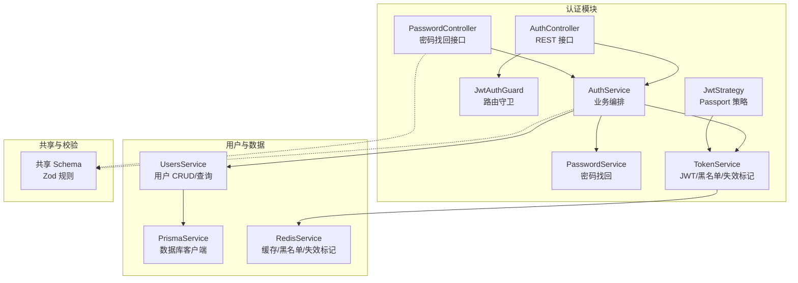
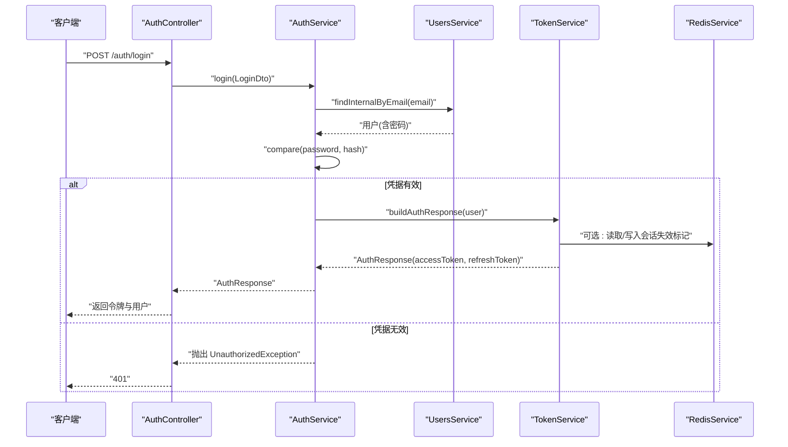
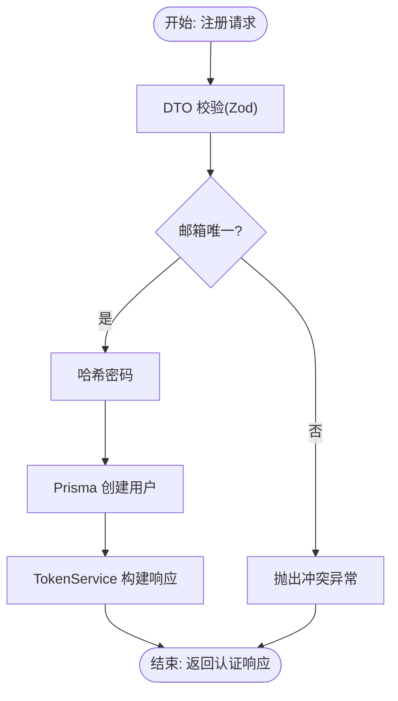
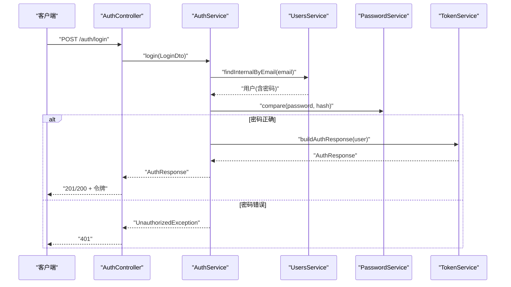
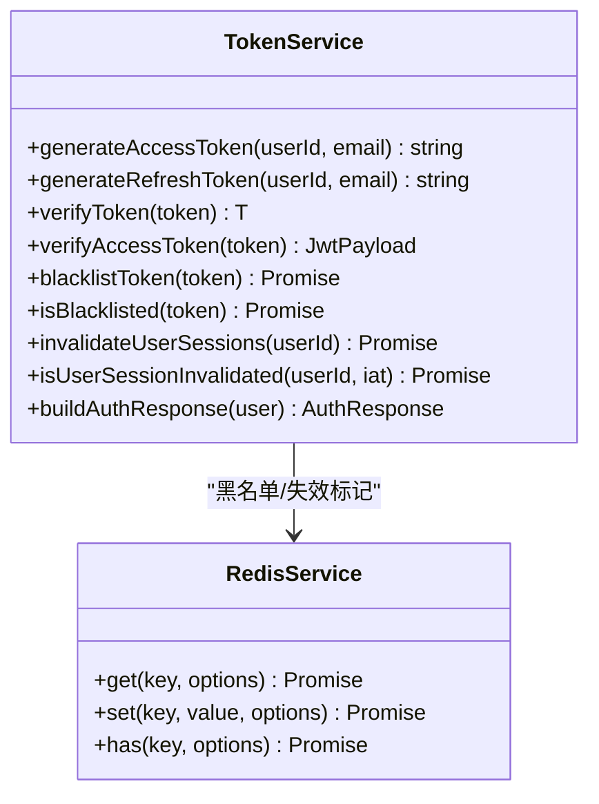
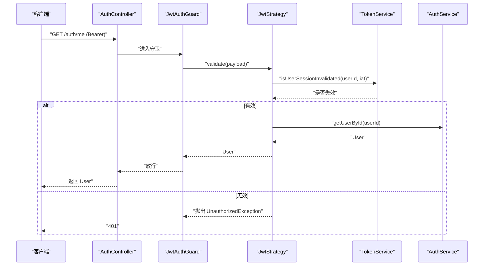
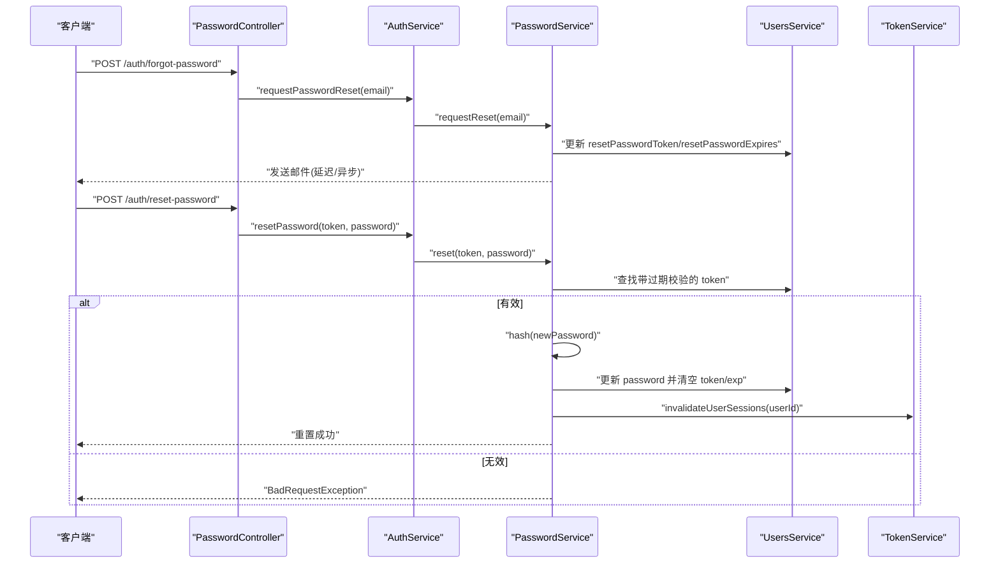
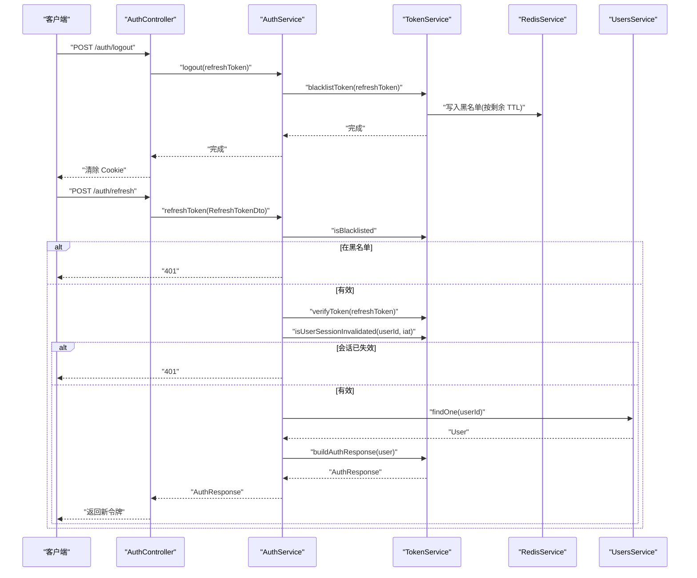
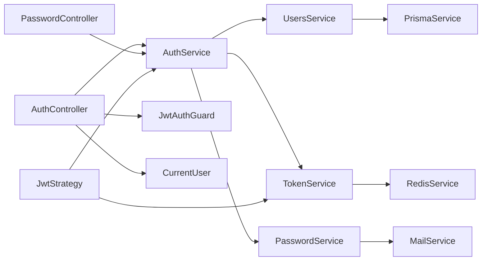

# 认证服务

<cite>
**本文引用的文件**
- [apps/backend/src/auth/auth.service.ts](file://apps/backend/src/auth/auth.service.ts)
- [apps/backend/src/auth/auth.controller.ts](file://apps/backend/src/auth/auth.controller.ts)
- [apps/backend/src/auth/auth.dto.ts](file://apps/backend/src/auth/auth.dto.ts)
- [apps/backend/src/auth/auth.module.ts](file://apps/backend/src/auth/auth.module.ts)
- [apps/backend/src/auth/jwt-auth.guard.ts](file://apps/backend/src/auth/jwt-auth.guard.ts)
- [apps/backend/src/auth/jwt.strategy.ts](file://apps/backend/src/auth/jwt.strategy.ts)
- [apps/backend/src/auth/token.service.ts](file://apps/backend/src/auth/token.service.ts)
- [apps/backend/src/auth/password.service.ts](file://apps/backend/src/auth/password.service.ts)
- [apps/backend/src/auth/password.controller.ts](file://apps/backend/src/auth/password.controller.ts)
- [apps/backend/src/auth/current-user.decorator.ts](file://apps/backend/src/auth/current-user.decorator.ts)
- [packages/shared/src/schemas/auth.schema.ts](file://packages/shared/src/schemas/auth.schema.ts)
- [apps/backend/src/users/users.service.ts](file://apps/backend/src/users/users.service.ts)
- [apps/backend/src/redis/redis.service.ts](file://apps/backend/src/redis/redis.service.ts)
- [apps/backend/src/prisma/prisma.service.ts](file://apps/backend/src/prisma/prisma.service.ts)
- [apps/backend/tests/auth/auth.service.spec.ts](file://apps/backend/tests/auth/auth.service.spec.ts)
</cite>

## 目录
1. [简介](#简介)
2. [项目结构](#项目结构)
3. [核心组件](#核心组件)
4. [架构总览](#架构总览)
5. [详细组件分析](#详细组件分析)
6. [依赖关系分析](#依赖关系分析)
7. [性能考量](#性能考量)
8. [故障排查指南](#故障排查指南)
9. [结论](#结论)
10. [附录](#附录)

## 简介
本文件面向认证服务层，系统性阐述用户身份验证的核心逻辑、数据库查询优化、用户状态检查、注册与登录流程、凭据验证与会话建立、用户信息获取与权限校验、异常处理策略、事务与一致性保障、设计模式与依赖注入实践，以及单元测试编写指南。内容以代码为依据，辅以图示帮助理解。

## 项目结构
认证相关代码集中在后端应用的 auth 目录，并通过共享包中的 Zod Schema 定义输入校验规则；用户数据访问由 users.service 聚合 Prisma；令牌签发与校验由 token.service 与 JwtStrategy 协作完成；Redis 用于黑名单与会话失效标记等缓存场景。

图表来源
- [apps/backend/src/auth/auth.controller.ts:1-82](file://apps/backend/src/auth/auth.controller.ts#L1-L82)
- [apps/backend/src/auth/auth.service.ts:1-127](file://apps/backend/src/auth/auth.service.ts#L1-L127)
- [apps/backend/src/auth/password.controller.ts:1-39](file://apps/backend/src/auth/password.controller.ts#L1-L39)
- [apps/backend/src/auth/password.service.ts:1-100](file://apps/backend/src/auth/password.service.ts#L1-L100)
- [apps/backend/src/auth/token.service.ts:1-187](file://apps/backend/src/auth/token.service.ts#L1-L187)
- [apps/backend/src/auth/jwt-auth.guard.ts:1-10](file://apps/backend/src/auth/jwt-auth.guard.ts#L1-L10)
- [apps/backend/src/auth/jwt.strategy.ts:1-68](file://apps/backend/src/auth/jwt.strategy.ts#L1-L68)
- [apps/backend/src/users/users.service.ts:1-110](file://apps/backend/src/users/users.service.ts#L1-L110)
- [apps/backend/src/redis/redis.service.ts:1-233](file://apps/backend/src/redis/redis.service.ts#L1-L233)
- [apps/backend/src/prisma/prisma.service.ts:1-34](file://apps/backend/src/prisma/prisma.service.ts#L1-L34)
- [packages/shared/src/schemas/auth.schema.ts:1-121](file://packages/shared/src/schemas/auth.schema.ts#L1-L121)

章节来源
- [apps/backend/src/auth/auth.module.ts:1-41](file://apps/backend/src/auth/auth.module.ts#L1-L41)
- [apps/backend/src/auth/auth.controller.ts:1-82](file://apps/backend/src/auth/auth.controller.ts#L1-L82)
- [apps/backend/src/auth/auth.service.ts:1-127](file://apps/backend/src/auth/auth.service.ts#L1-L127)
- [apps/backend/src/auth/password.controller.ts:1-39](file://apps/backend/src/auth/password.controller.ts#L1-L39)
- [apps/backend/src/auth/password.service.ts:1-100](file://apps/backend/src/auth/password.service.ts#L1-L100)
- [apps/backend/src/auth/token.service.ts:1-187](file://apps/backend/src/auth/token.service.ts#L1-L187)
- [apps/backend/src/auth/jwt-auth.guard.ts:1-10](file://apps/backend/src/auth/jwt-auth.guard.ts#L1-L10)
- [apps/backend/src/auth/jwt.strategy.ts:1-68](file://apps/backend/src/auth/jwt.strategy.ts#L1-L68)
- [apps/backend/src/users/users.service.ts:1-110](file://apps/backend/src/users/users.service.ts#L1-L110)
- [apps/backend/src/redis/redis.service.ts:1-233](file://apps/backend/src/redis/redis.service.ts#L1-L233)
- [apps/backend/src/prisma/prisma.service.ts:1-34](file://apps/backend/src/prisma/prisma.service.ts#L1-L34)
- [packages/shared/src/schemas/auth.schema.ts:1-121](file://packages/shared/src/schemas/auth.schema.ts#L1-L121)

## 核心组件
- AuthService：认证门面，聚合 UsersService、TokenService、PasswordService，提供登录、注册、刷新、登出、密码找回等统一入口。
- TokenService：负责访问令牌与刷新令牌的签发、校验、黑名单、用户会话失效标记。
- PasswordService：密码哈希与比较、重置令牌生成与校验、邮件发送、重置后使旧会话失效。
- JwtStrategy/JwtAuthGuard：Passport 策略与守卫，校验访问令牌有效性、用户存在性与会话失效状态。
- UsersService：用户数据访问，含内部查询（含密码）与对外格式化输出。
- RedisService：统一缓存接口，支撑黑名单与会话失效标记。
- AuthController/PasswordController：REST 控制器，暴露登录、注册、刷新、登出、密码找回等接口。
- Auth DTO 与共享 Schema：基于 Zod 的输入校验与 Swagger 文档生成。

章节来源
- [apps/backend/src/auth/auth.service.ts:1-127](file://apps/backend/src/auth/auth.service.ts#L1-L127)
- [apps/backend/src/auth/token.service.ts:1-187](file://apps/backend/src/auth/token.service.ts#L1-L187)
- [apps/backend/src/auth/password.service.ts:1-100](file://apps/backend/src/auth/password.service.ts#L1-L100)
- [apps/backend/src/auth/jwt.strategy.ts:1-68](file://apps/backend/src/auth/jwt.strategy.ts#L1-L68)
- [apps/backend/src/auth/jwt-auth.guard.ts:1-10](file://apps/backend/src/auth/jwt-auth.guard.ts#L1-L10)
- [apps/backend/src/users/users.service.ts:1-110](file://apps/backend/src/users/users.service.ts#L1-L110)
- [apps/backend/src/redis/redis.service.ts:1-233](file://apps/backend/src/redis/redis.service.ts#L1-L233)
- [apps/backend/src/auth/auth.controller.ts:1-82](file://apps/backend/src/auth/auth.controller.ts#L1-L82)
- [apps/backend/src/auth/password.controller.ts:1-39](file://apps/backend/src/auth/password.controller.ts#L1-L39)
- [apps/backend/src/auth/auth.dto.ts:1-41](file://apps/backend/src/auth/auth.dto.ts#L1-L41)
- [packages/shared/src/schemas/auth.schema.ts:1-121](file://packages/shared/src/schemas/auth.schema.ts#L1-L121)

## 架构总览
认证采用“控制器-服务-策略-数据”的分层架构，结合 JWT 与 Redis 实现安全、可扩展的会话管理。

图表来源
- [apps/backend/src/auth/auth.controller.ts:19-27](file://apps/backend/src/auth/auth.controller.ts#L19-L27)
- [apps/backend/src/auth/auth.service.ts:41-49](file://apps/backend/src/auth/auth.service.ts#L41-L49)
- [apps/backend/src/users/users.service.ts:55-57](file://apps/backend/src/users/users.service.ts#L55-L57)
- [apps/backend/src/auth/token.service.ts:175-185](file://apps/backend/src/auth/token.service.ts#L175-L185)
- [apps/backend/src/redis/redis.service.ts:76-108](file://apps/backend/src/redis/redis.service.ts#L76-L108)

## 详细组件分析

### 1) 用户注册流程与数据验证
- 输入校验：LoginDto/RegisterDto/RefreshTokenDto/LogoutDto 基于共享 Zod Schema，自动生成 Swagger 文档。
- 业务流程：
  - UsersService.create 校验邮箱唯一性，对明文密码进行哈希后入库。
  - AuthService.register 调用 UsersService.create 后，委托 TokenService 生成完整认证响应。
- 数据库优化要点：
  - 使用 Prisma 的 findUnique 对 email 建唯一索引，避免并发重复注册。
  - 返回前通过 formatUser 输出，隐藏敏感字段。
- 异常处理：
  - 已存在邮箱抛出冲突异常，便于前端提示。

图表来源
- [apps/backend/src/auth/auth.service.ts:51-54](file://apps/backend/src/auth/auth.service.ts#L51-L54)
- [apps/backend/src/users/users.service.ts:88-108](file://apps/backend/src/users/users.service.ts#L88-L108)
- [apps/backend/src/auth/token.service.ts:175-185](file://apps/backend/src/auth/token.service.ts#L175-L185)
- [apps/backend/src/auth/auth.dto.ts:15-20](file://apps/backend/src/auth/auth.dto.ts#L15-L20)
- [packages/shared/src/schemas/auth.schema.ts:33-41](file://packages/shared/src/schemas/auth.schema.ts#L33-L41)

章节来源
- [apps/backend/src/auth/auth.service.ts:51-54](file://apps/backend/src/auth/auth.service.ts#L51-L54)
- [apps/backend/src/users/users.service.ts:88-108](file://apps/backend/src/users/users.service.ts#L88-L108)
- [apps/backend/src/auth/auth.dto.ts:15-20](file://apps/backend/src/auth/auth.dto.ts#L15-L20)
- [packages/shared/src/schemas/auth.schema.ts:33-41](file://packages/shared/src/schemas/auth.schema.ts#L33-L41)

### 2) 登录流程与凭据验证
- 流程：
  - AuthController.login 接收 LoginDto，调用 AuthService.login。
  - AuthService.validateUser 先按邮箱查询用户（内部查询含密码），再比对密码。
  - 成功后由 TokenService 生成访问令牌与刷新令牌，并封装用户信息返回。
- 安全要点：
  - 仅在登录阶段进行密码比对，其余场景不暴露密码。
  - 访问令牌过期时间短，刷新令牌过期时间长。
- 异常处理：
  - 无效凭据抛出未授权异常，避免泄露具体原因。

图表来源
- [apps/backend/src/auth/auth.controller.ts:22-27](file://apps/backend/src/auth/auth.controller.ts#L22-L27)
- [apps/backend/src/auth/auth.service.ts:41-49](file://apps/backend/src/auth/auth.service.ts#L41-L49)
- [apps/backend/src/auth/auth.service.ts:26-39](file://apps/backend/src/auth/auth.service.ts#L26-L39)
- [apps/backend/src/users/users.service.ts:55-57](file://apps/backend/src/users/users.service.ts#L55-L57)
- [apps/backend/src/auth/token.service.ts:175-185](file://apps/backend/src/auth/token.service.ts#L175-L185)

章节来源
- [apps/backend/src/auth/auth.controller.ts:22-27](file://apps/backend/src/auth/auth.controller.ts#L22-L27)
- [apps/backend/src/auth/auth.service.ts:26-49](file://apps/backend/src/auth/auth.service.ts#L26-L49)
- [apps/backend/src/auth/token.service.ts:175-185](file://apps/backend/src/auth/token.service.ts#L175-L185)

### 3) 会话建立与令牌管理
- 令牌类型：
  - 访问令牌：短期、type=access，用于日常受保护资源访问。
  - 刷新令牌：长期、type=refresh，用于换取新的访问令牌。
- 令牌签发与校验：
  - TokenService 统一使用 NestJS JwtService 签发，区分访问与刷新密钥。
  - JwtStrategy 在受保护路由中校验访问令牌有效性、用户存在性与会话失效标记。
- 黑名单与失效：
  - 登出时将刷新令牌加入 Redis 黑名单，按剩余有效期 TTL 存储。
  - 刷新令牌校验时先检查黑名单，再验证 payload 类型与用户会话失效标记。
- 会话失效：
  - 通过 Redis 写入“失效时间戳”实现全局会话失效，刷新与访问令牌均会检测。

图表来源
- [apps/backend/src/auth/token.service.ts:1-187](file://apps/backend/src/auth/token.service.ts#L1-L187)
- [apps/backend/src/redis/redis.service.ts:1-233](file://apps/backend/src/redis/redis.service.ts#L1-L233)

章节来源
- [apps/backend/src/auth/token.service.ts:78-185](file://apps/backend/src/auth/token.service.ts#L78-L185)
- [apps/backend/src/auth/jwt.strategy.ts:41-66](file://apps/backend/src/auth/jwt.strategy.ts#L41-L66)
- [apps/backend/src/redis/redis.service.ts:76-108](file://apps/backend/src/redis/redis.service.ts#L76-L108)

### 4) 用户信息获取与权限检查
- 当前用户获取：
  - JwtAuthGuard 使用 Passport jwt 策略，JwtStrategy.validate 校验访问令牌并检查会话是否失效，最终返回用户对象。
  - AuthController.getMe 使用 JwtAuthGuard 保护，CurrentUser 装饰器从请求中提取当前用户。
- 权限与角色：
  - 当前代码未定义角色/权限模型，建议在用户实体扩展 roles 字段并在 Guard 中扩展校验逻辑。

图表来源
- [apps/backend/src/auth/auth.controller.ts:53-60](file://apps/backend/src/auth/auth.controller.ts#L53-L60)
- [apps/backend/src/auth/jwt-auth.guard.ts:1-10](file://apps/backend/src/auth/jwt-auth.guard.ts#L1-L10)
- [apps/backend/src/auth/jwt.strategy.ts:41-66](file://apps/backend/src/auth/jwt.strategy.ts#L41-L66)
- [apps/backend/src/auth/current-user.decorator.ts:8-18](file://apps/backend/src/auth/current-user.decorator.ts#L8-L18)
- [apps/backend/src/auth/auth.service.ts:119-125](file://apps/backend/src/auth/auth.service.ts#L119-L125)

章节来源
- [apps/backend/src/auth/jwt-auth.guard.ts:1-10](file://apps/backend/src/auth/jwt-auth.guard.ts#L1-L10)
- [apps/backend/src/auth/jwt.strategy.ts:41-66](file://apps/backend/src/auth/jwt.strategy.ts#L41-L66)
- [apps/backend/src/auth/current-user.decorator.ts:8-18](file://apps/backend/src/auth/current-user.decorator.ts#L8-L18)
- [apps/backend/src/auth/auth.controller.ts:53-60](file://apps/backend/src/auth/auth.controller.ts#L53-L60)
- [apps/backend/src/auth/auth.service.ts:119-125](file://apps/backend/src/auth/auth.service.ts#L119-L125)

### 5) 密码重置机制
- 请求重置：
  - PasswordController.forgotPassword -> AuthService.requestPasswordReset -> PasswordService.requestReset。
  - PasswordService 生成随机 token 并做 SHA-256 哈希存储，设置过期时间，向用户邮箱发送重置链接。
- 重置密码：
  - PasswordController.resetPassword -> AuthService.resetPassword -> PasswordService.reset。
  - 校验哈希后的 token 与过期时间，通过后对新密码哈希并更新，同时调用 TokenService.invalidateUserSessions 使旧会话失效。

图表来源
- [apps/backend/src/auth/password.controller.ts:19-37](file://apps/backend/src/auth/password.controller.ts#L19-L37)
- [apps/backend/src/auth/auth.service.ts:106-112](file://apps/backend/src/auth/auth.service.ts#L106-L112)
- [apps/backend/src/auth/password.service.ts:39-89](file://apps/backend/src/auth/password.service.ts#L39-L89)
- [apps/backend/src/auth/token.service.ts:47-53](file://apps/backend/src/auth/token.service.ts#L47-L53)

章节来源
- [apps/backend/src/auth/password.controller.ts:19-37](file://apps/backend/src/auth/password.controller.ts#L19-L37)
- [apps/backend/src/auth/auth.service.ts:106-112](file://apps/backend/src/auth/auth.service.ts#L106-L112)
- [apps/backend/src/auth/password.service.ts:39-89](file://apps/backend/src/auth/password.service.ts#L39-L89)
- [apps/backend/src/auth/token.service.ts:47-53](file://apps/backend/src/auth/token.service.ts#L47-L53)

### 6) 登出与刷新流程
- 登出：
  - AuthController.logout -> AuthService.logout -> TokenService.blacklistToken(refreshToken)，并清理 Cookie。
- 刷新：
  - AuthService.refreshToken -> TokenService.isBlacklisted -> verifyToken -> isUserSessionInvalidated -> UsersService.findOne -> TokenService.buildAuthResponse。

图表来源
- [apps/backend/src/auth/auth.controller.ts:65-80](file://apps/backend/src/auth/auth.controller.ts#L65-L80)
- [apps/backend/src/auth/auth.service.ts:95-101](file://apps/backend/src/auth/auth.service.ts#L95-L101)
- [apps/backend/src/auth/auth.service.ts:59-93](file://apps/backend/src/auth/auth.service.ts#L59-L93)
- [apps/backend/src/auth/token.service.ts:130-170](file://apps/backend/src/auth/token.service.ts#L130-L170)
- [apps/backend/src/redis/redis.service.ts:76-108](file://apps/backend/src/redis/redis.service.ts#L76-L108)

章节来源
- [apps/backend/src/auth/auth.controller.ts:65-80](file://apps/backend/src/auth/auth.controller.ts#L65-L80)
- [apps/backend/src/auth/auth.service.ts:59-101](file://apps/backend/src/auth/auth.service.ts#L59-L101)
- [apps/backend/src/auth/token.service.ts:130-170](file://apps/backend/src/auth/token.service.ts#L130-L170)

### 7) 数据库查询优化与一致性
- 查询优化：
  - UsersService.findInternalByEmail/ById 使用 Prisma 原生查询，避免 N+1。
  - 使用 Prisma 的 findUnique 对 email 建唯一索引，注册时快速去重。
- 一致性与事务：
  - 注册与密码重置更新均在单次数据库操作内完成，未见显式事务包裹。
  - 建议在高并发场景下对关键写操作使用 Prisma 事务，确保原子性。
- 缓存策略：
  - Redis 用于黑名单与会话失效标记，避免频繁查询数据库。

章节来源
- [apps/backend/src/users/users.service.ts:88-108](file://apps/backend/src/users/users.service.ts#L88-L108)
- [apps/backend/src/auth/password.service.ts:66-89](file://apps/backend/src/auth/password.service.ts#L66-L89)
- [apps/backend/src/redis/redis.service.ts:76-108](file://apps/backend/src/redis/redis.service.ts#L76-L108)

### 8) 设计模式与依赖注入
- 门面模式：AuthService 作为认证门面，聚合多个子服务，简化控制器调用。
- 依赖注入：通过 @Inject、forwardRef 解决循环依赖，模块中集中声明 providers 与 exports。
- 策略模式：JwtStrategy 作为 Passport 策略，集中处理令牌校验逻辑。
- 命名空间缓存：RedisService 提供 CachePrefix 与 NamespacedCache，统一键空间管理。

章节来源
- [apps/backend/src/auth/auth.service.ts:12-21](file://apps/backend/src/auth/auth.service.ts#L12-L21)
- [apps/backend/src/auth/auth.module.ts:19-39](file://apps/backend/src/auth/auth.module.ts#L19-L39)
- [apps/backend/src/auth/jwt.strategy.ts:21-36](file://apps/backend/src/auth/jwt.strategy.ts#L21-L36)
- [apps/backend/src/redis/redis.service.ts:79-202](file://apps/backend/src/redis/redis.service.ts#L79-L202)

### 9) 单元测试编写指南
- Mock 策略：
  - 使用 Vitest mock UsersService、TokenService、PasswordService，隔离外部依赖。
- 关注点：
  - validateUser 的凭据校验与格式化输出。
  - login 的异常分支与成功路径。
  - refreshToken 的黑名单、payload 类型、会话失效与用户存在性检查。
  - logout 的黑名单写入行为。
- 断言建议：
  - 返回值结构与字段完整性。
  - 异常类型与消息一致性。
  - Redis 写入 TTL 与键空间正确性。

章节来源
- [apps/backend/tests/auth/auth.service.spec.ts:1-177](file://apps/backend/tests/auth/auth.service.spec.ts#L1-L177)

## 依赖关系分析

图表来源
- [apps/backend/src/auth/auth.controller.ts:1-82](file://apps/backend/src/auth/auth.controller.ts#L1-L82)
- [apps/backend/src/auth/password.controller.ts:1-39](file://apps/backend/src/auth/password.controller.ts#L1-L39)
- [apps/backend/src/auth/auth.service.ts:1-127](file://apps/backend/src/auth/auth.service.ts#L1-L127)
- [apps/backend/src/auth/jwt.strategy.ts:1-68](file://apps/backend/src/auth/jwt.strategy.ts#L1-L68)
- [apps/backend/src/auth/jwt-auth.guard.ts:1-10](file://apps/backend/src/auth/jwt-auth.guard.ts#L1-L10)
- [apps/backend/src/auth/current-user.decorator.ts:1-19](file://apps/backend/src/auth/current-user.decorator.ts#L1-L19)
- [apps/backend/src/users/users.service.ts:1-110](file://apps/backend/src/users/users.service.ts#L1-L110)
- [apps/backend/src/auth/token.service.ts:1-187](file://apps/backend/src/auth/token.service.ts#L1-L187)
- [apps/backend/src/redis/redis.service.ts:1-233](file://apps/backend/src/redis/redis.service.ts#L1-L233)
- [apps/backend/src/prisma/prisma.service.ts:1-34](file://apps/backend/src/prisma/prisma.service.ts#L1-L34)

章节来源
- [apps/backend/src/auth/auth.module.ts:1-41](file://apps/backend/src/auth/auth.module.ts#L1-L41)

## 性能考量
- 令牌签发与校验：
  - 使用内存级 JwtService，避免网络往返；Redis 黑名单与失效标记采用 TTL，降低持久化成本。
- 查询优化：
  - Prisma 原生查询与唯一索引减少数据库压力；对高频查询可引入缓存（如用户信息）。
- 并发控制：
  - 注册接口使用节流限制，防止暴力尝试；建议对登录与重置接口同样施加节流。
- 事务与一致性：
  - 建议在注册与重置密码等关键写操作中使用 Prisma 事务，确保原子性与一致性。

## 故障排查指南
- 常见异常与定位
  - 401 未授权：可能为无效凭据、令牌过期、不在黑名单检查、会话被标记失效或用户不存在。
  - 400 参数错误：DTO 校验失败或重置令牌无效。
  - 409 冲突：注册时邮箱已存在。
- 排查步骤
  - 检查 JWT_SECRET/JWT_REFRESH_SECRET 是否配置正确。
  - 核对 Redis 可用性与键空间（auth 前缀）。
  - 确认用户会话失效标记是否正确写入与读取。
  - 查看 Prisma 日志与数据库连接状态。

章节来源
- [apps/backend/src/auth/jwt.strategy.ts:41-66](file://apps/backend/src/auth/jwt.strategy.ts#L41-L66)
- [apps/backend/src/auth/token.service.ts:103-125](file://apps/backend/src/auth/token.service.ts#L103-L125)
- [apps/backend/src/auth/password.service.ts:66-78](file://apps/backend/src/auth/password.service.ts#L66-L78)
- [apps/backend/src/users/users.service.ts:88-95](file://apps/backend/src/users/users.service.ts#L88-L95)

## 结论
认证服务层通过清晰的分层与职责划分，结合 JWT、Redis 与 Prisma，实现了安全、可扩展的用户认证能力。建议后续完善事务管理、角色权限模型与更细粒度的缓存策略，并持续强化测试覆盖与监控告警。

## 附录
- 配置项参考
  - JWT_SECRET：访问令牌签名密钥。
  - JWT_REFRESH_SECRET：刷新令牌签名密钥（生产环境必需）。
  - JWT_ACCESS_EXPIRES_IN/JWT_REFRESH_EXPIRES_IN：访问/刷新令牌过期间隔（秒）。
  - RESET_PASSWORD_EXPIRES_IN：密码重置链接有效期（秒）。
  - FRONTEND_URL：重置链接跳转地址。
- 建议增强
  - 引入角色/权限模型与自定义守卫。
  - 对关键写操作使用 Prisma 事务。
  - 增加速率限制与风控策略。
  - 完善审计日志与异常追踪。