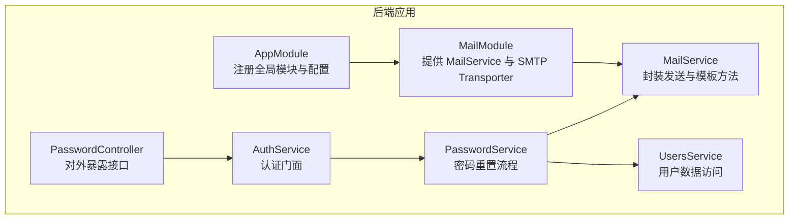
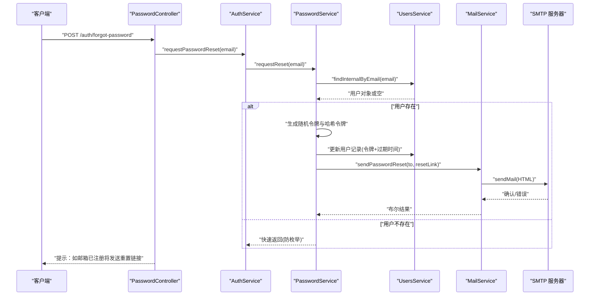
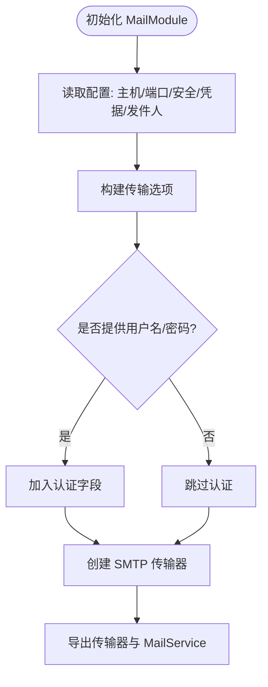
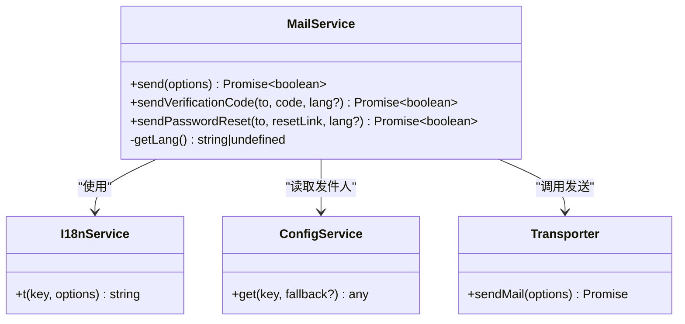
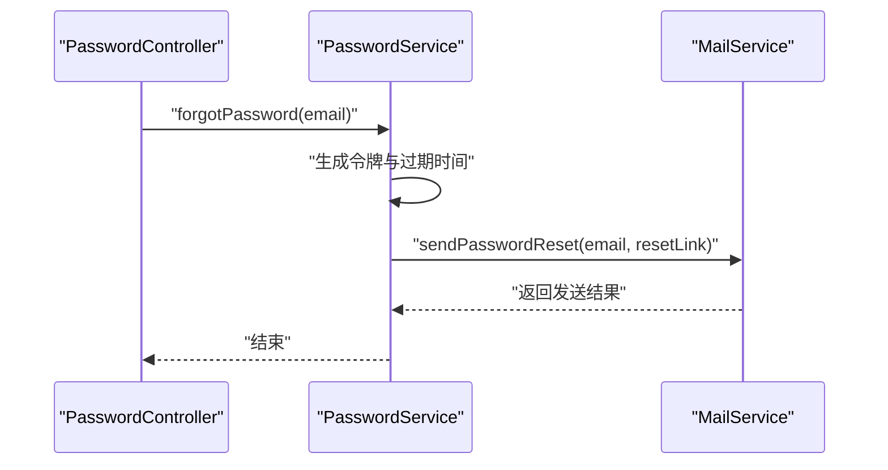
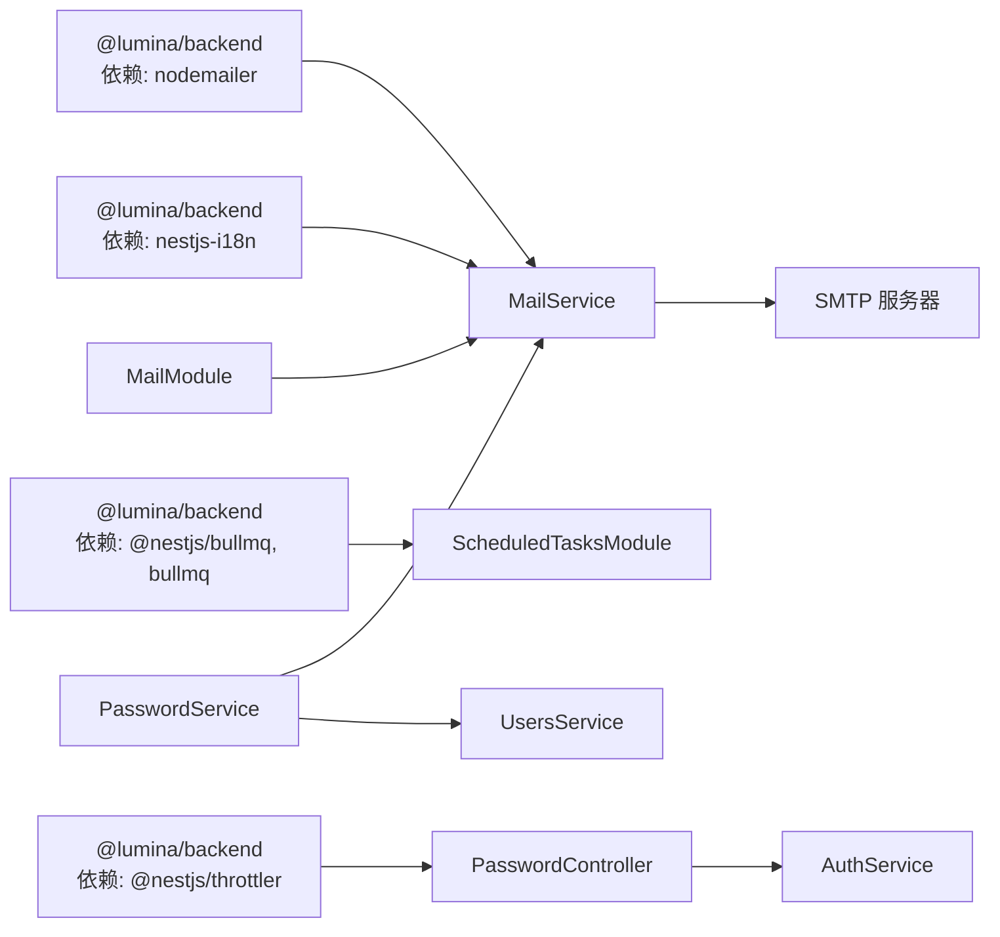

# 邮件系统

<cite>
**本文引用的文件**
- [apps/backend/src/mail/mail.module.ts](file://apps/backend/src/mail/mail.module.ts)
- [apps/backend/src/mail/mail.service.ts](file://apps/backend/src/mail/mail.service.ts)
- [apps/backend/src/mail/mail.constants.ts](file://apps/backend/src/mail/mail.constants.ts)
- [apps/backend/src/mail/index.ts](file://apps/backend/src/mail/index.ts)
- [apps/backend/src/i18n/en-US/mail.ts](file://apps/backend/src/i18n/en-US/mail.ts)
- [apps/backend/src/i18n/zh-CN/mail.ts](file://apps/backend/src/i18n/zh-CN/mail.ts)
- [apps/backend/src/app.module.ts](file://apps/backend/src/app.module.ts)
- [apps/backend/src/auth/password.controller.ts](file://apps/backend/src/auth/password.controller.ts)
- [apps/backend/src/auth/password.service.ts](file://apps/backend/src/auth/password.service.ts)
- [apps/backend/src/auth/auth.service.ts](file://apps/backend/src/auth/auth.service.ts)
- [apps/backend/src/users/users.service.ts](file://apps/backend/src/users/users.service.ts)
- [apps/backend/src/scheduled-tasks/scheduled-tasks.module.ts](file://apps/backend/src/scheduled-tasks/scheduled-tasks.module.ts)
- [apps/backend/src/scheduled-tasks/scheduled-tasks.processor.ts](file://apps/backend/src/scheduled-tasks/scheduled-tasks.processor.ts)
- [apps/backend/package.json](file://apps/backend/package.json)
</cite>

## 目录
1. [简介](#简介)
2. [项目结构](#项目结构)
3. [核心组件](#核心组件)
4. [架构总览](#架构总览)
5. [详细组件分析](#详细组件分析)
6. [依赖关系分析](#依赖关系分析)
7. [性能考量](#性能考量)
8. [故障排查指南](#故障排查指南)
9. [结论](#结论)
10. [附录](#附录)

## 简介
本文件面向 Lumina 邮件系统，提供从配置到发送、从模板到队列、从安全到调试的全栈技术文档。重点覆盖：
- 邮件服务配置与 SMTP 参数设置
- TLS/SSL 连接管理
- 邮件模板系统与 HTML 邮件渲染
- 附件发送机制现状与扩展建议
- 邮件队列管理、重试策略与发送状态跟踪
- 验证码邮件、密码重置邮件、通知邮件的实现
- 邮件安全配置、反垃圾邮件设置与发送限制
- 邮件调试工具、发送统计与故障排查

## 项目结构
邮件系统位于后端应用的 mail 子模块，围绕 NestJS 模块化设计，通过依赖注入与配置服务完成 SMTP 连接与邮件发送；国际化模块提供多语言邮件文案；认证模块在密码重置流程中调用邮件服务。

**图表来源**
- [apps/backend/src/app.module.ts:16-161](file://apps/backend/src/app.module.ts#L16-L161)
- [apps/backend/src/mail/mail.module.ts:11-35](file://apps/backend/src/mail/mail.module.ts#L11-L35)
- [apps/backend/src/mail/mail.service.ts:18-26](file://apps/backend/src/mail/mail.service.ts#L18-L26)
- [apps/backend/src/auth/password.controller.ts:10-37](file://apps/backend/src/auth/password.controller.ts#L10-L37)
- [apps/backend/src/auth/password.service.ts:9-20](file://apps/backend/src/auth/password.service.ts#L9-L20)
- [apps/backend/src/auth/auth.service.ts:12-21](file://apps/backend/src/auth/auth.service.ts#L12-L21)
- [apps/backend/src/users/users.service.ts:12-14](file://apps/backend/src/users/users.service.ts#L12-L14)

**章节来源**
- [apps/backend/src/app.module.ts:16-161](file://apps/backend/src/app.module.ts#L16-L161)
- [apps/backend/src/mail/mail.module.ts:1-37](file://apps/backend/src/mail/mail.module.ts#L1-L37)
- [apps/backend/src/mail/mail.service.ts:1-117](file://apps/backend/src/mail/mail.service.ts#L1-L117)

## 核心组件
- 邮件模块与传输器
  - 通过配置服务读取 SMTP 主机、端口、安全模式、认证凭据，动态创建 SMTP 传输器。
  - 默认导出 MailService，供应用其他模块注入使用。
- 邮件服务
  - 提供通用发送方法与两类专用模板：验证码邮件、密码重置邮件。
  - 使用国际化服务按当前语言选择文案，HTML 渲染邮件正文。
  - 统一记录发送日志，返回布尔结果表示成功与否。
- 国际化邮件文案
  - 英文与中文两套文案，涵盖验证码与密码重置场景的标题、正文、按钮与有效期说明。
- 认证与密码重置流程
  - 控制器层对“忘记密码”与“重置密码”接口进行速率限制。
  - 服务层生成重置令牌与过期时间，持久化后通过邮件服务发送重置链接。
- 定时任务模块
  - 使用 BullMQ 实现重复性任务，当前包含健康检查、待办提醒、清理过期数据与每日统计等任务。
  - 作为通用后台任务框架，可扩展为邮件队列（见后续章节）。

**章节来源**
- [apps/backend/src/mail/mail.module.ts:11-35](file://apps/backend/src/mail/mail.module.ts#L11-L35)
- [apps/backend/src/mail/mail.service.ts:18-117](file://apps/backend/src/mail/mail.service.ts#L18-L117)
- [apps/backend/src/i18n/en-US/mail.ts:1-16](file://apps/backend/src/i18n/en-US/mail.ts#L1-L16)
- [apps/backend/src/i18n/zh-CN/mail.ts:1-15](file://apps/backend/src/i18n/zh-CN/mail.ts#L1-L15)
- [apps/backend/src/auth/password.controller.ts:10-37](file://apps/backend/src/auth/password.controller.ts#L10-L37)
- [apps/backend/src/auth/password.service.ts:9-99](file://apps/backend/src/auth/password.service.ts#L9-L99)
- [apps/backend/src/scheduled-tasks/scheduled-tasks.module.ts:15-24](file://apps/backend/src/scheduled-tasks/scheduled-tasks.module.ts#L15-L24)

## 架构总览
下图展示邮件系统在认证流程中的调用链路，以及 SMTP 发送路径。

**图表来源**
- [apps/backend/src/auth/password.controller.ts:19-25](file://apps/backend/src/auth/password.controller.ts#L19-L25)
- [apps/backend/src/auth/auth.service.ts:106-108](file://apps/backend/src/auth/auth.service.ts#L106-L108)
- [apps/backend/src/auth/password.service.ts:39-61](file://apps/backend/src/auth/password.service.ts#L39-L61)
- [apps/backend/src/users/users.service.ts:55-57](file://apps/backend/src/users/users.service.ts#L55-L57)
- [apps/backend/src/mail/mail.service.ts:91-115](file://apps/backend/src/mail/mail.service.ts#L91-L115)

## 详细组件分析

### 邮件模块与 SMTP 配置
- 配置项
  - 主机、端口、安全模式、认证凭据、发件人地址等均来自配置服务。
  - 安全模式由字符串比较决定，端口需为有限数值，否则回退默认值。
- 连接管理
  - 使用 nodemailer 创建传输器，支持 SMTP 与认证。
  - 未显式设置 TLS/SSL 参数，默认遵循 nodemailer 行为；如需自定义 TLS，可在传输器工厂中扩展。
- 导出与注入
  - 通过符号常量提供传输器实例，MailService 注入并使用。

**图表来源**
- [apps/backend/src/mail/mail.module.ts:16-30](file://apps/backend/src/mail/mail.module.ts#L16-L30)

**章节来源**
- [apps/backend/src/mail/mail.module.ts:11-35](file://apps/backend/src/mail/mail.module.ts#L11-L35)
- [apps/backend/src/mail/mail.constants.ts:1-2](file://apps/backend/src/mail/mail.constants.ts#L1-L2)

### 邮件服务与模板系统
- 通用发送
  - 统一封装 send 方法，设置发件人、收件人、主题与文本/HTML 内容。
  - 成功记录日志并返回 true；失败捕获异常并返回 false。
- 验证码邮件
  - 使用国际化键生成标题、正文、页脚文案。
  - HTML 中突出显示验证码数字，增强可读性。
- 密码重置邮件
  - 使用国际化键生成标题、正文、按钮文案、页脚与有效期说明。
  - 包含可点击的重置链接，引导用户进入前端重置页面。

**图表来源**
- [apps/backend/src/mail/mail.service.ts:18-26](file://apps/backend/src/mail/mail.service.ts#L18-L26)
- [apps/backend/src/mail/mail.service.ts:43-60](file://apps/backend/src/mail/mail.service.ts#L43-L60)
- [apps/backend/src/mail/mail.service.ts:65-86](file://apps/backend/src/mail/mail.service.ts#L65-L86)
- [apps/backend/src/mail/mail.service.ts:91-115](file://apps/backend/src/mail/mail.service.ts#L91-L115)

**章节来源**
- [apps/backend/src/mail/mail.service.ts:18-117](file://apps/backend/src/mail/mail.service.ts#L18-L117)
- [apps/backend/src/i18n/en-US/mail.ts:1-16](file://apps/backend/src/i18n/en-US/mail.ts#L1-L16)
- [apps/backend/src/i18n/zh-CN/mail.ts:1-15](file://apps/backend/src/i18n/zh-CN/mail.ts#L1-L15)

### 国际化与多语言支持
- 国际化模块在应用启动时加载，支持请求头与接受语言解析。
- 邮件文案分别提供英文与中文版本，确保验证码与密码重置邮件的本地化体验。

**章节来源**
- [apps/backend/src/app.module.ts:139-148](file://apps/backend/src/app.module.ts#L139-L148)
- [apps/backend/src/i18n/en-US/mail.ts:1-16](file://apps/backend/src/i18n/en-US/mail.ts#L1-L16)
- [apps/backend/src/i18n/zh-CN/mail.ts:1-15](file://apps/backend/src/i18n/zh-CN/mail.ts#L1-L15)

### 验证码邮件与密码重置邮件
- 验证码邮件
  - 由 MailService 的专用方法生成 HTML 邮件，突出验证码数字，附加有效期提示。
- 密码重置邮件
  - 由 PasswordService 生成重置链接并调用 MailService 发送，包含按钮与有效期说明。
  - 控制器层对“忘记密码”接口施加速率限制，防止滥用。

**图表来源**
- [apps/backend/src/auth/password.controller.ts:19-25](file://apps/backend/src/auth/password.controller.ts#L19-L25)
- [apps/backend/src/auth/password.service.ts:39-61](file://apps/backend/src/auth/password.service.ts#L39-L61)
- [apps/backend/src/mail/mail.service.ts:91-115](file://apps/backend/src/mail/mail.service.ts#L91-L115)

**章节来源**
- [apps/backend/src/auth/password.controller.ts:10-37](file://apps/backend/src/auth/password.controller.ts#L10-L37)
- [apps/backend/src/auth/password.service.ts:39-61](file://apps/backend/src/auth/password.service.ts#L39-L61)
- [apps/backend/src/mail/mail.service.ts:65-115](file://apps/backend/src/mail/mail.service.ts#L65-L115)

### 通知邮件与扩展建议
- 当前代码未发现专门的通知邮件实现。
- 建议参考现有模板方法，新增通知邮件专用方法，并在业务模块中按需调用。

[本节为概念性内容，不直接分析具体文件，故无“章节来源”]

### 附件发送机制
- 当前 MailService 的发送方法支持 text 与 html 字段，未见附件字段的使用。
- 如需支持附件，可在发送选项中加入附件数组，并在模板中补充说明。

**章节来源**
- [apps/backend/src/mail/mail.service.ts:45-51](file://apps/backend/src/mail/mail.service.ts#L45-L51)

### 邮件队列管理与重试策略
- 现状
  - 定时任务模块使用 BullMQ 注册重复性任务，但未见邮件队列专用队列与处理器。
  - BullMQ 默认配置包含重试次数与指数退避策略，适用于通用后台任务。
- 建议
  - 新建邮件专用队列，定义邮件作业数据结构（收件人、主题、HTML、附件等）。
  - 实现邮件发送处理器，结合日志与监控，完善失败重试与死信处理。
  - 对外暴露异步发送接口，由业务模块提交邮件作业至队列。

**章节来源**
- [apps/backend/src/scheduled-tasks/scheduled-tasks.module.ts:15-24](file://apps/backend/src/scheduled-tasks/scheduled-tasks.module.ts#L15-L24)
- [apps/backend/src/scheduled-tasks/scheduled-tasks.processor.ts:36-68](file://apps/backend/src/scheduled-tasks/scheduled-tasks.processor.ts#L36-L68)

### 发送状态跟踪
- 当前实现仅返回布尔结果，未记录发送状态与追踪 ID。
- 建议
  - 引入邮件发送记录表，记录作业 ID、收件人、主题、发送时间、状态、错误信息。
  - 在处理器中写入状态变更，便于查询与重试。

**章节来源**
- [apps/backend/src/mail/mail.service.ts:43-60](file://apps/backend/src/mail/mail.service.ts#L43-L60)

## 依赖关系分析
- 外部依赖
  - nodemailer：SMTP 邮件发送
  - bullmq：后台任务与队列
  - nestjs-i18n：多语言文案
  - nestjs-throttler：速率限制
- 内部依赖
  - MailModule 向应用导出 MailService
  - PasswordService 依赖 MailService 与 UsersService
  - PasswordController 依赖 AuthService

**图表来源**
- [apps/backend/package.json:30-86](file://apps/backend/package.json#L30-L86)
- [apps/backend/src/mail/mail.module.ts:11-35](file://apps/backend/src/mail/mail.module.ts#L11-L35)
- [apps/backend/src/auth/password.controller.ts:10-37](file://apps/backend/src/auth/password.controller.ts#L10-L37)
- [apps/backend/src/auth/password.service.ts:9-20](file://apps/backend/src/auth/password.service.ts#L9-L20)
- [apps/backend/src/scheduled-tasks/scheduled-tasks.module.ts:15-24](file://apps/backend/src/scheduled-tasks/scheduled-tasks.module.ts#L15-L24)

**章节来源**
- [apps/backend/package.json:30-86](file://apps/backend/package.json#L30-L86)
- [apps/backend/src/app.module.ts:16-161](file://apps/backend/src/app.module.ts#L16-L161)

## 性能考量
- SMTP 连接复用
  - nodemailer 会复用底层连接，减少握手开销；建议在高并发场景下评估连接池大小与超时设置。
- 速率限制
  - 控制器层对“忘记密码”接口施加速率限制，防止暴力请求。
- 日志与监控
  - MailService 已记录发送日志；建议引入指标采集与告警，监控发送成功率与延迟。

**章节来源**
- [apps/backend/src/auth/password.controller.ts:19-25](file://apps/backend/src/auth/password.controller.ts#L19-L25)
- [apps/backend/src/mail/mail.service.ts:43-60](file://apps/backend/src/mail/mail.service.ts#L43-L60)

## 故障排查指南
- SMTP 连接失败
  - 检查主机、端口、安全模式与认证凭据是否正确。
  - 若启用 TLS/SSL，确认证书与域名匹配。
- 发送结果为失败
  - 查看日志中的错误堆栈，定位具体异常。
  - 确认发件人地址与收件人地址格式有效。
- 速率限制触发
  - 控制器层对“忘记密码”接口施加速率限制，短时间内多次请求会被拒绝。
- 国际化文案缺失
  - 确认当前语言解析是否正确，检查对应语言包是否存在。

**章节来源**
- [apps/backend/src/mail/mail.service.ts:55-59](file://apps/backend/src/mail/mail.service.ts#L55-L59)
- [apps/backend/src/auth/password.controller.ts:19-25](file://apps/backend/src/auth/password.controller.ts#L19-L25)

## 结论
Lumina 邮件系统基于 NestJS 与 nodemailer 实现，具备 SMTP 配置、多语言模板与基础发送能力。当前未内置邮件队列与状态跟踪，建议在现有架构上扩展邮件专用队列与处理器，完善重试、监控与统计功能；同时可按需增加附件支持与通知邮件模板，提升整体可靠性与可观测性。

## 附录

### 配置项一览
- 邮件 SMTP 相关
  - MAIL_HOST：SMTP 主机
  - MAIL_PORT：SMTP 端口（默认 587）
  - MAIL_SECURE：是否启用安全模式（字符串比较）
  - MAIL_USER / MAIL_PASSWORD：SMTP 认证凭据
  - MAIL_FROM：发件人地址（支持姓名与邮箱）
- 速率限制相关
  - THROTTLE_SHORT_TTL / THROTTLE_SHORT_LIMIT
  - THROTTLE_MEDIUM_TTL / THROTTLE_MEDIUM_LIMIT
  - THROTTLE_LONG_TTL / THROTTLE_LONG_LIMIT
- 其他
  - FRONTEND_URL：密码重置链接前缀
  - RESET_PASSWORD_EXPIRES_IN：重置链接有效期（秒）

**章节来源**
- [apps/backend/src/mail/mail.module.ts:17-26](file://apps/backend/src/mail/mail.module.ts#L17-L26)
- [apps/backend/src/mail/mail.service.ts:46-46](file://apps/backend/src/mail/mail.service.ts#L46-L46)
- [apps/backend/src/auth/password.controller.ts:19-25](file://apps/backend/src/auth/password.controller.ts#L19-L25)
- [apps/backend/src/auth/password.service.ts:48-58](file://apps/backend/src/auth/password.service.ts#L48-L58)