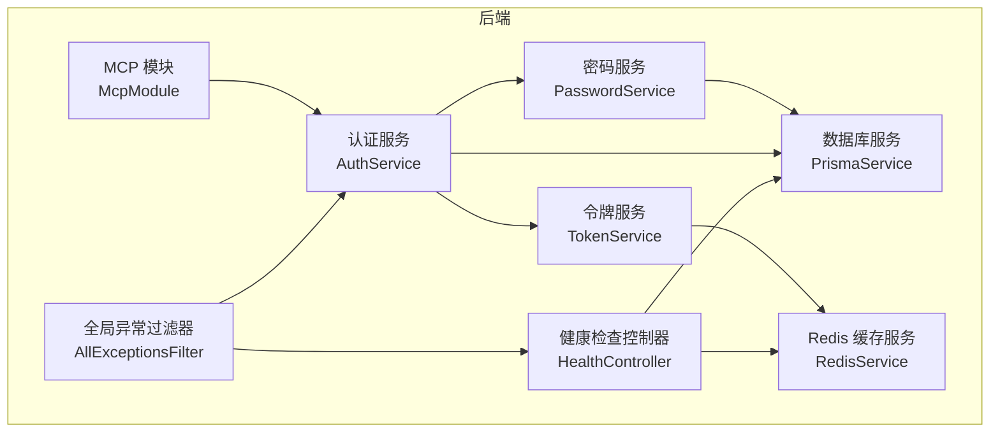
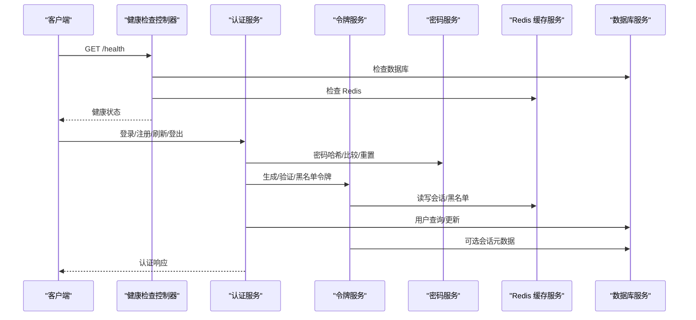
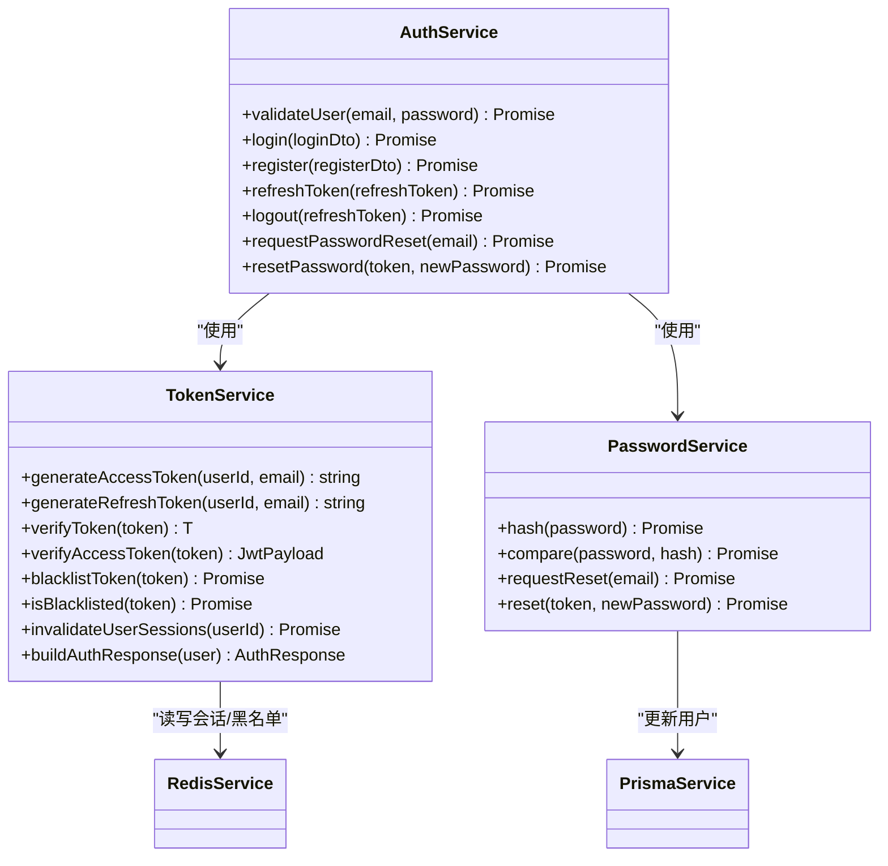
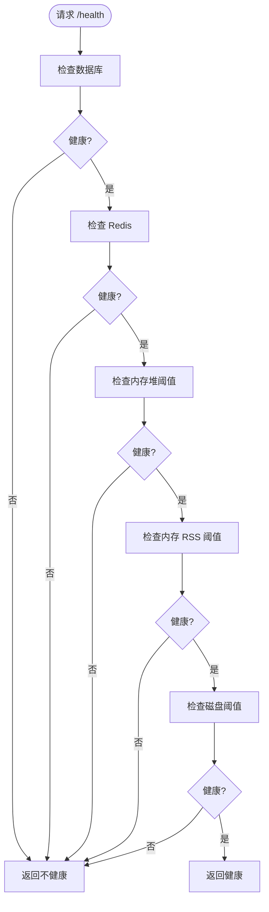
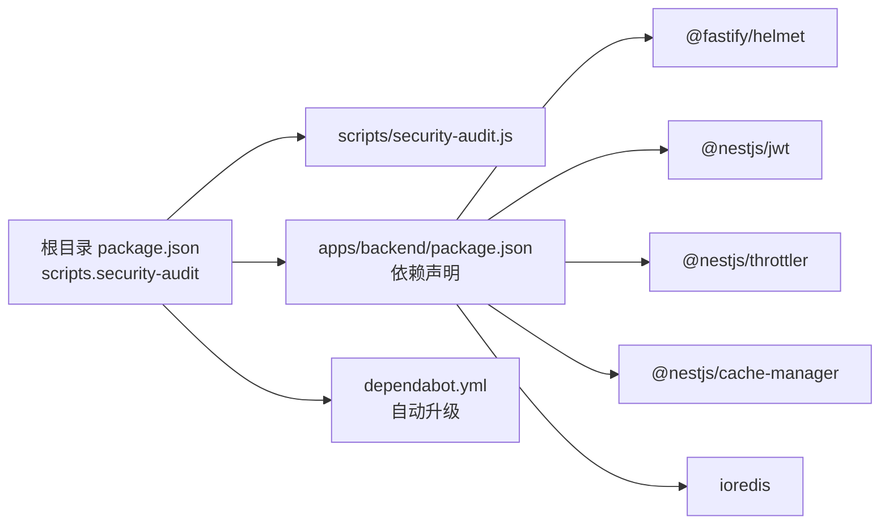

# 安全审计与监控

<cite>
**本文引用的文件**
- [SECURITY.md](file://SECURITY.md)
- [scripts/security-audit.js](file://scripts/security-audit.js)
- [apps/backend/src/common/filters/all-exceptions.filter.ts](file://apps/backend/src/common/filters/all-exceptions.filter.ts)
- [apps/backend/src/auth/auth.service.ts](file://apps/backend/src/auth/auth.service.ts)
- [apps/backend/src/auth/token.service.ts](file://apps/backend/src/auth/token.service.ts)
- [apps/backend/src/auth/password.service.ts](file://apps/backend/src/auth/password.service.ts)
- [apps/backend/src/health/health.controller.ts](file://apps/backend/src/health/health.controller.ts)
- [apps/backend/src/redis/redis.service.ts](file://apps/backend/src/redis/redis.service.ts)
- [apps/backend/src/prisma/prisma.service.ts](file://apps/backend/src/prisma/prisma.service.ts)
- [apps/backend/src/mcp/mcp.module.ts](file://apps/backend/src/mcp/mcp.module.ts)
- [apps/backend/package.json](file://apps/backend/package.json)
- [package.json](file://package.json)
- [.github/dependabot.yml](file://.github/dependabot.yml)
</cite>

## 目录
1. [简介](#简介)
2. [项目结构](#项目结构)
3. [核心组件](#核心组件)
4. [架构总览](#架构总览)
5. [详细组件分析](#详细组件分析)
6. [依赖关系分析](#依赖关系分析)
7. [性能考量](#性能考量)
8. [故障排查指南](#故障排查指南)
9. [结论](#结论)
10. [附录](#附录)

## 简介
本指南面向 Lumina Todo 的安全审计与监控落地实践，围绕以下目标展开：
- 安全事件日志的采集与分析：覆盖认证失败、异常访问与敏感操作。
- 实时监控体系：健康检查、性能指标与安全告警联动。
- 漏洞扫描与自动化安全检查：基于包管理器的漏洞审计脚本与依赖更新策略。
- 入侵检测与自动响应：基于会话失效、令牌校验与速率限制的主动防御。
- 合规与基线：版本支持范围、安全最佳实践与持续评估。
- 应急响应：事件分级、处置流程与报告模板。

## 项目结构
后端采用 NestJS + Fastify，前端为 Vue 生态，共享包提供跨端复用的数据传输对象与模式。安全相关能力主要集中在后端模块：
- 认证与授权：AuthService、TokenService、PasswordService
- 健康检查：HealthController
- 缓存与会话：RedisService
- 数据访问：PrismaService
- MCP 模块：外部模型上下文协议集成
- 异常与日志：全局异常过滤器
- 安全脚本与依赖策略：security-audit.js、dependabot.yml

图表来源
- [apps/backend/src/health/health.controller.ts:16-76](file://apps/backend/src/health/health.controller.ts#L16-L76)
- [apps/backend/src/auth/auth.service.ts:12-126](file://apps/backend/src/auth/auth.service.ts#L12-L126)
- [apps/backend/src/auth/token.service.ts:15-186](file://apps/backend/src/auth/token.service.ts#L15-L186)
- [apps/backend/src/auth/password.service.ts:9-99](file://apps/backend/src/auth/password.service.ts#L9-L99)
- [apps/backend/src/redis/redis.service.ts:51-202](file://apps/backend/src/redis/redis.service.ts#L51-L202)
- [apps/backend/src/prisma/prisma.service.ts:6-33](file://apps/backend/src/prisma/prisma.service.ts#L6-L33)
- [apps/backend/src/common/filters/all-exceptions.filter.ts:16-136](file://apps/backend/src/common/filters/all-exceptions.filter.ts#L16-L136)
- [apps/backend/src/mcp/mcp.module.ts:9-24](file://apps/backend/src/mcp/mcp.module.ts#L9-L24)

章节来源
- [apps/backend/src/health/health.controller.ts:16-76](file://apps/backend/src/health/health.controller.ts#L16-L76)
- [apps/backend/src/auth/auth.service.ts:12-126](file://apps/backend/src/auth/auth.service.ts#L12-L126)
- [apps/backend/src/auth/token.service.ts:15-186](file://apps/backend/src/auth/token.service.ts#L15-L186)
- [apps/backend/src/auth/password.service.ts:9-99](file://apps/backend/src/auth/password.service.ts#L9-L99)
- [apps/backend/src/redis/redis.service.ts:51-202](file://apps/backend/src/redis/redis.service.ts#L51-L202)
- [apps/backend/src/prisma/prisma.service.ts:6-33](file://apps/backend/src/prisma/prisma.service.ts#L6-L33)
- [apps/backend/src/common/filters/all-exceptions.filter.ts:16-136](file://apps/backend/src/common/filters/all-exceptions.filter.ts#L16-L136)
- [apps/backend/src/mcp/mcp.module.ts:9-24](file://apps/backend/src/mcp/mcp.module.ts#L9-L24)

## 核心组件
- 认证与令牌
  - 通过 TokenService 生成短期访问令牌与长期刷新令牌，并在 Redis 中维护黑名单与会话失效标记，实现登出、强制下线与令牌校验。
  - AuthService 聚合用户查询、密码比对与令牌构建，统一对外暴露登录、注册、刷新与登出接口。
  - PasswordService 提供密码哈希、比较与重置令牌生成，重置成功后调用 TokenService 使用户会话失效。
- 健康检查
  - HealthController 使用 @nestjs/terminus 对数据库、Redis、内存与磁盘进行综合健康检查；提供存活与就绪探针，适配容器编排环境。
- 缓存与会话
  - RedisService 提供键前缀、命名空间、TTL 管理与批量操作，支撑认证、限流与临时数据。
- 数据层
  - PrismaService 基于 PostgreSQL 连接池，负责连接生命周期管理。
- 全局异常与日志
  - AllExceptionsFilter 统一记录请求方法、URL、状态码与堆栈，输出结构化错误响应，便于审计与告警。
- 安全脚本与依赖
  - security-audit.js 基于 pnpm audit 对生产依赖进行漏洞扫描，支持忽略列表与退出码控制。
  - dependabot.yml 自动发起依赖升级 PR，降低供应链风险。

章节来源
- [apps/backend/src/auth/token.service.ts:15-186](file://apps/backend/src/auth/token.service.ts#L15-L186)
- [apps/backend/src/auth/auth.service.ts:12-126](file://apps/backend/src/auth/auth.service.ts#L12-L126)
- [apps/backend/src/auth/password.service.ts:9-99](file://apps/backend/src/auth/password.service.ts#L9-L99)
- [apps/backend/src/health/health.controller.ts:16-76](file://apps/backend/src/health/health.controller.ts#L16-L76)
- [apps/backend/src/redis/redis.service.ts:51-202](file://apps/backend/src/redis/redis.service.ts#L51-L202)
- [apps/backend/src/prisma/prisma.service.ts:6-33](file://apps/backend/src/prisma/prisma.service.ts#L6-L33)
- [apps/backend/src/common/filters/all-exceptions.filter.ts:16-136](file://apps/backend/src/common/filters/all-exceptions.filter.ts#L16-L136)
- [scripts/security-audit.js:1-53](file://scripts/security-audit.js#L1-L53)
- [.github/dependabot.yml:1-22](file://.github/dependabot.yml#L1-L22)

## 架构总览
下图展示安全相关组件之间的交互与数据流向，强调认证、令牌、缓存与健康检查的关键路径。

图表来源
- [apps/backend/src/health/health.controller.ts:16-76](file://apps/backend/src/health/health.controller.ts#L16-L76)
- [apps/backend/src/auth/auth.service.ts:12-126](file://apps/backend/src/auth/auth.service.ts#L12-L126)
- [apps/backend/src/auth/token.service.ts:15-186](file://apps/backend/src/auth/token.service.ts#L15-L186)
- [apps/backend/src/auth/password.service.ts:9-99](file://apps/backend/src/auth/password.service.ts#L9-L99)
- [apps/backend/src/redis/redis.service.ts:51-202](file://apps/backend/src/redis/redis.service.ts#L51-L202)
- [apps/backend/src/prisma/prisma.service.ts:6-33](file://apps/backend/src/prisma/prisma.service.ts#L6-L33)

## 详细组件分析

### 认证与令牌（AuthService、TokenService、PasswordService）
- 设计要点
  - 令牌分离：短期访问令牌与长期刷新令牌，分别使用不同密钥与过期策略。
  - 会话失效：通过 Redis 记录用户会话失效时间戳，刷新时校验令牌签发时间。
  - 黑名单：登出与强制下线将令牌写入黑名单，按剩余 TTL 存储，拒绝后续使用。
  - 密码安全：使用 bcrypt 哈希，重置令牌采用 SHA-256 哈希存储，防止枚举攻击。
- 安全事件日志
  - 认证失败：登录失败、无效凭据、无效刷新令牌等均抛出未授权异常，由全局异常过滤器记录请求上下文与堆栈。
  - 敏感操作：密码重置触发邮件发送与会话失效，可作为审计事件。
- 入侵检测与自动响应
  - 结合速率限制与黑名单机制，可快速阻断暴力破解与会话劫持。
  - 会话失效标记可配合强制下线策略，应对账户泄露场景。

图表来源
- [apps/backend/src/auth/auth.service.ts:12-126](file://apps/backend/src/auth/auth.service.ts#L12-L126)
- [apps/backend/src/auth/token.service.ts:15-186](file://apps/backend/src/auth/token.service.ts#L15-L186)
- [apps/backend/src/auth/password.service.ts:9-99](file://apps/backend/src/auth/password.service.ts#L9-L99)
- [apps/backend/src/redis/redis.service.ts:51-202](file://apps/backend/src/redis/redis.service.ts#L51-L202)
- [apps/backend/src/prisma/prisma.service.ts:6-33](file://apps/backend/src/prisma/prisma.service.ts#L6-L33)

章节来源
- [apps/backend/src/auth/auth.service.ts:12-126](file://apps/backend/src/auth/auth.service.ts#L12-L126)
- [apps/backend/src/auth/token.service.ts:15-186](file://apps/backend/src/auth/token.service.ts#L15-L186)
- [apps/backend/src/auth/password.service.ts:9-99](file://apps/backend/src/auth/password.service.ts#L9-L99)
- [apps/backend/src/common/filters/all-exceptions.filter.ts:16-136](file://apps/backend/src/common/filters/all-exceptions.filter.ts#L16-L136)

### 健康检查（HealthController）
- 能力概述
  - 综合健康：数据库、Redis、内存堆与 RSS、磁盘使用率阈值检查。
  - 探针：存活探针与就绪探针，适配容器编排。
- 监控指标
  - 健康状态码与响应体可用于 Prometheus/Grafana 等系统采集。
  - 建议结合日志与告警平台对异常状态进行告警。

图表来源
- [apps/backend/src/health/health.controller.ts:16-76](file://apps/backend/src/health/health.controller.ts#L16-L76)

章节来源
- [apps/backend/src/health/health.controller.ts:16-76](file://apps/backend/src/health/health.controller.ts#L16-L76)

### 缓存与会话（RedisService）
- 能力概述
  - 前缀与命名空间：统一键前缀，隔离不同业务域。
  - TTL 管理：默认 TTL 与自定义 TTL，支持刷新与批量删除。
  - 异常兜底：读写失败记录日志，避免影响主流程。
- 安全用途
  - 令牌黑名单、会话失效标记、限流键空间等。

章节来源
- [apps/backend/src/redis/redis.service.ts:51-202](file://apps/backend/src/redis/redis.service.ts#L51-L202)

### 数据层（PrismaService）
- 连接管理：基于连接池的 Prisma 客户端，模块销毁时释放连接。
- 安全建议：数据库凭据通过环境变量注入，避免硬编码。

章节来源
- [apps/backend/src/prisma/prisma.service.ts:6-33](file://apps/backend/src/prisma/prisma.service.ts#L6-L33)

### 全局异常与日志（AllExceptionsFilter）
- 能力概述
  - 统一记录请求方法、URL、状态码与堆栈，输出结构化错误响应。
  - 支持 Zod 验证错误与业务异常字段映射。
- 审计价值
  - 为认证失败、参数校验失败、内部错误等提供统一日志入口，便于 SIEM/日志平台聚合。

章节来源
- [apps/backend/src/common/filters/all-exceptions.filter.ts:16-136](file://apps/backend/src/common/filters/all-exceptions.filter.ts#L16-L136)

### 安全脚本与依赖策略（security-audit.js、dependabot.yml）
- 漏洞扫描
  - security-audit.js 调用 pnpm audit，解析 JSON 输出，支持忽略列表与退出码控制。
- 供应链治理
  - dependabot.yml 按月自动发起 npm 与 GitHub Actions 的依赖升级 PR，减少滞后风险。

章节来源
- [scripts/security-audit.js:1-53](file://scripts/security-audit.js#L1-L53)
- [.github/dependabot.yml:1-22](file://.github/dependabot.yml#L1-L22)

## 依赖关系分析
- 包管理与安全
  - apps/backend/package.json 显式声明安全相关依赖（如 helmet、cors、jwt、cache-manager、ioredis 等）。
  - 顶层 package.json 提供 security-audit 脚本入口，CI 中可串联执行。
- 第三方依赖安全
  - 通过 dependabot.yml 与 security-audit.js 形成“自动升级 + 手动审计”的双轨机制。

图表来源
- [package.json:31-50](file://package.json#L31-L50)
- [apps/backend/package.json:30-85](file://apps/backend/package.json#L30-L85)
- [.github/dependabot.yml:1-22](file://.github/dependabot.yml#L1-L22)

章节来源
- [package.json:31-50](file://package.json#L31-L50)
- [apps/backend/package.json:30-85](file://apps/backend/package.json#L30-L85)
- [.github/dependabot.yml:1-22](file://.github/dependabot.yml#L1-L22)

## 性能考量
- 健康检查阈值
  - 内存堆与 RSS 阈值、磁盘使用率阈值需结合实际资源与负载进行调优，避免误报或漏报。
- 缓存命中与 TTL
  - 合理设置 Redis 命名空间与 TTL，避免热点键导致缓存穿透与雪崩。
- 日志与异常
  - 全局异常过滤器会记录堆栈，生产环境建议结合日志采样与脱敏策略，避免敏感信息泄露。

## 故障排查指南
- 认证失败与异常访问
  - 关注全局异常过滤器输出的请求方法、URL、状态码与堆栈，定位具体接口与参数问题。
  - 若出现频繁无效凭据，结合速率限制与黑名单策略进行阻断。
- 健康检查失败
  - 逐步排查数据库连接、Redis 连接与资源使用情况，确认阈值设置合理。
- 令牌相关问题
  - 检查 JWT 密钥配置、令牌类型与过期时间；核对 Redis 黑名单与会话失效标记。

章节来源
- [apps/backend/src/common/filters/all-exceptions.filter.ts:16-136](file://apps/backend/src/common/filters/all-exceptions.filter.ts#L16-L136)
- [apps/backend/src/health/health.controller.ts:16-76](file://apps/backend/src/health/health.controller.ts#L16-L76)
- [apps/backend/src/auth/token.service.ts:15-186](file://apps/backend/src/auth/token.service.ts#L15-L186)

## 结论
Lumina Todo 在后端已具备较为完善的认证与会话控制、健康检查与日志统一出口，结合安全脚本与依赖自动升级策略，能够满足基础的安全审计与监控需求。建议进一步完善：
- 将健康检查与异常日志接入集中式监控与告警平台。
- 引入速率限制与 WAF，强化边界防护。
- 建立合规与基线评估流程，定期进行渗透测试与代码安全扫描。

## 附录

### 安全事件日志采集与分析清单
- 认证失败：登录、刷新、登出失败；无效凭据；无效刷新令牌。
- 异常访问：参数校验失败、未授权访问、内部错误。
- 敏感操作：密码重置请求与完成、会话强制失效。
- 建议字段：时间戳、请求方法、URL、状态码、用户标识、客户端 IP、UA、错误消息与堆栈。

章节来源
- [apps/backend/src/common/filters/all-exceptions.filter.ts:16-136](file://apps/backend/src/common/filters/all-exceptions.filter.ts#L16-L136)
- [apps/backend/src/auth/auth.service.ts:12-126](file://apps/backend/src/auth/auth.service.ts#L12-L126)
- [apps/backend/src/auth/password.service.ts:9-99](file://apps/backend/src/auth/password.service.ts#L9-L99)

### 实时监控配置要点
- 健康检查端点：/health、/health/liveness、/health/readiness。
- 指标采集：数据库连接数、Redis 命中率、内存与磁盘使用率。
- 告警规则：健康检查失败、内存/磁盘阈值越界、异常错误率上升。

章节来源
- [apps/backend/src/health/health.controller.ts:16-76](file://apps/backend/src/health/health.controller.ts#L16-L76)

### 漏洞扫描与自动化安全检查
- 执行方式：通过根目录脚本调用 security-audit.js，解析 pnpm audit 输出。
- 忽略策略：维护忽略列表，仅对真实风险发出告警。
- 依赖升级：启用 dependabot.yml，按月自动发起升级 PR。

章节来源
- [scripts/security-audit.js:1-53](file://scripts/security-audit.js#L1-L53)
- [.github/dependabot.yml:1-22](file://.github/dependabot.yml#L1-L22)

### 入侵检测与自动响应
- 识别手段：无效凭据、异常频率、无效令牌、会话失效。
- 响应动作：加入黑名单、强制下线、触发告警与人工审核。

章节来源
- [apps/backend/src/auth/token.service.ts:15-186](file://apps/backend/src/auth/token.service.ts#L15-L186)
- [apps/backend/src/auth/password.service.ts:9-99](file://apps/backend/src/auth/password.service.ts#L9-L99)

### 合规与安全基线
- 版本支持：参见安全策略文档。
- 最佳实践：保持安装最新、使用强口令、避免将数据库与缓存暴露公网。

章节来源
- [SECURITY.md:1-40](file://SECURITY.md#L1-L40)

### 安全事件响应流程
- 发现与分级：依据错误类型与影响面分级。
- 阻断与取证：封禁黑名单、拉取日志与堆栈、冻结受影响账户。
- 修复与验证：修复漏洞、回滚变更、回归测试。
- 报告与复盘：形成事件报告，更新基线与预案。

章节来源
- [apps/backend/src/common/filters/all-exceptions.filter.ts:16-136](file://apps/backend/src/common/filters/all-exceptions.filter.ts#L16-L136)
- [apps/backend/src/auth/token.service.ts:15-186](file://apps/backend/src/auth/token.service.ts#L15-L186)

### 第三方依赖安全监控与漏洞跟踪
- 自动化：dependabot.yml 自动发起升级 PR。
- 审计：security-audit.js 扫描生产依赖，支持忽略列表。
- 持续评估：在 CI 中串联执行，形成闭环。

章节来源
- [.github/dependabot.yml:1-22](file://.github/dependabot.yml#L1-L22)
- [scripts/security-audit.js:1-53](file://scripts/security-audit.js#L1-L53)

### 安全度量指标与关键风险指标（KRI）
- 指标示例：认证失败率、异常错误率、健康检查失败次数、Redis 命中率、内存/磁盘使用率。
- KRI 建议：认证失败率异常上升、健康检查连续失败、内存/磁盘超阈值。

章节来源
- [apps/backend/src/health/health.controller.ts:16-76](file://apps/backend/src/health/health.controller.ts#L16-L76)
- [apps/backend/src/common/filters/all-exceptions.filter.ts:16-136](file://apps/backend/src/common/filters/all-exceptions.filter.ts#L16-L136)

### 安全报告模板与格式
- 报告要素：事件摘要、影响范围、根因分析、处置过程、恢复验证、改进行动与责任人。
- 建议格式：Word/PDF，附日志截图与指标图表。

[本节为通用模板说明，无需特定文件引用]