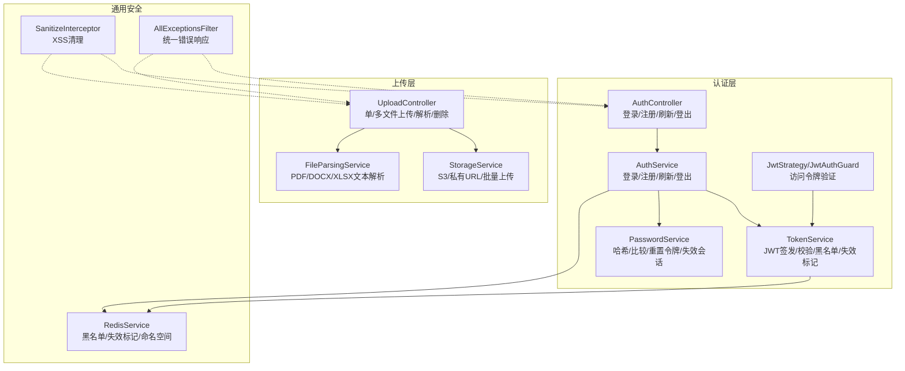
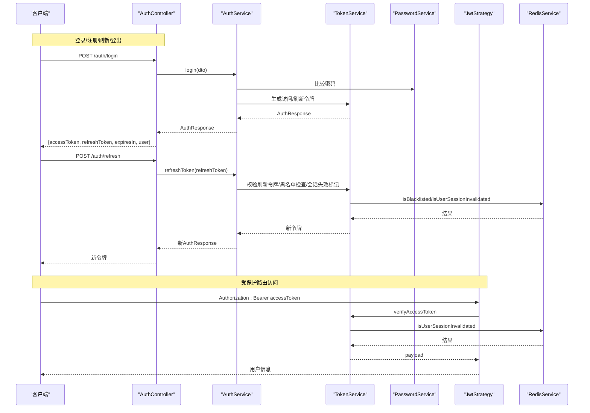
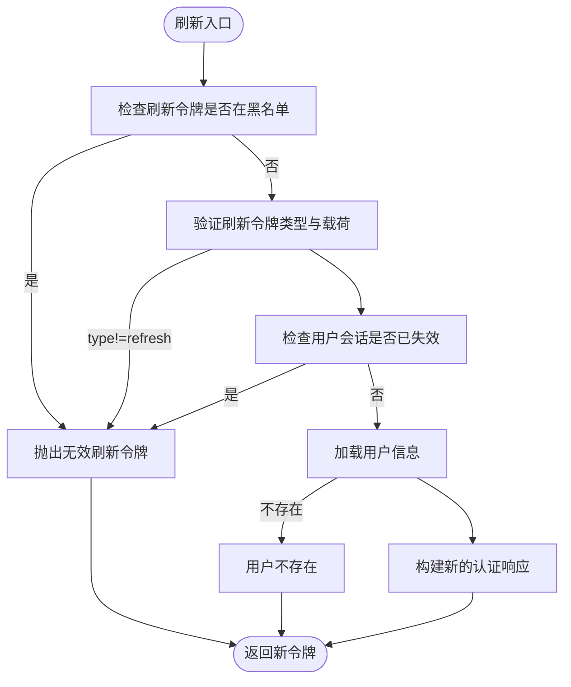
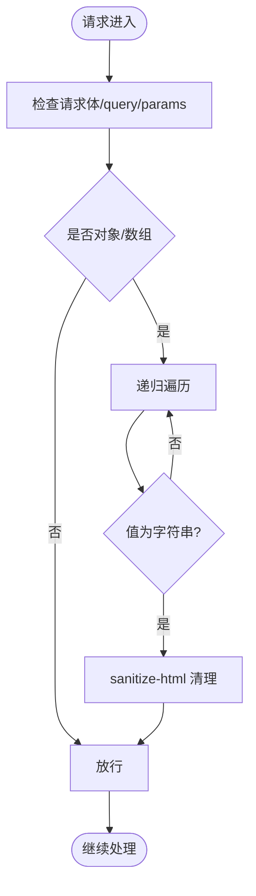
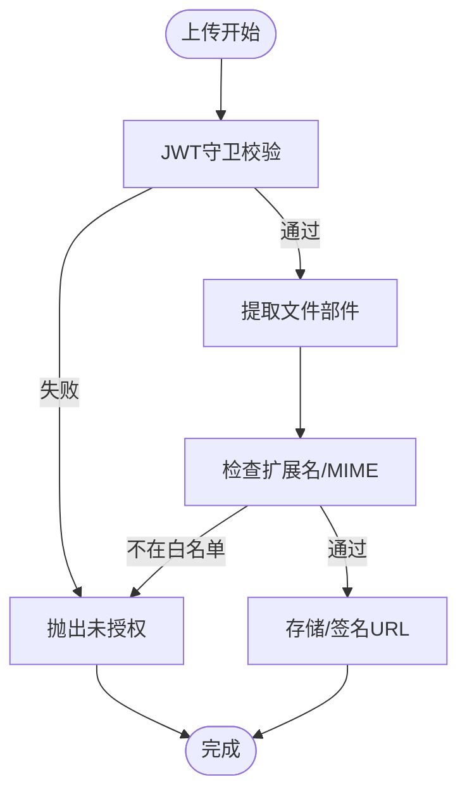
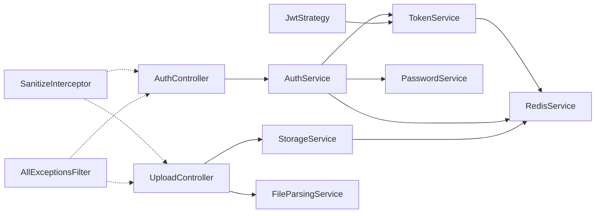

# 安全考虑

<cite>
**本文引用的文件**
- [apps/backend/src/auth/auth.controller.ts](file://apps/backend/src/auth/auth.controller.ts)
- [apps/backend/src/auth/auth.service.ts](file://apps/backend/src/auth/auth.service.ts)
- [apps/backend/src/auth/jwt-auth.guard.ts](file://apps/backend/src/auth/jwt-auth.guard.ts)
- [apps/backend/src/auth/jwt.strategy.ts](file://apps/backend/src/auth/jwt.strategy.ts)
- [apps/backend/src/auth/token.service.ts](file://apps/backend/src/auth/token.service.ts)
- [apps/backend/src/auth/password.service.ts](file://apps/backend/src/auth/password.service.ts)
- [apps/backend/src/auth/auth.dto.ts](file://apps/backend/src/auth/auth.dto.ts)
- [apps/backend/src/common/interceptors/sanitize.interceptor.ts](file://apps/backend/src/common/interceptors/sanitize.interceptor.ts)
- [apps/backend/src/common/filters/all-exceptions.filter.ts](file://apps/backend/src/common/filters/all-exceptions.filter.ts)
- [apps/backend/src/upload/upload.controller.ts](file://apps/backend/src/upload/upload.controller.ts)
- [apps/backend/src/upload/storage.service.ts](file://apps/backend/src/upload/storage.service.ts)
- [apps/backend/src/upload/file-parsing.service.ts](file://apps/backend/src/upload/file-parsing.service.ts)
- [apps/backend/src/upload/upload.constants.ts](file://apps/backend/src/upload/upload.constants.ts)
- [apps/backend/src/redis/redis.service.ts](file://apps/backend/src/redis/redis.service.ts)
- [apps/backend/src/prisma/prisma.service.ts](file://apps/backend/src/prisma/prisma.service.ts)
- [scripts/security-audit.js](file://scripts/security-audit.js)
- [SECURITY.md](file://SECURITY.md)
</cite>

## 目录
1. [简介](#简介)
2. [项目结构](#项目结构)
3. [核心组件](#核心组件)
4. [架构总览](#架构总览)
5. [详细组件分析](#详细组件分析)
6. [依赖关系分析](#依赖关系分析)
7. [性能考量](#性能考量)
8. [故障排查指南](#故障排查指南)
9. [结论](#结论)
10. [附录](#附录)

## 简介
本文件系统性梳理 Lumina Todo 在后端实现中的安全设计与实践，覆盖身份认证与授权（JWT）、输入验证与数据清理、SQL 注入防护、XSS 与 CSRF 防护、密码存储与传输加密、CORS 与 API 安全策略、文件上传与恶意文件检测、会话与令牌过期管理、安全审计与漏洞扫描、敏感数据处理与隐私保护、安全事件响应与应急流程，以及第三方依赖的安全管理与监控。

## 项目结构
后端采用 NestJS 架构，围绕认证模块、上传模块、通用拦截器与过滤器、缓存与数据库适配等模块组织安全相关能力。认证模块通过 JWT 守卫与策略实现访问控制；上传模块对文件类型与内容进行白名单校验与解析；全局拦截器与过滤器统一处理输入清理与错误输出；Redis 与 Prisma 提供令牌黑名单、会话失效标记与持久化存储。

图示来源
- [apps/backend/src/auth/auth.controller.ts:1-82](file://apps/backend/src/auth/auth.controller.ts#L1-L82)
- [apps/backend/src/auth/auth.service.ts:1-127](file://apps/backend/src/auth/auth.service.ts#L1-L127)
- [apps/backend/src/auth/token.service.ts:1-187](file://apps/backend/src/auth/token.service.ts#L1-L187)
- [apps/backend/src/auth/password.service.ts:1-100](file://apps/backend/src/auth/password.service.ts#L1-L100)
- [apps/backend/src/auth/jwt.strategy.ts:1-68](file://apps/backend/src/auth/jwt.strategy.ts#L1-L68)
- [apps/backend/src/auth/jwt-auth.guard.ts:1-10](file://apps/backend/src/auth/jwt-auth.guard.ts#L1-L10)
- [apps/backend/src/upload/upload.controller.ts:1-156](file://apps/backend/src/upload/upload.controller.ts#L1-L156)
- [apps/backend/src/upload/storage.service.ts:1-151](file://apps/backend/src/upload/storage.service.ts#L1-L151)
- [apps/backend/src/upload/file-parsing.service.ts:1-142](file://apps/backend/src/upload/file-parsing.service.ts#L1-L142)
- [apps/backend/src/common/interceptors/sanitize.interceptor.ts:1-64](file://apps/backend/src/common/interceptors/sanitize.interceptor.ts#L1-L64)
- [apps/backend/src/common/filters/all-exceptions.filter.ts:1-137](file://apps/backend/src/common/filters/all-exceptions.filter.ts#L1-L137)
- [apps/backend/src/redis/redis.service.ts:1-233](file://apps/backend/src/redis/redis.service.ts#L1-L233)

章节来源
- [apps/backend/src/auth/auth.controller.ts:1-82](file://apps/backend/src/auth/auth.controller.ts#L1-L82)
- [apps/backend/src/upload/upload.controller.ts:1-156](file://apps/backend/src/upload/upload.controller.ts#L1-L156)
- [apps/backend/src/common/interceptors/sanitize.interceptor.ts:1-64](file://apps/backend/src/common/interceptors/sanitize.interceptor.ts#L1-L64)
- [apps/backend/src/common/filters/all-exceptions.filter.ts:1-137](file://apps/backend/src/common/filters/all-exceptions.filter.ts#L1-L137)
- [apps/backend/src/redis/redis.service.ts:1-233](file://apps/backend/src/redis/redis.service.ts#L1-L233)

## 核心组件
- 认证与授权
  - JWT 守卫与策略：基于访问令牌的路由保护，严格区分访问令牌与刷新令牌，拒绝非访问令牌进入受保护路由。
  - TokenService：分离访问/刷新密钥，支持黑名单、会话失效标记、构建完整认证响应。
  - AuthService：整合登录/注册/刷新/登出，统一异常处理，避免内部 500 暴露。
  - PasswordService：密码哈希/比较、重置令牌生成与校验、重置后使用户会话失效。
- 输入验证与数据清理
  - SanitizeInterceptor：递归清理请求体/查询/路径参数中的字符串值，禁用所有 HTML 标签，阻断 XSS。
  - DTO + Zod：前端请求参数在服务端以 Zod 校验，配合 Swagger 文档生成。
- 数据库与缓存
  - PrismaService：基于 PostgreSQL 的 ORM 客户端，避免原生 SQL 注入。
  - RedisService：命名空间缓存、黑名单、会话失效标记、TTL 管理。
- 上传与解析
  - UploadController：JWT 保护、白名单扩展名/MIME 类型检查、单/多文件上传、删除。
  - StorageService：S3/兼容 S3 存储、私有 URL 签名、批量上传。
  - FileParsingService：PDF/DOCX/XLSX 文本解析，超长内容截断，异常规范化。
- 全局异常与安全过滤
  - AllExceptionsFilter：统一错误响应、结构化错误对象、国际化消息、日志记录。

章节来源
- [apps/backend/src/auth/jwt-auth.guard.ts:1-10](file://apps/backend/src/auth/jwt-auth.guard.ts#L1-L10)
- [apps/backend/src/auth/jwt.strategy.ts:1-68](file://apps/backend/src/auth/jwt.strategy.ts#L1-L68)
- [apps/backend/src/auth/token.service.ts:1-187](file://apps/backend/src/auth/token.service.ts#L1-L187)
- [apps/backend/src/auth/auth.service.ts:1-127](file://apps/backend/src/auth/auth.service.ts#L1-L127)
- [apps/backend/src/auth/password.service.ts:1-100](file://apps/backend/src/auth/password.service.ts#L1-L100)
- [apps/backend/src/common/interceptors/sanitize.interceptor.ts:1-64](file://apps/backend/src/common/interceptors/sanitize.interceptor.ts#L1-L64)
- [apps/backend/src/common/filters/all-exceptions.filter.ts:1-137](file://apps/backend/src/common/filters/all-exceptions.filter.ts#L1-L137)
- [apps/backend/src/upload/upload.controller.ts:1-156](file://apps/backend/src/upload/upload.controller.ts#L1-L156)
- [apps/backend/src/upload/storage.service.ts:1-151](file://apps/backend/src/upload/storage.service.ts#L1-L151)
- [apps/backend/src/upload/file-parsing.service.ts:1-142](file://apps/backend/src/upload/file-parsing.service.ts#L1-L142)
- [apps/backend/src/redis/redis.service.ts:1-233](file://apps/backend/src/redis/redis.service.ts#L1-L233)
- [apps/backend/src/prisma/prisma.service.ts:1-34](file://apps/backend/src/prisma/prisma.service.ts#L1-L34)

## 架构总览
下图展示认证与授权、输入清理、上传与解析、缓存与数据库之间的交互关系及安全控制点。

图示来源
- [apps/backend/src/auth/auth.controller.ts:1-82](file://apps/backend/src/auth/auth.controller.ts#L1-L82)
- [apps/backend/src/auth/auth.service.ts:1-127](file://apps/backend/src/auth/auth.service.ts#L1-L127)
- [apps/backend/src/auth/token.service.ts:1-187](file://apps/backend/src/auth/token.service.ts#L1-L187)
- [apps/backend/src/auth/password.service.ts:1-100](file://apps/backend/src/auth/password.service.ts#L1-L100)
- [apps/backend/src/auth/jwt.strategy.ts:1-68](file://apps/backend/src/auth/jwt.strategy.ts#L1-L68)
- [apps/backend/src/redis/redis.service.ts:1-233](file://apps/backend/src/redis/redis.service.ts#L1-L233)

## 详细组件分析

### 身份认证与授权（JWT）
- 访问令牌与刷新令牌
  - 访问令牌短期有效，仅用于受保护资源访问；刷新令牌长期有效，用于换取新的访问令牌。
  - 两套密钥分离，生产环境强制配置刷新密钥，降低泄露风险。
- 令牌验证与拦截
  - JwtAuthGuard 保护路由；JwtStrategy 严格校验访问令牌类型、用户存在性、会话失效标记。
  - TokenService 支持黑名单（基于 Redis，按剩余 TTL 存储），防止已注销令牌继续使用。
- 登录/注册/刷新/登出
  - 登录与注册返回完整认证响应；刷新时先检查黑名单与会话失效标记；登出将刷新令牌加入黑名单。
- 会话失效
  - 重置密码后调用 invalidateUserSessions，记录用户会话失效时间戳，后续访问令牌若早于该时间戳即视为无效。

图示来源
- [apps/backend/src/auth/auth.service.ts:59-93](file://apps/backend/src/auth/auth.service.ts#L59-L93)
- [apps/backend/src/auth/token.service.ts:103-170](file://apps/backend/src/auth/token.service.ts#L103-L170)
- [apps/backend/src/auth/password.service.ts:88-89](file://apps/backend/src/auth/password.service.ts#L88-L89)

章节来源
- [apps/backend/src/auth/jwt-auth.guard.ts:1-10](file://apps/backend/src/auth/jwt-auth.guard.ts#L1-L10)
- [apps/backend/src/auth/jwt.strategy.ts:1-68](file://apps/backend/src/auth/jwt.strategy.ts#L1-L68)
- [apps/backend/src/auth/token.service.ts:1-187](file://apps/backend/src/auth/token.service.ts#L1-L187)
- [apps/backend/src/auth/auth.service.ts:1-127](file://apps/backend/src/auth/auth.service.ts#L1-L127)
- [apps/backend/src/auth/password.service.ts:1-100](file://apps/backend/src/auth/password.service.ts#L1-L100)

### 输入验证与数据清理（XSS）
- SanitizeInterceptor 对请求体、查询参数、路径参数进行递归清理，禁用所有 HTML 标签，避免 XSS。
- DTO 使用 Zod 校验，结合 Swagger 自动生成接口文档，减少手写校验遗漏。

图示来源
- [apps/backend/src/common/interceptors/sanitize.interceptor.ts:1-64](file://apps/backend/src/common/interceptors/sanitize.interceptor.ts#L1-L64)
- [apps/backend/src/auth/auth.dto.ts:1-41](file://apps/backend/src/auth/auth.dto.ts#L1-L41)

章节来源
- [apps/backend/src/common/interceptors/sanitize.interceptor.ts:1-64](file://apps/backend/src/common/interceptors/sanitize.interceptor.ts#L1-L64)
- [apps/backend/src/auth/auth.dto.ts:1-41](file://apps/backend/src/auth/auth.dto.ts#L1-L41)

### SQL 注入防护
- 使用 Prisma ORM，所有数据库查询通过类型安全的查询构造器生成，避免原生 SQL 拼接导致的注入风险。
- PrismaService 基于 PostgreSQL 适配器，连接池管理与生命周期控制完善。

章节来源
- [apps/backend/src/prisma/prisma.service.ts:1-34](file://apps/backend/src/prisma/prisma.service.ts#L1-L34)

### CSRF 防护
- 当前后端未显式实现 CSRF Token 校验。由于采用 JWT Bearer 令牌进行认证，且上传接口默认受 JwtAuthGuard 保护，建议在前端侧确保仅同站可信来源发起请求，并结合安全响应头（如 SameSite Cookie 策略）进一步加固。若未来引入 Cookie 会话，请务必启用 CSRF Token 与 SameSite=Strict/Lax 策略。

### 密码存储与传输加密
- 存储：使用 bcryptjs 对密码进行哈希存储，成本因子固定，保证抗暴力破解能力。
- 传输：建议在部署层强制 HTTPS，后端仅接受 TLS 连接；JWT 密钥应妥善保管，避免泄露。
- 重置流程：生成随机明文令牌，服务端仅保存哈希；重置后立即失效用户所有会话，降低令牌滥用风险。

章节来源
- [apps/backend/src/auth/password.service.ts:25-34](file://apps/backend/src/auth/password.service.ts#L25-L34)
- [apps/backend/src/auth/password.service.ts:66-89](file://apps/backend/src/auth/password.service.ts#L66-L89)
- [apps/backend/src/auth/token.service.ts:30-44](file://apps/backend/src/auth/token.service.ts#L30-L44)

### CORS 与 API 安全策略
- 仓库未提供独立的 CORS 中间件配置文件。建议在应用启动时明确配置允许的源、方法、头部与凭据，遵循最小暴露原则。
- 上传接口默认受 JwtAuthGuard 保护，结合 SanitizeInterceptor 与白名单文件类型，降低跨域与文件类攻击面。

章节来源
- [apps/backend/src/upload/upload.controller.ts:22-24](file://apps/backend/src/upload/upload.controller.ts#L22-L24)

### 文件上传与恶意文件检测
- 白名单策略：仅允许特定 MIME 类型与扩展名，超出范围直接拒绝。
- 内容解析：对 PDF/DOCX/XLSX 进行结构化解析，文本内容进行长度截断，防止超大内容占用资源。
- 存储与访问：S3/兼容 S3 存储，默认不公开读取，可通过签名 URL 临时授权访问。
- 异常处理：解析失败与不支持类型均返回标准化错误，避免泄露内部细节。

图示来源
- [apps/backend/src/upload/upload.controller.ts:33-87](file://apps/backend/src/upload/upload.controller.ts#L33-L87)
- [apps/backend/src/upload/upload.constants.ts:1-61](file://apps/backend/src/upload/upload.constants.ts#L1-L61)
- [apps/backend/src/upload/storage.service.ts:72-95](file://apps/backend/src/upload/storage.service.ts#L72-L95)
- [apps/backend/src/upload/file-parsing.service.ts:16-72](file://apps/backend/src/upload/file-parsing.service.ts#L16-L72)

章节来源
- [apps/backend/src/upload/upload.controller.ts:1-156](file://apps/backend/src/upload/upload.controller.ts#L1-L156)
- [apps/backend/src/upload/upload.constants.ts:1-61](file://apps/backend/src/upload/upload.constants.ts#L1-L61)
- [apps/backend/src/upload/storage.service.ts:1-151](file://apps/backend/src/upload/storage.service.ts#L1-L151)
- [apps/backend/src/upload/file-parsing.service.ts:1-142](file://apps/backend/src/upload/file-parsing.service.ts#L1-L142)

### 会话管理与令牌过期处理
- 访问令牌：短期过期，频繁刷新；刷新令牌：长期过期，用于换取新访问令牌。
- 黑名单：登出/刷新失败等场景将令牌加入黑名单，按剩余 TTL 存储，防止复用。
- 会话失效：重置密码后记录用户会话失效时间戳，后续访问令牌若早于该时间戳即视为无效。
- Redis 命名空间：统一前缀管理，便于维护与清理。

章节来源
- [apps/backend/src/auth/token.service.ts:47-76](file://apps/backend/src/auth/token.service.ts#L47-L76)
- [apps/backend/src/auth/token.service.ts:130-170](file://apps/backend/src/auth/token.service.ts#L130-L170)
- [apps/backend/src/auth/password.service.ts:88-89](file://apps/backend/src/auth/password.service.ts#L88-L89)
- [apps/backend/src/redis/redis.service.ts:8-25](file://apps/backend/src/redis/redis.service.ts#L8-L25)

### 安全审计与漏洞扫描
- 使用脚本对生产依赖执行 pnpm audit，支持忽略特定模块与 advisory，未忽略的漏洞将导致失败退出。
- 建议定期运行该脚本并纳入 CI 流水线，确保依赖安全基线。

章节来源
- [scripts/security-audit.js:1-53](file://scripts/security-audit.js#L1-L53)

### 敏感数据处理与隐私保护
- 错误响应统一结构化输出，避免泄露内部堆栈与敏感信息。
- 国际化错误消息，错误字段映射与属性名称本地化，提升用户体验同时避免信息泄露。
- 文件解析后内容截断，防止超大数据影响系统稳定性。

章节来源
- [apps/backend/src/common/filters/all-exceptions.filter.ts:1-137](file://apps/backend/src/common/filters/all-exceptions.filter.ts#L1-L137)
- [apps/backend/src/upload/file-parsing.service.ts:134-140](file://apps/backend/src/upload/file-parsing.service.ts#L134-L140)

### 安全事件响应与应急处理流程
- 报告渠道：通过 GitHub 私有漏洞报告或邮件私下上报，维护者将在 48 小时内确认并协调修复。
- 版本支持：仅对 1.0.x 主版本提供安全更新，建议用户保持升级。
- 最佳实践：定期轮换凭证、避免将数据库与缓存暴露公网、使用强密码与定期轮换。

章节来源
- [SECURITY.md:1-40](file://SECURITY.md#L1-L40)

## 依赖关系分析

图示来源
- [apps/backend/src/auth/auth.controller.ts:1-82](file://apps/backend/src/auth/auth.controller.ts#L1-L82)
- [apps/backend/src/auth/auth.service.ts:1-127](file://apps/backend/src/auth/auth.service.ts#L1-L127)
- [apps/backend/src/auth/token.service.ts:1-187](file://apps/backend/src/auth/token.service.ts#L1-L187)
- [apps/backend/src/auth/password.service.ts:1-100](file://apps/backend/src/auth/password.service.ts#L1-L100)
- [apps/backend/src/auth/jwt.strategy.ts:1-68](file://apps/backend/src/auth/jwt.strategy.ts#L1-L68)
- [apps/backend/src/upload/upload.controller.ts:1-156](file://apps/backend/src/upload/upload.controller.ts#L1-L156)
- [apps/backend/src/upload/storage.service.ts:1-151](file://apps/backend/src/upload/storage.service.ts#L1-L151)
- [apps/backend/src/upload/file-parsing.service.ts:1-142](file://apps/backend/src/upload/file-parsing.service.ts#L1-L142)
- [apps/backend/src/common/interceptors/sanitize.interceptor.ts:1-64](file://apps/backend/src/common/interceptors/sanitize.interceptor.ts#L1-L64)
- [apps/backend/src/common/filters/all-exceptions.filter.ts:1-137](file://apps/backend/src/common/filters/all-exceptions.filter.ts#L1-L137)
- [apps/backend/src/redis/redis.service.ts:1-233](file://apps/backend/src/redis/redis.service.ts#L1-L233)

章节来源
- [apps/backend/src/auth/auth.controller.ts:1-82](file://apps/backend/src/auth/auth.controller.ts#L1-L82)
- [apps/backend/src/upload/upload.controller.ts:1-156](file://apps/backend/src/upload/upload.controller.ts#L1-L156)
- [apps/backend/src/common/interceptors/sanitize.interceptor.ts:1-64](file://apps/backend/src/common/interceptors/sanitize.interceptor.ts#L1-L64)
- [apps/backend/src/common/filters/all-exceptions.filter.ts:1-137](file://apps/backend/src/common/filters/all-exceptions.filter.ts#L1-L137)
- [apps/backend/src/redis/redis.service.ts:1-233](file://apps/backend/src/redis/redis.service.ts#L1-L233)

## 性能考量
- 缓存与 TTL：RedisService 提供统一 TTL 常量与命名空间，建议根据业务热点调整缓存策略，避免缓存穿透与雪崩。
- 令牌黑名单：黑名单按剩余 TTL 存储，避免重复查询；建议定期清理过期键。
- 文件解析：对超长内容截断，避免内存与网络压力；解析失败快速失败并记录日志。
- 数据库：Prisma 查询尽量使用索引字段，避免 N+1 查询；批量操作使用事务。

## 故障排查指南
- 认证失败
  - 检查 JWT_SECRET/JWT_REFRESH_SECRET 是否正确配置；刷新令牌是否在黑名单；用户会话是否已失效。
- 上传失败
  - 确认文件类型与扩展名是否在白名单；S3 凭证是否配置；签名 URL 是否过期。
- XSS 问题
  - 确认 SanitizeInterceptor 是否生效；请求体是否被正确清理。
- 全局错误
  - 查看 AllExceptionsFilter 输出的结构化错误对象与国际化消息，定位具体字段与原因。

章节来源
- [apps/backend/src/auth/token.service.ts:30-44](file://apps/backend/src/auth/token.service.ts#L30-L44)
- [apps/backend/src/auth/auth.service.ts:59-93](file://apps/backend/src/auth/auth.service.ts#L59-L93)
- [apps/backend/src/upload/upload.controller.ts:51-63](file://apps/backend/src/upload/upload.controller.ts#L51-L63)
- [apps/backend/src/upload/storage.service.ts:43-67](file://apps/backend/src/upload/storage.service.ts#L43-L67)
- [apps/backend/src/common/interceptors/sanitize.interceptor.ts:17-36](file://apps/backend/src/common/interceptors/sanitize.interceptor.ts#L17-L36)
- [apps/backend/src/common/filters/all-exceptions.filter.ts:27-135](file://apps/backend/src/common/filters/all-exceptions.filter.ts#L27-L135)

## 结论
Lumina Todo 在后端实现了较为完善的认证授权体系（JWT、黑名单、会话失效标记）、输入清理（XSS）、上传白名单与内容解析、统一错误响应与国际化、以及基于 Redis 的缓存与会话管理。建议在现有基础上补充 CSRF 防护（如启用 Cookie 会话时）、强化 CORS 配置、持续进行依赖安全审计，并完善安全事件响应流程与监控告警。

## 附录
- 第三方依赖安全管理
  - 使用脚本执行 pnpm audit 并忽略已知可接受风险模块；建议在 CI 中强制执行。
- 安全策略清单
  - 强制 HTTPS；最小权限访问数据库与缓存；定期轮换密钥与凭证；启用日志审计与告警。

章节来源
- [scripts/security-audit.js:1-53](file://scripts/security-audit.js#L1-L53)
- [SECURITY.md:1-40](file://SECURITY.md#L1-L40)