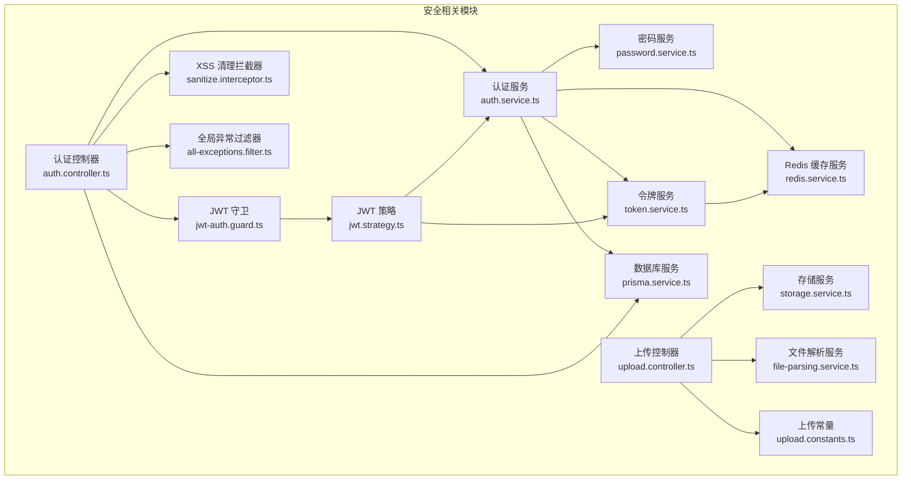
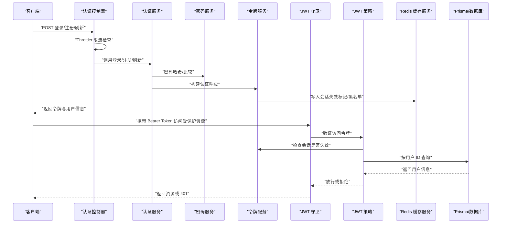
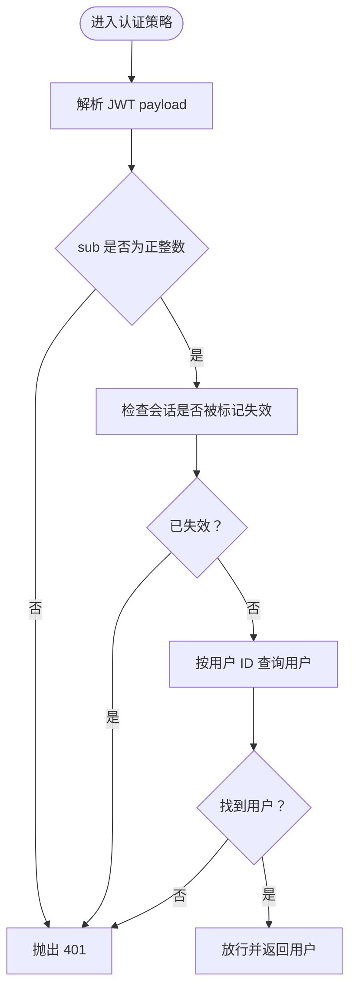
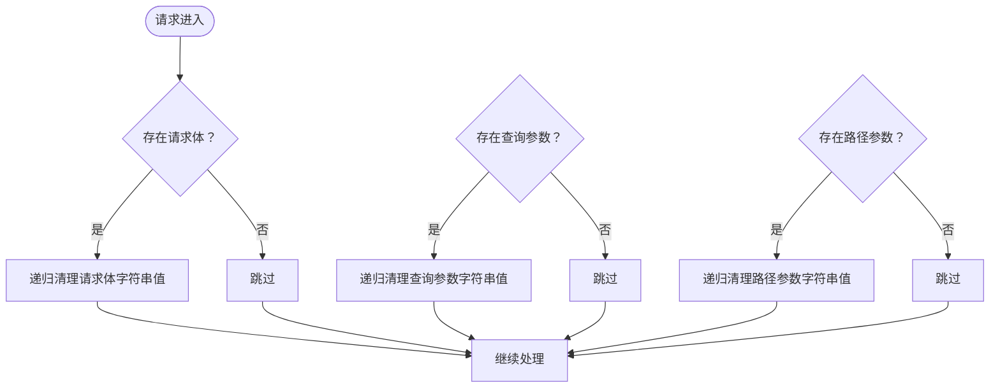
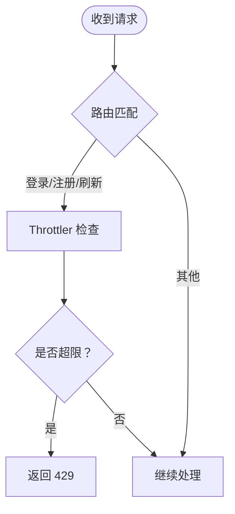
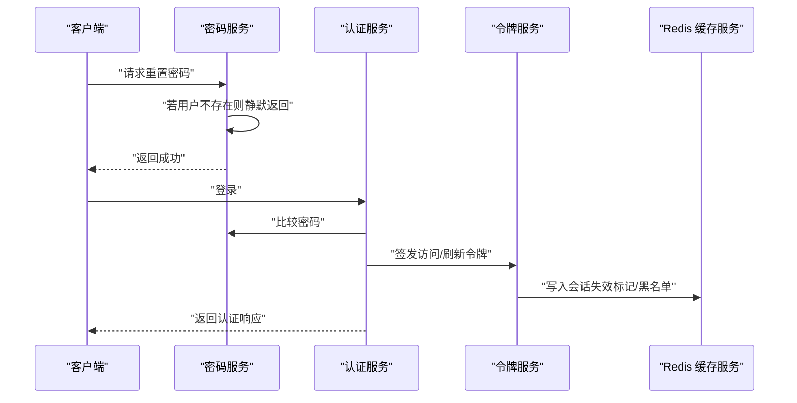
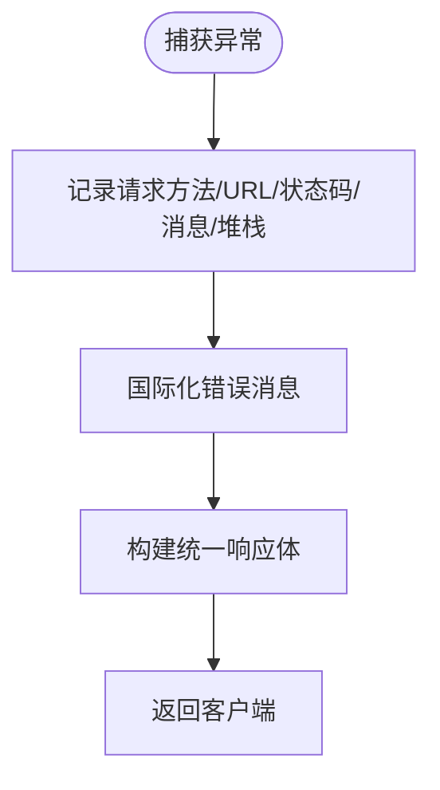
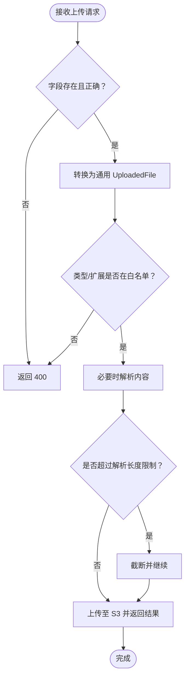
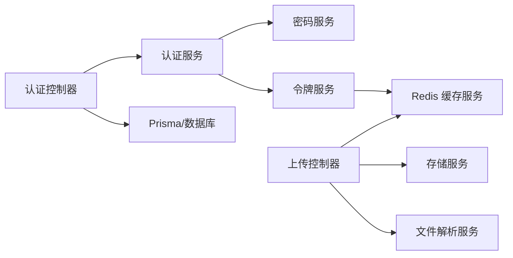

# 攻击防护

<cite>
**本文引用的文件**
- [apps/backend/src/common/filters/all-exceptions.filter.ts](file://apps/backend/src/common/filters/all-exceptions.filter.ts)
- [apps/backend/src/common/interceptors/sanitize.interceptor.ts](file://apps/backend/src/common/interceptors/sanitize.interceptor.ts)
- [apps/backend/src/auth/auth.controller.ts](file://apps/backend/src/auth/auth.controller.ts)
- [apps/backend/src/auth/auth.service.ts](file://apps/backend/src/auth/auth.service.ts)
- [apps/backend/src/auth/password.service.ts](file://apps/backend/src/auth/password.service.ts)
- [apps/backend/src/auth/token.service.ts](file://apps/backend/src/auth/token.service.ts)
- [apps/backend/src/auth/jwt-auth.guard.ts](file://apps/backend/src/auth/jwt-auth.guard.ts)
- [apps/backend/src/auth/jwt.strategy.ts](file://apps/backend/src/auth/jwt.strategy.ts)
- [apps/backend/src/todos/todos.controller.ts](file://apps/backend/src/todos/todos.controller.ts)
- [apps/backend/src/upload/upload.controller.ts](file://apps/backend/src/upload/upload.controller.ts)
- [apps/backend/src/upload/upload.constants.ts](file://apps/backend/src/upload/upload.constants.ts)
- [apps/backend/src/upload/storage.service.ts](file://apps/backend/src/upload/storage.service.ts)
- [apps/backend/src/upload/file-parsing.service.ts](file://apps/backend/src/upload/file-parsing.service.ts)
- [apps/backend/src/prisma/prisma.service.ts](file://apps/backend/src/prisma/prisma.service.ts)
- [apps/backend/src/redis/redis.service.ts](file://apps/backend/src/redis/redis.service.ts)
</cite>

## 目录
1. [简介](#简介)
2. [项目结构](#项目结构)
3. [核心组件](#核心组件)
4. [架构总览](#架构总览)
5. [详细组件分析](#详细组件分析)
6. [依赖关系分析](#依赖关系分析)
7. [性能考量](#性能考量)
8. [故障排查指南](#故障排查指南)
9. [结论](#结论)
10. [附录](#附录)

## 简介
本文件面向 Lumina Todo 的后端安全体系，围绕 SQL 注入、XSS、CSRF、DDoS、暴力破解、点击劫持与内容注入、安全头与 HTTPS、安全审计日志、异常信息泄露防护以及文件上传攻击与恶意文件检测等方面，提供系统化的技术说明与落地实践。文档以代码为依据，结合架构图与流程图，帮助开发者与运维人员快速理解并完善安全防护能力。

## 项目结构
后端采用 NestJS 架构，安全相关能力主要分布在以下模块：
- 认证与授权：JWT 守卫、策略、令牌服务、密码服务
- 输入清洗：全局 Xss 清理拦截器
- 速率限制：Throttler 装饰器在认证接口应用
- 数据访问：Prisma + PostgreSQL
- 缓存与会话：Redis 缓存与令牌黑名单
- 文件上传：类型白名单、解析限制、S3 存储
- 异常处理：全局异常过滤器，统一错误响应与日志

图表来源
- [apps/backend/src/auth/auth.controller.ts:1-82](file://apps/backend/src/auth/auth.controller.ts#L1-L82)
- [apps/backend/src/auth/auth.service.ts:1-127](file://apps/backend/src/auth/auth.service.ts#L1-L127)
- [apps/backend/src/auth/password.service.ts:1-100](file://apps/backend/src/auth/password.service.ts#L1-L100)
- [apps/backend/src/auth/token.service.ts:1-187](file://apps/backend/src/auth/token.service.ts#L1-L187)
- [apps/backend/src/auth/jwt-auth.guard.ts:1-10](file://apps/backend/src/auth/jwt-auth.guard.ts#L1-L10)
- [apps/backend/src/auth/jwt.strategy.ts:1-68](file://apps/backend/src/auth/jwt.strategy.ts#L1-L68)
- [apps/backend/src/common/interceptors/sanitize.interceptor.ts:1-64](file://apps/backend/src/common/interceptors/sanitize.interceptor.ts#L1-L64)
- [apps/backend/src/common/filters/all-exceptions.filter.ts:1-137](file://apps/backend/src/common/filters/all-exceptions.filter.ts#L1-L137)
- [apps/backend/src/redis/redis.service.ts:1-233](file://apps/backend/src/redis/redis.service.ts#L1-L233)
- [apps/backend/src/prisma/prisma.service.ts:1-34](file://apps/backend/src/prisma/prisma.service.ts#L1-L34)
- [apps/backend/src/upload/upload.controller.ts:1-156](file://apps/backend/src/upload/upload.controller.ts#L1-L156)
- [apps/backend/src/upload/storage.service.ts:1-151](file://apps/backend/src/upload/storage.service.ts#L1-L151)
- [apps/backend/src/upload/file-parsing.service.ts:1-142](file://apps/backend/src/upload/file-parsing.service.ts#L1-L142)
- [apps/backend/src/upload/upload.constants.ts:1-61](file://apps/backend/src/upload/upload.constants.ts#L1-L61)

章节来源
- [apps/backend/src/auth/auth.controller.ts:1-82](file://apps/backend/src/auth/auth.controller.ts#L1-L82)
- [apps/backend/src/common/interceptors/sanitize.interceptor.ts:1-64](file://apps/backend/src/common/interceptors/sanitize.interceptor.ts#L1-L64)
- [apps/backend/src/common/filters/all-exceptions.filter.ts:1-137](file://apps/backend/src/common/filters/all-exceptions.filter.ts#L1-L137)
- [apps/backend/src/redis/redis.service.ts:1-233](file://apps/backend/src/redis/redis.service.ts#L1-L233)
- [apps/backend/src/prisma/prisma.service.ts:1-34](file://apps/backend/src/prisma/prisma.service.ts#L1-L34)
- [apps/backend/src/upload/upload.controller.ts:1-156](file://apps/backend/src/upload/upload.controller.ts#L1-L156)
- [apps/backend/src/upload/storage.service.ts:1-151](file://apps/backend/src/upload/storage.service.ts#L1-L151)
- [apps/backend/src/upload/file-parsing.service.ts:1-142](file://apps/backend/src/upload/file-parsing.service.ts#L1-L142)
- [apps/backend/src/upload/upload.constants.ts:1-61](file://apps/backend/src/upload/upload.constants.ts#L1-L61)

## 核心组件
- 认证与令牌
  - JWT 守卫与策略负责访问令牌校验与用户解析
  - 令牌服务负责签发、验证、黑名单与会话失效标记
  - 密码服务负责哈希、比较与重置流程
- 输入安全
  - 全局 XSS 清理拦截器对请求体、查询参数、路径参数进行原地清理
- 速率限制
  - Throttler 在登录、注册、刷新等接口上限制请求频率
- 数据访问
  - Prisma + PostgreSQL，通过参数化查询与强类型约束降低 SQL 注入风险
- 缓存与会话
  - Redis 用于黑名单、会话失效标记、速率限制等
- 文件上传
  - 类型白名单与扩展名白名单、大小与解析长度限制、S3 存储
- 异常处理
  - 全局异常过滤器统一错误响应、日志记录与国际化消息

章节来源
- [apps/backend/src/auth/jwt-auth.guard.ts:1-10](file://apps/backend/src/auth/jwt-auth.guard.ts#L1-L10)
- [apps/backend/src/auth/jwt.strategy.ts:1-68](file://apps/backend/src/auth/jwt.strategy.ts#L1-L68)
- [apps/backend/src/auth/token.service.ts:1-187](file://apps/backend/src/auth/token.service.ts#L1-L187)
- [apps/backend/src/auth/password.service.ts:1-100](file://apps/backend/src/auth/password.service.ts#L1-L100)
- [apps/backend/src/common/interceptors/sanitize.interceptor.ts:1-64](file://apps/backend/src/common/interceptors/sanitize.interceptor.ts#L1-L64)
- [apps/backend/src/auth/auth.controller.ts:1-82](file://apps/backend/src/auth/auth.controller.ts#L1-L82)
- [apps/backend/src/prisma/prisma.service.ts:1-34](file://apps/backend/src/prisma/prisma.service.ts#L1-L34)
- [apps/backend/src/redis/redis.service.ts:1-233](file://apps/backend/src/redis/redis.service.ts#L1-L233)
- [apps/backend/src/upload/upload.controller.ts:1-156](file://apps/backend/src/upload/upload.controller.ts#L1-L156)
- [apps/backend/src/upload/upload.constants.ts:1-61](file://apps/backend/src/upload/upload.constants.ts#L1-L61)
- [apps/backend/src/common/filters/all-exceptions.filter.ts:1-137](file://apps/backend/src/common/filters/all-exceptions.filter.ts#L1-L137)

## 架构总览
下图展示认证与授权、输入清洗、速率限制、数据访问与缓存的整体交互：

图表来源
- [apps/backend/src/auth/auth.controller.ts:1-82](file://apps/backend/src/auth/auth.controller.ts#L1-L82)
- [apps/backend/src/auth/auth.service.ts:1-127](file://apps/backend/src/auth/auth.service.ts#L1-L127)
- [apps/backend/src/auth/password.service.ts:1-100](file://apps/backend/src/auth/password.service.ts#L1-L100)
- [apps/backend/src/auth/token.service.ts:1-187](file://apps/backend/src/auth/token.service.ts#L1-L187)
- [apps/backend/src/auth/jwt-auth.guard.ts:1-10](file://apps/backend/src/auth/jwt-auth.guard.ts#L1-L10)
- [apps/backend/src/auth/jwt.strategy.ts:1-68](file://apps/backend/src/auth/jwt.strategy.ts#L1-L68)
- [apps/backend/src/redis/redis.service.ts:1-233](file://apps/backend/src/redis/redis.service.ts#L1-L233)
- [apps/backend/src/prisma/prisma.service.ts:1-34](file://apps/backend/src/prisma/prisma.service.ts#L1-L34)

## 详细组件分析

### SQL 注入防护
- 参数化查询与 ORM 安全使用
  - 数据访问层基于 Prisma + PostgreSQL，使用强类型查询与参数绑定，避免拼接 SQL 字符串
  - 用户 ID 在策略中进行类型校验，防止注入与类型错误
- 关键点
  - 认证策略在验证 payload 后，将 sub 转为整数并校验范围，避免传入字符串导致查询异常
  - Prisma 初始化从环境变量读取连接，缺失时抛出明确错误，避免默认回退到不安全配置

图表来源
- [apps/backend/src/auth/jwt.strategy.ts:40-66](file://apps/backend/src/auth/jwt.strategy.ts#L40-L66)
- [apps/backend/src/prisma/prisma.service.ts:10-21](file://apps/backend/src/prisma/prisma.service.ts#L10-L21)

章节来源
- [apps/backend/src/auth/jwt.strategy.ts:40-66](file://apps/backend/src/auth/jwt.strategy.ts#L40-L66)
- [apps/backend/src/prisma/prisma.service.ts:10-21](file://apps/backend/src/prisma/prisma.service.ts#L10-L21)

### XSS 预防
- 全局拦截器对请求体、查询参数、路径参数进行递归清理，禁止任何 HTML 标签
- 输出侧建议配合前端渲染与模板引擎的自动转义策略，避免二次遗漏

图表来源
- [apps/backend/src/common/interceptors/sanitize.interceptor.ts:17-62](file://apps/backend/src/common/interceptors/sanitize.interceptor.ts#L17-L62)

章节来源
- [apps/backend/src/common/interceptors/sanitize.interceptor.ts:1-64](file://apps/backend/src/common/interceptors/sanitize.interceptor.ts#L1-L64)

### CSRF 防护
- 当前实现
  - 使用 JWT Bearer 令牌进行认证，避免依赖 Cookie；同时在控制器上启用 JWT 守卫，天然具备 CSRF 抗性
- 建议补充
  - 若未来引入 Cookie 认证，应配合 SameSite Cookie、CSRF Token 与同源策略，严格限定来源与方法

章节来源
- [apps/backend/src/auth/auth.controller.ts:1-82](file://apps/backend/src/auth/auth.controller.ts#L1-L82)
- [apps/backend/src/auth/jwt-auth.guard.ts:1-10](file://apps/backend/src/auth/jwt-auth.guard.ts#L1-L10)

### DDoS 防护
- 速率限制
  - 登录接口每分钟最多 5 次、注册每分钟最多 3 次、刷新每分钟最多 10 次
  - 令牌刷新与登出接口未设置 Throttle，建议在生产环境增加限制
- 缓存与限流
  - Redis 作为限流与会话状态存储，建议结合外部网关/反向代理实现分布式限流

图表来源
- [apps/backend/src/auth/auth.controller.ts:22-48](file://apps/backend/src/auth/auth.controller.ts#L22-L48)
- [apps/backend/src/redis/redis.service.ts:8-15](file://apps/backend/src/redis/redis.service.ts#L8-L15)

章节来源
- [apps/backend/src/auth/auth.controller.ts:22-48](file://apps/backend/src/auth/auth.controller.ts#L22-L48)
- [apps/backend/src/redis/redis.service.ts:8-15](file://apps/backend/src/redis/redis.service.ts#L8-L15)

### 暴力破解防护
- 密码哈希与比较
  - 使用 bcrypt 进行密码哈希与比较，提升抗破解能力
- 登录与枚举防护
  - 密码重置流程对不存在用户也返回成功，避免邮箱枚举
- 令牌与会话
  - 登出与重置会将刷新令牌加入黑名单，并标记用户会话失效，缩短攻击窗口

图表来源
- [apps/backend/src/auth/password.service.ts:39-61](file://apps/backend/src/auth/password.service.ts#L39-L61)
- [apps/backend/src/auth/auth.service.ts:41-49](file://apps/backend/src/auth/auth.service.ts#L41-L49)
- [apps/backend/src/auth/token.service.ts:47-76](file://apps/backend/src/auth/token.service.ts#L47-L76)

章节来源
- [apps/backend/src/auth/password.service.ts:25-34](file://apps/backend/src/auth/password.service.ts#L25-L34)
- [apps/backend/src/auth/password.service.ts:39-61](file://apps/backend/src/auth/password.service.ts#L39-L61)
- [apps/backend/src/auth/auth.service.ts:41-49](file://apps/backend/src/auth/auth.service.ts#L41-L49)
- [apps/backend/src/auth/token.service.ts:47-76](file://apps/backend/src/auth/token.service.ts#L47-L76)

### 点击劫持与内容注入
- 点击劫持
  - 建议在反向代理层设置 X-Frame-Options 与 Content-Security-Policy 的 frame-ancestors
- 内容注入
  - XSS 已由全局拦截器处理；输出侧建议配合前端渲染与模板引擎的自动转义
  - 文件解析仅限于白名单扩展，超出范围直接拒绝

章节来源
- [apps/backend/src/common/interceptors/sanitize.interceptor.ts:1-64](file://apps/backend/src/common/interceptors/sanitize.interceptor.ts#L1-L64)
- [apps/backend/src/upload/upload.constants.ts:1-61](file://apps/backend/src/upload/upload.constants.ts#L1-L61)

### 安全头与 HTTPS 强制
- 建议在反向代理层配置
  - HSTS、X-Frame-Options、X-Content-Type-Options、Referrer-Policy、Permissions-Policy
  - CSP：限制脚本来源、内联脚本与 eval 使用
  - HTTPS 强制重定向与安全 Cookie 属性（Secure、HttpOnly、SameSite）

[本节为通用配置建议，不直接分析具体文件]

### 安全审计日志
- 全局异常过滤器记录请求方法、URL、状态码与堆栈，便于审计与追踪
- 建议
  - 结合集中式日志系统（如 ELK/Sentry）采集与告警
  - 对敏感操作（登录、登出、密码重置、令牌刷新）单独打点

图表来源
- [apps/backend/src/common/filters/all-exceptions.filter.ts:38-45](file://apps/backend/src/common/filters/all-exceptions.filter.ts#L38-L45)
- [apps/backend/src/common/filters/all-exceptions.filter.ts:127-134](file://apps/backend/src/common/filters/all-exceptions.filter.ts#L127-L134)

章节来源
- [apps/backend/src/common/filters/all-exceptions.filter.ts:38-45](file://apps/backend/src/common/filters/all-exceptions.filter.ts#L38-L45)
- [apps/backend/src/common/filters/all-exceptions.filter.ts:127-134](file://apps/backend/src/common/filters/all-exceptions.filter.ts#L127-L134)

### 异常处理与信息泄露防护
- 统一错误响应：success=false、data=null、message/错误对象、状态码、时间戳
- 国际化与字段映射：对常见业务异常进行字段级映射，避免泄露内部细节
- 服务器错误：默认返回通用错误码，不暴露堆栈与内部路径

章节来源
- [apps/backend/src/common/filters/all-exceptions.filter.ts:48-117](file://apps/backend/src/common/filters/all-exceptions.filter.ts#L48-L117)
- [apps/backend/src/common/filters/all-exceptions.filter.ts:127-134](file://apps/backend/src/common/filters/all-exceptions.filter.ts#L127-L134)

### 文件上传攻击防护与恶意文件检测
- 类型与扩展白名单
  - 严格限制 MIME 类型与扩展名，超出范围直接拒绝
- 解析限制
  - 文本类内容最大解析字符数限制，避免大文件解析导致资源耗尽
- 存储与访问
  - 通过 S3/兼容服务存储，支持生成带过期时间的签名 URL，避免直接暴露私有资源
- 控制器约束
  - 单文件/多文件上传均要求字段存在，缺失即拒绝

图表来源
- [apps/backend/src/upload/upload.controller.ts:79-87](file://apps/backend/src/upload/upload.controller.ts#L79-L87)
- [apps/backend/src/upload/upload.controller.ts:131-144](file://apps/backend/src/upload/upload.controller.ts#L131-L144)
- [apps/backend/src/upload/upload.controller.ts:51-63](file://apps/backend/src/upload/upload.controller.ts#L51-L63)
- [apps/backend/src/upload/file-parsing.service.ts:134-140](file://apps/backend/src/upload/file-parsing.service.ts#L134-L140)
- [apps/backend/src/upload/storage.service.ts:72-95](file://apps/backend/src/upload/storage.service.ts#L72-L95)

章节来源
- [apps/backend/src/upload/upload.controller.ts:51-63](file://apps/backend/src/upload/upload.controller.ts#L51-L63)
- [apps/backend/src/upload/upload.controller.ts:79-87](file://apps/backend/src/upload/upload.controller.ts#L79-L87)
- [apps/backend/src/upload/upload.controller.ts:131-144](file://apps/backend/src/upload/upload.controller.ts#L131-L144)
- [apps/backend/src/upload/file-parsing.service.ts:134-140](file://apps/backend/src/upload/file-parsing.service.ts#L134-L140)
- [apps/backend/src/upload/storage.service.ts:72-95](file://apps/backend/src/upload/storage.service.ts#L72-L95)
- [apps/backend/src/upload/upload.constants.ts:1-61](file://apps/backend/src/upload/upload.constants.ts#L1-L61)

## 依赖关系分析
- 认证链路
  - 控制器 -> 服务 -> 密码/令牌服务 -> Redis/数据库
- 输入链路
  - 控制器 <- 拦截器 -> 清理 HTML/XSS
- 上传链路
  - 控制器 -> 存储/解析 -> S3

图表来源
- [apps/backend/src/auth/auth.controller.ts:1-82](file://apps/backend/src/auth/auth.controller.ts#L1-L82)
- [apps/backend/src/auth/auth.service.ts:1-127](file://apps/backend/src/auth/auth.service.ts#L1-L127)
- [apps/backend/src/auth/password.service.ts:1-100](file://apps/backend/src/auth/password.service.ts#L1-L100)
- [apps/backend/src/auth/token.service.ts:1-187](file://apps/backend/src/auth/token.service.ts#L1-L187)
- [apps/backend/src/redis/redis.service.ts:1-233](file://apps/backend/src/redis/redis.service.ts#L1-L233)
- [apps/backend/src/prisma/prisma.service.ts:1-34](file://apps/backend/src/prisma/prisma.service.ts#L1-L34)
- [apps/backend/src/upload/upload.controller.ts:1-156](file://apps/backend/src/upload/upload.controller.ts#L1-L156)
- [apps/backend/src/upload/storage.service.ts:1-151](file://apps/backend/src/upload/storage.service.ts#L1-L151)
- [apps/backend/src/upload/file-parsing.service.ts:1-142](file://apps/backend/src/upload/file-parsing.service.ts#L1-L142)

章节来源
- [apps/backend/src/auth/auth.controller.ts:1-82](file://apps/backend/src/auth/auth.controller.ts#L1-L82)
- [apps/backend/src/auth/auth.service.ts:1-127](file://apps/backend/src/auth/auth.service.ts#L1-L127)
- [apps/backend/src/auth/password.service.ts:1-100](file://apps/backend/src/auth/password.service.ts#L1-L100)
- [apps/backend/src/auth/token.service.ts:1-187](file://apps/backend/src/auth/token.service.ts#L1-L187)
- [apps/backend/src/redis/redis.service.ts:1-233](file://apps/backend/src/redis/redis.service.ts#L1-L233)
- [apps/backend/src/prisma/prisma.service.ts:1-34](file://apps/backend/src/prisma/prisma.service.ts#L1-L34)
- [apps/backend/src/upload/upload.controller.ts:1-156](file://apps/backend/src/upload/upload.controller.ts#L1-L156)
- [apps/backend/src/upload/storage.service.ts:1-151](file://apps/backend/src/upload/storage.service.ts#L1-L151)
- [apps/backend/src/upload/file-parsing.service.ts:1-142](file://apps/backend/src/upload/file-parsing.service.ts#L1-L142)

## 性能考量
- 速率限制与缓存
  - Redis 作为限流与会话状态存储，建议合理设置 TTL 与前缀，避免键冲突
- 文件解析
  - 对超长内容进行截断，避免内存与 CPU 泄漏
- 数据库
  - 使用 Prisma 的参数化查询与索引优化，避免 N+1 与全表扫描

[本节提供通用指导，不直接分析具体文件]

## 故障排查指南
- 登录频繁失败
  - 检查 Throttler 是否触发；确认 Redis 是否可用；核对 JWT 秘钥配置
- 令牌无效或频繁过期
  - 核对访问/刷新令牌类型与有效期；检查会话失效标记是否被写入
- 文件上传失败
  - 检查字段名、MIME 类型与扩展名是否在白名单；确认 S3 凭据与桶配置
- 异常信息泄露
  - 确认全局异常过滤器生效；检查自定义异常是否正确抛出

章节来源
- [apps/backend/src/common/filters/all-exceptions.filter.ts:127-134](file://apps/backend/src/common/filters/all-exceptions.filter.ts#L127-L134)
- [apps/backend/src/redis/redis.service.ts:58-74](file://apps/backend/src/redis/redis.service.ts#L58-L74)
- [apps/backend/src/auth/token.service.ts:130-170](file://apps/backend/src/auth/token.service.ts#L130-L170)
- [apps/backend/src/upload/storage.service.ts:51-54](file://apps/backend/src/upload/storage.service.ts#L51-L54)

## 结论
Lumina Todo 的后端在安全方面已具备较为完善的基线能力：JWT 认证与令牌管理、全局 XSS 清理、Throttler 限流、Prisma 参数化查询、Redis 缓存与会话控制、文件上传白名单与解析限制、统一异常处理与日志记录。建议在生产环境中进一步强化反向代理层的安全头策略、HTTPS 强制与分布式限流，并对敏感接口补充 CSRF 令牌与同源策略，持续完善安全审计与监控体系。

## 附录
- 关键配置项（示例）
  - JWT_SECRET、JWT_REFRESH_SECRET、JWT_ACCESS_EXPIRES_IN、JWT_REFRESH_EXPIRES_IN
  - RESET_PASSWORD_EXPIRES_IN、FRONTEND_URL
  - S3_ACCESS_KEY_ID、S3_SECRET_ACCESS_KEY、S3_BUCKET、S3_REGION、S3_ENDPOINT
  - NODE_ENV

[本节为配置清单说明，不直接分析具体文件]