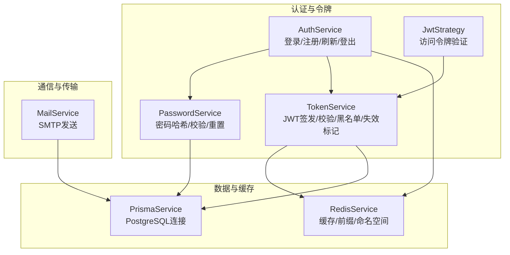
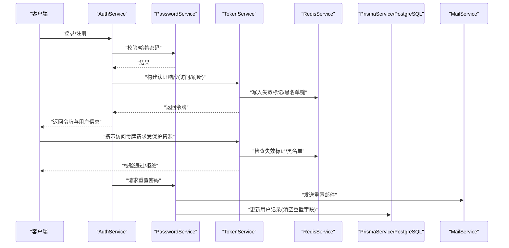
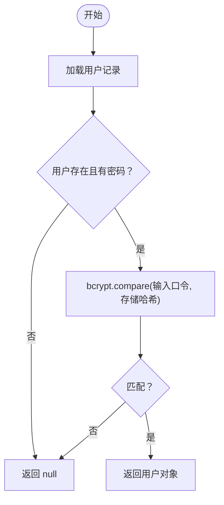
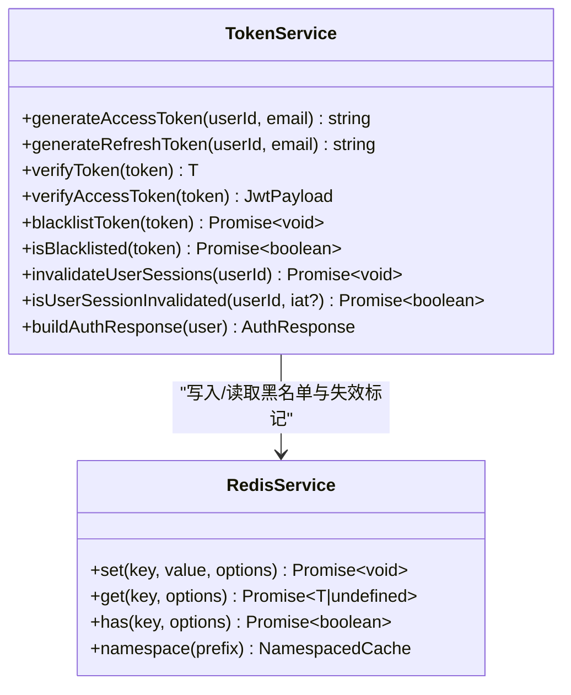
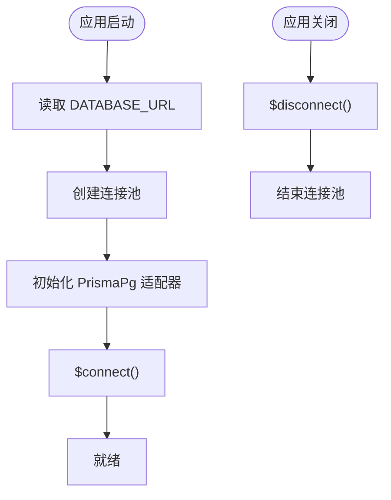
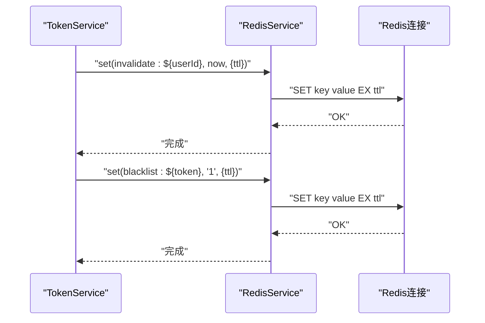
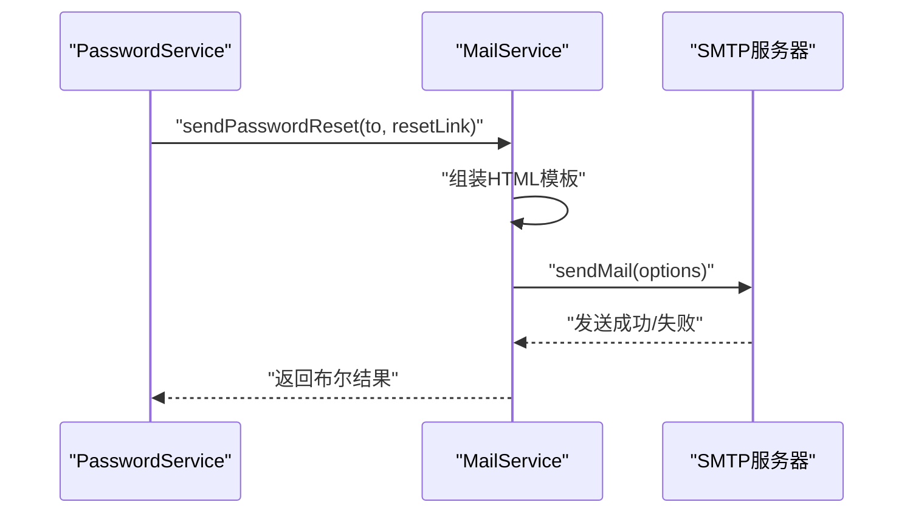
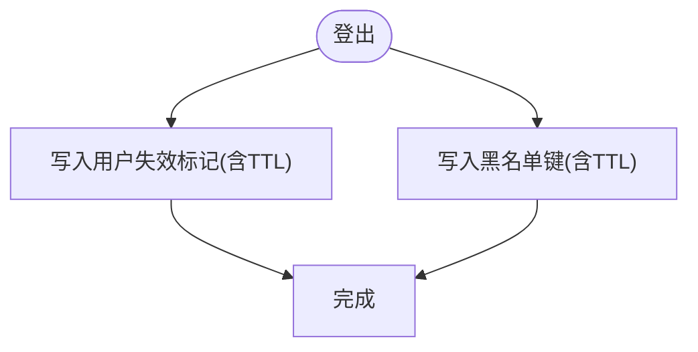
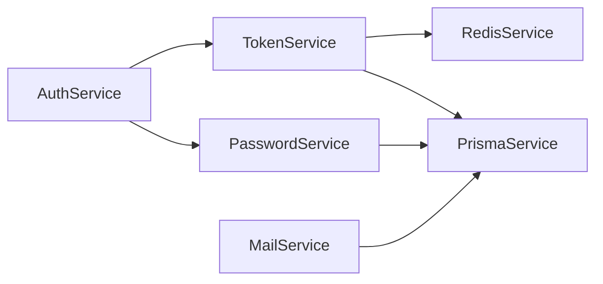

# 数据加密与安全存储

<cite>
**本文引用的文件**
- [apps/backend/src/auth/password.service.ts](file://apps/backend/src/auth/password.service.ts)
- [apps/backend/src/auth/token.service.ts](file://apps/backend/src/auth/token.service.ts)
- [apps/backend/src/auth/auth.service.ts](file://apps/backend/src/auth/auth.service.ts)
- [apps/backend/src/auth/jwt.strategy.ts](file://apps/backend/src/auth/jwt.strategy.ts)
- [apps/backend/src/prisma/prisma.service.ts](file://apps/backend/src/prisma/prisma.service.ts)
- [apps/backend/src/redis/redis.service.ts](file://apps/backend/src/redis/redis.service.ts)
- [apps/backend/src/redis/redis.module.ts](file://apps/backend/src/redis/redis.module.ts)
- [apps/backend/src/mail/mail.service.ts](file://apps/backend/src/mail/mail.service.ts)
- [apps/backend/src/mail/mail.module.ts](file://apps/backend/src/mail/mail.module.ts)
- [apps/backend/src/prisma/prisma.module.ts](file://apps/backend/src/prisma/prisma.module.ts)
- [scripts/security-audit.js](file://scripts/security-audit.js)
- [apps/backend/prisma.config.js](file://apps/backend/prisma.config.js)
- [docker-compose.yml](file://docker-compose.yml)
</cite>

## 目录
1. [简介](#简介)
2. [项目结构](#项目结构)
3. [核心组件](#核心组件)
4. [架构总览](#架构总览)
5. [详细组件分析](#详细组件分析)
6. [依赖关系分析](#依赖关系分析)
7. [性能考量](#性能考量)
8. [故障排查指南](#故障排查指南)
9. [结论](#结论)
10. [附录](#附录)

## 简介
本文件聚焦 Lumina Todo 在后端实现的数据加密与安全存储方案，覆盖密码哈希、令牌管理、数据库与缓存连接安全、邮件传输安全、密钥管理与轮换、数据传输与完整性保障、静态数据访问控制以及数据销毁与清理策略。文档基于仓库现有实现进行系统化梳理，并提供可操作的改进建议与最佳实践。

## 项目结构
后端采用 NestJS 架构，围绕认证与会话、数据库访问、缓存、邮件等模块构建。安全相关的关键模块包括：
- 认证与令牌：PasswordService、TokenService、AuthService、JwtStrategy
- 数据库：PrismaService（PostgreSQL）
- 缓存：RedisService、RedisModule
- 邮件：MailService、MailModule
- 安全审计：security-audit.js
- 部署与环境：docker-compose.yml

图表来源
- [apps/backend/src/auth/password.service.ts:1-100](file://apps/backend/src/auth/password.service.ts#L1-L100)
- [apps/backend/src/auth/token.service.ts:1-187](file://apps/backend/src/auth/token.service.ts#L1-L187)
- [apps/backend/src/auth/auth.service.ts:1-127](file://apps/backend/src/auth/auth.service.ts#L1-L127)
- [apps/backend/src/auth/jwt.strategy.ts:1-68](file://apps/backend/src/auth/jwt.strategy.ts#L1-L68)
- [apps/backend/src/prisma/prisma.service.ts:1-34](file://apps/backend/src/prisma/prisma.service.ts#L1-L34)
- [apps/backend/src/redis/redis.service.ts:1-233](file://apps/backend/src/redis/redis.service.ts#L1-L233)
- [apps/backend/src/mail/mail.service.ts:1-117](file://apps/backend/src/mail/mail.service.ts#L1-L117)

章节来源
- [apps/backend/src/auth/password.service.ts:1-100](file://apps/backend/src/auth/password.service.ts#L1-L100)
- [apps/backend/src/auth/token.service.ts:1-187](file://apps/backend/src/auth/token.service.ts#L1-L187)
- [apps/backend/src/auth/auth.service.ts:1-127](file://apps/backend/src/auth/auth.service.ts#L1-L127)
- [apps/backend/src/auth/jwt.strategy.ts:1-68](file://apps/backend/src/auth/jwt.strategy.ts#L1-L68)
- [apps/backend/src/prisma/prisma.service.ts:1-34](file://apps/backend/src/prisma/prisma.service.ts#L1-L34)
- [apps/backend/src/redis/redis.service.ts:1-233](file://apps/backend/src/redis/redis.service.ts#L1-L233)
- [apps/backend/src/mail/mail.service.ts:1-117](file://apps/backend/src/mail/mail.service.ts#L1-L117)

## 核心组件
- 密码哈希与校验：使用 bcryptjs 对用户口令进行哈希与比较，具备抗彩虹表与成本因子控制能力。
- 令牌体系：短期访问令牌与长期刷新令牌分离，结合 Redis 黑名单与“失效时间戳”标记实现会话撤销与强制登出。
- 数据库连接：通过 PostgreSQL 连接池与 PrismaPg 适配器建立连接；部署时通过 DATABASE_URL 注入连接串。
- 缓存与会话：Redis 提供键前缀、命名空间、TTL 管理与连接生命周期控制；用于黑名单、失效标记与速率限制等。
- 邮件传输：基于 nodemailer 的 SMTP 配置，支持安全端口与可选认证。
- 安全审计：脚本对生产依赖进行漏洞扫描并过滤忽略项。

章节来源
- [apps/backend/src/auth/password.service.ts:25-34](file://apps/backend/src/auth/password.service.ts#L25-L34)
- [apps/backend/src/auth/token.service.ts:78-98](file://apps/backend/src/auth/token.service.ts#L78-L98)
- [apps/backend/src/prisma/prisma.service.ts:10-21](file://apps/backend/src/prisma/prisma.service.ts#L10-L21)
- [apps/backend/src/redis/redis.service.ts:51-74](file://apps/backend/src/redis/redis.service.ts#L51-L74)
- [apps/backend/src/mail/mail.module.ts:16-29](file://apps/backend/src/mail/mail.module.ts#L16-L29)
- [scripts/security-audit.js:1-53](file://scripts/security-audit.js#L1-L53)

## 架构总览
下图展示认证与安全相关模块之间的交互流程，包括密码处理、令牌签发与校验、会话失效与撤销、数据库与缓存交互，以及邮件发送。

图表来源
- [apps/backend/src/auth/auth.service.ts:41-49](file://apps/backend/src/auth/auth.service.ts#L41-L49)
- [apps/backend/src/auth/password.service.ts:39-61](file://apps/backend/src/auth/password.service.ts#L39-L61)
- [apps/backend/src/auth/token.service.ts:175-185](file://apps/backend/src/auth/token.service.ts#L175-L185)
- [apps/backend/src/redis/redis.service.ts:47-53](file://apps/backend/src/redis/redis.service.ts#L47-L53)
- [apps/backend/src/mail/mail.service.ts:91-115](file://apps/backend/src/mail/mail.service.ts#L91-L115)

## 详细组件分析

### 密码哈希与比较（bcrypt）
- 选择与实现
  - 使用 bcryptjs 对明文口令进行哈希，成本因子固定为 10，兼顾安全性与性能。
  - 登录时通过 bcrypt.compare 对比输入口令与存储哈希。
- 安全要点
  - 成本因子可按需提升；在高负载环境评估 CPU 开销。
  - 防止枚举攻击：查询用户不存在时快速返回，不暴露差异。
  - 重置令牌采用 SHA-256 存储，令牌本身通过随机字节生成并以明文传递给用户，建议在传输层启用 HTTPS 并限制有效期。
- 复杂度
  - 哈希与比较均为 O(1) 时间复杂度（受成本因子影响），实际耗时与成本因子成正比。

图表来源
- [apps/backend/src/auth/auth.service.ts:26-39](file://apps/backend/src/auth/auth.service.ts#L26-L39)
- [apps/backend/src/auth/password.service.ts:32-34](file://apps/backend/src/auth/password.service.ts#L32-L34)

章节来源
- [apps/backend/src/auth/password.service.ts:25-34](file://apps/backend/src/auth/password.service.ts#L25-L34)
- [apps/backend/src/auth/auth.service.ts:26-39](file://apps/backend/src/auth/auth.service.ts#L26-L39)

### 令牌管理（JWT + Redis）
- 结构与生命周期
  - 访问令牌：短期（默认 15 分钟），用于日常受保护资源访问。
  - 刷新令牌：长期（默认 7 天），用于换取新的访问令牌。
- 签发与校验
  - 使用不同密钥分别签发访问与刷新令牌；运行于生产环境时要求配置独立刷新密钥。
  - 访问令牌校验严格限定 type 为 access；刷新令牌校验 type 为 refresh。
- 会话撤销与强制登出
  - 登出时将刷新令牌加入 Redis 黑名单，阻止后续刷新。
  - 通过向用户写入“失效时间戳”键，使旧访问令牌在签发时间之后被判定为无效。
- Redis 命名空间与键前缀
  - 使用 CachePrefix.AUTH 作为前缀，隔离鉴权相关键，便于维护与清理。

图表来源
- [apps/backend/src/auth/token.service.ts:15-45](file://apps/backend/src/auth/token.service.ts#L15-L45)
- [apps/backend/src/redis/redis.service.ts:51-74](file://apps/backend/src/redis/redis.service.ts#L51-L74)

章节来源
- [apps/backend/src/auth/token.service.ts:78-185](file://apps/backend/src/auth/token.service.ts#L78-L185)
- [apps/backend/src/redis/redis.service.ts:79-108](file://apps/backend/src/redis/redis.service.ts#L79-L108)

### 数据库连接与安全（PostgreSQL）
- 连接建立
  - 通过 DATABASE_URL 初始化连接池，使用 PrismaPg 适配器。
  - onModuleInit/onModuleDestroy 生命周期中负责连接与资源释放。
- 安全配置
  - 在容器编排中通过环境变量注入 DATABASE_URL，避免硬编码。
  - 建议在生产环境启用 TLS 连接（如使用 sslmode=require），并在网络层面限制访问源。
- 迁移与模式
  - Prisma 配置文件指定 schema 与迁移目录，确保数据库结构变更受控。

图表来源
- [apps/backend/src/prisma/prisma.service.ts:10-21](file://apps/backend/src/prisma/prisma.service.ts#L10-L21)
- [apps/backend/prisma.config.js:13-21](file://apps/backend/prisma.config.js#L13-L21)

章节来源
- [apps/backend/src/prisma/prisma.service.ts:10-32](file://apps/backend/src/prisma/prisma.service.ts#L10-L32)
- [apps/backend/prisma.config.js:13-21](file://apps/backend/prisma.config.js#L13-L21)
- [docker-compose.yml](file://docker-compose.yml#L96)

### 缓存与会话安全（Redis）
- 功能特性
  - 统一缓存接口、键前缀与命名空间、批量删除、TTL 刷新、连接生命周期管理。
  - 支持多 store 场景下的断开连接处理。
- 安全要点
  - 使用 keyPrefix 隔离命名空间，避免键冲突与误删。
  - 在登出/撤销场景下，黑名单与失效标记均通过 TTL 控制生命周期，降低持久化风险。
- 配置
  - 通过 RedisModule 异步工厂读取环境变量，支持主机、端口、密码、DB、前缀与默认 TTL。

图表来源
- [apps/backend/src/auth/token.service.ts:47-53](file://apps/backend/src/auth/token.service.ts#L47-L53)
- [apps/backend/src/auth/token.service.ts:141-149](file://apps/backend/src/auth/token.service.ts#L141-L149)
- [apps/backend/src/redis/redis.service.ts:100-108](file://apps/backend/src/redis/redis.service.ts#L100-L108)

章节来源
- [apps/backend/src/redis/redis.service.ts:51-202](file://apps/backend/src/redis/redis.service.ts#L51-L202)
- [apps/backend/src/redis/redis.module.ts:29-77](file://apps/backend/src/redis/redis.module.ts#L29-L77)

### 邮件传输安全（SMTP）
- 配置与认证
  - 通过 MAIL_HOST、MAIL_PORT、MAIL_USER、MAIL_PASSWORD、MAIL_SECURE 等配置 SMTP 参数。
  - secure=true 时启用加密端口；若提供认证凭据则启用认证。
- 内容与国际化
  - 邮件主题与内容通过 i18n 获取，支持多语言模板。
- 安全建议
  - 始终使用安全端口与加密连接；在容器编排中通过环境变量注入凭据。
  - 对外发送链接包含短时效参数，配合后端校验与过期控制。

图表来源
- [apps/backend/src/auth/password.service.ts:57-61](file://apps/backend/src/auth/password.service.ts#L57-L61)
- [apps/backend/src/mail/mail.service.ts:91-115](file://apps/backend/src/mail/mail.service.ts#L91-L115)
- [apps/backend/src/mail/mail.module.ts:16-29](file://apps/backend/src/mail/mail.module.ts#L16-L29)

章节来源
- [apps/backend/src/mail/mail.service.ts:43-60](file://apps/backend/src/mail/mail.service.ts#L43-L60)
- [apps/backend/src/mail/mail.module.ts:16-30](file://apps/backend/src/mail/mail.module.ts#L16-L30)

### 密钥管理与轮换（最佳实践）
- 当前实现
  - JWT_SECRET 与 JWT_REFRESH_SECRET 通过环境变量注入；生产环境要求刷新密钥必须配置。
- 推荐实践
  - 密钥轮换：新增密钥后先启用新密钥签发，同时兼容旧密钥验证；在过渡期内延长旧密钥有效期；完成后逐步下线旧密钥并清理历史签名。
  - 密钥备份：仅备份密文，不在日志与代码中留存明文；使用硬件/软件安全模块（HSM/SSM）管理密钥。
  - 权限最小化：仅授予必要进程读取密钥的权限；容器编排中通过只读挂载与受限能力集部署。
- 与现有实现的衔接
  - TokenService 已区分访问与刷新密钥，便于分阶段轮换。

章节来源
- [apps/backend/src/auth/token.service.ts:30-44](file://apps/backend/src/auth/token.service.ts#L30-L44)
- [docker-compose.yml:103-104](file://docker-compose.yml#L103-L104)

### 数据传输安全与完整性验证
- 传输层安全
  - 建议在前端与后端之间、后端与数据库/缓存/邮件服务之间启用 TLS；在容器编排中通过只读权限与网络策略限制暴露面。
- 完整性与机密性
  - 对口令与令牌等敏感字段在日志中避免打印明文；对传输中的令牌使用 HTTPS 与安全 Cookie 属性（如 httpOnly、secure、sameSite）。
- 端到端建议
  - 对外部 API 调用增加证书固定与主机名校验；对数据库连接启用 sslmode=require。

[本节为通用指导，无需特定文件引用]

### 静态数据访问控制与权限管理
- 当前实现
  - 认证通过 JwtStrategy 校验访问令牌并检查用户存在性与会话失效状态。
- 建议
  - 在路由层引入细粒度权限守卫，结合角色/资源授权模型；对敏感操作增加二次确认与审计日志。
  - 对静态资源访问增加鉴权与来源校验，避免未授权下载。

章节来源
- [apps/backend/src/auth/jwt.strategy.ts:41-66](file://apps/backend/src/auth/jwt.strategy.ts#L41-L66)

### 数据销毁与清理策略
- 会话清理
  - 登出时将刷新令牌加入黑名单；调用 invalidateUserSessions 为用户写入“失效时间戳”，旧访问令牌无法通过校验。
- 缓存清理
  - RedisService 提供 del/delMany/reset 方法，可用于定向或批量清理；命名空间与前缀有助于精准定位。
- 数据库清理
  - 通过 PrismaService 执行软删除或归档策略；对已删除数据定期清理与索引重建。

图表来源
- [apps/backend/src/auth/token.service.ts:95-101](file://apps/backend/src/auth/token.service.ts#L95-L101)
- [apps/backend/src/auth/token.service.ts:47-53](file://apps/backend/src/auth/token.service.ts#L47-L53)

章节来源
- [apps/backend/src/auth/token.service.ts:95-101](file://apps/backend/src/auth/token.service.ts#L95-L101)
- [apps/backend/src/redis/redis.service.ts:113-132](file://apps/backend/src/redis/redis.service.ts#L113-L132)

## 依赖关系分析
- 组件耦合
  - AuthService 作为门面整合 PasswordService 与 TokenService；JwtStrategy 依赖 TokenService 进行会话状态校验。
  - TokenService 与 RedisService 强耦合，用于黑名单与失效标记；与 PrismaService 交互用于用户查询。
- 外部依赖
  - bcryptjs 用于密码哈希；@nestjs/jwt/passport-jwt 用于令牌；nodemailer 用于邮件；cache-manager-ioredis-yet 用于 Redis。
- 潜在风险
  - 若 Redis 不可用，黑名单与失效标记功能受影响；应具备降级策略（如本地缓存或短时信任窗口）。

图表来源
- [apps/backend/src/auth/auth.service.ts:14-21](file://apps/backend/src/auth/auth.service.ts#L14-L21)
- [apps/backend/src/auth/token.service.ts:22-29](file://apps/backend/src/auth/token.service.ts#L22-L29)
- [apps/backend/src/redis/redis.service.ts:52-56](file://apps/backend/src/redis/redis.service.ts#L52-L56)
- [apps/backend/src/prisma/prisma.service.ts:7-21](file://apps/backend/src/prisma/prisma.service.ts#L7-L21)
- [apps/backend/src/mail/mail.service.ts:22-26](file://apps/backend/src/mail/mail.service.ts#L22-L26)

章节来源
- [apps/backend/src/auth/auth.service.ts:14-21](file://apps/backend/src/auth/auth.service.ts#L14-L21)
- [apps/backend/src/auth/token.service.ts:22-29](file://apps/backend/src/auth/token.service.ts#L22-L29)

## 性能考量
- 密码哈希成本因子
  - 成本因子越高，CPU 开销越大；建议在高并发场景下评估 10 的成本因子是否满足 SLA，必要时调整。
- 令牌校验
  - 访问令牌校验频繁，建议在网关层或中间件中缓存最近一次校验结果（短期有效）以减少重复计算。
- Redis 命中率
  - 合理设置 TTL 与键前缀，避免热键与过期风暴；对黑名单与失效标记使用短 TTL 降低持久化压力。
- 数据库连接池
  - 根据 QPS 调整连接池大小；启用健康检查与重试策略，避免瞬时抖动导致请求失败。

[本节为通用指导，无需特定文件引用]

## 故障排查指南
- 密码重置无效
  - 检查 resetPasswordToken 是否正确写入与过期时间是否生效；确认 FRONTEND_URL 与重置链接拼接正确。
- 令牌校验失败
  - 确认 JWT_SECRET/JWT_REFRESH_SECRET 是否配置；检查访问/刷新令牌类型是否正确；核对 Redis 黑名单与失效标记。
- 登出未生效
  - 确认黑名单写入成功且 TTL 正常；检查 isUserSessionInvalidated 流程是否触发。
- 邮件发送失败
  - 核对 MAIL_HOST/PORT/USER/PASS/SECURE 配置；查看 SMTP 返回错误；确认网络可达性。
- 安全审计失败
  - 查看脚本输出的未忽略漏洞清单，逐项修复或补充忽略项说明。

章节来源
- [apps/backend/src/auth/password.service.ts:66-89](file://apps/backend/src/auth/password.service.ts#L66-L89)
- [apps/backend/src/auth/token.service.ts:103-125](file://apps/backend/src/auth/token.service.ts#L103-L125)
- [apps/backend/src/auth/token.service.ts:166-170](file://apps/backend/src/auth/token.service.ts#L166-L170)
- [apps/backend/src/mail/mail.module.ts:16-30](file://apps/backend/src/mail/mail.module.ts#L16-L30)
- [scripts/security-audit.js:30-49](file://scripts/security-audit.js#L30-L49)

## 结论
Lumina Todo 的后端已在密码哈希、令牌管理、缓存与邮件传输等方面建立了基础安全框架。建议在生产环境中进一步强化传输层加密、密钥轮换与备份、细粒度权限控制、数据销毁策略与安全审计自动化，以形成闭环的安全体系。

## 附录
- 部署与环境变量
  - 后端容器通过 docker-compose 注入 DATABASE_URL、REDIS_*、JWT_SECRET、JWT_REFRESH_SECRET、CORS_ORIGIN、MAIL_* 等关键配置。
- 模块导出与全局化
  - PrismaModule 与 RedisModule 作为全局模块提供服务，便于跨模块复用。

章节来源
- [docker-compose.yml:96-112](file://docker-compose.yml#L96-L112)
- [apps/backend/src/prisma/prisma.module.ts:1-10](file://apps/backend/src/prisma/prisma.module.ts#L1-L10)
- [apps/backend/src/redis/redis.module.ts:26-84](file://apps/backend/src/redis/redis.module.ts#L26-L84)