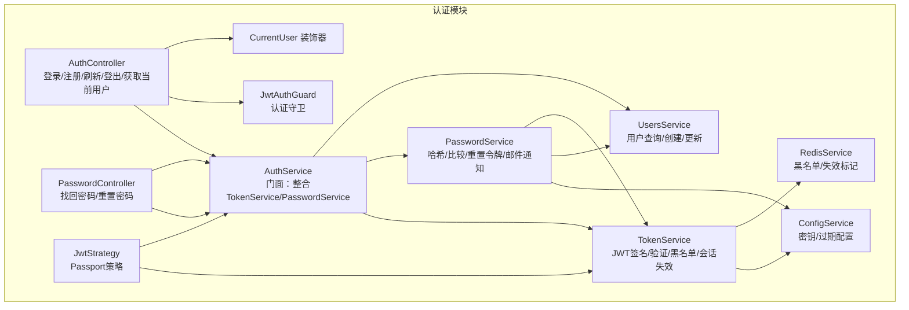
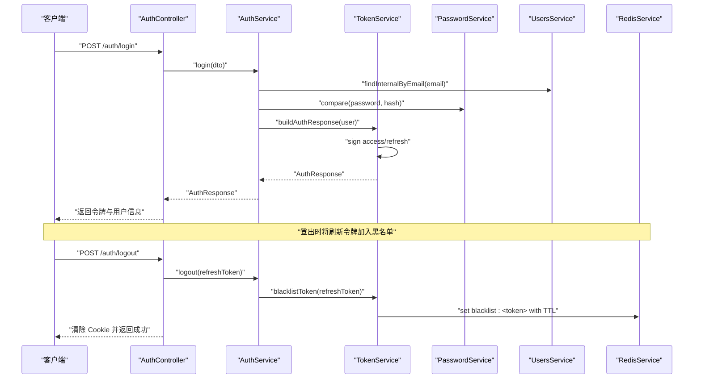
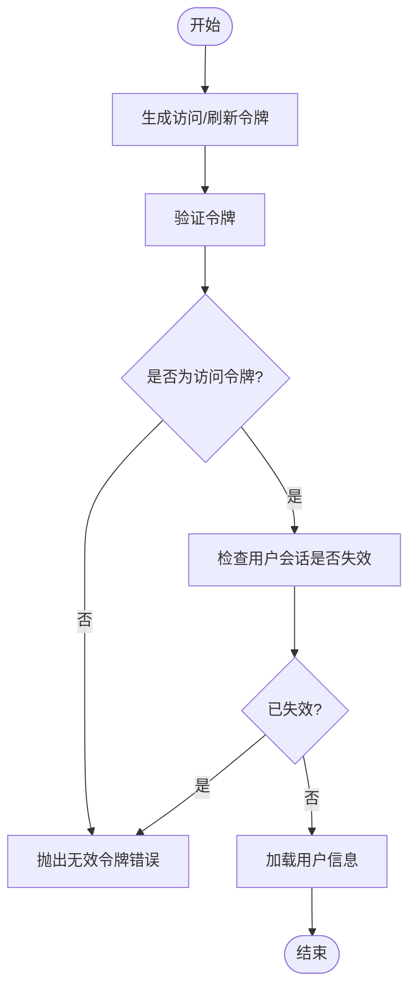
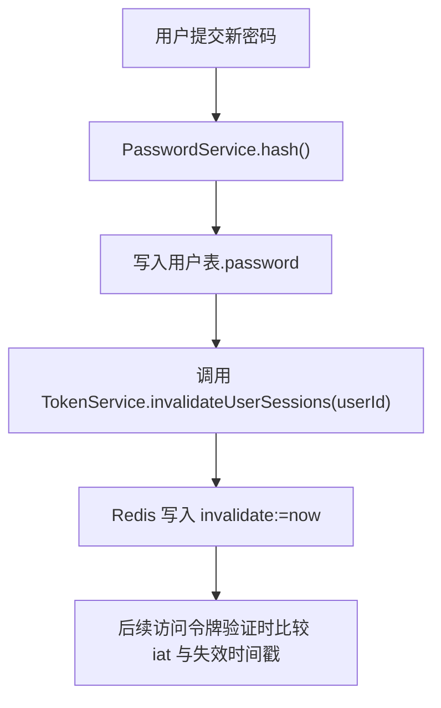
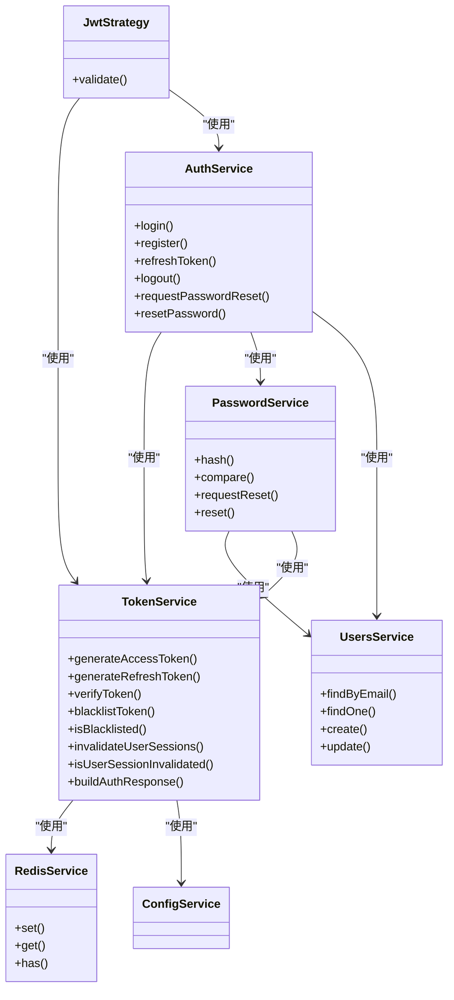

# 认证与授权

<cite>
**本文引用的文件**
- [apps/backend/src/auth/auth.service.ts](file://apps/backend/src/auth/auth.service.ts)
- [apps/backend/src/auth/token.service.ts](file://apps/backend/src/auth/token.service.ts)
- [apps/backend/src/auth/password.service.ts](file://apps/backend/src/auth/password.service.ts)
- [apps/backend/src/auth/jwt.strategy.ts](file://apps/backend/src/auth/jwt.strategy.ts)
- [apps/backend/src/auth/jwt-auth.guard.ts](file://apps/backend/src/auth/jwt-auth.guard.ts)
- [apps/backend/src/auth/current-user.decorator.ts](file://apps/backend/src/auth/current-user.decorator.ts)
- [apps/backend/src/auth/auth.controller.ts](file://apps/backend/src/auth/auth.controller.ts)
- [apps/backend/src/auth/auth.dto.ts](file://apps/backend/src/auth/auth.dto.ts)
- [apps/backend/src/auth/password.controller.ts](file://apps/backend/src/auth/password.controller.ts)
- [apps/backend/src/users/users.service.ts](file://apps/backend/src/users/users.service.ts)
- [apps/backend/src/redis/redis.service.ts](file://apps/backend/src/redis/redis.service.ts)
- [apps/backend/src/app.module.ts](file://apps/backend/src/app.module.ts)
- [apps/backend/tests/auth/auth.service.spec.ts](file://apps/backend/tests/auth/auth.service.spec.ts)
- [apps/backend/tests/auth/token.service.spec.ts](file://apps/backend/tests/auth/token.service.spec.ts)
</cite>

## 目录
1. [简介](#简介)
2. [项目结构](#项目结构)
3. [核心组件](#核心组件)
4. [架构总览](#架构总览)
5. [详细组件分析](#详细组件分析)
6. [依赖关系分析](#依赖关系分析)
7. [性能考量](#性能考量)
8. [故障排除指南](#故障排除指南)
9. [结论](#结论)
10. [附录](#附录)

## 简介
本文件面向 Lumina Todo 后端认证与授权系统，围绕以下主题进行深入说明：
- JWT 令牌生成、验证与刷新机制，含过期处理与安全存储策略
- 基于角色的访问控制（RBAC）实现思路与装饰器使用
- 密码哈希算法选择与实现（bcrypt、盐值生成与安全存储）
- 会话管理机制（多设备登录控制、强制登出）
- 用户状态管理与当前用户解析
- 认证中间件工作原理与自定义认证策略
- 第三方认证集成的安全考虑与最佳实践
- 认证相关错误处理与安全日志记录

## 项目结构
认证子系统主要由以下模块组成：
- 控制器层：负责暴露认证 API（登录、注册、刷新、登出、获取当前用户、找回/重置密码）
- 服务层：封装认证业务逻辑（AuthService）、令牌管理（TokenService）、密码管理（PasswordService）、用户查询（UsersService）
- 中间件与守卫：Passport JWT 策略与 JwtAuthGuard
- 缓存与配置：Redis 用于黑名单与会话失效标记，ConfigService 提供密钥与过期配置
- 测试：对 AuthService 与 TokenService 的行为进行单元测试覆盖

图表来源
- [apps/backend/src/auth/auth.controller.ts:1-82](file://apps/backend/src/auth/auth.controller.ts#L1-L82)
- [apps/backend/src/auth/password.controller.ts:1-39](file://apps/backend/src/auth/password.controller.ts#L1-L39)
- [apps/backend/src/auth/auth.service.ts:1-127](file://apps/backend/src/auth/auth.service.ts#L1-L127)
- [apps/backend/src/auth/token.service.ts:1-187](file://apps/backend/src/auth/token.service.ts#L1-L187)
- [apps/backend/src/auth/password.service.ts:1-100](file://apps/backend/src/auth/password.service.ts#L1-L100)
- [apps/backend/src/users/users.service.ts:1-110](file://apps/backend/src/users/users.service.ts#L1-L110)
- [apps/backend/src/auth/jwt.strategy.ts:1-68](file://apps/backend/src/auth/jwt.strategy.ts#L1-L68)
- [apps/backend/src/auth/jwt-auth.guard.ts:1-10](file://apps/backend/src/auth/jwt-auth.guard.ts#L1-L10)
- [apps/backend/src/auth/current-user.decorator.ts:1-19](file://apps/backend/src/auth/current-user.decorator.ts#L1-L19)
- [apps/backend/src/redis/redis.service.ts:1-233](file://apps/backend/src/redis/redis.service.ts#L1-L233)
- [apps/backend/src/app.module.ts:1-175](file://apps/backend/src/app.module.ts#L1-L175)

章节来源
- [apps/backend/src/auth/auth.controller.ts:1-82](file://apps/backend/src/auth/auth.controller.ts#L1-L82)
- [apps/backend/src/auth/password.controller.ts:1-39](file://apps/backend/src/auth/password.controller.ts#L1-L39)
- [apps/backend/src/auth/auth.service.ts:1-127](file://apps/backend/src/auth/auth.service.ts#L1-L127)
- [apps/backend/src/auth/token.service.ts:1-187](file://apps/backend/src/auth/token.service.ts#L1-L187)
- [apps/backend/src/auth/password.service.ts:1-100](file://apps/backend/src/auth/password.service.ts#L1-L100)
- [apps/backend/src/users/users.service.ts:1-110](file://apps/backend/src/users/users.service.ts#L1-L110)
- [apps/backend/src/auth/jwt.strategy.ts:1-68](file://apps/backend/src/auth/jwt.strategy.ts#L1-L68)
- [apps/backend/src/auth/jwt-auth.guard.ts:1-10](file://apps/backend/src/auth/jwt-auth.guard.ts#L1-L10)
- [apps/backend/src/auth/current-user.decorator.ts:1-19](file://apps/backend/src/auth/current-user.decorator.ts#L1-L19)
- [apps/backend/src/redis/redis.service.ts:1-233](file://apps/backend/src/redis/redis.service.ts#L1-L233)
- [apps/backend/src/app.module.ts:1-175](file://apps/backend/src/app.module.ts#L1-L175)

## 核心组件
- AuthService：认证门面，协调 UsersService、TokenService、PasswordService，提供登录、注册、刷新、登出、密码重置等统一入口
- TokenService：JWT 签发与验证、访问令牌与刷新令牌区分、黑名单与会话失效标记、构建完整认证响应
- PasswordService：密码哈希/比较、重置令牌生成与校验、重置后强制失效旧会话
- UsersService：用户查询、创建、更新（含密码字段），内部查询用于认证流程
- JwtStrategy：Passport 策略，校验访问令牌、用户存在性、会话失效标记
- JwtAuthGuard：基于 JWT 的认证守卫，保护受控路由
- CurrentUser 装饰器：从请求上下文提取当前用户，支持按属性取值
- RedisService：黑名单与会话失效标记的持久化存储，提供命名空间与 TTL 管理
- AuthController/PasswordController：对外暴露认证 API，配合 DTO 与节流策略

章节来源
- [apps/backend/src/auth/auth.service.ts:1-127](file://apps/backend/src/auth/auth.service.ts#L1-L127)
- [apps/backend/src/auth/token.service.ts:1-187](file://apps/backend/src/auth/token.service.ts#L1-L187)
- [apps/backend/src/auth/password.service.ts:1-100](file://apps/backend/src/auth/password.service.ts#L1-L100)
- [apps/backend/src/users/users.service.ts:1-110](file://apps/backend/src/users/users.service.ts#L1-L110)
- [apps/backend/src/auth/jwt.strategy.ts:1-68](file://apps/backend/src/auth/jwt.strategy.ts#L1-L68)
- [apps/backend/src/auth/jwt-auth.guard.ts:1-10](file://apps/backend/src/auth/jwt-auth.guard.ts#L1-L10)
- [apps/backend/src/auth/current-user.decorator.ts:1-19](file://apps/backend/src/auth/current-user.decorator.ts#L1-L19)
- [apps/backend/src/redis/redis.service.ts:1-233](file://apps/backend/src/redis/redis.service.ts#L1-L233)
- [apps/backend/src/auth/auth.controller.ts:1-82](file://apps/backend/src/auth/auth.controller.ts#L1-L82)
- [apps/backend/src/auth/password.controller.ts:1-39](file://apps/backend/src/auth/password.controller.ts#L1-L39)

## 架构总览
认证系统采用“控制器-服务-策略-守卫-缓存”的分层设计，结合 JWT 与 Redis 实现安全的短期访问令牌与长期刷新令牌机制。

图表来源
- [apps/backend/src/auth/auth.controller.ts:1-82](file://apps/backend/src/auth/auth.controller.ts#L1-L82)
- [apps/backend/src/auth/auth.service.ts:1-127](file://apps/backend/src/auth/auth.service.ts#L1-L127)
- [apps/backend/src/auth/token.service.ts:1-187](file://apps/backend/src/auth/token.service.ts#L1-L187)
- [apps/backend/src/auth/password.service.ts:1-100](file://apps/backend/src/auth/password.service.ts#L1-L100)
- [apps/backend/src/users/users.service.ts:1-110](file://apps/backend/src/users/users.service.ts#L1-L110)
- [apps/backend/src/redis/redis.service.ts:1-233](file://apps/backend/src/redis/redis.service.ts#L1-L233)

## 详细组件分析

### JWT 令牌生成、验证与刷新机制
- 令牌类型与生命周期
  - 访问令牌：短期有效，用于日常 API 访问
  - 刷新令牌：长期有效，仅用于换取新的访问令牌
- 签发与验证
  - 使用不同密钥分别签发访问与刷新令牌，提升安全性
  - 验证时优先尝试刷新密钥，再尝试访问密钥；若均失败则视为过期
- 黑名单与过期处理
  - 登出时将刷新令牌加入黑名单，利用剩余有效期作为 TTL 存入 Redis
  - 刷新流程先检查黑名单，再验证令牌类型与用户会话失效标记
- 会话失效
  - 通过 Redis 记录用户会话失效时间戳，访问令牌验证时比较签发时间，确保旧令牌不可用

图表来源
- [apps/backend/src/auth/token.service.ts:1-187](file://apps/backend/src/auth/token.service.ts#L1-L187)
- [apps/backend/src/auth/jwt.strategy.ts:1-68](file://apps/backend/src/auth/jwt.strategy.ts#L1-L68)

章节来源
- [apps/backend/src/auth/token.service.ts:1-187](file://apps/backend/src/auth/token.service.ts#L1-L187)
- [apps/backend/src/auth/jwt.strategy.ts:1-68](file://apps/backend/src/auth/jwt.strategy.ts#L1-L68)
- [apps/backend/tests/auth/token.service.spec.ts:1-199](file://apps/backend/tests/auth/token.service.spec.ts#L1-L199)

### 基于角色的访问控制（RBAC）与装饰器
- 当前实现要点
  - 使用 JwtAuthGuard 对路由进行认证保护
  - 使用 CurrentUser 装饰器从请求中解析当前用户对象或其属性
- RBAC 扩展建议
  - 在用户模型中引入角色/权限字段
  - 自定义守卫（如 RoleGuard）读取 CurrentUser 并比对所需角色/权限
  - 结合装饰器（如 @Roles('admin')）声明式地保护路由
- 注意
  - 本仓库未提供内置的 RBAC 守卫与角色装饰器，需按上述思路扩展

章节来源
- [apps/backend/src/auth/jwt-auth.guard.ts:1-10](file://apps/backend/src/auth/jwt-auth.guard.ts#L1-L10)
- [apps/backend/src/auth/current-user.decorator.ts:1-19](file://apps/backend/src/auth/current-user.decorator.ts#L1-L19)

### 密码哈希算法与安全存储
- 算法选择
  - bcrypt（bcryptjs）：业界标准，具备成本因子与盐值，抗彩虹表与暴力破解
- 实现细节
  - 注册与创建用户时使用固定成本因子进行哈希
  - 登录时使用 bcrypt.compare 对比明文与存储的哈希
  - 密码重置流程：生成一次性随机令牌，服务端仅保存哈希；重置成功后调用会话失效接口，使旧会话立即失效
- 安全存储
  - 用户表仅存储哈希后的密码，不保存明文
  - 重置令牌以哈希形式存储，避免泄露真实令牌

图表来源
- [apps/backend/src/auth/password.service.ts:1-100](file://apps/backend/src/auth/password.service.ts#L1-L100)
- [apps/backend/src/auth/token.service.ts:1-187](file://apps/backend/src/auth/token.service.ts#L1-L187)
- [apps/backend/src/users/users.service.ts:1-110](file://apps/backend/src/users/users.service.ts#L1-L110)

章节来源
- [apps/backend/src/auth/password.service.ts:1-100](file://apps/backend/src/auth/password.service.ts#L1-L100)
- [apps/backend/src/users/users.service.ts:1-110](file://apps/backend/src/users/users.service.ts#L1-L110)

### 会话管理：多设备登录控制与强制登出
- 多设备登录
  - 通过刷新令牌实现多设备同时在线；访问令牌短期有效，降低泄露风险
- 强制登出
  - 登出时将刷新令牌加入黑名单，结合 Redis TTL 实现过期自动清理
  - 密码重置后调用会话失效接口，使用户所有旧会话立即失效
- 会话失效标记
  - Redis 中以键前缀区分命名空间，便于集中管理与清理

章节来源
- [apps/backend/src/auth/auth.controller.ts:1-82](file://apps/backend/src/auth/auth.controller.ts#L1-L82)
- [apps/backend/src/auth/password.service.ts:1-100](file://apps/backend/src/auth/password.service.ts#L1-L100)
- [apps/backend/src/auth/token.service.ts:1-187](file://apps/backend/src/auth/token.service.ts#L1-L187)
- [apps/backend/src/redis/redis.service.ts:1-233](file://apps/backend/src/redis/redis.service.ts#L1-L233)

### 用户状态管理与当前用户解析
- CurrentUser 装饰器
  - 从请求上下文中提取 user 或 raw.user，支持按属性取值
- JwtStrategy
  - 在认证流程中解析访问令牌，校验用户存在性与会话失效标记，最终将用户注入到请求对象
- 保护路由
  - 使用 JwtAuthGuard 保护受控路由，确保只有通过认证的请求可访问

章节来源
- [apps/backend/src/auth/current-user.decorator.ts:1-19](file://apps/backend/src/auth/current-user.decorator.ts#L1-L19)
- [apps/backend/src/auth/jwt.strategy.ts:1-68](file://apps/backend/src/auth/jwt.strategy.ts#L1-L68)
- [apps/backend/src/auth/jwt-auth.guard.ts:1-10](file://apps/backend/src/auth/jwt-auth.guard.ts#L1-L10)

### 认证中间件与自定义策略
- Passport 策略
  - JwtStrategy 统一从 Authorization 头解析 Bearer 令牌，严格校验令牌类型与用户有效性
- 守卫
  - JwtAuthGuard 基于策略实现认证守卫，可直接用于路由保护
- 自定义策略
  - 可新增策略（如刷新令牌策略、多因素策略）并配合自定义守卫使用

章节来源
- [apps/backend/src/auth/jwt.strategy.ts:1-68](file://apps/backend/src/auth/jwt.strategy.ts#L1-L68)
- [apps/backend/src/auth/jwt-auth.guard.ts:1-10](file://apps/backend/src/auth/jwt-auth.guard.ts#L1-L10)

### 第三方认证集成的安全考虑与最佳实践
- 安全考虑
  - 使用独立的第三方登录密钥与本地账户密钥分离
  - 对第三方回调参数进行严格校验与白名单过滤
  - 采用一次性临时令牌与会话绑定，避免长期持久化敏感信息
- 最佳实践
  - 登录成功后立即生成短期访问令牌与长期刷新令牌
  - 强制要求用户完成二次验证（如 MFA）后再授予管理员权限
  - 对第三方登录失败与异常进行审计与告警

（本节为概念性指导，不直接分析具体源码）

### 认证相关的错误处理与安全日志记录
- 错误处理
  - 认证失败统一抛出 UnauthorizedException，避免内部异常泄露
  - 刷新令牌流程对黑名单、令牌类型、用户存在性与会话失效进行多重校验
- 安全日志
  - 全局日志模块使用 Pino，按状态码动态调整日志级别
  - 自定义成功/错误消息格式，便于审计与排障
  - Redis 操作失败被吞并以保证登出接口可用，但日志记录会捕获异常

章节来源
- [apps/backend/src/auth/auth.service.ts:1-127](file://apps/backend/src/auth/auth.service.ts#L1-L127)
- [apps/backend/src/app.module.ts:1-175](file://apps/backend/src/app.module.ts#L1-L175)
- [apps/backend/src/redis/redis.service.ts:1-233](file://apps/backend/src/redis/redis.service.ts#L1-L233)

## 依赖关系分析
- 组件耦合
  - AuthService 作为门面，聚合 TokenService、PasswordService、UsersService
  - JwtStrategy 依赖 TokenService 与 AuthService，用于访问令牌验证与用户注入
  - TokenService 依赖 ConfigService 与 RedisService，负责密钥与黑名单/失效标记
  - PasswordService 依赖 UsersService、MailService、TokenService，负责密码与会话失效
- 外部依赖
  - NestJS JwtService、ConfigService、CacheManager（Redis）
  - bcryptjs、crypto（Node 内置）
  - Passport、passport-jwt

图表来源
- [apps/backend/src/auth/auth.service.ts:1-127](file://apps/backend/src/auth/auth.service.ts#L1-L127)
- [apps/backend/src/auth/token.service.ts:1-187](file://apps/backend/src/auth/token.service.ts#L1-L187)
- [apps/backend/src/auth/password.service.ts:1-100](file://apps/backend/src/auth/password.service.ts#L1-L100)
- [apps/backend/src/users/users.service.ts:1-110](file://apps/backend/src/users/users.service.ts#L1-L110)
- [apps/backend/src/auth/jwt.strategy.ts:1-68](file://apps/backend/src/auth/jwt.strategy.ts#L1-L68)
- [apps/backend/src/redis/redis.service.ts:1-233](file://apps/backend/src/redis/redis.service.ts#L1-L233)
- [apps/backend/src/app.module.ts:1-175](file://apps/backend/src/app.module.ts#L1-L175)

章节来源
- [apps/backend/src/auth/auth.service.ts:1-127](file://apps/backend/src/auth/auth.service.ts#L1-L127)
- [apps/backend/src/auth/token.service.ts:1-187](file://apps/backend/src/auth/token.service.ts#L1-L187)
- [apps/backend/src/auth/password.service.ts:1-100](file://apps/backend/src/auth/password.service.ts#L1-L100)
- [apps/backend/src/users/users.service.ts:1-110](file://apps/backend/src/users/users.service.ts#L1-L110)
- [apps/backend/src/auth/jwt.strategy.ts:1-68](file://apps/backend/src/auth/jwt.strategy.ts#L1-L68)
- [apps/backend/src/redis/redis.service.ts:1-233](file://apps/backend/src/redis/redis.service.ts#L1-L233)
- [apps/backend/src/app.module.ts:1-175](file://apps/backend/src/app.module.ts#L1-L175)

## 性能考量
- 令牌验证
  - 访问令牌短周期，减少数据库查询压力；刷新令牌长周期，降低频繁签发开销
- 缓存与黑名单
  - Redis 黑名单与失效标记使用 TTL，避免长期驻留内存
  - 命名空间前缀隔离，便于维护与清理
- 速率限制
  - 全局 Throttler 防暴力破解，针对不同端点设置不同阈值
- 日志
  - Pino 异步日志，生产环境 JSON 输出，降低 I/O 影响

（本节提供通用指导，不直接分析具体源码）

## 故障排除指南
- 常见问题与定位
  - 令牌过期/无效：检查访问令牌是否为“access”类型，确认用户会话未被标记失效
  - 刷新失败：确认刷新令牌未在黑名单中，且用户存在且未被强制失效
  - 登出无效：确认 Redis 可用且黑名单写入成功；检查 Cookie 清除逻辑
  - 密码重置无效：确认重置令牌未过期且未被篡改；重置后应立即失效旧会话
- 单元测试参考
  - AuthService 与 TokenService 的行为覆盖了典型场景，可据此快速定位问题边界

章节来源
- [apps/backend/tests/auth/auth.service.spec.ts:1-177](file://apps/backend/tests/auth/auth.service.spec.ts#L1-L177)
- [apps/backend/tests/auth/token.service.spec.ts:1-199](file://apps/backend/tests/auth/token.service.spec.ts#L1-L199)

## 结论
Lumina Todo 的认证与授权体系以 JWT 为核心，结合 Redis 实现短期访问令牌与长期刷新令牌的安全管理；通过 bcrypt 保障密码安全，通过会话失效与黑名单机制实现强制登出与多设备控制。当前实现聚焦于基础认证流程，RBAC 与第三方认证可按需扩展。整体架构清晰、职责分明，具备良好的可维护性与扩展性。

## 附录
- 关键配置项（示例）
  - JWT_SECRET、JWT_REFRESH_SECRET（生产环境必须配置）
  - JWT_ACCESS_EXPIRES_IN、JWT_REFRESH_EXPIRES_IN
  - RESET_PASSWORD_EXPIRES_IN、FRONTEND_URL
  - THROTTLE_*（速率限制）
- 建议
  - 引入 RBAC 守卫与角色装饰器
  - 增加审计日志与异常监控
  - 对第三方登录增加 MFA 与 IP 白名单策略