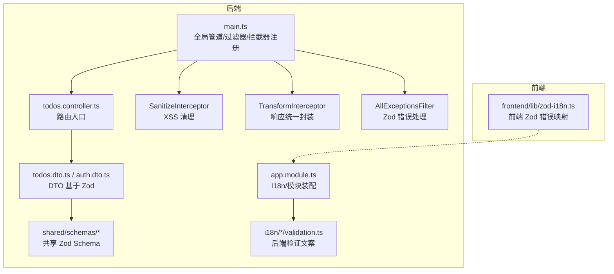
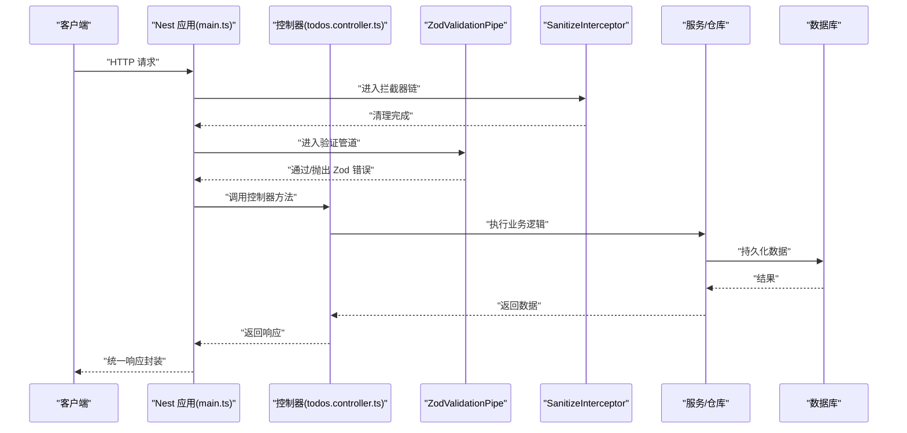
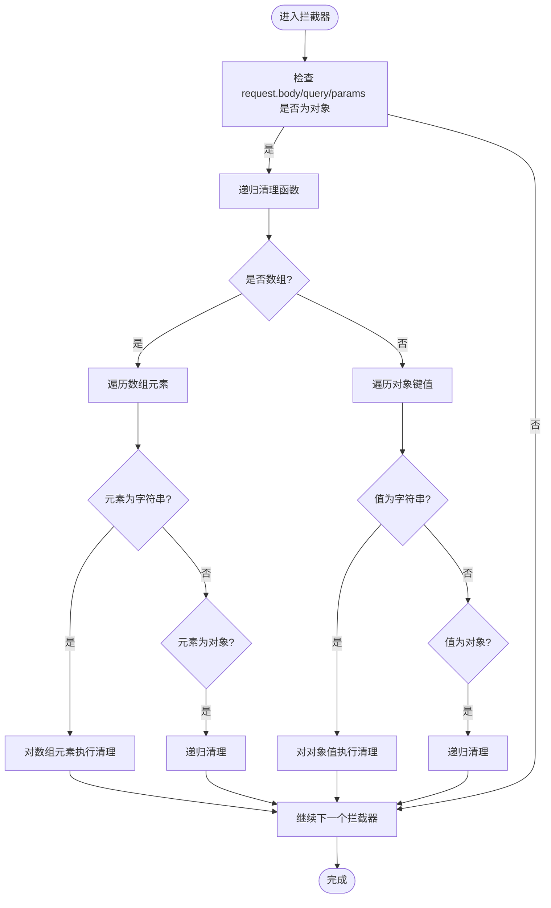
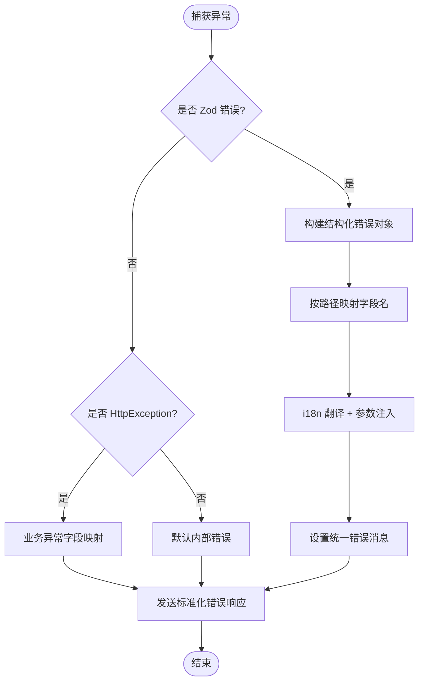
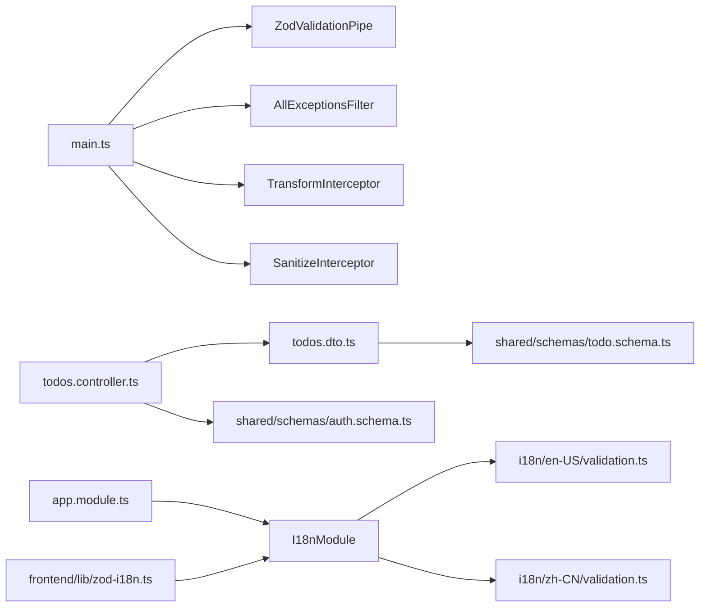

# 输入验证与数据清理

<cite>
**本文引用的文件**
- [apps/backend/src/main.ts](file://apps/backend/src/main.ts)
- [apps/backend/src/app.module.ts](file://apps/backend/src/app.module.ts)
- [apps/backend/src/common/interceptors/sanitize.interceptor.ts](file://apps/backend/src/common/interceptors/sanitize.interceptor.ts)
- [apps/backend/src/common/interceptors/transform.interceptor.ts](file://apps/backend/src/common/interceptors/transform.interceptor.ts)
- [apps/backend/src/common/filters/all-exceptions.filter.ts](file://apps/backend/src/common/filters/all-exceptions.filter.ts)
- [apps/backend/src/todos/todos.controller.ts](file://apps/backend/src/todos/todos.controller.ts)
- [apps/backend/src/todos/todos.dto.ts](file://apps/backend/src/todos/todos.dto.ts)
- [apps/backend/src/auth/auth.dto.ts](file://apps/backend/src/auth/auth.dto.ts)
- [packages/shared/src/schemas/auth.schema.ts](file://packages/shared/src/schemas/auth.schema.ts)
- [packages/shared/src/schemas/todo.schema.ts](file://packages/shared/src/schemas/todo.schema.ts)
- [packages/shared/src/schemas/i18n-keys.ts](file://packages/shared/src/schemas/i18n-keys.ts)
- [apps/backend/src/i18n/en-US/validation.ts](file://apps/backend/src/i18n/en-US/validation.ts)
- [apps/backend/src/i18n/zh-CN/validation.ts](file://apps/backend/src/i18n/zh-CN/validation.ts)
- [apps/frontend/src/lib/zod-i18n.ts](file://apps/frontend/src/lib/zod-i18n.ts)
</cite>

## 目录
1. [简介](#简介)
2. [项目结构](#项目结构)
3. [核心组件](#核心组件)
4. [架构总览](#架构总览)
5. [详细组件分析](#详细组件分析)
6. [依赖关系分析](#依赖关系分析)
7. [性能考量](#性能考量)
8. [故障排查指南](#故障排查指南)
9. [结论](#结论)
10. [附录](#附录)

## 简介
本文件系统性阐述 Lumina Todo 的输入验证与数据清理机制，覆盖以下主题：
- 基于 Zod 的验证器使用与自定义规则
- 数据清理拦截器（HTML/XSS 过滤）工作原理
- 表单验证完整流程（从请求到数据库存储）
- 常见场景示例（邮箱、密码、字符串长度等）
- 验证错误的国际化与用户友好消息生成
- 批量与嵌套对象验证策略
- 性能优化与缓存策略
- 自定义验证器开发指南与最佳实践
- 验证规则版本管理与向后兼容

## 项目结构
围绕验证与清理的关键目录与文件如下图所示：

图表来源
- [apps/backend/src/main.ts:159-170](file://apps/backend/src/main.ts#L159-L170)
- [apps/backend/src/app.module.ts:139-148](file://apps/backend/src/app.module.ts#L139-L148)
- [apps/backend/src/todos/todos.controller.ts:30-38](file://apps/backend/src/todos/todos.controller.ts#L30-L38)
- [apps/backend/src/todos/todos.dto.ts:1-5](file://apps/backend/src/todos/todos.dto.ts#L1-L5)
- [apps/backend/src/auth/auth.dto.ts:1-41](file://apps/backend/src/auth/auth.dto.ts#L1-L41)
- [packages/shared/src/schemas/todo.schema.ts:1-75](file://packages/shared/src/schemas/todo.schema.ts#L1-L75)
- [packages/shared/src/schemas/auth.schema.ts:1-121](file://packages/shared/src/schemas/auth.schema.ts#L1-L121)
- [apps/backend/src/common/interceptors/sanitize.interceptor.ts:10-36](file://apps/backend/src/common/interceptors/sanitize.interceptor.ts#L10-L36)
- [apps/backend/src/common/interceptors/transform.interceptor.ts:18-29](file://apps/backend/src/common/interceptors/transform.interceptor.ts#L18-L29)
- [apps/backend/src/common/filters/all-exceptions.filter.ts:52-86](file://apps/backend/src/common/filters/all-exceptions.filter.ts#L52-L86)
- [apps/backend/src/i18n/en-US/validation.ts:1-12](file://apps/backend/src/i18n/en-US/validation.ts#L1-L12)
- [apps/backend/src/i18n/zh-CN/validation.ts:1-12](file://apps/backend/src/i18n/zh-CN/validation.ts#L1-L12)
- [apps/frontend/src/lib/zod-i18n.ts:18-95](file://apps/frontend/src/lib/zod-i18n.ts#L18-L95)

章节来源
- [apps/backend/src/main.ts:159-170](file://apps/backend/src/main.ts#L159-L170)
- [apps/backend/src/app.module.ts:139-148](file://apps/backend/src/app.module.ts#L139-L148)

## 核心组件
- 全局 Zod 验证管道：统一替换 class-validator，自动校验 DTO 并生成 OpenAPI 文档
- XSS 清理拦截器：对请求体、查询参数、路径参数进行原地递归 HTML 过滤
- 响应转换拦截器：统一包装成功响应为 { success, data, timestamp }
- 全局异常过滤器：专门处理 Zod 验证错误，提取字段路径与参数，结合 i18n 输出用户友好消息
- 共享 Schema：前后端复用的 Zod 规则，保证一致性与可维护性
- 国际化验证文案：后端与前端分别提供英文与中文验证消息

章节来源
- [apps/backend/src/main.ts:159-170](file://apps/backend/src/main.ts#L159-L170)
- [apps/backend/src/common/interceptors/sanitize.interceptor.ts:10-36](file://apps/backend/src/common/interceptors/sanitize.interceptor.ts#L10-L36)
- [apps/backend/src/common/interceptors/transform.interceptor.ts:18-29](file://apps/backend/src/common/interceptors/transform.interceptor.ts#L18-L29)
- [apps/backend/src/common/filters/all-exceptions.filter.ts:52-86](file://apps/backend/src/common/filters/all-exceptions.filter.ts#L52-L86)
- [packages/shared/src/schemas/auth.schema.ts:1-121](file://packages/shared/src/schemas/auth.schema.ts#L1-L121)
- [apps/backend/src/i18n/en-US/validation.ts:1-12](file://apps/backend/src/i18n/en-US/validation.ts#L1-L12)
- [apps/backend/src/i18n/zh-CN/validation.ts:1-12](file://apps/backend/src/i18n/zh-CN/validation.ts#L1-L12)
- [apps/frontend/src/lib/zod-i18n.ts:18-95](file://apps/frontend/src/lib/zod-i18n.ts#L18-L95)

## 架构总览
下图展示从请求进入至数据库写入的整体流程，重点标注验证与清理环节。

图表来源
- [apps/backend/src/main.ts:159-170](file://apps/backend/src/main.ts#L159-L170)
- [apps/backend/src/todos/todos.controller.ts:30-38](file://apps/backend/src/todos/todos.controller.ts#L30-L38)
- [apps/backend/src/common/interceptors/sanitize.interceptor.ts:17-36](file://apps/backend/src/common/interceptors/sanitize.interceptor.ts#L17-L36)

## 详细组件分析

### Zod 验证器与共享 Schema
- 后端通过 createZodDto 包装共享 Schema，生成强类型的 DTO，同时自动生成 Swagger 文档
- 共享 Schema 定义了邮箱、密码、URL、日期、枚举、数组与嵌套对象等复杂结构
- 前端同样引入共享 Schema，保证 UI 与后端规则一致

关键要点
- 邮箱与密码规则集中定义，便于统一维护
- 字符串长度、数值范围、必填项、类型约束等均在 Schema 中声明
- 嵌套对象与数组通过 extend 与 array 组合，支持批量同步等复杂场景

章节来源
- [apps/backend/src/todos/todos.dto.ts:1-5](file://apps/backend/src/todos/todos.dto.ts#L1-L5)
- [apps/backend/src/auth/auth.dto.ts:1-41](file://apps/backend/src/auth/auth.dto.ts#L1-L41)
- [packages/shared/src/schemas/auth.schema.ts:1-121](file://packages/shared/src/schemas/auth.schema.ts#L1-L121)
- [packages/shared/src/schemas/todo.schema.ts:1-75](file://packages/shared/src/schemas/todo.schema.ts#L1-L75)
- [packages/shared/src/schemas/i18n-keys.ts:1-13](file://packages/shared/src/schemas/i18n-keys.ts#L1-L13)

### 数据清理拦截器（XSS 清理）
- 对请求体、查询参数、路径参数进行原地递归清理
- 通过 sanitize-html 禁止任何 HTML 标签，避免 XSS
- 递归遍历对象树，仅对字符串值执行清理

图表来源
- [apps/backend/src/common/interceptors/sanitize.interceptor.ts:17-62](file://apps/backend/src/common/interceptors/sanitize.interceptor.ts#L17-L62)

章节来源
- [apps/backend/src/common/interceptors/sanitize.interceptor.ts:10-62](file://apps/backend/src/common/interceptors/sanitize.interceptor.ts#L10-L62)

### 响应统一转换拦截器
- 将成功响应统一包装为 { success: true, data, timestamp }
- 保持前后端一致的响应契约，简化前端处理

章节来源
- [apps/backend/src/common/interceptors/transform.interceptor.ts:18-29](file://apps/backend/src/common/interceptors/transform.interceptor.ts#L18-L29)

### 全局异常过滤器（Zod 错误处理）
- 识别 ZodValidationException，解析 issues 中的路径与参数
- 结合 i18n 将消息翻译为用户语言，字段名通过 common.fields.* 映射
- 对业务异常（如冲突）进行字段映射与消息翻译

图表来源
- [apps/backend/src/common/filters/all-exceptions.filter.ts:52-134](file://apps/backend/src/common/filters/all-exceptions.filter.ts#L52-L134)

章节来源
- [apps/backend/src/common/filters/all-exceptions.filter.ts:17-136](file://apps/backend/src/common/filters/all-exceptions.filter.ts#L17-L136)

### 前端 Zod 错误映射与国际化
- 前端通过自定义 zodErrorMap 实现本地化错误消息
- 支持显式 i18n 键名与默认错误码映射
- 属性名通过 common.fields.* 进行翻译

章节来源
- [apps/frontend/src/lib/zod-i18n.ts:18-95](file://apps/frontend/src/lib/zod-i18n.ts#L18-L95)

### 控制器与 DTO 的验证流程
- 控制器方法接收 DTO，由 ZodValidationPipe 自动校验
- 同步合并接口示例展示了批量数组验证与嵌套对象验证

章节来源
- [apps/backend/src/todos/todos.controller.ts:30-38](file://apps/backend/src/todos/todos.controller.ts#L30-L38)
- [apps/backend/src/todos/todos.dto.ts:1-5](file://apps/backend/src/todos/todos.dto.ts#L1-L5)
- [packages/shared/src/schemas/todo.schema.ts:39-50](file://packages/shared/src/schemas/todo.schema.ts#L39-L50)

## 依赖关系分析
- 全局装配：main.ts 注册 ZodValidationPipe、AllExceptionsFilter、TransformInterceptor、SanitizeInterceptor
- 国际化：app.module.ts 配置 I18nModule，加载后端验证文案；前端 zod-i18n 负责本地错误映射
- DTO 与 Schema：后端 DTO 基于共享 Zod Schema；前端同样使用共享 Schema 保持一致性

图表来源
- [apps/backend/src/main.ts:159-170](file://apps/backend/src/main.ts#L159-L170)
- [apps/backend/src/app.module.ts:139-148](file://apps/backend/src/app.module.ts#L139-L148)
- [apps/backend/src/todos/todos.controller.ts:30-38](file://apps/backend/src/todos/todos.controller.ts#L30-L38)
- [apps/backend/src/todos/todos.dto.ts:1-5](file://apps/backend/src/todos/todos.dto.ts#L1-L5)
- [packages/shared/src/schemas/todo.schema.ts:1-75](file://packages/shared/src/schemas/todo.schema.ts#L1-L75)
- [packages/shared/src/schemas/auth.schema.ts:1-121](file://packages/shared/src/schemas/auth.schema.ts#L1-L121)
- [apps/backend/src/i18n/en-US/validation.ts:1-12](file://apps/backend/src/i18n/en-US/validation.ts#L1-L12)
- [apps/backend/src/i18n/zh-CN/validation.ts:1-12](file://apps/backend/src/i18n/zh-CN/validation.ts#L1-L12)
- [apps/frontend/src/lib/zod-i18n.ts:18-95](file://apps/frontend/src/lib/zod-i18n.ts#L18-L95)

## 性能考量
- 验证性能
  - 使用 ZodValidationPipe 替代 class-validator，减少运行时反射开销
  - 将复杂规则集中在共享 Schema，避免重复定义与多次编译
- 清理性能
  - SanitizeInterceptor 采用原地递归清理，避免额外拷贝
  - 仅对字符串值执行清理，跳过非字符串以降低 CPU 占用
- 响应与异常
  - TransformInterceptor 与 AllExceptionsFilter 仅做轻量封装与映射，不引入额外 IO
- 缓存策略
  - 利用 RedisModule 与缓存装饰器（位于 redis/cache.decorator.ts）缓存热点查询结果
  - 对频繁读取的用户信息、配置等进行缓存，减少数据库压力
- 压缩与安全
  - 启用 gzip 压缩与 Helmet 安全头，降低带宽与提升安全性

章节来源
- [apps/backend/src/main.ts:101-113](file://apps/backend/src/main.ts#L101-L113)
- [apps/backend/src/common/interceptors/sanitize.interceptor.ts:41-62](file://apps/backend/src/common/interceptors/sanitize.interceptor.ts#L41-L62)
- [apps/backend/src/app.module.ts:116-138](file://apps/backend/src/app.module.ts#L116-L138)

## 故障排查指南
- Zod 验证错误
  - 确认异常类型为 ZodValidationException，检查 issues 中的 path 与参数
  - 若 message 为键名，确认 i18n 中是否存在对应翻译
- 国际化消息
  - 后端验证文案位于 i18n/*/validation.ts，前端错误映射位于 frontend/lib/zod-i18n.ts
  - 字段名翻译通过 common.fields.* 键，确保键路径与 Schema 一致
- XSS 清理
  - 若出现异常字符被清除，检查 SanitizeInterceptor 的 allowedTags/allowedAttributes 配置
- 响应格式
  - 确保 TransformInterceptor 正常工作，统一响应包含 success、data、timestamp

章节来源
- [apps/backend/src/common/filters/all-exceptions.filter.ts:52-134](file://apps/backend/src/common/filters/all-exceptions.filter.ts#L52-L134)
- [apps/backend/src/i18n/en-US/validation.ts:1-12](file://apps/backend/src/i18n/en-US/validation.ts#L1-L12)
- [apps/backend/src/i18n/zh-CN/validation.ts:1-12](file://apps/backend/src/i18n/zh-CN/validation.ts#L1-L12)
- [apps/frontend/src/lib/zod-i18n.ts:18-95](file://apps/frontend/src/lib/zod-i18n.ts#L18-L95)

## 结论
本项目通过“共享 Schema + Zod 验证 + XSS 清理 + 国际化错误映射”的组合，实现了高一致性、高性能、易维护的输入验证与数据清理体系。建议在后续迭代中持续完善规则版本管理与向后兼容策略，确保跨端一致性与可演进性。

## 附录

### 常见输入验证场景与实现要点
- 邮箱格式
  - 使用 email() 与 trim()/toLowerCase() 统一格式
  - 参考：[packages/shared/src/schemas/auth.schema.ts:7-12](file://packages/shared/src/schemas/auth.schema.ts#L7-L12)
- 密码强度
  - 最小长度、最大长度约束；可在前端补充字母/数字校验（参考前端 zod-i18n）
  - 参考：[packages/shared/src/schemas/auth.schema.ts:17-21](file://packages/shared/src/schemas/auth.schema.ts#L17-L21)
- 字符串长度
  - 使用 min()/max()；必要时结合 trim() 去除空白
  - 参考：[packages/shared/src/schemas/auth.schema.ts:35-40](file://packages/shared/src/schemas/auth.schema.ts#L35-L40)
- 数值范围
  - 使用 int()/min()/max() 等约束
  - 参考：[packages/shared/src/schemas/todo.schema.ts:11-12](file://packages/shared/src/schemas/todo.schema.ts#L11-L12)
- 日期与可选字段
  - 使用 date().or(string()) 与 nullable()/optional()
  - 参考：[packages/shared/src/schemas/todo.schema.ts:17-26](file://packages/shared/src/schemas/todo.schema.ts#L17-L26)
- 枚举与集合
  - 使用 enum() 与 array() 组合批量验证
  - 参考：[packages/shared/src/schemas/todo.schema.ts:3-4](file://packages/shared/src/schemas/todo.schema.ts#L3-L4), [packages/shared/src/schemas/todo.schema.ts:40](file://packages/shared/src/schemas/todo.schema.ts#L40)

### 批量与嵌套对象验证策略
- 批量验证：数组元素逐个校验，支持深层嵌套对象
- 嵌套对象：通过 extend() 组合字段，保持结构清晰
- 示例：同步合并请求包含 todos 数组与 lastSyncAt 字段
- 参考：[packages/shared/src/schemas/todo.schema.ts:39-50](file://packages/shared/src/schemas/todo.schema.ts#L39-L50)

### 自定义验证器开发指南与最佳实践
- 基于 Zod refine() 添加业务规则，如唯一性检查、跨字段依赖
- 使用 setErrorMap 自定义错误消息，确保与 i18n 键一致
- 将通用规则抽取到共享 Schema，避免重复
- 为每个字段提供明确的 i18n 键，便于前端与后端统一翻译

### 验证规则版本管理与向后兼容
- 通过共享 Schema 统一规则，避免前后端漂移
- 引入语义化版本号，变更时提供迁移策略与兼容层
- 对破坏性变更使用新字段或新接口，保留旧接口一段时间