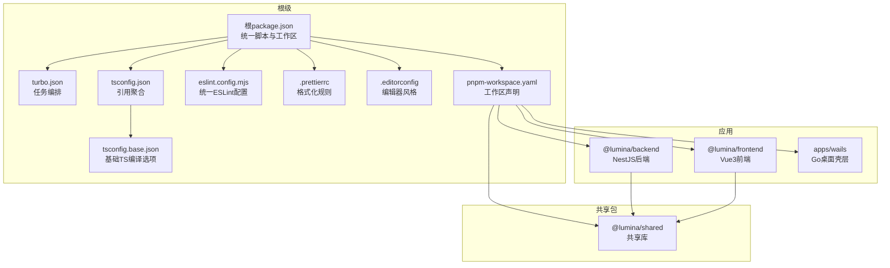
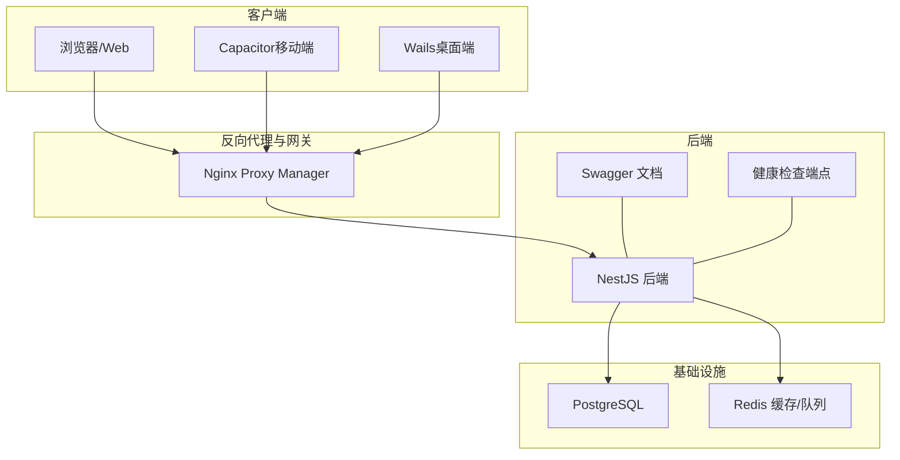
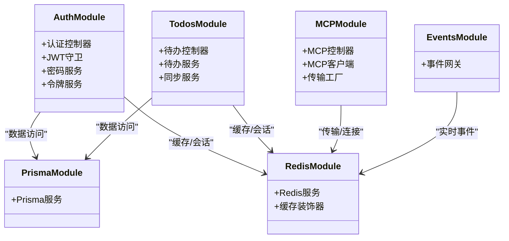
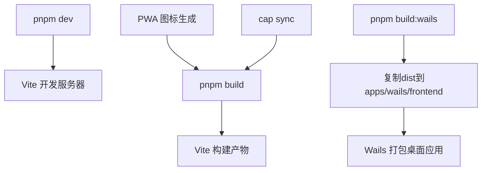
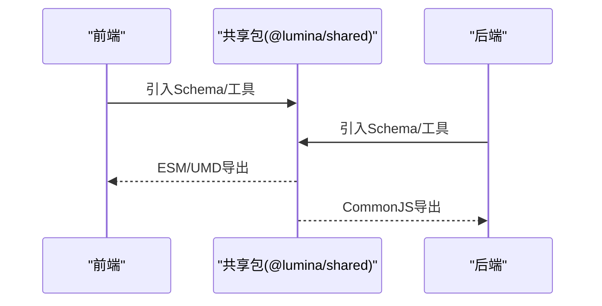
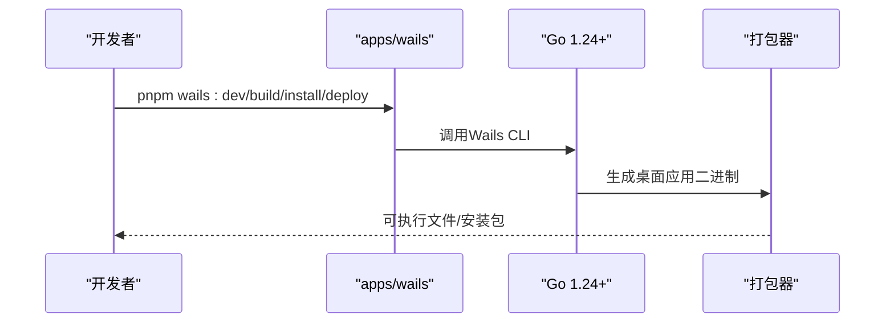
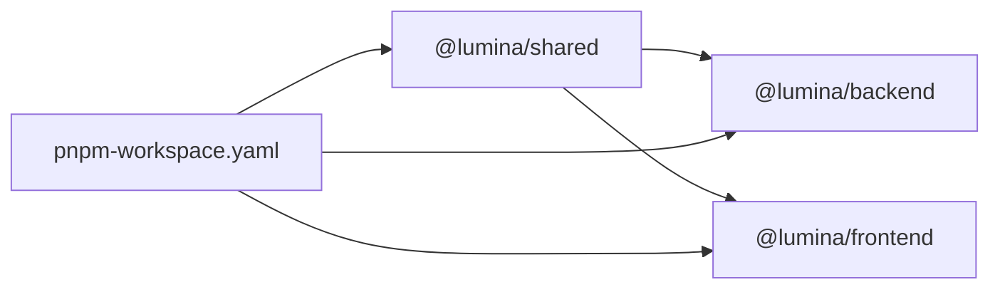

# 开发指南

<cite>
**本文引用的文件**
- [CONTRIBUTING.md](file://CONTRIBUTING.md)
- [CODE_OF_CONDUCT.md](file://CODE_OF_CONDUCT.md)
- [SECURITY.md](file://SECURITY.md)
- [package.json](file://package.json)
- [pnpm-workspace.yaml](file://pnpm-workspace.yaml)
- [turbo.json](file://turbo.json)
- [eslint.config.mjs](file://eslint.config.mjs)
- [.editorconfig](file://.editorconfig)
- [.prettierrc](file://.prettierrc)
- [tsconfig.base.json](file://tsconfig.base.json)
- [tsconfig.json](file://tsconfig.json)
- [apps/backend/nest-cli.json](file://apps/backend/nest-cli.json)
- [apps/backend/package.json](file://apps/backend/package.json)
- [apps/frontend/package.json](file://apps/frontend/package.json)
- [packages/shared/package.json](file://packages/shared/package.json)
- [apps/wails/go.mod](file://apps/wails/go.mod)
- [docker-compose.yml](file://docker-compose.yml)
</cite>

## 目录
1. [简介](#简介)
2. [项目结构](#项目结构)
3. [核心组件](#核心组件)
4. [架构总览](#架构总览)
5. [详细组件分析](#详细组件分析)
6. [依赖关系分析](#依赖关系分析)
7. [性能与可维护性](#性能与可维护性)
8. [故障排查指南](#故障排查指南)
9. [结论](#结论)
10. [附录](#附录)

## 简介
本开发指南面向Lumina（简思）项目的贡献者与维护者，系统阐述代码规范、Git工作流、分支管理策略、提交规范；开发环境配置、IDE设置、调试技巧与测试策略；Monorepo开发模式、包依赖管理、构建与发布流程；代码审查标准、质量保证流程与持续集成配置；贡献指南、行为准则与社区参与方式；常见问题解决方案、性能优化建议与安全最佳实践；以及开发工具推荐与团队协作规范。

## 项目结构
Lumina采用Monorepo组织方式，核心目录与职责如下：
- apps/backend：NestJS后端业务逻辑、AI集成与API
- apps/frontend：Vue 3 Web前端界面与共享UI组件
- apps/wails：基于Go的桌面壳层（Capacitor/Wails）
- packages/shared：共享Zod校验模型与通用工具函数
- 根级脚本与配置：统一的pnpm工作区、Turbo任务编排、ESLint/Prettier、TS基础配置等

图表来源
- [pnpm-workspace.yaml:1-4](file://pnpm-workspace.yaml#L1-L4)
- [turbo.json:1-186](file://turbo.json#L1-L186)
- [package.json:1-133](file://package.json#L1-L133)
- [tsconfig.json:1-10](file://tsconfig.json#L1-L10)
- [tsconfig.base.json:1-17](file://tsconfig.base.json#L1-L17)
- [apps/backend/package.json:1-108](file://apps/backend/package.json#L1-L108)
- [apps/frontend/package.json:1-104](file://apps/frontend/package.json#L1-L104)
- [packages/shared/package.json:1-51](file://packages/shared/package.json#L1-L51)
- [apps/wails/go.mod:1-38](file://apps/wails/go.mod#L1-L38)

章节来源
- [pnpm-workspace.yaml:1-4](file://pnpm-workspace.yaml#L1-L4)
- [turbo.json:1-186](file://turbo.json#L1-L186)
- [package.json:1-133](file://package.json#L1-L133)
- [tsconfig.json:1-10](file://tsconfig.json#L1-L10)
- [tsconfig.base.json:1-17](file://tsconfig.base.json#L1-L17)

## 核心组件
- 统一脚本与工作区
  - 根package.json提供统一开发、构建、测试、类型检查、格式化、数据库迁移、Docker编排等命令，并通过Turbo实现跨包并发执行与缓存。
  - pnpm-workspace.yaml声明apps与packages为工作区包，便于本地开发时的依赖链接与版本一致性。
- 任务编排与缓存
  - turbo.json定义各包的build/dev/lint/type-check/test等任务输入输出、依赖顺序与持久化进程，显著提升开发体验与CI效率。
- 代码质量与格式化
  - eslint.config.mjs提供TypeScript/Vue规则与Prettier集成，支持按包独立配置与缓存。
  - .prettierrc与.editorconfig确保全仓库一致的格式化风格。
- 类型系统
  - tsconfig.base.json集中配置严格模式、模块解析、声明映射等；tsconfig.json通过references聚合三端包，支持增量编译与IDE智能感知。
- 应用与共享包
  - apps/backend：NestJS生态、Prisma、Redis/BullMQ、Swagger、健康检查、i18n等。
  - apps/frontend：Vite、Vue3、Pinia、TailwindCSS、Capacitor、PWA、测试框架等。
  - packages/shared：以tsup打包的纯TypeScript库，导出CommonJS/ESM与类型声明。
  - apps/wails：Go桌面壳层，集成Wails v2，用于Windows/macOS/Linux桌面应用分发。

章节来源
- [package.json:31-76](file://package.json#L31-L76)
- [turbo.json:5-184](file://turbo.json#L5-L184)
- [eslint.config.mjs:1-70](file://eslint.config.mjs#L1-L70)
- [.prettierrc:1-12](file://.prettierrc#L1-L12)
- [.editorconfig:1-13](file://.editorconfig#L1-L13)
- [tsconfig.base.json:1-17](file://tsconfig.base.json#L1-L17)
- [tsconfig.json:1-10](file://tsconfig.json#L1-L10)
- [apps/backend/package.json:1-108](file://apps/backend/package.json#L1-L108)
- [apps/frontend/package.json:1-104](file://apps/frontend/package.json#L1-L104)
- [packages/shared/package.json:1-51](file://packages/shared/package.json#L1-L51)
- [apps/wails/go.mod:1-38](file://apps/wails/go.mod#L1-L38)

## 架构总览
Lumina采用前后端分离与Monorepo组织，结合容器化与反向代理进行生产部署。核心交互链路如下：

图表来源
- [docker-compose.yml:19-237](file://docker-compose.yml#L19-L237)
- [apps/backend/package.json:25-28](file://apps/backend/package.json#L25-L28)

章节来源
- [docker-compose.yml:19-237](file://docker-compose.yml#L19-L237)
- [apps/backend/package.json:25-28](file://apps/backend/package.json#L25-L28)

## 详细组件分析

### 后端（apps/backend）
- 技术栈与模块
  - NestJS、Prisma、BullMQ、Redis、Passport/JWT、Swagger、Terminus、i18n、Fastify、Pino日志、Throttler限流、Socket.IO事件网关等。
- 关键配置
  - nest-cli.json：指定源码目录、输出目录与i18n资源复制。
  - package.json：提供开发、构建、类型检查、测试、Prisma相关命令。
- 数据与缓存
  - Prisma Schema位于apps/backend/prisma/schema，包含基础、MCP、用户与待办等模型，配合Prisma Client进行类型安全访问。
  - Redis用于缓存与队列（BullMQ），提升高并发场景下的响应与异步处理能力。
- 安全与监控
  - Helmet、CORS、压缩中间件、健康检查端点、限流策略、XSS过滤与HTML清理等。
- 开发与调试
  - 支持ts-node-dev热重载开发模式；PM2脚本用于生产态管理；Swagger提供接口文档。

图表来源
- [apps/backend/src/auth/auth.module.ts](file://apps/backend/src/auth/auth.module.ts)
- [apps/backend/src/todos/todos.module.ts](file://apps/backend/src/todos/todos.module.ts)
- [apps/backend/src/events/events.module.ts](file://apps/backend/src/events/events.module.ts)
- [apps/backend/src/mcp/mcp.module.ts](file://apps/backend/src/mcp/mcp.module.ts)
- [apps/backend/src/redis/redis.module.ts](file://apps/backend/src/redis/redis.module.ts)
- [apps/backend/src/prisma/prisma.module.ts](file://apps/backend/src/prisma/prisma.module.ts)

章节来源
- [apps/backend/nest-cli.json:1-11](file://apps/backend/nest-cli.json#L1-L11)
- [apps/backend/package.json:1-108](file://apps/backend/package.json#L1-L108)

### 前端（apps/frontend）
- 技术栈与模块
  - Vue3、Vite、Pinia、Vue Router、TailwindCSS、Capacitor、PWA、Socket.IO客户端、Mermaid、Markdown渲染、国际化等。
- 开发与构建
  - 提供开发、构建、预览、类型检查、测试与覆盖率命令；Capacitor相关命令用于iOS/Android同步与运行。
- 桌面集成
  - build:wails脚本将Vite产物复制到apps/wails前端目录，配合Wails构建桌面应用。

图表来源
- [apps/frontend/package.json:9-28](file://apps/frontend/package.json#L9-L28)

章节来源
- [apps/frontend/package.json:1-104](file://apps/frontend/package.json#L1-L104)

### 共享包（packages/shared）
- 目标与用途
  - 提供跨应用共享的Zod Schema与工具函数，统一数据校验与类型推断。
- 构建与导出
  - 使用tsup打包，输出CommonJS与ESM两种格式及类型声明，供前后端共同消费。

图表来源
- [packages/shared/package.json:10-27](file://packages/shared/package.json#L10-L27)

章节来源
- [packages/shared/package.json:1-51](file://packages/shared/package.json#L1-L51)

### 桌面壳层（apps/wails）
- 技术栈
  - Go + Wails v2，用于构建跨平台桌面应用。
- 构建与安装
  - 提供wails:dev、wails:build、wails:install、wails:deploy等脚本，配合关闭应用与部署脚本。

图表来源
- [apps/wails/go.mod:1-38](file://apps/wails/go.mod#L1-L38)
- [package.json:69-75](file://package.json#L69-L75)

章节来源
- [apps/wails/go.mod:1-38](file://apps/wails/go.mod#L1-L38)
- [package.json:69-75](file://package.json#L69-L75)

## 依赖关系分析
- 工作区与包依赖
  - pnpm-workspace.yaml声明apps与packages为工作区包，实现本地开发时的依赖链接与版本统一。
  - apps/backend显式依赖@lumina/shared；apps/frontend同样依赖@lumina/shared；packages/shared作为纯TS库被两端共享。
- 任务依赖与拓扑
  - turbo.json中各包的build任务依赖上游包先完成构建；dev任务依赖build并开启持久化进程，提升开发效率。
- 外部依赖与安全
  - 根package.json通过overrides对关键依赖进行锁定与升级，降低供应链风险。
  - SECURITY.md明确了漏洞上报渠道与适用范围。

图表来源
- [pnpm-workspace.yaml:1-4](file://pnpm-workspace.yaml#L1-L4)
- [apps/backend/package.json:39](file://apps/backend/package.json#L39)
- [apps/frontend/package.json:36](file://apps/frontend/package.json#L36)
- [package.json:107-131](file://package.json#L107-L131)

章节来源
- [pnpm-workspace.yaml:1-4](file://pnpm-workspace.yaml#L1-L4)
- [apps/backend/package.json:39-86](file://apps/backend/package.json#L39-L86)
- [apps/frontend/package.json:30-70](file://apps/frontend/package.json#L30-L70)
- [package.json:107-131](file://package.json#L107-L131)

## 性能与可维护性
- 构建与缓存
  - 使用Turbo进行任务并行与缓存，减少重复计算；在CI中限制并发度以平衡资源占用。
- 内存与并发
  - 根脚本统一注入NODE_OPTIONS以扩大Node内存上限，避免大工程编译/测试时的内存不足。
- 类型与静态检查
  - tsconfig.base.json启用严格模式，tsconfig.json通过references聚合三端包，提升IDE体验与编译性能。
- Lint与格式化
  - eslint.config.mjs统一规则并集成Prettier；.prettierrc与.editorconfig确保一致风格。
- 测试与覆盖率
  - Vitest提供单元与集成测试，覆盖率达到要求有助于长期演进的稳定性。

章节来源
- [package.json:32-47](file://package.json#L32-L47)
- [turbo.json:6-39](file://turbo.json#L6-L39)
- [tsconfig.base.json:2-15](file://tsconfig.base.json#L2-L15)
- [tsconfig.json:4-9](file://tsconfig.json#L4-L9)
- [eslint.config.mjs:28-49](file://eslint.config.mjs#L28-L49)
- [.prettierrc:1-12](file://.prettierrc#L1-L12)
- [.editorconfig:3-9](file://.editorconfig#L3-L9)

## 故障排查指南
- 环境变量缺失
  - Docker Compose中多处环境变量为必填项（如数据库密码、Redis密码、JWT密钥、CORS Origin等）。请确保.env文件完整且与Compose一致。
- 数据库与缓存不可用
  - 使用docker compose healthcheck确认PostgreSQL与Redis健康状态；必要时查看容器日志定位问题。
- 端口冲突或权限问题
  - NPM默认监听80/443，需确保主机未被占用；必要时调整绑定地址与端口。
- 桌面应用无法启动
  - 使用wails:kill脚本关闭残留进程后再执行wails:build与wails:install；检查Go版本与Wails CLI是否匹配。
- 依赖冲突与安全审计
  - 通过根脚本执行security-audit；必要时更新依赖或应用overrides策略。

章节来源
- [docker-compose.yml:38-125](file://docker-compose.yml#L38-L125)
- [package.json:50](file://package.json#L50)
- [apps/wails/go.mod:3](file://apps/wails/go.mod#L3)

## 结论
本指南从Monorepo组织、任务编排、代码质量、测试策略、安全与运维等多个维度，系统化梳理了Lumina的开发流程与最佳实践。建议团队在日常协作中严格遵循统一的脚本、规范与审查流程，以保障高质量交付与可持续演进。

## 附录

### Git工作流与分支管理
- 分支策略
  - 从main派生功能分支，完成后合并前确保通过lint、type-check与test。
- 提交规范
  - 遵循约定式提交（Conventional Commits），保证变更可追溯与自动CHANGELOG生成。
- PR流程
  - 清晰描述变更内容，等待Review并及时响应反馈。

章节来源
- [CONTRIBUTING.md:72-79](file://CONTRIBUTING.md#L72-L79)

### 代码规范与质量
- 规范清单
  - 统一使用ESLint与Prettier；严格禁用any、未使用变量、浮点Promise等规则；控制台仅允许warn/error。
  - 编辑器统一缩进、换行与尾随空白策略。
- 类型安全
  - 严格启用tsconfig.base.json中的严格选项；通过type-check与type-check:watch确保类型稳定。
- 测试策略
  - 单元测试与覆盖率报告；端到端测试（E2E）覆盖关键路径。

章节来源
- [eslint.config.mjs:28-49](file://eslint.config.mjs#L28-L49)
- [.prettierrc:1-12](file://.prettierrc#L1-L12)
- [.editorconfig:3-9](file://.editorconfig#L3-L9)
- [tsconfig.base.json:2-15](file://tsconfig.base.json#L2-L15)

### 开发环境配置与IDE设置
- 运行时与包管理
  - Node.js >= 20.19.0；pnpm >= 9.15.0；Docker用于基础设施；Go >= 1.21（桌面开发）。
- 一键启动
  - 安装依赖后，启动PostgreSQL与Redis，执行数据库迁移，再运行pnpm dev进入全栈开发模式。
- IDE建议
  - VS Code + Vue/TypeScript扩展；启用ESLint与Prettier；保持.editorconfig生效。

章节来源
- [CONTRIBUTING.md:17-53](file://CONTRIBUTING.md#L17-L53)

### 调试技巧
- 后端
  - 使用nest start --debug或ts-node-dev热重载；结合Swagger快速验证接口；PM2管理生产进程。
- 前端
  - Vite开发服务器支持HMR；Vue Devtools辅助组件调试；Socket.IO客户端连接状态可观测。
- 桌面
  - wails:dev热重载；wails:kill清理残留；build:wails生成桌面包。

章节来源
- [apps/backend/package.json:13-18](file://apps/backend/package.json#L13-L18)
- [apps/frontend/package.json:10-14](file://apps/frontend/package.json#L10-L14)
- [package.json:69-75](file://package.json#L69-L75)

### 测试策略
- 单元测试
  - Vitest运行所有包的单元测试；覆盖率报告用于质量门禁。
- 端到端测试
  - E2E用例覆盖认证与核心业务流程，确保集成稳定。
- 质量门禁
  - CI中先format:check与lint/type-check，再执行test与安全审计。

章节来源
- [package.json:43-50](file://package.json#L43-L50)
- [apps/backend/package.json:22-28](file://apps/backend/package.json#L22-L28)
- [apps/frontend/package.json:17-21](file://apps/frontend/package.json#L17-L21)

### Monorepo开发模式与构建流程
- 工作区与依赖
  - pnpm-workspace.yaml声明apps与packages；@lumina/shared被前后端共享。
- 任务编排
  - turbo.json定义build/dev/lint/type-check/test等任务，按包依赖顺序执行并缓存结果。
- 并发与缓存
  - 根脚本统一注入NODE_OPTIONS；CI中限制并发度以平衡资源占用。

章节来源
- [pnpm-workspace.yaml:1-4](file://pnpm-workspace.yaml#L1-L4)
- [turbo.json:5-184](file://turbo.json#L5-L184)
- [package.json:32-47](file://package.json#L32-L47)

### 发布流程
- 容器化
  - docker-compose.yml定义生产镜像构建参数与环境变量；NPM负责HTTPS与反向代理。
- 镜像标签
  - 通过环境变量控制镜像标签；健康检查确保服务可用。
- 桌面应用
  - wails:build与wails:install生成并安装桌面应用包。

章节来源
- [docker-compose.yml:74-137](file://docker-compose.yml#L74-L137)
- [docker-compose.yml:142-172](file://docker-compose.yml#L142-L172)
- [package.json:69-75](file://package.json#L69-L75)

### 代码审查标准与质量保证
- 审查要点
  - 代码风格与类型安全；测试覆盖率与边界条件；安全与性能影响评估。
- 质量门禁
  - PR必须通过lint、type-check与test；安全审计在CI中执行。

章节来源
- [CONTRIBUTING.md:55-63](file://CONTRIBUTING.md#L55-L63)
- [package.json:43-50](file://package.json#L43-L50)

### 持续集成配置
- CI阶段
  - format:check → lint/type-check → test → security-audit；并发度在CI中受控。
- 缓存与持久化
  - Turbo缓存与持久化dev进程；Docker卷管理数据与日志。

章节来源
- [package.json:43-50](file://package.json#L43-L50)
- [turbo.json:11-16](file://turbo.json#L11-L16)

### 贡献指南与行为准则
- 行为准则
  - 遵守社区行为规范，尊重与包容，鼓励建设性反馈。
- 安全政策
  - 私下报告安全漏洞，明确适用范围与响应流程。
- 许可证
  - 贡献默认以AGPL-3.0许可。

章节来源
- [CODE_OF_CONDUCT.md:1-79](file://CODE_OF_CONDUCT.md#L1-L79)
- [SECURITY.md:1-40](file://SECURITY.md#L1-L40)
- [CONTRIBUTING.md:80-87](file://CONTRIBUTING.md#L80-L87)

### 常见问题与解决方案
- 数据库连接失败
  - 检查POSTGRES_USER/PASSWORD/DB与Compose配置；确认容器健康状态。
- Redis认证失败
  - 确认REDIS_PASSWORD与Compose配置一致；查看容器日志。
- CORS错误
  - 校验CORS_ORIGIN与实际域名；确保NPM正确转发请求。
- 桌面应用崩溃
  - 使用wails:kill清理后重试；检查Go版本与Wails CLI版本兼容性。

章节来源
- [docker-compose.yml:38-125](file://docker-compose.yml#L38-L125)
- [package.json:69-75](file://package.json#L69-L75)

### 性能优化建议
- 构建与缓存
  - 合理使用Turbo并行与缓存；在CI中限制并发度避免资源争用。
- 内存管理
  - 通过NODE_OPTIONS扩大Node内存上限，避免大工程编译/测试失败。
- 数据库与缓存
  - 合理设置PostgreSQL与Redis参数；使用BullMQ队列异步化耗时任务。
- 前端优化
  - PWA与Tailwind按需加载；组件懒加载与图片优化。

章节来源
- [package.json:32-47](file://package.json#L32-L47)
- [docker-compose.yml:28-67](file://docker-compose.yml#L28-L67)
- [apps/backend/package.json:60](file://apps/backend/package.json#L60)

### 安全最佳实践
- 版本支持
  - 仅对受支持版本提供安全更新。
- 漏洞上报
  - 私下通过GitHub私有漏洞报告或邮件联系维护者。
- 最佳实践
  - 保持安装最新；使用强密码并定期轮换；避免将数据库或Redis暴露公网。

章节来源
- [SECURITY.md:3-40](file://SECURITY.md#L3-L40)

### 开发工具推荐与效率提升
- 工具链
  - VS Code + Vue/TypeScript扩展；ESLint/Prettier；Docker Compose；Wails CLI。
- 效率技巧
  - 使用Turbo并行任务；启用持久化dev进程；统一格式化与类型检查；PR前先本地CI模拟。

章节来源
- [CONTRIBUTING.md:17-53](file://CONTRIBUTING.md#L17-L53)
- [turbo.json:11-16](file://turbo.json#L11-L16)