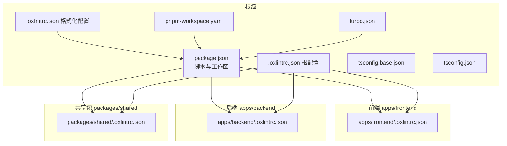
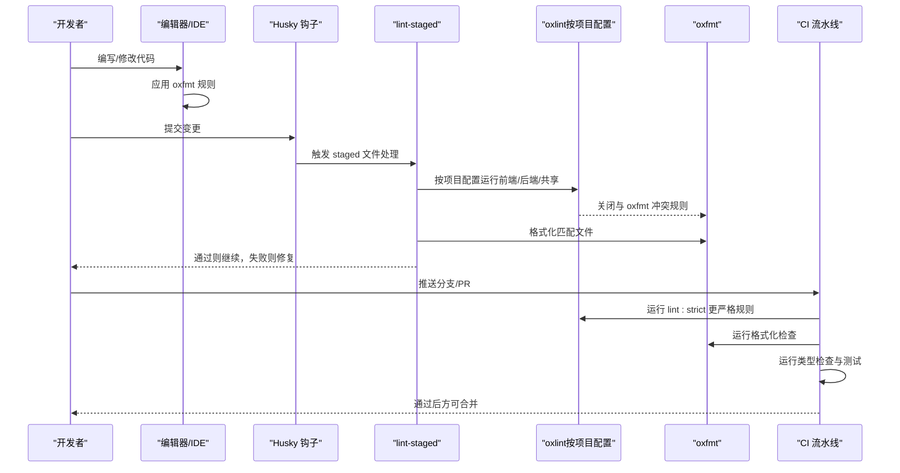
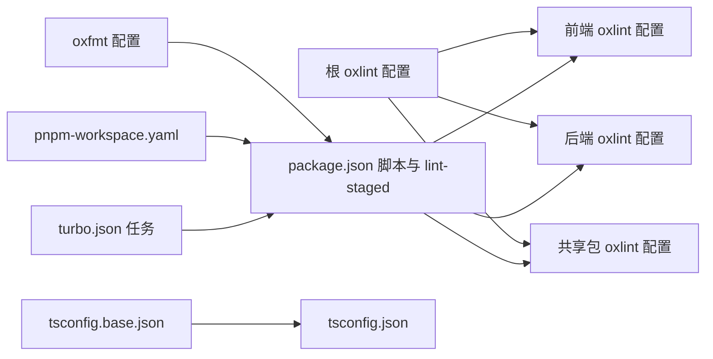

# 代码规范与质量

<cite>
**本文引用的文件**
- [.oxlintrc.json](file://.oxlintrc.json)
- [.oxfmtrc.json](file://.oxfmtrc.json)
- [apps/frontend/.oxlintrc.json](file://apps/frontend/.oxlintrc.json)
- [apps/backend/.oxlintrc.json](file://apps/backend/.oxlintrc.json)
- [packages/shared/.oxlintrc.json](file://packages/shared/.oxlintrc.json)
- [AGENTS.md](file://AGENTS.md)
- [package.json](file://package.json)
- [tsconfig.base.json](file://tsconfig.base.json)
- [tsconfig.json](file://tsconfig.json)
- [turbo.json](file://turbo.json)
- [pnpm-workspace.yaml](file://pnpm-workspace.yaml)
- [CONTRIBUTING.md](file://CONTRIBUTING.md)
- [CODE_OF_CONDUCT.md](file://CODE_OF_CONDUCT.md)
- [SECURITY.md](file://SECURITY.md)
</cite>

## 更新摘要
**所做更改**
- 将 ESLint 和 Prettier 工具链完全替换为 oxlint 和 oxfmt
- 更新所有代码质量工具配置和脚本命令
- 新增 oxlint 插件系统和规则配置详解
- 更新代码格式化和 linting 流程
- 移除旧的 ESLint 和 Prettier 配置相关章节

## 目录
1. [简介](#简介)
2. [项目结构](#项目结构)
3. [核心组件](#核心组件)
4. [架构总览](#架构总览)
5. [详细组件分析](#详细组件分析)
6. [依赖分析](#依赖分析)
7. [性能考虑](#性能考虑)
8. [故障排查指南](#故障排查指南)
9. [结论](#结论)
10. [附录](#附录)

## 简介
本文件为 Lumina Todo 的统一代码规范与质量标准文档，覆盖前端（Vue 3）、后端（NestJS）、共享包（shared）以及 Go 桌面壳（Wails/Go）的开发规范；明确 oxlint 规则、oxfmt 格式化、TypeScript 编码与类型定义最佳实践；提供代码审查清单、静态分析与测试流程、代码质量度量建议；并制定 Git 提交规范、分支命名与版本管理策略，以保障团队协作的一致性与可维护性。

**更新** 项目已完全迁移到 oxlint 和 oxfmt 工具链，替代原有的 ESLint 和 Prettier 配置体系。

## 项目结构
Lumina 采用 pnpm 工作区 + Turborepo 多包管理，包含以下主要模块：
- apps/backend：NestJS 后端服务，含认证、邮件、定时任务、上传、Prisma、Redis、AI/MCP 等子域
- apps/frontend：Vue 3 前端应用，Capacitor 打包，包含 UI 组件库、业务功能与国际化
- packages/shared：共享 Zod Schema、DTO 与通用工具
- apps/wails：Go 桌面壳（Wails），用于桌面端分发与系统集成
- 根级配置：oxlint、oxfmt、TypeScript、Turborepo、工作区与脚本

**图表来源**
- [package.json:1-139](file://package.json#L1-L139)
- [.oxlintrc.json:1-78](file://.oxlintrc.json#L1-L78)
- [.oxfmtrc.json:1-14](file://.oxfmtrc.json#L1-L14)
- [apps/frontend/.oxlintrc.json:1-12](file://apps/frontend/.oxlintrc.json#L1-L12)
- [apps/backend/.oxlintrc.json:1-7](file://apps/backend/.oxlintrc.json#L1-L7)
- [packages/shared/.oxlintrc.json:1-4](file://packages/shared/.oxlintrc.json#L1-L4)
- [tsconfig.base.json:1-17](file://tsconfig.base.json#L1-L17)
- [tsconfig.json:1-10](file://tsconfig.json#L1-L10)
- [pnpm-workspace.yaml:1-4](file://pnpm-workspace.yaml#L1-L4)
- [turbo.json:1-202](file://turbo.json#L1-L202)

**章节来源**
- [pnpm-workspace.yaml:1-4](file://pnpm-workspace.yaml#L1-L4)
- [turbo.json:1-202](file://turbo.json#L1-L202)
- [package.json:1-139](file://package.json#L1-L139)

## 核心组件
- **oxlint 配置体系**：根配置提供基础规则与忽略列表，前端/后端/共享包分别继承并扩展
- **oxfmt 格式化**：统一缩进、引号、行宽、换行等风格，与 oxlint 冲突规则自动关闭
- **TypeScript 编译选项**：严格模式、声明映射、隔离模块、bundler 解析等
- **Turborepo 任务编排**：构建、开发、测试、类型检查、缓存与持久化任务
- **质量脚本**：lint、lint:strict、lint:fix、format、format:check、type-check、test、security-audit

**更新** 核心组件已从 ESLint/Prettier 迁移到 oxlint/oxfmt，提供更高效的静态分析和格式化能力。

**章节来源**
- [.oxlintrc.json:1-78](file://.oxlintrc.json#L1-L78)
- [.oxfmtrc.json:1-14](file://.oxfmtrc.json#L1-L14)
- [apps/frontend/.oxlintrc.json:1-12](file://apps/frontend/.oxlintrc.json#L1-L12)
- [apps/backend/.oxlintrc.json:1-7](file://apps/backend/.oxlintrc.json#L1-L7)
- [packages/shared/.oxlintrc.json:1-4](file://packages/shared/.oxlintrc.json#L1-L4)
- [package.json:39-51](file://package.json#L39-L51)
- [tsconfig.base.json:1-17](file://tsconfig.base.json#L1-L17)
- [tsconfig.json:1-10](file://tsconfig.json#L1-L10)
- [turbo.json:1-202](file://turbo.json#L1-L202)

## 架构总览
下图展示代码质量流水线：编辑器/IDE 通过 oxfmt 保持一致风格；提交前通过 Husky + lint-staged 使用指定 oxlint 配置进行快速检查与格式化；CI 中执行更严格的 lint:strict、类型检查与测试。

**图表来源**
- [package.json:39-51](file://package.json#L39-L51)
- [.oxlintrc.json:1-78](file://.oxlintrc.json#L1-L78)
- [.oxfmtrc.json:1-14](file://.oxfmtrc.json#L1-L14)
- [apps/frontend/.oxlintrc.json:1-12](file://apps/frontend/.oxlintrc.json#L1-L12)
- [apps/backend/.oxlintrc.json:1-7](file://apps/backend/.oxlintrc.json#L1-L7)
- [packages/shared/.oxlintrc.json:1-4](file://packages/shared/.oxlintrc.json#L1-L4)

## 详细组件分析

### oxlint 配置与规则
- **根配置（.oxlintrc.json）**
  - 基于推荐规则集启用 JavaScript 与 TypeScript 基础规则
  - 启用 import、typescript、unicorn、vue、vitest 插件增强检查能力
  - 对 typed 文件启用 no-floating-promises、no-misused-promises（可在子配置中覆盖）
  - 针对非类型检查场景（如配置文件）禁用类型感知规则
  - 全局允许 console.warn/error，禁止无意义的 console
  - 定义忽略路径（dist、node_modules、iOS/Android、.husky 等）
- **前端配置（apps/frontend/.oxlintrc.json）**
  - 继承根配置，增加 Vue 推荐规则
  - Vue 文件块顺序强制 script/template/style
  - 针对 Capacitor/Vite/Vitest 等配置文件放宽部分规则
  - 额外忽略 public、src/assets、wailsjs 等目录
- **后端配置（apps/backend/.oxlintrc.json）**
  - 继承根配置，针对 NestJS 场景放宽接口前缀、显式返回类型等规则
  - 忽略生成代码与覆盖率目录
- **共享包配置（packages/shared/.oxlintrc.json）**
  - 继承根配置，忽略 dist 与 node_modules

**更新** oxlint 配置相比 ESLint 提供了更丰富的插件生态系统，包括 import、typescript、unicorn、vue、vitest 等插件，提供更精确的静态分析能力。

**章节来源**
- [.oxlintrc.json:1-78](file://.oxlintrc.json#L1-L78)
- [apps/frontend/.oxlintrc.json:1-12](file://apps/frontend/.oxlintrc.json#L1-L12)
- [apps/backend/.oxlintrc.json:1-7](file://apps/backend/.oxlintrc.json#L1-L7)
- [packages/shared/.oxlintrc.json:1-4](file://packages/shared/.oxlintrc.json#L1-L4)

### oxfmt 使用规范
- **统一风格**：无分号、单引号、2 空格缩进、尾随逗号、行长 100、括号间距、箭头函数括号、LF 结尾
- **配置选项**：通过 .oxfmtrc.json 统一管理格式化规则
- **与 oxlint 冲突规则自动关闭**，避免重复格式化
- **通过 npm 脚本执行格式化与检查**，支持 CI 校验

**更新** oxfmt 作为 Rust 实现的格式化工具，提供了与 oxlint 完全集成的格式化解决方案。

**章节来源**
- [.oxfmtrc.json:1-14](file://.oxfmtrc.json#L1-L14)
- [package.json:50-51](file://package.json#L50-L51)

### TypeScript 编码规范与类型定义最佳实践
- **编译选项（tsconfig.base.json）**
  - 目标与模块：ES2022 + ESNext + bundler 解析
  - 严格模式开启，声明与 sourcemap 开启，跳过库检查
  - isolatedModules + resolveJsonModule + forceConsistentCasingInFileNames
- **项目引用（tsconfig.json）**
  - 引用 apps/backend、apps/frontend、packages/shared
- **最佳实践**
  - 显式类型优先，避免 any；未使用参数以 _ 命名忽略
  - Promise 必须被处理或显式标记为已处理
  - 使用 Zod Schema 进行输入校验与类型收敛
  - 分层清晰：DTO/Service/Controller/Module，避免类型泄漏到 UI 层

**章节来源**
- [tsconfig.base.json:1-17](file://tsconfig.base.json#L1-L17)
- [tsconfig.json:1-10](file://tsconfig.json#L1-L10)
- [.oxlintrc.json:11-16](file://.oxlintrc.json#L11-L16)

### Vue 组件开发规范
- **文件组织**：每个组件独立文件，遵循 script/template/style 顺序
- **命名**：组件名称多单词；事件与 emits 使用清晰语义
- **类型**：Props/Emits 使用 TypeScript 类型定义；避免 any
- **样式**：scoped 或 CSS Modules；变量集中于主题样式文件
- **交互**：合理拆分展示组件与容器组件；复用 UI 组件库

**章节来源**
- [apps/frontend/.oxlintrc.json:8-10](file://apps/frontend/.oxlintrc.json#L8-L10)

### NestJS 后端开发规范
- **模块化**：按领域拆分 Module，职责单一；Service 专注业务逻辑
- **控制器**：仅处理路由与参数转换；DTO 作为输入契约
- **异常**：统一异常过滤器；错误信息本地化
- **中间件/拦截器**：统一日志、响应包装与数据净化
- **安全**：JWT 认证守卫；速率限制；输入校验与转义
- **配置**：环境变量分层；Prisma/Redis/邮件服务注入

**章节来源**
- [apps/backend/.oxlintrc.json:3-5](file://apps/backend/.oxlintrc.json#L3-L5)

### Go 语言开发规范（Wails 桌面壳）
- **代码整洁**：包内职责单一；函数短小；错误显式处理
- **命名**：导出类型与方法使用清晰语义；常量与配置集中
- **平台适配**：跨平台兼容；资源打包与权限控制
- **安全**：敏感信息不硬编码；最小权限原则；输入校验

**章节来源**
- [CONTRIBUTING.md:19-22](file://CONTRIBUTING.md#L19-L22)

### 代码审查清单
- **规范性**
  - 是否通过 lint:strict 与类型检查
  - 是否通过 oxfmt 格式化
  - 是否满足 oxfmt 风格
- **可读性**
  - 函数/类命名是否清晰；注释是否必要且准确
  - 是否存在过长函数/复杂条件判断
- **安全性**
  - 输入校验与转义；敏感信息处理
  - JWT 与速率限制配置正确
- **性能与健壮性**
  - Promise/异步调用是否正确处理
  - 错误边界与异常过滤器是否完善
- **测试**
  - 单元测试/集成测试覆盖关键路径
  - E2E 覆盖用户主流程

**更新** 代码审查清单已更新为基于 oxlint/oxfmt 的检查标准。

**章节来源**
- [CONTRIBUTING.md:55-63](file://CONTRIBUTING.md#L55-L63)

### 静态分析与测试
- **静态分析**
  - lint：日常检查；lint:strict：更严格规则；lint:fix：自动修复
  - type-check：确保类型安全；type-check:watch：持续监听
- **格式化**
  - format：格式化所有文件；format:check：检查格式化状态
- **测试**
  - test/test:watch/test:coverage：单元与覆盖率
  - e2e：端到端验证（如存在）
- **CI**
  - ci:check：format:check + lint:strict + type-check
  - ci:test：执行测试
  - ci:all：串联检查、测试与安全审计

**更新** 静态分析流程已完全迁移到 oxlint/oxfmt 工具链。

**章节来源**
- [package.json:39-51](file://package.json#L39-L51)
- [turbo.json:17-39](file://turbo.json#L17-L39)

### 代码质量度量标准
- **规范度**：oxlint 与 oxfmt 通过率 100%
- **类型安全**：type-check 无告警
- **覆盖率**：单元测试覆盖率 ≥ 目标阈值（建议 80%+）
- **复杂度**：函数圈复杂度 ≤ 10；文件 LOC ≤ 200
- **可维护性**：重复代码率低；依赖关系清晰；模块内聚高、耦合低

**更新** 代码质量度量标准已更新为基于 oxlint/oxfmt 的指标。

**章节来源**
- [package.json:39-51](file://package.json#L39-L51)
- [turbo.json:17-39](file://turbo.json#L17-L39)

### Git 提交规范、分支命名与版本管理
- **提交规范**
  - 使用 Conventional Commits：feat/fix/docs/style/refactor/perf/test/build/ci/chore
  - 主题简洁，描述清晰，必要时附链接与影响范围
- **分支命名**
  - feature/<功能点>：新功能
  - fix/<问题>：缺陷修复
  - chore/<任务>：构建、依赖等杂项
  - docs/<内容>：文档更新
- **版本管理**
  - 语义化版本；发布前打标签并更新 CHANGELOG
  - 通过脚本刷新标签与版本（如需要）

**章节来源**
- [CONTRIBUTING.md:72-78](file://CONTRIBUTING.md#L72-L78)

## 依赖分析
- **工作区与包管理**
  - pnpm-workspace.yaml 声明 apps/* 与 packages/*
  - package.json 定义脚本、lint-staged 与 overrides
- **任务编排**
  - turbo.json 定义各包的构建/开发/测试/类型检查任务与输入输出
- **配置继承**
  - 各应用/包的 oxlint 配置均继承根配置，减少重复与冲突

**图表来源**
- [.oxlintrc.json:1-78](file://.oxlintrc.json#L1-L78)
- [apps/frontend/.oxlintrc.json:1-12](file://apps/frontend/.oxlintrc.json#L1-L12)
- [apps/backend/.oxlintrc.json:1-7](file://apps/backend/.oxlintrc.json#L1-L7)
- [packages/shared/.oxlintrc.json:1-4](file://packages/shared/.oxlintrc.json#L1-L4)
- [package.json:1-139](file://package.json#L1-L139)
- [.oxfmtrc.json:1-14](file://.oxfmtrc.json#L1-L14)
- [tsconfig.base.json:1-17](file://tsconfig.base.json#L1-L17)
- [tsconfig.json:1-10](file://tsconfig.json#L1-L10)
- [pnpm-workspace.yaml:1-4](file://pnpm-workspace.yaml#L1-L4)
- [turbo.json:1-202](file://turbo.json#L1-L202)

**章节来源**
- [pnpm-workspace.yaml:1-4](file://pnpm-workspace.yaml#L1-L4)
- [package.json:1-139](file://package.json#L1-L139)
- [turbo.json:1-202](file://turbo.json#L1-L202)

## 性能考虑
- **Lint 缓存**：oxlint 支持增量检查与缓存机制，提升速度
- **格式化性能**：oxfmt 作为 Rust 实现，格式化速度更快
- **类型检查**：区分类型感知与非类型感知场景，避免不必要的类型检查
- **构建与测试**：Turborepo 并行与缓存，CI 中降低并发以稳定资源占用
- **前端体积**：按需引入与 Tree Shaking；UI 组件库按需加载

**更新** 性能考虑已更新为基于 oxlint/oxfmt 的优化策略。

**章节来源**
- [package.json:39-51](file://package.json#L39-L51)
- [turbo.json:1-202](file://turbo.json#L1-L202)

## 故障排查指南
- **oxlint 报错**
  - 检查对应应用的 oxlint 配置是否覆盖了根配置规则
  - 使用 lint:fix 自动修复可自动修复的问题
- **oxfmt 冲突**
  - 确认已正确配置 oxfmt 规则，避免与 oxlint 冲突
- **类型错误**
  - 运行 type-check:watch 获取实时反馈
  - 在复杂场景使用显式类型断言与防御式编程
- **CI 失败**
  - 先在本地执行 ci:check 与 ci:test，定位问题
  - 查看缓存与并发设置，必要时清理缓存

**更新** 故障排查指南已完全迁移到 oxlint/oxfmt 工具链。

**章节来源**
- [package.json:39-51](file://package.json#L39-L51)
- [.oxlintrc.json:10-11](file://.oxlintrc.json#L10-L11)
- [apps/frontend/.oxlintrc.json:8-10](file://apps/frontend/.oxlintrc.json#L8-L10)
- [apps/backend/.oxlintrc.json:3-5](file://apps/backend/.oxlintrc.json#L3-L5)
- [packages/shared/.oxlintrc.json:1-4](file://packages/shared/.oxlintrc.json#L1-L4)

## 结论
通过统一的 oxlint/oxfmt/TypeScript 配置与 Turborepo 任务编排，Lumina 实现了跨前端、后端与共享包的一致质量标准。oxlint 提供了比 ESLint 更强大的静态分析能力，oxfmt 则提供了高效的代码格式化解决方案。配合 Conventional Commits、分支命名与版本管理策略，团队可以在保证高质量的前提下高效协作。建议持续优化规则与阈值，结合自动化工具与代码审查流程，不断提升工程化水平。

**更新** 结论部分已更新为基于新工具链的总结。

## 附录
- **安全政策与合规**
  - 支持版本与漏洞上报流程
  - 社区行为准则与举报渠道
- **贡献指南与开发环境**
  - 环境要求、初始化步骤与常用命令

**章节来源**
- [SECURITY.md:1-40](file://SECURITY.md#L1-L40)
- [CODE_OF_CONDUCT.md:1-79](file://CODE_OF_CONDUCT.md#L1-L79)
- [CONTRIBUTING.md:13-54](file://CONTRIBUTING.md#L13-L54)
- [AGENTS.md:12-123](file://AGENTS.md#L12-L123)
- [AGENTS.md:150-169](file://AGENTS.md#L150-L169)