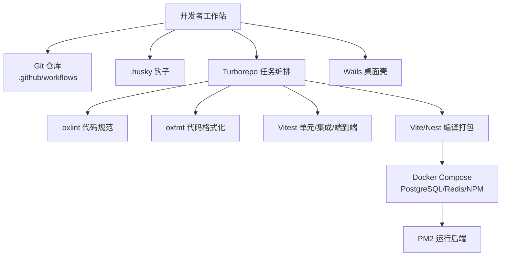
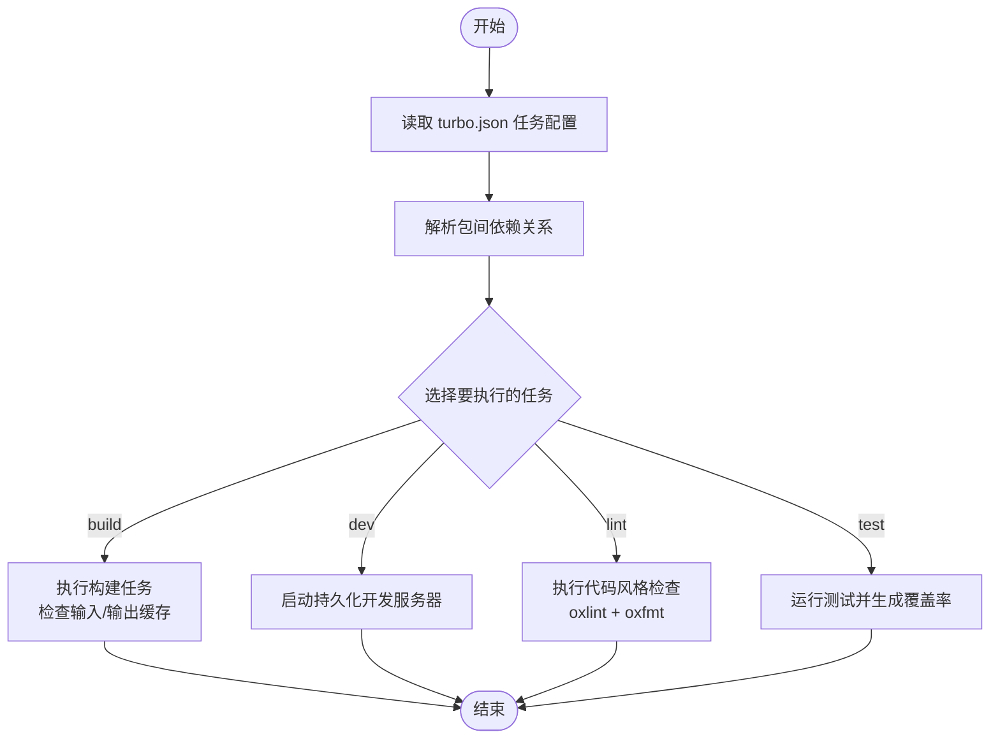
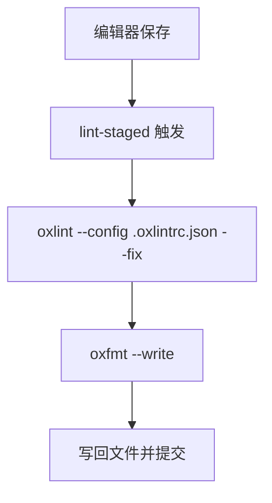
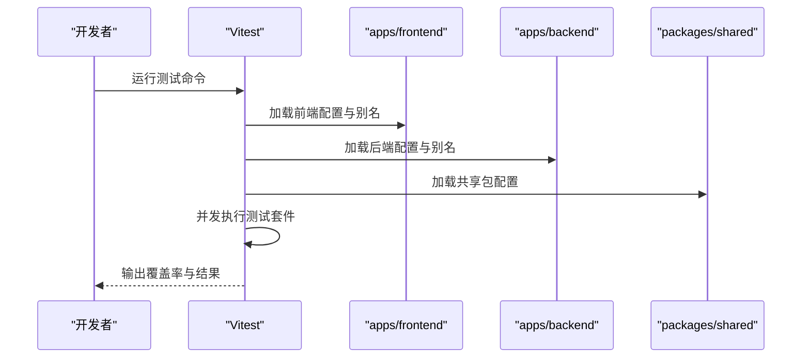
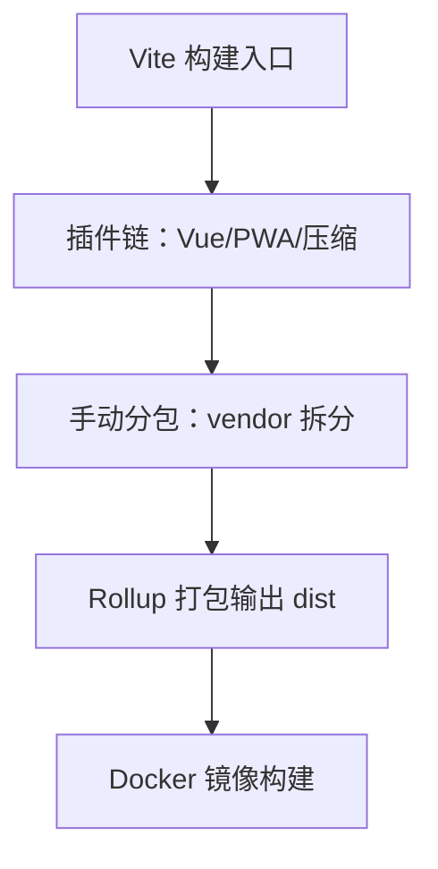
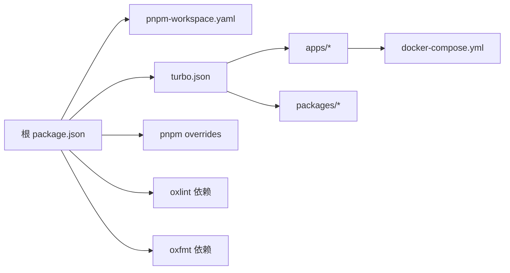

# 开发指南

<cite>
**本文引用的文件**
- [package.json](file://package.json)
- [turbo.json](file://turbo.json)
- [pnpm-workspace.yaml](file://pnpm-workspace.yaml)
- [CONTRIBUTING.md](file://CONTRIBUTING.md)
- [CODE_OF_CONDUCT.md](file://CODE_OF_CONDUCT.md)
- [eslint.config.mjs](file://eslint.config.mjs)
- [apps/backend/eslint.config.mjs](file://apps/backend/eslint.config.mjs)
- [apps/frontend/eslint.config.mjs](file://apps/frontend/eslint.config.mjs)
- [.prettierrc](file://.prettierrc)
- [.oxlintrc.json](file://.oxlintrc.json)
- [.oxfmtrc.json](file://.oxfmtrc.json)
- [apps/backend/vitest.config.mts](file://apps/backend/vitest.config.mts)
- [apps/frontend/vitest.config.mts](file://apps/frontend/vitest.config.mts)
- [packages/shared/vitest.config.ts](file://packages/shared/vitest.config.ts)
- [apps/backend/nest-cli.json](file://apps/backend/nest-cli.json)
- [apps/frontend/vite.config.mts](file://apps/frontend/vite.config.mts)
- [docker-compose.yml](file://docker-compose.yml)
- [scripts/security-audit.js](file://scripts/security-audit.js)
- [scripts/dev-bootstrap.sh](file://scripts/dev-bootstrap.sh)
- [scripts/deploy-app.sh](file://scripts/deploy-app.sh)
- [scripts/close-app.sh](file://scripts/close-app.sh)
- [.github/workflows](file://.github/workflows)
- [.husky/_](file://.husky/_)
- [SECURITY.md](file://SECURITY.md)
</cite>

## 目录
1. [简介](#简介)
2. [项目结构](#项目结构)
3. [核心组件](#核心组件)
4. [架构总览](#架构总览)
5. [详细组件分析](#详细组件分析)
6. [依赖关系分析](#依赖关系分析)
7. [性能考量](#性能考量)
8. [故障排查指南](#故障排查指南)
9. [结论](#结论)
10. [附录](#附录)

## 简介
本开发指南面向新加入 Lumina Todo 的开发者，提供从环境搭建、代码规范、任务管理、构建优化、代码质量工具、Git 工作流、测试体系、调试与性能分析，到贡献与协作规范的完整入门与进阶指引。项目采用 pnpm + Turborepo 的 monorepo 架构，后端基于 NestJS，前端基于 Vue 3，桌面端通过 Wails + Go 实现，共享层使用 TypeScript。

**更新** 项目已迁移到 Bun 生态系统工具链，引入了 oxlint 和 oxfmt 作为主要的代码质量工具，替代传统的 ESLint 和 Prettier 配置。

## 项目结构
仓库采用 pnpm workspace + Turborepo 的多应用组织方式：
- apps/backend：NestJS 后端应用，包含认证、用户、任务、邮件、缓存、定时任务、技能源、MCP 等模块。
- apps/frontend：Vue 3 前端应用，包含路由、状态、UI 组件库、国际化、Markdown 渲染、PWA 等。
- apps/wails：Go 桌面壳，通过 Wails 与前端交互。
- packages/shared：共享的 Zod Schema、DTO、工具函数等。
- 根级脚本与配置：Turbo、Bun 生态工具链（oxlint/oxfmt）、Docker Compose、安全审计、Husky 钩子等。

```mermaid
graph TB
subgraph "根目录"
PKG["package.json<br/>脚本与工作区"]
TURBO["turbo.json<br/>任务与缓存"]
WS["pnpm-workspace.yaml<br/>工作区声明"]
OXLINT[".oxlintrc.json<br/>Bun 代码规范"]
OXFMT[".oxfmtrc.json<br/>Bun 格式化规则"]
END
subgraph "后端 apps/backend"
NEST["nest-cli.json<br/>编译与资源"]
ESLINT_B["apps/backend/eslint.config.mjs"]
VITEST_B["apps/backend/vitest.config.mts"]
END
subgraph "前端 apps/frontend"
VITE["apps/frontend/vite.config.mts"]
ESLINT_F["apps/frontend/eslint.config.mjs"]
VITEST_F["apps/frontend/vitest.config.mts"]
END
subgraph "共享包 packages/shared"
VITEST_S["packages/shared/vitest.config.ts"]
END
subgraph "基础设施"
DOCKER["docker-compose.yml"]
PRET[".prettierrc<br/>传统格式化规则"]
END
PKG --> TURBO
PKG --> WS
PKG --> OXLINT
PKG --> OXFMT
TURBO --> NEST
TURBO --> ESLINT_B
TURBO --> ESLINT_F
TURBO --> VITE
TURBO --> VITEST_B
TURBO --> VITEST_F
TURBO --> VITEST_S
PKG --> DOCKER
PKG --> PRET
```

**图表来源**
- [package.json:1-150](file://package.json#L1-L150)
- [turbo.json:1-233](file://turbo.json#L1-L233)
- [pnpm-workspace.yaml:1-4](file://pnpm-workspace.yaml#L1-L4)
- [.oxlintrc.json:1-78](file://.oxlintrc.json#L1-L78)
- [.oxfmtrc.json:1-14](file://.oxfmtrc.json#L1-L14)
- [apps/backend/nest-cli.json:1-11](file://apps/backend/nest-cli.json#L1-L11)
- [apps/backend/eslint.config.mjs:1-25](file://apps/backend/eslint.config.mjs#L1-L25)
- [apps/frontend/eslint.config.mjs:1-74](file://apps/frontend/eslint.config.mjs#L1-L74)
- [apps/frontend/vite.config.mts:1-185](file://apps/frontend/vite.config.mts#L1-L185)
- [apps/backend/vitest.config.mts:1-40](file://apps/backend/vitest.config.mts#L1-L40)
- [apps/frontend/vitest.config.mts:1-23](file://apps/frontend/vitest.config.mts#L1-L23)
- [packages/shared/vitest.config.ts:1-22](file://packages/shared/vitest.config.ts#L1-L22)
- [docker-compose.yml:1-240](file://docker-compose.yml#L1-L240)
- [.prettierrc:1-12](file://.prettierrc#L1-L12)

**章节来源**
- [package.json:31-77](file://package.json#L31-L77)
- [turbo.json:1-233](file://turbo.json#L1-L233)
- [pnpm-workspace.yaml:1-4](file://pnpm-workspace.yaml#L1-L4)

## 核心组件
- 开发脚本与工作流
  - 使用 pnpm 脚本统一调度 Turborepo 任务，支持并行并发、缓存与增量构建。
  - 提供开发、构建、类型检查、**oxlint/oxfmt**、测试、Docker、Wails 等一键命令。
- Turborepo 任务与缓存
  - 定义 build/dev/lint/type-check/test 等任务，按包粒度配置输入输出，启用持久化进程与缓存。
  - 后端、前端、共享包分别定义独立任务，确保依赖顺序与增量更新。
- **Bun 生态工具链**
  - **oxlint**：高性能 JavaScript/TypeScript 静态分析工具，替代 ESLint，支持配置文件 `.oxlintrc.json`。
  - **oxfmt**：现代化代码格式化工具，替代 Prettier，支持配置文件 `.oxfmtrc.json`。
  - **lint-staged**：集成 oxlint 和 oxfmt，在提交前自动格式化和修复代码。
- 代码质量工具链
  - **oxlint + oxfmt**：根级基础规则 + 平台特定扩展；lint-staged 与 Husky 钩子保证提交前一致性。
  - Vitest：三端测试配置，覆盖率与环境隔离。
- 基础设施与容器化
  - Docker Compose 提供数据库、缓存、反向代理与日志可视化，便于本地与生产部署。
- 桌面端集成
  - Wails + Go，提供桌面应用构建与安装脚本，支持热重启与卸载。

**章节来源**
- [package.json:31-77](file://package.json#L31-L77)
- [turbo.json:5-233](file://turbo.json#L5-L233)
- [.oxlintrc.json:1-78](file://.oxlintrc.json#L1-L78)
- [.oxfmtrc.json:1-14](file://.oxfmtrc.json#L1-L14)
- [eslint.config.mjs:1-71](file://eslint.config.mjs#L1-L71)
- [apps/backend/eslint.config.mjs:1-25](file://apps/backend/eslint.config.mjs#L1-L25)
- [apps/frontend/eslint.config.mjs:1-74](file://apps/frontend/eslint.config.mjs#L1-L74)
- [.prettierrc:1-12](file://.prettierrc#L1-L12)
- [apps/backend/vitest.config.mts:1-40](file://apps/backend/vitest.config.mts#L1-L40)
- [apps/frontend/vitest.config.mts:1-23](file://apps/frontend/vitest.config.mts#L1-L23)
- [packages/shared/vitest.config.ts:1-22](file://packages/shared/vitest.config.ts#L1-L22)
- [docker-compose.yml:1-240](file://docker-compose.yml#L1-L240)

## 架构总览
Lumina Todo 采用前后端分离与共享层解耦的架构，结合容器化与 CI/CD 流水线，实现高内聚低耦合的工程化体系。



**图表来源**
- [package.json:31-77](file://package.json#L31-L77)
- [.github/workflows](file://.github/workflows)
- [.husky/_](file://.husky/_)
- [turbo.json:1-233](file://turbo.json#L1-L233)
- [docker-compose.yml:1-240](file://docker-compose.yml#L1-L240)

## 详细组件分析

### Turborepo 工作原理与任务管理
- 任务定义与依赖
  - 顶层任务 build/dev/lint/type-check/test 支持跨包依赖与增量构建。
  - 后端/前端/共享包各自定义任务，明确输入输出，提升缓存命中率。
- 并发与缓存
  - 通过 concurrency 参数与缓存目录，减少重复计算，加速 CI/CD。
- 持久化与开发模式
  - dev 与 type-check:watch 设置 persistent=true，保持常驻进程，提升开发体验。



**图表来源**
- [turbo.json:5-233](file://turbo.json#L5-L233)

**章节来源**
- [turbo.json:1-233](file://turbo.json#L1-L233)
- [package.json:31-77](file://package.json#L31-L77)

### Bun 生态工具链：oxlint 与 oxfmt
- **oxlint 配置**
  - 基于 `.oxlintrc.json` 配置文件，启用 import、typescript、unicorn、vue、vitest 插件。
  - 支持环境配置（browser=false, node=true, es2022），提供严格规则集。
  - 针对不同文件类型和场景提供覆盖规则（测试文件、配置文件、后端/侧车应用等）。
- **oxfmt 配置**
  - 基于 `.oxfmtrc.json` 配置文件，提供现代化代码格式化规则。
  - 支持无分号、单引号、2空格缩进、尾逗号等现代格式化标准。
- **lint-staged 集成**
  - 在提交前自动执行 oxlint --fix 和 oxfmt --write。
  - 支持多种文件类型的格式化处理。



**图表来源**
- [package.json:113-121](file://package.json#L113-L121)
- [.oxlintrc.json:1-78](file://.oxlintrc.json#L1-78)
- [.oxfmtrc.json:1-14](file://.oxfmtrc.json#L1-14)

**章节来源**
- [package.json:113-121](file://package.json#L113-L121)
- [.oxlintrc.json:1-78](file://.oxlintrc.json#L1-L78)
- [.oxfmtrc.json:1-14](file://.oxfmtrc.json#L1-L14)

### 传统 ESLint 与 Prettier 配置
- **根级 ESLint 配置**
  - 基于 Flat Config，启用 TypeScript 推荐规则与全局变量，关闭与 Prettier 冲突规则。
  - 对 JS/TS 配置进行区分，对配置文件禁用类型检查以提升性能。
- **平台特定配置**
  - 后端：放宽部分 NestJS 场景下的显式类型规则，保留 Prettier 关闭项。
  - 前端：启用 Vue 推荐规则，对 *.vue 文件配置解析器与块顺序校验，忽略平台配置文件中的误报。
- **Prettier 规则**
  - 统一缩进、引号、尾逗号、行长等风格，配合 lint-staged 与 Husky 自动化。

**章节来源**
- [eslint.config.mjs:1-71](file://eslint.config.mjs#L1-L71)
- [apps/backend/eslint.config.mjs:1-25](file://apps/backend/eslint.config.mjs#L1-L25)
- [apps/frontend/eslint.config.mjs:1-74](file://apps/frontend/eslint.config.mjs#L1-L74)
- [.prettierrc:1-12](file://.prettierrc#L1-L12)

### 测试体系：单元、集成与端到端
- 测试框架
  - Vitest：三端统一配置，设置环境、别名、覆盖率与最大并发。
- 前端测试
  - happy-dom 环境，支持 Vue 插件与 setupFiles。
- 后端测试
  - Node 环境，设置时区、别名与共享包路径。
- 共享包测试
  - Node 环境，聚焦纯 TS 工具与 DTO。
- 端到端测试
  - 建议在 apps/backend/tests/e2e 下新增 spec，使用 Test App 初始化应用上下文。



**图表来源**
- [apps/frontend/vitest.config.mts:1-23](file://apps/frontend/vitest.config.mts#L1-L23)
- [apps/backend/vitest.config.mts:1-40](file://apps/backend/vitest.config.mts#L1-L40)
- [packages/shared/vitest.config.ts:1-22](file://packages/shared/vitest.config.ts#L1-L22)

**章节来源**
- [apps/frontend/vitest.config.mts:1-23](file://apps/frontend/vitest.config.mts#L1-L23)
- [apps/backend/vitest.config.mts:1-40](file://apps/backend/vitest.config.mts#L1-L40)
- [packages/shared/vitest.config.ts:1-22](file://packages/shared/vitest.config.ts#L1-L22)

### 构建与优化策略
- 前端构建优化
  - Vite 插件：Vue、Gzip/Brotli 压缩、PWA 清单与静态资源。
  - 手动分包策略：根据依赖特征拆分 vendor 包，降低首屏体积。
  - 代理与开发服务器：统一代理后端 API 与 WebSocket，适配 Docker 外部访问。
- 后端构建
  - Nest CLI 配置输出目录与资源拷贝，便于容器化部署。
- 共享包构建
  - 使用 tsup 配置（见 packages/shared/tsup.config.ts），输出多格式产物。



**图表来源**
- [apps/frontend/vite.config.mts:80-185](file://apps/frontend/vite.config.mts#L80-L185)
- [apps/backend/nest-cli.json:1-11](file://apps/backend/nest-cli.json#L1-L11)

**章节来源**
- [apps/frontend/vite.config.mts:1-185](file://apps/frontend/vite.config.mts#L1-L185)
- [apps/backend/nest-cli.json:1-11](file://apps/backend/nest-cli.json#L1-L11)

### Git 工作流、分支管理与代码审查
- 分支与提交
  - 基于 Conventional Commits 提交信息，主分支受保护，变更通过 Pull Request 合并。
- 代码审查
  - PR 需通过 **oxlint/oxfmt**、类型检查与测试，确保质量门槛。
- 安全与合规
  - 遵循安全政策，发现漏洞按流程上报。

**章节来源**
- [CONTRIBUTING.md:72-79](file://CONTRIBUTING.md#L72-L79)
- [SECURITY.md](file://SECURITY.md)

### 调试技巧、性能分析与问题排查
- 调试建议
  - 使用持久化开发任务，开启 type-check:watch 与测试 watch。
  - 前端使用 happy-dom，后端使用 Node 环境，确保测试隔离。
- 性能分析
  - 借助手动分包与压缩插件控制包体大小，关注 chunkSizeWarningLimit。
- 问题排查
  - Docker 日志：查看数据库、缓存、反向代理健康状态。
  - 容器清理：使用 docker:prune、docker:dev:clean 等脚本快速恢复。

**章节来源**
- [turbo.json:26-31](file://turbo.json#L26-L31)
- [apps/frontend/vite.config.mts:175-182](file://apps/frontend/vite.config.mts#L175-L182)
- [docker-compose.yml:13-240](file://docker-compose.yml#L13-L240)

### 贡_contributing_指南与社区协作
- 行为准则与安全政策
  - 参与者需遵守行为准则，安全问题遵循安全政策。
- 开发环境
  - Node、pnpm、Docker、Go（桌面端）为必要条件；按步骤拉起基础设施与迁移数据库。
- 质量标准
  - PR 必须通过 **oxlint/oxfmt**、类型检查与测试。
- 许可证
  - 贡献在 AGPL-3.0 许可证下提交。

**章节来源**
- [CONTRIBUTING.md:5-87](file://CONTRIBUTING.md#L5-L87)
- [CODE_OF_CONDUCT.md:1-79](file://CODE_OF_CONDUCT.md#L1-L79)

## 依赖关系分析
- 工作区与包依赖
  - pnpm-workspace.yaml 声明 apps/* 与 packages/*，Turborepo 依据任务配置推导依赖顺序。
- 外部依赖与覆盖
  - package.json overrides 指定关键依赖版本，减少供应链风险。
- **Bun 生态工具链**
  - 新增 oxlint（1.63.0）和 oxfmt（0.48.0）作为主要代码质量工具。
- 基础设施依赖
  - Docker Compose 依赖 PostgreSQL、Redis、NPM，后端服务健康检查确保可用性。



**图表来源**
- [package.json:111-150](file://package.json#L111-L150)
- [pnpm-workspace.yaml:1-4](file://pnpm-workspace.yaml#L1-4)
- [turbo.json:1-233](file://turbo.json#L1-L233)
- [docker-compose.yml:1-240](file://docker-compose.yml#L1-L240)

**章节来源**
- [package.json:111-150](file://package.json#L111-L150)
- [pnpm-workspace.yaml:1-4](file://pnpm-workspace.yaml#L1-4)
- [turbo.json:1-233](file://turbo.json#L1-L233)

## 性能考量
- 构建性能
  - 合理设置并发与缓存，利用增量构建减少重复编译。
- **Bun 工具链性能优势**
  - **oxlint**：基于 Rust 实现，提供比 ESLint 更快的代码检查速度。
  - **oxfmt**：现代化格式化工具，支持增量格式化，提升开发效率。
- 前端体积
  - 通过手动分包与压缩插件控制体积，避免第三方库过大引入。
- 数据库与缓存
  - Docker Compose 中为 PostgreSQL 与 Redis 设置内存与策略参数，保障性能与稳定性。

**章节来源**
- [turbo.json:37-42](file://turbo.json#L37-L42)
- [apps/frontend/vite.config.mts:175-182](file://apps/frontend/vite.config.mts#L175-L182)
- [docker-compose.yml:23-70](file://docker-compose.yml#L23-L70)

## 故障排查指南
- 本地开发
  - 若开发服务器无法访问，检查 Vite server.host 与代理配置。
  - 类型检查失败时，先运行 type-check:watch，定位具体文件。
- **Bun 工具链问题**
  - **oxlint/oxfmt 命令执行失败**：确认 Bun 版本兼容性和配置文件语法正确。
  - **lint-staged 未触发**：检查 husky 配置和 git hooks 是否正确安装。
- 测试失败
  - 使用 test:watch 与覆盖率报告定位问题；确认 setupFiles 与环境变量。
- 容器问题
  - 使用 docker:dev:logs 查看后端/前端/Redis/PostgreSQL 日志；必要时 docker:dev:clean 清理后重试。
- 安全审计
  - 运行 security-audit 脚本，修复高危依赖。

**章节来源**
- [apps/frontend/vite.config.mts:154-174](file://apps/frontend/vite.config.mts#L154-L174)
- [apps/backend/vitest.config.mts:10-36](file://apps/backend/vitest.config.mts#L10-L36)
- [docker-compose.yml:13-240](file://docker-compose.yml#L13-L240)
- [scripts/security-audit.js](file://scripts/security-audit.js)

## 结论
本指南系统梳理了 Lumina Todo 的开发环境、任务编排、代码质量、测试与部署要点。项目已成功迁移到 Bun 生态系统工具链，采用 **oxlint** 和 **oxfmt** 替代传统的 ESLint 和 Prettier，提供更高效的代码质量和格式化能力。建议新开发者从环境搭建与基础脚本入手，逐步掌握 Turborepo 的任务模型与缓存机制，配合 **oxlint/oxfmt** 与 Vitest 形成高效的质量闭环，并通过 Docker 与 Wails 完成本地与桌面端验证。

## 附录
- 常用脚本速查
  - 开发：dev、dev:backend、dev:frontend、dev:all
  - 构建：build、build:ci
  - **Bun 工具链**：**lint**（oxlint）、**lint:strict**（oxlint 严格模式）、**lint:fix**（oxlint 自动修复）、**format**（oxfmt 格式化）、**format:check**（oxfmt 检查）
  - **传统工具链**：lint:eslint、lint:eslint:strict、lint:fix（ESLint/Prettier）
  - 类型检查：type-check、type-check:watch
  - 测试：test、test:watch、test:coverage
  - Docker：docker:build、docker:up、docker:down、docker:logs、docker:dev、docker:prune
  - Wails：wails:dev、wails:build、wails:deploy、wails:kill
- **CI/CD 流水线**
  - **ci:check**：执行 oxfmt 检查、oxlint、边界检查、依赖分析和类型检查。
  - **ci:test**：执行测试套件。
  - **ci:all**：整合检查和测试，包含安全审计。
- **提交前钩子**
  - **lint-staged**：自动执行 **oxlint --fix** 和 **oxfmt --write**，确保代码质量一致性。

**章节来源**
- [package.json:31-92](file://package.json#L31-L92)
- [package.json:113-121](file://package.json#L113-L121)
- [.husky/_](file://.husky/_)