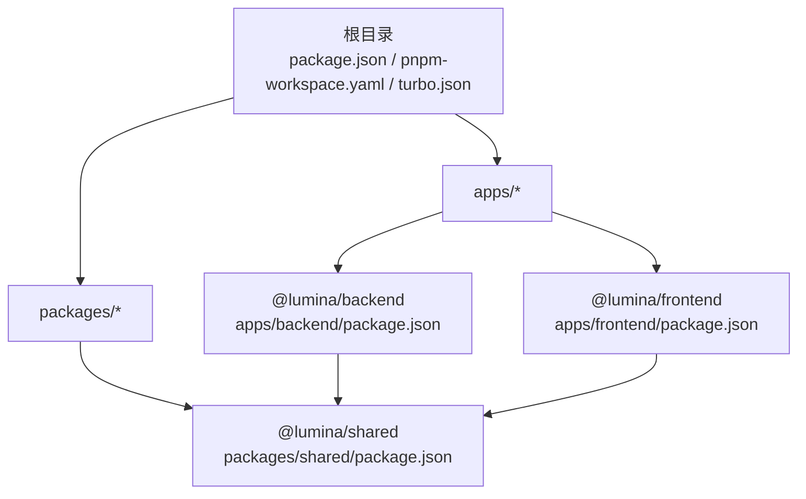
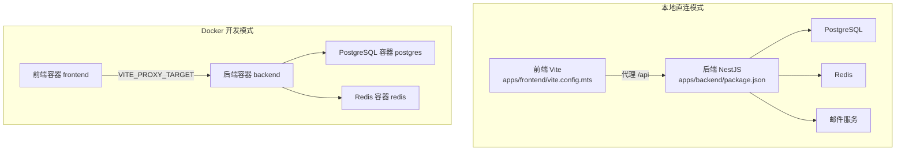
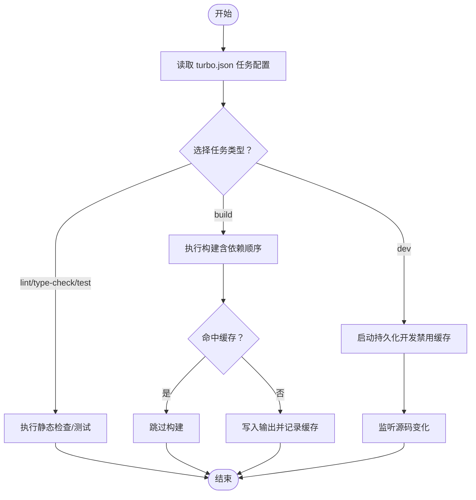
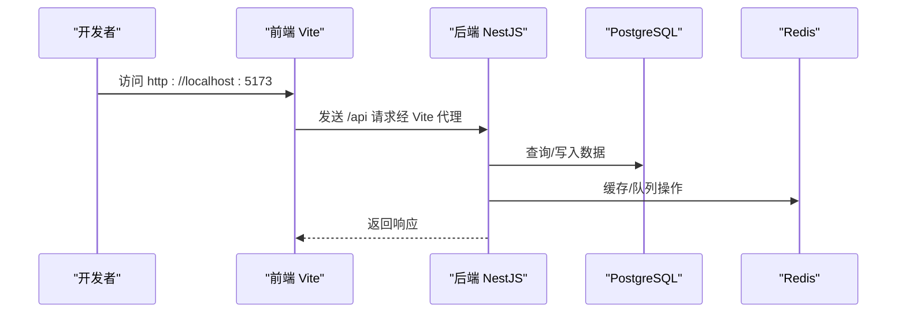
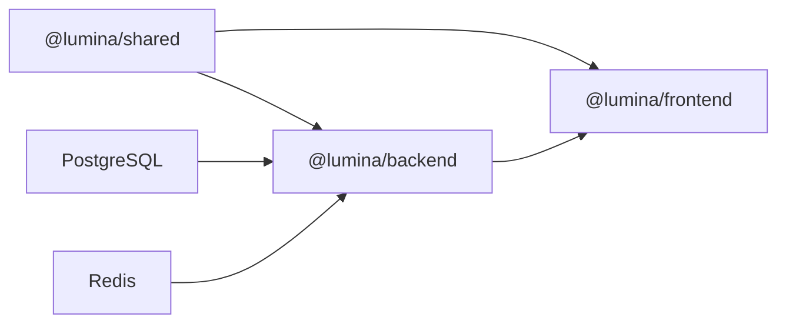

# 开发环境搭建

<cite>
**本文引用的文件**
- [package.json](file://package.json)
- [pnpm-workspace.yaml](file://pnpm-workspace.yaml)
- [turbo.json](file://turbo.json)
- [docker-compose.dev.yml](file://docker-compose.dev.yml)
- [scripts/dev-bootstrap.sh](file://scripts/dev-bootstrap.sh)
- [apps/backend/package.json](file://apps/backend/package.json)
- [apps/frontend/package.json](file://apps/frontend/package.json)
- [packages/shared/package.json](file://packages/shared/package.json)
- [apps/backend/nest-cli.json](file://apps/backend/nest-cli.json)
- [apps/frontend/vite.config.mts](file://apps/frontend/vite.config.mts)
- [docker-compose.yml](file://docker-compose.yml)
- [apps/wails/wails.json](file://apps/wails/wails.json)
</cite>

## 目录
1. [简介](#简介)
2. [项目结构](#项目结构)
3. [核心组件](#核心组件)
4. [架构总览](#架构总览)
5. [详细组件分析](#详细组件分析)
6. [依赖关系分析](#依赖关系分析)
7. [性能注意事项](#性能注意事项)
8. [故障排查指南](#故障排查指南)
9. [结论](#结论)
10. [附录](#附录)

## 简介
本指南面向新加入的开发者，提供从零开始的 Lumina Todo 开发环境搭建全流程，涵盖以下内容：
- 必备工具安装与配置：Node.js、pnpm、Docker
- Monorepo 初始化：工作区配置与依赖管理
- Turbo 构建系统：任务执行与缓存策略
- 本地开发环境：数据库、Redis、邮件服务等依赖服务的启动
- 开发服务器启动命令、环境变量配置与常见问题解决方案

## 项目结构
Lumina Todo 采用 Monorepo 架构，根目录通过 pnpm 工作区统一管理多个子包与应用：
- apps/backend：基于 NestJS 的后端服务
- apps/frontend：基于 Vue 3 + Vite 的前端应用
- packages/shared：共享库（TypeScript 构建输出）
- apps/wails：桌面端应用（可选）

图表来源
- [package.json](file://package.json)
- [pnpm-workspace.yaml](file://pnpm-workspace.yaml)
- [apps/backend/package.json](file://apps/backend/package.json)
- [apps/frontend/package.json](file://apps/frontend/package.json)
- [packages/shared/package.json](file://packages/shared/package.json)

章节来源
- [package.json](file://package.json)
- [pnpm-workspace.yaml](file://pnpm-workspace.yaml)

## 核心组件
- 包管理器与引擎要求
  - Node.js 版本要求：>= 20.19.0
  - pnpm 版本要求：>= 9.15.0
  - 推荐使用 pnpm 作为包管理器，确保一致的依赖解析与安装行为
- Monorepo 工作区
  - 工作区范围：apps/* 与 packages/*
  - 通过 workspace:* 引用共享库，避免重复安装
- 构建与开发工具链
  - Turbo：统一的任务编排、缓存与增量构建
  - Vite：前端开发服务器与构建
  - Nest CLI：后端开发与构建
  - Wails：桌面端集成（可选）

章节来源
- [package.json](file://package.json)
- [pnpm-workspace.yaml](file://pnpm-workspace.yaml)
- [apps/backend/package.json](file://apps/backend/package.json)
- [apps/frontend/package.json](file://apps/frontend/package.json)
- [packages/shared/package.json](file://packages/shared/package.json)
- [apps/backend/nest-cli.json](file://apps/backend/nest-cli.json)
- [turbo.json](file://turbo.json)

## 架构总览
Lumina 的开发环境支持两种模式：
- 本地直连模式：在宿主机上分别运行后端与前端，并通过 Vite 代理转发 /api 请求至后端
- Docker 开发模式：通过 docker-compose.dev.yml 启动 PostgreSQL、Redis、后端与前端容器，实现热更新与依赖复用

图表来源
- [apps/frontend/vite.config.mts](file://apps/frontend/vite.config.mts)
- [apps/backend/package.json](file://apps/backend/package.json)
- [docker-compose.dev.yml](file://docker-compose.dev.yml)

## 详细组件分析

### 1) 必备工具安装与配置
- Node.js
  - 版本要求：>= 20.19.0
  - 安装建议：使用 nvm 或官方安装包
- pnpm
  - 版本要求：>= 9.15.0
  - 安装建议：使用 corepack 或官方安装包
  - 校验：pnpm --version
- Docker（可选但推荐）
  - 用于一键启动数据库、缓存与前后端服务
  - 命令示例：docker compose -f docker-compose.dev.yml up -d

章节来源
- [package.json](file://package.json)

### 2) Monorepo 初始化步骤
- 步骤一：安装工作区依赖
  - 在根目录执行：pnpm install
  - pnpm 将根据 pnpm-workspace.yaml 自动链接 apps/* 与 packages/*
- 步骤二：构建共享库
  - 在根目录执行：pnpm --filter @lumina/shared build
  - 该步骤会在 packages/shared 中生成 dist 输出
- 步骤三：生成 Prisma 客户端（仅后端）
  - 在根目录执行：pnpm --filter @lumina/backend prisma:generate
  - 该步骤会根据 apps/backend/prisma/schema 生成客户端代码

章节来源
- [pnpm-workspace.yaml](file://pnpm-workspace.yaml)
- [packages/shared/package.json](file://packages/shared/package.json)
- [apps/backend/package.json](file://apps/backend/package.json)

### 3) Turbo 构建系统使用
- 任务类型
  - build：构建所有包，支持增量与缓存
  - dev：持久化开发任务，不启用缓存
  - lint / lint:strict / type-check / test / test:coverage / clean
- 任务过滤
  - 可通过 --filter 指定包，如 @lumina/shared、@lumina/backend、@lumina/frontend
- 缓存策略
  - Turbo 默认缓存任务结果，结合输入/输出指纹进行增量构建
  - 对于需要实时性的开发任务（dev、type-check:watch），禁用缓存以保证即时性
- 全局环境变量
  - NODE_ENV、VITE_*、WAILS 等在 turbo.json 中声明为全局环境变量

图表来源
- [turbo.json](file://turbo.json)

章节来源
- [turbo.json](file://turbo.json)
- [package.json](file://package.json)

### 4) 本地开发环境配置
- 方式一：本地直连模式
  - 启动数据库与缓存
    - PostgreSQL：使用系统服务或 Docker
    - Redis：使用系统服务或 Docker
  - 启动后端
    - 在 apps/backend 目录执行：pnpm dev
    - 端口：3000（可在 nest-cli.json 中配置）
  - 启动前端
    - 在 apps/frontend 目录执行：pnpm dev
    - 端口：5173（Vite 默认端口）
    - Vite 代理：/api -> http://localhost:3000
  - 环境变量
    - 参考 docker-compose.dev.yml 中的环境变量键名，按需在本地 .env 文件中设置
- 方式二：Docker 开发模式
  - 启动依赖服务与应用
    - pnpm docker:dev
  - 启动后端与前端
    - 后端容器：lumina-backend-dev（端口 3000）
    - 前端容器：lumina-frontend-dev（端口 5173）
  - 依赖复用
    - node_modules 与 pnpm store 通过命名卷在容器间共享，提升二次启动速度
  - 热更新
    - 容器挂载项目目录，修改代码后自动生效

图表来源
- [apps/frontend/vite.config.mts](file://apps/frontend/vite.config.mts)
- [apps/backend/package.json](file://apps/backend/package.json)

章节来源
- [docker-compose.dev.yml](file://docker-compose.dev.yml)
- [apps/frontend/vite.config.mts](file://apps/frontend/vite.config.mts)
- [apps/backend/nest-cli.json](file://apps/backend/nest-cli.json)

### 5) 环境变量配置清单
以下为开发环境中常用的环境变量（来源于 docker-compose.dev.yml 与 docker-compose.yml）：

- 数据库
  - POSTGRES_USER：数据库用户（默认 postgres）
  - POSTGRES_PASSWORD：数据库密码（默认 postgres）
  - POSTGRES_DB：数据库名称（默认 lumina）
- 缓存与队列
  - REDIS_PASSWORD：Redis 密码（默认 dev-redis-password）
  - REDIS_DB：Redis 数据库索引（默认 0）
  - REDIS_KEY_PREFIX：键前缀（默认 app:）
  - REDIS_DEFAULT_TTL：默认 TTL（默认 300）
- 后端服务
  - PORT：后端监听端口（默认 3000）
  - LOG_LEVEL：日志级别（默认 debug）
  - CORS_ORIGIN：CORS 允许来源（默认 http://localhost:5173）
  - JWT_SECRET / JWT_REFRESH_SECRET：JWT 密钥（默认开发密钥）
  - JWT_ACCESS_EXPIRES_IN / JWT_REFRESH_EXPIRES_IN：过期间隔（默认开发值）
  - THROTTLE_*：速率限制参数（默认开发值）
- 邮件服务
  - MAIL_HOST / MAIL_PORT / MAIL_SECURE / MAIL_USER / MAIL_PASSWORD / MAIL_FROM
- 对象存储（S3）
  - S3_BUCKET / S3_REGION / S3_ENDPOINT / S3_ACCESS_KEY_ID / S3_SECRET_ACCESS_KEY
- 文件上传
  - UPLOAD_MAX_SIZE / UPLOAD_MAX_FILES
- 前端代理
  - VITE_PROXY_TARGET：指向后端容器地址（默认 http://backend:3000）
  - VITE_API_BASE_URL：API 基础路径（默认空字符串，回退到 /api）
- Wails 模式
  - WAILS：设为 true 以启用桌面端构建流程

章节来源
- [docker-compose.dev.yml](file://docker-compose.dev.yml)
- [docker-compose.yml](file://docker-compose.yml)
- [apps/frontend/vite.config.mts](file://apps/frontend/vite.config.mts)

### 6) 开发服务器启动命令
- 一次性启动全部（推荐）
  - pnpm dev：同时启动 @lumina/shared、@lumina/backend、@lumina/frontend
- 分模块启动
  - pnpm dev:backend：仅启动共享库与后端
  - pnpm dev:frontend：仅启动共享库与前端
  - pnpm dev:all：启动所有包（含 Wails）
- Docker 开发模式
  - pnpm docker:dev：启动 PostgreSQL、Redis、后端与前端容器
  - pnpm docker:dev:down：停止并移除容器
  - pnpm docker:dev:logs：查看实时日志
  - pnpm docker:dev:restart：重启后端与前端容器
- Wails 桌面端
  - pnpm wails:dev：进入 apps/wails 并启动开发
  - pnpm wails:build：构建桌面端应用
  - pnpm wails:deploy：构建并安装桌面端应用

章节来源
- [package.json](file://package.json)
- [apps/wails/wails.json](file://apps/wails/wails.json)

## 依赖关系分析
- 包依赖
  - @lumina/backend 依赖 @lumina/shared（workspace:*）
  - @lumina/frontend 依赖 @lumina/shared（workspace:*）
- Turbo 任务依赖
  - 任务的 dependsOn 保证构建顺序：上游包先于下游包完成构建
- Docker 服务依赖
  - backend 依赖 postgres 与 redis 健康检查通过
  - frontend 依赖 backend 健康检查通过

图表来源
- [apps/backend/package.json](file://apps/backend/package.json)
- [apps/frontend/package.json](file://apps/frontend/package.json)
- [docker-compose.dev.yml](file://docker-compose.dev.yml)

章节来源
- [apps/backend/package.json](file://apps/backend/package.json)
- [apps/frontend/package.json](file://apps/frontend/package.json)
- [turbo.json](file://turbo.json)

## 性能注意事项
- 启用 Turbo 缓存
  - 在 CI 或稳定环境下使用 pnpm build 以利用缓存加速
- 禁用开发任务缓存
  - dev、type-check:watch 等任务禁用缓存，确保实时反馈
- Docker 依赖复用
  - node_modules 与 pnpm store 卷复用，减少重复安装时间
- 前端分包优化
  - Vite 通过 manualChunks 将大型依赖拆分为独立块，提升缓存命中率

## 故障排查指南
- 无法启动 Docker 服务
  - 确认端口未被占用（5432、6379、3000、5173）
  - 查看日志：pnpm docker:dev:logs
  - 清理资源：pnpm docker:dev:clean
- 依赖安装失败
  - 使用 pnpm install 并确保 pnpm 版本满足要求
  - 清理缓存后重试：删除 node_modules 与 pnpm-store 相关卷后重新启动
- 前端代理无效
  - 检查 VITE_PROXY_TARGET 是否正确指向后端容器地址
  - 确保后端已启动且健康
- Prisma 客户端缺失
  - 在根目录执行：pnpm --filter @lumina/backend prisma:generate
- 环境变量未生效
  - 确认 .env 文件位于 apps/backend 或 apps/frontend 根目录
  - Docker 模式下通过 docker-compose.dev.yml 注入环境变量

章节来源
- [docker-compose.dev.yml](file://docker-compose.dev.yml)
- [apps/frontend/vite.config.mts](file://apps/frontend/vite.config.mts)
- [apps/backend/package.json](file://apps/backend/package.json)

## 结论
通过以上步骤，你可以完成 Lumina Todo 的开发环境搭建与日常开发流程。建议优先使用 Docker 开发模式以获得一致的依赖与更快的启动体验；在需要调试后端或前端特定功能时，可切换到本地直连模式。配合 Turbo 的任务编排与缓存策略，能够显著提升迭代效率。

## 附录
- 常用命令速查
  - pnpm install：安装工作区依赖
  - pnpm --filter @lumina/shared build：构建共享库
  - pnpm --filter @lumina/backend prisma:generate：生成 Prisma 客户端
  - pnpm dev / pnpm dev:backend / pnpm dev:frontend：启动开发
  - pnpm docker:dev / pnpm docker:dev:down / pnpm docker:dev:logs：Docker 开发模式
  - pnpm wails:dev / pnpm wails:build / pnpm wails:deploy：桌面端开发与打包