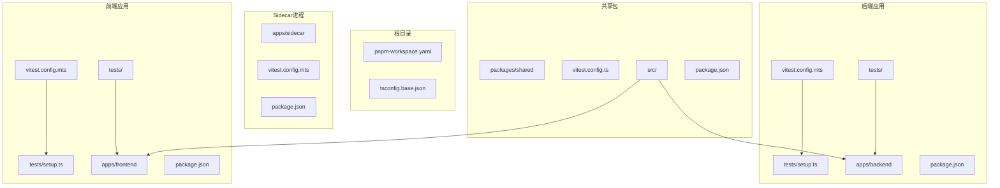
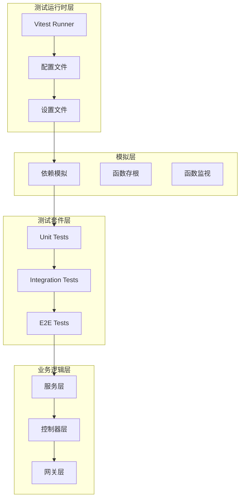
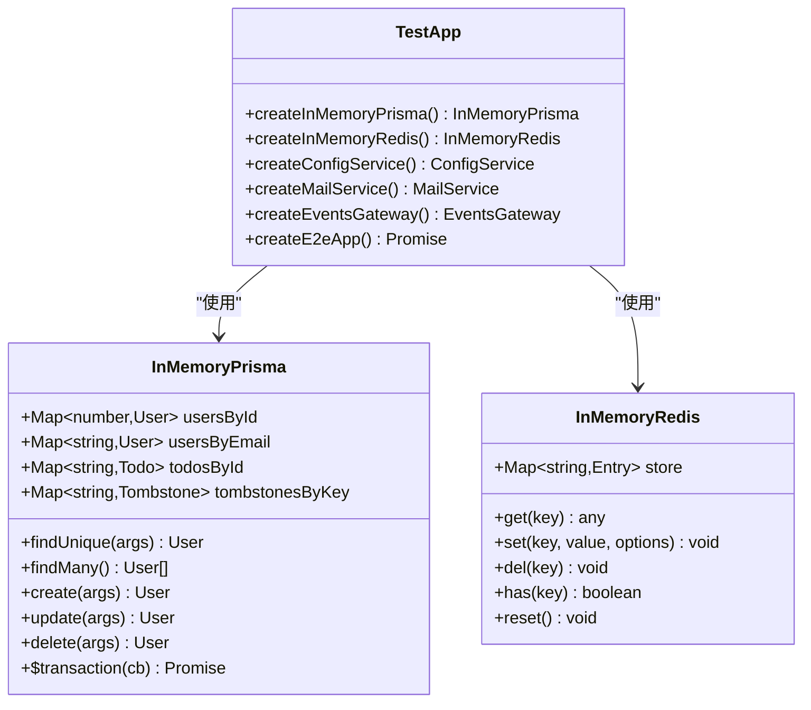
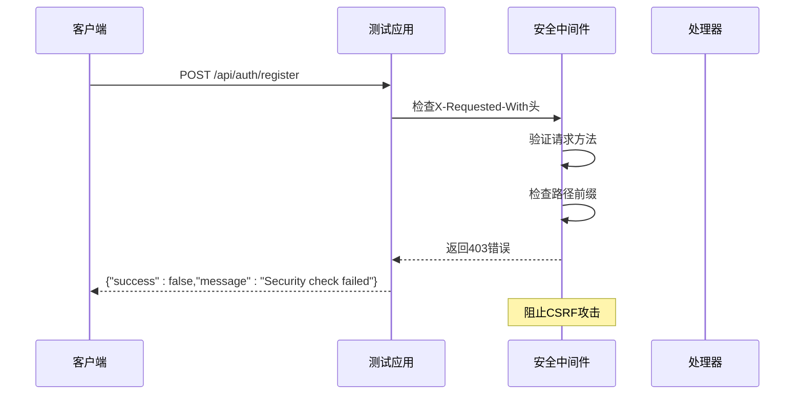
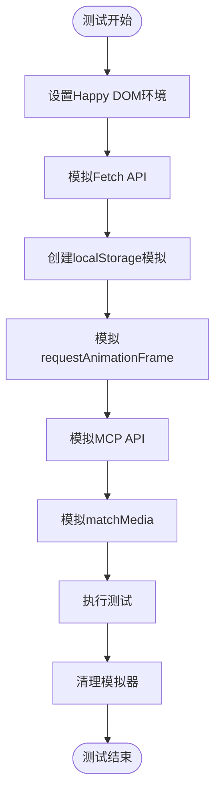
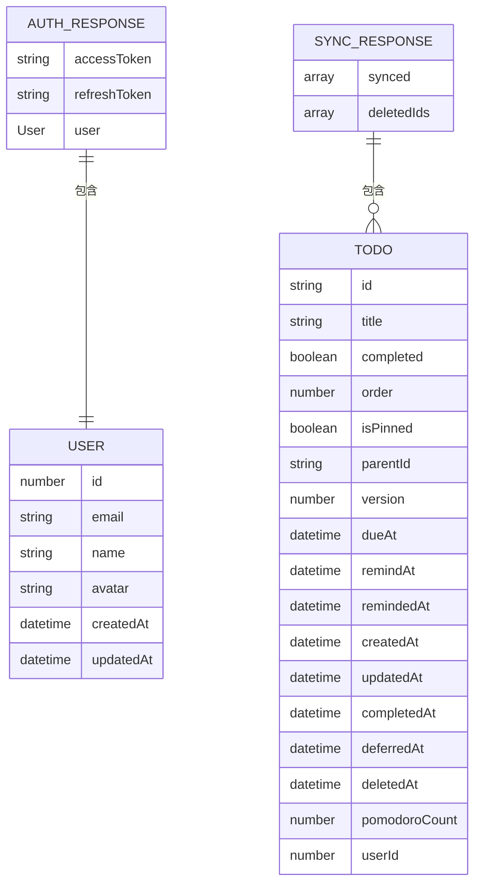
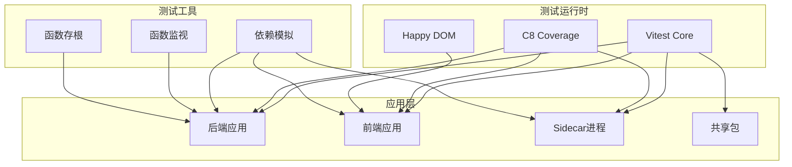

# 测试基础设施扩展

<cite>
**本文档引用的文件**
- [apps/backend/vitest.config.mts](file://apps/backend/vitest.config.mts)
- [apps/frontend/vitest.config.mts](file://apps/frontend/vitest.config.mts)
- [apps/sidecar/vitest.config.mts](file://apps/sidecar/vitest.config.mts)
- [packages/shared/vitest.config.ts](file://packages/shared/vitest.config.ts)
- [apps/backend/tests/setup.ts](file://apps/backend/tests/setup.ts)
- [apps/frontend/tests/setup.ts](file://apps/frontend/tests/setup.ts)
- [apps/backend/tests/e2e/test-app.ts](file://apps/backend/tests/e2e/test-app.ts)
- [apps/backend/tests/e2e/auth.e2e.spec.ts](file://apps/backend/tests/e2e/auth.e2e.spec.ts)
- [apps/backend/tests/e2e/todos.e2e.spec.ts](file://apps/backend/tests/e2e/todos.e2e.spec.ts)
- [apps/backend/package.json](file://apps/backend/package.json)
- [apps/frontend/package.json](file://apps/frontend/package.json)
- [apps/sidecar/package.json](file://apps/sidecar/package.json)
- [apps/backend/tests/auth/auth.service.spec.ts](file://apps/backend/tests/auth/auth.service.spec.ts)
- [apps/backend/tests/common/throttling.guard.spec.ts](file://apps/backend/tests/common/throttling.guard.spec.ts)
- [apps/frontend/tests/lib/utils.spec.ts](file://apps/frontend/tests/lib/utils.spec.ts)
- [packages/shared/src/index.ts](file://packages/shared/src/index.ts)
</cite>

## 目录
1. [简介](#简介)
2. [项目结构](#项目结构)
3. [核心组件](#核心组件)
4. [架构概览](#架构概览)
5. [详细组件分析](#详细组件分析)
6. [依赖关系分析](#依赖关系分析)
7. [性能考虑](#性能考虑)
8. [故障排除指南](#故障排除指南)
9. [结论](#结论)

## 简介

本项目采用多包架构（monorepo），包含后端 NestJS 应用、前端 Vue.js 应用、Sidecar 进程和共享包。测试基础设施经过精心设计，支持单元测试、集成测试和端到端测试，确保代码质量和系统稳定性。

测试框架采用 Vitest，提供快速的测试执行和丰富的断言功能。项目实现了完整的测试环境隔离、依赖注入模拟和真实环境模拟，为每个模块提供了可靠的测试保障。

## 项目结构

项目采用标准的 monorepo 结构，每个应用都有独立的测试配置和测试套件：

**图表来源**
- [apps/backend/vitest.config.mts:1-34](file://apps/backend/vitest.config.mts#L1-L34)
- [apps/frontend/vitest.config.mts:1-23](file://apps/frontend/vitest.config.mts#L1-L23)
- [apps/sidecar/vitest.config.mts:1-14](file://apps/sidecar/vitest.config.mts#L1-L14)

**章节来源**
- [apps/backend/package.json:1-109](file://apps/backend/package.json#L1-L109)
- [apps/frontend/package.json:1-105](file://apps/frontend/package.json#L1-L105)
- [apps/sidecar/package.json:1-34](file://apps/sidecar/package.json#L1-L34)

## 核心组件

### 测试配置系统

每个应用都配置了专门的 Vitest 配置文件，支持不同的测试环境和需求：

| 组件 | 测试环境 | 关键特性 |
|------|----------|----------|
| 后端应用 | Node.js | 全局设置文件、覆盖率报告、别名解析 |
| 前端应用 | Happy DOM | Vue 插件、浏览器环境模拟 |
| Sidecar | Node.js | 简化配置、基础覆盖率 |
| 共享包 | Node.js | 类型安全、别名解析 |

### 测试设置文件

每个应用都有专门的测试设置文件，用于配置测试环境和模拟依赖：

- **后端设置文件**：抑制 NestJS 日志输出，过滤特定错误消息
- **前端设置文件**：模拟浏览器 API，创建 localStorage 模拟器

**章节来源**
- [apps/backend/tests/setup.ts:1-66](file://apps/backend/tests/setup.ts#L1-L66)
- [apps/frontend/tests/setup.ts:1-134](file://apps/frontend/tests/setup.ts#L1-L134)

## 架构概览

测试基础设施采用分层架构，从底层的测试运行时到顶层的业务逻辑测试：

**图表来源**
- [apps/backend/vitest.config.mts:9-26](file://apps/backend/vitest.config.mts#L9-L26)
- [apps/frontend/vitest.config.mts:10-21](file://apps/frontend/vitest.config.mts#L10-L21)

## 详细组件分析

### 后端测试基础设施

后端测试基础设施是最复杂的部分，实现了完整的端到端测试环境：

#### 内存数据库模拟

**图表来源**
- [apps/backend/tests/e2e/test-app.ts:149-420](file://apps/backend/tests/e2e/test-app.ts#L149-L420)

#### 安全测试验证

后端实现了严格的安全测试，包括请求头验证和速率限制测试：

**图表来源**
- [apps/backend/tests/e2e/auth.e2e.spec.ts:30-62](file://apps/backend/tests/e2e/auth.e2e.spec.ts#L30-L62)

**章节来源**
- [apps/backend/tests/e2e/test-app.ts:1-567](file://apps/backend/tests/e2e/test-app.ts#L1-L567)
- [apps/backend/tests/e2e/auth.e2e.spec.ts:1-243](file://apps/backend/tests/e2e/auth.e2e.spec.ts#L1-L243)

### 前端测试基础设施

前端测试专注于用户界面和工具函数的测试：

#### 浏览器环境模拟

前端测试设置了完整的浏览器环境模拟：

**图表来源**
- [apps/frontend/tests/setup.ts:37-134](file://apps/frontend/tests/setup.ts#L37-L134)

#### 工具函数测试

前端实现了多个工具函数的测试，包括类名合并和文本高亮功能：

**章节来源**
- [apps/frontend/tests/setup.ts:1-134](file://apps/frontend/tests/setup.ts#L1-L134)
- [apps/frontend/tests/lib/utils.spec.ts:1-51](file://apps/frontend/tests/lib/utils.spec.ts#L1-L51)

### 共享包测试

共享包作为所有应用的依赖，提供了统一的数据传输对象和验证模式：

**图表来源**
- [packages/shared/src/index.ts:10-22](file://packages/shared/src/index.ts#L10-L22)

**章节来源**
- [packages/shared/src/index.ts:1-22](file://packages/shared/src/index.ts#L1-L22)

## 依赖关系分析

测试基础设施的依赖关系体现了清晰的分层设计：

**图表来源**
- [apps/backend/vitest.config.mts:21-25](file://apps/backend/vitest.config.mts#L21-L25)
- [apps/frontend/vitest.config.mts:10-21](file://apps/frontend/vitest.config.mts#L10-L21)

**章节来源**
- [apps/backend/package.json:99-106](file://apps/backend/package.json#L99-L106)
- [apps/frontend/package.json:82-102](file://apps/frontend/package.json#L82-L102)
- [apps/sidecar/package.json:25-32](file://apps/sidecar/package.json#L25-L32)

## 性能考虑

测试基础设施在性能方面采用了多项优化策略：

### 并行测试执行

- **最大工作进程**：每个应用配置了 50% 的 CPU 核心利用率
- **测试隔离**：每个测试文件在独立的上下文中运行
- **内存管理**：及时清理测试模拟器和缓存

### 覆盖率优化

- **目标排除**：排除类型定义文件和入口点文件
- **报告格式**：支持多种报告格式便于集成 CI/CD
- **增量测试**：支持选择性测试执行

### 测试环境优化

- **懒加载**：按需加载测试依赖
- **缓存机制**：利用 Vitest 的内置缓存
- **资源管理**：自动清理临时资源

## 故障排除指南

### 常见问题及解决方案

#### 测试超时问题

**症状**：测试执行时间过长或无限等待
**原因**：异步操作未正确处理或模拟器未清理
**解决方案**：
1. 检查 `beforeEach` 和 `afterEach` 钩子
2. 确保所有模拟器都被正确重置
3. 使用 `vi.clearAllMocks()` 清理模拟状态

#### 端到端测试失败

**症状**：E2E 测试在特定环境下失败
**原因**：环境变量或依赖版本不兼容
**解决方案**：
1. 验证 `createE2eApp()` 函数中的依赖注入
2. 检查测试应用的初始化顺序
3. 确认数据库和缓存服务的可用性

#### 前端测试渲染问题

**症状**：Vue 组件测试中出现渲染错误
**原因**：浏览器 API 模拟不完整
**解决方案**：
1. 检查 `setup.ts` 中的全局模拟配置
2. 验证 `localStorage` 和 `fetch` API 的模拟
3. 确认 `requestAnimationFrame` 的行为符合预期

**章节来源**
- [apps/backend/tests/setup.ts:1-66](file://apps/backend/tests/setup.ts#L1-L66)
- [apps/frontend/tests/setup.ts:85-101](file://apps/frontend/tests/setup.ts#L85-L101)

## 结论

本项目的测试基础设施展现了现代前端和后端应用的最佳实践。通过精心设计的分层架构、完善的模拟机制和严格的测试覆盖，确保了代码质量和系统的可靠性。

主要优势包括：

1. **全面的测试覆盖**：从单元测试到端到端测试的完整体系
2. **高效的测试执行**：并行处理和优化的资源配置
3. **真实的测试环境**：内存数据库和缓存模拟提供接近生产环境的测试体验
4. **可维护的架构**：清晰的分层设计和标准化的配置管理

建议持续改进的方向：
- 扩展测试用例的边界条件覆盖
- 集成更多的性能测试和压力测试
- 增强测试数据的多样性和复杂性
- 优化测试执行时间和资源消耗