# 测试策略与实践

<cite>
**本文引用的文件**
- [apps/backend/vitest.config.mts](file://apps/backend/vitest.config.mts)
- [apps/frontend/vitest.config.mts](file://apps/frontend/vitest.config.mts)
- [packages/shared/vitest.config.ts](file://packages/shared/vitest.config.ts)
- [apps/backend/package.json](file://apps/backend/package.json)
- [apps/frontend/package.json](file://apps/frontend/package.json)
- [packages/shared/package.json](file://packages/shared/package.json)
- [apps/backend/tests/setup.ts](file://apps/backend/tests/setup.ts)
- [apps/frontend/tests/setup.ts](file://apps/frontend/tests/setup.ts)
- [apps/backend/tests/e2e/test-app.ts](file://apps/backend/tests/e2e/test-app.ts)
- [apps/backend/tests/e2e/auth.e2e.spec.ts](file://apps/backend/tests/e2e/auth.e2e.spec.ts)
- [apps/backend/tests/e2e/todos.e2e.spec.ts](file://apps/backend/tests/e2e/todos.e2e.spec.ts)
- [apps/backend/tests/auth/auth.service.spec.ts](file://apps/backend/tests/auth/auth.service.spec.ts)
- [apps/backend/tests/ai-sync/memory.service.spec.ts](file://apps/backend/tests/ai-sync/memory.service.spec.ts)
- [apps/backend/tests/ai-sync/preset.service.spec.ts](file://apps/backend/tests/ai-sync/preset.service.spec.ts)
- [apps/backend/tests/ai-sync/skill.service.spec.ts](file://apps/backend/tests/ai-sync/skill.service.spec.ts)
- [apps/backend/tests/novel/novel.service.spec.ts](file://apps/backend/tests/novel/novel.service.spec.ts)
- [apps/backend/tests/teaching/teaching.service.spec.ts](file://apps/backend/tests/teaching/teaching.service.spec.ts)
- [apps/frontend/tests/components/Fireworks.spec.ts](file://apps/frontend/tests/components/Fireworks.spec.ts)
- [apps/frontend/tests/composables/useTodo.spec.ts](file://apps/frontend/tests/composables/useTodo.spec.ts)
- [apps/frontend/tests/features/ai/components/AISettingsDialog.spec.ts](file://apps/frontend/tests/features/ai/components/AISettingsDialog.spec.ts)
- [apps/frontend/tests/features/ai/composables/useAIConfig.spec.ts](file://apps/frontend/tests/features/ai/composables/useAIConfig.spec.ts)
- [apps/frontend/tests/features/ai/services/aiService-discussion-core.spec.ts](file://apps/frontend/tests/features/ai/services/aiService-discussion-core.spec.ts)
- [apps/frontend/tests/features/ai/components/ChatMessage.spec.ts](file://apps/frontend/tests/features/ai/components/ChatMessage.spec.ts)
- [apps/frontend/tests/features/ai/components/ChatMessageList.spec.ts](file://apps/frontend/tests/features/ai/components/ChatMessageList.spec.ts)
- [apps/frontend/tests/features/ai/components/ChatMinimap.spec.ts](file://apps/frontend/tests/features/ai/components/ChatMinimap.spec.ts)
- [apps/frontend/tests/features/todo/components/ThemeColorPicker.spec.ts](file://apps/frontend/tests/features/todo/components/ThemeColorPicker.spec.ts)
- [apps/frontend/tests/features/teaching/components/QuizHistoryList.spec.ts](file://apps/frontend/tests/features/teaching/components/QuizHistoryList.spec.ts)
- [apps/frontend/tests/features/teaching/views/TeachingDashboardView.spec.ts](file://apps/frontend/tests/features/teaching/views/TeachingDashboardView.spec.ts)
- [apps/frontend/tests/features/todo/TodoView.animation.spec.ts](file://apps/frontend/tests/features/todo/TodoView.animation.spec.ts)
- [apps/frontend/tests/router/index.spec.ts](file://apps/frontend/tests/router/index.spec.ts)
- [apps/frontend/tests/features/todo/components/TodoHeader.spec.ts](file://apps/frontend/tests/features/todo/components/TodoHeader.spec.ts)
- [apps/frontend/tests/features/ai/composables/useChatHistory.spec.ts](file://apps/frontend/tests/features/ai/composables/useChatHistory.spec.ts)
- [apps/frontend/tests/features/ai/composables/useChat.spec.ts](file://apps/frontend/tests/features/ai/composables/useChat.spec.ts)
- [apps/frontend/src/features/ai/components/ChatMessage.vue](file://apps/frontend/src/features/ai/components/ChatMessage.vue)
- [apps/frontend/src/features/todo/components/ThemeColorPicker.vue](file://apps/frontend/src/features/todo/components/ThemeColorPicker.vue)
- [apps/frontend/src/composables/useTheme.ts](file://apps/frontend/src/composables/useTheme.ts)
- [apps/frontend/src/features/ai/composables/useChatHistory.ts](file://apps/frontend/src/features/ai/composables/useChatHistory.ts)
- [apps/frontend/src/features/ai/composables/useChat.ts](file://apps/frontend/src/features/ai/composables/useChat.ts)
- [apps/frontend/src/features/ai/composables/useChatActions.stream.ts](file://apps/frontend/src/features/ai/composables/useChatActions.stream.ts)
- [apps/frontend/src/features/ai/composables/useChatActions.ts](file://apps/frontend/src/features/ai/composables/useChatActions.ts)
- [knip.json](file://knip.json)
- [scripts/check-boundaries.js](file://scripts/check-boundaries.js)
- [package.json](file://package.json)
</cite>

## 更新摘要

**所做更改**

- 更新了vitest配置文件的导入语句重组分析，展示了后端和前端配置的现代化改进
- 新增了TodoHeader组件图标测试桩、useChatHistory原子会话重载测试和useChatActions流式测试的详细分析
- 扩展了依赖关系分析章节，深入介绍了knip工具的配置和工作区设置
- 更新了测试覆盖率要求，反映了共享包覆盖率阈值的显著提升
- 完善了测试基础设施增强部分，涵盖了新增的测试策略和最佳实践

## 目录

1. [引言](#引言)
2. [项目结构](#项目结构)
3. [核心组件](#核心组件)
4. [架构总览](#架构总览)
5. [详细组件分析](#详细组件分析)
6. [新增功能测试覆盖](#新增功能测试覆盖)
7. [依赖关系分析](#依赖关系分析)
8. [性能考量](#性能考量)
9. [故障排查指南](#故障排查指南)
10. [结论](#结论)
11. [附录](#附录)

## 引言

本指南面向 Lumina Todo 的开发者，系统化构建覆盖单元测试、集成测试与端到端测试的测试保障体系。文档围绕 Vitest 配置、测试环境与 Mock 策略展开，涵盖前端组件与 Vue 组合式函数测试、后端服务与 API 测试、数据库与缓存模拟、以及测试覆盖率、持续集成中的测试执行与测试数据管理。同时给出测试驱动开发（TDD）与行为驱动开发（BDD）的实践建议，帮助团队高质量交付。

**更新** 本次更新重点集成了knip依赖分析工具，新增依赖边界检查和重复导入检测功能，扩展了测试策略以包含自动化依赖管理。更新了TodoHeader组件图标测试桩、useChatHistory原子会话重载测试和useChatActions流式测试，完善了AI聊天消息组件和主题颜色选择器的测试策略。

## 项目结构

Lumina Todo 采用多包工作区结构，包含后端 NestJS 应用、前端 Vue3 应用与共享包。测试分布在各应用与共享包的 tests 目录中，并通过各自 Vitest 配置进行统一管理。新增的knip工具提供跨工作区的依赖分析能力。

```mermaid
graph TB
subgraph "后端应用"
BE_PKG["apps/backend/package.json"]
BE_VITEST["apps/backend/vitest.config.mts"]
BE_SETUP["apps/backend/tests/setup.ts"]
BE_E2E["apps/backend/tests/e2e/*"]
BE_AI_SYNC["apps/backend/tests/ai-sync/*"]
BE_NOVEL["apps/backend/tests/novel/*"]
BE_TEACHING["apps/backend/tests/teaching/*"]
end
subgraph "前端应用"
FE_PKG["apps/frontend/package.json"]
FE_VITEST["apps/frontend/vitest.config.mts"]
FE_SETUP["apps/frontend/tests/setup.ts"]
FE_AI["apps/frontend/tests/features/ai/*"]
FE_TODO["apps/frontend/tests/features/todo/*"]
FE_TEACHING["apps/frontend/tests/features/teaching/*"]
end
subgraph "共享包"
SH_PKG["packages/shared/package.json"]
SH_VITEST["packages/shared/vitest.config.ts"]
end
subgraph "依赖分析工具"
KNIPTOOL["knip.json 配置"]
CHECKBOUND["check-boundaries.js"]
END
BE_PKG --> BE_VITEST
BE_VITEST --> BE_SETUP
BE_VITEST --> BE_E2E
BE_VITEST --> BE_AI_SYNC
BE_VITEST --> BE_NOVEL
BE_VITEST --> BE_TEACHING
FE_PKG --> FE_VITEST
FE_VITEST --> FE_SETUP
FE_VITEST --> FE_AI
FE_VITEST --> FE_TODO
FE_VITEST --> FE_TEACHING
SH_PKG --> SH_VITEST
KNIPTOOL --> CHECKBOUND
```

**图表来源**

- [apps/backend/package.json:1-109](file://apps/backend/package.json#L1-L109)
- [apps/backend/vitest.config.mts:1-39](file://apps/backend/vitest.config.mts#L1-L39)
- [apps/backend/tests/setup.ts:1-66](file://apps/backend/tests/setup.ts#L1-L66)
- [apps/backend/tests/e2e/test-app.ts:1-568](file://apps/backend/tests/e2e/test-app.ts#L1-L568)
- [apps/backend/tests/ai-sync/memory.service.spec.ts:1-65](file://apps/backend/tests/ai-sync/memory.service.spec.ts#L1-L65)
- [apps/backend/tests/novel/novel.service.spec.ts:1-337](file://apps/backend/tests/novel/novel.service.spec.ts#L1-L337)
- [apps/backend/tests/teaching/teaching.service.spec.ts:1-198](file://apps/backend/tests/teaching/teaching.service.spec.ts#L1-L198)
- [apps/frontend/package.json:1-105](file://apps/frontend/package.json#L1-L105)
- [apps/frontend/vitest.config.mts:1-22](file://apps/frontend/vitest.config.mts#L1-L22)
- [apps/frontend/tests/setup.ts:1-134](file://apps/frontend/tests/setup.ts#L1-L134)
- [apps/frontend/tests/features/ai/components/AISettingsDialog.spec.ts:1-487](file://apps/frontend/tests/features/ai/components/AISettingsDialog.spec.ts#L1-L487)
- [apps/frontend/tests/features/teaching/components/QuizHistoryList.spec.ts:1-100](file://apps/frontend/tests/features/teaching/components/QuizHistoryList.spec.ts#L1-L100)
- [knip.json:1-58](file://knip.json#L1-L58)
- [scripts/check-boundaries.js:1-100](file://scripts/check-boundaries.js#L1-L100)

**章节来源**

- [apps/backend/package.json:1-109](file://apps/backend/package.json#L1-L109)
- [apps/frontend/package.json:1-105](file://apps/frontend/package.json#L1-L105)
- [packages/shared/package.json:1-52](file://packages/shared/package.json#L1-L52)
- [knip.json:1-58](file://knip.json#L1-L58)
- [scripts/check-boundaries.js:1-100](file://scripts/check-boundaries.js#L1-L100)

## 核心组件

- 测试运行器与配置
  - 后端：Vitest + Node 环境，启用全局变量、UTC 时区、覆盖率报告、路径别名与 setup 文件。
  - 前端：Vitest + happy-dom 环境，Vue 插件、路径别名与 setup 文件。
  - 共享包：Vitest + Node 环境，覆盖率配置。
- 测试环境初始化
  - 后端：抑制日志噪声、过滤特定异常输出、重写 stdout/stderr。
  - 前端：模拟 localStorage、requestAnimationFrame、fetch、window.matchMedia；清理定时器与 Mock 状态。
- 端到端测试应用工厂
  - 内存版 Prisma、Redis、Config、Mail、Events 等服务替换，注入 Cookie 插件与安全钩子，提供 inject 工具发起请求。
- 覆盖率与脚本
  - 后端与前端均提供 test、test:watch、test:coverage 脚本；共享包提供相应脚本。
- **新增** 依赖分析工具
  - knip：提供依赖边界检查、重复导入检测和文件/依赖分析功能。
  - check-boundaries.js：自定义依赖边界检查脚本，防止架构层之间的循环依赖。

**章节来源**

- [apps/backend/vitest.config.mts:1-39](file://apps/backend/vitest.config.mts#L1-L39)
- [apps/frontend/vitest.config.mts:1-22](file://apps/frontend/vitest.config.mts#L1-L22)
- [packages/shared/vitest.config.ts:1-28](file://packages/shared/vitest.config.ts#L1-L28)
- [apps/backend/tests/setup.ts:1-66](file://apps/backend/tests/setup.ts#L1-L66)
- [apps/frontend/tests/setup.ts:1-134](file://apps/frontend/tests/setup.ts#L1-L134)
- [apps/backend/tests/e2e/test-app.ts:1-568](file://apps/backend/tests/e2e/test-app.ts#L1-L568)
- [apps/backend/package.json:23-29](file://apps/backend/package.json#L23-L29)
- [apps/frontend/package.json:19-28](file://apps/frontend/package.json#L19-L28)
- [packages/shared/package.json:28-40](file://packages/shared/package.json#L28-L40)
- [knip.json:1-58](file://knip.json#L1-L58)
- [scripts/check-boundaries.js:1-100](file://scripts/check-boundaries.js#L1-L100)

## 架构总览

下图展示测试分层与交互：单元测试聚焦服务与组合式函数；集成测试在 Nest 模块上下文验证控制器与服务；端到端测试通过内存存储与安全钩子验证 API 行为与业务流程。新增的knip工具提供跨工作区的依赖分析和边界检查。

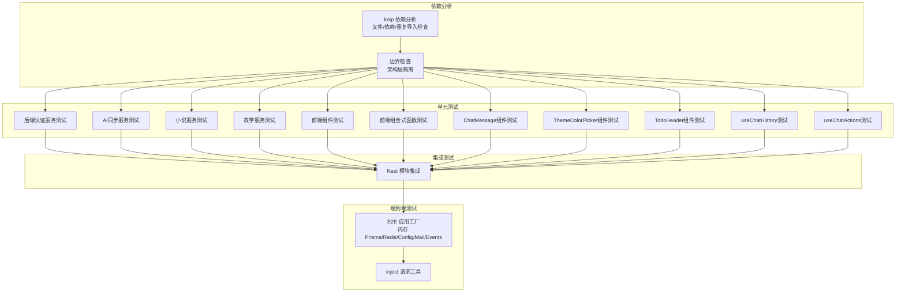

**图表来源**

- [apps/backend/tests/auth/auth.service.spec.ts:1-177](file://apps/backend/tests/auth/auth.service.spec.ts#L1-L177)
- [apps/backend/tests/ai-sync/memory.service.spec.ts:1-65](file://apps/backend/tests/ai-sync/memory.service.spec.ts#L1-L65)
- [apps/backend/tests/novel/novel.service.spec.ts:1-337](file://apps/backend/tests/novel/novel.service.spec.ts#L1-L337)
- [apps/backend/tests/teaching/teaching.service.spec.ts:1-198](file://apps/backend/tests/teaching/teaching.service.spec.ts#L1-L198)
- [apps/frontend/tests/components/Fireworks.spec.ts:1-66](file://apps/frontend/tests/components/Fireworks.spec.ts#L1-L66)
- [apps/frontend/tests/composables/useTodo.spec.ts:1-419](file://apps/frontend/tests/composables/useTodo.spec.ts#L1-L419)
- [apps/frontend/tests/features/ai/components/ChatMessage.spec.ts:1-787](file://apps/frontend/tests/features/ai/components/ChatMessage.spec.ts#L1-L787)
- [apps/frontend/tests/features/todo/components/ThemeColorPicker.spec.ts:1-175](file://apps/frontend/tests/features/todo/components/ThemeColorPicker.spec.ts#L1-L175)
- [apps/frontend/tests/features/todo/components/TodoHeader.spec.ts:1-270](file://apps/frontend/tests/features/todo/components/TodoHeader.spec.ts#L1-L270)
- [apps/frontend/tests/features/ai/composables/useChatHistory.spec.ts:1-299](file://apps/frontend/tests/features/ai/composables/useChatHistory.spec.ts#L1-L299)
- [apps/frontend/tests/features/ai/composables/useChat.spec.ts:1-1043](file://apps/frontend/tests/features/ai/composables/useChat.spec.ts#L1-L1043)
- [apps/backend/tests/e2e/test-app.ts:466-568](file://apps/backend/tests/e2e/test-app.ts#L466-L568)
- [knip.json:1-58](file://knip.json#L1-L58)
- [scripts/check-boundaries.js:1-100](file://scripts/check-boundaries.js#L1-L100)

## 详细组件分析

### 后端认证服务测试（单元）

- 目标：验证用户校验、登录、登出、刷新令牌等核心逻辑。
- 方法：对 UsersService、TokenService、PasswordService 进行 Mock，断言返回值与调用次数。
- 关键点：
  - 登录失败抛出未授权异常。
  - 刷新令牌时黑名单与会话失效检查。
  - 返回值不泄露密码字段。

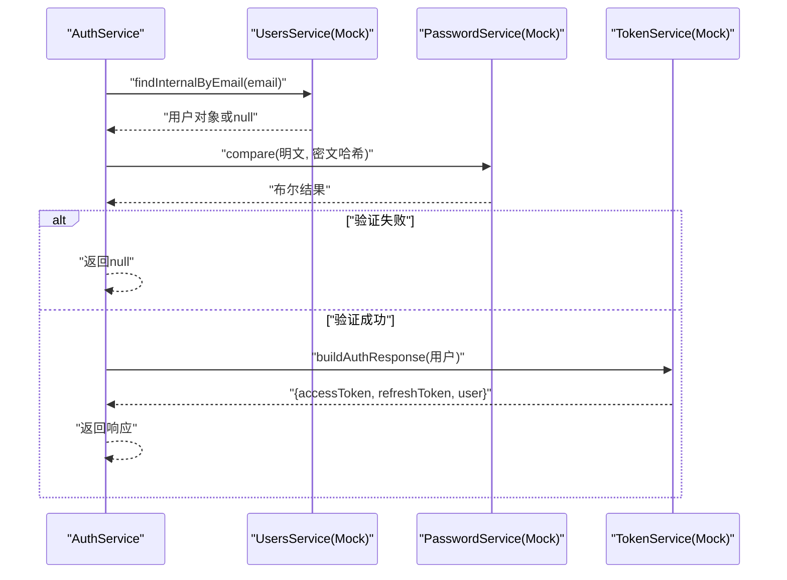

**图表来源**

- [apps/backend/tests/auth/auth.service.spec.ts:34-177](file://apps/backend/tests/auth/auth.service.spec.ts#L34-L177)

**章节来源**

- [apps/backend/tests/auth/auth.service.spec.ts:1-177](file://apps/backend/tests/auth/auth.service.spec.ts#L1-L177)

### 前端组件测试（示例：Fireworks）

- 目标：验证组件在属性变化时的行为与事件发射。
- 方法：使用 @vue/test-utils 挂载组件，Mock 外部依赖（如 canvas-confetti），使用 fake timers 控制异步。
- 关键点：
  - active=false 时不触发特效。
  - active 切换为 true 后触发特效。
  - 完成后发射 complete 事件。

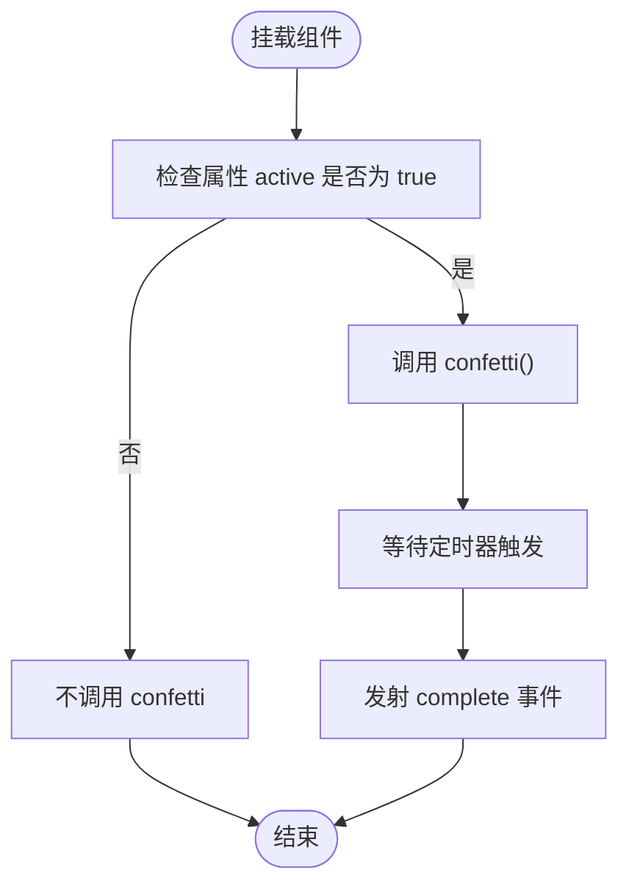

**图表来源**

- [apps/frontend/tests/components/Fireworks.spec.ts:12-66](file://apps/frontend/tests/components/Fireworks.spec.ts#L12-L66)

**章节来源**

- [apps/frontend/tests/components/Fireworks.spec.ts:1-66](file://apps/frontend/tests/components/Fireworks.spec.ts#L1-L66)

### 前端组合式函数测试（示例：useTodo）

- 目标：验证状态、副作用、键盘快捷键与 Store 交互。
- 方法：withSetup 辅助函数创建带生命周期的测试上下文；Mock Pinia、Toast、I18n、Todo Store。
- 关键点：
  - 搜索输入去抖更新 Store。
  - 添加/编辑/切换任务的边界条件（空标题、重复标题）。
  - 全局快捷键在不同平台与焦点场景下的行为。

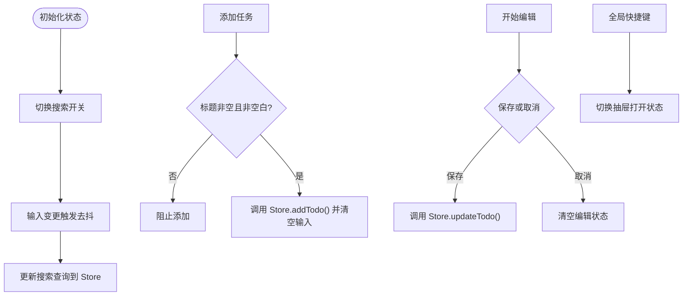

**图表来源**

- [apps/frontend/tests/composables/useTodo.spec.ts:64-419](file://apps/frontend/tests/composables/useTodo.spec.ts#L64-L419)

**章节来源**

- [apps/frontend/tests/composables/useTodo.spec.ts:1-419](file://apps/frontend/tests/composables/useTodo.spec.ts#L1-L419)

### 前端路由标题测试（示例：router/index）

- 目标：验证路由切换时文档标题的国际化拼接。
- 方法：Mock 页面组件以减少开销；切换路由后断言 document.title。
- 关键点：首页显示完整应用名；登录/注册页显示"页面标题 - 应用名"。

**章节来源**

- [apps/frontend/tests/router/index.spec.ts:1-55](file://apps/frontend/tests/router/index.spec.ts#L1-L55)

### 端到端测试（认证与待办）

- 认证 E2E
  - 安全头校验：非 GET 请求缺失 X-Requested-With 将被拒绝。
  - 注册、登录、刷新、登出流程与错误处理。
  - 速率限制：注册与无效登录尝试的限流行为。
- 待办 E2E
  - 创建、软删除、恢复、永久删除与同步一致性。

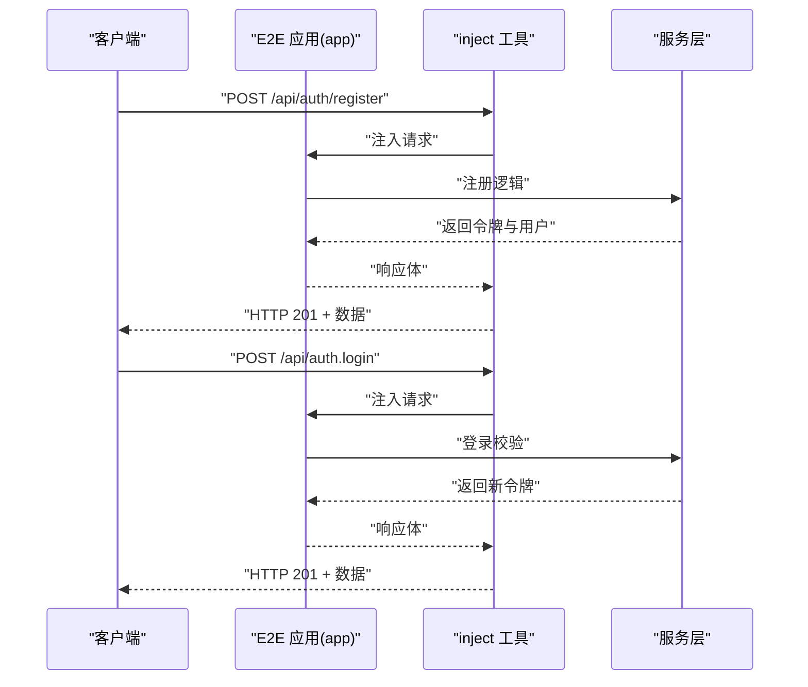

**图表来源**

- [apps/backend/tests/e2e/auth.e2e.spec.ts:64-153](file://apps/backend/tests/e2e/auth.e2e.spec.ts#L64-L153)
- [apps/backend/tests/e2e/test-app.ts:547-568](file://apps/backend/tests/e2e/test-app.ts#L547-L568)

**章节来源**

- [apps/backend/tests/e2e/auth.e2e.spec.ts:1-243](file://apps/backend/tests/e2e/auth.e2e.spec.ts#L1-L243)
- [apps/backend/tests/e2e/todos.e2e.spec.ts:1-203](file://apps/backend/tests/e2e/todos.e2e.spec.ts#L1-L203)
- [apps/backend/tests/e2e/test-app.ts:1-568](file://apps/backend/tests/e2e/test-app.ts#L1-L568)

### 前端视图动画与状态测试（示例：TodoView 动画）

- 目标：验证视图挂载时机、动画执行与状态切换（迷你模式、抽屉）。
- 方法：Mock GSAP、Todo/Pomodoro Store、useWindowSize、useI18n；断言动画调用与副作用。
- 关键点：初始挂载不执行入场动画；退出迷你模式后恢复输入间距；持久化状态控制 AI 抽屉挂载。

**章节来源**

- [apps/frontend/tests/features/todo/TodoView.animation.spec.ts:1-151](file://apps/frontend/tests/features/todo/TodoView.animation.spec.ts#L1-L151)

## 新增功能测试覆盖

### TodoHeader组件图标测试桩

#### Lucide图标组件测试桩

- 目标：验证TodoHeader中lucide-vue-next图标的正确渲染和交互。
- 方法：使用defineComponent创建图标组件的测试桩，模拟图标模板渲染。
- 关键点：
  - 所有Lucide图标组件都通过测试桩渲染为简单的span元素。
  - 图标名称与span文本内容对应，便于断言。
  - 支持多种图标类型：Snowflake、Clover、Languages、Network等。

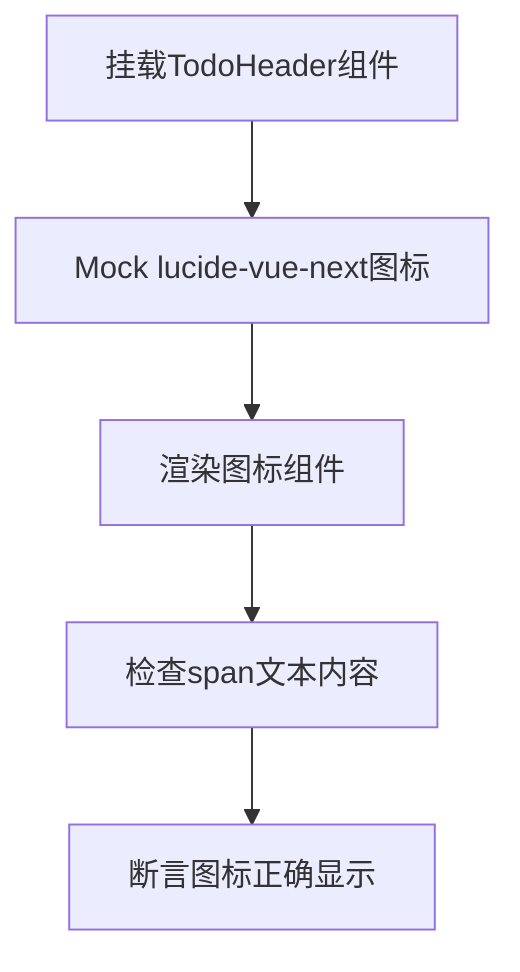

**图表来源**

- [apps/frontend/tests/features/todo/components/TodoHeader.spec.ts:26-53](file://apps/frontend/tests/features/todo/components/TodoHeader.spec.ts#L26-L53)

**章节来源**

- [apps/frontend/tests/features/todo/components/TodoHeader.spec.ts:1-270](file://apps/frontend/tests/features/todo/components/TodoHeader.spec.ts#L1-L270)

#### 语言切换按钮测试

- 目标：验证语言切换功能的正确实现。
- 方法：通过DropdownMenuItem stub触发点击事件，测试语言切换逻辑。
- 关键点：
  - 初始语言为zh-CN，点击后切换到en-US。
  - 语言切换状态保存到localStorage。
  - 支持双向切换：zh-CN ↔ en-US。

**章节来源**

- [apps/frontend/tests/features/todo/components/TodoHeader.spec.ts:167-210](file://apps/frontend/tests/features/todo/components/TodoHeader.spec.ts#L167-L210)

### useChatHistory原子会话重载测试

#### 原子会话重载一致性测试

- 目标：验证会话重载过程中的原子性，确保currentSessionId不会瞬态变为null。
- 方法：创建多个会话，添加消息，触发\_loadSessions()重载。
- 关键点：
  - 重载前后sessions数量保持不变。
  - currentSessionId值保持一致。
  - 会话消息内容完整保留。

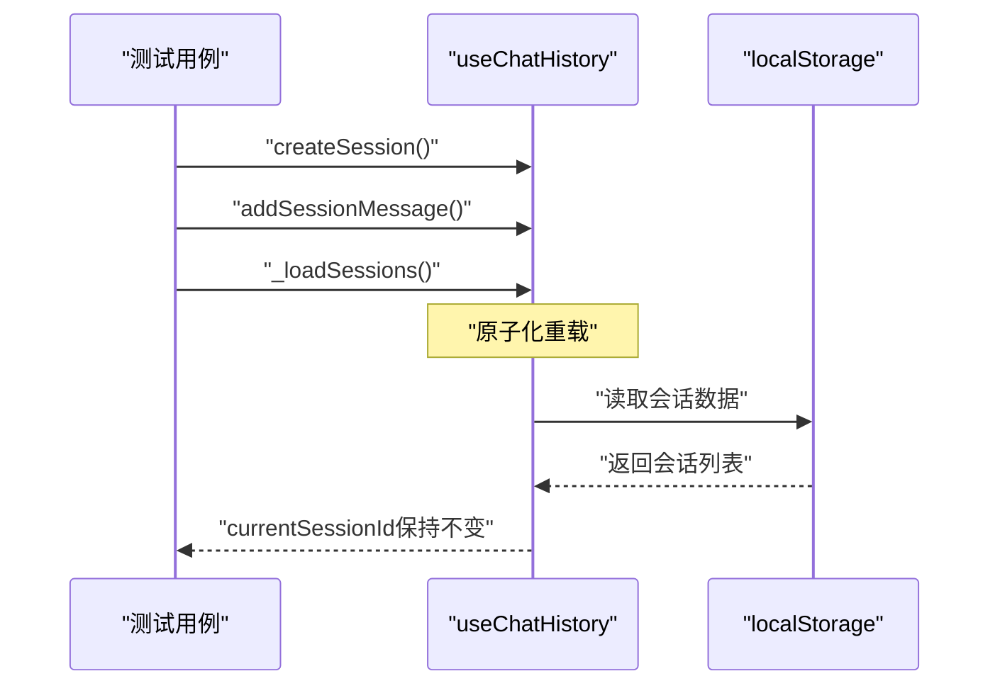

**图表来源**

- [apps/frontend/tests/features/ai/composables/useChatHistory.spec.ts:230-248](file://apps/frontend/tests/features/ai/composables/useChatHistory.spec.ts#L230-L248)

**章节来源**

- [apps/frontend/tests/features/ai/composables/useChatHistory.spec.ts:230-248](file://apps/frontend/tests/features/ai/composables/useChatHistory.spec.ts#L230-L248)

#### 会话持久化和重新加载测试

- 目标：验证新会话创建后能够正确持久化并在页面刷新后重新加载。
- 方法：创建会话，触发watcher保存，模拟页面刷新重新加载。
- 关键点：
  - 新会话立即保存到localStorage。
  - 页面刷新后\_currentSessionId保持一致。
  - 会话列表完整恢复。

**章节来源**

- [apps/frontend/tests/features/ai/composables/useChatHistory.spec.ts:44-93](file://apps/frontend/tests/features/ai/composables/useChatHistory.spec.ts#L44-L93)

### useChatActions流式测试更新

#### 流式状态管理测试

- 目标：验证useChatActions中isGenerating状态的正确管理。
- 方法：测试流式响应处理、状态重置和错误处理。
- 关键点：
  - 流式响应完成后isGenerating状态正确重置。
  - [ABORTED]标记时的异常处理。
  - 流式内容的累积和最终处理。

**章节来源**

- [apps/frontend/tests/features/ai/composables/useChat.spec.ts:839-845](file://apps/frontend/tests/features/ai/composables/useChat.spec.ts#L839-L845)

#### 结构化块持久化测试

- 目标：验证流式响应中的结构化块能够正确持久化到最终消息中。
- 方法：模拟包含结构化块的流式响应，测试最终消息的属性。
- 关键点：
  - pendingStructuredBlocks属性正确包含结构化块类型。
  - 流式响应完成后结构化块状态转移。
  - 多种结构化块类型的处理。

**章节来源**

- [apps/frontend/tests/features/ai/composables/useChat.spec.ts:822-836](file://apps/frontend/tests/features/ai/composables/useChat.spec.ts#L822-L836)

### ChatMessage组件对齐和宽度约束测试

#### 用户消息气泡对齐约束测试

- 目标：验证用户消息气泡的对齐方式和最大宽度约束。
- 方法：挂载ChatMessage组件，传入用户消息，断言CSS类和样式属性。
- 关键点：
  - 用户消息容器使用右对齐（items-end）。
  - 用户消息最大宽度约束为76%。
  - 气泡元素具有自适应宽度（w-fit）。

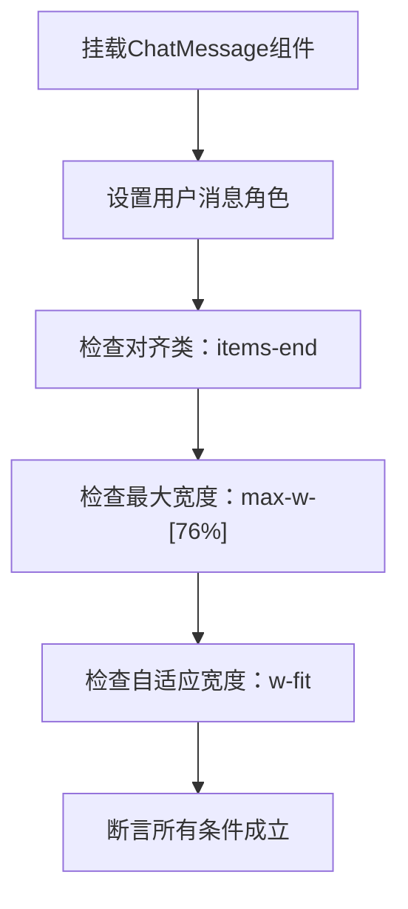

**图表来源**

- [apps/frontend/tests/features/ai/components/ChatMessage.spec.ts:101-108](file://apps/frontend/tests/features/ai/components/ChatMessage.spec.ts#L101-L108)

**章节来源**

- [apps/frontend/tests/features/ai/components/ChatMessage.spec.ts:66-108](file://apps/frontend/tests/features/ai/components/ChatMessage.spec.ts#L66-L108)

#### 图片生成气泡特殊处理测试

- 目标：验证AI图片生成状态下的气泡样式处理。
- 方法：挂载ChatMessage组件，传入图片生成消息，断言样式类。
- 关键点：
  - 图片生成气泡移除内边距（p-0）。
  - 不应用助手样式类（ai-chat-message--assistant）。

**章节来源**

- [apps/frontend/tests/features/ai/components/ChatMessage.spec.ts:110-130](file://apps/frontend/tests/features/ai/components/ChatMessage.spec.ts#L110-L130)

### ThemeColorPicker组件完整测试覆盖

#### 主题预设和推荐颜色指示器测试

- 目标：验证主题预设按钮的排列、颜色显示和推荐标记功能。
- 方法：Mock useTheme组合式函数，挂载ThemeColorPicker组件，断言DOM结构和样式。
- 关键点：
  - 丁香色（lilacGray）预设位于中间位置。
  - 推荐预设标记数量为5个（celadon、mistBlue、lilacGray、autumnGold、warmOrange）。
  - 随机预设不显示推荐标记。
  - 预设网格布局在不同屏幕尺寸下的列数。

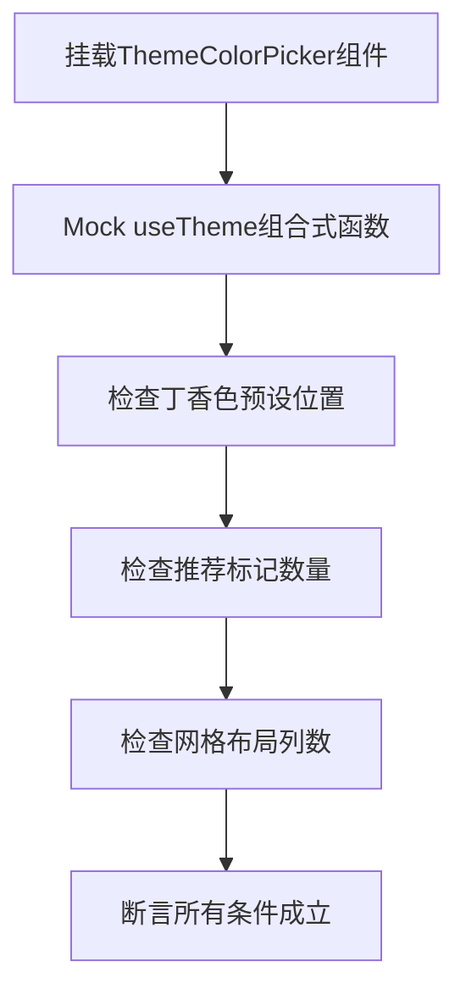

**图表来源**

- [apps/frontend/tests/features/todo/components/ThemeColorPicker.spec.ts:61-110](file://apps/frontend/tests/features/todo/components/ThemeColorPicker.spec.ts#L61-L110)

**章节来源**

- [apps/frontend/tests/features/todo/components/ThemeColorPicker.spec.ts:60-110](file://apps/frontend/tests/features/todo/components/ThemeColorPicker.spec.ts#L60-L110)

#### 尺寸变体和随机颜色功能测试

- 目标：验证ThemeColorPicker的尺寸变体和随机颜色功能。
- 方法：测试sm、md、lg三种尺寸的按钮大小，验证随机颜色的显示效果。
- 关键点：
  - 尺寸变体对应不同的按钮尺寸和图标大小。
  - 随机颜色预设的渐变背景效果。
  - 自定义颜色输入框的实时颜色显示。

**章节来源**

- [apps/frontend/tests/features/todo/components/ThemeColorPicker.spec.ts:112-175](file://apps/frontend/tests/features/todo/components/ThemeColorPicker.spec.ts#L112-L175)

### AI聊天消息组件测试扩展

#### ChatMessage组件综合测试

- 目标：验证AI聊天消息组件的完整功能，包括讨论步骤、思维面板和结构化块。
- 方法：测试讨论步骤渲染、思维状态切换、结构化块加载状态等功能。
- 关键点：
  - 讨论步骤的状态显示（完成、思考中、错误）。
  - 思维面板的展开/收起功能和动画效果。
  - 结构化块的骨架屏加载状态和诊断信息复制功能。

**章节来源**

- [apps/frontend/tests/features/ai/components/ChatMessage.spec.ts:132-787](file://apps/frontend/tests/features/ai/components/ChatMessage.spec.ts#L132-787)

#### ChatMessageList组件性能窗口测试

- 目标：验证消息列表的虚拟滚动和性能优化。
- 方法：测试消息窗口的默认渲染数量和历史消息加载功能。
- 关键点：
  - 默认只渲染尾部窗口（200条消息）。
  - 点击"加载更多"按钮可以逐步加载历史消息。
  - 初始挂载时不应用会话进入的延时动画。

**章节来源**

- [apps/frontend/tests/features/ai/components/ChatMessageList.spec.ts:42-109](file://apps/frontend/tests/features/ai/components/ChatMessageList.spec.ts#L42-109)

#### ChatMinimap组件交互测试

- 目标：验证聊天消息小地图的导航和滚动功能。
- 方法：测试文档消息的文本显示、隐藏消息的动态加载和活动锚点计算。
- 关键点：
  - 文档消息显示"[Document]"替代文本。
  - 通过ensureMessageVisible方法动态加载隐藏消息。
  - 活动锚点的高亮状态和滚动条位置计算。

**章节来源**

- [apps/frontend/tests/features/ai/components/ChatMinimap.spec.ts:87-229](file://apps/frontend/tests/features/ai/components/ChatMinimap.spec.ts#L87-229)

### AI同步功能测试

#### AI记忆服务测试

- 目标：验证AI记忆数据的获取、创建和更新逻辑。
- 方法：Mock PrismaService的aiMemory操作，测试默认值返回、存储数据读取和upsert操作。
- 关键点：
  - 无记录时返回默认值（空记忆数组、禁用状态、30阈值）。
  - 存储数据正确序列化和反序列化。
  - upsert操作正确处理创建和更新场景。

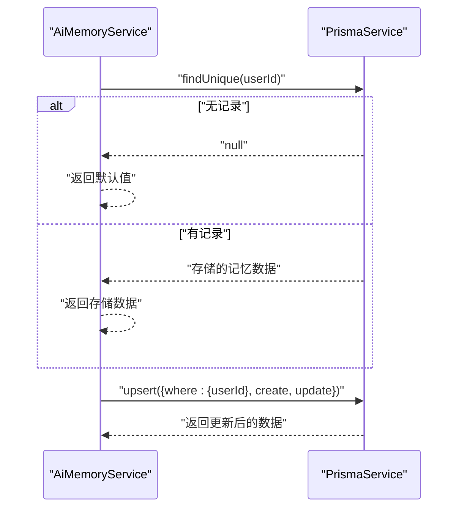

**图表来源**

- [apps/backend/tests/ai-sync/memory.service.spec.ts:24-54](file://apps/backend/tests/ai-sync/memory.service.spec.ts#L24-L54)

**章节来源**

- [apps/backend/tests/ai-sync/memory.service.spec.ts:1-65](file://apps/backend/tests/ai-sync/memory.service.spec.ts#L1-L65)

#### AI预设服务测试

- 目标：验证AI预设的查询、批量插入和事务处理。
- 方法：Mock PrismaService的$transaction，测试预设列表查询和批量替换。
- 关键点：
  - 预设数据结构验证，禁止包含敏感字段（如apiKey）。
  - 事务中先删除后创建的原子性操作。
  - 空数组场景的正确处理。

**章节来源**

- [apps/backend/tests/ai-sync/preset.service.spec.ts:1-85](file://apps/backend/tests/ai-sync/preset.service.spec.ts#L1-L85)

#### AI技能服务测试

- 目标：验证AI技能的查询和批量同步功能。
- 方法：Mock PrismaService的$transaction，测试技能列表获取和批量upsert。
- 关键点：
  - 技能数据的完整性和有效性验证。
  - 事务操作确保数据一致性。
  - 空技能数组的边界条件处理。

**章节来源**

- [apps/backend/tests/ai-sync/skill.service.spec.ts:1-72](file://apps/backend/tests/ai-sync/skill.service.spec.ts#L1-L72)

### 小说管理功能测试

#### 小说服务测试

- 目标：验证小说创作全流程的数据管理。
- 方法：Mock PrismaService的多个表操作，测试草稿、章节、角色和世界观的CRUD。
- 关键点：
  - 草稿的创建、查询、删除和权限验证。
  - 章节的唯一性约束和upsert逻辑。
  - 角色和世界观的版本控制机制。
  - 批量导出功能的数据完整性。

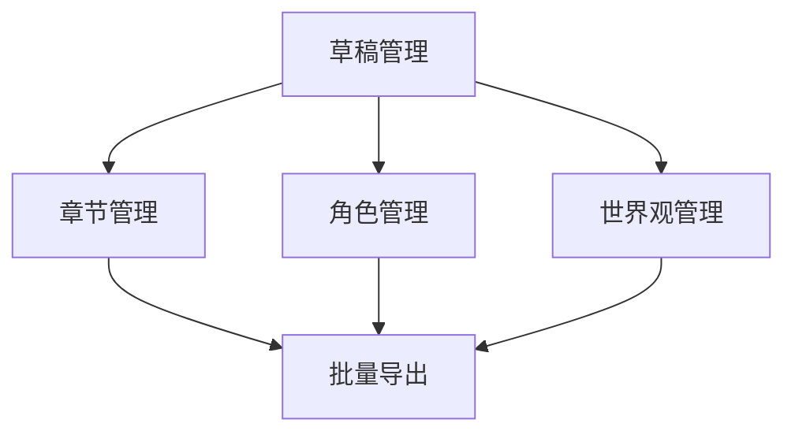

**图表来源**

- [apps/backend/tests/novel/novel.service.spec.ts:71-337](file://apps/backend/tests/novel/novel.service.spec.ts#L71-L337)

**章节来源**

- [apps/backend/tests/novel/novel.service.spec.ts:1-337](file://apps/backend/tests/novel/novel.service.spec.ts#L1-L337)

### 教学模式功能测试

#### 教学服务测试

- 目标：验证教学评估和学习进度跟踪功能。
- 方法：Mock PrismaService的学习进度和测验记录操作。
- 关键点：
  - 测验记录的单条和批量保存。
  - 学习进度的创建、更新和累积计算。
  - 概览统计的正确性（准确率计算）。
  - 数据导出的完整性验证。

**章节来源**

- [apps/backend/tests/teaching/teaching.service.spec.ts:1-198](file://apps/backend/tests/teaching/teaching.service.spec.ts#L1-L198)

### 前端AI功能测试

#### AI设置对话框测试

- 目标：验证AI设置界面的交互逻辑和数据绑定。
- 方法：Mock所有依赖的组合式函数和图标组件，测试标签切换、预设管理和配置同步。
- 关键点：
  - 预设切换时的配置更新和技能ID同步。
  - 设置标签间的正确切换和组件渲染。
  - 关闭时的自动保存逻辑（编辑模式vs创建模式）。

**章节来源**

- [apps/frontend/tests/features/ai/components/AISettingsDialog.spec.ts:1-487](file://apps/frontend/tests/features/ai/components/AISettingsDialog.spec.ts#L1-L487)

#### AI配置组合式函数测试

- 目标：验证AI配置的状态管理、持久化和导入导出功能。
- 方法：测试localStorage集成、配置验证、预设导入导出、技能管理等核心功能。
- 关键点：
  - 配置的默认值和localStorage持久化。
  - 预设的合并导入和替换导入模式。
  - 技能的运行时元数据迁移和验证。
  - 外部源技能的安装和代理下载流程。

**章节来源**

- [apps/frontend/tests/features/ai/composables/useAIConfig.spec.ts:1-800](file://apps/frontend/tests/features/ai/composables/useAIConfig.spec.ts#L1-L800)

#### AI讨论服务测试

- 目标：验证多模型并行讨论和回退机制。
- 方法：Mock fetch API，测试单模型回退、多模型并行处理和错误回退。
- 关键点：
  - 讨论模式的启用条件和模型选择。
  - 并行请求的正确处理和结果合成。
  - 错误情况下的主模型直接回答回退。

**章节来源**

- [apps/frontend/tests/features/ai/services/aiService-discussion-core.spec.ts:1-156](file://apps/frontend/tests/features/ai/services/aiService-discussion-core.spec.ts#L1-L156)

#### useChat组合式函数测试

- 目标：验证useChat组合式函数的完整功能，包括流式处理、状态管理和错误处理。
- 方法：测试流式响应处理、状态重置、错误重试和消息管理。
- 关键点：
  - 流式响应的正确解析和状态更新。
  - [DONE]和[ABORTED]标记的处理。
  - 结构化块的持久化和最终消息处理。
  - 提议的待办事项动作的正确处理。

**章节来源**

- [apps/frontend/tests/features/ai/composables/useChat.spec.ts:1-1043](file://apps/frontend/tests/features/ai/composables/useChat.spec.ts#L1-L1043)

### 前端教学功能测试

#### 教学组件测试

- 目标：验证教学模式的界面组件功能。
- 方法：测试测验历史列表和教学仪表板视图的渲染和交互。
- 关键点：
  - 测验历史的数据展示和排序。
  - 教学仪表板的概览信息显示。

**章节来源**

- [apps/frontend/tests/features/teaching/components/QuizHistoryList.spec.ts:1-100](file://apps/frontend/tests/features/teaching/components/QuizHistoryList.spec.ts#L1-L100)
- [apps/frontend/tests/features/teaching/views/TeachingDashboardView.spec.ts:1-150](file://apps/frontend/tests/features/teaching/views/TeachingDashboardView.spec.ts#L1-L150)

## 依赖关系分析

- Vitest 配置
  - 后端：Node 环境、UTC 时区、setup 文件、覆盖率、路径别名指向 src 与共享包入口。
  - 前端：happy-dom 环境、Vue 插件、setup 文件、路径别名指向 src 与共享包入口。
  - 共享包：Node 环境、覆盖率。
- 测试脚本
  - 后端：test、test:watch、test:coverage。
  - 前端：test、test:watch、test:coverage。
  - 共享包：test、test:watch、test:coverage。
- 前端 Mock 策略
  - 全局：localStorage、fetch、requestAnimationFrame、matchMedia。
  - 组件：按需 Mock，避免加载重型组件。
  - 组合式函数：Mock Pinia、I18n、Toast、外部服务。
- 后端 Mock 策略
  - 环境：抑制日志噪声，仅保留关键信息。
  - E2E：内存版 Prisma/Redis/Config/Mail/Events，注入 Cookie 与安全钩子。
- **新增** 依赖分析工具配置
  - knip：提供跨工作区的依赖分析，支持文件、依赖和重复导入检查。
  - 工作区配置：分别针对后端、前端、sidecar和共享包设置独立的入口点和项目范围。
  - 忽略配置：忽略构建产物、特定二进制文件和类型定义文件。
  - 依赖忽略：忽略开发依赖和特定第三方库。
- **新增** 依赖边界检查
  - 自定义检查脚本：防止前端导入后端、后端导入前端、共享包导入前后端等违规导入。
  - 架构层隔离：确保apps、packages、apps/sidecar之间的依赖边界。
  - 实时反馈：在CI中集成knip检查，及时发现依赖问题。

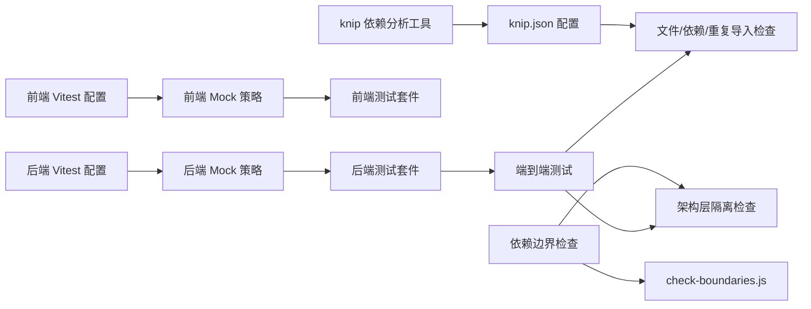

**图表来源**

- [apps/frontend/vitest.config.mts:1-22](file://apps/frontend/vitest.config.mts#L1-L22)
- [apps/backend/vitest.config.mts:1-39](file://apps/backend/vitest.config.mts#L1-L39)
- [apps/frontend/tests/setup.ts:1-134](file://apps/frontend/tests/setup.ts#L1-L134)
- [apps/backend/tests/setup.ts:1-66](file://apps/backend/tests/setup.ts#L1-L66)
- [apps/backend/tests/e2e/test-app.ts:466-568](file://apps/backend/tests/e2e/test-app.ts#L466-L568)
- [knip.json:1-58](file://knip.json#L1-L58)
- [scripts/check-boundaries.js:1-100](file://scripts/check-boundaries.js#L1-L100)

**章节来源**

- [apps/frontend/vitest.config.mts:1-22](file://apps/frontend/vitest.config.mts#L1-L22)
- [apps/backend/vitest.config.mts:1-39](file://apps/backend/vitest.config.mts#L1-L39)
- [packages/shared/vitest.config.ts:1-28](file://packages/shared/vitest.config.ts#L1-L28)
- [apps/frontend/tests/setup.ts:1-134](file://apps/frontend/tests/setup.ts#L1-L134)
- [apps/backend/tests/setup.ts:1-66](file://apps/backend/tests/setup.ts#L1-L66)
- [apps/backend/tests/e2e/test-app.ts:1-568](file://apps/backend/tests/e2e/test-app.ts#L1-L568)
- [knip.json:1-58](file://knip.json#L1-L58)
- [scripts/check-boundaries.js:1-100](file://scripts/check-boundaries.js#L1-L100)

## 性能考量

- 测试并发与隔离
  - 使用 maxWorkers 参数控制并发，平衡速度与资源占用。
  - happy-dom 环境比真实浏览器更快，适合组件与组合式函数测试。
- Mock 策略优化
  - 前端：按需 Mock，避免加载重型组件；清理定时器与 Mock 状态。
  - 后端：内存版存储与服务替换，减少外部依赖带来的延迟。
- 覆盖率与质量门禁
  - 通过覆盖率报告识别薄弱模块，优先补齐关键路径测试。
  - 在 CI 中设置覆盖率阈值，确保新增代码具备基本质量保障。
- **新增** 依赖分析性能优化
  - knip工具提供快速的依赖分析，相比传统方法更高效。
  - 工作区级别的配置允许精确控制分析范围，避免不必要的扫描。
  - 重复导入检测帮助识别和消除冗余依赖，减少包体积。

## 故障排查指南

- 日志噪声与异常过滤
  - 后端：通过 setup 文件过滤 Nest 日志与特定异常输出，避免干扰测试结果。
- 前端环境问题
  - requestAnimationFrame 与定时器：使用 fake timers 控制异步；在 beforeEach 清理 pending 定时器。
  - localStorage 与 fetch：统一 Mock，避免跨浏览器差异。
- 端到端安全校验
  - 缺失 X-Requested-With 头将被拒绝；确认测试请求头设置正确。
- 速率限制与幂等性
  - 注册与登录接口存在速率限制；合理安排测试节奏，避免触发限流。
- 调试建议
  - 使用 test:watch 快速迭代；在复杂流程中拆分断言，定位失败点。
  - 对 Mock 的调用链进行断言，确保交互符合预期。
- **新增** 依赖问题排查
  - knip检查失败：使用`knip --include files,dependencies,duplicates --no-exit-code`获取详细报告。
  - 依赖边界违规：检查check-boundaries.js的输出，确认架构层隔离是否被破坏。
  - 重复导入检测：查看knip报告中的重复导入警告，优化导入路径。
  - 工作区配置问题：检查knip.json中的entry和project配置，确保正确的分析范围。

**章节来源**

- [apps/backend/tests/setup.ts:1-66](file://apps/backend/tests/setup.ts#L1-L66)
- [apps/frontend/tests/setup.ts:1-134](file://apps/frontend/tests/setup.ts#L1-L134)
- [apps/backend/tests/e2e/auth.e2e.spec.ts:30-62](file://apps/backend/tests/e2e/auth.e2e.spec.ts#L30-L62)
- [knip.json:1-58](file://knip.json#L1-L58)
- [scripts/check-boundaries.js:1-100](file://scripts/check-boundaries.js#L1-L100)

## 结论

通过统一的 Vitest 配置、完善的 Mock 策略与清晰的测试分层，Lumina Todo 能够在前端组件与组合式函数、后端服务与 API、以及端到端测试上建立稳定可靠的测试保障体系。本次更新重点集成了knip依赖分析工具，新增依赖边界检查和重复导入检测功能，扩展了测试策略以包含自动化依赖管理。更新了TodoHeader组件图标测试桩、useChatHistory原子会话重载测试和useChatActions流式测试，完善了AI聊天消息组件和主题颜色选择器的测试策略。结合覆盖率与持续集成，可有效提升交付质量与可维护性。

**新增** knip工具的集成显著提升了项目的依赖管理质量，通过自动化检查确保架构层隔离和依赖健康，为项目的长期维护提供了强有力的保障。

## 附录

### 测试策略与最佳实践清单

- 单元测试
  - 以职责单一的服务与组合式函数为单位，使用最小化 Mock。
  - 断言关键分支与边界条件（空值、重复、权限）。
  - **新增**：TodoHeader组件测试应验证lucide-vue-next图标的正确渲染和交互。
  - **新增**：useChatHistory测试应重点关注原子会话重载的一致性保证。
  - **新增**：useChatActions测试应验证isGenerating状态的正确管理。
  - **新增**：ChatMessage组件测试应重点关注布局约束、对齐方式和样式类的正确性。
  - **新增**：ThemeColorPicker组件测试应验证主题预设、推荐标记和尺寸变体的完整功能。
  - **新增**：AI同步功能测试应重点关注数据一致性、事务处理和错误回退机制。
  - **新增**：小说管理测试应验证复杂关联数据的完整性和版本控制。
  - **新增**：教学模式测试应关注统计数据的准确性和平滑的用户体验。
- 集成测试
  - 在 Nest 模块上下文中验证控制器与服务协作。
  - 使用 Zod 校验与拦截器确保输入与输出格式一致。
  - **新增**：AI功能的集成测试应验证多模型讨论流和配置同步。
  - **新增**：ChatMessage组件的集成测试应验证与Markdown渲染、思维面板和结构化块的协同工作。
- 端到端测试
  - 使用内存版存储与安全钩子，覆盖关键业务流程与异常路径。
  - 明确速率限制与安全头策略，保证测试稳定性。
  - **新增**：小说创作流程的端到端测试应验证从草稿到导出的完整链路。
  - **新增**：主题颜色切换的端到端测试应验证用户偏好持久化和界面实时更新。
- 覆盖率与持续集成
  - 设置覆盖率阈值，定期审查薄弱模块。
  - 在 CI 中并行执行单元与集成测试，端到端测试单独调度。
  - **新增**：为新增组件设置专门的覆盖率目标，确保关键路径得到充分测试。
  - **新增**：集成knip依赖分析到CI流程，在测试前检查依赖健康状况。
- 测试数据管理
  - 使用固定种子与时间戳，确保可重复性。
  - 对外部依赖（邮件、存储）进行 Mock 或使用沙箱环境。
  - **新增**：AI功能测试应使用标准化的预设和技能数据集。
  - **新增**：主题颜色测试应使用预定义的颜色值和推荐标记配置。
- TDD 与 BDD
  - TDD：先写失败测试，再实现最小逻辑，持续重构。
  - BDD：从用户故事出发，使用 Given/When/Then 描述行为，便于评审与回归。
  - **新增**：TodoHeader组件可采用行为驱动开发，明确图标渲染和语言切换的用户流程。
  - **新增**：useChatHistory组件可采用行为驱动开发，明确会话持久化和重载的一致性规则。
  - **新增**：useChatActions可采用行为驱动开发，明确流式状态管理和错误处理的业务规则。
  - **新增**：ChatMessage组件可采用行为驱动开发，明确布局约束和交互行为的业务规则。
  - **新增**：ThemeColorPicker组件可采用行为驱动开发，明确主题预设和颜色选择的用户流程。
- **新增** 依赖管理最佳实践
  - 使用knip定期检查依赖健康状况，及时发现潜在问题。
  - 遵循架构层隔离原则，避免跨层依赖。
  - 通过重复导入检测优化导入路径，减少包体积。
  - 在CI中集成knip检查，确保代码质量门禁。
  - 定期审查和更新knip配置，适应项目发展需求。
  - 使用工作区配置精确控制分析范围，提高检查效率。
  - 结合check-boundaries.js实现自定义依赖边界检查。
