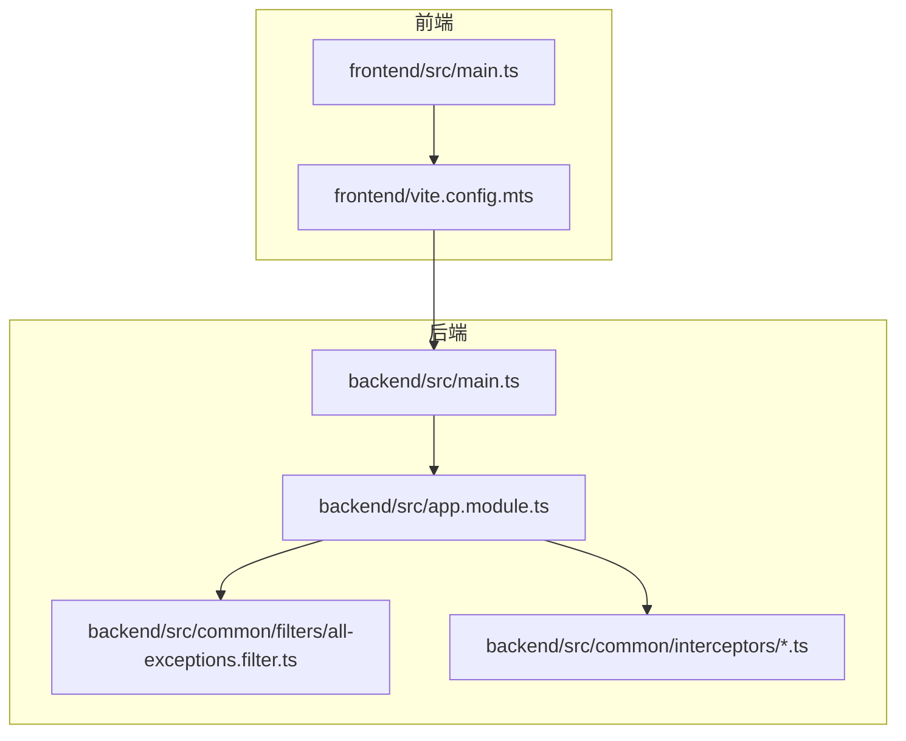
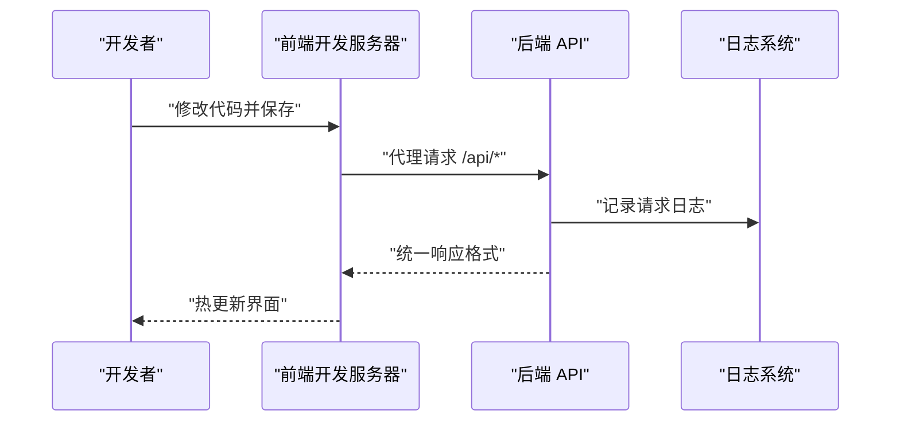
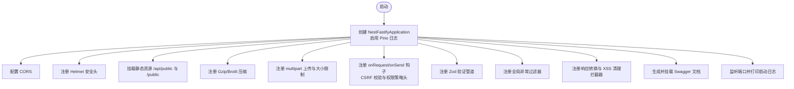
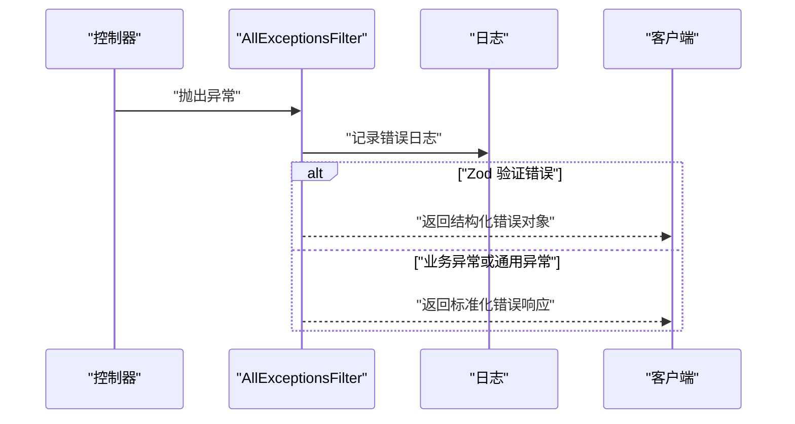
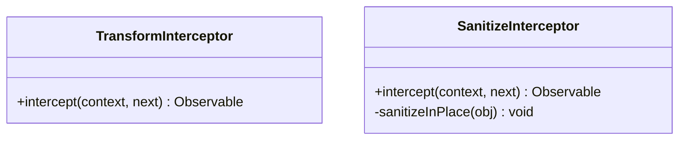
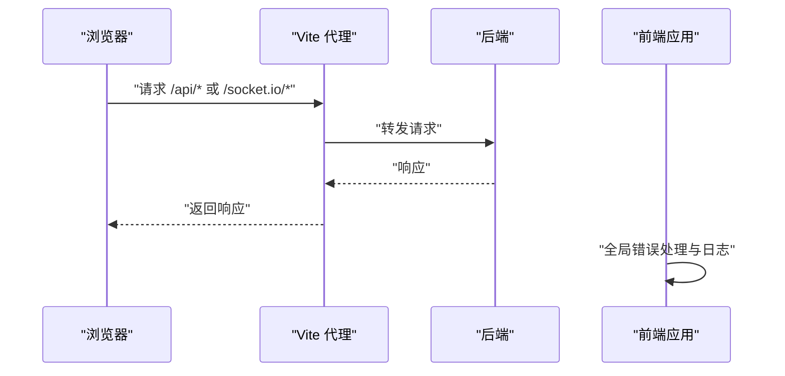
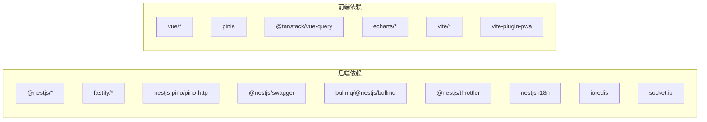
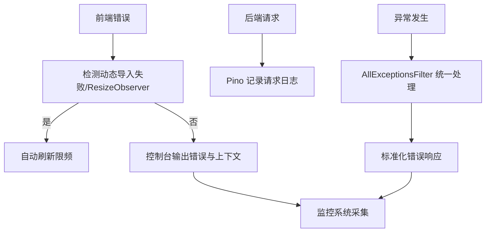
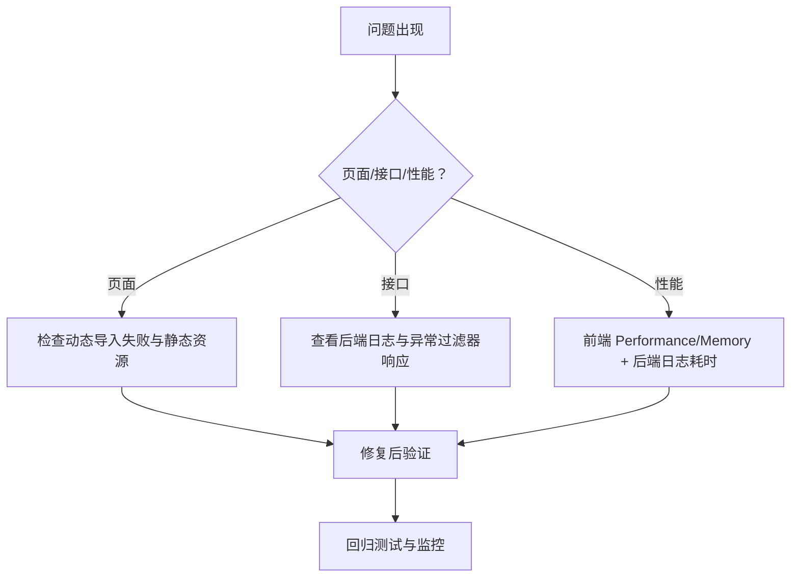

# 调试与性能分析

<cite>
**本文引用的文件**
- [apps/backend/src/main.ts](file://apps/backend/src/main.ts)
- [apps/backend/src/app.module.ts](file://apps/backend/src/app.module.ts)
- [apps/backend/src/common/filters/all-exceptions.filter.ts](file://apps/backend/src/common/filters/all-exceptions.filter.ts)
- [apps/backend/src/common/interceptors/transform.interceptor.ts](file://apps/backend/src/common/interceptors/transform.interceptor.ts)
- [apps/backend/src/common/interceptors/sanitize.interceptor.ts](file://apps/backend/src/common/interceptors/sanitize.interceptor.ts)
- [apps/backend/nest-cli.json](file://apps/backend/nest-cli.json)
- [apps/backend/package.json](file://apps/backend/package.json)
- [apps/backend/tsconfig.json](file://apps/backend/tsconfig.json)
- [apps/backend/vitest.config.mts](file://apps/backend/vitest.config.mts)
- [apps/frontend/src/main.ts](file://apps/frontend/src/main.ts)
- [apps/frontend/vite.config.mts](file://apps/frontend/vite.config.mts)
- [apps/frontend/package.json](file://apps/frontend/package.json)
- [apps/frontend/tsconfig.json](file://apps/frontend/tsconfig.json)
- [apps/frontend/vitest.config.mts](file://apps/frontend/vitest.config.mts)
</cite>

## 目录
1. [简介](#简介)
2. [项目结构](#项目结构)
3. [核心组件](#核心组件)
4. [架构总览](#架构总览)
5. [详细组件分析](#详细组件分析)
6. [依赖分析](#依赖分析)
7. [性能考量](#性能考量)
8. [故障排查指南](#故障排查指南)
9. [结论](#结论)
10. [附录](#附录)

## 简介
本指南聚焦 Lumina Todo 的调试与性能分析，覆盖前端与后端双端的开发工具链、日志系统、错误追踪与异常处理、性能分析（内存、CPU、网络）以及生产环境问题排查与监控告警配置。目标是帮助开发者快速定位问题、建立高效的调试与性能优化流程。

## 项目结构
- 后端采用 NestJS + Fastify，使用 Pino 日志、Swagger 文档、Zod 验证、XSS 清理、CSRF 防护、Gzip 压缩、静态资源托管等。
- 前端基于 Vite + Vue 3，集成 PWA、按需分包、代理到后端 API 与 Socket.IO，具备完善的全局错误处理与窗口级错误捕获。
- 测试框架使用 Vitest，分别针对前后端配置了环境与覆盖率策略。

图表来源
- [apps/frontend/src/main.ts:1-138](file://apps/frontend/src/main.ts#L1-L138)
- [apps/frontend/vite.config.mts:1-185](file://apps/frontend/vite.config.mts#L1-L185)
- [apps/backend/src/main.ts:1-211](file://apps/backend/src/main.ts#L1-L211)
- [apps/backend/src/app.module.ts:1-160](file://apps/backend/src/app.module.ts#L1-L160)
- [apps/backend/src/common/filters/all-exceptions.filter.ts:1-137](file://apps/backend/src/common/filters/all-exceptions.filter.ts#L1-L137)
- [apps/backend/src/common/interceptors/transform.interceptor.ts:1-30](file://apps/backend/src/common/interceptors/transform.interceptor.ts#L1-L30)
- [apps/backend/src/common/interceptors/sanitize.interceptor.ts:1-64](file://apps/backend/src/common/interceptors/sanitize.interceptor.ts#L1-L64)

章节来源
- [apps/frontend/src/main.ts:1-138](file://apps/frontend/src/main.ts#L1-L138)
- [apps/frontend/vite.config.mts:1-185](file://apps/frontend/vite.config.mts#L1-L185)
- [apps/backend/src/main.ts:1-211](file://apps/backend/src/main.ts#L1-L211)
- [apps/backend/src/app.module.ts:1-160](file://apps/backend/src/app.module.ts#L1-L160)

## 核心组件
- 后端启动与安全中间件：CORS、Helmet、CSRF 校验、Gzip、静态资源、Swagger、优雅停机。
- 全局异常过滤器：统一错误响应、结构化错误字段、国际化消息。
- 全局响应拦截器：统一成功响应包装。
- XSS 清理拦截器：请求体/查询/路径参数的 HTML 清理。
- 前端全局错误处理：动态导入失败检测与自动刷新、窗口级错误与未处理 Promise 拒绝捕获。
- 前端代理与 PWA：开发代理到后端、权限策略头、分包与压缩。
- 测试与类型检查：Vitest 配置、TypeScript 编译选项、脚本命令。

章节来源
- [apps/backend/src/main.ts:34-205](file://apps/backend/src/main.ts#L34-L205)
- [apps/backend/src/common/filters/all-exceptions.filter.ts:17-135](file://apps/backend/src/common/filters/all-exceptions.filter.ts#L17-L135)
- [apps/backend/src/common/interceptors/transform.interceptor.ts:18-29](file://apps/backend/src/common/interceptors/transform.interceptor.ts#L18-L29)
- [apps/backend/src/common/interceptors/sanitize.interceptor.ts:10-36](file://apps/backend/src/common/interceptors/sanitize.interceptor.ts#L10-L36)
- [apps/frontend/src/main.ts:59-113](file://apps/frontend/src/main.ts#L59-L113)
- [apps/frontend/vite.config.mts:80-184](file://apps/frontend/vite.config.mts#L80-L184)

## 架构总览
后端通过 Fastify 提供 HTTP 服务，启用安全中间件与静态资源；前端通过 Vite 开发服务器代理到后端 API 与 Socket.IO；全局拦截器与过滤器保证响应一致性与安全性；日志模块按环境输出不同格式。

图表来源
- [apps/backend/src/main.ts:48-197](file://apps/backend/src/main.ts#L48-L197)
- [apps/frontend/vite.config.mts:154-174](file://apps/frontend/vite.config.mts#L154-L174)

章节来源
- [apps/backend/src/main.ts:48-197](file://apps/backend/src/main.ts#L48-L197)
- [apps/frontend/vite.config.mts:154-174](file://apps/frontend/vite.config.mts#L154-L174)

## 详细组件分析

### 后端启动与安全中间件
- CORS：支持多源、凭证、自定义方法与头部。
- Helmet：内容安全策略、跨源嵌入/资源策略等。
- CSRF：对非安全方法校验 X-Requested-With。
- Gzip/Brotli：开启压缩阈值与算法。
- 静态资源：/api/public 与 /public 前缀。
- Swagger：统一文档生成与清理。
- 优雅停机：SIGINT/SIGTERM。
- 全局管道/过滤器/拦截器：Zod 验证、异常过滤、响应转换、XSS 清理。

图表来源
- [apps/backend/src/main.ts:34-205](file://apps/backend/src/main.ts#L34-L205)

章节来源
- [apps/backend/src/main.ts:34-205](file://apps/backend/src/main.ts#L34-L205)

### 全局异常过滤器
- 统一错误响应结构，包含 success、data、message、errors、statusCode、timestamp。
- 对 Zod 验证错误进行结构化映射与国际化。
- 对业务异常提取字段映射并国际化。
- 记录请求方法、URL、状态码与堆栈。

图表来源
- [apps/backend/src/common/filters/all-exceptions.filter.ts:27-135](file://apps/backend/src/common/filters/all-exceptions.filter.ts#L27-L135)

章节来源
- [apps/backend/src/common/filters/all-exceptions.filter.ts:17-135](file://apps/backend/src/common/filters/all-exceptions.filter.ts#L17-L135)

### 响应转换与 XSS 清理拦截器
- TransformInterceptor：将成功响应统一包装为 { success, data, timestamp }。
- SanitizeInterceptor：递归清理请求体/查询/路径中的 HTML 危险内容。

图表来源
- [apps/backend/src/common/interceptors/transform.interceptor.ts:18-29](file://apps/backend/src/common/interceptors/transform.interceptor.ts#L18-L29)
- [apps/backend/src/common/interceptors/sanitize.interceptor.ts:10-36](file://apps/backend/src/common/interceptors/sanitize.interceptor.ts#L10-L36)

章节来源
- [apps/backend/src/common/interceptors/transform.interceptor.ts:18-29](file://apps/backend/src/common/interceptors/transform.interceptor.ts#L18-L29)
- [apps/backend/src/common/interceptors/sanitize.interceptor.ts:10-36](file://apps/backend/src/common/interceptors/sanitize.interceptor.ts#L10-L36)

### 前端全局错误处理与代理
- 动态导入失败检测：识别模块加载错误并自动刷新，限制刷新频率。
- 忽略 ResizeObserver 相关的良性错误。
- 全局 window.onerror、unhandledrejection 捕获。
- Vite 代理：/api 与 /socket.io 代理到后端，设置超时与权限策略头。
- PWA 插件与压缩插件：开发模式可选启用，生产环境自动更新。

图表来源
- [apps/frontend/src/main.ts:59-113](file://apps/frontend/src/main.ts#L59-L113)
- [apps/frontend/vite.config.mts:154-174](file://apps/frontend/vite.config.mts#L154-L174)

章节来源
- [apps/frontend/src/main.ts:59-113](file://apps/frontend/src/main.ts#L59-L113)
- [apps/frontend/vite.config.mts:154-174](file://apps/frontend/vite.config.mts#L154-L174)

## 依赖分析
- 后端依赖：NestJS、Fastify、Pino、Swagger、BullMQ、Throttler、i18n、Prisma、Redis、Socket.IO 等。
- 前端依赖：Vue 3、Pinia、Vue Query、ECharts、Socket.IO Client、Vite、PWA、压缩等。
- 测试：Vitest（Node 环境、Happy DOM）、TypeScript 编译与 ESLint。

图表来源
- [apps/backend/package.json:31-87](file://apps/backend/package.json#L31-L87)
- [apps/frontend/package.json:31-71](file://apps/frontend/package.json#L31-L71)

章节来源
- [apps/backend/package.json:31-87](file://apps/backend/package.json#L31-L87)
- [apps/frontend/package.json:31-71](file://apps/frontend/package.json#L31-L71)

## 性能考量
- 日志级别与输出
  - 开发环境使用 pino-pretty，生产环境使用 JSON 输出，便于日志收集与分析。
  - 自定义日志级别：根据状态码自动提升级别，错误与 5xx 提升为 error，4xx 提升为 warn。
- 压缩与静态资源
  - 后端启用 Gzip/Brotli，阈值与算法可调。
  - 前端启用 gzip/brotli 压缩插件与 PWA，减少首屏与缓存体积。
- 分包与体积
  - 前端按功能拆分 vendor chunk，避免单个包过大，降低冷启动与缓存命中成本。
  - 构建警告阈值提高，便于发现潜在体积膨胀。
- 代理与网络
  - Vite 代理设置超时，避免长连接频繁断开。
  - 后端对 /api/public 与 /public 提供静态资源，减少后端压力。
- 任务队列与存储
  - BullMQ 默认移除完成任务，失败保留任务以便排查；指数退避策略降低瞬时压力。
- 速率限制与安全
  - 全局 Throttler 结合 Redis 存储，防止暴力破解与滥用。
  - Helmet 与 CSRF 校验降低安全风险，减少异常分支带来的性能损耗。

章节来源
- [apps/backend/src/app.module.ts:35-89](file://apps/backend/src/app.module.ts#L35-L89)
- [apps/backend/src/main.ts:111-123](file://apps/backend/src/main.ts#L111-L123)
- [apps/frontend/vite.config.mts:88-103](file://apps/frontend/vite.config.mts#L88-L103)
- [apps/frontend/vite.config.mts:175-182](file://apps/frontend/vite.config.mts#L175-L182)
- [apps/backend/src/app.module.ts:98-116](file://apps/backend/src/app.module.ts#L98-L116)
- [apps/backend/src/app.module.ts:118-123](file://apps/backend/src/app.module.ts#L118-L123)
- [apps/backend/src/main.ts:94-107](file://apps/backend/src/main.ts#L94-L107)
- [apps/backend/src/main.ts:125-131](file://apps/backend/src/main.ts#L125-L131)

## 故障排查指南

### 开发工具使用
- 浏览器开发者工具
  - Network：观察 /api/* 与 /socket.io/* 请求耗时、状态码、响应体大小；关注 4xx/5xx 与慢请求。
  - Console：查看前端全局错误处理输出；留意动态导入失败与 ResizeObserver 相关警告。
  - Sources：启用断点与条件断点，结合源映射定位问题。
  - Performance/Memory：录制 CPU 与内存，观察峰值与增长趋势。
- Node.js 调试器
  - 后端启动脚本支持调试模式，使用 IDE attach 到调试端口，设置断点逐步执行。
  - 前端开发服务器支持热更新，结合浏览器断点与日志定位问题。
- IDE 调试配置
  - VS Code：使用 launch.json 配置后端调试（attach/launch），前端使用 Vite 插件或直接 attach。
  - TypeScript：启用路径映射与声明文件，确保断点命中正确文件。

章节来源
- [apps/backend/package.json:13-13](file://apps/backend/package.json#L13-L13)
- [apps/frontend/vite.config.mts:154-174](file://apps/frontend/vite.config.mts#L154-L174)

### 日志系统与错误追踪
- 后端日志
  - Pino 配置：开发环境彩色 pretty 输出，生产环境 JSON 输出；自定义日志级别与消息格式。
  - 异常过滤器：统一错误响应与结构化字段，便于前端与监控系统消费。
- 前端日志
  - 全局错误处理器：忽略 ResizeObserver 警告，记录动态导入失败与未处理 Promise 拒绝。
  - 控制台输出：区分“全局错误”、“窗口错误”、“未处理 Promise 拒绝”。

图表来源
- [apps/frontend/src/main.ts:59-113](file://apps/frontend/src/main.ts#L59-L113)
- [apps/backend/src/app.module.ts:35-89](file://apps/backend/src/app.module.ts#L35-L89)
- [apps/backend/src/common/filters/all-exceptions.filter.ts:27-135](file://apps/backend/src/common/filters/all-exceptions.filter.ts#L27-L135)

章节来源
- [apps/frontend/src/main.ts:59-113](file://apps/frontend/src/main.ts#L59-L113)
- [apps/backend/src/app.module.ts:35-89](file://apps/backend/src/app.module.ts#L35-L89)
- [apps/backend/src/common/filters/all-exceptions.filter.ts:27-135](file://apps/backend/src/common/filters/all-exceptions.filter.ts#L27-L135)

### 性能分析工具
- 内存泄漏检测
  - 后端：EventEmitterModule 启用详细内存泄漏提示，关注监听器数量与未释放事件。
  - 前端：使用 Memory 面板录制，观察堆快照差异，定位未释放的闭包、定时器、事件监听器。
- CPU 性能分析
  - 使用 Performance 面板录制，关注主线程长任务、渲染阻塞与重复计算。
  - 后端：结合日志时间戳与响应耗时，定位慢接口与异常分支。
- 网络请求监控
  - Network 面板：统计慢请求、重复请求、缓存命中率；关注 /api/public 与 /public 静态资源。
  - 后端：CSRF 校验与压缩对网络吞吐有影响，必要时调整阈值与算法。

章节来源
- [apps/backend/src/app.module.ts:90-96](file://apps/backend/src/app.module.ts#L90-L96)
- [apps/backend/src/main.ts:111-123](file://apps/backend/src/main.ts#L111-L123)
- [apps/frontend/vite.config.mts:154-174](file://apps/frontend/vite.config.mts#L154-L174)

### 生产环境问题排查与监控告警
- 日志分析
  - 生产环境使用 JSON 日志，集中采集后按时间、状态码、URL、错误堆栈检索。
  - 关注 5xx 错误与高频 4xx 字段错误，结合异常过滤器的结构化错误对象定位。
- 监控告警
  - 建议基于日志与指标（QPS、P95/P99、错误率、队列积压）设置告警。
  - 对 BullMQ 失败任务与 Redis 连接异常设置告警。
- 配置要点
  - CORS、Helmet、CSRF、压缩、静态资源均已在启动阶段配置，排查时优先确认环境变量与代理设置。

章节来源
- [apps/backend/src/app.module.ts:35-89](file://apps/backend/src/app.module.ts#L35-L89)
- [apps/backend/src/main.ts:48-131](file://apps/backend/src/main.ts#L48-L131)

### 常见问题诊断流程
- 页面白屏或空白
  - 检查动态导入失败：前端自动刷新逻辑是否生效；若无效，手动刷新并观察控制台错误。
  - 检查后端静态资源：/api/public 与 /public 是否可用。
- 接口报错
  - 查看后端日志与异常过滤器响应，确认是否为 Zod 验证错误或业务异常。
  - 前端控制台是否有未处理 Promise 拒绝。
- 性能下降
  - 前端：使用 Performance/Memory 定位长任务与内存泄漏；检查分包与第三方库体积。
  - 后端：查看日志耗时与错误率，检查队列与 Redis 连接状态。
- 代理与跨域问题
  - 确认 Vite 代理目标与超时设置；检查后端 CORS 与 CSRF 校验是否匹配前端请求。

图表来源
- [apps/frontend/src/main.ts:59-113](file://apps/frontend/src/main.ts#L59-L113)
- [apps/backend/src/common/filters/all-exceptions.filter.ts:27-135](file://apps/backend/src/common/filters/all-exceptions.filter.ts#L27-L135)
- [apps/backend/src/main.ts:125-131](file://apps/backend/src/main.ts#L125-L131)

章节来源
- [apps/frontend/src/main.ts:59-113](file://apps/frontend/src/main.ts#L59-L113)
- [apps/backend/src/common/filters/all-exceptions.filter.ts:27-135](file://apps/backend/src/common/filters/all-exceptions.filter.ts#L27-L135)
- [apps/backend/src/main.ts:125-131](file://apps/backend/src/main.ts#L125-L131)

## 结论
通过统一的日志、异常过滤与拦截器、安全中间件与代理配置，Lumina Todo 在开发与生产环境中具备良好的可观测性与可维护性。配合浏览器与 Node.js 调试工具、性能分析面板与监控告警，开发者可以高效定位问题并持续优化性能与稳定性。

## 附录
- 调试脚本与命令
  - 后端：开发、类型检查、构建、测试、PM2 管理、Lint。
  - 前端：开发、类型检查、构建、预览、测试、Capacitor、PWA 图标生成。
- TypeScript 与 Vitest 配置
  - 路径映射、编译目标、测试环境与覆盖率报告。

章节来源
- [apps/backend/package.json:7-29](file://apps/backend/package.json#L7-L29)
- [apps/frontend/package.json:9-30](file://apps/frontend/package.json#L9-L30)
- [apps/backend/tsconfig.json:1-30](file://apps/backend/tsconfig.json#L1-L30)
- [apps/frontend/tsconfig.json:1-28](file://apps/frontend/tsconfig.json#L1-L28)
- [apps/backend/vitest.config.mts:1-34](file://apps/backend/vitest.config.mts#L1-L34)
- [apps/frontend/vitest.config.mts:1-23](file://apps/frontend/vitest.config.mts#L1-L23)