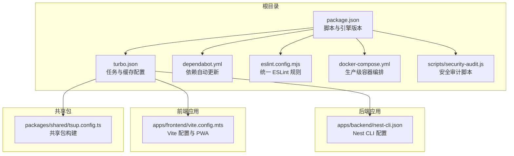
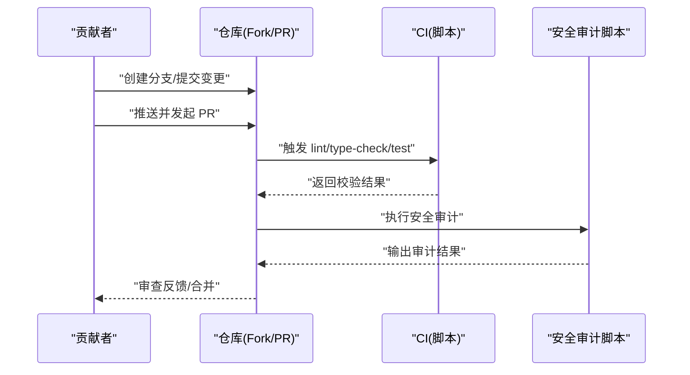
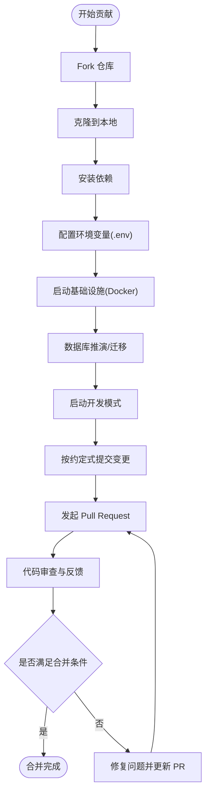
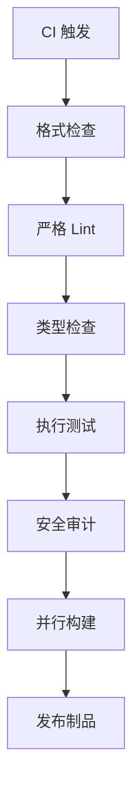
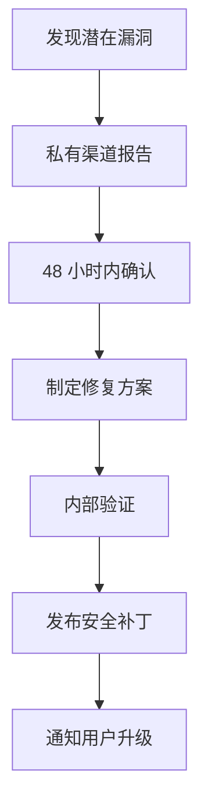
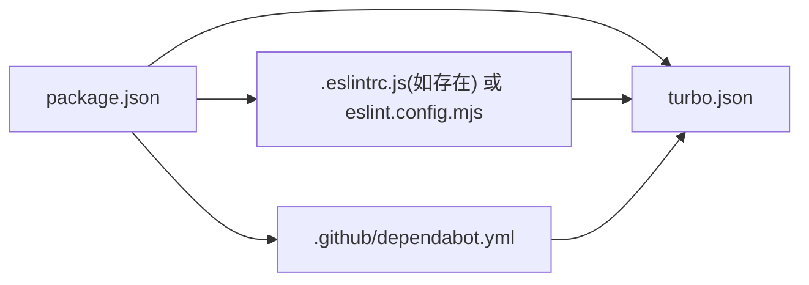

# 贡献指南

<cite>
**本文引用的文件**
- [CONTRIBUTING.md](file://CONTRIBUTING.md)
- [CODE_OF_CONDUCT.md](file://CODE_OF_CONDUCT.md)
- [SECURITY.md](file://SECURITY.md)
- [package.json](file://package.json)
- [turbo.json](file://turbo.json)
- [.github/dependabot.yml](file://.github/dependabot.yml)
- [scripts/security-audit.js](file://scripts/security-audit.js)
- [eslint.config.mjs](file://eslint.config.mjs)
- [apps/backend/nest-cli.json](file://apps/backend/nest-cli.json)
- [apps/frontend/vite.config.mts](file://apps/frontend/vite.config.mts)
- [packages/shared/tsup.config.ts](file://packages/shared/tsup.config.ts)
- [docker-compose.yml](file://docker-compose.yml)
</cite>

## 目录

1. [简介](#简介)
2. [项目结构](#项目结构)
3. [核心组件](#核心组件)
4. [架构总览](#架构总览)
5. [详细组件分析](#详细组件分析)
6. [依赖分析](#依赖分析)
7. [性能考虑](#性能考虑)
8. [故障排查指南](#故障排查指南)
9. [结论](#结论)
10. [附录](#附录)

## 简介

本指南面向所有希望参与 Lumina (简思) 开源项目的贡献者，提供从 Fork 项目到提交 Pull Request 的完整流程，涵盖代码质量标准、代码审查与合并策略、发布流程、社区行为准则、沟通规范、安全漏洞报告与安全更新策略，以及文档与翻译贡献方法和问题反馈渠道。我们鼓励以尊重、专业和包容的方式协作，共同推动项目健康发展。

## 项目结构

Lumina 是一个基于 Monorepo 的全栈项目，采用 pnpm 工作区与 Turborepo 进行统一构建与任务编排，后端使用 NestJS，前端使用 Vue 3，共享包通过 tsup 构建，数据库与缓存通过 Docker Compose 提供。

**图表来源**

- [package.json:1-139](file://package.json#L1-L139)
- [turbo.json:1-202](file://turbo.json#L1-L202)
- [.github/dependabot.yml:1-22](file://.github/dependabot.yml#L1-L22)
- [eslint.config.mjs:1-71](file://eslint.config.mjs#L1-L71)
- [apps/backend/nest-cli.json:1-11](file://apps/backend/nest-cli.json#L1-L11)
- [apps/frontend/vite.config.mts:1-185](file://apps/frontend/vite.config.mts#L1-L185)
- [packages/shared/tsup.config.ts:1-11](file://packages/shared/tsup.config.ts#L1-L11)
- [docker-compose.yml:1-240](file://docker-compose.yml#L1-L240)

**章节来源**

- [package.json:31-77](file://package.json#L31-L77)
- [turbo.json:1-202](file://turbo.json#L1-L202)
- [eslint.config.mjs:1-71](file://eslint.config.mjs#L1-L71)
- [docker-compose.yml:1-240](file://docker-compose.yml#L1-L240)

## 核心组件

- 贡献流程与质量标准：遵循 Conventional Commits，通过 Lint、Type Check、测试与安全审计作为 PR 合并前置条件。
- 代码审查与合并策略：PR 需通过 CI 检查并通过至少一名维护者批准；合并前确保分支与主干同步。
- 发布流程：版本号在根 package.json 中管理，CI 中执行格式检查、严格 Lint、类型检查与测试，最终进行安全审计。
- 社区行为准则：遵守 Contributor Covenant 行为准则，举报渠道明确，隐私与安全受保护。
- 安全策略：支持版本范围、私有漏洞上报、覆盖所有组件、安全最佳实践与自动安全审计脚本。
- 文档与翻译：文档位于仓库内，翻译遵循 i18n 结构与加载器；问题反馈通过 Issues 渠道。

**章节来源**

- [CONTRIBUTING.md:55-87](file://CONTRIBUTING.md#L55-L87)
- [CODE_OF_CONDUCT.md:1-79](file://CODE_OF_CONDUCT.md#L1-L79)
- [SECURITY.md:1-40](file://SECURITY.md#L1-L40)
- [package.json:46-51](file://package.json#L46-L51)

## 架构总览

下图展示贡献者从本地开发到 PR 提交、CI 校验与安全审计的整体流程。

**图表来源**

- [package.json:46-51](file://package.json#L46-L51)
- [scripts/security-audit.js:1-53](file://scripts/security-audit.js#L1-L53)

## 详细组件分析

### 代码贡献流程

- Fork 与克隆：从官方仓库 Fork 到个人账号，克隆到本地。
- 依赖安装与环境准备：安装 Node.js、pnpm、Docker；复制并填写 .env 示例；启动基础设施。
- 数据库迁移：执行数据库推演或迁移命令。
- 启动开发：使用 Turborepo 并行启动各应用。
- 编写与校验：遵循 Conventional Commits，运行 Lint、Type Check、测试；必要时格式化。
- 提交与 PR：推送分支并发起 PR，等待审查与反馈。

**章节来源**

- [CONTRIBUTING.md:13-87](file://CONTRIBUTING.md#L13-L87)
- [package.json:31-77](file://package.json#L31-L77)
- [docker-compose.yml:1-240](file://docker-compose.yml#L1-L240)

### 代码审查流程与合并策略

- 审查要求：PR 需通过 Lint、Type Check、测试与安全审计；至少一名维护者批准。
- 同步与冲突：建议在 PR 开启后保持与主干同步，避免长期分叉导致冲突。
- 变更范围：尽量小而聚焦，便于审查与回归测试。

**章节来源**

- [CONTRIBUTING.md:55-87](file://CONTRIBUTING.md#L55-L87)
- [package.json:46-51](file://package.json#L46-L51)

### 发布流程

- 版本管理：根 package.json 统一管理版本号与脚本。
- CI 校验：执行格式检查、严格 Lint、类型检查与测试。
- 安全审计：在 CI 中调用安全审计脚本，过滤忽略项后判定是否阻断。
- 构建与打包：通过 Turborepo 并行构建各子任务，生成产物。

**图表来源**

- [package.json:46-51](file://package.json#L46-L51)
- [scripts/security-audit.js:1-53](file://scripts/security-audit.js#L1-L53)
- [turbo.json:1-202](file://turbo.json#L1-L202)

**章节来源**

- [package.json:46-51](file://package.json#L46-L51)
- [turbo.json:1-202](file://turbo.json#L1-L202)

### 社区行为准则与沟通规范

- 行为准则：遵循 Contributor Covenant，倡导积极、包容与专业的社区氛围。
- 举报渠道：通过指定邮箱私下报告不当行为，维护者将及时公正处理。
- 沟通方式：尊重差异、建设性反馈、避免人身攻击与骚扰。

**章节来源**

- [CODE_OF_CONDUCT.md:1-79](file://CODE_OF_CONDUCT.md#L1-L79)

### 安全漏洞报告与安全更新策略

- 支持版本：当前对 1.0.x 主线版本提供安全更新。
- 报告方式：优先使用 GitHub 私有漏洞报告通道；或邮件私下联系维护者。
- 范围覆盖：涵盖后端、前端、共享包与桌面壳层等所有组件。
- 最佳实践：保持系统与依赖更新、使用强密码、避免将数据库与缓存直接暴露公网。
- 自动审计：CI 中集成安全审计脚本，可过滤忽略项并阻断高危风险。

**图表来源**

- [SECURITY.md:1-40](file://SECURITY.md#L1-L40)
- [scripts/security-audit.js:1-53](file://scripts/security-audit.js#L1-L53)

**章节来源**

- [SECURITY.md:1-40](file://SECURITY.md#L1-L40)
- [scripts/security-audit.js:1-53](file://scripts/security-audit.js#L1-L53)

### 文档贡献与翻译方法

- 文档位置：仓库内包含文档与多语言 i18n 资源，遵循统一加载器组织。
- 翻译流程：在对应语言目录新增或修改键值，确保键名一致，避免破坏既有结构。
- 提交流程：与常规代码贡献一致，遵循 Conventional Commits 与质量检查。

**章节来源**

- [CONTRIBUTING.md:55-87](file://CONTRIBUTING.md#L55-L87)

### 问题反馈渠道

- Issues：用于报告缺陷、功能请求与讨论，维护者会定期跟进。
- 私有漏洞：请勿公开 Issue，按安全策略私下报告。

**章节来源**

- [package.json:12-14](file://package.json#L12-L14)
- [SECURITY.md:12-24](file://SECURITY.md#L12-L24)

## 依赖分析

- 包管理与引擎：根 package.json 指定 Node 与 pnpm 版本，统一脚本入口。
- 依赖自动更新：Dependabot 配置按月扫描 npm 与 GitHub Actions，限制 PR 数量并分组管理。
- ESLint 配置：集中规则与忽略列表，关闭与 Prettier 冲突项，避免在 Lint 阶段重复执行 Prettier。
- 构建与缓存：Turbo 任务定义输入输出、持久化与缓存策略，提升开发与 CI 效率。

**图表来源**

- [package.json:1-139](file://package.json#L1-L139)
- [.github/dependabot.yml:1-22](file://.github/dependabot.yml#L1-L22)
- [eslint.config.mjs:1-71](file://eslint.config.mjs#L1-L71)
- [turbo.json:1-202](file://turbo.json#L1-L202)

**章节来源**

- [package.json:1-139](file://package.json#L1-L139)
- [.github/dependabot.yml:1-22](file://.github/dependabot.yml#L1-L22)
- [eslint.config.mjs:1-71](file://eslint.config.mjs#L1-L71)
- [turbo.json:1-202](file://turbo.json#L1-L202)

## 性能考虑

- 并行构建：Turborepo 通过任务依赖与缓存提升构建效率，建议在本地与 CI 中合理利用并发参数。
- 类型检查：区分类型感知与非类型感知规则，减少不必要的类型检查成本。
- Lint 与格式化：ESLint 关闭与 Prettier 冲突规则，配合 lint-staged 在提交前快速纠偏。
- 前端资源：Vite 配置按模块手动分包与压缩，降低首屏体积与网络压力。

**章节来源**

- [turbo.json:1-202](file://turbo.json#L1-L202)
- [eslint.config.mjs:1-71](file://eslint.config.mjs#L1-L71)
- [apps/frontend/vite.config.mts:1-185](file://apps/frontend/vite.config.mts#L1-L185)

## 故障排查指南

- 本地开发失败
  - 确认 Node 与 pnpm 版本满足根引擎要求。
  - 检查 .env 是否正确配置数据库、缓存与第三方密钥。
  - 使用 Docker Compose 启动基础设施，确认健康检查通过。
- CI 失败
  - 格式检查：先执行格式化再重试。
  - 严格 Lint：根据错误提示修正类型或规则违规。
  - 测试失败：补充或修复相关单元/集成测试。
  - 安全审计：查看被忽略的 advisories 与模块，评估是否需要升级或临时忽略。
- 前端代理与 PWA
  - 检查 Vite 代理目标与权限策略，确保 WebSocket 与长连接稳定。
  - PWA 开发模式可通过环境变量启用。

**章节来源**

- [package.json:27-30](file://package.json#L27-L30)
- [docker-compose.yml:1-240](file://docker-compose.yml#L1-L240)
- [package.json:46-51](file://package.json#L46-L51)
- [scripts/security-audit.js:1-53](file://scripts/security-audit.js#L1-L53)
- [apps/frontend/vite.config.mts:154-182](file://apps/frontend/vite.config.mts#L154-L182)

## 结论

通过本指南，贡献者可以清晰地理解从本地开发到 PR 提交、审查与发布的全流程，同时掌握社区行为准则、安全策略与问题反馈渠道。我们鼓励高质量、可维护且安全的贡献，共同建设开放、包容与高效的技术社区。

## 附录

- 许可证：贡献默认许可为 GNU Affero General Public License v3.0 (AGPL-3.0)，与项目许可证保持一致。
- 术语
  - Conventional Commits：一种提交信息规范，便于自动生成变更日志与语义化版本。
  - PR：Pull Request，用于发起合并请求。
  - CI：持续集成，自动化执行校验与测试。

**章节来源**

- [CONTRIBUTING.md:80-87](file://CONTRIBUTING.md#L80-L87)
