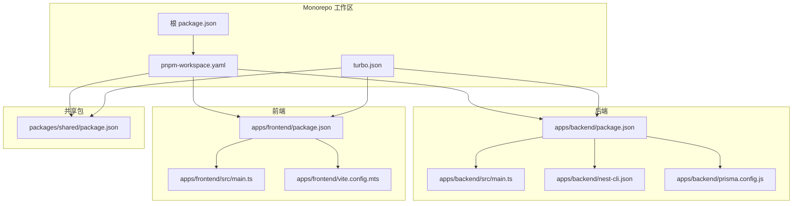
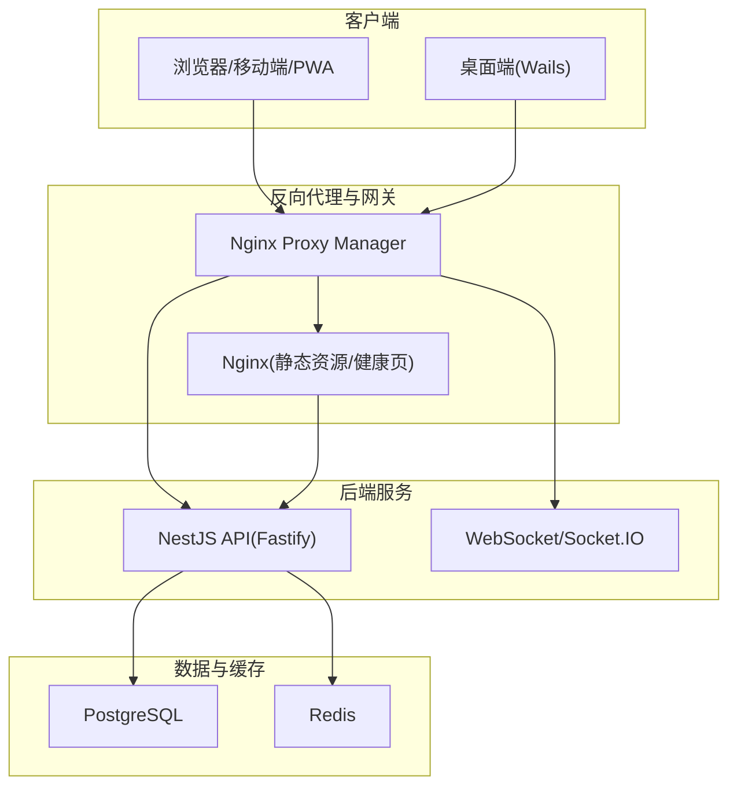
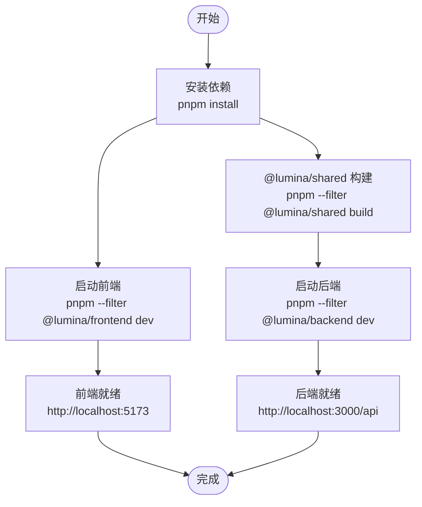
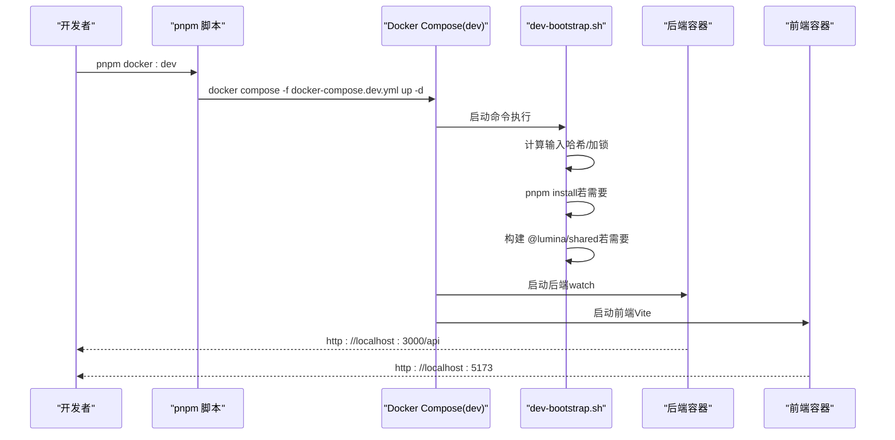
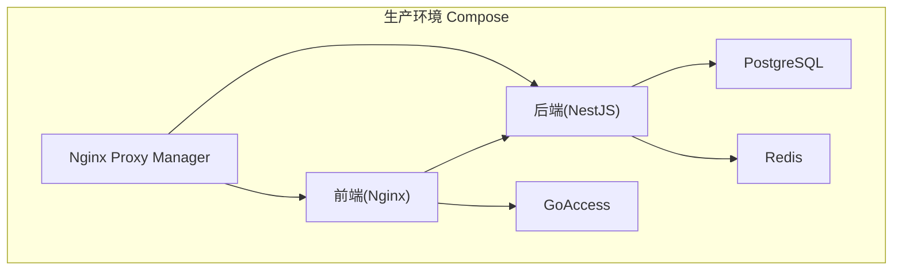
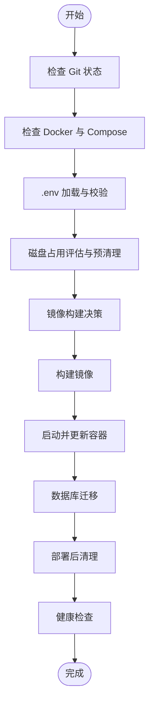
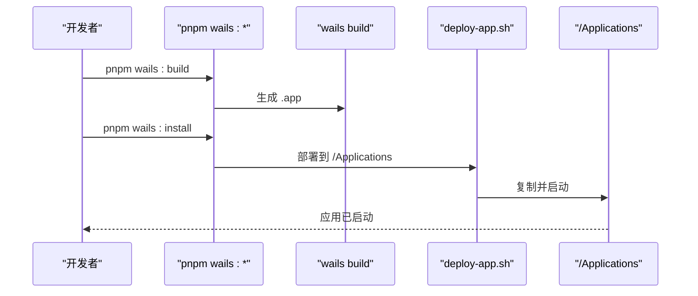
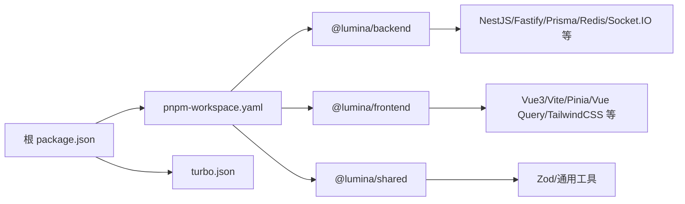

# 快速开始

<cite>
**本文引用的文件**
- [package.json](file://package.json)
- [pnpm-workspace.yaml](file://pnpm-workspace.yaml)
- [turbo.json](file://turbo.json)
- [docker-compose.yml](file://docker-compose.yml)
- [docker-compose.dev.yml](file://docker-compose.dev.yml)
- [scripts/dev-bootstrap.sh](file://scripts/dev-bootstrap.sh)
- [scripts/deploy-app.sh](file://scripts/deploy-app.sh)
- [deploy.sh](file://deploy.sh)
- [apps/backend/package.json](file://apps/backend/package.json)
- [apps/frontend/package.json](file://apps/frontend/package.json)
- [apps/backend/src/main.ts](file://apps/backend/src/main.ts)
- [apps/frontend/src/main.ts](file://apps/frontend/src/main.ts)
- [apps/frontend/vite.config.mts](file://apps/frontend/vite.config.mts)
- [apps/backend/nest-cli.json](file://apps/backend/nest-cli.json)
- [apps/backend/prisma.config.js](file://apps/backend/prisma.config.js)
- [packages/shared/package.json](file://packages/shared/package.json)
</cite>

## 目录

1. [简介](#简介)
2. [项目结构](#项目结构)
3. [核心组件](#核心组件)
4. [架构总览](#架构总览)
5. [详细组件分析](#详细组件分析)
6. [依赖分析](#依赖分析)
7. [性能考虑](#性能考虑)
8. [故障排除指南](#故障排除指南)
9. [结论](#结论)
10. [附录](#附录)

## 简介

Lumina Todo 是一个全栈 AI 驱动的个人待办应用，采用 Monorepo 架构，包含后端 NestJS、前端 Vue3、共享包以及可选的桌面端 Wails 应用。项目提供多种运行方式：本地开发、Docker 一键部署、生产环境部署脚本，以及桌面端打包与安装流程。本指南将帮助你在 30 分钟内完成环境准备、安装与首次运行。

## 项目结构

项目采用 pnpm workspace + Turbo 的 Monorepo 结构，主要模块如下：

- apps/backend：NestJS 后端服务，使用 Fastify、Prisma、Redis、PostgreSQL 等
- apps/frontend：Vue3 前端应用，使用 Vite、Pinia、Vue Query、TailwindCSS 等
- packages/shared：跨应用共享的 TypeScript 包（Zod 类型、通用 DTO 等）
- apps/wails：可选的桌面端应用（Wails + Capacitor）

**图表来源**

- [pnpm-workspace.yaml:1-4](file://pnpm-workspace.yaml#L1-L4)
- [turbo.json:1-202](file://turbo.json#L1-L202)
- [package.json:1-139](file://package.json#L1-L139)
- [apps/backend/package.json:1-109](file://apps/backend/package.json#L1-L109)
- [apps/frontend/package.json:1-105](file://apps/frontend/package.json#L1-L105)
- [packages/shared/package.json:1-52](file://packages/shared/package.json#L1-L52)

**章节来源**

- [pnpm-workspace.yaml:1-4](file://pnpm-workspace.yaml#L1-L4)
- [turbo.json:1-202](file://turbo.json#L1-L202)
- [package.json:1-139](file://package.json#L1-L139)

## 核心组件

- 后端服务（NestJS + Fastify）
  - 提供 REST API、Swagger 文档、健康检查、安全中间件（Helmet、CSRF、XSS 清理）、文件上传、WebSocket 支持
  - 数据库：PostgreSQL（Prisma）
  - 缓存与队列：Redis（BullMQ）
- 前端应用（Vue3 + Vite）
  - 支持 PWA、代理后端 API、分包优化、国际化、图表渲染
- 共享包（Zod 类型与通用工具）
  - 为前后端提供统一的数据校验与类型定义
- Docker 与部署
  - 生产：Compose 单机多服务编排（PostgreSQL、Redis、后端、前端 Nginx、NPM 反代、GoAccess）
  - 开发：Compose 开发环境（热更新、挂载源码、共享依赖卷）
  - 自动化部署脚本：Git 拉取、镜像构建、Schema 迁移、健康检查、清理策略
- 桌面端（可选）
  - Wails + Capacitor，提供本地安装与部署脚本

**章节来源**

- [apps/backend/src/main.ts:1-211](file://apps/backend/src/main.ts#L1-L211)
- [apps/frontend/src/main.ts:1-138](file://apps/frontend/src/main.ts#L1-L138)
- [apps/frontend/vite.config.mts:1-185](file://apps/frontend/vite.config.mts#L1-L185)
- [docker-compose.yml:1-240](file://docker-compose.yml#L1-L240)
- [docker-compose.dev.yml:1-192](file://docker-compose.dev.yml#L1-L192)
- [deploy.sh:1-487](file://deploy.sh#L1-L487)
- [scripts/deploy-app.sh:1-66](file://scripts/deploy-app.sh#L1-L66)

## 架构总览

Lumina Todo 的系统架构分为三层：前端 Web/PWA、后端 API、基础设施（数据库、缓存、反向代理）。生产环境通过 Nginx Proxy Manager 实现 HTTPS 与反向代理，GoAccess 实时生成访问统计报告。

**图表来源**

- [docker-compose.yml:144-174](file://docker-compose.yml#L144-L174)
- [docker-compose.yml:74-140](file://docker-compose.yml#L74-L140)
- [apps/backend/src/main.ts:192-204](file://apps/backend/src/main.ts#L192-L204)

## 详细组件分析

### 环境要求与前置条件

- Node.js 版本：>= 20.19.0（由根 package.json engines 指定）
- 包管理器：pnpm >= 9.15.0（由根 package.json engines 指定）
- Docker 与 Docker Compose：用于一键部署与开发环境
- Git：用于自动化部署脚本拉取最新代码
- macOS：桌面端部署脚本仅支持 macOS

提示：若使用 nvm 或其他版本管理器，请确保切换到满足要求的 Node.js 版本。

**章节来源**

- [package.json:27-30](file://package.json#L27-L30)

### 本地开发环境搭建（无需 Docker）

- 安装依赖
  - 在项目根目录执行安装命令，Turbo 会并行处理共享包、后端、前端的依赖安装与构建
- 启动后端
  - 进入 apps/backend，执行 dev 脚本启动 NestJS 服务
- 启动前端
  - 进入 apps/frontend，执行 dev 脚本启动 Vite 开发服务器
- 数据库与缓存
  - 使用本地或 Docker 方式启动 PostgreSQL 与 Redis，确保 DATABASE*URL、REDIS*\* 等环境变量正确
- Prisma 初始化
  - 在 apps/backend 执行 Prisma 相关命令生成客户端或推送 Schema

**图表来源**

- [turbo.json:43-69](file://turbo.json#L43-L69)
- [apps/backend/package.json:7-29](file://apps/backend/package.json#L7-L29)
- [apps/frontend/package.json:9-29](file://apps/frontend/package.json#L9-L29)

**章节来源**

- [turbo.json:1-202](file://turbo.json#L1-L202)
- [apps/backend/package.json:1-109](file://apps/backend/package.json#L1-L109)
- [apps/frontend/package.json:1-105](file://apps/frontend/package.json#L1-L105)

### Docker 一键开发环境

- 使用开发 Compose 文件启动
  - 执行 pnpm docker:dev 启动开发环境（自动安装依赖、共享包构建、热更新）
- 关键特性
  - 代码挂载与热更新：前后端均支持热更新
  - 共享依赖卷：node_modules 与 pnpm store 复用，提升启动速度
  - 增量引导：dev-bootstrap.sh 基于输入哈希判断是否跳过安装/构建
- 常用命令
  - pnpm docker:dev：启动
  - pnpm docker:dev:logs：查看日志
  - pnpm docker:dev:restart：重启服务
  - pnpm docker:dev:down：停止并移除

**图表来源**

- [docker-compose.dev.yml:138-142](file://docker-compose.dev.yml#L138-L142)
- [docker-compose.dev.yml:176-180](file://docker-compose.dev.yml#L176-L180)
- [scripts/dev-bootstrap.sh:73-107](file://scripts/dev-bootstrap.sh#L73-L107)
- [scripts/dev-bootstrap.sh:109-126](file://scripts/dev-bootstrap.sh#L109-L126)

**章节来源**

- [docker-compose.dev.yml:1-192](file://docker-compose.dev.yml#L1-L192)
- [scripts/dev-bootstrap.sh:1-151](file://scripts/dev-bootstrap.sh#L1-L151)

### Docker 一键生产环境

- 使用生产 Compose 文件启动
  - 执行 pnpm docker:up 启动生产环境（PostgreSQL、Redis、后端、前端 Nginx、NPM、GoAccess）
- 关键特性
  - 健康检查：后端与前端均配置健康检查
  - 反向代理：NPM 提供 HTTPS 与管理后台
  - 访问统计：GoAccess 实时生成 HTML 报表
- 常用命令
  - pnpm docker:up：启动
  - pnpm docker:logs：查看日志
  - pnpm docker:down：停止并移除
  - pnpm docker:prune：清理系统空间

**图表来源**

- [docker-compose.yml:19-240](file://docker-compose.yml#L19-L240)

**章节来源**

- [docker-compose.yml:1-240](file://docker-compose.yml#L1-L240)

### 自动化生产部署脚本

- 功能概览
  - Git 拉取最新代码并校验工作区状态
  - Docker 权限与环境检查
  - .env 校验（生产密钥必填项）
  - 磁盘占用阈值与清理策略（预清理/后清理/激进清理）
  - 镜像构建决策（基于 Git 与输入哈希）
  - Schema 迁移（migrate deploy 或 db push）
  - 容器健康检查与日志输出
- 使用方式
  - 在项目根目录执行 deploy.sh，按提示填写 .env 中的必要变量后运行

**图表来源**

- [deploy.sh:241-295](file://deploy.sh#L241-L295)
- [deploy.sh:392-403](file://deploy.sh#L392-L403)
- [deploy.sh:439-452](file://deploy.sh#L439-L452)

**章节来源**

- [deploy.sh:1-487](file://deploy.sh#L1-L487)

### 桌面端（Wails）打包与安装

- 构建
  - 执行 pnpm wails:build 生成桌面端应用
- 安装
  - 执行 pnpm wails:install 将应用复制到 /Applications 并启动
- 注意事项
  - 仅支持 macOS
  - 需要先完成前端构建（WAILS=true）

**图表来源**

- [package.json:70-74](file://package.json#L70-L74)
- [scripts/deploy-app.sh:28-65](file://scripts/deploy-app.sh#L28-L65)

**章节来源**

- [package.json:70-74](file://package.json#L70-L74)
- [scripts/deploy-app.sh:1-66](file://scripts/deploy-app.sh#L1-L66)

## 依赖分析

- Monorepo 与任务编排
  - pnpm-workspace.yaml 声明工作区范围
  - turbo.json 定义各包的构建、开发、测试、类型检查等任务的输入/输出与依赖关系
- 后端依赖
  - NestJS + Fastify、Prisma、Redis、BullMQ、Swagger、Zod、Pino、Passport、Socket.IO 等
- 前端依赖
  - Vue3、Pinia、Vue Query、TailwindCSS、Vite、PWA 插件、Mermaid、ECharts 等
- 共享包
  - Zod 类型与通用工具，供前后端复用

**图表来源**

- [pnpm-workspace.yaml:1-4](file://pnpm-workspace.yaml#L1-L4)
- [turbo.json:43-104](file://turbo.json#L43-L104)
- [apps/backend/package.json:31-87](file://apps/backend/package.json#L31-L87)
- [apps/frontend/package.json:31-71](file://apps/frontend/package.json#L31-L71)
- [packages/shared/package.json:42-50](file://packages/shared/package.json#L42-L50)

**章节来源**

- [pnpm-workspace.yaml:1-4](file://pnpm-workspace.yaml#L1-L4)
- [turbo.json:1-202](file://turbo.json#L1-L202)
- [apps/backend/package.json:1-109](file://apps/backend/package.json#L1-L109)
- [apps/frontend/package.json:1-105](file://apps/frontend/package.json#L1-L105)
- [packages/shared/package.json:1-52](file://packages/shared/package.json#L1-L52)

## 性能考虑

- 前端构建与缓存
  - Vite 启用 Gzip/Brotli 压缩与手动分包策略，减少首屏体积
  - PWA 与缓存策略提升离线体验
- 后端性能
  - Fastify 适配器、Helmet、压缩中间件、CSRF/XSS 防护
  - Redis 缓存与队列（BullMQ）降低数据库压力
- Docker 环境
  - 开发环境共享依赖卷与增量引导，缩短启动时间
  - 生产环境健康检查与资源限制，保障稳定性

**章节来源**

- [apps/frontend/vite.config.mts:80-184](file://apps/frontend/vite.config.mts#L80-L184)
- [apps/backend/src/main.ts:94-131](file://apps/backend/src/main.ts#L94-L131)
- [docker-compose.dev.yml:138-180](file://docker-compose.dev.yml#L138-L180)

## 故障排除指南

- 依赖安装失败
  - 确认 Node.js 与 pnpm 版本满足要求
  - 清理缓存后重试：pnpm store prune、pnpm install --frozen-lockfile
- Docker 权限不足
  - 将当前用户加入 docker 组，或使用 sudo
  - 确保 docker daemon 可用
- 端口冲突
  - 修改 docker-compose.yml 中的端口映射（如 5432、6379、3000、5173、80/443）
- 健康检查失败
  - 查看后端/前端健康端点：/api/health/liveness、/health
  - 使用 pnpm docker:logs 查看日志
- Prisma 迁移问题
  - 生产环境优先使用 migrate deploy；若无迁移目录则使用 db push
- 前端 Chunk 加载错误
  - 通常是新部署导致的缓存问题，页面会自动刷新；若多次触发，需手动刷新
- Wails 安装失败
  - 确保 macOS 环境，先执行 pnpm wails:build，再执行 pnpm wails:install

**章节来源**

- [deploy.sh:252-259](file://deploy.sh#L252-L259)
- [docker-compose.yml:128-137](file://docker-compose.yml#L128-L137)
- [apps/frontend/src/main.ts:59-79](file://apps/frontend/src/main.ts#L59-L79)
- [scripts/deploy-app.sh:17-21](file://scripts/deploy-app.sh#L17-L21)

## 结论

通过本指南，你可以在 30 分钟内完成 Lumina Todo 的环境准备与首次运行。建议优先使用 Docker 一键部署快速验证，再根据需要切换到本地开发模式进行深度定制。生产部署可直接使用自动化脚本，确保一致性与可重复性。

## 附录

### 常用命令速查

- 本地开发
  - pnpm dev：并行启动后端与前端
  - pnpm dev:backend / pnpm dev:frontend：单独启动某侧
- Docker
  - pnpm docker:dev / pnpm docker:up：开发/生产环境启动
  - pnpm docker:dev:logs / pnpm docker:logs：查看日志
  - pnpm docker:dev:down / pnpm docker:down：停止
- 部署
  - pnpm wails:build / pnpm wails:install：桌面端构建与安装
  - ./deploy.sh：生产自动化部署脚本

**章节来源**

- [package.json:31-76](file://package.json#L31-L76)
- [deploy.sh:1-487](file://deploy.sh#L1-L487)
