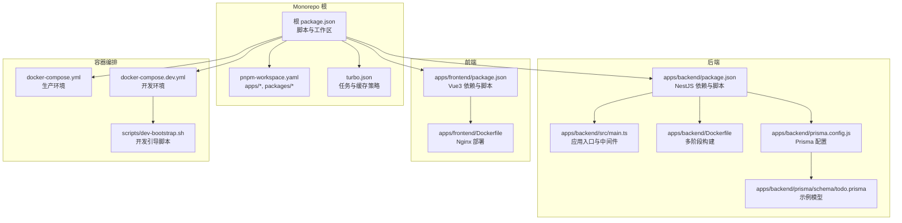
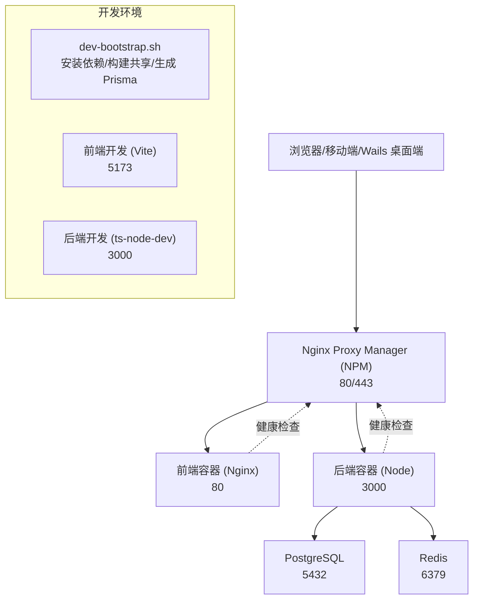
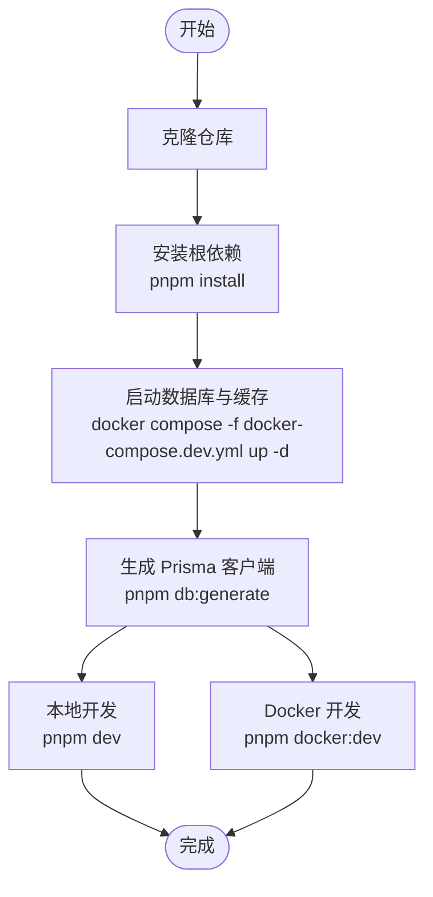
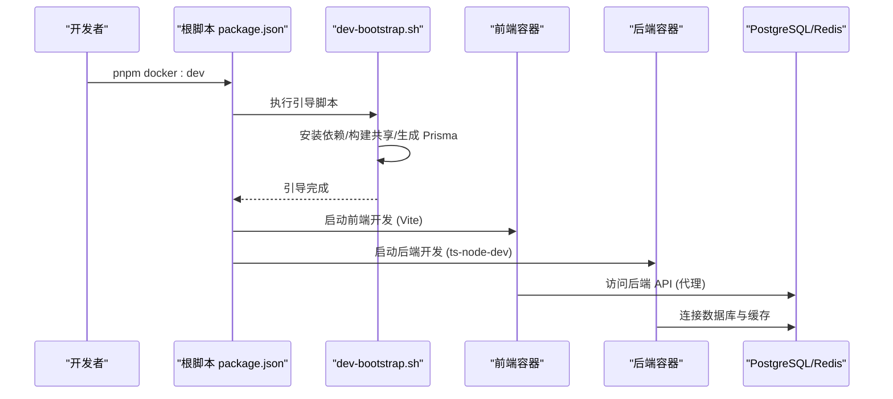
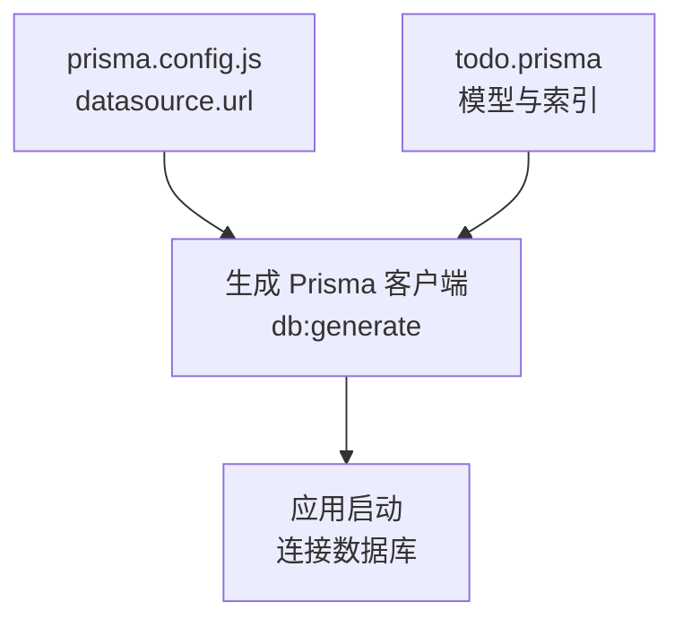
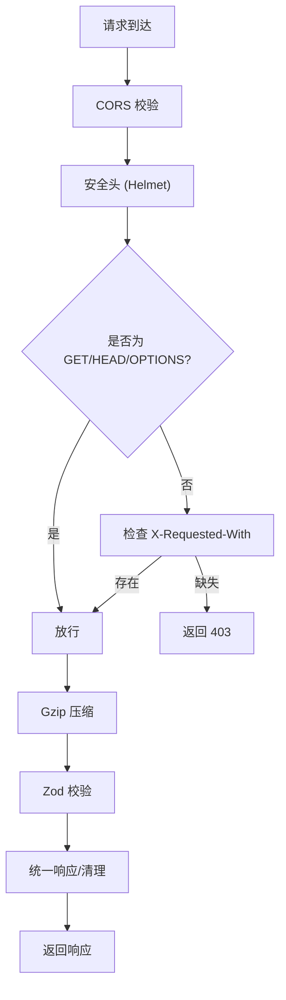
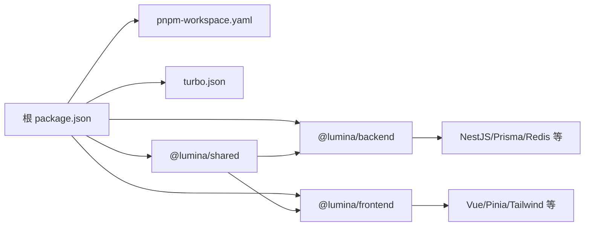

# 快速开始

<cite>
**本文引用的文件**
- [package.json](file://package.json)
- [pnpm-workspace.yaml](file://pnpm-workspace.yaml)
- [turbo.json](file://turbo.json)
- [apps/backend/package.json](file://apps/backend/package.json)
- [apps/frontend/package.json](file://apps/frontend/package.json)
- [apps/backend/src/main.ts](file://apps/backend/src/main.ts)
- [apps/backend/Dockerfile](file://apps/backend/Dockerfile)
- [apps/frontend/Dockerfile](file://apps/frontend/Dockerfile)
- [docker-compose.yml](file://docker-compose.yml)
- [docker-compose.dev.yml](file://docker-compose.dev.yml)
- [scripts/dev-bootstrap.sh](file://scripts/dev-bootstrap.sh)
- [apps/backend/prisma.config.js](file://apps/backend/prisma.config.js)
- [apps/backend/prisma/schema/todo.prisma](file://apps/backend/prisma/schema/todo.prisma)
- [tsconfig.base.json](file://tsconfig.base.json)
</cite>

## 目录
1. [简介](#简介)
2. [项目结构](#项目结构)
3. [核心组件](#核心组件)
4. [架构总览](#架构总览)
5. [详细组件分析](#详细组件分析)
6. [依赖关系分析](#依赖关系分析)
7. [性能考虑](#性能考虑)
8. [故障排除指南](#故障排除指南)
9. [结论](#结论)
10. [附录](#附录)

## 简介
本指南帮助你在 30 分钟内成功运行 Lumina Todo 项目。你将完成环境准备、依赖安装、数据库与缓存初始化、开发环境启动以及生产部署准备。项目采用 Monorepo 结构，包含后端 NestJS、前端 Vue3、共享包、Wails 桌面端以及 Docker 化部署方案。

## 项目结构
Lumina Todo 是一个基于 pnpm workspace 的 Monorepo，包含以下主要模块：
- apps/backend：NestJS 后端服务，提供 REST API、WebSocket、定时任务、邮件与对象存储集成等
- apps/frontend：Vue3 前端应用，包含 Capacitor 移动端与 PWA 能力
- apps/wails：桌面端应用（Go + Vue），通过 Wails 打包
- packages/shared：TypeScript 共享库（DTO、Schema、工具）
- scripts：开发与部署辅助脚本
- docker-compose.*：生产与开发环境的容器编排

**图表来源**
- [package.json:1-133](file://package.json#L1-L133)
- [pnpm-workspace.yaml:1-4](file://pnpm-workspace.yaml#L1-L4)
- [turbo.json:1-186](file://turbo.json#L1-L186)
- [apps/backend/package.json:1-108](file://apps/backend/package.json#L1-L108)
- [apps/frontend/package.json:1-104](file://apps/frontend/package.json#L1-L104)
- [apps/backend/src/main.ts:1-201](file://apps/backend/src/main.ts#L1-L201)
- [apps/backend/Dockerfile:1-103](file://apps/backend/Dockerfile#L1-L103)
- [apps/frontend/Dockerfile:1-94](file://apps/frontend/Dockerfile#L1-L94)
- [docker-compose.yml:1-237](file://docker-compose.yml#L1-L237)
- [docker-compose.dev.yml:1-192](file://docker-compose.dev.yml#L1-L192)
- [scripts/dev-bootstrap.sh:1-151](file://scripts/dev-bootstrap.sh#L1-L151)
- [apps/backend/prisma.config.js:1-22](file://apps/backend/prisma.config.js#L1-L22)
- [apps/backend/prisma/schema/todo.prisma:1-39](file://apps/backend/prisma/schema/todo.prisma#L1-L39)

**章节来源**
- [package.json:1-133](file://package.json#L1-L133)
- [pnpm-workspace.yaml:1-4](file://pnpm-workspace.yaml#L1-L4)
- [turbo.json:1-186](file://turbo.json#L1-L186)

## 核心组件
- 后端（NestJS）
  - 应用入口负责安全中间件、CORS、静态资源、Zod 校验、全局拦截器与 Swagger 文档
  - 通过 Prisma 访问 PostgreSQL，并使用 Redis 缓存与队列
- 前端（Vue3）
  - Vite 开发服务器，支持热更新与代理
  - 集成 TailwindCSS、Pinia、Vue Router、Socket.IO、Mermaid 等
- 共享包（packages/shared）
  - 统一 DTO、Schema 与工具函数，供前后端复用
- 容器化
  - 生产：后端 Node + Nginx 前端，PostgreSQL + Redis，NPM 反向代理
  - 开发：Docker 开发环境，挂载源码实现热更新，内置引导脚本加速首次启动

**章节来源**
- [apps/backend/src/main.ts:1-201](file://apps/backend/src/main.ts#L1-L201)
- [apps/backend/package.json:1-108](file://apps/backend/package.json#L1-L108)
- [apps/frontend/package.json:1-104](file://apps/frontend/package.json#L1-L104)
- [apps/backend/Dockerfile:1-103](file://apps/backend/Dockerfile#L1-L103)
- [apps/frontend/Dockerfile:1-94](file://apps/frontend/Dockerfile#L1-L94)

## 架构总览
Lumina Todo 采用“Monorepo + Docker”架构，后端提供 REST/WebSocket API，前端通过 Vite 开发或 Nginx 部署，数据库与缓存通过 Docker Compose 管理。生产环境通过 NPM 实现 HTTPS 与反向代理。

**图表来源**
- [docker-compose.yml:1-237](file://docker-compose.yml#L1-L237)
- [docker-compose.dev.yml:1-192](file://docker-compose.dev.yml#L1-L192)
- [scripts/dev-bootstrap.sh:1-151](file://scripts/dev-bootstrap.sh#L1-L151)

## 详细组件分析

### 环境要求与安装步骤
- 环境要求
  - Node.js：20.19.0 及以上
  - pnpm：9.15.0 及以上
  - Docker：用于容器化开发与生产部署
- 安装步骤
  1) 克隆仓库并进入目录
  2) 安装根依赖（pnpm workspace）
  3) 初始化数据库与缓存（Docker 开发环境）
  4) 生成 Prisma 客户端
  5) 启动开发环境（本地或 Docker）

**图表来源**
- [package.json:31-76](file://package.json#L31-L76)
- [docker-compose.dev.yml:13-192](file://docker-compose.dev.yml#L13-L192)

**章节来源**
- [package.json:26-30](file://package.json#L26-L30)
- [package.json:31-76](file://package.json#L31-L76)
- [pnpm-workspace.yaml:1-4](file://pnpm-workspace.yaml#L1-L4)

### 环境变量与数据库设置
- 数据库（PostgreSQL）
  - 开发：默认凭据与数据库名可在 compose 中配置
  - 生产：通过环境变量注入 DATABASE_URL
- 缓存（Redis）
  - 开发：默认密码可配置
  - 生产：通过 REDIS_PASSWORD、REDIS_HOST、REDIS_PORT 等配置
- 安全与鉴权
  - JWT 密钥：JWT_SECRET、JWT_REFRESH_SECRET
  - CORS 来源：CORS_ORIGIN
- 邮件与对象存储（可选）
  - SMTP：MAIL_HOST、MAIL_PORT、MAIL_USER、MAIL_PASSWORD
  - S3：S3_BUCKET、S3_REGION、S3_ACCESS_KEY_ID、S3_SECRET_ACCESS_KEY、S3_ENDPOINT
- 上传限制
  - UPLOAD_MAX_SIZE、UPLOAD_MAX_FILES

提示：生产环境务必设置强密钥与严格的 CORS 白名单。

**章节来源**
- [docker-compose.yml:38-125](file://docker-compose.yml#L38-L125)
- [docker-compose.dev.yml:77-118](file://docker-compose.dev.yml#L77-L118)
- [apps/backend/src/main.ts:49-63](file://apps/backend/src/main.ts#L49-L63)

### 多种启动方式
- 本地开发
  - 启动后端：apps/backend/package.json 中的 dev 脚本
  - 启动前端：apps/frontend/package.json 中的 dev 脚本
  - 根脚本：package.json 中的 dev、dev:backend、dev:frontend
- Docker 开发
  - 使用 docker-compose.dev.yml 启动，支持热更新与共享依赖卷
  - 引导脚本 scripts/dev-bootstrap.sh 负责安装依赖、构建共享包、生成 Prisma 客户端
- 生产部署
  - 使用 docker-compose.yml 构建镜像并启动
  - NPM 负责 HTTPS 与反向代理，前端通过 Nginx 提供静态资源

**图表来源**
- [package.json:57-67](file://package.json#L57-L67)
- [scripts/dev-bootstrap.sh:68-126](file://scripts/dev-bootstrap.sh#L68-L126)
- [docker-compose.dev.yml:138-180](file://docker-compose.dev.yml#L138-L180)

**章节来源**
- [apps/backend/package.json:7-28](file://apps/backend/package.json#L7-L28)
- [apps/frontend/package.json:9-28](file://apps/frontend/package.json#L9-L28)
- [package.json:31-76](file://package.json#L31-L76)
- [scripts/dev-bootstrap.sh:1-151](file://scripts/dev-bootstrap.sh#L1-L151)
- [docker-compose.dev.yml:1-192](file://docker-compose.dev.yml#L1-L192)

### 数据库与 Prisma
- Prisma 配置
  - 通过 apps/backend/prisma.config.js 指定 schema 与 datasource.url（优先使用环境变量）
- 示例模型
  - apps/backend/prisma/schema/todo.prisma 展示了 Todo 与 Tombstone 模型的字段与索引
- 初始化流程
  - 开发：生成客户端后即可启动
  - 生产：Dockerfile 中在构建阶段再次生成客户端

**图表来源**
- [apps/backend/prisma.config.js:13-21](file://apps/backend/prisma.config.js#L13-L21)
- [apps/backend/prisma/schema/todo.prisma:1-39](file://apps/backend/prisma/schema/todo.prisma#L1-L39)

**章节来源**
- [apps/backend/prisma.config.js:1-22](file://apps/backend/prisma.config.js#L1-L22)
- [apps/backend/prisma/schema/todo.prisma:1-39](file://apps/backend/prisma/schema/todo.prisma#L1-L39)
- [apps/backend/Dockerfile:80-82](file://apps/backend/Dockerfile#L80-L82)

### 安全与中间件（后端）
- CORS：支持多来源与凭证
- Helmet：内容安全策略、跨站策略等
- CSRF 防护：对非 GET 请求校验 X-Requested-With
- Gzip 压缩：提升传输效率
- 全局管道与拦截器：Zod 校验、统一响应格式、XSS 清理

**图表来源**
- [apps/backend/src/main.ts:48-170](file://apps/backend/src/main.ts#L48-L170)

**章节来源**
- [apps/backend/src/main.ts:48-170](file://apps/backend/src/main.ts#L48-L170)

## 依赖关系分析
- 工作区与任务
  - pnpm-workspace.yaml 声明 apps/* 与 packages/*
  - turbo.json 定义 build/dev/lint/type-check/test 等任务与输入输出
- 后端依赖
  - NestJS、Fastify、Prisma、BullMQ、Socket.IO、i18n、Pino 等
- 前端依赖
  - Vue3、Pinia、Vue Router、TailwindCSS、Socket.IO 客户端、Mermaid 等
- 共享包
  - packages/shared 提供 DTO 与工具，被前后端复用

**图表来源**
- [pnpm-workspace.yaml:1-4](file://pnpm-workspace.yaml#L1-L4)
- [turbo.json:1-186](file://turbo.json#L1-L186)
- [apps/backend/package.json:30-86](file://apps/backend/package.json#L30-L86)
- [apps/frontend/package.json:30-69](file://apps/frontend/package.json#L30-L69)

**章节来源**
- [pnpm-workspace.yaml:1-4](file://pnpm-workspace.yaml#L1-L4)
- [turbo.json:1-186](file://turbo.json#L1-L186)
- [apps/backend/package.json:1-108](file://apps/backend/package.json#L1-L108)
- [apps/frontend/package.json:1-104](file://apps/frontend/package.json#L1-L104)

## 性能考虑
- 内存与并发
  - 根脚本与各应用脚本均设置了较大的 Node 内存上限，适合大型 Monorepo
- 构建与缓存
  - turbo.json 对 build/dev 等任务启用持久化与缓存，减少重复工作
- Docker 多阶段构建
  - 后端与前端镜像均采用多阶段构建，减小镜像体积并提升安全性
- 压缩与静态资源
  - 后端启用 Gzip 压缩；前端构建产物由 Nginx 提供，具备缓存与压缩能力

**章节来源**
- [package.json:31-42](file://package.json#L31-L42)
- [turbo.json:11-16](file://turbo.json#L11-L16)
- [apps/backend/Dockerfile:1-103](file://apps/backend/Dockerfile#L1-L103)
- [apps/frontend/Dockerfile:1-94](file://apps/frontend/Dockerfile#L1-L94)

## 故障排除指南
- Node 与 pnpm 版本不匹配
  - 确认 engines 字段与实际版本一致
- Docker 无法拉取镜像或构建失败
  - 检查网络与镜像标签；必要时调整 Dockerfile 中的基础镜像
- 数据库连接失败
  - 校验 DATABASE_URL、POSTGRES_USER、POSTGRES_PASSWORD、POSTGRES_DB
- Redis 密码错误
  - 校验 REDIS_PASSWORD 与容器命令中的 requirepass
- CORS 与 CSRF 报错
  - 确认 CORS_ORIGIN 配置；非 GET 请求需携带 X-Requested-With
- 端口冲突
  - 修改 docker-compose 中映射端口或停止占用进程
- 开发热更新无效
  - 确认 docker-compose.dev.yml 中的卷挂载与引导脚本执行情况

**章节来源**
- [package.json:26-30](file://package.json#L26-L30)
- [docker-compose.yml:38-125](file://docker-compose.yml#L38-L125)
- [docker-compose.dev.yml:77-118](file://docker-compose.dev.yml#L77-L118)
- [apps/backend/src/main.ts:49-63](file://apps/backend/src/main.ts#L49-L63)

## 结论
通过本指南，你可以在 30 分钟内完成环境准备、依赖安装、数据库与缓存初始化，并成功启动本地或 Docker 开发环境。生产部署可直接使用提供的 Docker Compose 配置，结合 NPM 实现 HTTPS 与反向代理。

## 附录

### 常见问题与操作系统注意事项
- macOS/Linux
  - 确保 Docker Desktop 正常运行；如遇到权限问题，将当前用户加入 docker 组
- Windows
  - 推荐使用 WSL2 运行 Docker；注意卷挂载路径与权限
- 端口占用
  - 如 3000/5173/5432/6379/80/443 被占用，请释放或修改映射端口

### 快速命令清单
- 安装依赖：pnpm install
- 生成 Prisma 客户端：pnpm db:generate
- 本地开发：pnpm dev
- Docker 开发：pnpm docker:dev
- 停止开发：pnpm docker:dev:down
- 生产构建与启动：pnpm docker:build && pnpm docker:up
- 查看日志：pnpm docker:dev:logs 或 docker compose logs -f