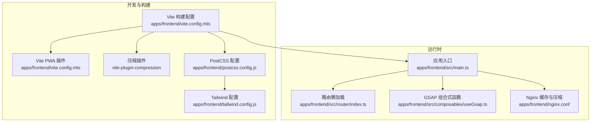
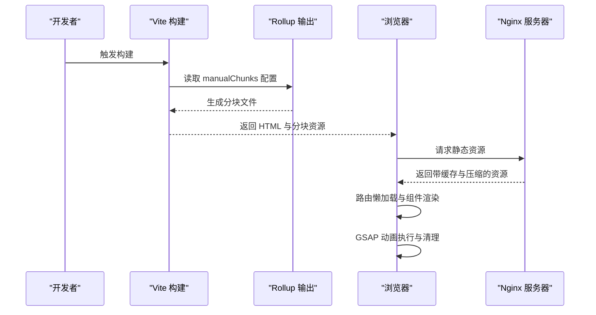
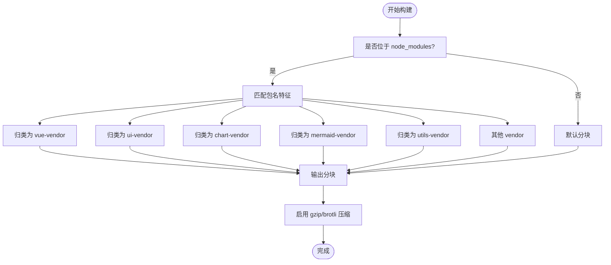
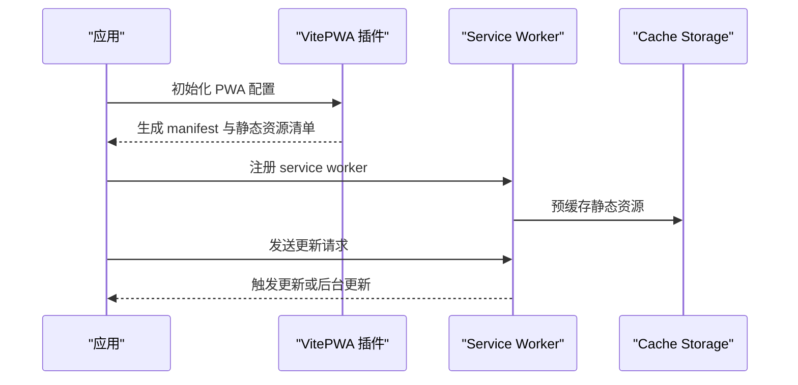
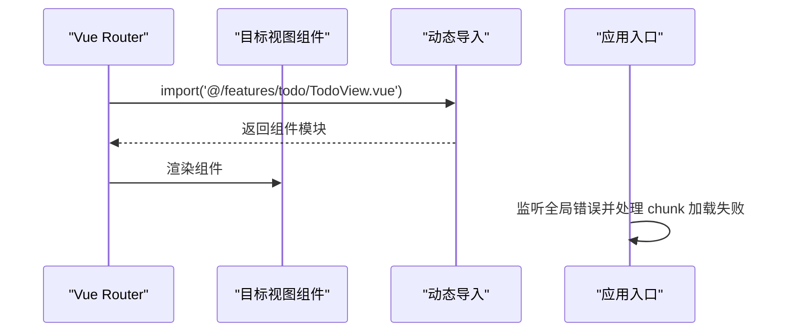
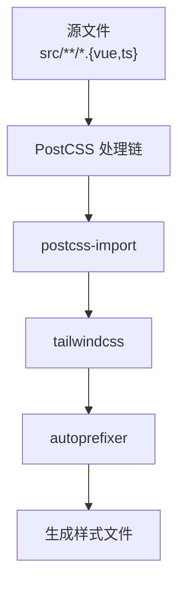
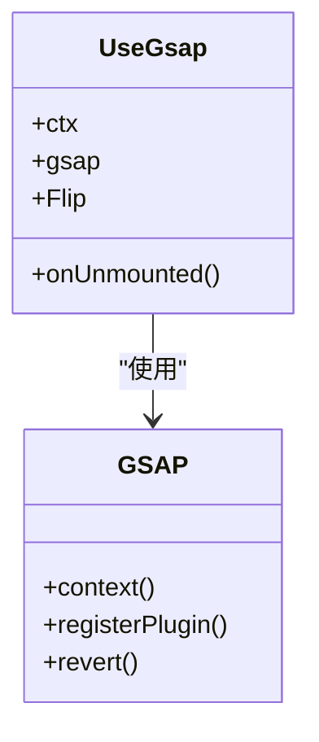
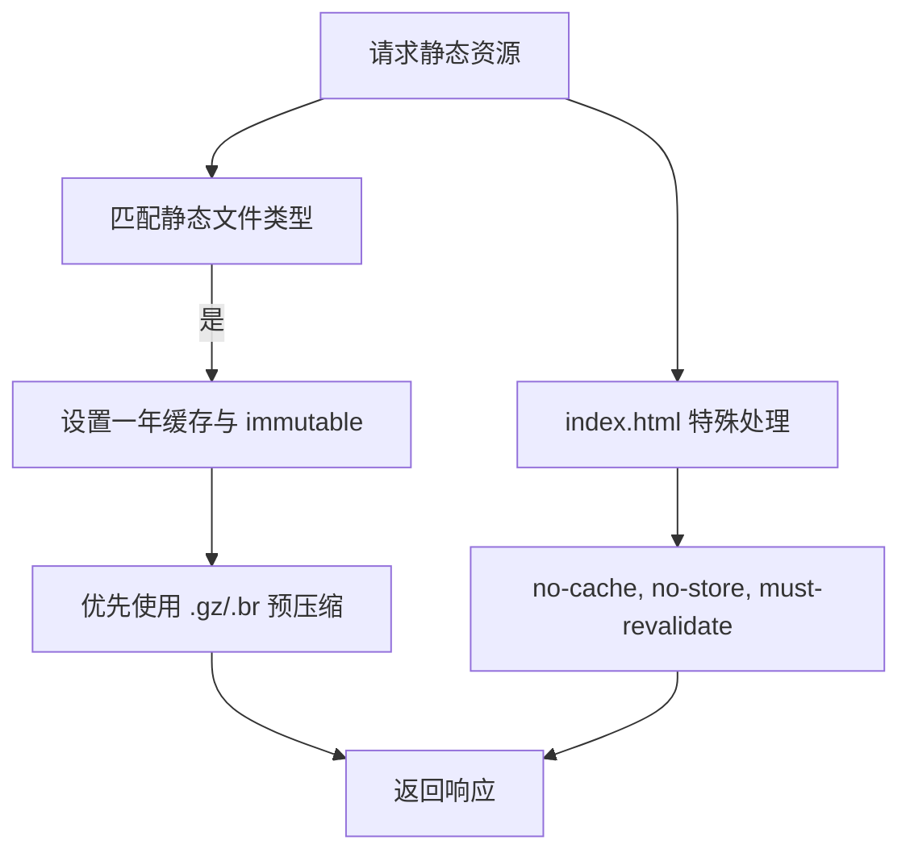
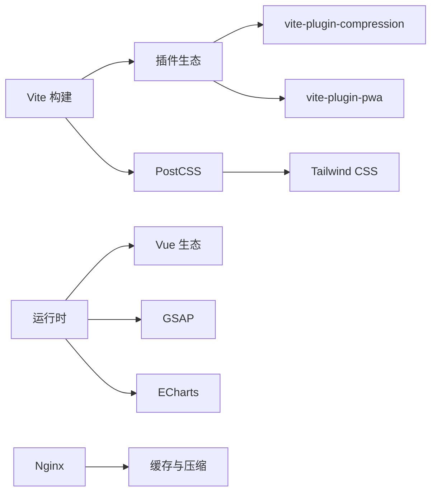

# 前端性能优化

<cite>
**本文引用的文件**
- [apps/frontend/vite.config.mts](file://apps/frontend/vite.config.mts)
- [apps/frontend/src/router/index.ts](file://apps/frontend/src/router/index.ts)
- [apps/frontend/src/main.ts](file://apps/frontend/src/main.ts)
- [apps/frontend/tailwind.config.js](file://apps/frontend/tailwind.config.js)
- [apps/frontend/postcss.config.js](file://apps/frontend/postcss.config.js)
- [apps/frontend/pwa-assets.config.ts](file://apps/frontend/pwa-assets.config.ts)
- [apps/frontend/nginx.conf](file://apps/frontend/nginx.conf)
- [apps/frontend/src/composables/useGsap.ts](file://apps/frontend/src/composables/useGsap.ts)
- [apps/frontend/package.json](file://apps/frontend/package.json)
</cite>

## 目录
1. [简介](#简介)
2. [项目结构](#项目结构)
3. [核心组件](#核心组件)
4. [架构总览](#架构总览)
5. [详细组件分析](#详细组件分析)
6. [依赖关系分析](#依赖关系分析)
7. [性能考量](#性能考量)
8. [故障排查指南](#故障排查指南)
9. [结论](#结论)
10. [附录](#附录)

## 简介
本指南聚焦于前端性能优化，结合仓库中现有的 Vite 构建配置、PWA 插件、Tailwind CSS、Nginx 配置以及 Vue 路由懒加载等实现，系统阐述以下主题：
- Vite 代码分割策略：manualChunks 的手动分块与 vendor 包分离
- PWA 缓存策略与离线能力
- 组件与路由懒加载最佳实践
- Tailwind CSS 按需生成与样式优化
- GSAP 动画性能优化与内存管理
- 图片懒加载、字体优化与资源压缩
- 浏览器缓存策略与 HTTP 压缩
- 前端性能监控与用户体验优化

## 项目结构
前端位于 apps/frontend，主要涉及构建工具（Vite）、打包与压缩（vite-plugin-compression）、PWA（vite-plugin-pwa）、UI 框架与工具库（Vue、GSAP、ECharts、Tailwind CSS 等）、路由懒加载、Nginx 部署与缓存策略。

图表来源
- [apps/frontend/vite.config.mts:80-185](file://apps/frontend/vite.config.mts#L80-L185)
- [apps/frontend/src/router/index.ts:1-73](file://apps/frontend/src/router/index.ts#L1-L73)
- [apps/frontend/src/main.ts:1-138](file://apps/frontend/src/main.ts#L1-L138)
- [apps/frontend/postcss.config.js:1-8](file://apps/frontend/postcss.config.js#L1-L8)
- [apps/frontend/tailwind.config.js:1-303](file://apps/frontend/tailwind.config.js#L1-L303)
- [apps/frontend/nginx.conf:1-203](file://apps/frontend/nginx.conf#L1-L203)

章节来源
- [apps/frontend/vite.config.mts:1-185](file://apps/frontend/vite.config.mts#L1-L185)
- [apps/frontend/src/router/index.ts:1-73](file://apps/frontend/src/router/index.ts#L1-L73)
- [apps/frontend/src/main.ts:1-138](file://apps/frontend/src/main.ts#L1-L138)
- [apps/frontend/postcss.config.js:1-8](file://apps/frontend/postcss.config.js#L1-L8)
- [apps/frontend/tailwind.config.js:1-303](file://apps/frontend/tailwind.config.js#L1-L303)
- [apps/frontend/nginx.conf:1-203](file://apps/frontend/nginx.conf#L1-L203)

## 核心组件
- Vite 构建与代码分割：通过 rollupOptions.output.manualChunks 实现基于包名的手动分块，将常用第三方库拆分为独立 vendor 块，提升缓存命中率与并行下载效率。
- PWA 与离线：启用 VitePWA 插件，生成 manifest 与静态资源清单，支持自动更新与开发模式下的可选启用。
- 路由懒加载：使用动态 import 将路由视图组件延迟加载，减少首屏体积与初始渲染时间。
- Tailwind CSS：content 范围限定在 src 与 components 目录，配合 PostCSS 与 autoprefixer，实现按需生成与自动前缀。
- GSAP：通过组合式函数封装上下文与生命周期清理，避免动画残留与内存泄漏。
- Nginx：开启 gzip 静态优先与 sendfile 优化，设置静态资源一年缓存与严格安全头，保障传输与缓存性能。

章节来源
- [apps/frontend/vite.config.mts:23-78](file://apps/frontend/vite.config.mts#L23-L78)
- [apps/frontend/vite.config.mts:104-146](file://apps/frontend/vite.config.mts#L104-L146)
- [apps/frontend/src/router/index.ts:14-52](file://apps/frontend/src/router/index.ts#L14-L52)
- [apps/frontend/tailwind.config.js:7-13](file://apps/frontend/tailwind.config.js#L7-L13)
- [apps/frontend/postcss.config.js:1-8](file://apps/frontend/postcss.config.js#L1-L8)
- [apps/frontend/src/composables/useGsap.ts:1-20](file://apps/frontend/src/composables/useGsap.ts#L1-L20)
- [apps/frontend/nginx.conf:11-72](file://apps/frontend/nginx.conf#L11-L72)

## 架构总览
下图展示从构建到运行时的关键流程：Vite 基于 manualChunks 进行代码分割，PWA 生成缓存清单，Nginx 提供静态资源缓存与压缩，运行时通过路由懒加载与 GSAP 优化用户体验。

图表来源
- [apps/frontend/vite.config.mts:175-182](file://apps/frontend/vite.config.mts#L175-L182)
- [apps/frontend/src/router/index.ts:14-52](file://apps/frontend/src/router/index.ts#L14-L52)
- [apps/frontend/src/composables/useGsap.ts:7-19](file://apps/frontend/src/composables/useGsap.ts#L7-L19)
- [apps/frontend/nginx.conf:182-187](file://apps/frontend/nginx.conf#L182-L187)

## 详细组件分析

### Vite 代码分割与 vendor 分离
- manualChunks 策略
  - 识别 node_modules 中的包，并按功能域划分 vendor 块，例如 vue-vendor、ui-vendor、chart-vendor、mermaid-vendor、utils-vendor 等。
  - 未匹配到特定域时返回 undefined，交由 Rollup 默认策略处理。
- 构建输出
  - 通过 rollupOptions.output.manualChunks 应用上述策略。
  - 设置 chunkSizeWarningLimit，避免大体积分块导致警告。
- 压缩策略
  - 同时启用 gzip 与 brotli 压缩，阈值为 1KB，提升传输效率。
- 环境变量
  - 支持 WAILS 模式下的相对 base 与开发模式下 PWA 的可选启用。

图表来源
- [apps/frontend/vite.config.mts:23-78](file://apps/frontend/vite.config.mts#L23-L78)
- [apps/frontend/vite.config.mts:175-182](file://apps/frontend/vite.config.mts#L175-L182)
- [apps/frontend/vite.config.mts:89-103](file://apps/frontend/vite.config.mts#L89-L103)

章节来源
- [apps/frontend/vite.config.mts:23-78](file://apps/frontend/vite.config.mts#L23-L78)
- [apps/frontend/vite.config.mts:89-103](file://apps/frontend/vite.config.mts#L89-L103)
- [apps/frontend/vite.config.mts:175-182](file://apps/frontend/vite.config.mts#L175-L182)

### PWA 缓存策略与离线功能
- 插件启用与配置
  - 使用 VitePWA，registerType 为 autoUpdate，开发模式下可通过环境变量控制启用。
  - includeAssets 列表包含多种尺寸图标与 favicon，确保多平台适配。
  - manifest 定义应用名称、短名称、描述、主题色与图标集合。
- 资源生成
  - pwa-assets.config.ts 使用 minimal2023Preset，基于 public/logo.png 生成图标集。
- 运行时行为
  - 自动注册 service worker 并启用更新机制；开发模式下可选择开启以调试。

图表来源
- [apps/frontend/vite.config.mts:104-146](file://apps/frontend/vite.config.mts#L104-L146)
- [apps/frontend/pwa-assets.config.ts:1-7](file://apps/frontend/pwa-assets.config.ts#L1-L7)

章节来源
- [apps/frontend/vite.config.mts:104-146](file://apps/frontend/vite.config.mts#L104-L146)
- [apps/frontend/pwa-assets.config.ts:1-7](file://apps/frontend/pwa-assets.config.ts#L1-L7)

### 路由懒加载与组件懒加载
- 路由懒加载
  - 使用动态 import 将 TodoView、登录、注册、忘记密码、重置密码、MCP 设置等视图组件延迟加载。
  - 在 beforeEach 中根据路由 meta 更新页面标题，提升 SEO 与可访问性。
- 组件懒加载
  - 通过动态 import 对重型组件（如图表、AI 功能模块）进行按需加载，降低首屏负担。
- 错误处理
  - 在入口处捕获动态模块加载失败（chunk error），在短时间内自动刷新，避免无限循环。

图表来源
- [apps/frontend/src/router/index.ts:14-52](file://apps/frontend/src/router/index.ts#L14-L52)
- [apps/frontend/src/main.ts:59-79](file://apps/frontend/src/main.ts#L59-L79)

章节来源
- [apps/frontend/src/router/index.ts:1-73](file://apps/frontend/src/router/index.ts#L1-L73)
- [apps/frontend/src/main.ts:59-79](file://apps/frontend/src/main.ts#L59-L79)

### Tailwind CSS 按需生成与样式优化
- content 范围
  - 限定在 index.html、src/**/*.{vue,js,ts,jsx,tsx}、components/**/*.{vue,js,ts,jsx,tsx}、views/**/*.{vue,js,ts,jsx,tsx}、pages/**/*.{vue,js,ts,jsx,tsx}，确保仅生成实际使用的样式。
- PostCSS 链
  - 顺序包含 postcss-import、tailwindcss、autoprefixer，保证样式解析与自动前缀。
- 主题与动画
  - 扩展颜色、字体、阴影、圆角、间距、z-index、过渡曲线与关键帧动画，统一设计语言与交互体验。

图表来源
- [apps/frontend/tailwind.config.js:7-13](file://apps/frontend/tailwind.config.js#L7-L13)
- [apps/frontend/postcss.config.js:1-8](file://apps/frontend/postcss.config.js#L1-L8)

章节来源
- [apps/frontend/tailwind.config.js:7-13](file://apps/frontend/tailwind.config.js#L7-L13)
- [apps/frontend/postcss.config.js:1-8](file://apps/frontend/postcss.config.js#L1-L8)

### GSAP 动画性能优化与内存管理
- 组合式封装
  - 使用 gsap.context 创建隔离上下文，在组件卸载时调用 revert() 清理所有动画与监听，避免内存泄漏。
- 插件注册
  - 显式注册 Flip 等插件，确保按需引入与最小化 bundle。
- 最佳实践
  - 避免在频繁重绘场景中创建大量动画实例；使用 requestAnimationFrame 或内置缓动函数；合理设置动画时长与缓动曲线。

图表来源
- [apps/frontend/src/composables/useGsap.ts:1-20](file://apps/frontend/src/composables/useGsap.ts#L1-L20)

章节来源
- [apps/frontend/src/composables/useGsap.ts:1-20](file://apps/frontend/src/composables/useGsap.ts#L1-L20)

### 图片懒加载、字体优化与资源压缩
- 图片懒加载
  - 推荐使用  与现代格式（webp/avif）配合占位符，减少主线程阻塞。
- 字体优化
  - 使用可变字体与子集化字体，控制字体加载优先级与回退方案；在 Nginx 中为字体类型启用压缩。
- 资源压缩
  - Vite 层面启用 gzip 与 brotli；Nginx 层面开启 gzip_static 优先使用预压缩文件，设置合理的压缩类型与级别。

章节来源
- [apps/frontend/vite.config.mts:89-103](file://apps/frontend/vite.config.mts#L89-L103)
- [apps/frontend/nginx.conf:11-36](file://apps/frontend/nginx.conf#L11-L36)

### 浏览器缓存策略与 HTTP 压缩配置
- 静态资源缓存
  - 对 js/css/png/jpg/gif/svg/woff/woff2/ttf/eot/webp/avif 等设置一年缓存与 immutable 标记，显著提升二次访问性能。
- 动态资源缓存
  - 对 index.html 禁用缓存，确保单页应用路由历史模式正确工作。
- 压缩策略
  - gzip on 且 gzip_static on，优先使用预压缩文件；指定压缩类型集合；sendfile、tcp_nopush、tcp_nodelay 提升文件传输效率。
- 安全头
  - 设置 X-Frame-Options、X-Content-Type-Options、X-XSS-Protection、Referrer-Policy、Content-Security-Policy、Permissions-Policy 等，强化安全性。

图表来源
- [apps/frontend/nginx.conf:182-187](file://apps/frontend/nginx.conf#L182-L187)
- [apps/frontend/nginx.conf:119-124](file://apps/frontend/nginx.conf#L119-L124)
- [apps/frontend/nginx.conf:11-36](file://apps/frontend/nginx.conf#L11-L36)

章节来源
- [apps/frontend/nginx.conf:11-36](file://apps/frontend/nginx.conf#L11-L36)
- [apps/frontend/nginx.conf:67-94](file://apps/frontend/nginx.conf#L67-L94)
- [apps/frontend/nginx.conf:119-124](file://apps/frontend/nginx.conf#L119-L124)
- [apps/frontend/nginx.conf:182-187](file://apps/frontend/nginx.conf#L182-L187)

### 前端性能监控与用户体验优化
- 监控建议
  - 使用 Performance API 记录 FCP/LCPCLS/INP 等指标；结合 Web Vitals 报告与日志系统。
  - 对路由切换、组件挂载、动画播放等关键路径添加埋点。
- 用户体验
  - 骨架屏与占位符：在懒加载组件与图片加载时提供视觉反馈。
  - 预连接与预加载：对关键域名与字体资源使用 rel="dns-prefetch/preconnect" 与 rel="modulepreload"。
  - 降级策略：在弱网或离线场景提供简洁可用的降级界面与提示。

## 依赖关系分析
- 构建期依赖
  - vite、@vitejs/plugin-vue、vite-plugin-compression、vite-plugin-pwa、postcss、tailwindcss、autoprefixer。
- 运行时依赖
  - vue、vue-router、pinia、@tanstack/vue-query、gsap、echarts、tailwind-merge、clsx、lucide-vue-next 等。
- 服务端依赖
  - Nginx 配置用于生产部署，提供缓存、压缩与安全头。

图表来源
- [apps/frontend/package.json:71-102](file://apps/frontend/package.json#L71-L102)
- [apps/frontend/vite.config.mts:86-147](file://apps/frontend/vite.config.mts#L86-L147)
- [apps/frontend/nginx.conf:11-36](file://apps/frontend/nginx.conf#L11-L36)

章节来源
- [apps/frontend/package.json:30-69](file://apps/frontend/package.json#L30-L69)
- [apps/frontend/package.json:71-102](file://apps/frontend/package.json#L71-L102)
- [apps/frontend/vite.config.mts:86-147](file://apps/frontend/vite.config.mts#L86-L147)
- [apps/frontend/nginx.conf:11-36](file://apps/frontend/nginx.conf#L11-L36)

## 性能考量
- 代码分割
  - 通过 manualChunks 将高频更新与低频更新的包分离，提升缓存复用率。
- 资源压缩
  - 双通道压缩（gzip/brotli）与预压缩优先策略，降低传输体积。
- 缓存策略
  - 静态资源长期缓存与动态资源不缓存的组合，兼顾新鲜度与性能。
- 动画与渲染
  - GSAP 上下文清理与按需插件注册，避免动画残留；路由懒加载减少首屏渲染压力。
- 安全与稳定性
  - 统一的安全头与 CSP 配置，结合全局错误处理与 chunk 加载失败恢复逻辑，提升稳定性。

## 故障排查指南
- 动态模块加载失败（Chunk Error）
  - 现象：路由或组件加载时报错，提示模块加载失败。
  - 处理：入口处已捕获并尝试在短时间内自动刷新；若多次触发，建议手动刷新或检查 CDN/反向代理缓存。
- ResizeObserver 错误
  - 现象：控制台出现 ResizeObserver 循环限制或完成通知未传递。
  - 处理：入口错误处理器已忽略该类良性错误，无需干预。
- PWA 更新与缓存
  - 现象：新版本未及时生效。
  - 处理：确认 registerType 为 autoUpdate；开发模式下检查 VITE_PWA_DEV 是否启用；必要时在浏览器开发者工具中手动更新或清除缓存。

章节来源
- [apps/frontend/src/main.ts:59-95](file://apps/frontend/src/main.ts#L59-L95)
- [apps/frontend/vite.config.mts:104-146](file://apps/frontend/vite.config.mts#L104-L146)

## 结论
本项目在构建、运行与部署层面均体现了系统性的性能优化思路：通过 Vite 的 manualChunks 与双通道压缩提升传输效率，借助 PWA 与 Nginx 缓存策略增强离线与静态资源体验，结合路由与组件懒加载降低首屏负担，配合 Tailwind CSS 的按需生成与 GSAP 的上下文清理保障渲染与动画性能。建议在后续迭代中持续关注 Web Vitals 指标与用户反馈，进一步完善监控与降级策略。

## 附录
- 关键配置参考路径
  - Vite 构建与代码分割：[apps/frontend/vite.config.mts:175-182](file://apps/frontend/vite.config.mts#L175-L182)
  - PWA 与图标生成：[apps/frontend/vite.config.mts:104-146](file://apps/frontend/vite.config.mts#L104-L146)、[apps/frontend/pwa-assets.config.ts:1-7](file://apps/frontend/pwa-assets.config.ts#L1-L7)
  - 路由懒加载：[apps/frontend/src/router/index.ts:14-52](file://apps/frontend/src/router/index.ts#L14-L52)
  - Tailwind 按需生成：[apps/frontend/tailwind.config.js:7-13](file://apps/frontend/tailwind.config.js#L7-L13)
  - PostCSS 链：[apps/frontend/postcss.config.js:1-8](file://apps/frontend/postcss.config.js#L1-L8)
  - Nginx 缓存与压缩：[apps/frontend/nginx.conf:11-36](file://apps/frontend/nginx.conf#L11-L36)、[apps/frontend/nginx.conf:182-187](file://apps/frontend/nginx.conf#L182-L187)
  - GSAP 内存管理：[apps/frontend/src/composables/useGsap.ts:7-19](file://apps/frontend/src/composables/useGsap.ts#L7-L19)
  - 全局错误与 chunk 恢复：[apps/frontend/src/main.ts:59-95](file://apps/frontend/src/main.ts#L59-L95)