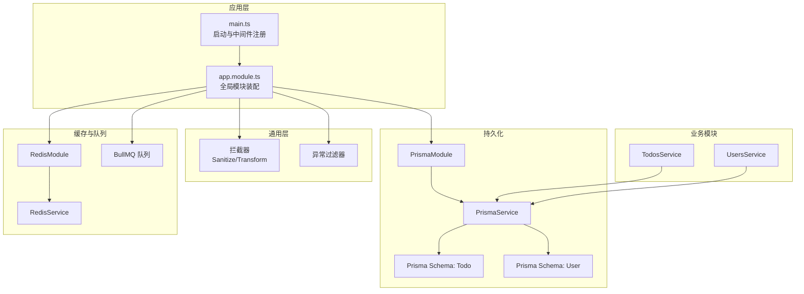
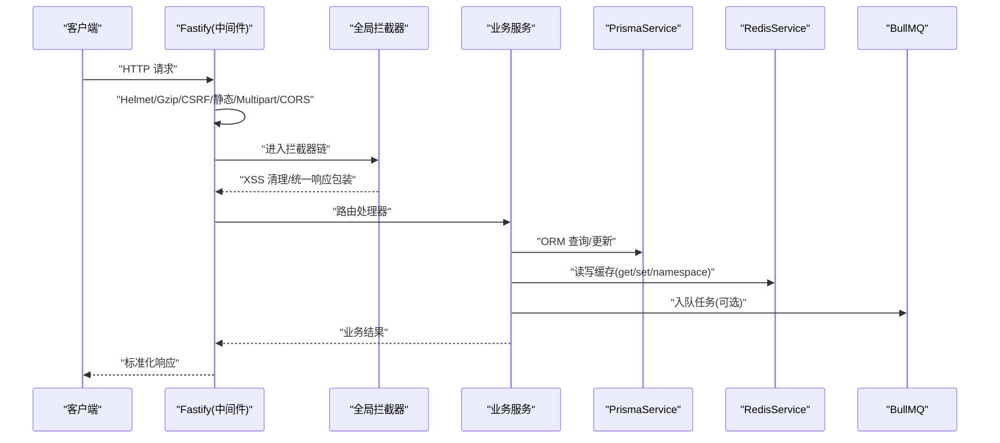
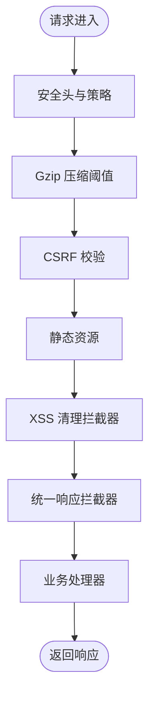
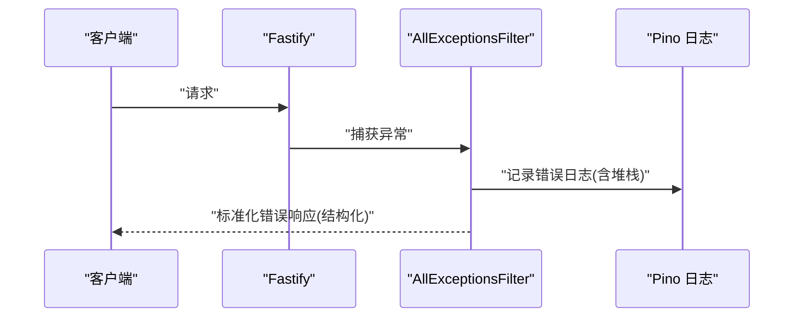
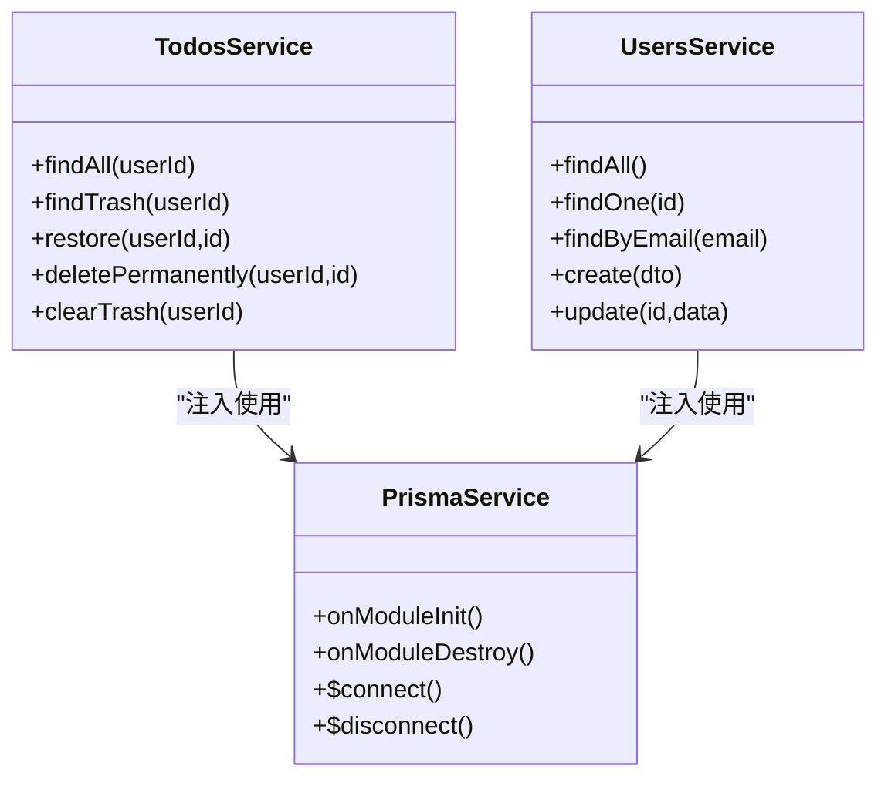
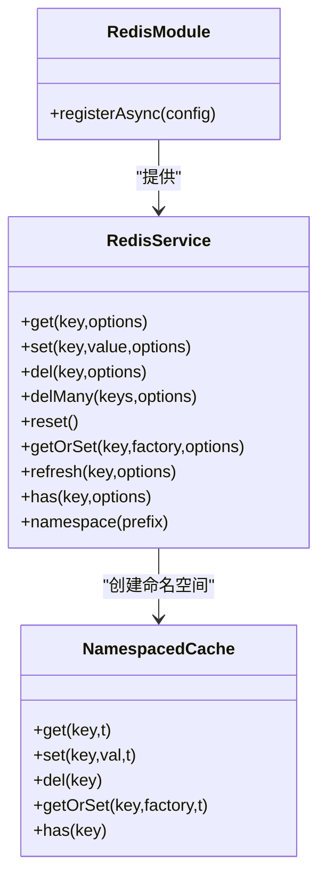
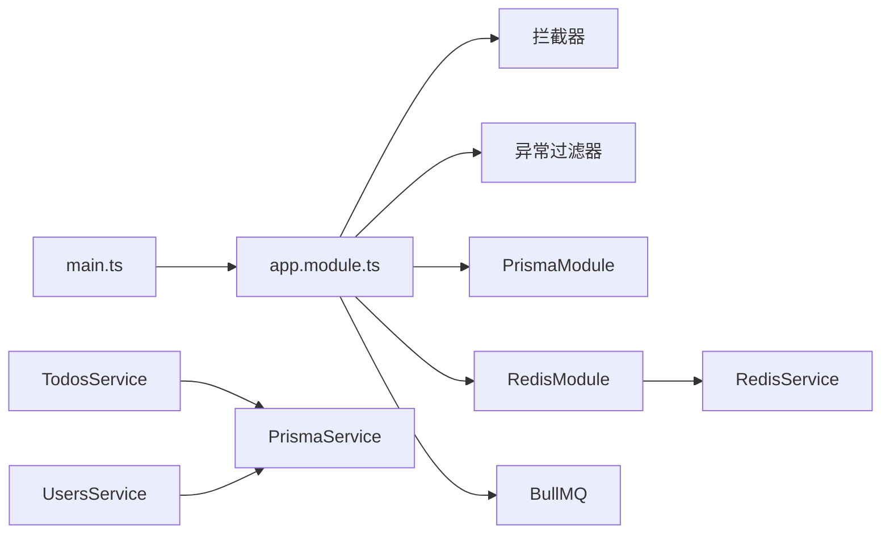

# 后端性能优化

<cite>
**本文引用的文件**
- [apps/backend/src/main.ts](file://apps/backend/src/main.ts)
- [apps/backend/src/app.module.ts](file://apps/backend/src/app.module.ts)
- [apps/backend/src/common/interceptors/sanitize.interceptor.ts](file://apps/backend/src/common/interceptors/sanitize.interceptor.ts)
- [apps/backend/src/common/interceptors/transform.interceptor.ts](file://apps/backend/src/common/interceptors/transform.interceptor.ts)
- [apps/backend/src/common/filters/all-exceptions.filter.ts](file://apps/backend/src/common/filters/all-exceptions.filter.ts)
- [apps/backend/src/prisma/prisma.service.ts](file://apps/backend/src/prisma/prisma.service.ts)
- [apps/backend/src/prisma/prisma.module.ts](file://apps/backend/src/prisma/prisma.module.ts)
- [apps/backend/src/todos/todos.service.ts](file://apps/backend/src/todos/todos.service.ts)
- [apps/backend/src/users/users.service.ts](file://apps/backend/src/users/users.service.ts)
- [apps/backend/src/redis/redis.module.ts](file://apps/backend/src/redis/redis.module.ts)
- [apps/backend/src/redis/redis.service.ts](file://apps/backend/src/redis/redis.service.ts)
- [apps/backend/prisma/schema/todo.prisma](file://apps/backend/prisma/schema/todo.prisma)
- [apps/backend/prisma/schema/user.prisma](file://apps/backend/prisma/schema/user.prisma)
- [apps/backend/package.json](file://apps/backend/package.json)
</cite>

## 目录
1. [简介](#简介)
2. [项目结构](#项目结构)
3. [核心组件](#核心组件)
4. [架构总览](#架构总览)
5. [详细组件分析](#详细组件分析)
6. [依赖关系分析](#依赖关系分析)
7. [性能考量](#性能考量)
8. [故障排查指南](#故障排查指南)
9. [结论](#结论)
10. [附录](#附录)

## 简介
本指南聚焦于 NestJS 后端在生产环境下的性能优化实践，围绕中间件与拦截器、ORM 查询、缓存与连接池、数据库连接与查询调优、异常过滤器、内存与 GC、并发与异步、以及 API 响应时间与吞吐量优化等方面展开。文档以仓库现有实现为基础，结合可落地的优化建议，帮助团队在不改变业务语义的前提下显著提升系统性能与稳定性。

## 项目结构
后端采用多模块组织，核心模块包括认证、用户、待办、邮件、事件、定时任务、MCP 等；全局层通过主入口注册安全中间件、压缩、静态资源、CSRF 校验、全局拦截器与异常过滤器；ORM 使用 Prisma，缓存使用 Redis，队列使用 BullMQ，日志使用 Pino。

**图表来源**
- [apps/backend/src/main.ts:34-201](file://apps/backend/src/main.ts#L34-L201)
- [apps/backend/src/app.module.ts:27-175](file://apps/backend/src/app.module.ts#L27-L175)
- [apps/backend/src/prisma/prisma.module.ts:1-10](file://apps/backend/src/prisma/prisma.module.ts#L1-L10)
- [apps/backend/src/prisma/prisma.service.ts:1-34](file://apps/backend/src/prisma/prisma.service.ts#L1-L34)
- [apps/backend/prisma/schema/todo.prisma:1-39](file://apps/backend/prisma/schema/todo.prisma#L1-L39)
- [apps/backend/prisma/schema/user.prisma:1-16](file://apps/backend/prisma/schema/user.prisma#L1-L16)
- [apps/backend/src/redis/redis.module.ts:1-84](file://apps/backend/src/redis/redis.module.ts#L1-L84)
- [apps/backend/src/redis/redis.service.ts:1-233](file://apps/backend/src/redis/redis.service.ts#L1-L233)

**章节来源**
- [apps/backend/src/main.ts:34-201](file://apps/backend/src/main.ts#L34-L201)
- [apps/backend/src/app.module.ts:27-175](file://apps/backend/src/app.module.ts#L27-L175)

## 核心组件
- 中间件与安全层：Helmet、Gzip 压缩、CSRF 校验、静态资源、CORS、Cookie、Multipart。
- 全局拦截器：XSS 清理拦截器、统一响应格式拦截器。
- 全局异常过滤器：统一错误响应、国际化与结构化错误对象。
- ORM 层：Prisma + PostgreSQL，连接池由适配器与 pg.Pool 提供。
- 缓存层：Redis，基于 cache-manager + ioredis yet，支持命名空间、批量删除、穿透保护。
- 队列层：BullMQ，指数退避与完成即删策略。
- 日志层：Pino，按状态码自定义日志级别与序列化。

**章节来源**
- [apps/backend/src/main.ts:48-170](file://apps/backend/src/main.ts#L48-L170)
- [apps/backend/src/common/interceptors/sanitize.interceptor.ts:1-64](file://apps/backend/src/common/interceptors/sanitize.interceptor.ts#L1-L64)
- [apps/backend/src/common/interceptors/transform.interceptor.ts:1-30](file://apps/backend/src/common/interceptors/transform.interceptor.ts#L1-L30)
- [apps/backend/src/common/filters/all-exceptions.filter.ts:1-137](file://apps/backend/src/common/filters/all-exceptions.filter.ts#L1-L137)
- [apps/backend/src/prisma/prisma.service.ts:1-34](file://apps/backend/src/prisma/prisma.service.ts#L1-L34)
- [apps/backend/src/redis/redis.module.ts:1-84](file://apps/backend/src/redis/redis.module.ts#L1-L84)
- [apps/backend/src/redis/redis.service.ts:1-233](file://apps/backend/src/redis/redis.service.ts#L1-L233)
- [apps/backend/src/app.module.ts:96-138](file://apps/backend/src/app.module.ts#L96-L138)

## 架构总览
下图展示请求从进入 Fastify 到最终返回的路径，以及与 ORM、缓存、队列的关键交互点。

**图表来源**
- [apps/backend/src/main.ts:115-170](file://apps/backend/src/main.ts#L115-L170)
- [apps/backend/src/common/interceptors/sanitize.interceptor.ts:17-36](file://apps/backend/src/common/interceptors/sanitize.interceptor.ts#L17-L36)
- [apps/backend/src/common/interceptors/transform.interceptor.ts:20-28](file://apps/backend/src/common/interceptors/transform.interceptor.ts#L20-L28)
- [apps/backend/src/todos/todos.service.ts:37-144](file://apps/backend/src/todos/todos.service.ts#L37-L144)
- [apps/backend/src/users/users.service.ts:19-108](file://apps/backend/src/users/users.service.ts#L19-L108)
- [apps/backend/src/prisma/prisma.service.ts:23-32](file://apps/backend/src/prisma/prisma.service.ts#L23-L32)
- [apps/backend/src/redis/redis.service.ts:86-161](file://apps/backend/src/redis/redis.service.ts#L86-L161)
- [apps/backend/src/app.module.ts:96-115](file://apps/backend/src/app.module.ts#L96-L115)

## 详细组件分析

### 中间件与拦截器优化
- 安全与传输优化
  - Helmet 内容安全策略、跨源策略与权限策略，降低 XSS、点击劫持风险。
  - Gzip 压缩阈值与 zlib 级别，减少网络传输体积。
  - Cookie、CSRF 校验与静态资源托管，统一入口控制。
- 拦截器链路
  - XSS 清理拦截器对请求体、查询与路径参数进行原地递归清理，避免 HTML 注入。
  - 统一响应拦截器将成功响应包装为统一结构，便于前端消费与监控。
- 性能建议
  - 将昂贵的清理逻辑限定在非幂等请求；对 GET/HEAD/OPTIONS 快路径放行。
  - 对大型响应启用流式输出或分页，避免一次性序列化大对象。
  - 在网关/反向代理层开启上游压缩，减少重复压缩。

**图表来源**
- [apps/backend/src/main.ts:84-122](file://apps/backend/src/main.ts#L84-L122)
- [apps/backend/src/common/interceptors/sanitize.interceptor.ts:17-62](file://apps/backend/src/common/interceptors/sanitize.interceptor.ts#L17-L62)
- [apps/backend/src/common/interceptors/transform.interceptor.ts:20-28](file://apps/backend/src/common/interceptors/transform.interceptor.ts#L20-L28)

**章节来源**
- [apps/backend/src/main.ts:84-122](file://apps/backend/src/main.ts#L84-L122)
- [apps/backend/src/common/interceptors/sanitize.interceptor.ts:17-62](file://apps/backend/src/common/interceptors/sanitize.interceptor.ts#L17-L62)
- [apps/backend/src/common/interceptors/transform.interceptor.ts:20-28](file://apps/backend/src/common/interceptors/transform.interceptor.ts#L20-L28)

### 异常过滤器的性能影响与优化
- 统一错误响应：记录请求方法、URL、状态码与堆栈，返回结构化错误对象，便于前端与监控系统处理。
- 国际化与 Zod 错误映射：将字段路径与验证错误映射为本地化消息，避免重复解析。
- 性能建议
  - 控制日志级别与序列化开销，避免在高频错误场景中产生大量堆栈字符串。
  - 对重复错误进行去重上报，降低日志风暴。
  - 将严重错误与业务错误分离，避免在业务异常上做过多国际化计算。

**图表来源**
- [apps/backend/src/common/filters/all-exceptions.filter.ts:27-135](file://apps/backend/src/common/filters/all-exceptions.filter.ts#L27-L135)

**章节来源**
- [apps/backend/src/common/filters/all-exceptions.filter.ts:27-135](file://apps/backend/src/common/filters/all-exceptions.filter.ts#L27-L135)

### Prisma ORM 查询优化
- 连接与连接池
  - 使用 PrismaPg + pg.Pool 提供连接池，避免每次请求新建连接。
  - onModuleInit/onModuleDestroy 生命周期中显式 connect/disconnect 与 pool.end，保证优雅关停。
- 查询选择与索引
  - 业务查询尽量使用 select 精确字段，减少序列化与网络传输。
  - 模型已建立复合索引与单列索引，覆盖常见过滤与排序场景。
- 事务与批量
  - 事务包裹相关写操作，减少锁竞争与一致性问题。
  - 批量插入/删除时利用 skipDuplicates 与批量 API，降低往返次数。
- 性能建议
  - 使用事务合并多次写入，减少网络与锁开销。
  - 对热点查询引入缓存，配合 TTL 与穿透保护。
  - 使用游标分页或基于索引的 limit+offset，避免全表扫描。

**图表来源**
- [apps/backend/src/prisma/prisma.service.ts:23-32](file://apps/backend/src/prisma/prisma.service.ts#L23-L32)
- [apps/backend/src/todos/todos.service.ts:37-144](file://apps/backend/src/todos/todos.service.ts#L37-L144)
- [apps/backend/src/users/users.service.ts:19-108](file://apps/backend/src/users/users.service.ts#L19-L108)

**章节来源**
- [apps/backend/src/prisma/prisma.service.ts:1-34](file://apps/backend/src/prisma/prisma.service.ts#L1-L34)
- [apps/backend/src/todos/todos.service.ts:37-144](file://apps/backend/src/todos/todos.service.ts#L37-L144)
- [apps/backend/src/users/users.service.ts:19-108](file://apps/backend/src/users/users.service.ts#L19-L108)
- [apps/backend/prisma/schema/todo.prisma:23-27](file://apps/backend/prisma/schema/todo.prisma#L23-L27)
- [apps/backend/prisma/schema/user.prisma:3](file://apps/backend/prisma/schema/user.prisma#L3)

### Redis 缓存策略与连接池配置
- 连接与存储
  - 通过 redisStore 配置主机、端口、密码、DB、keyPrefix、TTL、重试策略与 ready 检测。
  - 默认 TTL 与命名空间封装，便于按域隔离与批量失效。
- 常用操作
  - get/set/del/delMany/reset/getOrSet/refresh/has/namespace 等，覆盖读写、穿透保护与 TTL 刷新。
- 性能建议
  - 对高并发读取场景启用只读副本或多实例，降低单点压力。
  - 使用命名空间隔离不同业务域，避免键冲突与误删。
  - 对批量删除使用 Promise.all 并发删除，注意限速避免阻塞。

**图表来源**
- [apps/backend/src/redis/redis.module.ts:29-78](file://apps/backend/src/redis/redis.module.ts#L29-L78)
- [apps/backend/src/redis/redis.service.ts:52-202](file://apps/backend/src/redis/redis.service.ts#L52-L202)

**章节来源**
- [apps/backend/src/redis/redis.module.ts:29-78](file://apps/backend/src/redis/redis.module.ts#L29-L78)
- [apps/backend/src/redis/redis.service.ts:86-161](file://apps/backend/src/redis/redis.service.ts#L86-L161)
- [apps/backend/src/redis/redis.service.ts:199-232](file://apps/backend/src/redis/redis.service.ts#L199-L232)

### 数据库连接优化与查询性能调优
- 连接池
  - Prisma 使用 PrismaPg + pg.Pool，避免频繁创建/销毁连接。
  - onModuleInit/onModuleDestroy 管理生命周期，确保关停时释放连接。
- 查询优化
  - 使用 select 精选字段，减少序列化与网络传输。
  - 利用模型索引（如用户+时间、到期/提醒时间等）加速过滤与排序。
  - 事务合并写操作，减少锁竞争。
- 性能建议
  - 对热点读取引入 Redis 缓存，结合 getOrSet 与 refresh。
  - 使用游标分页或基于索引的分页策略，避免 deep pagination。
  - 定期分析慢查询，补充必要索引或重构查询。

**章节来源**
- [apps/backend/src/prisma/prisma.service.ts:17-32](file://apps/backend/src/prisma/prisma.service.ts#L17-L32)
- [apps/backend/prisma/schema/todo.prisma:23-27](file://apps/backend/prisma/schema/todo.prisma#L23-L27)
- [apps/backend/src/todos/todos.service.ts:37-144](file://apps/backend/src/todos/todos.service.ts#L37-L144)

### 并发处理与异步最佳实践
- Fastify 异步模型：请求处理天然异步，避免阻塞 IO。
- 拦截器与过滤器：保持无副作用、纯函数式处理，避免在链路中引入同步阻塞。
- 事务与批量：在服务层使用事务合并写入，批量删除使用 Promise.all 并发执行。
- 队列：BullMQ 默认移除完成任务与指数退避，降低堆积与重试成本。

**章节来源**
- [apps/backend/src/main.ts:160-169](file://apps/backend/src/main.ts#L160-L169)
- [apps/backend/src/redis/redis.service.ts:125-132](file://apps/backend/src/redis/redis.service.ts#L125-L132)
- [apps/backend/src/app.module.ts:96-115](file://apps/backend/src/app.module.ts#L96-L115)

### API 响应时间优化与吞吐量提升策略
- 响应时间
  - 启用 Gzip 压缩与静态资源托管，减少传输体积。
  - 统一响应拦截器减少重复封装逻辑。
  - 异常过滤器结构化错误，避免前端二次解析。
- 吞吐量
  - 使用连接池与事务合并写入，降低数据库往返。
  - Redis 命名空间与批量操作，提升缓存命中率与写入效率。
  - BullMQ 完成即删与退避策略，维持队列健康。

**章节来源**
- [apps/backend/src/main.ts:101-104](file://apps/backend/src/main.ts#L101-L104)
- [apps/backend/src/common/interceptors/transform.interceptor.ts:20-28](file://apps/backend/src/common/interceptors/transform.interceptor.ts#L20-L28)
- [apps/backend/src/redis/redis.service.ts:125-132](file://apps/backend/src/redis/redis.service.ts#L125-L132)
- [apps/backend/src/app.module.ts:105-114](file://apps/backend/src/app.module.ts#L105-L114)

## 依赖关系分析
- 主入口依赖全局模块与中间件，统一注册安全与传输层能力。
- 业务服务依赖 PrismaService 进行数据访问，部分场景依赖 RedisService 进行缓存。
- 全局拦截器与异常过滤器贯穿所有请求，需保持轻量与稳定。

**图表来源**
- [apps/backend/src/main.ts:34-201](file://apps/backend/src/main.ts#L34-L201)
- [apps/backend/src/app.module.ts:27-175](file://apps/backend/src/app.module.ts#L27-L175)
- [apps/backend/src/todos/todos.service.ts:28-32](file://apps/backend/src/todos/todos.service.ts#L28-L32)
- [apps/backend/src/users/users.service.ts:14](file://apps/backend/src/users/users.service.ts#L14)
- [apps/backend/src/redis/redis.module.ts:1-84](file://apps/backend/src/redis/redis.module.ts#L1-L84)

**章节来源**
- [apps/backend/src/main.ts:34-201](file://apps/backend/src/main.ts#L34-L201)
- [apps/backend/src/app.module.ts:27-175](file://apps/backend/src/app.module.ts#L27-L175)

## 性能考量
- 内存与垃圾回收
  - 构建脚本增加最大堆大小参数，缓解类型检查与构建阶段内存压力。
  - 业务层避免创建超大临时对象，优先使用流式处理与分页。
- 日志与可观测性
  - Pino 按状态码自定义日志级别，减少高亮日志噪声。
  - 异常过滤器记录堆栈，便于定位问题但需控制频率。
- 安全与性能平衡
  - Helmet 与 Gzip 在安全性与性能之间取得平衡。
  - CSRF 校验在非幂等请求上快速失败，避免无效处理。

**章节来源**
- [apps/backend/package.json:8-14](file://apps/backend/package.json#L8-L14)
- [apps/backend/src/app.module.ts:57-87](file://apps/backend/src/app.module.ts#L57-L87)
- [apps/backend/src/common/filters/all-exceptions.filter.ts:40-45](file://apps/backend/src/common/filters/all-exceptions.filter.ts#L40-L45)

## 故障排查指南
- 启动失败
  - 检查 DATABASE_URL 是否配置，Prisma 初始化是否抛出异常。
  - 检查 Redis 连接参数与重试策略日志。
- 响应异常
  - 查看 AllExceptionsFilter 的错误日志与结构化错误对象，确认国际化键与 Zod 映射。
- 缓存问题
  - 使用 reset()/delMany() 进行批量清理，确认命名空间前缀与 TTL。
- 数据库慢查询
  - 结合模型索引与查询计划，评估是否需要补充索引或调整查询策略。

**章节来源**
- [apps/backend/src/prisma/prisma.service.ts:11-21](file://apps/backend/src/prisma/prisma.service.ts#L11-L21)
- [apps/backend/src/redis/redis.service.ts:137-144](file://apps/backend/src/redis/redis.service.ts#L137-L144)
- [apps/backend/src/common/filters/all-exceptions.filter.ts:40-45](file://apps/backend/src/common/filters/all-exceptions.filter.ts#L40-L45)

## 结论
通过在安全中间件、拦截器链、ORM 查询、缓存与队列上的系统性优化，可在不牺牲可维护性的前提下显著提升系统的响应时间与吞吐量。建议持续关注日志与指标，结合实际流量特征迭代索引与缓存策略，并在发布前进行压测与回归验证。

## 附录
- 关键实现位置参考
  - 启动与中间件注册：[apps/backend/src/main.ts:34-201](file://apps/backend/src/main.ts#L34-L201)
  - 全局模块装配与队列/缓存配置：[apps/backend/src/app.module.ts:27-175](file://apps/backend/src/app.module.ts#L27-L175)
  - XSS 清理拦截器：[apps/backend/src/common/interceptors/sanitize.interceptor.ts:1-64](file://apps/backend/src/common/interceptors/sanitize.interceptor.ts#L1-L64)
  - 统一响应拦截器：[apps/backend/src/common/interceptors/transform.interceptor.ts:1-30](file://apps/backend/src/common/interceptors/transform.interceptor.ts#L1-L30)
  - 异常过滤器：[apps/backend/src/common/filters/all-exceptions.filter.ts:1-137](file://apps/backend/src/common/filters/all-exceptions.filter.ts#L1-L137)
  - Prisma 连接池与生命周期：[apps/backend/src/prisma/prisma.service.ts:1-34](file://apps/backend/src/prisma/prisma.service.ts#L1-L34)
  - Redis 连接与缓存操作：[apps/backend/src/redis/redis.module.ts:1-84](file://apps/backend/src/redis/redis.module.ts#L1-L84), [apps/backend/src/redis/redis.service.ts:1-233](file://apps/backend/src/redis/redis.service.ts#L1-L233)
  - 模型索引与查询示例：[apps/backend/prisma/schema/todo.prisma:1-39](file://apps/backend/prisma/schema/todo.prisma#L1-L39), [apps/backend/prisma/schema/user.prisma:1-16](file://apps/backend/prisma/schema/user.prisma#L1-L16)
  - 业务服务查询与事务：[apps/backend/src/todos/todos.service.ts:1-146](file://apps/backend/src/todos/todos.service.ts#L1-L146), [apps/backend/src/users/users.service.ts:1-110](file://apps/backend/src/users/users.service.ts#L1-L110)