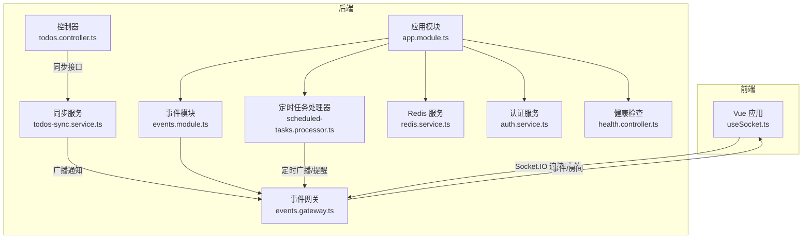
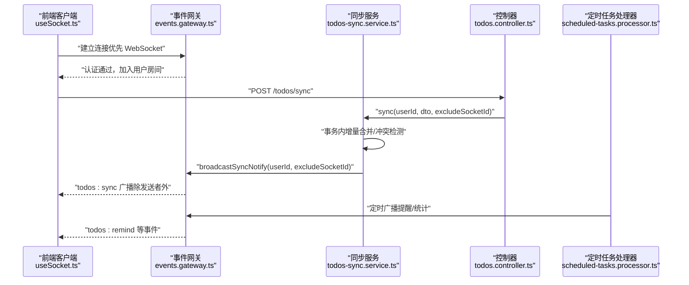
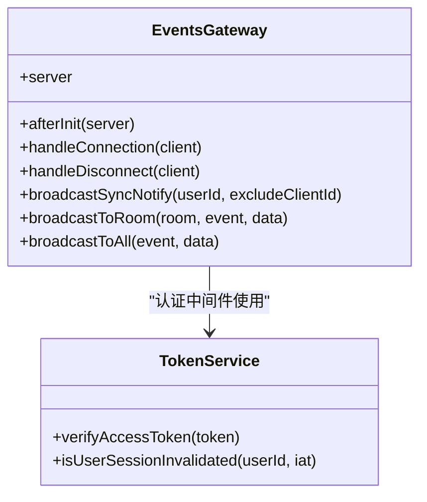
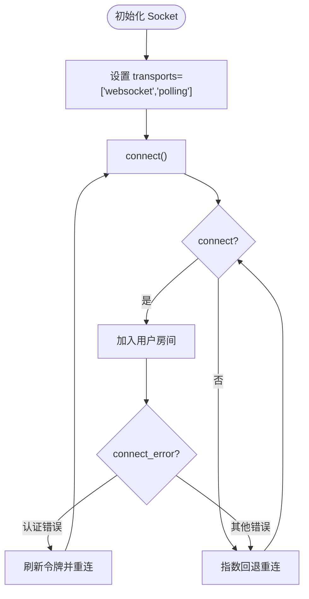
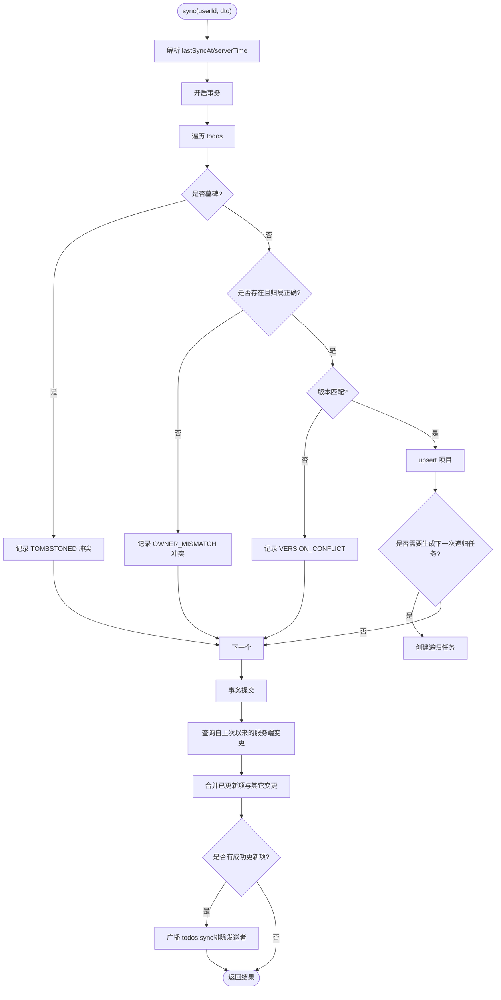
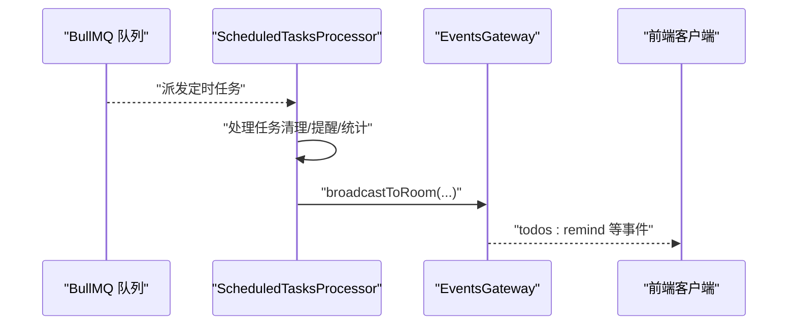
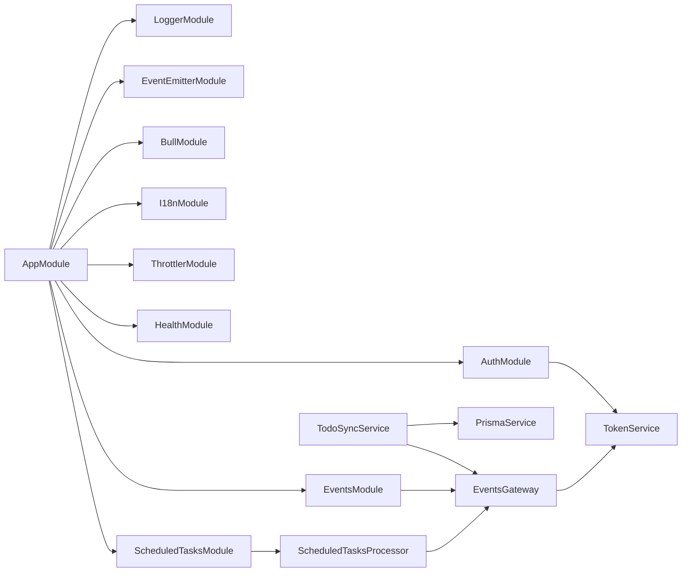

# 实时通信优化

<cite>
**本文引用的文件**
- [apps/backend/src/events/events.gateway.ts](file://apps/backend/src/events/events.gateway.ts)
- [apps/backend/src/events/events.module.ts](file://apps/backend/src/events/events.module.ts)
- [apps/frontend/src/composables/useSocket.ts](file://apps/frontend/src/composables/useSocket.ts)
- [apps/backend/src/todos/todos-sync.service.ts](file://apps/backend/src/todos/todos-sync.service.ts)
- [apps/backend/src/todos/todos.controller.ts](file://apps/backend/src/todos/todos.controller.ts)
- [apps/backend/src/scheduled-tasks/scheduled-tasks.processor.ts](file://apps/backend/src/scheduled-tasks/scheduled-tasks.processor.ts)
- [apps/backend/src/redis/redis.service.ts](file://apps/backend/src/redis/redis.service.ts)
- [apps/backend/src/app.module.ts](file://apps/backend/src/app.module.ts)
- [apps/backend/src/auth/auth.service.ts](file://apps/backend/src/auth/auth.service.ts)
- [apps/backend/src/health/health.controller.ts](file://apps/backend/src/health/health.controller.ts)
</cite>

## 目录
1. [引言](#引言)
2. [项目结构](#项目结构)
3. [核心组件](#核心组件)
4. [架构总览](#架构总览)
5. [详细组件分析](#详细组件分析)
6. [依赖关系分析](#依赖关系分析)
7. [性能考量](#性能考量)
8. [故障排查指南](#故障排查指南)
9. [结论](#结论)
10. [附录](#附录)

## 引言
本指南聚焦于实时通信性能优化，围绕以下主题展开：Socket.IO 连接管理与心跳优化、WebSocket 消息压缩与传输策略、事件驱动架构中的性能瓶颈识别与解决方案、大规模并发连接与负载均衡策略、消息队列优化与异步处理机制、客户端连接状态与重连优化、实时数据同步的性能与冲突解决策略，以及监控与性能指标分析方法。文档基于仓库中现有的 WebSocket 网关、客户端封装、同步服务、定时任务与队列、缓存与健康检查等实现进行深入剖析，并提供可落地的优化建议。

## 项目结构
后端采用 NestJS 架构，前端为 Vue 应用，实时通信通过 Socket.IO 实现。核心模块包括：
- 事件网关与模块：负责 WebSocket 连接、鉴权、房间管理与广播
- 客户端封装：统一 Socket.IO 客户端初始化、重连与认证
- 同步服务：增量同步、冲突检测与合并、广播通知
- 定时任务与队列：BullMQ 后台任务处理与事件网关联动
- 缓存与健康检查：Redis 缓存与系统健康探针
- 认证服务：令牌刷新与登出，支撑客户端重连时的认证续期

**图表来源**
- [apps/backend/src/events/events.gateway.ts:1-266](file://apps/backend/src/events/events.gateway.ts#L1-L266)
- [apps/backend/src/events/events.module.ts:1-15](file://apps/backend/src/events/events.module.ts#L1-L15)
- [apps/frontend/src/composables/useSocket.ts:1-176](file://apps/frontend/src/composables/useSocket.ts#L1-L176)
- [apps/backend/src/todos/todos-sync.service.ts:1-221](file://apps/backend/src/todos/todos-sync.service.ts#L1-L221)
- [apps/backend/src/todos/todos.controller.ts:1-70](file://apps/backend/src/todos/todos.controller.ts#L1-L70)
- [apps/backend/src/scheduled-tasks/scheduled-tasks.processor.ts:1-290](file://apps/backend/src/scheduled-tasks/scheduled-tasks.processor.ts#L1-L290)
- [apps/backend/src/redis/redis.service.ts:1-233](file://apps/backend/src/redis/redis.service.ts#L1-L233)
- [apps/backend/src/auth/auth.service.ts:1-127](file://apps/backend/src/auth/auth.service.ts#L1-L127)
- [apps/backend/src/health/health.controller.ts:1-77](file://apps/backend/src/health/health.controller.ts#L1-L77)
- [apps/backend/src/app.module.ts:1-175](file://apps/backend/src/app.module.ts#L1-L175)

**章节来源**
- [apps/backend/src/app.module.ts:1-175](file://apps/backend/src/app.module.ts#L1-L175)
- [apps/backend/src/events/events.module.ts:1-15](file://apps/backend/src/events/events.module.ts#L1-L15)

## 核心组件
- 事件网关（Socket.IO）：提供认证中间件、房间管理、广播、用户私有房间、连接生命周期管理与定时器清理
- 客户端封装（Socket.IO）：统一初始化、优先 WebSocket、指数回退重连、认证错误自动刷新与重连
- 同步服务：事务内增量合并、严格版本冲突检测、服务端变更拉取、广播通知去抖
- 定时任务处理器：定时提醒、清理过期数据、每日统计，与事件网关联动广播
- 缓存服务：键前缀、批量删除、穿透保护、命名空间缓存
- 认证服务：令牌刷新与登出，保障客户端重连时的认证续期
- 健康检查：数据库、Redis、内存、磁盘健康检查

**章节来源**
- [apps/backend/src/events/events.gateway.ts:1-266](file://apps/backend/src/events/events.gateway.ts#L1-L266)
- [apps/frontend/src/composables/useSocket.ts:1-176](file://apps/frontend/src/composables/useSocket.ts#L1-L176)
- [apps/backend/src/todos/todos-sync.service.ts:1-221](file://apps/backend/src/todos/todos-sync.service.ts#L1-L221)
- [apps/backend/src/scheduled-tasks/scheduled-tasks.processor.ts:1-290](file://apps/backend/src/scheduled-tasks/scheduled-tasks.processor.ts#L1-L290)
- [apps/backend/src/redis/redis.service.ts:1-233](file://apps/backend/src/redis/redis.service.ts#L1-L233)
- [apps/backend/src/auth/auth.service.ts:1-127](file://apps/backend/src/auth/auth.service.ts#L1-L127)
- [apps/backend/src/health/health.controller.ts:1-77](file://apps/backend/src/health/health.controller.ts#L1-L77)

## 架构总览
实时通信链路由前端 Socket.IO 客户端发起连接，经后端认证中间件校验，进入事件网关；业务侧通过控制器调用同步服务，同步完成后通过事件网关向用户房间广播；定时任务处理器周期性触发广播与清理；Redis 作为缓存层辅助；健康检查保障系统可用性。

**图表来源**
- [apps/frontend/src/composables/useSocket.ts:1-176](file://apps/frontend/src/composables/useSocket.ts#L1-L176)
- [apps/backend/src/events/events.gateway.ts:1-266](file://apps/backend/src/events/events.gateway.ts#L1-L266)
- [apps/backend/src/todos/todos-sync.service.ts:1-221](file://apps/backend/src/todos/todos-sync.service.ts#L1-L221)
- [apps/backend/src/todos/todos.controller.ts:1-70](file://apps/backend/src/todos/todos.controller.ts#L1-L70)
- [apps/backend/src/scheduled-tasks/scheduled-tasks.processor.ts:1-290](file://apps/backend/src/scheduled-tasks/scheduled-tasks.processor.ts#L1-L290)

## 详细组件分析

### 事件网关（Socket.IO）与连接管理
- CORS 与传输：显式配置允许的来源与凭证，transports 同时支持 polling 与 websocket，便于在不同网络环境下选择最优传输
- 认证中间件：从握手参数或头部提取令牌，验证后写入 socket.data.user，确保后续事件处理的安全性
- 房间与广播：自动加入用户私有房间 user:{id}，支持按房间广播与 except 排除特定客户端
- 去抖广播：针对同一用户在短时间内多次变更，使用定时器合并为一次广播，降低广播风暴
- 生命周期：模块销毁时清理定时器，避免内存泄漏

**图表来源**
- [apps/backend/src/events/events.gateway.ts:1-266](file://apps/backend/src/events/events.gateway.ts#L1-L266)

**章节来源**
- [apps/backend/src/events/events.gateway.ts:1-266](file://apps/backend/src/events/events.gateway.ts#L1-L266)

### 客户端连接状态与重连优化
- 传输优先级：优先使用 websocket，必要时回退到 polling，减少 400 错误
- 重连策略：最大重连次数、基础延迟与最大延迟、随机抖动因子，避免雪崩效应
- 认证错误处理：当出现 unauthorized 或 token 相关错误时，自动刷新令牌并重连
- 连接等待：提供 waitForConnection 能力，支持超时控制与一次性事件监听清理

**图表来源**
- [apps/frontend/src/composables/useSocket.ts:1-176](file://apps/frontend/src/composables/useSocket.ts#L1-L176)

**章节来源**
- [apps/frontend/src/composables/useSocket.ts:1-176](file://apps/frontend/src/composables/useSocket.ts#L1-L176)

### 实时数据同步与冲突解决
- 增量合并：事务内逐项 upsert，严格版本匹配，避免客户端时钟漂移导致的并发冲突
- 冲突检测：TOMBSTONED、OWNER_MISMATCH、VERSION_CONFLICT 三类冲突分类返回
- 递归任务处理：根据有效规则与时区生成下一次衍生任务，保持服务端一致性
- 广播通知：仅在成功更新项存在时触发广播，且支持排除发送者，减少重复渲染

**图表来源**
- [apps/backend/src/todos/todos-sync.service.ts:1-221](file://apps/backend/src/todos/todos-sync.service.ts#L1-L221)
- [apps/backend/src/events/events.gateway.ts:180-202](file://apps/backend/src/events/events.gateway.ts#L180-L202)

**章节来源**
- [apps/backend/src/todos/todos-sync.service.ts:1-221](file://apps/backend/src/todos/todos-sync.service.ts#L1-L221)
- [apps/backend/src/todos/todos.controller.ts:1-70](file://apps/backend/src/todos/todos.controller.ts#L1-L70)

### 消息队列优化与异步处理
- BullMQ 队列：默认作业选项包含移除完成/失败保留、失败重试与指数退避，适合高吞吐场景
- 定时任务处理器：健康检查、清理过期数据、待办提醒、每日统计，均通过事件网关广播到用户房间
- 事件网关集成：处理器在执行期间可直接调用事件网关进行广播，形成“队列 -> 事件 -> 客户端”的解耦链路

**图表来源**
- [apps/backend/src/scheduled-tasks/scheduled-tasks.processor.ts:1-290](file://apps/backend/src/scheduled-tasks/scheduled-tasks.processor.ts#L1-L290)
- [apps/backend/src/events/events.gateway.ts:255-264](file://apps/backend/src/events/events.gateway.ts#L255-L264)

**章节来源**
- [apps/backend/src/scheduled-tasks/scheduled-tasks.processor.ts:1-290](file://apps/backend/src/scheduled-tasks/scheduled-tasks.processor.ts#L1-L290)
- [apps/backend/src/app.module.ts:96-115](file://apps/backend/src/app.module.ts#L96-L115)

### 缓存与健康检查
- 缓存服务：提供键前缀、批量删除、穿透保护、命名空间缓存等能力，支持 TTL 管理与客户端获取
- 健康检查：数据库、Redis、内存堆/常驻集、磁盘存储的综合检查，支持存活与就绪探针

**章节来源**
- [apps/backend/src/redis/redis.service.ts:1-233](file://apps/backend/src/redis/redis.service.ts#L1-L233)
- [apps/backend/src/health/health.controller.ts:1-77](file://apps/backend/src/health/health.controller.ts#L1-L77)

## 依赖关系分析
- 应用模块装配：引入日志、事件发射器、队列、国际化、限流、健康检查、认证、事件网关、定时任务、MCP 等模块
- 事件网关依赖：认证模块提供令牌服务，用于握手阶段的鉴权
- 同步服务依赖：Prisma 数据库与事件网关，事务内写入与广播通知
- 定时任务依赖：Prisma 与事件网关，定期广播与清理

**图表来源**
- [apps/backend/src/app.module.ts:1-175](file://apps/backend/src/app.module.ts#L1-L175)
- [apps/backend/src/events/events.module.ts:1-15](file://apps/backend/src/events/events.module.ts#L1-L15)
- [apps/backend/src/events/events.gateway.ts:1-266](file://apps/backend/src/events/events.gateway.ts#L1-L266)
- [apps/backend/src/todos/todos-sync.service.ts:1-221](file://apps/backend/src/todos/todos-sync.service.ts#L1-L221)
- [apps/backend/src/scheduled-tasks/scheduled-tasks.processor.ts:1-290](file://apps/backend/src/scheduled-tasks/scheduled-tasks.processor.ts#L1-L290)

**章节来源**
- [apps/backend/src/app.module.ts:1-175](file://apps/backend/src/app.module.ts#L1-L175)

## 性能考量
- 连接与传输
  - 优先 WebSocket，必要时回退 polling，减少握手与长轮询开销
  - 控制 CORS 与允许头，避免预检风暴
- 广播与房间
  - 使用用户私有房间，避免全量广播
  - 对高频广播进行去抖（如 todos:sync），合并短时间内的多次变更
- 事务与数据库
  - 同步过程使用事务，减少中间态与重复查询
  - 严格版本匹配避免冲突回滚与重试风暴
- 队列与异步
  - BullMQ 指数退避与失败重试，避免瞬时峰值压垮下游
  - 将耗时任务放入队列，事件网关仅做广播
- 缓存
  - 使用命名空间与前缀管理键，批量删除与穿透保护降低缓存失效成本
- 监控与健康
  - 健康检查覆盖数据库、Redis、内存与磁盘，结合日志模块定位瓶颈

[本节为通用性能指导，无需具体文件分析]

## 故障排查指南
- 连接失败
  - 检查 CORS 配置与凭证，确认允许的来源列表
  - 观察 connect_error 事件，区分网络错误与认证错误
  - 认证错误时，确认令牌刷新流程与事件网关中间件是否正常
- 广播异常
  - 确认用户房间加入与权限校验逻辑
  - 检查广播去抖定时器是否正确清理与释放
- 同步冲突
  - 关注 VERSION_CONFLICT 的原因与 serverVersion，避免客户端时钟漂移
  - 核对 OWNER_MISMATCH 与 TOMBSTONED 的边界条件
- 队列堆积
  - 查看失败重试与退避策略，确认作业是否持续失败
  - 检查事件网关广播是否阻塞或异常
- 缓存问题
  - 使用命名空间缓存，避免键冲突
  - 批量删除与穿透保护可缓解缓存穿透与雪崩
- 健康检查
  - 存活与就绪探针分别用于容器编排，关注数据库与 Redis 健康状态

**章节来源**
- [apps/frontend/src/composables/useSocket.ts:60-93](file://apps/frontend/src/composables/useSocket.ts#L60-L93)
- [apps/backend/src/events/events.gateway.ts:86-124](file://apps/backend/src/events/events.gateway.ts#L86-L124)
- [apps/backend/src/todos/todos-sync.service.ts:111-122](file://apps/backend/src/todos/todos-sync.service.ts#L111-L122)
- [apps/backend/src/scheduled-tasks/scheduled-tasks.processor.ts:280-289](file://apps/backend/src/scheduled-tasks/scheduled-tasks.processor.ts#L280-L289)
- [apps/backend/src/redis/redis.service.ts:124-132](file://apps/backend/src/redis/redis.service.ts#L124-L132)
- [apps/backend/src/health/health.controller.ts:1-77](file://apps/backend/src/health/health.controller.ts#L1-L77)

## 结论
本项目在实时通信方面具备完善的基础设施：Socket.IO 网关、认证中间件、房间与广播、客户端重连与去抖广播、同步事务与冲突检测、BullMQ 队列与定时任务、Redis 缓存与健康检查。通过优先 WebSocket、严格的版本冲突检测、广播去抖与队列异步化，可在高并发场景下显著降低广播风暴与数据库压力。建议在生产环境中进一步结合负载均衡、连接池与限流策略，持续监控健康检查与日志指标，以获得更稳健的实时体验。

[本节为总结，无需具体文件分析]

## 附录
- WebSocket 传输优化建议
  - 保持 transports 顺序为 websocket 优先，polling 作为兜底
  - 在反向代理（如 Nginx）中启用 WebSocket 升级与长连接
- 心跳与空闲连接
  - Socket.IO 默认心跳与 ping/pong 已满足大多数场景，可根据网络质量调整
  - 对长时间空闲连接进行主动断开，释放资源
- 消息压缩
  - 对大体量 JSON 文本考虑启用传输层压缩（如 gzip），但需权衡 CPU 与延迟
- 大规模并发与负载均衡
  - 使用多实例部署与共享 Redis/队列，确保广播与状态一致性
  - 通过会话亲和或无状态设计，避免跨节点状态丢失
- 实时监控与指标
  - 连接数、消息吞吐、广播频率、队列积压、数据库慢查询、内存与 CPU 使用率
  - 结合健康检查端点与日志模块，建立告警与自动扩缩容

[本节为通用指导，无需具体文件分析]